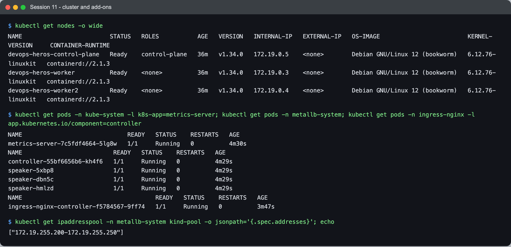
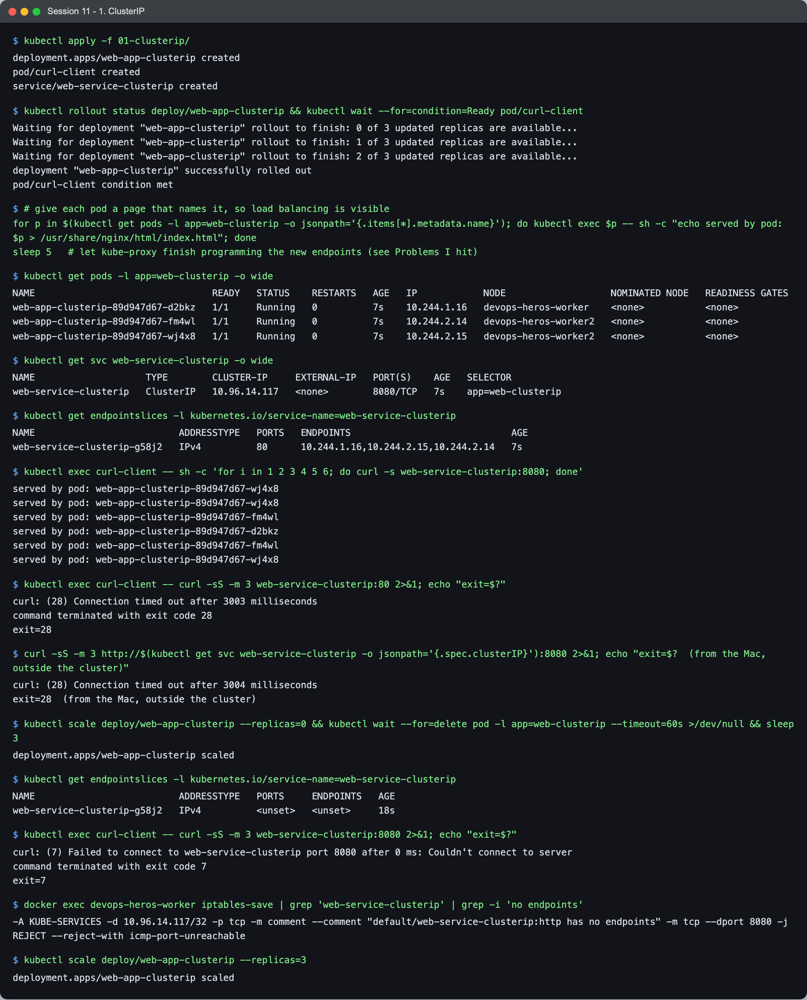
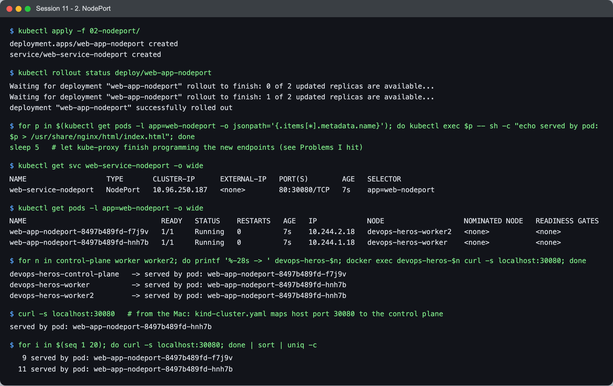
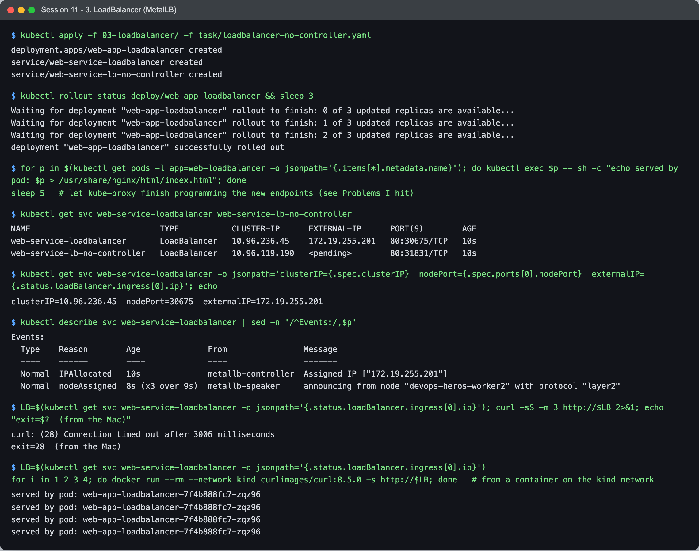
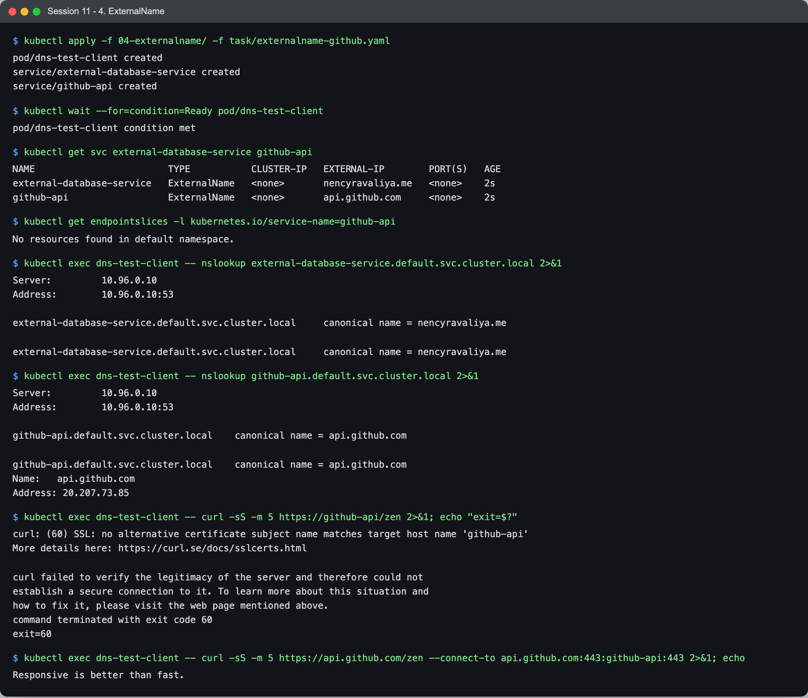
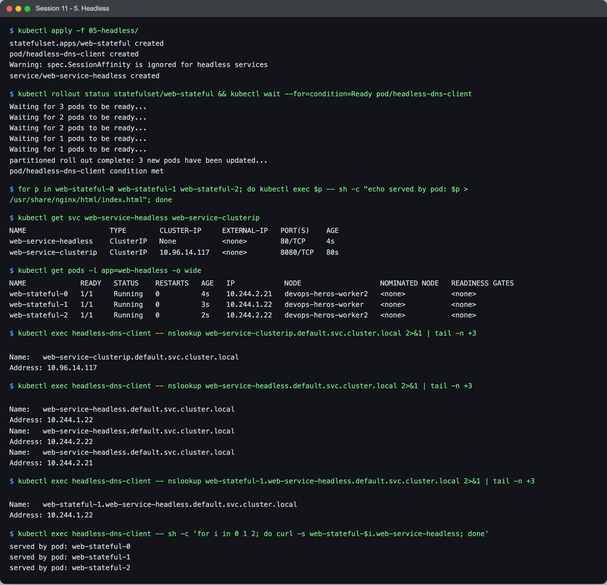
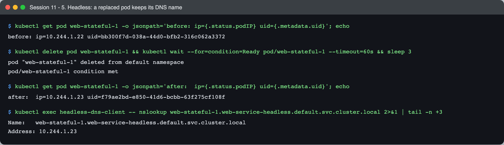

# Session 11 — Kubernetes Networking & Services — Task

- **Name:** Raj Prakash
- **Enrollment No:** 2024EB02289

> **Status:** done
>
> Cluster: **kind v0.30.0**, Kubernetes **v1.34.0**, three nodes (1 control plane + 2 workers),
> macOS on Apple Silicon. Created from [`kind-cluster.yaml`](kind-cluster.yaml) — the same shape
> as session 9, plus host ports for NodePort and Ingress — with the add-ons in
> [`cluster-setup.sh`](cluster-setup.sh) (metrics-server, MetalLB, ingress-nginx). The same cluster
> is used for sessions 12–15.

| Task | Where |
|---|---|
| **Task 1** — all 5 Service types, deployed and tested | this file |
| **Task 2** — Deployment vs ReplicaSet, Deployment vs DaemonSet vs StatefulSet, ReplicaSet vs Service | [`comparison/README.md`](comparison/README.md) |
| **Task 3** — FQDN | [`fqdn/README.md`](fqdn/README.md) |
| **Task 4** — CoreDNS | [`coredns/README.md`](coredns/README.md) |

The Service YAML files are the course ones in [`../01-clusterip/`](../01-clusterip/) …
[`../05-headless/`](../05-headless/), applied unchanged. I added two of my own, both explained below:
[`loadbalancer-no-controller.yaml`](loadbalancer-no-controller.yaml) and
[`externalname-github.yaml`](externalname-github.yaml).

---

## The cluster



```text
$ kubectl get nodes -o wide
NAME                         STATUS   ROLES           AGE   VERSION   INTERNAL-IP
devops-heros-control-plane   Ready    control-plane   34m   v1.34.0   172.19.0.5
devops-heros-worker          Ready    <none>          34m   v1.34.0   172.19.0.3
devops-heros-worker2         Ready    <none>          34m   v1.34.0   172.19.0.4

$ kubectl get ipaddresspool -n metallb-system kind-pool -o jsonpath='{.spec.addresses}'
["172.19.255.200-172.19.255.250"]
```

MetalLB is the one add-on this session depends on. A `LoadBalancer` Service only gets an
address if *something* allocates one — on AWS/GCP that is the cloud controller manager; on a
laptop cluster nothing does, so I gave MetalLB a slice of the docker network kind runs on.

To make load balancing visible, each demo gives every pod a page naming itself:

```bash
for p in $(kubectl get pods -l app=<label> -o jsonpath='{.items[*].metadata.name}'); do
  kubectl exec $p -- sh -c "echo served by pod: $p > /usr/share/nginx/html/index.html"
done
```

---

## 1. ClusterIP — a stable virtual IP, inside the cluster only

[`../01-clusterip/`](../01-clusterip/): a 3-replica nginx Deployment, a `curl-client` pod, and a
ClusterIP Service on **port 8080 → targetPort 80**.



```text
$ kubectl get svc web-service-clusterip -o wide
NAME                    TYPE        CLUSTER-IP      EXTERNAL-IP   PORT(S)    AGE   SELECTOR
web-service-clusterip   ClusterIP   10.96.14.117   <none>        8080/TCP   7s    app=web-clusterip

$ kubectl get endpointslices -l kubernetes.io/service-name=web-service-clusterip
NAME                          ADDRESSTYPE   PORTS   ENDPOINTS                             AGE
web-service-clusterip-g58j2   IPv4          80      10.244.1.16,10.244.2.15,10.244.2.14   7s

$ kubectl exec curl-client -- sh -c 'for i in 1 2 3 4 5 6; do curl -s web-service-clusterip:8080; done'
served by pod: web-app-clusterip-89d947d67-wj4x8
served by pod: web-app-clusterip-89d947d67-wj4x8
served by pod: web-app-clusterip-89d947d67-fm4wl
served by pod: web-app-clusterip-89d947d67-d2bkz
served by pod: web-app-clusterip-89d947d67-fm4wl
served by pod: web-app-clusterip-89d947d67-wj4x8
```

The Service is a name (`web-service-clusterip`) and a virtual IP; the **EndpointSlice** is the
moving part behind it — three pod IPs on port **80**, while clients talk to the Service on
**8080**. That port mapping is the point of `port` vs `targetPort`: callers never need to know
what port the container listens on.

Two failures are as informative as the success:

```text
$ kubectl exec curl-client -- curl -sS -m 3 web-service-clusterip:80
curl: (28) Connection timed out after 3005 milliseconds

$ curl -sS -m 3 http://10.96.14.117:8080        # from the Mac
curl: (28) Connection timed out after 3004 milliseconds
```

- **Port 80 on the ClusterIP times out.** A ClusterIP is not an interface that something is
  bound to — no process listens on `10.96.14.117`. It exists only as iptables rules that
  kube-proxy writes for the ports the Service *declares*. Port 80 is not declared, so no rule
  matches, the packet is routed nowhere, and the client waits until it gives up.
- **The Mac cannot reach it at all.** The `10.96.0.0/12` range is meaningful only to the nodes'
  iptables. That is the defining property of ClusterIP: internal only.

Then I scaled the Deployment to zero to see what a Service with **no endpoints** does:

```text
$ kubectl get endpointslices -l kubernetes.io/service-name=web-service-clusterip
NAME                          ADDRESSTYPE   PORTS     ENDPOINTS   AGE
web-service-clusterip-g58j2   IPv4          <unset>   <unset>     18s

$ kubectl exec curl-client -- curl -sS -m 3 web-service-clusterip:8080
curl: (7) Failed to connect to web-service-clusterip port 8080 after 0 ms: Couldn't connect to server

$ docker exec devops-heros-worker iptables-save | grep 'web-service-clusterip' | grep -i 'no endpoints'
-A KUBE-SERVICES -d 10.96.14.117/32 -p tcp -m comment --comment "default/web-service-clusterip:http has no endpoints" -m tcp --dport 8080 -j REJECT --reject-with icmp-port-unreachable
```

Now it fails **instantly** (`after 0 ms`) instead of timing out, and the rule shows why:
kube-proxy installs an explicit `REJECT` for a declared port with no endpoints. So the error
message is a diagnosis:

| Symptom | Meaning |
|---|---|
| `Connection refused`, instantly | Service and port exist, **no ready endpoints** — check the selector and pod readiness |
| Connection **timed out** | nothing handles that IP:port at all — wrong port, or not reachable from where you are |
| `Could not resolve host` | DNS — see [CoreDNS](coredns/README.md) |

---

## 2. NodePort — the same port on every node

[`../02-nodeport/`](../02-nodeport/): 2 replicas, `nodePort: 30080`.



```text
$ kubectl get svc web-service-nodeport -o wide
NAME                   TYPE       CLUSTER-IP      EXTERNAL-IP   PORT(S)        AGE   SELECTOR
web-service-nodeport   NodePort   10.96.250.187   <none>        80:30080/TCP   7s    app=web-nodeport

$ for n in control-plane worker worker2; do docker exec devops-heros-$n curl -s localhost:30080; done
devops-heros-control-plane   -> served by pod: web-app-nodeport-8497b489fd-f7j9v
devops-heros-worker          -> served by pod: web-app-nodeport-8497b489fd-hnh7b
devops-heros-worker2         -> served by pod: web-app-nodeport-8497b489fd-hnh7b

$ for i in $(seq 1 20); do curl -s localhost:30080; done | sort | uniq -c      # from the Mac
   9 served by pod: web-app-nodeport-8497b489fd-f7j9v
  11 served by pod: web-app-nodeport-8497b489fd-hnh7b
```

Port 30080 answers on **all three nodes** — including the control plane, which runs neither pod.
Whichever node receives the connection forwards it to a pod, wherever that pod is. The Mac
reaches it because [`kind-cluster.yaml`](kind-cluster.yaml) maps host port 30080 to the
control-plane container; on real servers you would hit `<any-node-ip>:30080` directly.

`PORT(S) 80:30080` reads as *Service port 80, node port 30080*: a NodePort Service is a
ClusterIP Service **plus** a port opened on every node. The 9/11 split over 20 requests is
kube-proxy's random choice per connection — even over many requests, not strict alternation.

---

## 3. LoadBalancer — an external IP from a controller

[`../03-loadbalancer/`](../03-loadbalancer/), plus my
[`loadbalancer-no-controller.yaml`](loadbalancer-no-controller.yaml): the same Service but with a
`loadBalancerClass` that no controller in this cluster implements.



```text
$ kubectl get svc web-service-loadbalancer web-service-lb-no-controller
NAME                           TYPE           CLUSTER-IP      EXTERNAL-IP      PORT(S)        AGE
web-service-loadbalancer       LoadBalancer   10.96.236.45    172.19.255.201   80:30675/TCP   10s
web-service-lb-no-controller   LoadBalancer   10.96.119.190   <pending>        80:31831/TCP   10s

$ kubectl describe svc web-service-loadbalancer | sed -n '/^Events:/,$p'
  Normal  IPAllocated   10s               metallb-controller  Assigned IP ["172.19.255.201"]
  Normal  nodeAssigned  8s (x3 over 9s)   metallb-speaker     announcing from node "devops-heros-worker2" with protocol "layer2"
```

The pair side by side is the whole lesson. Kubernetes itself **does not implement**
`type: LoadBalancer` — it creates the ClusterIP and the NodePort and then waits for a controller
to fill in `status.loadBalancer`. MetalLB did that for the first Service (the event shows it
allocating `.201` and a speaker announcing it via ARP from `worker2`). Nothing claims the second,
so it stays `<pending>` forever — which is what *every* LoadBalancer Service looks like on a bare
kind or minikube cluster. Note also that the LoadBalancer Service has a nodePort (30675) and a
ClusterIP: each Service type builds on the one before.

Reaching it:

```text
$ curl -sS -m 3 http://172.19.255.201          # from the Mac
curl: (28) Connection timed out after 3006 milliseconds

$ for i in 1 2 3 4 5 6; do docker run --rm --network kind curlimages/curl:8.5.0 -s http://172.19.255.201; done | sort | uniq -c
   3 served by pod: web-app-loadbalancer-7f4b888fc7-qq6cx
   2 served by pod: web-app-loadbalancer-7f4b888fc7-z4dw9
   1 served by pod: web-app-loadbalancer-7f4b888fc7-zqz96

$ docker run --rm --network kind curlimages/curl:8.5.0 -s http://172.19.255.201 http://172.19.255.201 http://172.19.255.201 \
    http://172.19.255.201 http://172.19.255.201 http://172.19.255.201 | sort | uniq -c
   6 served by pod: web-app-loadbalancer-7f4b888fc7-qq6cx
```

- **From the Mac it times out** — on macOS, Docker runs inside a Linux VM and the `kind` docker
  network is not routed to the host. From a container *on* that network, the IP works. On a
  cloud provider this would be a public IP.
- **Six separate connections hit all three pods; six requests from one `curl` hit one pod.** A
  single curl process reuses one keep-alive TCP connection, and kube-proxy picks a backend **per
  connection**, not per HTTP request. That is why a long-lived connection (a database pool, gRPC)
  can pin all its traffic to one pod.

---

## 4. ExternalName — a DNS alias, nothing else

[`../04-externalname/`](../04-externalname/) maps `external-database-service` →
`nencyravaliya.me`. I added [`externalname-github.yaml`](externalname-github.yaml)
(`github-api` → `api.github.com`), for a reason that shows up straight away.



```text
$ kubectl get svc external-database-service github-api
NAME                        TYPE           CLUSTER-IP   EXTERNAL-IP        PORT(S)   AGE
external-database-service   ExternalName   <none>       nencyravaliya.me   <none>    2s
github-api                  ExternalName   <none>       api.github.com     <none>    2s

$ kubectl get endpointslices -l kubernetes.io/service-name=github-api
No resources found in default namespace.

$ kubectl exec dns-test-client -- nslookup external-database-service.default.svc.cluster.local
external-database-service.default.svc.cluster.local	canonical name = nencyravaliya.me

$ kubectl exec dns-test-client -- nslookup github-api.default.svc.cluster.local
github-api.default.svc.cluster.local	canonical name = api.github.com
Name:	api.github.com
Address: 20.207.73.85
```

No ClusterIP, no ports, no endpoints, no kube-proxy rules. An ExternalName Service is **only a
CNAME record in CoreDNS**.

The course one returns the CNAME and then **no address**: `nencyravaliya.me` no longer resolves
anywhere (I checked from the Mac as well — `Could not resolve host`). Kubernetes does not check
the target; it will happily serve a CNAME to a dead name, and the failure only appears when an
app tries to connect. That is why I added a target that exists.

```text
$ kubectl exec dns-test-client -- curl -sS -m 5 https://github-api/zen
curl: (60) SSL: no alternative certificate subject name matches target host name 'github-api'

$ kubectl exec dns-test-client -- curl -sS -m 5 https://api.github.com/zen --connect-to api.github.com:443:github-api:443
Responsive is better than fast.
```

The catch with ExternalName: the alias works at the **DNS/TCP** level only. The client still
puts `github-api` in the TLS SNI and the HTTP `Host` header, and the certificate is for
`api.github.com`, so HTTPS fails. With `--connect-to` the TCP connection goes via the alias while
TLS uses the real name — then it works. ExternalName fits protocols that don't care about the
name (a Postgres or Redis host, for example), or migrations where you later swap the alias for a
real in-cluster Service without changing app config.

---

## 5. Headless — DNS returns the pods, not a virtual IP

[`../05-headless/`](../05-headless/): `clusterIP: None` + a 3-replica StatefulSet that names it as
its `serviceName`.



```text
$ kubectl get svc web-service-headless web-service-clusterip
NAME                    TYPE        CLUSTER-IP     EXTERNAL-IP   PORT(S)    AGE
web-service-headless    ClusterIP   None           <none>        80/TCP     4s
web-service-clusterip   ClusterIP   10.96.14.117   <none>        8080/TCP   80s

$ nslookup web-service-clusterip.default.svc.cluster.local
Name:	web-service-clusterip.default.svc.cluster.local
Address: 10.96.14.117

$ nslookup web-service-headless.default.svc.cluster.local
Name:	web-service-headless.default.svc.cluster.local
Address: 10.244.1.22
Name:	web-service-headless.default.svc.cluster.local
Address: 10.244.2.22
Name:	web-service-headless.default.svc.cluster.local
Address: 10.244.2.21

$ nslookup web-stateful-1.web-service-headless.default.svc.cluster.local
Name:	web-stateful-1.web-service-headless.default.svc.cluster.local
Address: 10.244.1.22

$ kubectl exec headless-dns-client -- sh -c 'for i in 0 1 2; do curl -s web-stateful-$i.web-service-headless; done'
served by pod: web-stateful-0
served by pod: web-stateful-1
served by pod: web-stateful-2
```

Same query, two answers: the normal Service resolves to **one virtual IP** (kube-proxy picks a
pod later); the headless one resolves to **all three pod IPs** and kube-proxy is not involved at
all. On top of that, each StatefulSet pod gets its **own** name,
`web-stateful-N.web-service-headless`, so a client can address one specific pod — "connect to the
primary, `db-0`", which a load-balanced address cannot express.

`kubectl apply` also printed `Warning: spec.SessionAffinity is ignored for headless services` —
there is no virtual IP to be sticky on, so the field is meaningless here.



```text
before: ip=10.244.1.22 uid=bb300f7d-038a-44d0-bfb2-316c062a3372
$ kubectl delete pod web-stateful-1
after:  ip=10.244.1.23 uid=f79ae2bd-e850-41d6-bcbb-63f275cf108f

$ nslookup web-stateful-1.web-service-headless.default.svc.cluster.local
Name:	web-stateful-1.web-service-headless.default.svc.cluster.local
Address: 10.244.1.23
```

The replacement pod is a new object (new UID, new IP) but the **name follows it** — the DNS record
was updated to the new IP. Stable identity is the name, not the address.

---

## Summary

| Type | Gets | Reachable from | Implemented by | Use for |
|---|---|---|---|---|
| **ClusterIP** | virtual IP + DNS name | inside the cluster | kube-proxy rules | service-to-service traffic (the default) |
| **NodePort** | ClusterIP + port 30000–32767 on every node | `<node-ip>:<nodePort>` | kube-proxy rules | dev, or behind your own load balancer |
| **LoadBalancer** | NodePort + external IP | the external IP | a controller (cloud, MetalLB) | exposing a service on a cloud provider |
| **ExternalName** | a CNAME only | — | CoreDNS | an in-cluster alias for an outside name |
| **Headless** | DNS returns pod IPs + per-pod names | inside the cluster | CoreDNS | StatefulSets, client-side load balancing |

## What I learned

- **Every Service type is built from the one before it.** LoadBalancer = NodePort + external IP;
  NodePort = ClusterIP + node port. The output shows all three numbers on one LoadBalancer.
- **A ClusterIP is a rule, not an address.** Nothing listens on it, which explains why an
  undeclared port times out while a declared port with no endpoints is refused — two different
  failures that point to two different problems.
- **`type: LoadBalancer` is a request, not a feature.** Kubernetes asks; a controller answers.
  The `<pending>` Service next to the MetalLB one shows exactly where that boundary is.
- **Load balancing is per connection.** Keep-alive and connection pools mean "three replicas"
  does not automatically mean "a third of the traffic each".
- **ExternalName and headless Services are pure DNS** — no kube-proxy involvement, which is also
  why ExternalName breaks TLS unless the client uses the real host name.

## Problems I hit

- **The first capture of the ClusterIP test failed with `Couldn't connect to server`, and the
  first NodePort capture sent 20 out of 20 requests to one pod.** Both ran within a couple of
  seconds of `kubectl rollout status` returning, and both came out normal a few seconds later
  (20 requests then split 9/11). The cause is the gap between a pod becoming Ready and kube-proxy
  rewriting its rules: for a moment the Service still had the "no endpoints → REJECT" rule, then
  only one endpoint programmed. `rollout status` tells you the pods are ready, not that every
  node's kube-proxy has caught up. My captures now wait 5 seconds after rollout, and the comment
  in each screenshot says so.
- **The course's ExternalName target is dead.** I spent a minute assuming my DNS was broken
  before resolving `nencyravaliya.me` from the Mac and getting the same failure. Kubernetes gave no
  warning — which is the real lesson about ExternalName.
- **The LoadBalancer IP times out from macOS.** Not a MetalLB problem: Docker Desktop does not
  route the kind network to the host. Testing from a throwaway container on `--network kind`
  proved the Service itself worked.
- **4 out of 4 requests to the LoadBalancer landed on one pod**, so I tested properly: separate
  connections spread across all three pods, and one keep-alive connection stuck to one — which
  turned a confusing result into the most useful finding of the section.
