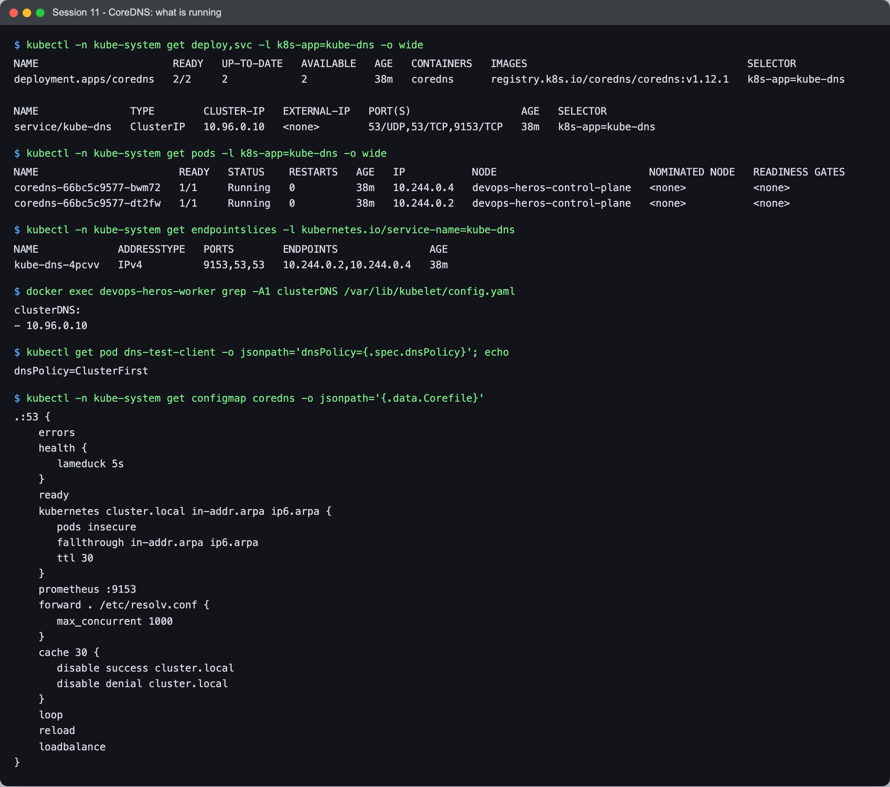
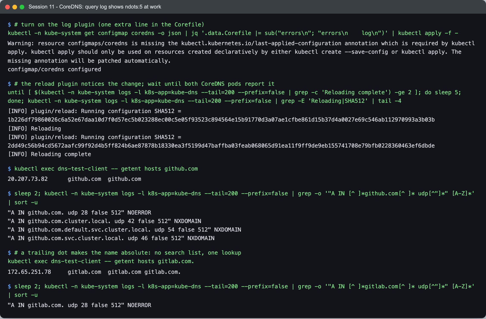
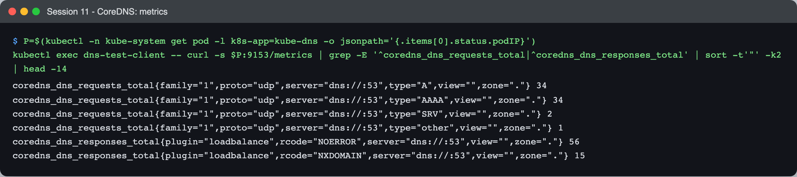
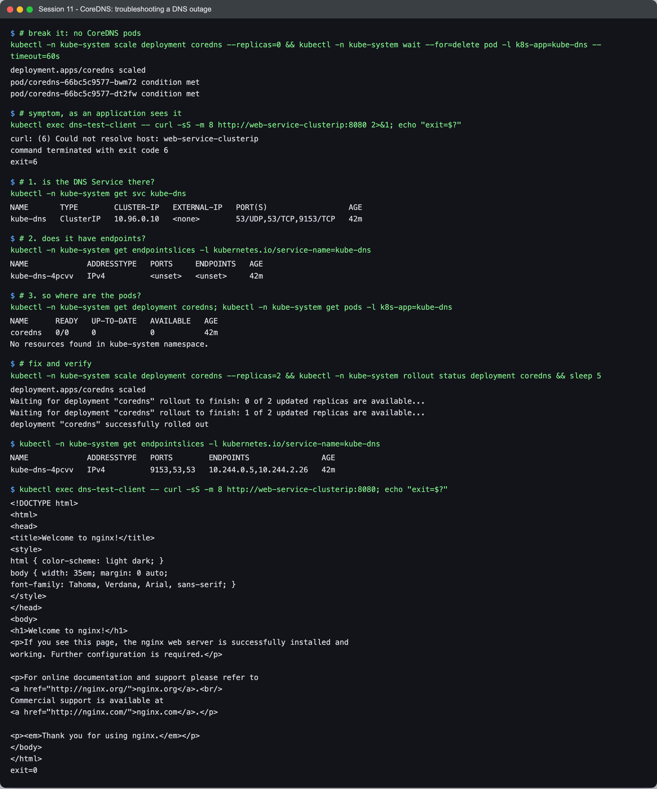

# Session 11 — Task 4: CoreDNS

- **Name:** Raj Prakash
- **Enrollment No:** 24BCS10328

Back to the [session 11 task index](../README.md). Researched, then checked against the CoreDNS
actually running in my kind cluster (Kubernetes v1.34.0, CoreDNS v1.12.1).

---

## What is CoreDNS?

CoreDNS is a DNS server written in Go and built entirely out of **plugins**: the config file (the
*Corefile*) is an ordered list of plugins, and every query passes through that chain. It is a
graduated CNCF project and has been the default Kubernetes cluster DNS since v1.13, replacing
kube-dns.

## Why Kubernetes uses CoreDNS

- **Service discovery by name.** Pods and Service IPs change; names don't. Something has to turn
  `orders.team-b` into the current ClusterIP — that is CoreDNS's `kubernetes` plugin, which
  watches the API server for Services and EndpointSlices.
- **One process, one config.** kube-dns needed three containers (kubedns, dnsmasq, sidecar).
  CoreDNS does it in one, with caching, forwarding, metrics and health checks as plugins.
- **It is just a Deployment.** It runs as ordinary pods behind an ordinary Service, so it can be
  scaled, inspected and debugged with the same `kubectl` you use for anything else.

## What is running in my cluster



```text
$ kubectl -n kube-system get deploy,svc -l k8s-app=kube-dns -o wide
deployment.apps/coredns   2/2     2            2           38m   coredns      registry.k8s.io/coredns/coredns:v1.12.1   k8s-app=kube-dns
service/kube-dns   ClusterIP   10.96.0.10   <none>        53/UDP,53/TCP,9153/TCP   38m   k8s-app=kube-dns

$ kubectl -n kube-system get endpointslices -l kubernetes.io/service-name=kube-dns
kube-dns-4pcvv   IPv4          9153,53,53   10.244.0.2,10.244.0.4   38m

$ docker exec devops-heros-worker grep -A1 clusterDNS /var/lib/kubelet/config.yaml
clusterDNS:
- 10.96.0.10

$ kubectl get pod dns-test-client -o jsonpath='dnsPolicy={.spec.dnsPolicy}'
dnsPolicy=ClusterFirst
```

The chain that connects a pod to CoreDNS:

1. The **Deployment is called `coredns` but the Service is still `kube-dns`** — kept for
   compatibility, so nothing that hard-coded the old name broke.
2. The Service has the fixed ClusterIP **`10.96.0.10`**.
3. Every node's **kubelet** is configured with `clusterDNS: 10.96.0.10`.
4. For pods with the default `dnsPolicy: ClusterFirst`, the kubelet writes `nameserver 10.96.0.10`
   plus the search list into `/etc/resolv.conf` (see [Task 3](../fqdn/README.md)).

## How Service discovery works and how a query is resolved

```text
 app in pod: connect("orders.team-b")
   │  libc resolver: ndots:5 → append search domains first
   ▼
 /etc/resolv.conf → nameserver 10.96.0.10 (kube-dns Service, a ClusterIP)
   │  kube-proxy rules DNAT to one CoreDNS pod
   ▼
 CoreDNS plugin chain
   ├─ kubernetes cluster.local  → name ends in cluster.local? answer from its watch of
   │                              Services/EndpointSlices (ClusterIP, pod IPs, SRV, CNAME)
   ├─ cache                     → anything else seen recently? answer from cache
   └─ forward . /etc/resolv.conf → everything else: forward upstream (the node's resolver)
```

CoreDNS does not query the API server per request — the `kubernetes` plugin keeps an in-memory
copy fed by a watch, which is why answers are fast and why a new Service resolves within a moment
of being created.

## CoreDNS configuration — the Corefile, line by line

```text
.:53 {                                   # serve every zone (.) on port 53
    errors                               # log errors
    health { lameduck 5s }               # :8080/health; keep answering 5s while shutting down
    ready                                # :8181/ready — the readiness probe
    kubernetes cluster.local in-addr.arpa ip6.arpa {
       pods insecure                     # answer a-b-c-d.ns.pod.cluster.local without checking
       fallthrough in-addr.arpa ip6.arpa # unknown reverse lookups → next plugin
       ttl 30
    }
    prometheus :9153                     # metrics
    forward . /etc/resolv.conf {         # non-cluster names → the node's upstream resolver
       max_concurrent 1000
    }
    cache 30 {                           # cache for 30s ...
       disable success cluster.local     # ... but never cache cluster.local answers
       disable denial cluster.local
    }
    loop                                 # detect forwarding loops and stop
    reload                               # pick up ConfigMap changes without a restart
    loadbalance                          # shuffle the order of A records in answers
}
```

The `cache` block surprised me: answers for `cluster.local` are **not** cached at all. The
`kubernetes` plugin already holds that data in memory, and caching it would only make a moved
Service resolve to a stale IP for up to 30 seconds. Caching is for upstream names.

It is stored in the `coredns` ConfigMap in `kube-system`, so changing DNS behaviour is
`kubectl edit configmap coredns` — the `reload` plugin applies it, as below.

### ndots:5 in the query log

I added the `log` plugin (one line) to watch real queries:



```text
$ kubectl -n kube-system get configmap coredns -o json | jq '.data.Corefile |= sub("errors\n"; "errors\n    log\n")' | kubectl apply -f -
configmap/coredns configured

$ ... | grep -E 'Reloading|SHA512' | tail -4
[INFO] plugin/reload: Running configuration SHA512 = 1b226df7...
[INFO] Reloading
[INFO] plugin/reload: Running configuration SHA512 = 2dd49c56...
[INFO] Reloading complete

$ kubectl exec dns-test-client -- getent hosts github.com
20.207.73.82      github.com  github.com
$ kubectl -n kube-system logs -l k8s-app=kube-dns ... | grep github.com
"A IN github.com. udp 28 false 512" NOERROR
"A IN github.com.cluster.local. udp 42 false 512" NXDOMAIN
"A IN github.com.default.svc.cluster.local. udp 54 false 512" NXDOMAIN
"A IN github.com.svc.cluster.local. udp 46 false 512" NXDOMAIN

$ kubectl exec dns-test-client -- getent hosts gitlab.com.
172.65.251.78     gitlab.com  gitlab.com gitlab.com.
$ ... | grep gitlab.com
"A IN gitlab.com. udp 28 false 512" NOERROR
```

**Four queries for `github.com`, three of them guaranteed failures**, because the name has one dot
(< `ndots:5`) and so every search domain is tried first. With a trailing dot, **one** query. (The
same happens again for the AAAA record — the musl resolver asks for both.) This is why DNS load in
a busy cluster is much higher than the number of distinct names would suggest, and why `cache`
and pod-level `dnsConfig: {options: [{name: ndots, value: "2"}]}` exist. I removed the `log` line
afterwards — it logs every query.

### Metrics



```text
coredns_dns_requests_total{...type="A"...} 34
coredns_dns_requests_total{...type="AAAA"...} 34
coredns_dns_requests_total{...type="SRV"...} 2
coredns_dns_responses_total{plugin="loadbalance",rcode="NOERROR",...} 56
coredns_dns_responses_total{plugin="loadbalance",rcode="NXDOMAIN",...} 15
```

The `prometheus :9153` plugin. Note **A and AAAA equal at 34** (every lookup asks for both) and a
large NXDOMAIN count from a handful of lookups — the search-list effect again, visible in metrics.
A rising NXDOMAIN rate is a classic sign of something querying short external names.

## How to troubleshoot DNS issues

I broke DNS on purpose — scaled CoreDNS to zero — and diagnosed it from the symptom:



```text
$ kubectl exec dns-test-client -- curl -sS -m 8 http://web-service-clusterip:8080
curl: (6) Could not resolve host: web-service-clusterip

$ kubectl -n kube-system get svc kube-dns
kube-dns   ClusterIP   10.96.0.10   <none>        53/UDP,53/TCP,9153/TCP   42m        ← Service fine

$ kubectl -n kube-system get endpointslices -l kubernetes.io/service-name=kube-dns
kube-dns-4pcvv   IPv4          <unset>   <unset>     42m                               ← no endpoints

$ kubectl -n kube-system get deployment coredns; kubectl -n kube-system get pods -l k8s-app=kube-dns
coredns   0/0     0            0           42m
No resources found in kube-system namespace.                                          ← root cause

$ kubectl -n kube-system scale deployment coredns --replicas=2 && kubectl -n kube-system rollout status deployment coredns
deployment "coredns" successfully rolled out
$ kubectl -n kube-system get endpointslices -l kubernetes.io/service-name=kube-dns
kube-dns-4pcvv   IPv4          9153,53,53   10.244.0.5,10.244.2.26   42m
$ kubectl exec dns-test-client -- curl -sS -m 8 http://web-service-clusterip:8080
<!DOCTYPE html> ... <title>Welcome to nginx!</title> ...       exit=0
```

`Could not resolve host` (curl exit 6) is a DNS failure; a timeout or refusal after a name *did*
resolve is a Service/network problem — check that first, it halves the search. The general order
I would follow:

| # | Check | Command |
|---|---|---|
| 1 | Is it DNS at all? | `getent hosts <name>` in the pod; then try the IP directly |
| 2 | What does the pod use? | `cat /etc/resolv.conf` — nameserver `10.96.0.10`? right search list? `dnsPolicy`? |
| 3 | Are CoreDNS pods running? | `kubectl -n kube-system get pods -l k8s-app=kube-dns` |
| 4 | Does `kube-dns` have endpoints? | `kubectl -n kube-system get endpointslices -l kubernetes.io/service-name=kube-dns` |
| 5 | What does CoreDNS say? | `kubectl -n kube-system logs -l k8s-app=kube-dns` — `loop` detection, upstream timeouts, `i/o timeout` to the API server |
| 6 | Is the name right? | namespace! `orders` from another namespace is NXDOMAIN — use `orders.team-b` |
| 7 | Does the Service exist / have endpoints? | `kubectl get svc,endpointslices` — DNS can be fine while the Service has no endpoints |
| 8 | See the queries | add `log` to the Corefile temporarily |
| 9 | Network policy? | a NetworkPolicy blocking egress to UDP/TCP 53 in `kube-system` breaks DNS for selected pods only |

## What I learned

- **CoreDNS is just pods behind a Service with a fixed IP.** Every step of the chain — kubelet
  config, resolv.conf, Service, EndpointSlice, pods — is inspectable, and the outage drill
  needed nothing more than `get` on each in turn.
- **`ndots:5` multiplies DNS traffic** for external names. Seeing three NXDOMAINs before every
  real answer in the query log made that concrete, and the trailing dot made it disappear.
- **cluster.local answers are deliberately not cached** — the Corefile says so, and once I thought
  about stale ClusterIPs it made sense.
- **Changing the Corefile needs no restart** — the `reload` plugin logged the new config hash
  (`SHA512 = 2dd49c56…`) and `Reloading complete` on both pods.

## Problems I hit

- **`kubectl apply` on the CoreDNS ConfigMap warned about a missing
  `last-applied-configuration` annotation** — the ConfigMap was created by kubeadm, not by
  `apply`. Harmless (kubectl patched the annotation in), but it means the next `apply` diff is
  computed against my version, not kubeadm's.
- **The reload is not instant, so a test straight after `apply` would still hit the old
  config.** The ConfigMap volume update reaches the pods on the kubelet's sync interval, then
  `reload` checks the file periodically. Rather than guess a `sleep`, the capture loops until
  *both* pods have logged `Reloading complete` — checking one pod is not enough, since queries are
  load-balanced across both.
