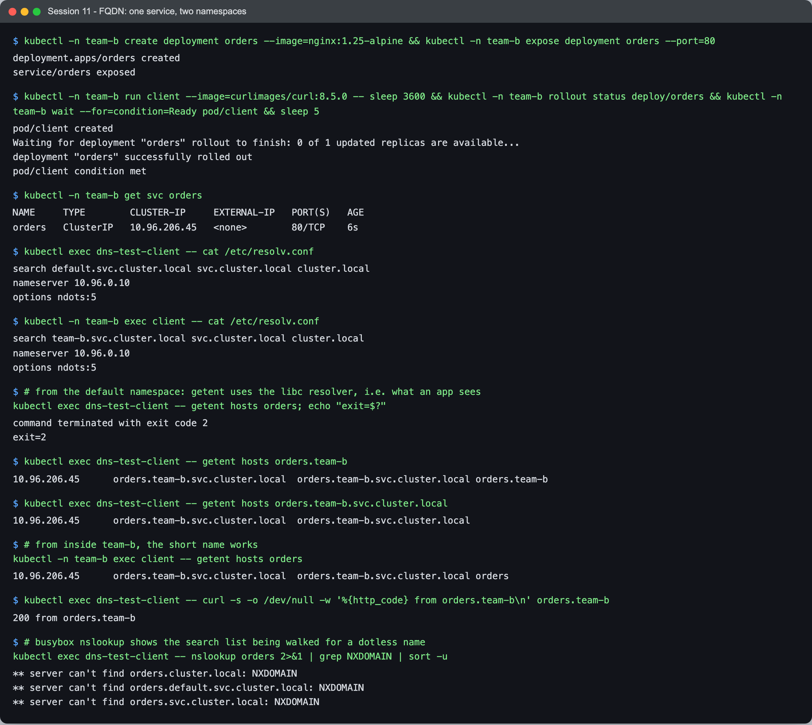
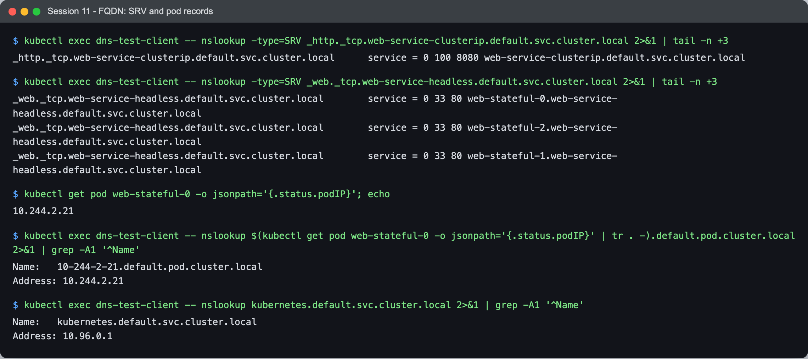

# Session 11 — Task 3: FQDN in Kubernetes

- **Name:** Raj Prakash
- **Enrollment No:** 2024EB02289

Back to the [session 11 task index](../README.md). All output below is from my kind cluster
(Kubernetes v1.34.0, CoreDNS v1.12.1).

---

## What is an FQDN?

A **fully qualified domain name** is a name that is complete all the way to the DNS root, so it
means the same thing wherever it is resolved: `orders.team-b.svc.cluster.local.`. The trailing dot
is the root; it is usually left off, but it is what makes a name *absolute*. A name without it can
be **relative**: the resolver may try appending search domains before (or instead of) trying it
as-is. In Kubernetes that distinction matters a lot — see `ndots` below.

## Kubernetes Service DNS and the naming convention

CoreDNS answers for the cluster domain (`cluster.local` by default) with these records:

| Record | Name | Answer |
|---|---|---|
| Service (A) | `<service>.<namespace>.svc.cluster.local` | the ClusterIP |
| Headless Service (A) | `<service>.<namespace>.svc.cluster.local` | every ready pod IP |
| StatefulSet pod (A) | `<pod>.<headless-svc>.<namespace>.svc.cluster.local` | that pod's IP |
| Named port (SRV) | `_<port-name>._<protocol>.<service>.<namespace>.svc.cluster.local` | port + target name |
| Any pod (A) | `<ip-with-dashes>.<namespace>.pod.cluster.local` | that IP |
| ExternalName (CNAME) | `<service>.<namespace>.svc.cluster.local` | the external name |

## Namespace-based DNS and Pod-to-Service communication

The namespace is part of the name, so the same short name can exist in every namespace. A pod finds
"its own" namespace's services through the **search list** the kubelet writes into every pod's
`/etc/resolv.conf`. I created an `orders` Service in a namespace `team-b` and compared a client in
`default` with one in `team-b`:



```text
$ kubectl exec dns-test-client -- cat /etc/resolv.conf          # pod in "default"
search default.svc.cluster.local svc.cluster.local cluster.local
nameserver 10.96.0.10
options ndots:5

$ kubectl -n team-b exec client -- cat /etc/resolv.conf         # pod in "team-b"
search team-b.svc.cluster.local svc.cluster.local cluster.local
nameserver 10.96.0.10
options ndots:5
```

The only difference is the first search domain — the pod's own namespace. That one line is the
whole of "namespace-based DNS":

```text
# from the default namespace
$ kubectl exec dns-test-client -- getent hosts orders; echo "exit=$?"
exit=2                                                      ← not found
$ kubectl exec dns-test-client -- getent hosts orders.team-b
10.96.230.71      orders.team-b.svc.cluster.local  orders.team-b.svc.cluster.local orders.team-b
$ kubectl exec dns-test-client -- getent hosts orders.team-b.svc.cluster.local
10.96.230.71      orders.team-b.svc.cluster.local  orders.team-b.svc.cluster.local

# from inside team-b, the short name works
$ kubectl -n team-b exec client -- getent hosts orders
10.96.230.71      orders.team-b.svc.cluster.local  orders.team-b.svc.cluster.local orders

$ kubectl exec dns-test-client -- curl -s -o /dev/null -w '%{http_code} from orders.team-b\n' orders.team-b
200 from orders.team-b
```

How each name was resolved:

| Asked from `default` | Search domain that matched | Result |
|---|---|---|
| `orders` | tried `orders.default.svc…`, `orders.svc…`, `orders.cluster.local` | **not found** |
| `orders.team-b` | `+ .svc.cluster.local` (the 2nd search domain) | found |
| `orders.team-b.svc.cluster.local` | none needed | found |

So the rules for pod-to-service communication are:

- **Same namespace:** the short name, `orders`.
- **Another namespace:** `orders.team-b` — the minimum that works anywhere in the cluster.
- **Config that must not depend on where it runs:** the full `orders.team-b.svc.cluster.local`.

The NXDOMAIN lines from busybox's `nslookup orders` show the search walk explicitly:

```text
** server can't find orders.cluster.local: NXDOMAIN
** server can't find orders.default.svc.cluster.local: NXDOMAIN
** server can't find orders.svc.cluster.local: NXDOMAIN
```

## SRV, pod and API-server records



```text
$ nslookup -type=SRV _http._tcp.web-service-clusterip.default.svc.cluster.local
_http._tcp.web-service-clusterip.default.svc.cluster.local	service = 0 100 8080 web-service-clusterip.default.svc.cluster.local

$ nslookup -type=SRV _web._tcp.web-service-headless.default.svc.cluster.local
_web._tcp.web-service-headless.default.svc.cluster.local	service = 0 33 80 web-stateful-0.web-service-headless.default.svc.cluster.local
_web._tcp.web-service-headless.default.svc.cluster.local	service = 0 33 80 web-stateful-2.web-service-headless.default.svc.cluster.local
_web._tcp.web-service-headless.default.svc.cluster.local	service = 0 33 80 web-stateful-1.web-service-headless.default.svc.cluster.local

$ nslookup 10-244-2-21.default.pod.cluster.local
Name:	10-244-2-21.default.pod.cluster.local
Address: 10.244.2.21

$ nslookup kubernetes.default.svc.cluster.local
Name:	kubernetes.default.svc.cluster.local
Address: 10.96.0.1
```

- **SRV records** publish the *port*, not just the address — `8080` for the ClusterIP Service,
  because its port is named `http`. For the headless Service there is one SRV record per pod, with
  equal weights (33 each), pointing at the per-pod names.
- **Pod A records** (`10-244-2-21.default.pod…`) exist because the Corefile has `pods insecure` —
  CoreDNS answers for any IP-shaped name without checking a pod has that IP. They are rarely
  useful; StatefulSet pod names are the stable way to address a pod.
- **`kubernetes.default`** is the API server's Service — how in-cluster clients (`kubectl` in a
  pod, controllers) find it.

## Examples of Kubernetes FQDNs (all real, from this cluster)

| FQDN | What it is |
|---|---|
| `web-service-clusterip.default.svc.cluster.local` | ClusterIP Service → `10.96.14.117` |
| `orders.team-b.svc.cluster.local` | Service in another namespace → `10.96.230.71` |
| `web-service-headless.default.svc.cluster.local` | headless Service → 3 pod IPs |
| `web-stateful-1.web-service-headless.default.svc.cluster.local` | one StatefulSet pod |
| `github-api.default.svc.cluster.local` | ExternalName → CNAME `api.github.com` |
| `kube-dns.kube-system.svc.cluster.local` | the cluster DNS Service itself → `10.96.0.10` |
| `kubernetes.default.svc.cluster.local` | the API server → `10.96.0.1` |
| `10-244-2-21.default.pod.cluster.local` | pod A record |

## ndots:5, and why a trailing dot helps

`options ndots:5` means: a name with **fewer than 5 dots** is tried against every search domain
**first**. Good for `orders`; wasteful for `github.com` — that becomes three NXDOMAIN lookups
before the real one. I watched it happen in CoreDNS's query log in
[Task 4](../coredns/README.md#ndots5-in-the-query-log); a trailing dot (`gitlab.com.`) made the
same kind of lookup a single query. For pods that call many external hosts, either use FQDNs
with the trailing dot or lower `ndots` through `dnsConfig.options` in the pod spec.

## What I learned

- **"Namespace-based DNS" is one line in resolv.conf** — the first search domain is the pod's
  own namespace. Everything about short names working "in the same namespace" follows from it.
- **`<service>.<namespace>` is the useful default** for cross-namespace calls; the full FQDN is for
  config that must work from anywhere.
- **`nslookup` is not your application's resolver.** busybox's `nslookup orders.team-b` returned
  NXDOMAIN while `curl orders.team-b` worked — it applies the search list only to dotless names.
  `getent hosts` goes through libc, the same path an app uses, so I switched to it for every
  comparison above.
