# Session 12 — Kubernetes Ingress, ConfigMaps & Secrets — Task

- **Name:** Raj Prakash
- **Enrollment No:** 2024EB02289

> **Status:** done
>
> Same cluster as [session 11](../../session-11-kubernetes-services/task/): kind v0.30.0,
> Kubernetes v1.34.0, 1 control plane + 2 workers, ingress-nginx **v1.15.1** as the Ingress
> controller. macOS on Apple Silicon; the control-plane container maps host ports 80/443, so
> `http://localhost` on the Mac reaches the controller.

| Task | YAML | Section |
|---|---|---|
| 1. ConfigMap | [`../01-configmap/app-config.yaml`](../01-configmap/app-config.yaml), [`configmap-demo-pod.yaml`](configmap-demo-pod.yaml) | [→](#task-1-configmap) |
| 2. Secret | [`../02-secret/db-secret.yaml`](../02-secret/db-secret.yaml), [`secret-demo-pod.yaml`](secret-demo-pod.yaml) | [→](#task-2-secret) |
| 3. Ingress | [`../04-full-demo/`](../04-full-demo/), [`../03-ingress/ingress-tls.yaml`](../03-ingress/ingress-tls.yaml) | [→](#task-3-ingress) |
| 4. Ingress vs Ingress Controller | [`ingress-no-controller.yaml`](ingress-no-controller.yaml) | [→](#task-4-ingress-vs-ingress-controller) |
| 5. Troubleshooting | [`troubleshooting/`](troubleshooting/) | [→](#task-5-troubleshooting) |

---

## Task 1: ConfigMap

The course ConfigMap holds five plain settings. [`configmap-demo-pod.yaml`](configmap-demo-pod.yaml)
consumes it **both** ways a pod can: `envFrom` (environment variables) and a `configMap` volume
(files).

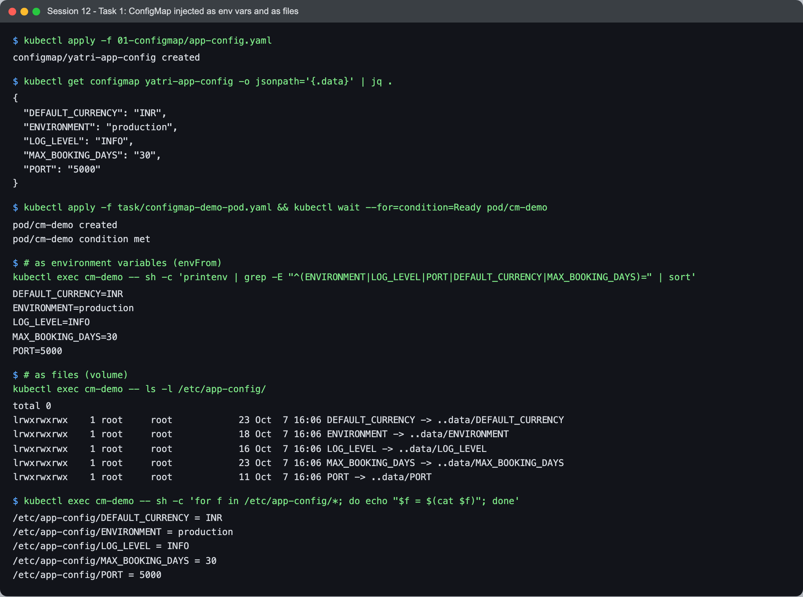

```text
$ kubectl get configmap yatri-app-config -o jsonpath='{.data}' | jq .
{ "DEFAULT_CURRENCY": "INR", "ENVIRONMENT": "production", "LOG_LEVEL": "INFO", "MAX_BOOKING_DAYS": "30", "PORT": "5000" }

# as environment variables (envFrom)
$ kubectl exec cm-demo -- sh -c 'printenv | grep -E "^(ENVIRONMENT|LOG_LEVEL|PORT|DEFAULT_CURRENCY|MAX_BOOKING_DAYS)=" | sort'
DEFAULT_CURRENCY=INR
ENVIRONMENT=production
LOG_LEVEL=INFO
MAX_BOOKING_DAYS=30
PORT=5000

# as files (volume)
$ kubectl exec cm-demo -- ls -l /etc/app-config/
lrwxrwxrwx    1 root     root   23 Oct  7 16:06 DEFAULT_CURRENCY -> ..data/DEFAULT_CURRENCY
lrwxrwxrwx    1 root     root   18 Oct  7 16:06 ENVIRONMENT -> ..data/ENVIRONMENT
lrwxrwxrwx    1 root     root   16 Oct  7 16:06 LOG_LEVEL -> ..data/LOG_LEVEL
...
```

Each key became an env var and a file. The files are **symlinks into `..data/`** — that detail
matters for the next part.

### The two ways behave differently when the ConfigMap changes

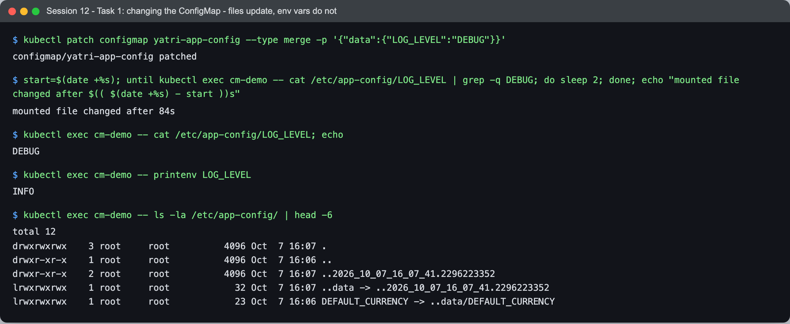

```text
$ kubectl patch configmap yatri-app-config --type merge -p '{"data":{"LOG_LEVEL":"DEBUG"}}'
configmap/yatri-app-config patched

$ start=$(date +%s); until kubectl exec cm-demo -- cat /etc/app-config/LOG_LEVEL | grep -q DEBUG; do sleep 2; done; ...
mounted file changed after 84s

$ kubectl exec cm-demo -- cat /etc/app-config/LOG_LEVEL
DEBUG
$ kubectl exec cm-demo -- printenv LOG_LEVEL
INFO

$ kubectl exec cm-demo -- ls -la /etc/app-config/
drwxr-xr-x    2 root     root          4096 Oct  7 16:07 ..2026_10_07_16_07_41.2296223352
lrwxrwxrwx    1 root     root            32 Oct  7 16:07 ..data -> ..2026_10_07_16_07_41.2296223352
```

Same pod, same ConfigMap, two different answers:

- **The file updated — after 84 seconds**, without a restart. The kubelet writes the new data
  into a fresh timestamped directory and then atomically swaps the `..data` symlink, so an app
  never reads a half-written file. The delay is the kubelet's sync period plus its cache TTL.
- **The env var never changes.** Environment variables are copied into the process when the
  container starts. To pick up a new value you restart the pod (`kubectl rollout restart`).

So: env vars for settings read once at startup; mounted files for settings an app can reload
(and the app has to actually watch the file — Kubernetes only replaces it).

---

## Task 2: Secret

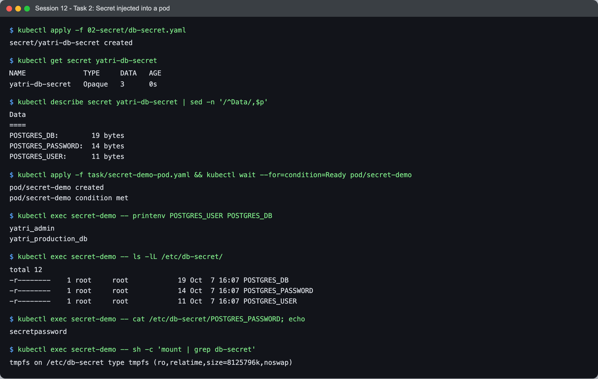

```text
$ kubectl get secret yatri-db-secret
NAME              TYPE     DATA   AGE
yatri-db-secret   Opaque   3      0s

$ kubectl describe secret yatri-db-secret | sed -n '/^Data/,$p'
POSTGRES_DB:        19 bytes
POSTGRES_PASSWORD:  14 bytes
POSTGRES_USER:      11 bytes

$ kubectl exec secret-demo -- printenv POSTGRES_USER POSTGRES_DB
yatri_admin
yatri_production_db

$ kubectl exec secret-demo -- ls -lL /etc/db-secret/
-r--------    1 root     root            19 Oct  7 16:07 POSTGRES_DB
-r--------    1 root     root            14 Oct  7 16:07 POSTGRES_PASSWORD
-r--------    1 root     root            11 Oct  7 16:07 POSTGRES_USER
$ kubectl exec secret-demo -- cat /etc/db-secret/POSTGRES_PASSWORD
secretpassword
$ kubectl exec secret-demo -- sh -c 'mount | grep db-secret'
tmpfs on /etc/db-secret type tmpfs (ro,relatime,size=8125796k,noswap)
```

The Secret is consumed exactly like a ConfigMap (`secretKeyRef` for env, a `secret` volume for
files). What Kubernetes does differently for Secrets:

- `kubectl describe` shows **sizes, not values**.
- The volume is **`tmpfs`** — in memory, never written to the node's disk — and I set
  `defaultMode: 0400`, so the files are readable only by the container's user.
- Secrets are a separate resource type, so RBAC can let someone read ConfigMaps but not Secrets.

### Why Secrets must not be committed to git

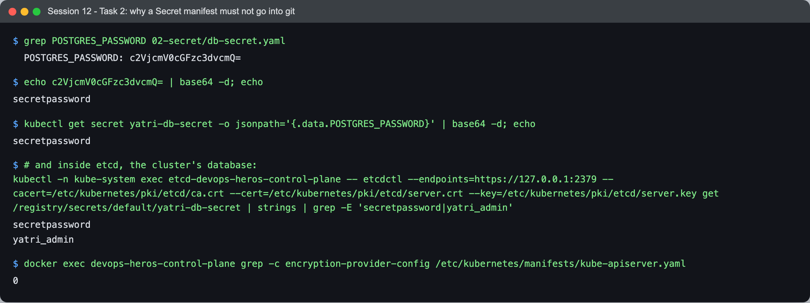

```text
$ grep POSTGRES_PASSWORD 02-secret/db-secret.yaml
  POSTGRES_PASSWORD: c2VjcmV0cGFzc3dvcmQ=
$ echo c2VjcmV0cGFzc3dvcmQ= | base64 -d
secretpassword

$ # and inside etcd, the cluster's database:
$ kubectl -n kube-system exec etcd-devops-heros-control-plane -- etcdctl ... get /registry/secrets/default/yatri-db-secret | strings | grep -E 'secretpassword|yatri_admin'
secretpassword
yatri_admin

$ docker exec devops-heros-control-plane grep -c encryption-provider-config /etc/kubernetes/manifests/kube-apiserver.yaml
0
```

**base64 is an encoding, not encryption.** Anyone who can read the YAML has the password — one
command, no key. And a Secret manifest committed to git is there forever: it is in every clone,
every fork, every CI cache, and deleting it in a later commit does not remove it from history.

The etcd output shows the second half: on this cluster the API server has **no
encryption-at-rest** configured, so the password sits in plain text in etcd too. Secrets are
protected by *access control*, not by cryptography, unless you add it.

What to do instead:

| Approach | How it works |
|---|---|
| Create from outside git | `kubectl create secret generic ... --from-literal` / `--from-file`, run from a CI step that reads a vault |
| **Sealed Secrets** | encrypt with the cluster's public key; only the in-cluster controller can decrypt — the encrypted file is safe to commit |
| **External Secrets Operator** | the cluster pulls from AWS Secrets Manager / Vault / GCP Secret Manager; git holds only a reference |
| **SOPS** | encrypt values in the YAML with KMS/age keys; decrypt at deploy time |
| Encryption at rest | `--encryption-provider-config` on the API server (KMS provider in production) |
| Secret scanning | gitleaks in CI — [session 17](../../session-17-devsecops/task/) — as the safety net |

The course's `db-secret.yaml` is fine as a classroom example; the lesson is that it would be a
leak in a real repo — and the lab Secrets I wrote for Task 5 are labelled that way for the same
reason.

---

## Task 3: Ingress

The course's full demo ([`../04-full-demo/`](../04-full-demo/)): a ConfigMap, a Secret, an nginx
frontend, a Python backend that prints its config, ClusterIP Services for both, and one Ingress
routing `yatri.local/` → frontend and `yatri.local/api/...` → backend (with `/api` stripped by
`rewrite-target: /$2`).

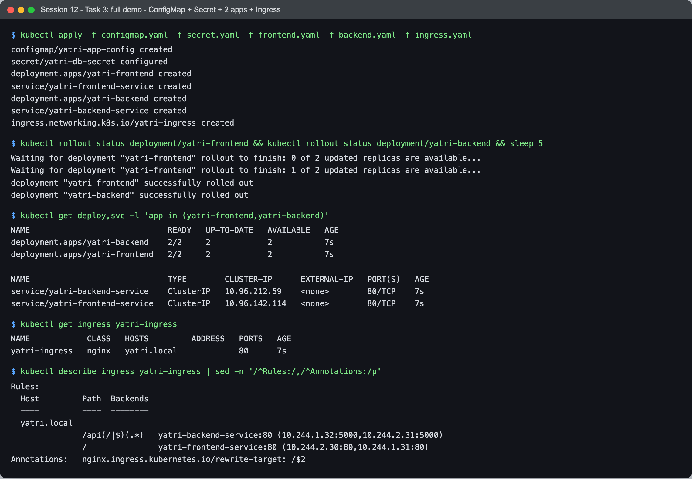

```text
$ kubectl apply -f configmap.yaml -f secret.yaml -f frontend.yaml -f backend.yaml -f ingress.yaml
...
ingress.networking.k8s.io/yatri-ingress created

$ kubectl describe ingress yatri-ingress | sed -n '/^Rules:/,/^Annotations:/p'
  Host         Path  Backends
  yatri.local
               /api(/|$)(.*)   yatri-backend-service:80 (10.244.1.32:5000,10.244.2.31:5000)
               /               yatri-frontend-service:80 (10.244.2.30:80,10.244.1.31:80)
```

`describe` already shows the resolution chain: host + path → Service → **pod IPs and ports**.

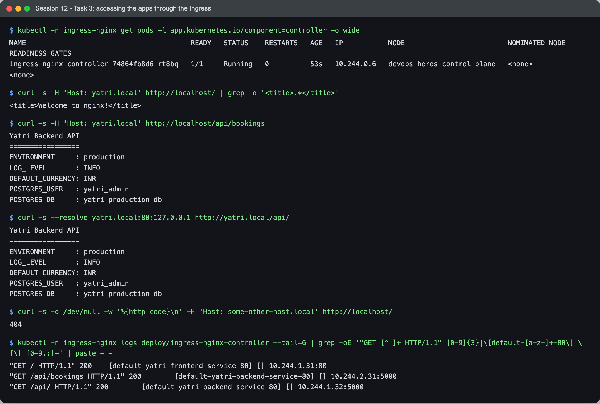

```text
$ curl -s -H 'Host: yatri.local' http://localhost/ | grep -o '<title>.*</title>'
<title>Welcome to nginx!</title>

$ curl -s -H 'Host: yatri.local' http://localhost/api/bookings
Yatri Backend API
=================
ENVIRONMENT     : production
LOG_LEVEL       : INFO
DEFAULT_CURRENCY: INR
POSTGRES_USER   : yatri_admin
POSTGRES_DB     : yatri_production_db

$ curl -s -o /dev/null -w '%{http_code}\n' -H 'Host: some-other-host.local' http://localhost/
404

$ kubectl -n ingress-nginx logs deploy/ingress-nginx-controller --tail=6 | grep -oE ... | paste - -
"GET / HTTP/1.1" 200	[default-yatri-frontend-service-80] [] 10.244.1.31:80
"GET /api/bookings HTTP/1.1" 200	[default-yatri-backend-service-80] [] 10.244.2.31:5000
"GET /api/ HTTP/1.1" 200	[default-yatri-backend-service-80] [] 10.244.1.32:5000
```

One IP and one port, three outcomes decided by the `Host` header and the path. The controller's
access log confirms the routing: which Service ("upstream") and **which pod** answered each
request. Note that the controller sends traffic **straight to pod IPs** — it reads the
EndpointSlices itself rather than going through the ClusterIP. The backend's reply also proves
Tasks 1 and 2 end to end: its values came from the ConfigMap (`ENVIRONMENT`, `LOG_LEVEL`) and the
Secret (`POSTGRES_USER`, `POSTGRES_DB`).

### TLS

[`../03-ingress/ingress-tls.yaml`](../03-ingress/ingress-tls.yaml) expects a TLS Secret named
`campus-tls-cert` covering two hosts. I made a self-signed one (key kept outside the repo):

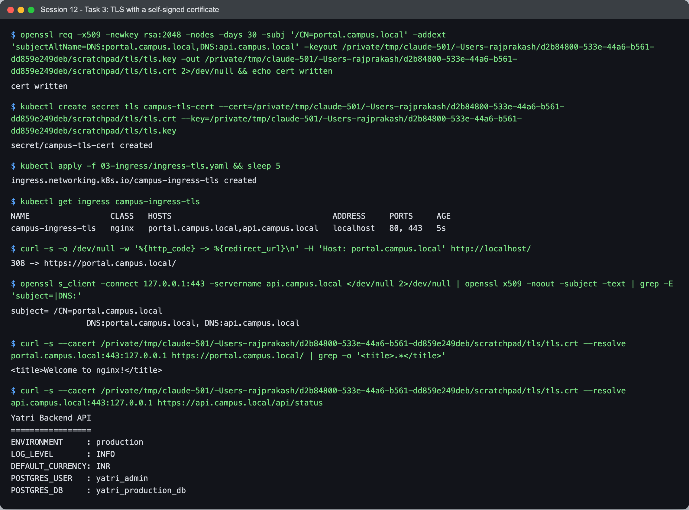

```text
$ openssl req -x509 -newkey rsa:2048 -nodes -days 30 -subj '/CN=portal.campus.local' \
    -addext 'subjectAltName=DNS:portal.campus.local,DNS:api.campus.local' -keyout tls.key -out tls.crt
$ kubectl create secret tls campus-tls-cert --cert=tls.crt --key=tls.key
secret/campus-tls-cert created

$ curl -s -o /dev/null -w '%{http_code} -> %{redirect_url}\n' -H 'Host: portal.campus.local' http://localhost/
308 -> https://portal.campus.local/

$ openssl s_client -connect 127.0.0.1:443 -servername api.campus.local ... | grep -E 'subject=|DNS:'
subject= /CN=portal.campus.local
                DNS:portal.campus.local, DNS:api.campus.local

$ curl -s --cacert tls.crt --resolve portal.campus.local:443:127.0.0.1 https://portal.campus.local/ | grep -o '<title>.*</title>'
<title>Welcome to nginx!</title>
$ curl -s --cacert tls.crt --resolve api.campus.local:443:127.0.0.1 https://api.campus.local/api/status
Yatri Backend API ...
```

- `ssl-redirect: "true"` turns plain HTTP into a **308** to HTTPS.
- TLS is **terminated at the controller** — the pods still speak plain HTTP. The certificate is
  just a `kubernetes.io/tls` Secret the controller reads.
- I passed `--cacert tls.crt` rather than `-k`, so curl actually verified the certificate
  against the host names — the SAN list is why one cert serves both hosts.

---

## Task 4: Ingress vs Ingress Controller

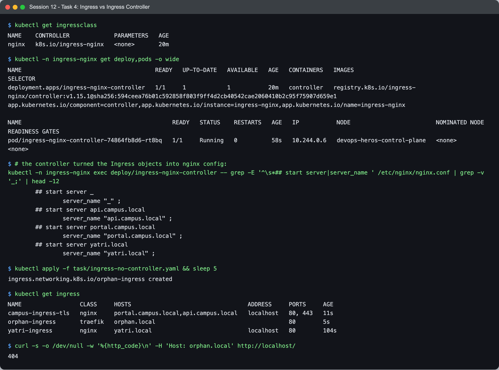

```text
$ kubectl get ingressclass
NAME    CONTROLLER             PARAMETERS   AGE
nginx   k8s.io/ingress-nginx   <none>       20m

$ kubectl -n ingress-nginx get pods -o wide
pod/ingress-nginx-controller-74864fb8d6-rt8bq   1/1   Running   0   58s   10.244.0.6   devops-heros-control-plane

$ # the controller turned the Ingress objects into nginx config:
$ kubectl -n ingress-nginx exec deploy/ingress-nginx-controller -- grep -E '^\s*## start server|server_name ' /etc/nginx/nginx.conf
	## start server api.campus.local
		server_name "api.campus.local" ;
	## start server portal.campus.local
		server_name "portal.campus.local" ;
	## start server yatri.local
		server_name "yatri.local" ;

$ kubectl apply -f task/ingress-no-controller.yaml
$ kubectl get ingress
NAME                 CLASS     HOSTS                                  ADDRESS     PORTS     AGE
campus-ingress-tls   nginx     portal.campus.local,api.campus.local   localhost   80, 443   11s
orphan-ingress       traefik   orphan.local                                       80        5s
yatri-ingress        nginx     yatri.local                            localhost   80        104s
$ curl -s -o /dev/null -w '%{http_code}\n' -H 'Host: orphan.local' http://localhost/
404
```

**What is an Ingress?** A Kubernetes API object: a set of HTTP routing *rules* — host names,
paths, which Service handles each, and TLS certificates. It is data. On its own it does nothing:
no process, no port, no IP.

**What is an Ingress Controller?** A program running in the cluster (here, nginx in a pod on the
control-plane node) that **watches** Ingress objects of its class and **implements** them —
it generates and reloads a real reverse-proxy configuration and accepts the traffic. The
`nginx.conf` above contains a `server` block per host I declared, written by the controller,
not by me.

| | Ingress | Ingress Controller |
|---|---|---|
| Kind | API resource (YAML) | a Deployment/DaemonSet — running pods |
| Provided by | Kubernetes itself | installed separately: ingress-nginx, Traefik, HAProxy, Contour, AWS Load Balancer Controller, GKE Ingress … |
| Contains | rules: hosts, paths, backends, TLS secret names | a proxy (nginx/Envoy/…) plus a control loop |
| Without the other | `orphan-ingress`: accepted, no `ADDRESS`, traffic gets 404 | a proxy with no routes — answers every host with its default backend (404) |
| Selected by | `spec.ingressClassName` | the `IngressClass` it owns (`nginx` → `k8s.io/ingress-nginx`) |

**Why both are required:** the split is the same as Service vs kube-proxy — Kubernetes defines a
portable *interface* (the Ingress API) and leaves the *implementation* pluggable. The same YAML can
be served by nginx on a laptop or by an AWS ALB in production by changing the class. The
`orphan-ingress` row proves the dependency: Kubernetes stored it happily, but with no controller
for class `traefik`, nothing programmed a proxy — no ADDRESS, and `orphan.local` gets the
default 404.

(The newer **Gateway API** splits this further into GatewayClass / Gateway / HTTPRoute, but
the object-vs-controller idea is the same.)

---

## Task 5: Troubleshooting

The course's [troubleshooting note](../troubleshooting/secret-base64-gotcha.md) describes a
database rejecting a password that "is definitely correct", caused by `echo` without `-n`. I
reproduced it rather than just reading it: [`troubleshooting/postgres.yaml`](troubleshooting/postgres.yaml)
runs Postgres with a correctly created password; [`troubleshooting/app-broken.yaml`](troubleshooting/app-broken.yaml)
is a client whose Secret was hand-encoded with `echo "mypassword" | base64`.

### 1. Identify the problem

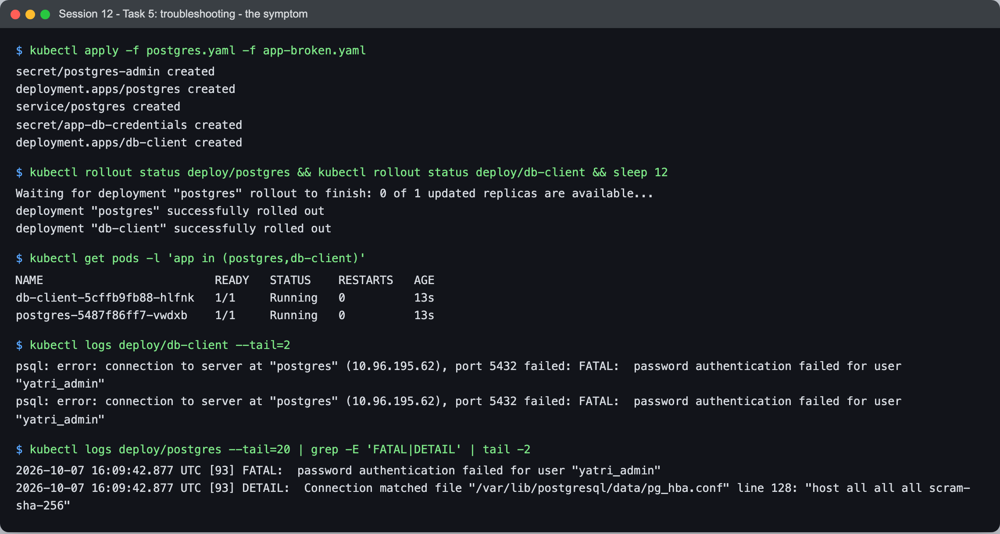

```text
$ kubectl get pods -l 'app in (postgres,db-client)'
NAME                         READY   STATUS    RESTARTS   AGE
db-client-5cffb9fb88-hlfnk   1/1     Running   0          13s
postgres-5487f86ff7-vwdxb    1/1     Running   0          13s

$ kubectl logs deploy/db-client --tail=2
psql: error: connection to server at "postgres" (10.96.195.62), port 5432 failed: FATAL:  password authentication failed for user "yatri_admin"

$ kubectl logs deploy/postgres --tail=20 | grep -E 'FATAL|DETAIL' | tail -2
FATAL:  password authentication failed for user "yatri_admin"
DETAIL:  Connection matched file "/var/lib/postgresql/data/pg_hba.conf" line 128: "host all all all scram-sha-256"
```

Everything is `Running 1/1` — `kubectl get pods` says nothing is wrong. The logs from both sides
narrow it down: DNS and the Service work (the client reached `postgres` at its ClusterIP), the
user exists, and the server rejected the **password**.

### 2–3. Investigate and find the root cause

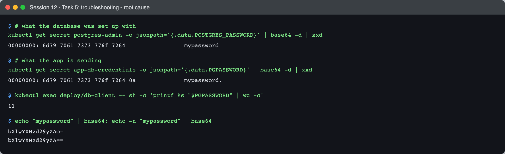

```text
$ # what the database was set up with
$ kubectl get secret postgres-admin -o jsonpath='{.data.POSTGRES_PASSWORD}' | base64 -d | xxd
00000000: 6d79 7061 7373 776f 7264                 mypassword
$ # what the app is sending
$ kubectl get secret app-db-credentials -o jsonpath='{.data.PGPASSWORD}' | base64 -d | xxd
00000000: 6d79 7061 7373 776f 7264 0a              mypassword.

$ kubectl exec deploy/db-client -- sh -c 'printf %s "$PGPASSWORD" | wc -c'
11

$ echo "mypassword" | base64; echo -n "mypassword" | base64
bXlwYXNzd29yZAo=
bXlwYXNzd29yZA==
```

Both passwords *print* as `mypassword`, which is why this bug survives code review. `xxd` shows
the difference: the app's has an extra byte, **`0a` — a newline** — and the variable inside the
container is 11 characters, not 10. Root cause: the Secret was made with `echo`, which appends
`\n`, and the newline was base64-encoded along with the password. The tell-tale is the encoded
string ending in **`Ao=`** instead of `A==`.

### 4–5. Fix and verify

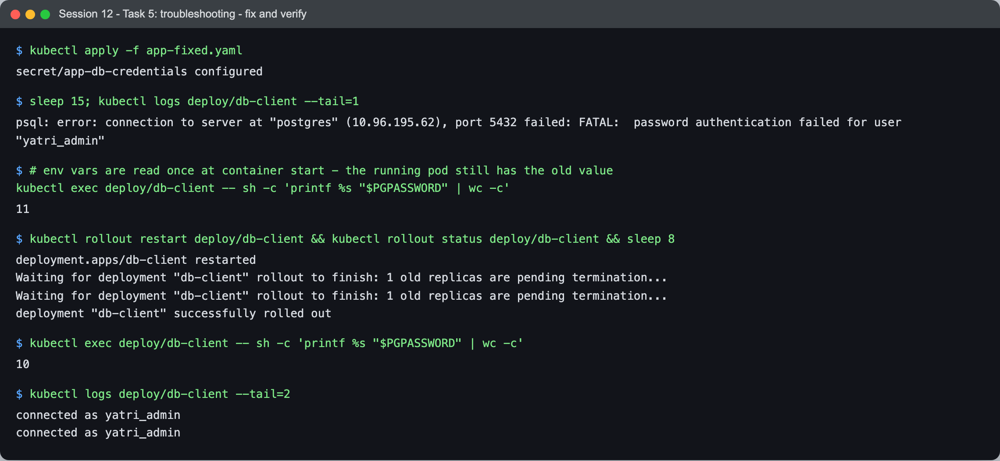

```text
$ kubectl apply -f app-fixed.yaml
secret/app-db-credentials configured

$ sleep 15; kubectl logs deploy/db-client --tail=1
psql: error: ... FATAL:  password authentication failed for user "yatri_admin"
$ # env vars are read once at container start - the running pod still has the old value
$ kubectl exec deploy/db-client -- sh -c 'printf %s "$PGPASSWORD" | wc -c'
11

$ kubectl rollout restart deploy/db-client && kubectl rollout status deploy/db-client
deployment "db-client" successfully rolled out
$ kubectl exec deploy/db-client -- sh -c 'printf %s "$PGPASSWORD" | wc -c'
10
$ kubectl logs deploy/db-client --tail=2
connected as yatri_admin
connected as yatri_admin
```

Fixing the Secret was **not enough** — 15 seconds later it was still failing, with the old
11-byte value. It is the same rule as the ConfigMap in Task 1: a value injected as an env var is
frozen at container start. After `rollout restart`, 10 bytes, and the client connects.

**Prevention:** use `stringData` (plain text, Kubernetes encodes it — as `postgres.yaml` does),
or `kubectl create secret generic --from-literal=...`, and never hand-encode with bare `echo`.

---

## What I learned

- **ConfigMap/Secret as env vars vs files is a real design choice**, not style: files update in
  place (84 s here, via an atomic symlink swap), env vars never do.
- **A Secret is base64, not encrypted** — in the YAML and, on a default cluster, in etcd too.
  Its protection is RBAC and tmpfs, so keeping it out of git is the developer's job.
- **An Ingress is configuration; the controller is the software.** The generated `nginx.conf`
  and the orphaned `traefik` Ingress made the split concrete.
- **The controller routes to pod IPs directly**, and the access log tells you which pod answered —
  the first place to look when one route misbehaves.
- **`Running` says nothing about whether the app works.** The broken client was `1/1 Running`
  throughout; only the logs showed the authentication failure.

## Problems I hit

- **Every request through the Ingress failed at first** — `curl` from the Mac returned `000`
  (connection failed) for all hosts. The controller pod was on `devops-heros-worker`, but only
  the control-plane container has host ports 80/443 mapped to the Mac. The ingress-nginx
  **v1.15.1** "kind" manifest still uses `hostPort: 80/443` but no longer has the
  `ingress-ready: "true"` nodeSelector, so the scheduler was free to put it anywhere. Patching the
  nodeSelector back moved it to the control plane and everything answered. I added the patch to
  the [cluster setup script](../../session-11-kubernetes-services/task/cluster-setup.sh) so the
  cluster can be rebuilt correctly.
- **macOS's `openssl` is LibreSSL** and has no `x509 -ext` option; `-text | grep DNS:` gave the
  SAN list instead.
- **The ConfigMap file update took 84 seconds**, much longer than I expected — long enough that a
  test right after `kubectl patch` would wrongly conclude mounted ConfigMaps don't update. The
  capture polls until the file changes instead of sleeping a fixed time.
