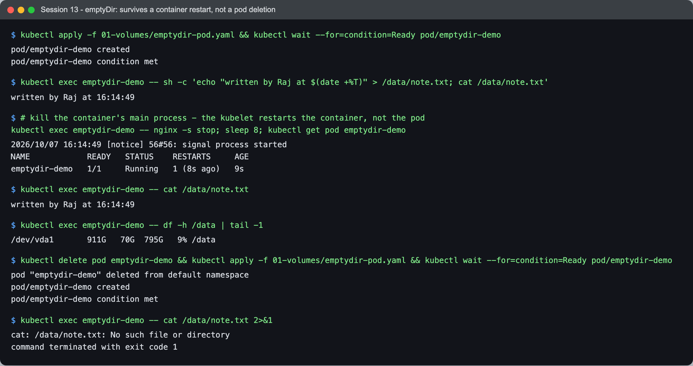
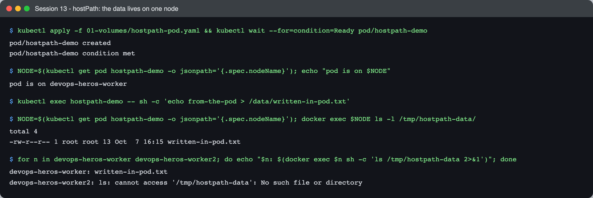
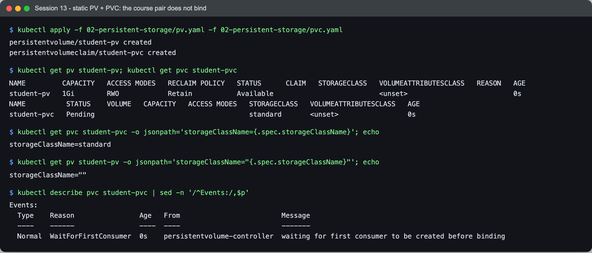
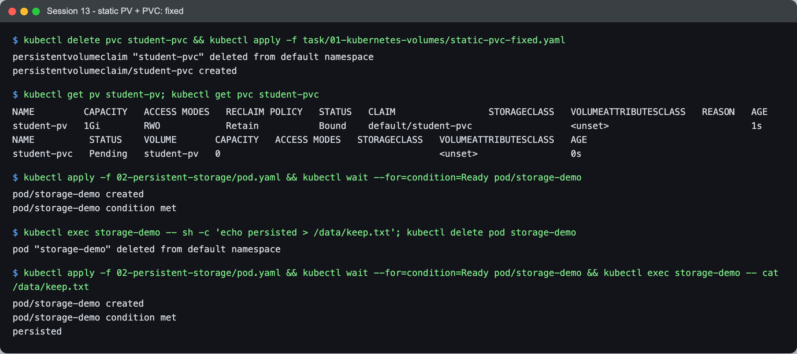
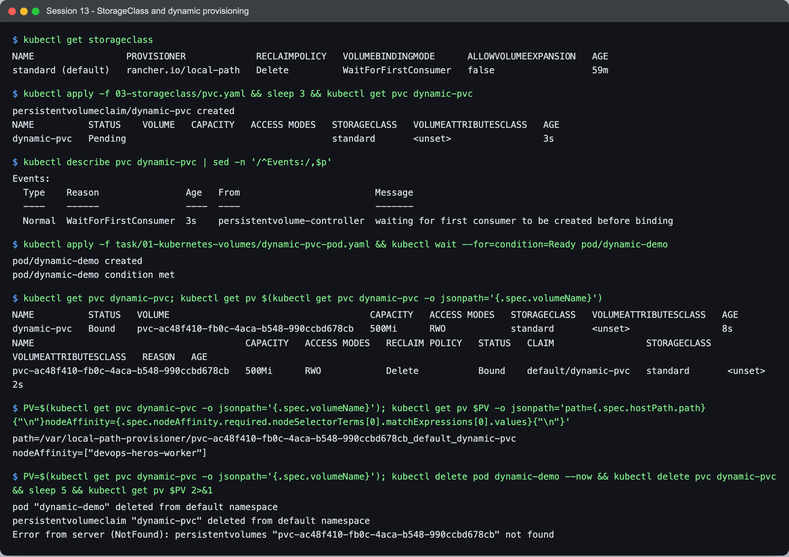

# Session 13 — Task 1: Kubernetes Volumes

- **Name:** Raj Prakash
- **Enrollment No:** 2024EB02289

Back to the [session 13 task](../README.md). Every example below was run on my kind cluster
(Kubernetes v1.34.0, 1 control plane + 2 workers) using the course manifests in
[`../../01-volumes/`](../../01-volumes/), [`../../02-persistent-storage/`](../../02-persistent-storage/)
and [`../../03-storageclass/`](../../03-storageclass/), plus two small files of mine in this folder.

---

## Why volumes exist

A container's filesystem is a writable layer on top of its image, and it is **thrown away when the
container restarts** — which Kubernetes does freely (crash, liveness failure, eviction). A volume
is storage that is mounted into the container from outside that layer, so its lifetime can be
longer than the container's. The volume *type* decides how much longer.

| Type | Lives as long as | Shared between | Typical use |
|---|---|---|---|
| container filesystem | the container | — | nothing you need to keep |
| `emptyDir` | the **pod** | containers in the same pod | scratch space, caches, sidecar hand-off |
| `hostPath` | the **node** | pods on the same node | node agents reading `/var/log`, `/proc` |
| PersistentVolume (via a PVC) | until deleted (reclaim policy) | depends on access mode | databases, uploads, anything that must survive |

---

## emptyDir

[`emptydir-pod.yaml`](../../01-volumes/emptydir-pod.yaml) mounts an empty directory at `/data`.



```text
$ kubectl exec emptydir-demo -- sh -c 'echo "written by Raj at $(date +%T)" > /data/note.txt; cat /data/note.txt'
written by Raj at 16:14:49

$ # kill the container's main process - the kubelet restarts the container, not the pod
$ kubectl exec emptydir-demo -- nginx -s stop; sleep 8; kubectl get pod emptydir-demo
NAME            READY   STATUS    RESTARTS     AGE
emptydir-demo   1/1     Running   1 (8s ago)   9s
$ kubectl exec emptydir-demo -- cat /data/note.txt
written by Raj at 16:14:49

$ kubectl exec emptydir-demo -- df -h /data | tail -1
/dev/vda1       911G   70G  795G   9% /data

$ kubectl delete pod emptydir-demo && kubectl apply -f 01-volumes/emptydir-pod.yaml
$ kubectl exec emptydir-demo -- cat /data/note.txt
cat: /data/note.txt: No such file or directory
```

- The **container restarted** (`RESTARTS 1`) and the file survived — the volume belongs to the
  pod, not the container.
- **Deleting the pod deleted the data.** A new pod gets a new, empty directory.
- `df` shows it is just a directory on the node's disk (the kind node's `/dev/vda1`).
  `emptyDir: {medium: Memory}` puts it on tmpfs instead — faster, and counted against the pod's
  memory limit.

## hostPath

[`hostpath-pod.yaml`](../../01-volumes/hostpath-pod.yaml) mounts the node's `/tmp/hostpath-data`.



```text
pod is on devops-heros-worker
$ kubectl exec hostpath-demo -- sh -c 'echo from-the-pod > /data/written-in-pod.txt'

$ docker exec devops-heros-worker ls -l /tmp/hostpath-data/
-rw-r--r-- 1 root root 13 Oct  7 16:15 written-in-pod.txt

devops-heros-worker:  written-in-pod.txt
devops-heros-worker2: ls: cannot access '/tmp/hostpath-data': No such file or directory
```

The file written inside the pod is a real file on **that node's** filesystem — and only that node.
If the pod is rescheduled onto `worker2` it sees an empty (or different) directory. hostPath is
also a security hole for ordinary apps: a pod that can mount `/` or `/var/run/containerd` of the
node can take the node over, which is why Pod Security "restricted"/"baseline" policies forbid it.
It is meant for node agents (log collectors, node-exporter), not application data.

## PersistentVolume and PersistentVolumeClaim

The split is between **who provides storage** and **who uses it**:

- A **PersistentVolume (PV)** is a piece of storage in the cluster — an EBS volume, an NFS export,
  a directory — created by an admin or by a provisioner. It is cluster-scoped.
- A **PersistentVolumeClaim (PVC)** is a request for storage by a namespace: "500Mi,
  ReadWriteOnce, class X". Pods reference the PVC, never the PV, so the pod spec stays portable.
- Kubernetes **binds** a claim to a matching volume, one-to-one.

### The course's static PV/PVC do not bind — and why

[`pv.yaml`](../../02-persistent-storage/pv.yaml) defines a 1Gi hostPath PV;
[`pvc.yaml`](../../02-persistent-storage/pvc.yaml) asks for 500Mi. They look like a pair. They are
not:



```text
$ kubectl get pv student-pv; kubectl get pvc student-pvc
NAME         CAPACITY   ACCESS MODES   RECLAIM POLICY   STATUS      CLAIM   STORAGECLASS
student-pv   1Gi        RWO            Retain           Available
NAME          STATUS    VOLUME   CAPACITY   ACCESS MODES   STORAGECLASS
student-pvc   Pending                                      standard

$ kubectl get pvc student-pvc -o jsonpath='storageClassName={.spec.storageClassName}'
storageClassName=standard
$ kubectl get pv student-pv -o jsonpath='storageClassName="{.spec.storageClassName}"'
storageClassName=""

$ kubectl describe pvc student-pvc | sed -n '/^Events:/,$p'
  Normal  WaitForFirstConsumer  0s    persistentvolume-controller  waiting for first consumer to be created before binding
```

The PVC never mentioned a StorageClass, yet it has `standard`. The **DefaultStorageClass admission
plugin** fills in the cluster's default class on any PVC that omits the field. The static PV has
*no* class, and a claim only binds to a PV of the **same** class — so `student-pv` stays
`Available` forever. Worse, the moment a pod used `student-pvc`, the `standard` provisioner would
create a **brand-new** volume for it, and the app would silently write somewhere other than the PV
the admin prepared.

[`static-pvc-fixed.yaml`](static-pvc-fixed.yaml) sets `storageClassName: ""` ("no class — static
binding only") and names the volume:



```text
$ kubectl get pv student-pv
NAME         CAPACITY   ACCESS MODES   RECLAIM POLICY   STATUS   CLAIM
student-pv   1Gi        RWO            Retain           Bound    default/student-pvc

$ kubectl exec storage-demo -- sh -c 'echo persisted > /data/keep.txt'; kubectl delete pod storage-demo
$ kubectl apply -f 02-persistent-storage/pod.yaml ... && kubectl exec storage-demo -- cat /data/keep.txt
persisted
```

Bound, and the data survived the pod being deleted and recreated. Two more things this example
shows:

- **The claim asked for 500Mi and got the whole 1Gi PV.** Binding is one claim to one volume; a
  PV is never split.
- **`Retain`** means that when the PVC is deleted, the PV and its data are kept (status
  `Released`) for an admin to clean up — the safe choice for data you care about. `Delete` (below)
  removes the storage with the claim.

### Access modes

| Mode | Meaning |
|---|---|
| `ReadWriteOnce` (RWO) | read-write by pods on **one node** at a time (several pods on that node can share it) |
| `ReadOnlyMany` (ROX) | read-only from many nodes |
| `ReadWriteMany` (RWX) | read-write from many nodes — needs NFS/EFS/CephFS-type storage |
| `ReadWriteOncePod` | read-write by exactly one pod |

RWO being *per node*, not per pod, turned out to matter a lot in the
[mini project](../README.md#task-3-mini-project).

## StorageClass and dynamic provisioning

Writing a PV by hand for every claim does not scale. A **StorageClass** names a *provisioner* and
its settings; a PVC that names the class gets a PV **created on demand**.



```text
$ kubectl get storageclass
NAME                 PROVISIONER             RECLAIMPOLICY   VOLUMEBINDINGMODE      ALLOWVOLUMEEXPANSION
standard (default)   rancher.io/local-path   Delete          WaitForFirstConsumer   false

$ kubectl apply -f 03-storageclass/pvc.yaml && sleep 3 && kubectl get pvc dynamic-pvc
dynamic-pvc   Pending                                      standard
  Normal  WaitForFirstConsumer  3s    persistentvolume-controller  waiting for first consumer to be created before binding

$ kubectl apply -f task/01-kubernetes-volumes/dynamic-pvc-pod.yaml
$ kubectl get pvc dynamic-pvc; kubectl get pv ...
dynamic-pvc   Bound    pvc-ac48f410-fb0c-4aca-b548-990ccbd678cb   500Mi      RWO            standard
pvc-ac48f410-fb0c-4aca-b548-990ccbd678cb   500Mi   RWO   Delete   Bound   default/dynamic-pvc   standard

path=/var/local-path-provisioner/pvc-ac48f410-fb0c-4aca-b548-990ccbd678cb_default_dynamic-pvc
nodeAffinity=["devops-heros-worker"]

$ kubectl delete pod dynamic-demo && kubectl delete pvc dynamic-pvc && sleep 5 && kubectl get pv pvc-ac48f410-...
Error from server (NotFound): persistentvolumes "pvc-ac48f410-fb0c-4aca-b548-990ccbd678cb" not found
```

Step by step:

1. **`WaitForFirstConsumer`** — the PVC stays `Pending` on purpose until a pod uses it. For
   node-local or zonal storage this is essential: the provisioner must know *where the pod will
   run* before creating the disk, or the pod could be scheduled away from its own volume.
2. When the pod was scheduled, the provisioner created a PV of **exactly 500Mi**, named after the
   claim's UID, and bound it.
3. kind's provisioner is `local-path`: the "disk" is a directory on the node, so the PV carries
   **node affinity** — any pod using it must run on `devops-heros-worker`.
4. **Reclaim policy `Delete`**: deleting the PVC deleted the PV and its data.

On a cloud cluster the same PVC with `storageClassName: gp3` (AWS EBS CSI driver) or
`standard-rwo` (GKE) would create a real block device in the pod's zone — same YAML, different
provisioner. That indirection is the whole point of StorageClasses.

## What I learned

- **Volume lifetime is the real distinction**: container < `emptyDir` (pod) < `hostPath` (node)
  < PV (independent). emptyDir surviving a container restart but not a pod deletion was the
  clearest demonstration.
- **A PVC without `storageClassName` is not "no class"** — the default class is injected. To
  bind to a hand-made PV you must say `storageClassName: ""`. The course pair failing to bind is
  exactly the trap.
- **`WaitForFirstConsumer` explains "my PVC is Pending"** — it is waiting for a pod, not broken.
- **Local storage pins pods to a node.** Any PV with node affinity turns the scheduler's choice
  into "that node or nowhere".
