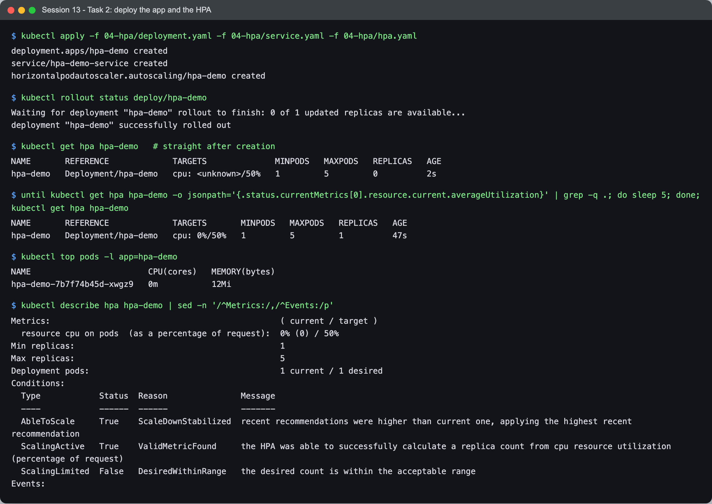
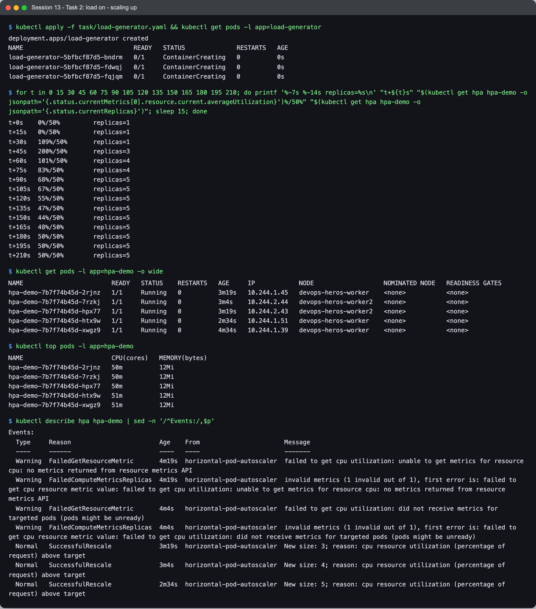
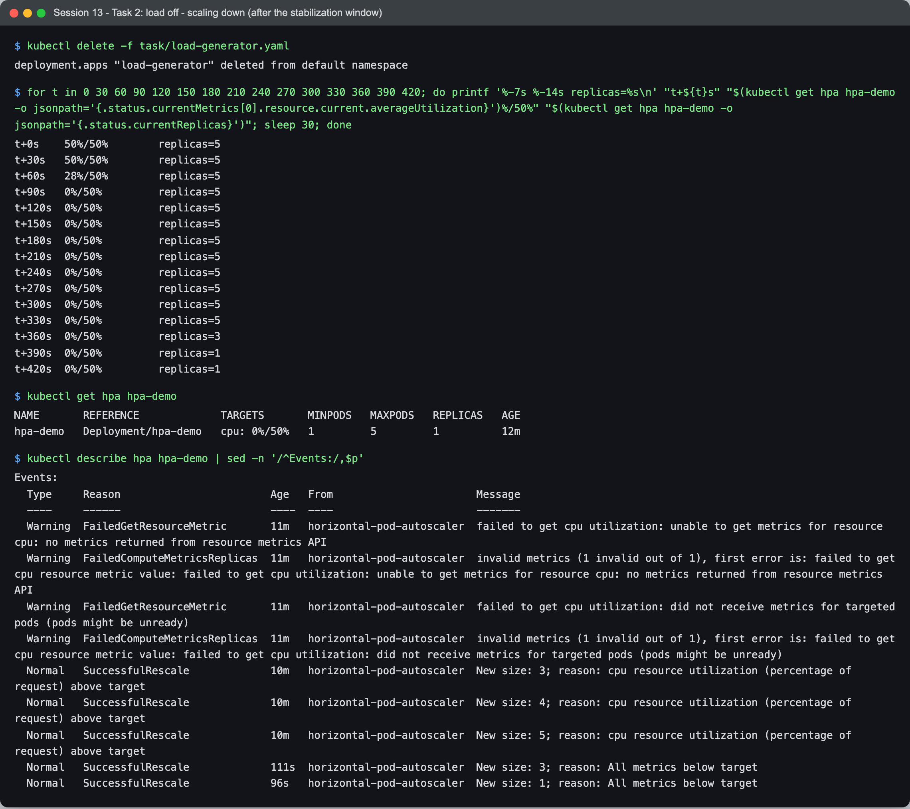
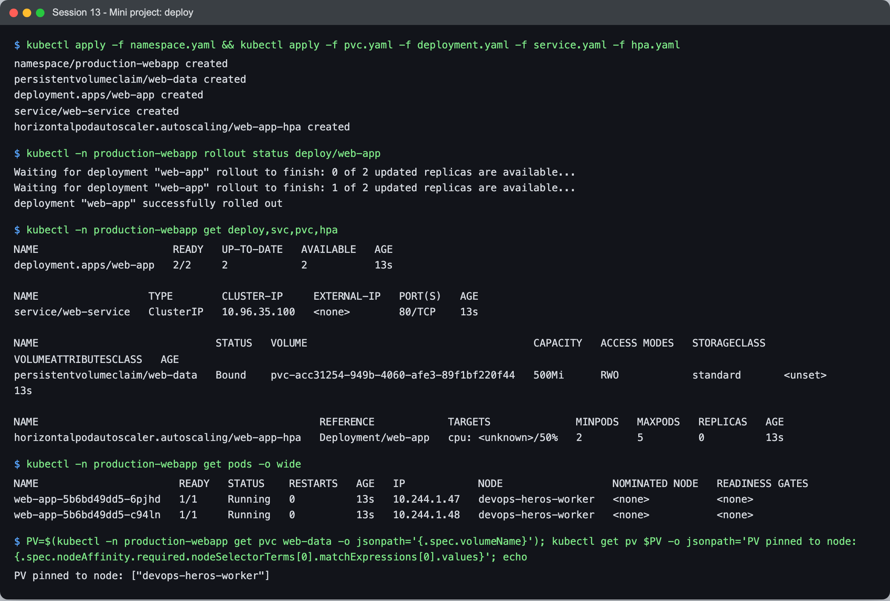
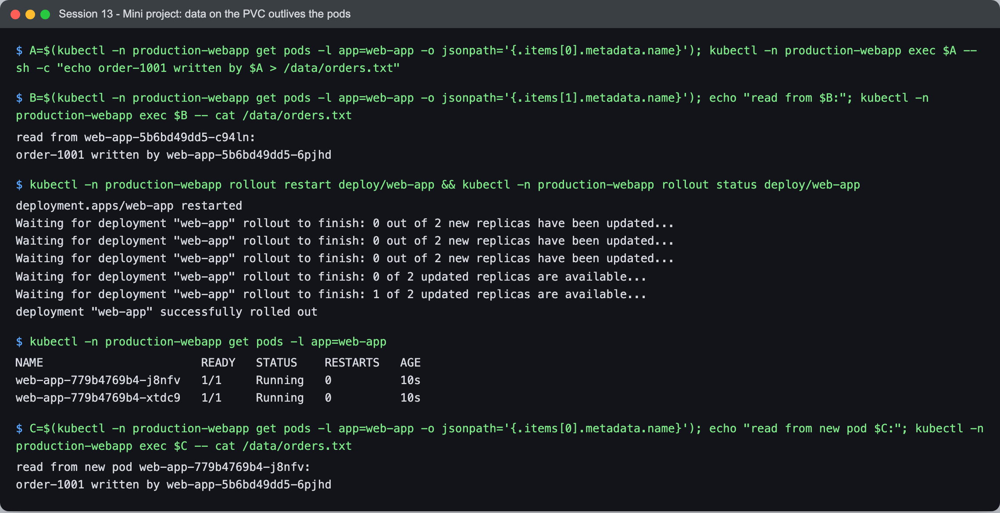
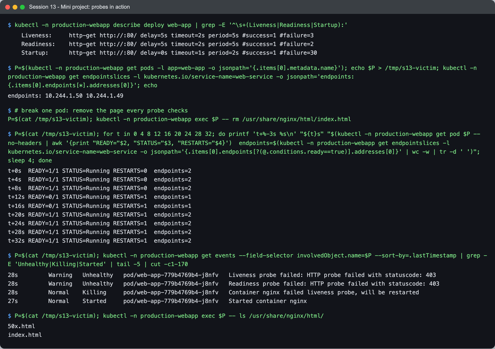
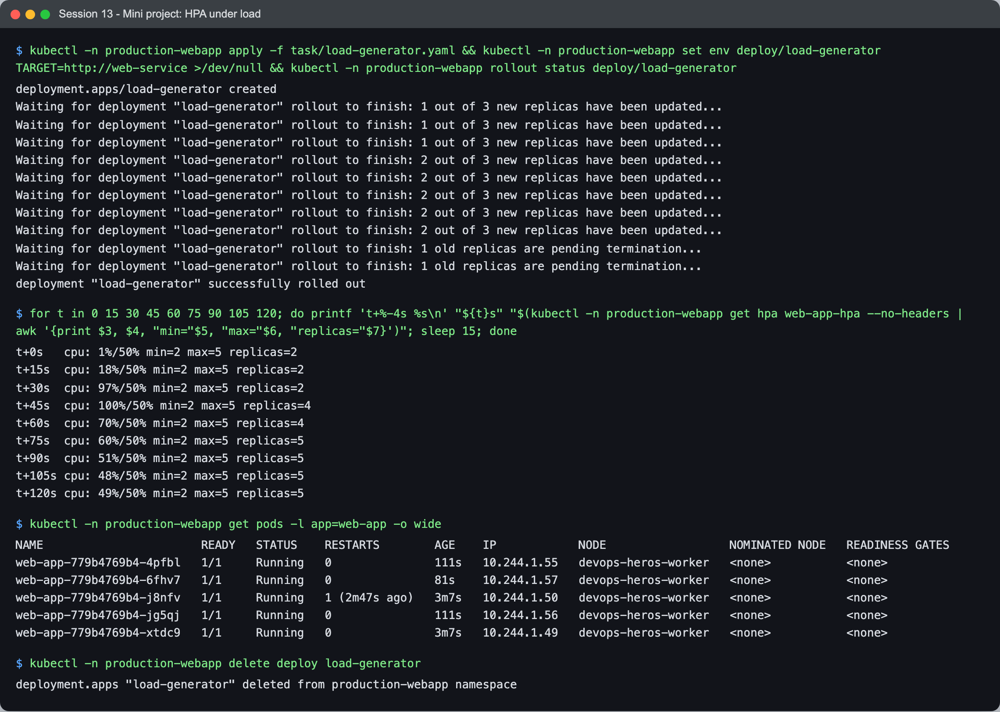

# Session 13 — Kubernetes Storage, HPA & Probes — Task

- **Name:** Raj Prakash
- **Enrollment No:** 2024EB02289

> **Status:** done
>
> Same cluster as sessions 11–12: kind v0.30.0, Kubernetes v1.34.0, 1 control plane + 2 workers,
> **metrics-server v0.9.0** (installed by the
> [cluster setup script](../../session-11-kubernetes-services/task/cluster-setup.sh) — the HPA
> cannot work without it). Storage is kind's default `standard` StorageClass
> (`rancher.io/local-path`). macOS on Apple Silicon.

| Task | Where |
|---|---|
| **Task 1** — Kubernetes volumes: emptyDir, hostPath, PV, PVC, StorageClass, dynamic provisioning | [`01-kubernetes-volumes/README.md`](01-kubernetes-volumes/README.md) |
| **Task 2** — HPA hands-on with a load generator | [below](#task-2-hpa-hands-on) |
| **Task 3** — Mini project: PVC + probes + HPA together | [below](#task-3-mini-project) |

Files of mine: [`load-generator.yaml`](load-generator.yaml), and two storage manifests in
[`01-kubernetes-volumes/`](01-kubernetes-volumes/). Everything else is the course YAML, unchanged.

---

## Task 2: HPA hands-on

The course [`04-hpa/`](../04-hpa/): an nginx Deployment with **`requests.cpu: 100m`**, a ClusterIP
Service, and an `autoscaling/v2` HPA — 1 to 5 replicas, target **50% average CPU utilization**.

### 1–3. Deploy the application, configure and verify the HPA



```text
$ kubectl apply -f 04-hpa/deployment.yaml -f 04-hpa/service.yaml -f 04-hpa/hpa.yaml
deployment.apps/hpa-demo created
service/hpa-demo-service created
horizontalpodautoscaler.autoscaling/hpa-demo created

$ kubectl get hpa hpa-demo   # straight after creation
NAME       REFERENCE             TARGETS              MINPODS   MAXPODS   REPLICAS   AGE
hpa-demo   Deployment/hpa-demo   cpu: <unknown>/50%   1         5         0          2s

$ ... wait until a metric arrives; kubectl get hpa hpa-demo
hpa-demo   Deployment/hpa-demo   cpu: 0%/50%   1         5         1          47s

$ kubectl top pods -l app=hpa-demo
NAME                        CPU(cores)   MEMORY(bytes)
hpa-demo-7b7f74b45d-xwgz9   0m           12Mi

$ kubectl describe hpa hpa-demo | sed -n '/^Metrics:/,/^Events:/p'
Metrics:                                               ( current / target )
  resource cpu on pods  (as a percentage of request):  0% (0) / 50%
Min replicas:                                          1
Max replicas:                                          5
Conditions:
  AbleToScale     True    ScaleDownStabilized  recent recommendations were higher than current one, ...
  ScalingActive   True    ValidMetricFound     the HPA was able to successfully calculate a replica count from cpu resource utilization (percentage of request)
  ScalingLimited  False   DesiredWithinRange   the desired count is within the acceptable range
```

`cpu: <unknown>/50%` for the first ~45 seconds is normal: metrics-server scrapes the kubelets on
an interval, and a brand-new pod has no sample yet. `describe` is where to check that the HPA is
healthy — `ScalingActive True / ValidMetricFound` means it can read metrics and compute a replica
count.

**"50%" means 50% of the CPU *request*,** not of a core and not of the limit: 50% of 100m = **50m
per pod**. That is why the HPA needs `resources.requests` on the container at all — without a
request there is nothing to take a percentage of.

### 4–7. Load generator, rising CPU, scaling up

[`load-generator.yaml`](load-generator.yaml) runs three busybox pods in a tight
`wget http://hpa-demo-service` loop. I sampled the HPA every 15 seconds:



```text
$ kubectl apply -f task/load-generator.yaml
deployment.apps/load-generator created

t+0s    0%/50%         replicas=1
t+15s   0%/50%         replicas=1
t+30s   109%/50%       replicas=1
t+45s   200%/50%       replicas=3
t+60s   101%/50%       replicas=4
t+75s   83%/50%        replicas=4
t+90s   68%/50%        replicas=5
t+105s  67%/50%        replicas=5
t+120s  55%/50%        replicas=5
t+135s  47%/50%        replicas=5
...
t+210s  50%/50%        replicas=5

$ kubectl top pods -l app=hpa-demo
hpa-demo-7b7f74b45d-2rjnz   50m          12Mi
hpa-demo-7b7f74b45d-7rzkj   50m          12Mi
hpa-demo-7b7f74b45d-hpx77   50m          12Mi
hpa-demo-7b7f74b45d-htx9w   51m          12Mi
hpa-demo-7b7f74b45d-xwgz9   51m          12Mi

$ kubectl describe hpa hpa-demo | sed -n '/^Events:/,$p'
  Normal   SuccessfulRescale  3m19s  horizontal-pod-autoscaler  New size: 3; reason: cpu resource utilization (percentage of request) above target
  Normal   SuccessfulRescale  3m4s   horizontal-pod-autoscaler  New size: 4; reason: cpu resource utilization (percentage of request) above target
  Normal   SuccessfulRescale  2m34s  horizontal-pod-autoscaler  New size: 5; reason: cpu resource utilization (percentage of request) above target
```

Reading the timeline against the HPA's formula,
`desired = ceil(current × currentUtilization / target)`:

- **t+30s: 109% on 1 pod → ceil(1 × 109/50) = 3**, and 3 is what it scaled to (the event
  says "New size: 3"). The 200% shown at t+45s is the next reading, taken while the new pods
  were still starting; the next decisions took it to 4, then 5. (The default scale-up limit —
  4 pods or 100% per 15 s, whichever is larger — would have allowed 1 → 5; it was not the
  constraint here.)
- **It stopped at 5 because `maxReplicas: 5`**, not because load was satisfied — at t+90s it was
  still 68%, which on its own would ask for ceil(5 × 68/50) = 7.
- **The total CPU stayed the same; it was spread thinner.** One pod at 200% of 100m ≈ 200m+
  (capped by its 200m limit); five pods at ~50m each = ~250m. The load generator produces a fixed
  amount of work; scaling divides it until each pod sits at the target. The pods also spread
  over both workers.

### Scaling down — and the 5-minute wait



```text
$ kubectl delete -f task/load-generator.yaml
t+0s    50%/50%        replicas=5
t+60s   28%/50%        replicas=5
t+90s   0%/50%         replicas=5
...
t+300s  0%/50%         replicas=5
t+330s  0%/50%         replicas=5
t+360s  0%/50%         replicas=3
t+390s  0%/50%         replicas=1

  Normal   SuccessfulRescale   111s  horizontal-pod-autoscaler  New size: 3; reason: All metrics below target
  Normal   SuccessfulRescale   96s   horizontal-pod-autoscaler  New size: 1; reason: All metrics below target
```

CPU was **0% from t+90s** but the replicas stayed at 5 for another **~4½ minutes**. That is the
default **scale-down stabilization window of 300 seconds**: the HPA scales down only to the
*highest* recommendation it made in the last 5 minutes. It is deliberate asymmetry — scale up
fast (traffic is arriving), scale down slowly (so a brief lull doesn't remove capacity that the
next spike needs, causing flapping). It is tunable per HPA with
`spec.behavior.scaleDown.stabilizationWindowSeconds`.

---

## Task 3: Mini project

The course [`mini-project/`](../mini-project/) puts the session together in a `production-webapp`
namespace: a 500Mi PVC, a 2-replica nginx Deployment (strategy `Recreate`) with the PVC on
`/data` and all three probes, a Service, and an HPA (2–5 replicas at 50% CPU).

### Deploy



```text
$ kubectl -n production-webapp get deploy,svc,pvc,hpa
deployment.apps/web-app   2/2     2            2           13s
service/web-service   ClusterIP   10.96.35.100   <none>        80/TCP    13s
persistentvolumeclaim/web-data   Bound    pvc-acc31254-949b-4060-afe3-89f1bf220f44   500Mi      RWO            standard
horizontalpodautoscaler.autoscaling/web-app-hpa   Deployment/web-app   cpu: <unknown>/50%   2         5         0          13s

$ kubectl -n production-webapp get pods -o wide
web-app-5b6bd49dd5-6pjhd   1/1     Running   0          13s   10.244.1.47   devops-heros-worker
web-app-5b6bd49dd5-c94ln   1/1     Running   0          13s   10.244.1.48   devops-heros-worker

PV pinned to node: ["devops-heros-worker"]
```

**Both pods are on the same node.** Not chance — the PVC is `ReadWriteOnce` on local-path storage,
so the provisioned volume has node affinity to `devops-heros-worker`, and any pod mounting it
can only be scheduled there. (RWO means one *node*, not one pod — that is why two pods can share
it at all.)

### Persistence



```text
$ kubectl -n production-webapp exec web-app-...-6pjhd -- sh -c "echo order-1001 written by web-app-5b6bd49dd5-6pjhd > /data/orders.txt"
read from web-app-5b6bd49dd5-c94ln:
order-1001 written by web-app-5b6bd49dd5-6pjhd

$ kubectl -n production-webapp rollout restart deploy/web-app && kubectl -n production-webapp rollout status deploy/web-app
Waiting for deployment "web-app" rollout to finish: 0 out of 2 new replicas have been updated...
...
$ kubectl -n production-webapp get pods -l app=web-app
web-app-779b4769b4-j8nfv   1/1     Running   0          10s
web-app-779b4769b4-xtdc9   1/1     Running   0          10s
read from new pod web-app-779b4769b4-j8nfv:
order-1001 written by web-app-5b6bd49dd5-6pjhd
```

One pod wrote, the other read it (same volume), and after **every pod was replaced** — new
ReplicaSet hash `779b4769b4` — the data was still there. Note the `Recreate` strategy: the old pods
were all terminated *before* new ones started (`0 out of 2 new replicas have been updated` while
it waited), i.e. a moment of downtime. That is the trade-off the course made to avoid two
generations of pods writing to the same volume at once.

### Probes in action



```text
$ kubectl -n production-webapp describe deploy web-app | grep -E '^\s+(Liveness|Readiness|Startup):'
    Liveness:     http-get http://:80/ delay=5s timeout=2s period=5s #success=1 #failure=3
    Readiness:    http-get http://:80/ delay=5s timeout=2s period=5s #success=1 #failure=2
    Startup:      http-get http://:80/ delay=0s timeout=1s period=2s #success=1 #failure=30
endpoints: 10.244.1.50 10.244.1.49

$ # break one pod: remove the page every probe checks
$ kubectl -n production-webapp exec web-app-779b4769b4-j8nfv -- rm /usr/share/nginx/html/index.html

t+0s  READY=1/1 STATUS=Running RESTARTS=0  endpoints=2
t+4s  READY=1/1 STATUS=Running RESTARTS=0  endpoints=2
t+8s  READY=1/1 STATUS=Running RESTARTS=0  endpoints=2
t+12s READY=0/1 STATUS=Running RESTARTS=1  endpoints=1
t+16s READY=0/1 STATUS=Running RESTARTS=1  endpoints=1
t+20s READY=1/1 STATUS=Running RESTARTS=1  endpoints=2
...
  Warning   Unhealthy   pod/web-app-779b4769b4-j8nfv   Liveness probe failed: HTTP probe failed with statuscode: 403
  Warning   Unhealthy   pod/web-app-779b4769b4-j8nfv   Readiness probe failed: HTTP probe failed with statuscode: 403
  Normal    Killing     pod/web-app-779b4769b4-j8nfv   Container nginx failed liveness probe, will be restarted
  Normal    Started     pod/web-app-779b4769b4-j8nfv   Started container nginx

$ kubectl -n production-webapp exec web-app-779b4769b4-j8nfv -- ls /usr/share/nginx/html/
50x.html
index.html
```

What each probe did:

- **Readiness** failed (2 × 5 s) → the pod was **removed from the Service's endpoints** (2 → 1).
  Traffic stopped going to it, but readiness never restarts anything.
- **Liveness** failed (3 × 5 s) → the kubelet **killed and restarted the container**
  (`RESTARTS=1`). The restart brought `index.html` back, because it lives in the image layer; the
  damage was in the container's writable layer, which a restart throws away. (Data on `/data`,
  the PVC, would have survived — that is the persistence test above.)
- **Startup** protects slow starters: until it succeeds, liveness and readiness are not run, so a
  slow app is not killed mid-boot. With `30 × 2 s` the container gets up to 60 s.
- nginx answered **403**, not 404 — with `index.html` gone, `/` is a directory without an index
  and autoindex is off. The probes only care that it is not 2xx/3xx.

In about 20 seconds the pod went unready, was restarted and rejoined, with no human involved and
the Service never sending traffic to the broken copy. That is the job of probes.

### HPA under load — and the node it is stuck on



```text
t+0s   cpu: 1%/50% min=2 max=5 replicas=2
t+30s  cpu: 97%/50% min=2 max=5 replicas=2
t+45s  cpu: 100%/50% min=2 max=5 replicas=4
t+75s  cpu: 60%/50% min=2 max=5 replicas=5
t+120s cpu: 49%/50% min=2 max=5 replicas=5

$ kubectl -n production-webapp get pods -l app=web-app -o wide
web-app-779b4769b4-4pfbl   1/1   Running   0               111s   10.244.1.55   devops-heros-worker
web-app-779b4769b4-6fhv7   1/1   Running   0               81s    10.244.1.57   devops-heros-worker
web-app-779b4769b4-j8nfv   1/1   Running   1 (2m47s ago)   3m7s   10.244.1.50   devops-heros-worker
web-app-779b4769b4-jg5qj   1/1   Running   0               111s   10.244.1.56   devops-heros-worker
web-app-779b4769b4-xtdc9   1/1   Running   0               3m7s   10.244.1.49   devops-heros-worker
```

The HPA did its job — 2 → 4 → 5 — but **all five replicas landed on `devops-heros-worker`**,
while in Task 2 (no volume) they spread over both workers. Every replica mounts the RWO volume
pinned to that node. So in this design **the autoscaler can only scale up to what one node can
hold**; a second node adds nothing. For an app that genuinely needs shared storage across
replicas you need `ReadWriteMany` storage (NFS/EFS), or better, keep the web tier stateless and
put the state in a database.

---

## What I learned

- **HPA percentages are of the CPU request**, so the request is part of the autoscaling design,
  not just scheduling. No request, no HPA.
- **Scaling up is fast and bounded; scaling down waits 5 minutes** by default — 0% CPU for 4½
  minutes with 5 replicas was the stabilization window, not a bug.
- **`maxReplicas` is a hard ceiling** even while utilization is above target, so it should be
  set from what the cluster (and the budget) can afford.
- **Readiness and liveness are different tools**: one takes a pod out of the load balancer, the
  other restarts it. Pointing both at the same endpoint (as here) means a bad page triggers both
  — fine for nginx, risky for an app where a dependency outage would make every pod restart at
  once.
- **Storage choices constrain scaling.** An RWO local volume pinned all replicas to one node —
  invisible in the YAML, obvious in `-o wide`.

## Problems I hit

- **The HPA logged `FailedGetResourceMetric … no metrics returned from resource metrics API`**
  in its events for the first minute. That is metrics-server having no sample yet for a new pod;
  it cleared without intervention. Seen without context it looks like a broken metrics pipeline,
  so `kubectl top pods` is the quick check before debugging further.
- **The course's static PV and PVC never bound** — the PVC was given the default StorageClass by
  an admission plugin. Written up with the fix in
  [Task 1](01-kubernetes-volumes/README.md#the-courses-static-pvpvc-do-not-bind--and-why).
