# Session 14 — Kubernetes Troubleshooting — Task

- **Name:** Raj Prakash
- **Enrollment No:** 24BCS10328

> **Status:** done
>
> Same cluster as sessions 11–13: kind v0.30.0, Kubernetes v1.34.0, 1 control plane + 2 workers,
> metrics-server installed. macOS on Apple Silicon. Every failure below was created on purpose,
> then investigated from the symptom — the fix was only written after the root cause was found.

| Task | Section |
|---|---|
| **Task 1** — the troubleshooting commands | [→](#task-1-the-troubleshooting-commands) |
| **Task 2** — nine kinds of failure, each identified → investigated → root cause → fixed → verified | [→](#task-2-troubleshooting-common-issues) |
| **Task 3** — mini project | [→](#task-3-mini-project) |

Broken workloads: the course's [`../scenarios/`](../scenarios/), [`../08-pending-pods/`](../08-pending-pods/),
[`../09-service-dns-troubleshooting/`](../09-service-dns-troubleshooting/), plus three of mine in
[`scenarios/`](scenarios/) for the issue types the course did not cover (ContainerCreating, a
configuration error, a NetworkPolicy). Every fix is a file in [`fixes/`](fixes/).

---

## Task 1: The troubleshooting commands

On a healthy app first (the mini project's nginx Deployment), so I know what "normal" looks like:

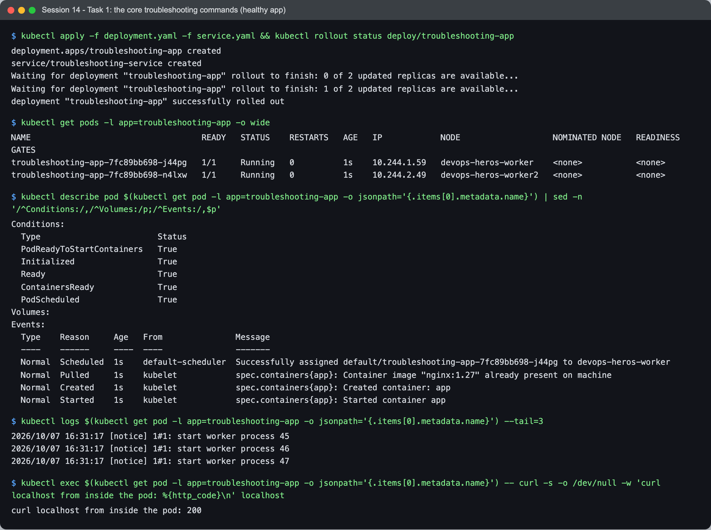

```text
$ kubectl get pods -l app=troubleshooting-app -o wide
troubleshooting-app-7fc89bb698-j44pg   1/1     Running   0          1s    10.244.1.59   devops-heros-worker
troubleshooting-app-7fc89bb698-n4lxw   1/1     Running   0          1s    10.244.2.49   devops-heros-worker2

$ kubectl describe pod troubleshooting-app-7fc89bb698-j44pg | sed -n '/^Conditions:/,/^Volumes:/p;/^Events:/,$p'
Conditions:
  PodReadyToStartContainers   True
  Initialized                 True
  Ready                       True
  ContainersReady             True
  PodScheduled                True
Events:
  Normal  Scheduled  1s    default-scheduler  Successfully assigned default/troubleshooting-app-7fc89bb698-j44pg to devops-heros-worker
  Normal  Pulled     1s    kubelet            spec.containers{app}: Container image "nginx:1.27" already present on machine
  Normal  Created    1s    kubelet            spec.containers{app}: Created container: app
  Normal  Started    1s    kubelet            spec.containers{app}: Started container app

$ kubectl logs troubleshooting-app-7fc89bb698-j44pg --tail=3
2026/10/07 16:31:17 [notice] 1#1: start worker process 47

$ kubectl exec troubleshooting-app-7fc89bb698-j44pg -- curl -s -o /dev/null -w 'curl localhost from inside the pod: %{http_code}\n' localhost
curl localhost from inside the pod: 200
```

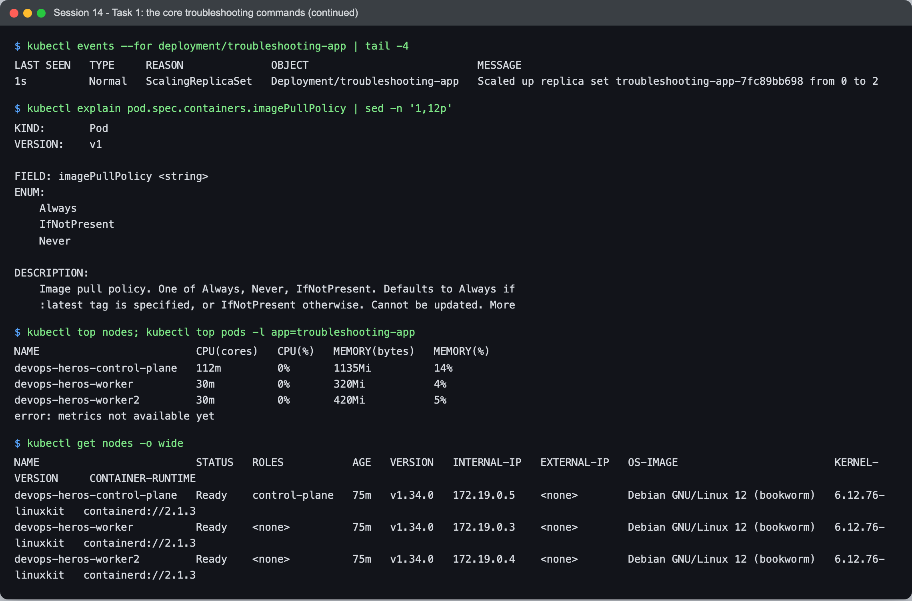

```text
$ kubectl events --for deployment/troubleshooting-app | tail -4
1s          Normal   ScalingReplicaSet   Deployment/troubleshooting-app   Scaled up replica set troubleshooting-app-7fc89bb698 from 0 to 2

$ kubectl explain pod.spec.containers.imagePullPolicy
FIELD: imagePullPolicy <string>
ENUM:  Always | IfNotPresent | Never
DESCRIPTION:
    Image pull policy. One of Always, Never, IfNotPresent. Defaults to Always if
    :latest tag is specified, or IfNotPresent otherwise. ...

$ kubectl top nodes; kubectl top pods -l app=troubleshooting-app
devops-heros-control-plane   112m         0%       1135Mi          14%
devops-heros-worker          30m          0%       320Mi           4%
devops-heros-worker2         30m          0%       420Mi           5%
error: metrics not available yet
```

| Command | What it answers | Reach for it when |
|---|---|---|
| `kubectl get` (`-o wide`) | what exists and its status; `-o wide` adds pod IP and **node** | always first |
| `kubectl describe` | full spec + status + **Events** — the "why" | anything not Running/Ready |
| `kubectl logs` (`--previous`, `-c`) | what the app printed; `--previous` = the crashed instance | the container started at least once |
| `kubectl exec` | run commands inside — test from the pod's point of view | network/config questions |
| `kubectl events` | the event stream for an object, sorted | sequence of what happened |
| `kubectl explain` | the API reference for any field, offline | "what does this field do / default to?" |
| `kubectl top` | live CPU/memory from metrics-server | OOM, throttling, HPA |

`kubectl top pods` said `metrics not available yet` for pods one second old — metrics-server
scrapes on an interval, so a new pod has no sample. Not a failure.

---

## Task 2: Troubleshooting common issues

I deployed everything broken at once, then went through them one by one.

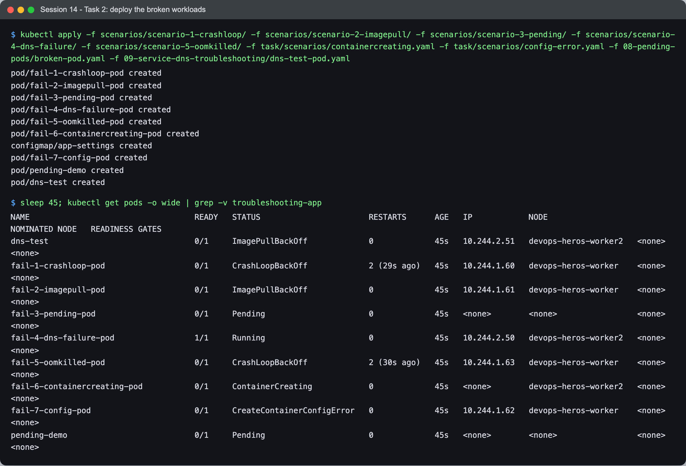

```text
$ kubectl get pods -o wide
NAME                           READY   STATUS                       RESTARTS      AGE   IP            NODE
dns-test                       0/1     ImagePullBackOff             0             45s   10.244.2.51   devops-heros-worker2
fail-1-crashloop-pod           0/1     CrashLoopBackOff             2 (29s ago)   45s   10.244.1.60   devops-heros-worker
fail-2-imagepull-pod           0/1     ImagePullBackOff             0             45s   10.244.1.61   devops-heros-worker
fail-3-pending-pod             0/1     Pending                      0             45s   <none>        <none>
fail-4-dns-failure-pod         1/1     Running                      0             45s   10.244.2.50   devops-heros-worker2
fail-5-oomkilled-pod           0/1     CrashLoopBackOff             2 (30s ago)   45s   10.244.1.63   devops-heros-worker
fail-6-containercreating-pod   0/1     ContainerCreating            0             45s   <none>        devops-heros-worker2
fail-7-config-pod              0/1     CreateContainerConfigError   0             45s   10.244.1.62   devops-heros-worker
pending-demo                   0/1     Pending                      0             45s   <none>        <none>
```

The `STATUS` column already sorts these into phases of a pod's life, which tells you **where to
look**:

| Status | Stuck at | Look at |
|---|---|---|
| `Pending`, no node | scheduling | `describe` → Events from `default-scheduler` |
| `ContainerCreating` | volumes / network setup on the node | `describe` → Events from `kubelet` |
| `ErrImagePull` / `ImagePullBackOff` | pulling the image | `describe` → image name, the pull error |
| `CreateContainerConfigError` | building the container's config | `describe` → missing key/Secret/ConfigMap |
| `CrashLoopBackOff` | the app itself | `logs --previous`, `describe` → Last State, exit code |
| `Running` but not working | the app or the network | `logs`, `exec`, Services, DNS, NetworkPolicy |

Note `fail-4-dns-failure-pod`: **`1/1 Running` and broken** — the hardest kind.

### 1. CrashLoopBackOff

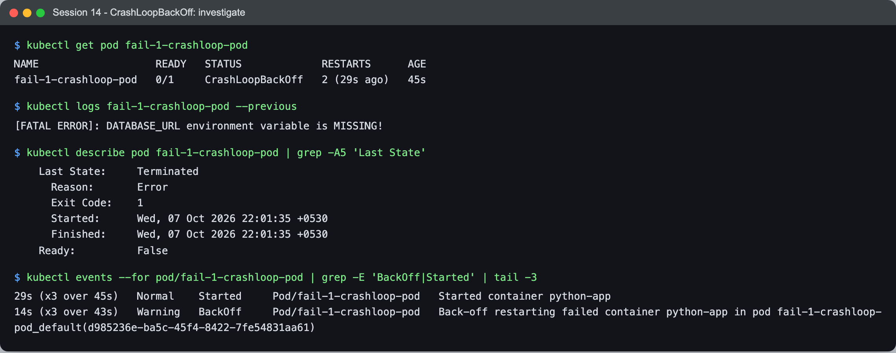

```text
$ kubectl logs fail-1-crashloop-pod --previous
[FATAL ERROR]: DATABASE_URL environment variable is MISSING!

$ kubectl describe pod fail-1-crashloop-pod | grep -A5 'Last State'
    Last State:     Terminated
      Reason:       Error
      Exit Code:    1

$ kubectl events --for pod/fail-1-crashloop-pod | grep -E 'BackOff|Started'
29s (x3 over 45s)   Normal    Started     Pod/fail-1-crashloop-pod   Started container python-app
14s (x3 over 43s)   Warning   BackOff     Pod/fail-1-crashloop-pod   Back-off restarting failed container python-app ...
```

- **Problem:** the container starts, exits, is restarted, exits again; the kubelet backs off
  (10 s, 20 s, 40 s … up to 5 min).
- **Root cause:** `logs --previous` — the logs of the instance that crashed, not the one currently
  waiting — says it: `DATABASE_URL` is not set, the app exits with code 1.

**Fix attempt 1 — set `DATABASE_URL`** ([`fixes/scenario-1-attempt1-env-only.yaml`](fixes/scenario-1-attempt1-env-only.yaml)):

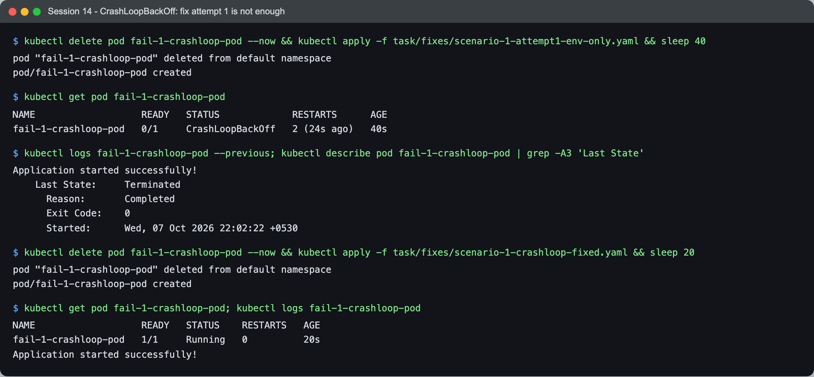

```text
$ kubectl get pod fail-1-crashloop-pod
fail-1-crashloop-pod   0/1     CrashLoopBackOff   2 (24s ago)   40s

$ kubectl logs fail-1-crashloop-pod --previous; kubectl describe pod fail-1-crashloop-pod | grep -A3 'Last State'
Application started successfully!
    Last State:     Terminated
      Reason:       Completed
      Exit Code:    0
```

**Still CrashLoopBackOff — with exit code 0.** The env var problem was fixed; the app now
starts, prints success… and returns. A pod's `restartPolicy` defaults to `Always`, so *any* exit
is restarted, and repeated exits — successful or not — become CrashLoopBackOff. The scenario has
two bugs, and the second only appears once the first is fixed.

**Fix:** keep the process running, as a service must
([`fixes/scenario-1-crashloop-fixed.yaml`](fixes/scenario-1-crashloop-fixed.yaml)). (If it really
were a run-once task, the fix would be a Job, or `restartPolicy: OnFailure`.)

```text
$ kubectl get pod fail-1-crashloop-pod; kubectl logs fail-1-crashloop-pod
fail-1-crashloop-pod   1/1     Running   0          20s
Application started successfully!
```

### 2. ErrImagePull / ImagePullBackOff

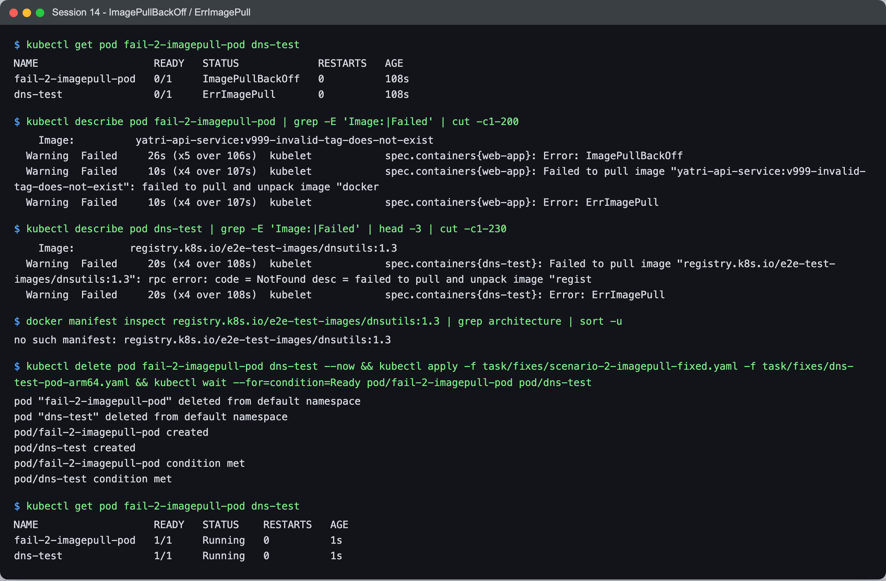

```text
$ kubectl get pod fail-2-imagepull-pod dns-test
fail-2-imagepull-pod   0/1     ImagePullBackOff   0          108s
dns-test               0/1     ErrImagePull       0          108s

$ kubectl describe pod fail-2-imagepull-pod | grep -E 'Image:|Failed'
    Image:          yatri-api-service:v999-invalid-tag-does-not-exist
  Warning  Failed     ...  Error: ImagePullBackOff
  Warning  Failed     ...  Failed to pull image "yatri-api-service:v999-invalid-tag-does-not-exist": failed to pull and unpack image "docker...
  Warning  Failed     ...  Error: ErrImagePull

$ kubectl describe pod dns-test | grep -E 'Image:|Failed'
    Image:         registry.k8s.io/e2e-test-images/dnsutils:1.3
  Warning  Failed     ...  Failed to pull image "registry.k8s.io/e2e-test-images/dnsutils:1.3": rpc error: code = NotFound ...
```

**ErrImagePull and ImagePullBackOff are the same problem at two moments**: `ErrImagePull` is a
pull that just failed; `ImagePullBackOff` is the kubelet waiting before retrying. The two pods
alternate between them in the output.

- `fail-2`: `yatri-api-service` with no registry means `docker.io/library/yatri-api-service` — a
  Docker Hub official image that does not exist. **Fix:** a real image
  ([`fixes/scenario-2-imagepull-fixed.yaml`](fixes/scenario-2-imagepull-fixed.yaml)).
- `dns-test` (the course's DNS debugging pod): my first assumption, after session 10's MySQL 5.7,
  was "no arm64 build". The registry said otherwise:

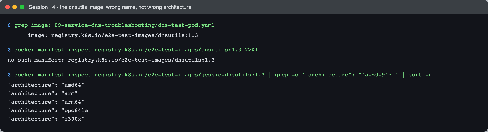

```text
$ docker manifest inspect registry.k8s.io/e2e-test-images/dnsutils:1.3
no such manifest: registry.k8s.io/e2e-test-images/dnsutils:1.3
$ docker manifest inspect registry.k8s.io/e2e-test-images/jessie-dnsutils:1.3 | grep architecture | sort -u
"architecture": "amd64"
"architecture": "arm"
"architecture": "arm64"
...
```

The tag does not exist for **any** architecture — the image is **`jessie-dnsutils`**, as in the
Kubernetes DNS-debugging docs. Wrong name, not wrong platform; `NotFound` (rather than "no match
for platform in manifest") was the clue I skipped past. I replaced it with busybox, which has
both `nslookup` and the `wget` the later scenarios need
([`fixes/dns-test-pod-arm64.yaml`](fixes/dns-test-pod-arm64.yaml) — the file name records my
wrong first guess). Both pods: `1/1 Running`.

### 3. Pending

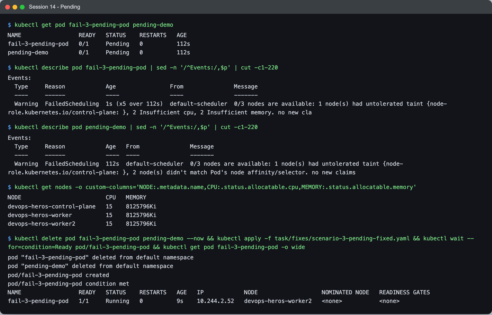

```text
$ kubectl describe pod fail-3-pending-pod | sed -n '/^Events:/,$p'
  Warning  FailedScheduling  1s (x5 over 112s)  default-scheduler  0/3 nodes are available: 1 node(s) had untolerated taint {node-role.kubernetes.io/control-plane: }, 2 Insufficient cpu, 2 Insufficient memory. ...

$ kubectl describe pod pending-demo | sed -n '/^Events:/,$p'
  Warning  FailedScheduling  112s  default-scheduler  0/3 nodes are available: 1 node(s) had untolerated taint {node-role.kubernetes.io/control-plane: }, 2 node(s) didn't match Pod's node affinity/selector. ...

$ kubectl get nodes -o custom-columns='NODE:.metadata.name,CPU:.status.allocatable.cpu,MEMORY:.status.allocatable.memory'
devops-heros-control-plane   15    8125796Ki
devops-heros-worker          15    8125796Ki
devops-heros-worker2         15    8125796Ki
```

Pending means **no node accepted the pod**, and the scheduler's message gives a per-node tally of
why. Read it as an equation over all 3 nodes:

- `fail-3`: control plane excluded by its taint; both workers `Insufficient cpu` and
  `Insufficient memory`. It requests **500 CPUs and 1000 GiB**; each node has 15 CPUs and ~7.7 GiB.
  Requests are a reservation the scheduler must find room for — real use does not matter.
  **Fix:** realistic requests ([`fixes/scenario-3-pending-fixed.yaml`](fixes/scenario-3-pending-fixed.yaml)) → Running on `worker2`.
- `pending-demo`: `nodeSelector: kubernetes.io/hostname: node-that-does-not-exist` →
  `didn't match Pod's node affinity/selector`. **Fix:** remove the selector, or use a real label.

### 4. ContainerCreating

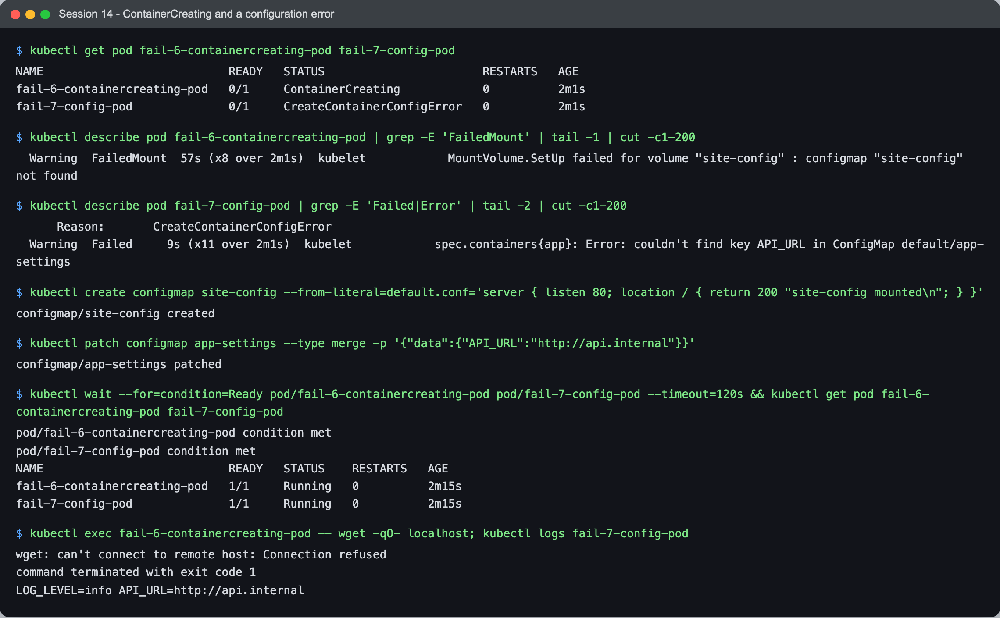

```text
$ kubectl get pod fail-6-containercreating-pod
fail-6-containercreating-pod   0/1     ContainerCreating            0          2m1s

$ kubectl describe pod fail-6-containercreating-pod | grep FailedMount
  Warning  FailedMount  57s (x8 over 2m1s)  kubelet  MountVolume.SetUp failed for volume "site-config" : configmap "site-config" not found
```

Scheduled (it has a node) but the kubelet cannot finish setting up the pod: the volume refers to
a ConfigMap that does not exist ([`scenarios/containercreating.yaml`](scenarios/containercreating.yaml)).
The kubelet retries; it does not fail the pod. **Fix:** create the ConfigMap → the pod starts on
the next retry, no restart needed.

**…and my fix had its own bug:**

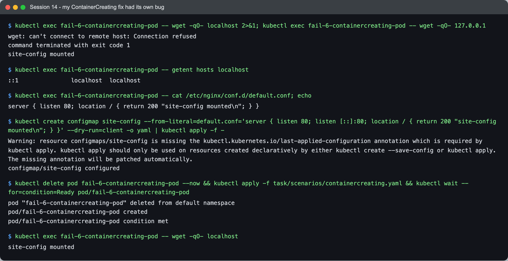

```text
$ kubectl exec fail-6-containercreating-pod -- wget -qO- localhost; ... wget -qO- 127.0.0.1
wget: can't connect to remote host: Connection refused
site-config mounted

$ kubectl exec fail-6-containercreating-pod -- getent hosts localhost
::1               localhost  localhost
$ kubectl exec fail-6-containercreating-pod -- cat /etc/nginx/conf.d/default.conf
server { listen 80; location / { return 200 "site-config mounted\n"; } }
```

The pod was `1/1 Running` and still refused `localhost`. In this image `localhost` resolves to
**`::1` (IPv6)**, and my config only had `listen 80` — IPv4. The stock nginx config has a
`listen [::]:80` line (the image's entrypoint adds it), which my ConfigMap replaced. Adding
`listen [::]:80;` and recreating the pod fixed it:

```text
$ kubectl exec fail-6-containercreating-pod -- wget -qO- localhost
site-config mounted
```

### 5. Configuration issue — CreateContainerConfigError

```text
$ kubectl describe pod fail-7-config-pod | grep -E 'Failed|Error'
      Reason:       CreateContainerConfigError
  Warning  Failed     9s (x11 over 2m1s)  kubelet  spec.containers{app}: Error: couldn't find key API_URL in ConfigMap default/app-settings

$ kubectl patch configmap app-settings --type merge -p '{"data":{"API_URL":"http://api.internal"}}'
$ kubectl logs fail-7-config-pod
LOG_LEVEL=info API_URL=http://api.internal
```

The ConfigMap exists, but one `configMapKeyRef` names a key it doesn't have
([`scenarios/config-error.yaml`](scenarios/config-error.yaml)). The container is never created,
so there are no logs — `describe` is the only source. **Fix:** add the key (or mark the reference
`optional: true` if the app copes without it). The kubelet retried and the pod started with both
values.

### 6. Service connectivity — no endpoints

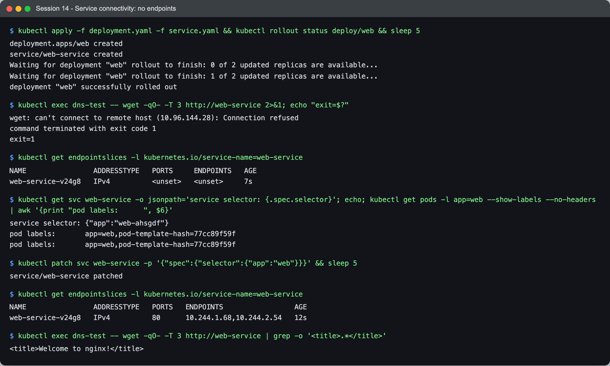

```text
$ kubectl exec dns-test -- wget -qO- -T 3 http://web-service
wget: can't connect to remote host (10.96.144.28): Connection refused

$ kubectl get endpointslices -l kubernetes.io/service-name=web-service
web-service-v24g8   IPv4          <unset>   <unset>     7s

$ kubectl get svc web-service -o jsonpath='service selector: {.spec.selector}'; ...
service selector: {"app":"web-ahsgdf"}
pod labels:       app=web,pod-template-hash=77cc89f59f
```

DNS worked (it resolved to `10.96.144.28`), the connection was **refused** instantly — the
signature of a Service with no endpoints ([session 11](../../session-11-kubernetes-services/task/README.md#1-clusterip--a-stable-virtual-ip-inside-the-cluster-only)
showed the iptables `REJECT` rule behind it). Comparing selector and labels: the course's
`service.yaml` selects `app: web-ahsgdf`, the pods are `app: web`. (This is the session's
*working* Service file, not the `broken-service.yaml` next to it — which is also broken, on
purpose, with `app: does-not-exist`.) **Fix:** correct the selector →

```text
web-service-v24g8   IPv4          80      10.244.1.68,10.244.2.54   12s
$ kubectl exec dns-test -- wget -qO- -T 3 http://web-service | grep -o '<title>.*</title>'
<title>Welcome to nginx!</title>
```

### 7. DNS issue

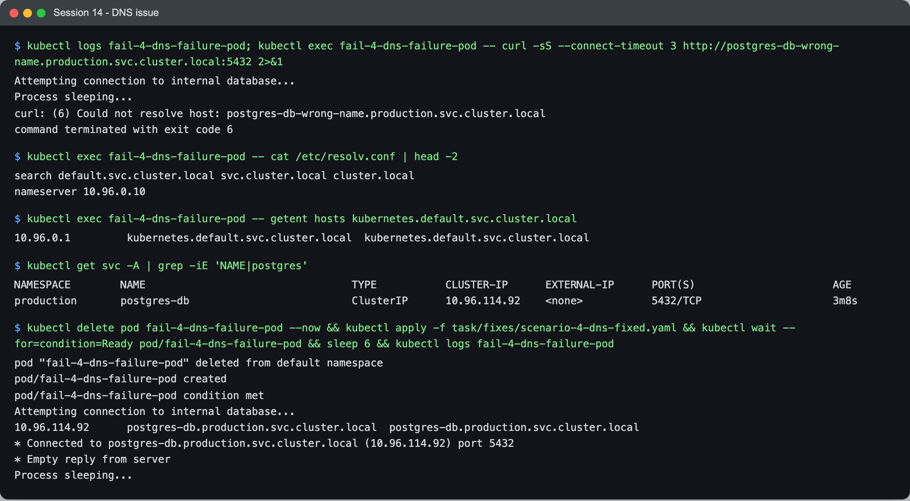

```text
$ kubectl logs fail-4-dns-failure-pod
Attempting connection to internal database...
Process sleeping...
$ kubectl exec fail-4-dns-failure-pod -- curl -sS --connect-timeout 3 http://postgres-db-wrong-name.production.svc.cluster.local:5432
curl: (6) Could not resolve host: postgres-db-wrong-name.production.svc.cluster.local

$ kubectl exec fail-4-dns-failure-pod -- getent hosts kubernetes.default.svc.cluster.local
10.96.0.1         kubernetes.default.svc.cluster.local  kubernetes.default.svc.cluster.local

$ kubectl get svc -A | grep -iE 'NAME|postgres'
NAMESPACE        NAME          TYPE        CLUSTER-IP     EXTERNAL-IP   PORT(S)    AGE
production       postgres-db   ClusterIP   10.96.114.92   <none>        5432/TCP   3m8s
```

The pod is `Running`, and its log hides the failure entirely — its script runs `curl -s … || true`:
`-s` suppresses curl's error message and `|| true` its exit code. I only saw the error by running
the same curl by hand without `-s`. `curl: (6)` = name resolution.
Is DNS itself broken? No — `kubernetes.default` resolves. So the **name** is wrong: searching every
namespace for a postgres Service finds `postgres-db` in `production`, not
`postgres-db-wrong-name`. **Fix** ([`fixes/scenario-4-dns-fixed.yaml`](fixes/scenario-4-dns-fixed.yaml)):

```text
10.96.114.92      postgres-db.production.svc.cluster.local  postgres-db.production.svc.cluster.local
* Connected to postgres-db.production.svc.cluster.local (10.96.114.92) port 5432
* Empty reply from server
```

`Connected … port 5432` proves DNS and the TCP path; the empty reply is Postgres refusing to speak
HTTP, which is expected. (I created that `production/postgres-db` Service from
[`scenarios/production-db.yaml`](scenarios/production-db.yaml) to give the scenario a real target.)

### 8. Pod networking — a NetworkPolicy

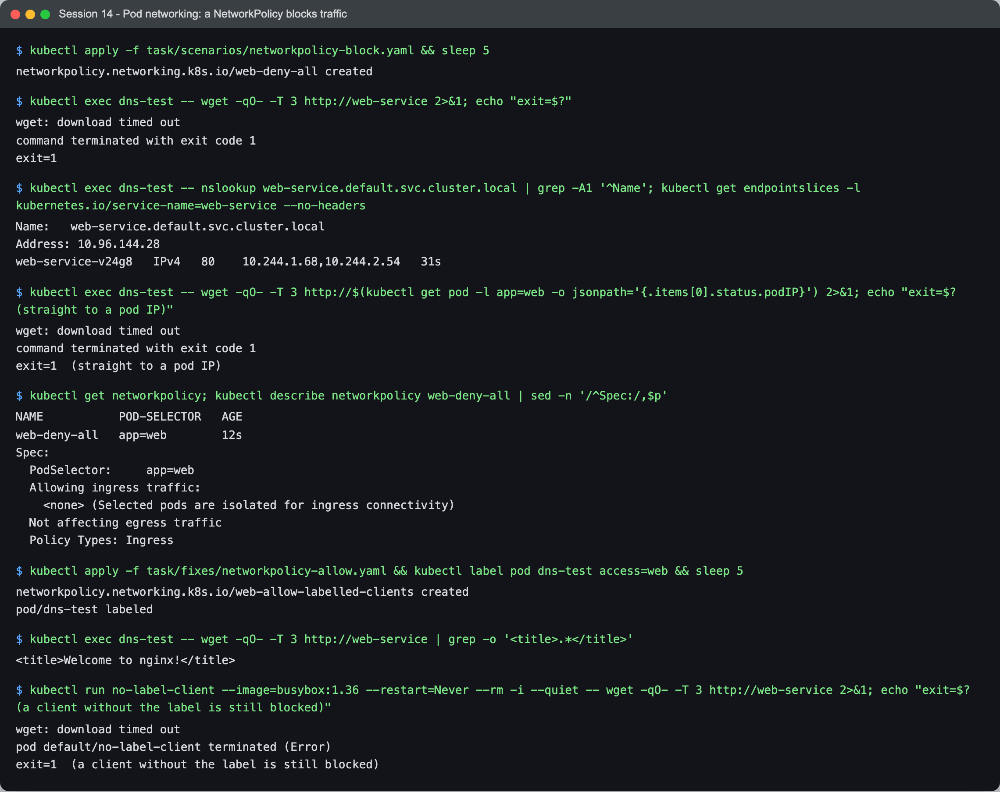

```text
$ kubectl apply -f task/scenarios/networkpolicy-block.yaml
$ kubectl exec dns-test -- wget -qO- -T 3 http://web-service
wget: download timed out

$ kubectl exec dns-test -- nslookup web-service.default.svc.cluster.local; kubectl get endpointslices ...
Address: 10.96.144.28
web-service-v24g8   IPv4   80    10.244.1.68,10.244.2.54   31s

$ kubectl exec dns-test -- wget -qO- -T 3 http://10.244.1.68
wget: download timed out                                  (straight to a pod IP)

$ kubectl describe networkpolicy web-deny-all | sed -n '/^Spec:/,$p'
  PodSelector:     app=web
  Allowing ingress traffic:
    <none> (Selected pods are isolated for ingress connectivity)
```

Everything from issue 6 is fine now — DNS resolves, endpoints exist — and it **times out**, even
straight to a pod IP, bypassing the Service. A timeout with healthy endpoints, between pods, points
at the network layer, and `kubectl get networkpolicy` found it: a policy selecting `app=web` with
no ingress rules = deny all inbound. (kind's default CNI, kindnet, enforces NetworkPolicy — on a
CNI that doesn't, the same YAML would silently do nothing.)

**Fix:** keep the deny, add an explicit allow for labelled clients
([`fixes/networkpolicy-allow.yaml`](fixes/networkpolicy-allow.yaml)):

```text
$ kubectl apply -f task/fixes/networkpolicy-allow.yaml && kubectl label pod dns-test access=web
$ kubectl exec dns-test -- wget -qO- -T 3 http://web-service | grep -o '<title>.*</title>'
<title>Welcome to nginx!</title>
$ kubectl run no-label-client ... wget -qO- -T 3 http://web-service
wget: download timed out
exit=1  (a client without the label is still blocked)
```

Policies are additive allow-lists: the labelled client gets in; an unlabelled one is still blocked,
which is the point of having the policy.

### 9. OOMKilled

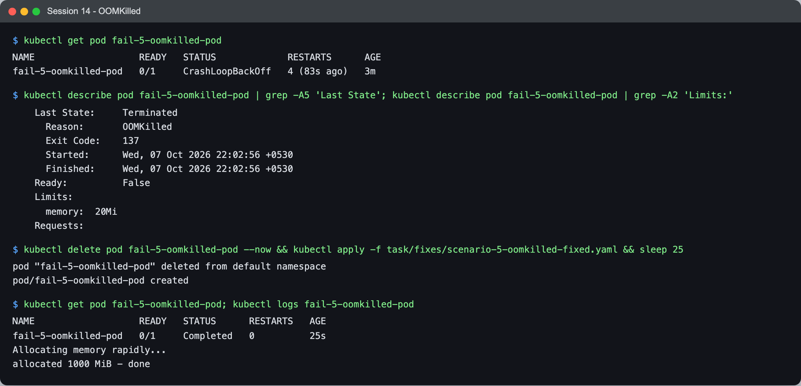

```text
$ kubectl get pod fail-5-oomkilled-pod
fail-5-oomkilled-pod   0/1     CrashLoopBackOff   4 (83s ago)   3m

$ kubectl describe pod fail-5-oomkilled-pod | grep -A5 'Last State'; ... grep -A2 'Limits:'
    Last State:     Terminated
      Reason:       OOMKilled
      Exit Code:    137
    Limits:
      memory:  20Mi
```

The status says CrashLoopBackOff — the *Last State* says why: **OOMKilled, exit code 137**
(128 + 9, SIGKILL). The kernel killed the process for exceeding its 20Mi memory limit while it
allocated 100 × 10 MiB. Unlike CPU (which is throttled), memory over the limit is fatal.
**Fix** ([`fixes/scenario-5-oomkilled-fixed.yaml`](fixes/scenario-5-oomkilled-fixed.yaml)): a
limit above what it needs, and `restartPolicy: Never` because it is a run-to-completion task —
otherwise issue 1's lesson applies and a successful exit would loop too.

```text
$ kubectl get pod fail-5-oomkilled-pod; kubectl logs fail-5-oomkilled-pod
fail-5-oomkilled-pod   0/1     Completed   0          25s
Allocating memory rapidly...
allocated 1000 MiB - done
```

### Summary

| # | Issue | Signature | Root cause | Fix |
|---|---|---|---|---|
| 1 | CrashLoopBackOff | exit 1, then exit **0** | missing env var; then a process that returns | set the var; keep the process running |
| 2 | ErrImagePull / ImagePullBackOff | `NotFound` | image doesn't exist (twice: bad name, misspelt name) | correct image reference |
| 3 | Pending | `FailedScheduling` tally | requests larger than any node; impossible nodeSelector | realistic requests; real selector |
| 4 | ContainerCreating | `FailedMount` | volume's ConfigMap missing (then my IPv6 bug) | create it; `listen [::]:80` |
| 5 | Configuration | `CreateContainerConfigError` | missing ConfigMap key | add the key |
| 6 | Service connectivity | refused, empty endpoints | selector typo | fix selector |
| 7 | DNS | `curl: (6)` | wrong Service name/namespace | correct FQDN |
| 8 | Pod networking | timeout with healthy endpoints | NetworkPolicy deny | explicit allow rule |
| 9 | OOMKilled | Last State OOMKilled, 137 | limit below need | raise limit; `restartPolicy: Never` |

---

## Task 3: Mini project

The course [`mini-project/`](../mini-project/): an nginx Deployment + Service (checked in Task 1),
then a broken pod and a Service selector challenge.

### The broken pod

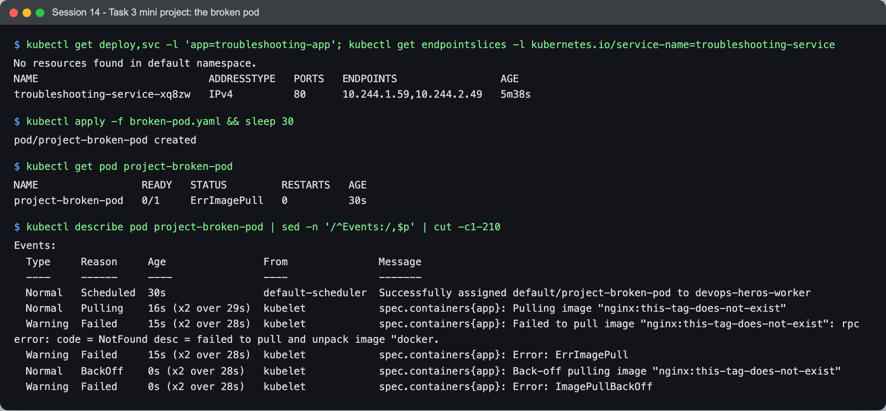

```text
$ kubectl get pod project-broken-pod
project-broken-pod   0/1     ErrImagePull   0          30s

$ kubectl describe pod project-broken-pod | sed -n '/^Events:/,$p'
  Normal   Pulling    16s (x2 over 29s)  kubelet  spec.containers{app}: Pulling image "nginx:this-tag-does-not-exist"
  Warning  Failed     15s (x2 over 28s)  kubelet  spec.containers{app}: Failed to pull image "nginx:this-tag-does-not-exist": rpc error: code = NotFound ...
  Warning  Failed     15s (x2 over 28s)  kubelet  spec.containers{app}: Error: ErrImagePull
  Normal   BackOff    0s (x2 over 28s)   kubelet  spec.containers{app}: Back-off pulling image "nginx:this-tag-does-not-exist"
  Warning  Failed     0s (x2 over 28s)   kubelet  spec.containers{app}: Error: ImagePullBackOff
```

The README's questions:

1. **What is the Pod status?** `ErrImagePull`, alternating with `ImagePullBackOff`; `READY 0/1`.
2. **What is the actual error?** `Failed to pull image "nginx:this-tag-does-not-exist": rpc error: code = NotFound`.
3. **Which command found the reason?** `kubectl describe pod project-broken-pod` — the Events.
4. **What is wrong with the image?** The repository (`nginx`) exists; the **tag**
   `this-tag-does-not-exist` doesn't.
5. **How to fix it?** Use a real tag, e.g. `nginx:1.27`. A pod's image can't be changed in place
   for most fields, so delete and recreate (in a Deployment you would just change the template):

```text
$ kubectl delete pod project-broken-pod --now && kubectl run project-broken-pod --image=nginx:1.27
project-broken-pod   1/1     Running   0          1s
```

### Service selector challenge

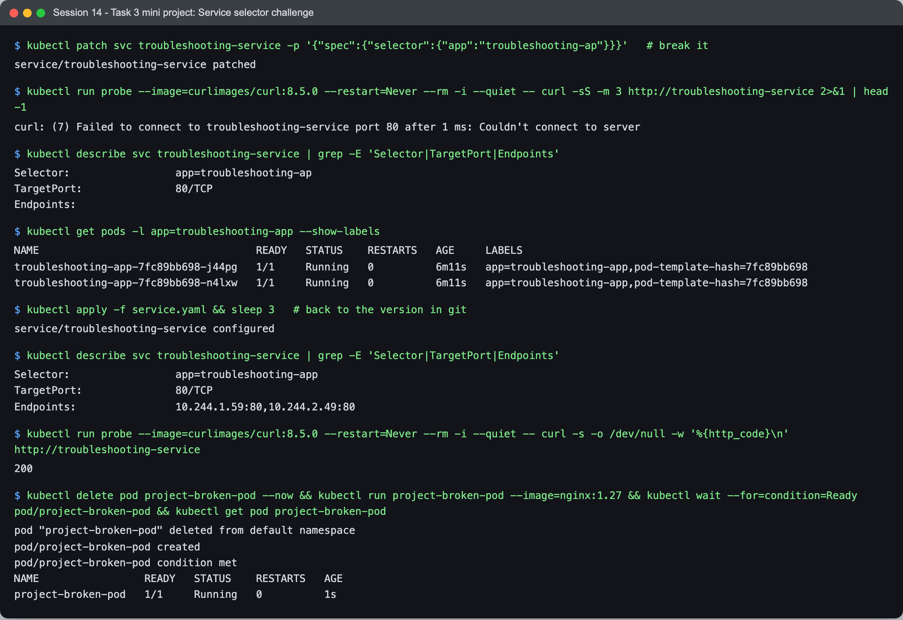

```text
$ kubectl patch svc troubleshooting-service -p '{"spec":{"selector":{"app":"troubleshooting-ap"}}}'   # break it
$ kubectl run probe ... curl -sS -m 3 http://troubleshooting-service
curl: (7) Failed to connect to troubleshooting-service port 80 after 1 ms: Couldn't connect to server

$ kubectl describe svc troubleshooting-service | grep -E 'Selector|TargetPort|Endpoints'
Selector:                 app=troubleshooting-ap
TargetPort:               80/TCP
Endpoints:
$ kubectl get pods -l app=troubleshooting-app --show-labels
troubleshooting-app-7fc89bb698-j44pg   1/1     Running   0          6m11s   app=troubleshooting-app,pod-template-hash=7fc89bb698

$ kubectl apply -f service.yaml   # back to the version in git
Selector:                 app=troubleshooting-app
Endpoints:                10.244.1.59:80,10.244.2.49:80
200
```

Exactly the README's checklist — **Selector, TargetPort, Endpoints**: empty endpoints, and a
one-letter difference between the selector and the pod labels. Re-applying the file from git
restored it — the declarative copy as the source of truth, the idea session 20 builds on.

---

## What I learned

- **The STATUS column says which component to ask.** Pending → scheduler; ContainerCreating →
  kubelet/volumes; image errors → registry; ConfigError → the referenced config; CrashLoop → the
  app's own logs. Knowing that cut every investigation short.
- **`logs --previous` and `describe`'s Last State** are the two essentials for anything that
  restarts — the current container may not have logged anything yet.
- **Exit code 0 can still crash-loop**, and OOMKilled shows up as CrashLoopBackOff unless you read
  Last State. The status is a summary; the reason is one level down.
- **Refused vs timed out vs could-not-resolve** separate "no endpoints", "network blocked" and
  "DNS" before running any other command.
- **`Running` is not "working"** — three of the nine (DNS, NetworkPolicy, and my IPv6 slip) were
  `1/1 Running` throughout. Testing from inside the cluster is the only real verification.

## Problems I hit

- **I misdiagnosed the dnsutils pod** as a missing arm64 image, by analogy with session 10, and only
  `docker manifest inspect` showed the tag did not exist at all — `jessie-dnsutils` is the real
  name. The kubelet's `NotFound` had said as much; I read what I expected to see.
- **My first fix for scenario 1 didn't work** — exactly the point of the scenario, as it turned
  out, but I only saw it because I checked the pod again after "fixing" it.
- **My ConfigMap for the ContainerCreating fix broke IPv6** by replacing the image's default nginx
  config. Found by testing `localhost` *and* `127.0.0.1` and getting different answers.
- **The DNS scenario's own log hides the failure**: its script runs `curl -s … || true`, so
  `kubectl logs` showed only "Attempting…" and "sleeping…". Running the same request with
  `kubectl exec` and without `-s` surfaced `curl: (6)` — a reminder that silent error handling in
  an app makes it look healthy.
