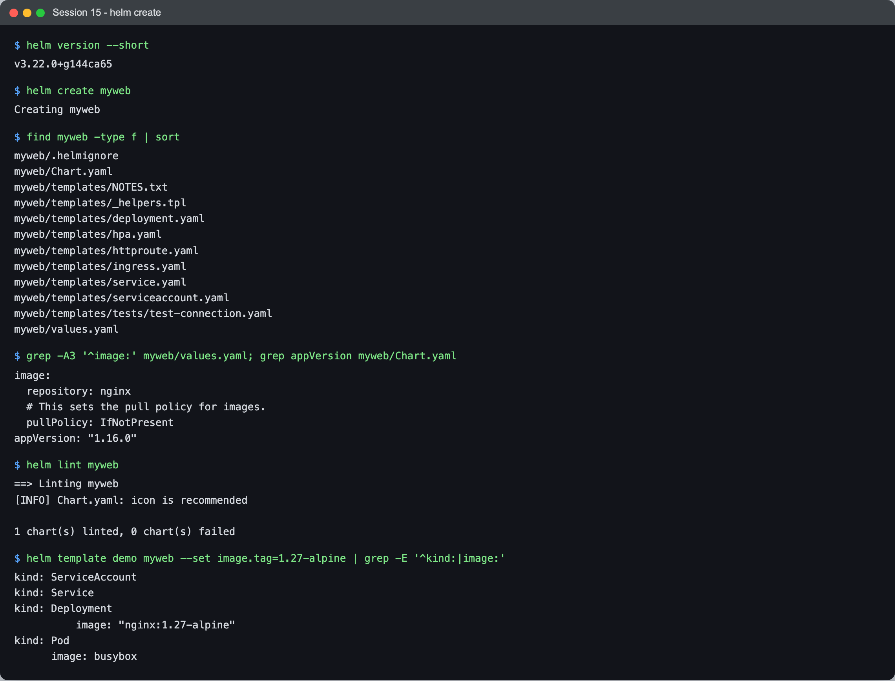
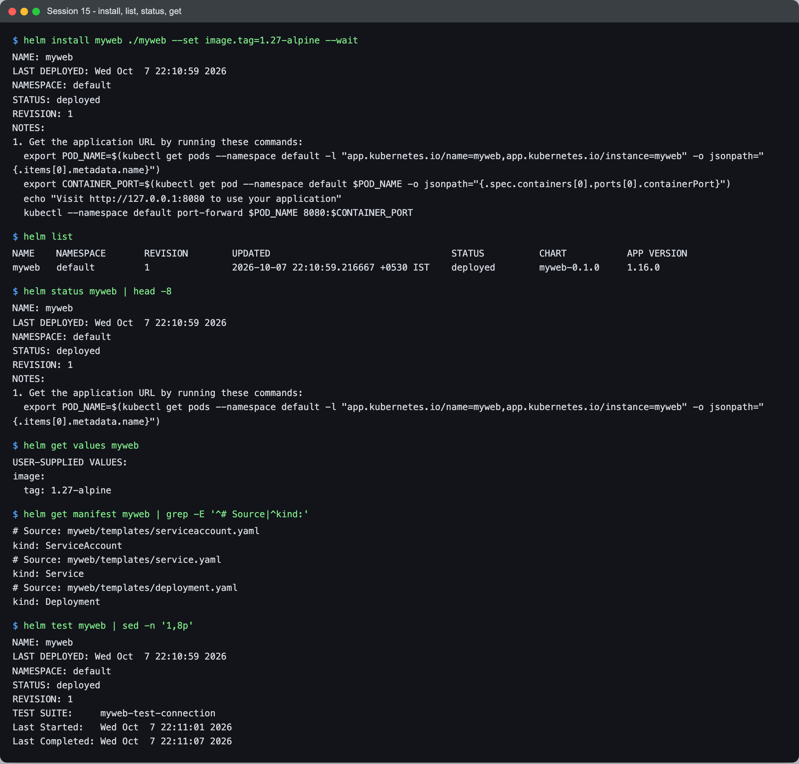
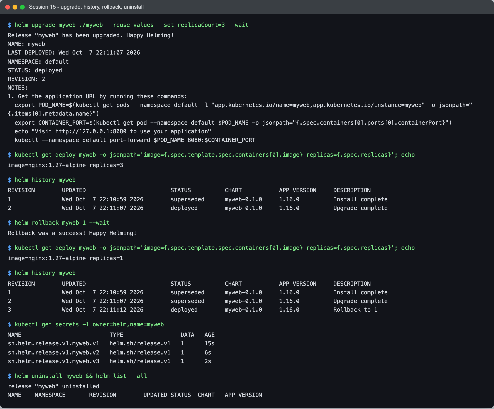
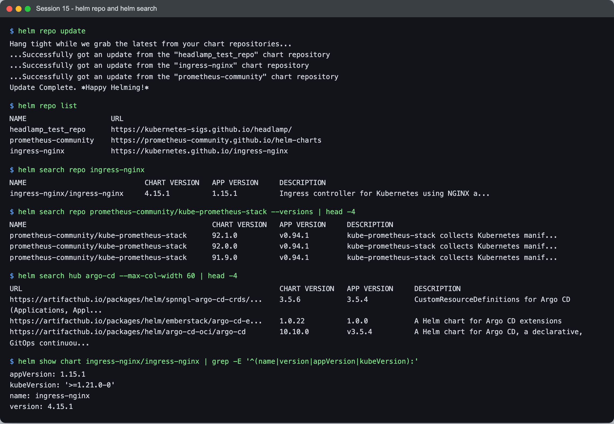
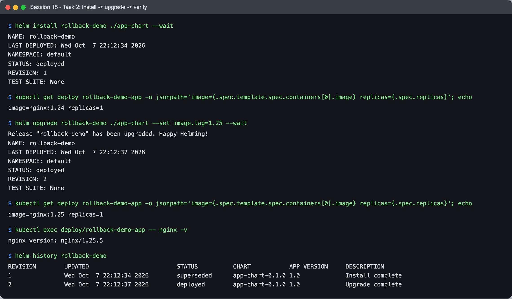
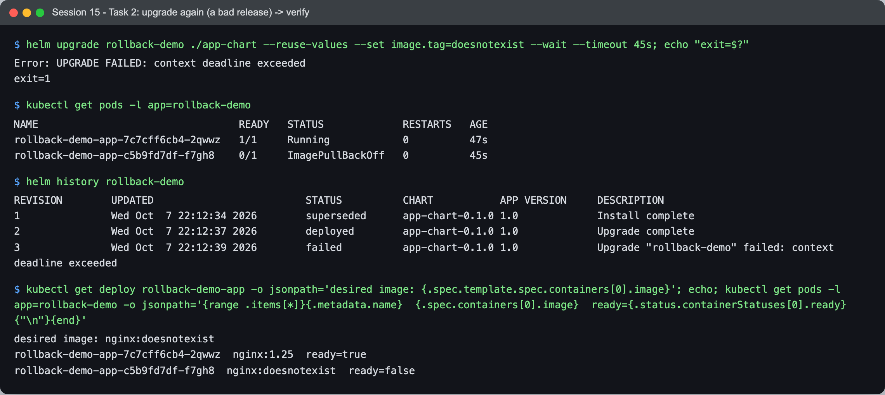
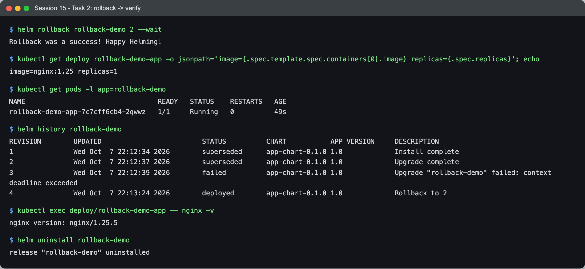
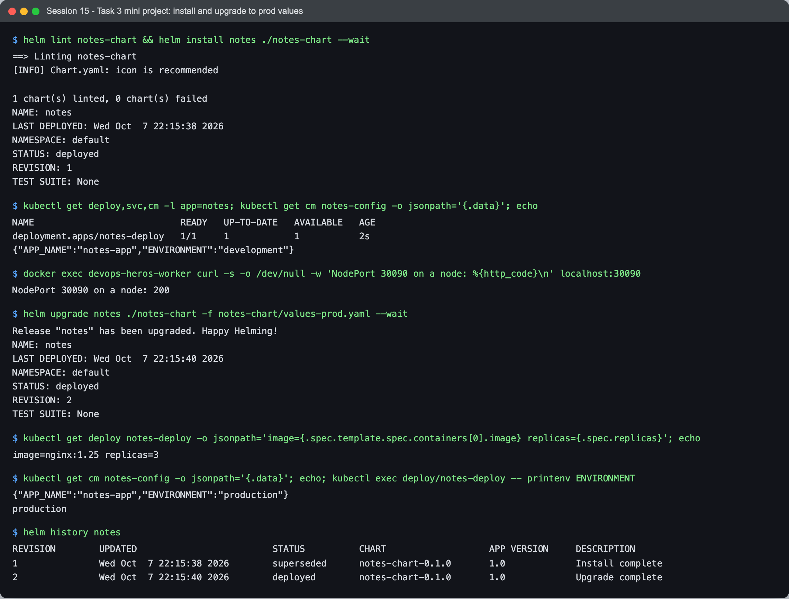
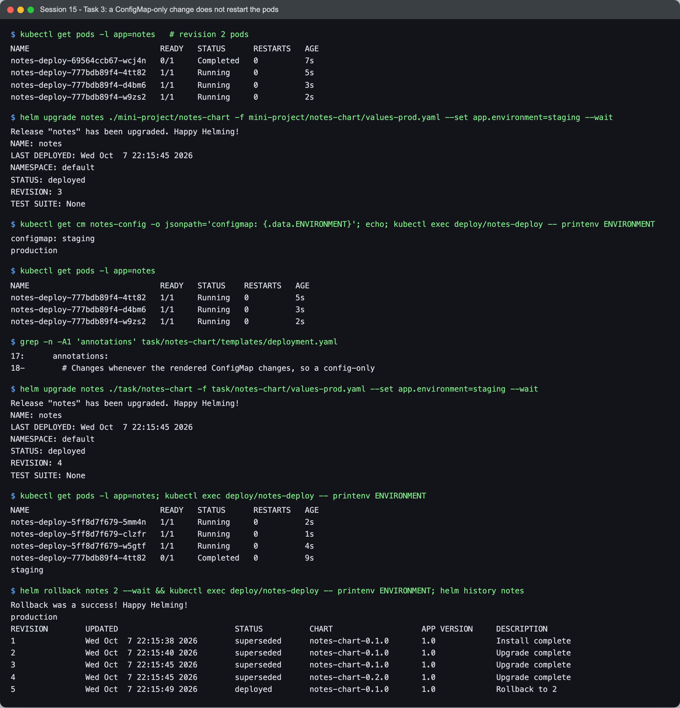

# Session 15 — Helm — Task

- **Name:** Raj Prakash
- **Enrollment No:** 2024EB02289

> **Status:** done
>
> **Helm v3.22.0** on the same kind cluster as sessions 11–14 (Kubernetes v1.34.0, 1 control
> plane + 2 workers). macOS on Apple Silicon.

| Task | Section |
|---|---|
| **Task 1** — every Helm command from the session | [→](#task-1-helm-commands) |
| **Task 2** — install → upgrade → verify → upgrade → verify → rollback → verify | [→](#task-2-the-rollback-workflow) |
| **Task 3** — mini project (notes-chart) | [→](#task-3-mini-project) |

Charts: [`myweb/`](myweb/) (generated by `helm create`), the course's
[`../07-install-upgrade/app-chart/`](../07-install-upgrade/app-chart/) and
[`../mini-project/notes-chart/`](../mini-project/notes-chart/), and my improved copy of the latter in
[`notes-chart/`](notes-chart/).

---

## Task 1: Helm commands

### `helm create`



```text
$ helm version --short
v3.22.0+g144ca65
$ helm create myweb
Creating myweb
$ find myweb -type f | sort
myweb/.helmignore
myweb/Chart.yaml
myweb/templates/NOTES.txt
myweb/templates/_helpers.tpl
myweb/templates/deployment.yaml
myweb/templates/hpa.yaml
myweb/templates/httproute.yaml
myweb/templates/ingress.yaml
myweb/templates/service.yaml
myweb/templates/serviceaccount.yaml
myweb/templates/tests/test-connection.yaml
myweb/values.yaml
$ helm lint myweb
1 chart(s) linted, 0 chart(s) failed
$ helm template demo myweb --set image.tag=1.27-alpine | grep -E '^kind:|image:'
kind: ServiceAccount
kind: Service
kind: Deployment
          image: "nginx:1.27-alpine"
kind: Pod
      image: busybox
```

`helm create` scaffolds a complete chart: `Chart.yaml` (the chart's identity and version),
`values.yaml` (the defaults), and `templates/` (Go templates rendered with those values).
`_helpers.tpl` holds named templates (`myweb.fullname`, `myweb.labels`) reused by every
manifest. `helm template` renders locally **without touching the cluster** — the fastest way to
see exactly what an install would apply. Note the image tag: the chart defaults to
`appVersion` (`1.16.0`); I override it with `--set image.tag=1.27-alpine`. The `kind: Pod` is the
`helm test` hook.

### `helm install`, `list`, `status`, `get`, `test`



```text
$ helm install myweb ./myweb --set image.tag=1.27-alpine --wait
NAME: myweb
STATUS: deployed
REVISION: 1

$ helm list
NAME 	NAMESPACE	REVISION	UPDATED                             	STATUS  	CHART      	APP VERSION
myweb	default  	1       	2026-10-07 22:10:59.216667 +0530 IST	deployed	myweb-0.1.0	1.16.0

$ helm get values myweb
USER-SUPPLIED VALUES:
image:
  tag: 1.27-alpine

$ helm get manifest myweb | grep -E '^# Source|^kind:'
# Source: myweb/templates/serviceaccount.yaml
kind: ServiceAccount
# Source: myweb/templates/service.yaml
kind: Service
# Source: myweb/templates/deployment.yaml
kind: Deployment

$ helm test myweb
TEST SUITE:     myweb-test-connection
Last Started:   Wed Oct  7 22:11:01 2026
Last Completed: Wed Oct  7 22:11:07 2026
```

- **`install --wait`** returns only when the resources are ready, so `STATUS: deployed` means
  running, not just submitted.
- **`list`** shows releases — an installed instance of a chart, with a revision number.
- **`status`** re-prints the release state and its NOTES.
- **`get values`** shows only what *I* supplied; **`get manifest`** shows exactly what Helm applied
  (the hpa/ingress/httproute templates rendered to nothing because they are disabled by default).
- **`test`** runs the chart's test hook pod (busybox `wget` against the Service) — a built-in
  smoke test.

### `helm upgrade`, `history`, `rollback`, `uninstall`



```text
$ helm upgrade myweb ./myweb --reuse-values --set replicaCount=3 --wait
Release "myweb" has been upgraded. Happy Helming!
REVISION: 2
image=nginx:1.27-alpine replicas=3

$ helm rollback myweb 1 --wait
Rollback was a success! Happy Helming!
image=nginx:1.27-alpine replicas=1

$ helm history myweb
REVISION	UPDATED                 	STATUS    	CHART      	APP VERSION	DESCRIPTION
1       	Wed Oct  7 22:10:59 2026	superseded	myweb-0.1.0	1.16.0     	Install complete
2       	Wed Oct  7 22:11:07 2026	superseded	myweb-0.1.0	1.16.0     	Upgrade complete
3       	Wed Oct  7 22:11:12 2026	deployed  	myweb-0.1.0	1.16.0     	Rollback to 1

$ kubectl get secrets -l owner=helm,name=myweb
sh.helm.release.v1.myweb.v1   helm.sh/release.v1   1      15s
sh.helm.release.v1.myweb.v2   helm.sh/release.v1   1      6s
sh.helm.release.v1.myweb.v3   helm.sh/release.v1   1      2s

$ helm uninstall myweb && helm list --all
release "myweb" uninstalled
NAME	NAMESPACE	REVISION	UPDATED	STATUS	CHART	APP VERSION
```

- **`--reuse-values`** keeps the previous release's values (my `image.tag`) and layers the new
  `--set` on top; without it, an upgrade starts from the chart defaults again.
- **A rollback is a new revision.** Rolling back to 1 created revision **3** ("Rollback to 1"); history
  is append-only.
- **Where history lives:** one Secret per revision, `sh.helm.release.v1.<name>.v<N>`, in the
  release's namespace. That is the whole of Helm 3's state — no server component.
- **`uninstall`** deletes the resources and the history Secrets.

### `helm repo` and `helm search`



```text
$ helm repo list
NAME                	URL
headlamp_test_repo  	https://kubernetes-sigs.github.io/headlamp/
prometheus-community	https://prometheus-community.github.io/helm-charts
ingress-nginx       	https://kubernetes.github.io/ingress-nginx

$ helm search repo ingress-nginx
ingress-nginx/ingress-nginx	4.15.1       	1.15.1     	Ingress controller for Kubernetes using NGINX a...

$ helm search repo prometheus-community/kube-prometheus-stack --versions | head -4
prometheus-community/kube-prometheus-stack	92.1.0       	v0.94.1    	...
prometheus-community/kube-prometheus-stack	92.0.0       	v0.94.1    	...
prometheus-community/kube-prometheus-stack	91.9.0       	v0.94.1    	...

$ helm search hub argo-cd --max-col-width 60 | head -4
https://artifacthub.io/packages/helm/argo-cd-oci/argo-cd    	10.10.0      	v3.5.4     	A Helm chart for Argo CD, ...

$ helm show chart ingress-nginx/ingress-nginx | grep -E '^(name|version|appVersion|kubeVersion):'
appVersion: 1.15.1
kubeVersion: '>=1.21.0-0'
name: ingress-nginx
version: 4.15.1
```

`helm repo add` + `update` downloads a repository's index; **`search repo`** searches those local
indexes, **`search hub`** searches Artifact Hub online. The two version columns matter: **CHART
VERSION** (4.15.1) is the packaging, **APP VERSION** (1.15.1) is the software inside — the
ingress-nginx controller I installed by manifest in session 11 is that same 1.15.1.
(`headlamp_test_repo` was already configured on this Mac.)

---

## Task 2: The rollback workflow

Course chart [`../07-install-upgrade/app-chart/`](../07-install-upgrade/app-chart/) (nginx, tag from
values). The second upgrade is deliberately bad — the reason you need rollback.

### Install → Upgrade → Verify



```text
$ helm install rollback-demo ./app-chart --wait
REVISION: 1
image=nginx:1.24 replicas=1

$ helm upgrade rollback-demo ./app-chart --set image.tag=1.25 --wait
Release "rollback-demo" has been upgraded. Happy Helming!
REVISION: 2
image=nginx:1.25 replicas=1
$ kubectl exec deploy/rollback-demo-app -- nginx -v
nginx version: nginx/1.25.5
```

### Upgrade again → Verify (a bad release)



```text
$ helm upgrade rollback-demo ./app-chart --reuse-values --set image.tag=doesnotexist --wait --timeout 45s
Error: UPGRADE FAILED: context deadline exceeded

$ kubectl get pods -l app=rollback-demo
rollback-demo-app-7c7cff6cb4-2qwwz   1/1     Running            0          47s
rollback-demo-app-c5b9fd7df-f7gh8    0/1     ImagePullBackOff   0          45s

$ helm history rollback-demo
1       ...	superseded	app-chart-0.1.0	1.0        	Install complete
2       ...	deployed  	app-chart-0.1.0	1.0        	Upgrade complete
3       ...	failed    	app-chart-0.1.0	1.0        	Upgrade "rollback-demo" failed: context deadline exceeded

desired image: nginx:doesnotexist
rollback-demo-app-7c7cff6cb4-2qwwz  nginx:1.25  ready=true
rollback-demo-app-c5b9fd7df-f7gh8  nginx:doesnotexist  ready=false
```

Revision 3 is **`failed`** — `--wait` is what made Helm notice; without it, Helm would have marked
the release `deployed` the moment the API accepted the YAML. Two other things to see:

- **Users were not affected.** The Deployment's rolling update keeps the old pod until a new one
  is Ready, and the new one never became Ready. The old `nginx:1.25` pod kept serving.
- **The cluster is still in a bad state**, though: the Deployment's *desired* image is
  `doesnotexist`, and a broken pod sits in ImagePullBackOff. Helm does not undo a failed upgrade
  by itself (unless you pass `--atomic` / `--rollback-on-failure`).

### Rollback → Verify



```text
$ helm rollback rollback-demo 2 --wait
Rollback was a success! Happy Helming!
image=nginx:1.25 replicas=1

$ kubectl get pods -l app=rollback-demo
rollback-demo-app-7c7cff6cb4-2qwwz   1/1     Running   0          49s

$ helm history rollback-demo
1       ...	superseded	app-chart-0.1.0	1.0        	Install complete
2       ...	superseded	app-chart-0.1.0	1.0        	Upgrade complete
3       ...	failed    	app-chart-0.1.0	1.0        	Upgrade "rollback-demo" failed: context deadline exceeded
4       ...	deployed  	app-chart-0.1.0	1.0        	Rollback to 2
$ kubectl exec deploy/rollback-demo-app -- nginx -v
nginx version: nginx/1.25.5
```

Back on 1.25.5, the broken pod gone, and the surviving pod is **the same pod** (`…-2qwwz`, age 49s)
— the rollback put the Deployment's template back to what that pod already runs, so nothing needed
replacing. Revision 4 records "Rollback to 2"; the failed revision 3 stays in history as the
audit trail.

---

## Task 3: Mini project

The course [`notes-chart`](../mini-project/notes-chart/): ConfigMap + Deployment + NodePort
Service, with `values.yaml` (development, 1 replica, nginx 1.24) and `values-prod.yaml`
(production, 3 replicas, nginx 1.25).



```text
$ helm lint notes-chart && helm install notes ./notes-chart --wait
1 chart(s) linted, 0 chart(s) failed
STATUS: deployed
REVISION: 1
{"APP_NAME":"notes-app","ENVIRONMENT":"development"}
$ docker exec devops-heros-worker curl -s -o /dev/null -w 'NodePort 30090 on a node: %{http_code}\n' localhost:30090
NodePort 30090 on a node: 200

$ helm upgrade notes ./notes-chart -f notes-chart/values-prod.yaml --wait
REVISION: 2
image=nginx:1.25 replicas=3
{"APP_NAME":"notes-app","ENVIRONMENT":"production"}
production
```

One chart, two environments: the same templates with a different values file. `-f
values-prod.yaml` overrides only the keys it contains — everything else comes from `values.yaml`.

### A ConfigMap-only change does not reach the pods



```text
$ kubectl get pods -l app=notes   # revision 2 pods
notes-deploy-777bdb89f4-4tt82   1/1     Running     0          5s
notes-deploy-777bdb89f4-d4bm6   1/1     Running     0          3s
notes-deploy-777bdb89f4-w9zs2   1/1     Running     0          2s

$ helm upgrade notes ./mini-project/notes-chart -f mini-project/notes-chart/values-prod.yaml --set app.environment=staging --wait
REVISION: 3
$ kubectl get cm notes-config ...; kubectl exec deploy/notes-deploy -- printenv ENVIRONMENT
configmap: staging
production
$ kubectl get pods -l app=notes
notes-deploy-777bdb89f4-4tt82   1/1     Running   0          5s
notes-deploy-777bdb89f4-d4bm6   1/1     Running   0          3s
notes-deploy-777bdb89f4-w9zs2   1/1     Running   0          2s
```

Helm reported a successful upgrade and the **ConfigMap says `staging`** — but the app still has
**`production`**, and the pods are the same three (`777bdb89f4-…`). The env vars are read from the
ConfigMap at container start (session 12), and only the ConfigMap changed, so the Deployment's pod
template was identical and nothing rolled. A "successful" config release that changes nothing.

The standard fix, in my copy [`notes-chart/`](notes-chart/) (chart version bumped to 0.2.0): a
checksum of the rendered ConfigMap as a pod annotation, so any config change changes the pod
template:

```yaml
      annotations:
        checksum/config: {{ include (print $.Template.BasePath "/configmap.yaml") . | sha256sum }}
```

```text
$ helm upgrade notes ./task/notes-chart -f task/notes-chart/values-prod.yaml --set app.environment=staging --wait
REVISION: 4
notes-deploy-5ff8d7f679-5mm4n   1/1     Running     0          2s
notes-deploy-5ff8d7f679-clzfr   1/1     Running     0          1s
notes-deploy-5ff8d7f679-w5gtf   1/1     Running     0          4s
notes-deploy-777bdb89f4-4tt82   0/1     Completed   0          9s
staging

$ helm rollback notes 2 --wait && kubectl exec deploy/notes-deploy -- printenv ENVIRONMENT
Rollback was a success! Happy Helming!
production
4       ...	superseded	notes-chart-0.2.0	1.0        	Upgrade complete
5       ...	deployed  	notes-chart-0.1.0	1.0        	Rollback to 2
```

New ReplicaSet (`5ff8d7f679`), and the pods read `staging`. Rolling back to revision 2 restored
both the ConfigMap and — because the chart *version* is part of a revision — the 0.1.0 templates:
history shows revision 5 as `notes-chart-0.1.0`.

---

## What I learned

- **A release is a chart + values + a revision number**, and Helm's entire memory is one Secret per
  revision in the namespace.
- **`--wait` decides whether Helm's status means anything.** Without it, "deployed" means "the API
  accepted it". With it, a bad image produced an honest `failed`.
- **Rollback is forward-only history** — it creates a new revision from an old one's chart and
  values, and it rolled back the chart version as well as the values.
- **A failed upgrade is not undone automatically** — the cluster stayed half-upgraded until I rolled
  back. `--atomic` makes Helm do that itself.
- **Helm only changes what renders differently.** A ConfigMap-only change leaves the pod template
  identical, so pods keep stale config; the `checksum/config` annotation is the standard fix.

## Problems I hit

- **Pod ages misled me during the ConfigMap test.** Straight after the config-only upgrade the
  pods were 2–5 seconds old, which looked like a restart — they were still fresh from revision 2's
  rollout moments earlier. The **ReplicaSet hash** (`777bdb89f4` before and after) is what proves
  no new pods were created; the env var inside the pod is what proves the config didn't arrive.
- **The NodePort (30090) is not reachable from the Mac** — my kind config only maps 30080 (session 11),
  so I tested it from inside a node with `docker exec`. On a real cluster you'd hit
  `<node-ip>:30090`.
