# Session 16 — CI/CD & GitHub Actions — Task

- **Name:** Raj Prakash
- **Enrollment No:** 2024EB02289

> **Status:** done, with one part waiting on me. The secrets demo ran without its secret,
> because I never created `DEMO_API_TOKEN` (see [section 8](#8-secrets)).
>
> Workflow: [`.github/workflows/session16-cicd.yml`](../../.github/workflows/session16-cicd.yml).
> Successful run: [**37646232050**](https://github.com/RajPrakash681/devops-heros-notes/actions/runs/37646232050)
> on commit `28e1c1b`, 10 jobs, 5m4s, all green. It ran on GitHub-hosted runners (Ubuntu
> 24.04, macOS 26 arm64, Windows 2025). I ran the local checks on macOS (Apple Silicon) inside
> `python:3.13-slim`.

---

## What the task asked

Build a project that covers **CI vs CD, a CI/CD pipeline, GitHub Actions, workflows, jobs,
steps, runners, secrets, artifacts, build, test and pipeline execution**. The deliverables
are the source code, a Dockerfile, a workflow, a CI pipeline, a CD pipeline, screenshots of
a successful run, and this README.

| Deliverable | Where |
|---|---|
| Source code | [`app/calculator.py`](app/calculator.py), [`app/server.py`](app/server.py) |
| Tests | [`tests/`](tests/) (9 tests) |
| Dockerfile | [`Dockerfile`](Dockerfile) |
| Workflow | [`.github/workflows/session16-cicd.yml`](../../.github/workflows/session16-cicd.yml) |
| CI pipeline | jobs `lint`, `test` (matrix), `secrets-demo`, `build` |
| CD pipeline | jobs `deliver` (push to GHCR) and `deploy` (Kubernetes), manifests in [`k8s/`](k8s/) |
| Screenshots | [`screenshots/`](screenshots/) |

The workflow cannot live in this folder. GitHub only picks up workflows from
`.github/workflows/` at the **repository root**. This repo holds every session, so the
workflow sits at the root and points back here in two ways: a `paths:` filter, so it only
triggers when this folder or the workflow itself changes, and `working-directory:`, so its
commands run in this folder.

Rather than explain each concept in the abstract, I explain it below through the pipeline
I actually ran, with line numbers in the YAML and output from that run.

---

## The app

A small Flask calculator API, written so the pipeline has something real to build, test and
deploy:

| Endpoint | Returns |
|---|---|
| `/` | app name, version, which pod served the request, the operations available |
| `/health` | `{"status":"ok","version":...}` |
| `/calc?a=10&op=multiply&b=5` | the result; bad input is a **400**, never a 500 |

The arithmetic lives in [`app/calculator.py`](app/calculator.py) as pure functions, so most
tests need no web server. The `version` field comes from `APP_VERSION`, which the pipeline
sets to the commit SHA at build time ([`Dockerfile`](Dockerfile) lines 5–6). That way a
running pod can tell you exactly which commit it is running.

### Running the tests locally

The same lint and test commands CI runs, inside the same base image the Dockerfile uses:

```bash
cd session-16-github-actions/task
docker run --rm -v "$PWD":/src -w /src python:3.13-slim sh -c \
  "pip install -q -r requirements-dev.txt && flake8 app tests && python -m pytest -v --cov=app"
```

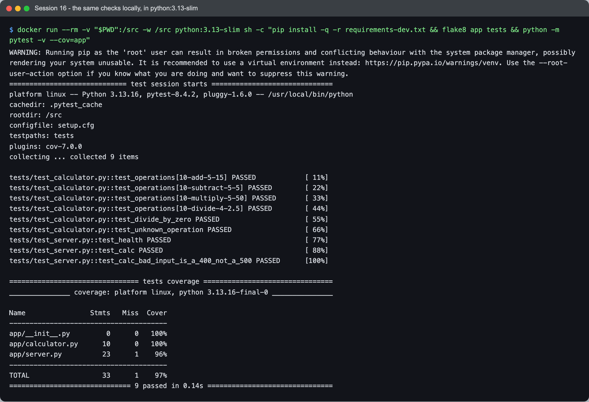

```text
platform linux -- Python 3.13.16, pytest-8.4.2, pluggy-1.6.0 -- /usr/local/bin/python
...
tests/test_calculator.py::test_operations[10-add-5-15] PASSED            [ 11%]
tests/test_calculator.py::test_operations[10-subtract-5-5] PASSED        [ 22%]
tests/test_calculator.py::test_operations[10-multiply-5-50] PASSED       [ 33%]
tests/test_calculator.py::test_operations[10-divide-4-2.5] PASSED        [ 44%]
tests/test_calculator.py::test_divide_by_zero PASSED                     [ 55%]
tests/test_calculator.py::test_unknown_operation PASSED                  [ 66%]
tests/test_server.py::test_health PASSED                                 [ 77%]
tests/test_server.py::test_calc PASSED                                   [ 88%]
tests/test_server.py::test_calc_bad_input_is_a_400_not_a_500 PASSED      [100%]

================================ tests coverage ================================
_______________ coverage: platform linux, python 3.13.16-final-0 _______________

Name                Stmts   Miss  Cover
---------------------------------------
app/__init__.py         0      0   100%
app/calculator.py      10      0   100%
app/server.py          23      1    96%
---------------------------------------
TOTAL                  33      1    97%
============================== 9 passed in 0.17s ===============================
```

flake8 printed nothing, which means clean; any finding would have stopped the `&&` chain
before pytest ran. The one uncovered line is the `/` route. CI's `--cov-report=term-missing`
names it as line 18 of `server.py`, and the deploy job's smoke test does call it.

### Running the container locally

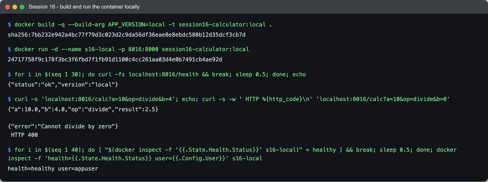

```text
$ docker build -q --build-arg APP_VERSION=local -t session16-calculator:local .
sha256:7bb232e942a4bc77f79d3c023d2c9da56df36eae8e8ebdc580b12d35dcf3cb7d

$ docker run -d --name s16-local -p 8016:8000 session16-calculator:local
24717758f9c178f3bc3f6fbd7f1fb91d1100c4cc261aa03d4e0b7491cb4ae92d

$ for i in $(seq 1 30); do curl -fs localhost:8016/health && break; sleep 0.5; done; echo
{"status":"ok","version":"local"}

$ curl -s 'localhost:8016/calc?a=10&op=divide&b=4'; echo; curl -s -w ' HTTP %{http_code}\n' 'localhost:8016/calc?a=10&op=divide&b=0'
{"a":10.0,"b":4.0,"op":"divide","result":2.5}

{"error":"Cannot divide by zero"}
 HTTP 400

$ for i in $(seq 1 40); do [ "$(docker inspect -f '{{.State.Health.Status}}' s16-local)" = healthy ] && break; sleep 0.5; done; docker inspect -f 'health={{.State.Health.Status}} user={{.Config.User}}' s16-local
health=healthy user=appuser
```

The container runs gunicorn rather than Flask's development server, as a non-root user
(`useradd --uid 10001`, then `USER appuser`). It also has a `HEALTHCHECK`, so Docker itself
tracks whether the app answers.

---

## The pipeline

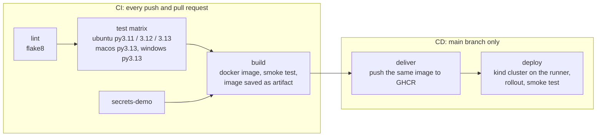

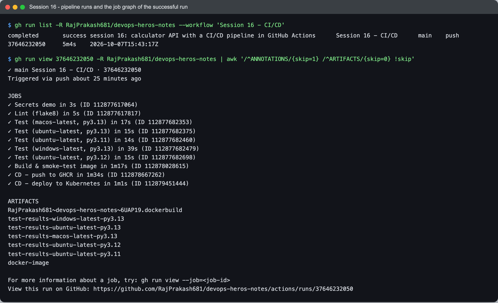

```text
$ gh run list -R RajPrakash681/devops-heros-notes --workflow 'Session 16 - CI/CD'
completed	success	session 16: calculator API with a CI/CD pipeline in GitHub Actions	Session 16 - CI/CD	main	push	37646232050	5m4s	2026-10-07T15:43:17Z

$ gh run view 37646232050 -R RajPrakash681/devops-heros-notes | awk '/^ANNOTATIONS/{skip=1} /^ARTIFACTS/{skip=0} !skip'

✓ main Session 16 - CI/CD · 37646232050
Triggered via push about 25 minutes ago

JOBS
✓ Secrets demo in 3s (ID 112877617064)
✓ Lint (flake8) in 5s (ID 112877617817)
✓ Test (macos-latest, py3.13) in 17s (ID 112877682353)
✓ Test (ubuntu-latest, py3.13) in 15s (ID 112877682375)
✓ Test (ubuntu-latest, py3.11) in 14s (ID 112877682460)
✓ Test (windows-latest, py3.13) in 39s (ID 112877682479)
✓ Test (ubuntu-latest, py3.12) in 15s (ID 112877682698)
✓ Build & smoke-test image in 1m17s (ID 112878028615)
✓ CD - push to GHCR in 1m34s (ID 112878667262)
✓ CD - deploy to Kubernetes in 1m1s (ID 112879451444)

ARTIFACTS
RajPrakash681~devops-heros-notes~6UAP19.dockerbuild
test-results-windows-latest-py3.13
test-results-ubuntu-latest-py3.13
test-results-macos-latest-py3.13
test-results-ubuntu-latest-py3.12
test-results-ubuntu-latest-py3.11
docker-image
```

The pipeline passed on its first run; this is the only run of this workflow.

---

## The concepts, using this pipeline as the example

### 1. CI vs CD

**Continuous Integration** answers *"is this commit good?"* Every push and every pull
request is linted, tested and built automatically, so a broken change is caught minutes
after it was written, not at release time. Here that is `lint`, `test`, `secrets-demo` and
`build`. The output of CI is a verdict and one tested image.

**Continuous Delivery / Deployment** answers *"get that exact image running"*. Here that is
`deliver`, which pushes to the GitHub Container Registry, and `deploy`, which deploys to
Kubernetes. The two CD terms differ only in whether a human approves the last step:

- **Continuous delivery:** every green build is *ready* to deploy, and someone presses the
  button.
- **Continuous deployment:** every green build on `main` *is* deployed, with no button.

This pipeline is **continuous deployment**. The deploy job declares `environment: staging`
(line 197). GitHub created that environment on first use and records every deployment
against it, but it has no protection rules, so nothing pauses:

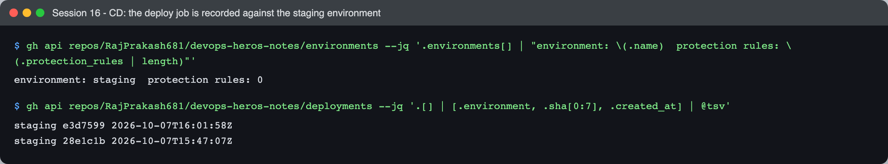

```text
$ gh api repos/RajPrakash681/devops-heros-notes/environments --jq '.environments[] | "environment: \(.name)  protection rules: \(.protection_rules | length)"'
environment: staging  protection rules: 0

$ gh api repos/RajPrakash681/devops-heros-notes/deployments --jq '.[] | [.environment, .sha[0:7], .created_at] | @tsv'
staging	e3d7599	2026-10-07T16:01:58Z
staging	28e1c1b	2026-10-07T15:47:07Z
```

`28e1c1b` is this run. (`e3d7599` is session 17's pipeline, which reuses the same
environment name.) Adding a *required reviewer* to `staging` in the repo settings would turn
this into continuous delivery. The deploy job would then wait for an approval click, and
the YAML would not change at all.

CD also stops at the branch boundary. `deliver` has
`if: github.event_name != 'pull_request' && github.ref == 'refs/heads/main'` (line 169). A
pull request gets the full CI verdict but never touches the registry or the cluster.

### 2. The CI/CD pipeline

A pipeline is a sequence of stages where **each stage only runs if the ones it depends on
passed**. In GitHub Actions the stages are jobs, and `needs:` draws the arrows:

| Job | `needs:` | Line in the YAML |
|---|---|---|
| `lint` | nothing, starts immediately | 38 |
| `secrets-demo` | nothing, starts immediately, in parallel with lint | 92 |
| `test` | `lint` | 54 |
| `build` | `test`, `secrets-demo` | 115 |
| `deliver` | `build` | 168 |
| `deploy` | `build`, `deliver` | 195 |

The order matters for cost as well as correctness. flake8 takes 5 seconds; five test runners
take far longer combined. Linting first means a typo fails the run before any of that
starts.

### 3. GitHub Actions

GitHub Actions is GitHub's built-in automation. An **event** in the repository (a push, a
pull request, a button press) starts a **workflow**. GitHub then provisions a fresh virtual
machine (a **runner**) for each **job**, executes the job's **steps** on it, and throws the
machine away. Reusable building blocks are **actions** (`uses: owner/repo@version`). This
pipeline uses `actions/checkout`, `actions/setup-python`, `actions/upload-artifact`,
`actions/download-artifact`, `docker/setup-buildx-action`, `docker/build-push-action`,
`docker/login-action` and `helm/kind-action`.

### 4. Workflow

A workflow is one YAML file in `.github/workflows/`. The top of this one sets four things:

```yaml
on:                                   # lines 13-23 (abridged): when it runs
  push:
    branches: [main]
    paths: ["session-16-github-actions/task/**", ".github/workflows/session16-cicd.yml"]
  pull_request:
    paths: [...same...]
  workflow_dispatch:                  # a "Run workflow" button, and `gh workflow run`

permissions:                          # lines 26-27: what the automatic token may do
  contents: read

concurrency:                          # lines 30-32: one run per branch at a time
  group: session16-${{ github.ref }}
  cancel-in-progress: true

env:                                  # lines 34-35: variables shared by every job
  APP_DIR: session-16-github-actions/task
```

- **`paths:`** stops the other sessions in this repo from triggering this pipeline. My
  session 17 commits did not start a session 16 run, which is why `gh run list` shows
  exactly one.
- **`permissions: contents: read`** is the default for every job. Jobs that need more ask
  for it explicitly (`deliver` gets `packages: write`, lines 171–173), so a compromised
  test dependency cannot push images.
- **`concurrency`** with `cancel-in-progress` means two quick pushes do not race each other
  to deploy. The older run is cancelled.

### 5. Jobs

A job is a set of steps that runs **on its own runner**. This workflow defines 6 jobs, and
the run executed 10, because `test` is a **matrix**:

```yaml
strategy:                             # lines 56-65
  fail-fast: false
  matrix:
    os: [ubuntu-latest]
    python: ["3.11", "3.12", "3.13"]  # 1 OS x 3 Pythons = 3 legs
    include:
      - os: macos-latest              # + 2 extra legs
        python: "3.13"
      - os: windows-latest
        python: "3.13"
```

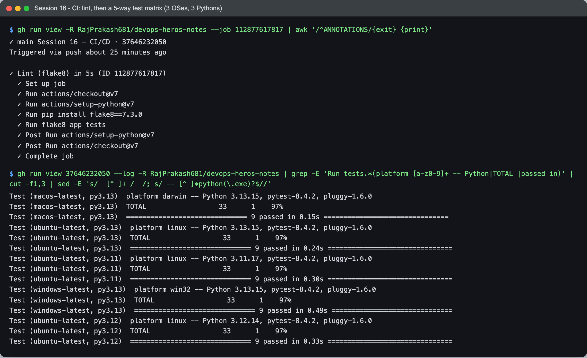

```text
Test (macos-latest, py3.13)  platform darwin -- Python 3.13.15, pytest-8.4.2, pluggy-1.6.0
Test (macos-latest, py3.13)  TOTAL                  33      1    97%
Test (macos-latest, py3.13)  ============================== 9 passed in 0.15s ===============================
Test (ubuntu-latest, py3.13)  platform linux -- Python 3.13.15, pytest-8.4.2, pluggy-1.6.0
Test (ubuntu-latest, py3.13)  TOTAL                  33      1    97%
Test (ubuntu-latest, py3.13)  ============================== 9 passed in 0.24s ===============================
Test (ubuntu-latest, py3.11)  platform linux -- Python 3.11.17, pytest-8.4.2, pluggy-1.6.0
Test (ubuntu-latest, py3.11)  TOTAL                  33      1    97%
Test (ubuntu-latest, py3.11)  ============================== 9 passed in 0.30s ===============================
Test (windows-latest, py3.13)  platform win32 -- Python 3.13.15, pytest-8.4.2, pluggy-1.6.0
Test (windows-latest, py3.13)  TOTAL                  33      1    97%
Test (windows-latest, py3.13)  ============================== 9 passed in 0.49s ==============================
Test (ubuntu-latest, py3.12)  platform linux -- Python 3.12.14, pytest-8.4.2, pluggy-1.6.0
Test (ubuntu-latest, py3.12)  TOTAL                  33      1    97%
Test (ubuntu-latest, py3.12)  ============================== 9 passed in 0.33s ===============================
```

That is three operating systems (`darwin`, `linux`, `win32`) and three Pythons, with
9/9 tests and 97% coverage on each leg. `fail-fast: false` matters: by default one failing
leg cancels the others, and then you learn that *something* broke but not whether it was
only Windows.

Jobs share **nothing** by default; each one starts on a clean machine. Data crosses between
them in exactly two ways, and this pipeline uses both:

- **outputs** for small values. `build` computes the image name and tag once (lines
  117–128, written to `$GITHUB_OUTPUT`). `deliver` and `deploy` read them as
  `needs.build.outputs.image` and `needs.build.outputs.tag`.
- **artifacts** for files (section 9).

### 6. Steps

A step is one unit inside a job. It is either `uses:` (run an action) or `run:` (run shell
commands). From the `test` job:

```yaml
steps:
  - uses: actions/checkout@v7                       # action: clone the repo onto the runner
  - uses: actions/setup-python@v7                   # action: install the matrix's Python
    with:
      python-version: ${{ matrix.python }}
      cache: pip                                    # reuse downloaded wheels between runs
  - name: Install dependencies
    run: pip install -r requirements-dev.txt        # shell
  - name: Run tests
    run: python -m pytest -v --junitxml=... --cov=app ...
  - name: Upload test results
    if: always()                                    # run even if the tests failed
    uses: actions/upload-artifact@v7
```

Steps run in order, and the first failing one skips the rest unless a step opts out with
`if: always()`. That is why test results are uploaded *even when tests fail*, which is
exactly when you want them. `defaults.run.working-directory` (lines 66–69) saves writing
`cd session-16-github-actions/task` in every step.

Here is the lint job broken into its steps:

```text
✓ Lint (flake8) in 5s (ID 112877617817)
  ✓ Set up job
  ✓ Run actions/checkout@v7
  ✓ Run actions/setup-python@v7
  ✓ Run pip install flake8==7.3.0
  ✓ Run flake8 app tests
  ✓ Post Run actions/setup-python@v7
  ✓ Post Run actions/checkout@v7
  ✓ Complete job
```

The `Post` steps are cleanup that actions register for themselves; I did not write them.

### 7. Runners

A runner is the machine a job runs on. `runs-on: ubuntu-latest` asks for a GitHub-hosted
VM. The alternative is a **self-hosted** runner, a machine you register yourself, used when
a job needs private network access, special hardware or a cache that survives between runs.
This pipeline only uses hosted runners. The run log records what each `-latest` label
actually meant on the day:

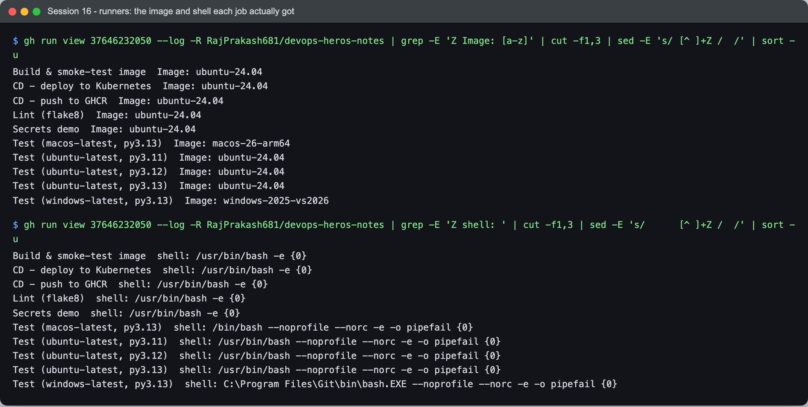

```text
Build & smoke-test image  Image: ubuntu-24.04
...
Test (macos-latest, py3.13)  Image: macos-26-arm64
Test (ubuntu-latest, py3.11)  Image: ubuntu-24.04
Test (windows-latest, py3.13)  Image: windows-2025-vs2026

Build & smoke-test image  shell: /usr/bin/bash -e {0}
...
Test (macos-latest, py3.13)  shell: /bin/bash --noprofile --norc -e -o pipefail {0}
Test (ubuntu-latest, py3.11)  shell: /usr/bin/bash --noprofile --norc -e -o pipefail {0}
Test (windows-latest, py3.13)  shell: C:\Program Files\Git\bin\bash.EXE --noprofile --norc -e -o pipefail {0}
```

Two things here I would not have guessed:

- **`-latest` is a moving target.** Every job carried the annotation *"The ubuntu-latest
  label will migrate to Ubuntu 26 beginning October 19, 2026"*. The same YAML will run on a
  different OS in two weeks. For a pipeline that must be reproducible, pinning
  `ubuntu-24.04` is the honest choice.
- **The same `run:` gets a different shell depending on one line.** The `test` job sets
  `defaults.run.shell: bash` (line 68), so Windows runs the step through Git Bash rather
  than PowerShell, and every OS gets `-o pipefail`. The jobs that do *not* set it get plain
  `bash -e`, **without pipefail**. In the build job that means
  `docker save "$IMG" | gzip > dist/image.tar.gz` would pass even if `docker save` failed,
  because only `gzip`'s exit code counts. It did not fail in this run, and `deliver`'s
  `docker load` would trip over an empty archive anyway. Still, the failure would surface one
  job later than its cause. A workflow-level `defaults: run: shell: bash` would close it.

### 8. Secrets

A secret is an encrypted value stored in the repository settings. It is never in the YAML,
and it reaches a step only if that step maps it in explicitly:

```yaml
- name: Use a repository secret          # lines 96-107
  env:
    API_TOKEN: ${{ secrets.DEMO_API_TOKEN }}
  run: |
    if [ -z "$API_TOKEN" ]; then
      echo "::warning::DEMO_API_TOKEN is not set (secrets are not passed to forks)."
      exit 0
    fi
    echo "secret is present, length ${#API_TOKEN}"
    echo "echoing it straight to the log prints: $API_TOKEN"
    echo "sha256 fingerprint (safe to show): $(printf %s "$API_TOKEN" | sha256sum | cut -c1-12)"
```

**In this run the secret was not set,** so the interesting half of the demo never ran:

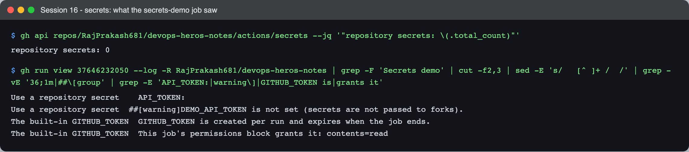

```text
$ gh api repos/RajPrakash681/devops-heros-notes/actions/secrets --jq '"repository secrets: \(.total_count)"'
repository secrets: 0

Use a repository secret    API_TOKEN: 
Use a repository secret  ##[warning]DEMO_API_TOKEN is not set (secrets are not passed to forks).
The built-in GITHUB_TOKEN  GITHUB_TOKEN is created per run and expires when the job ends.
The built-in GITHUB_TOKEN  This job's permissions block grants it: contents=read
```

`API_TOKEN:` is empty and the repository has zero secrets. The warning's parenthetical
suggests a fork, but this was a push to `main` in my own repository. The real reason is
simpler: I never created the secret. It is a one-liner (it prompts for the value, so the
value never lands in shell history):

```bash
gh secret set DEMO_API_TOKEN -R RajPrakash681/devops-heros-notes
gh workflow run "Session 16 - CI/CD" -R RajPrakash681/devops-heros-notes   # re-run to see it
```

Once it is set, the step is designed to show the property that matters. A secret echoed
straight to the log should appear as `***`, because the runner masks every registered secret
value in its output, while the length and the sha256 fingerprint stay printable. I have
**not** seen that output yet, so I am not quoting it.

The second kind of secret needs no setup: **`GITHUB_TOKEN`**, created fresh for every run.
Note that the `GITHUB_TOKEN` lines above are hard-coded `echo`s and prove nothing on their
own. The real evidence is the CD jobs: `deliver` logs in to GHCR with
`password: ${{ secrets.GITHUB_TOKEN }}` (line 184), and the push succeeds only because that
job asked for `packages: write`. There is no personal access token anywhere in this
pipeline.

### 9. Artifacts

An artifact is a file that a job uploads so it outlives the runner. Other jobs can download
it, and so can a person, from the run page or with `gh run download`:

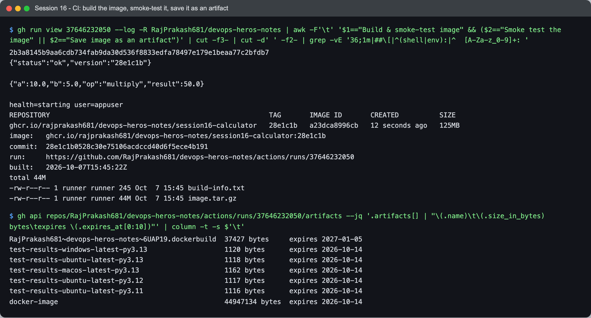

```text
$ gh api repos/RajPrakash681/devops-heros-notes/actions/runs/37646232050/artifacts --jq ...
RajPrakash681~devops-heros-notes~6UAP19.dockerbuild  37427 bytes     expires 2027-01-05
test-results-windows-latest-py3.13                   1120 bytes      expires 2026-10-14
test-results-ubuntu-latest-py3.13                    1118 bytes      expires 2026-10-14
test-results-macos-latest-py3.13                     1162 bytes      expires 2026-10-14
test-results-ubuntu-latest-py3.12                    1117 bytes      expires 2026-10-14
test-results-ubuntu-latest-py3.11                    1116 bytes      expires 2026-10-14
docker-image                                         44947134 bytes  expires 2026-10-14
```

- **`test-results-<os>-py<ver>`** holds the JUnit XML and coverage XML from each matrix
  leg. The name includes the matrix values because five legs uploading under one name would
  collide.
- **`docker-image`** is the built image saved with `docker save | gzip`: a 125 MB image in a
  44.9 MB tarball, plus a `build-info.txt`. This is the hand-off from CI to CD (below).
- **`*.dockerbuild`** is one I did not ask for. `docker/build-push-action` exports a
  BuildKit build record and uploads it on its own, with a 90-day expiry instead of the 7
  days I set (`retention-days: 7`) on mine.

### 10. Build

The `build` job (lines 113–164) turns source into the thing CD ships:

```yaml
- uses: docker/build-push-action@v7    # lines 130-139, expressions shown resolved
  with:
    context: ${{ env.APP_DIR }}
    load: true          # into the runner's Docker so the next step can run it
    push: false         # CI never pushes; that is CD's job, and only on main
    tags: ghcr.io/rajprakash681/devops-heros-notes/session16-calculator:<short sha>
    build-args: APP_VERSION=<short sha>
    cache-from: type=gha,scope=session16
    cache-to: type=gha,mode=max,scope=session16
```

The image is tagged with the commit (`28e1c1b`), never just `latest`, so every image maps
back to exactly one commit. The owner in the name is lower-cased in the workflow
(`${GITHUB_REPOSITORY,,}`, line 126). `RajPrakash681` has capitals, and Docker refuses
uppercase repository names.

Then the job runs the image before anyone else gets it:

```text
2b3a8145b9aa6cdb734fab9da30d536f8833edfa78497e179e1beaa77c2bfdb7
{"status":"ok","version":"28e1c1b"}

{"a":10.0,"b":5.0,"op":"multiply","result":50.0}

health=starting user=appuser
REPOSITORY                                                      TAG       IMAGE ID       CREATED          SIZE
ghcr.io/rajprakash681/devops-heros-notes/session16-calculator   28e1c1b   a23dca8996cb   12 seconds ago   125MB
image:   ghcr.io/rajprakash681/devops-heros-notes/session16-calculator:28e1c1b
commit:  28e1c1b0528c30e75106acdccd40d6f5ece4b191
run:     https://github.com/RajPrakash681/devops-heros-notes/actions/runs/37646232050
built:   2026-10-07T15:45:22Z
total 44M
-rw-r--r-- 1 runner runner 245 Oct  7 15:45 build-info.txt
-rw-r--r-- 1 runner runner 44M Oct  7 15:45 image.tar.gz
```

The `/health` answer carries `"version":"28e1c1b"`: the build argument made it all the way
into the running process. Unit tests cannot catch a broken Dockerfile (a missing `COPY`, a
wrong `CMD`), but this smoke test does.

### 11. Test

`test` runs `pytest` with `--junitxml` and `--cov` on every matrix leg (lines 79–83). The
tests are in [`tests/`](tests/): six on the pure calculator functions, and three that drive
the Flask app through its test client without opening a port. The three server tests
include the case I care most about: bad input (`b=0`, a missing `b`, `a=ten`) must be a
**400**, because a 500 from user input means an unhandled exception.

The test job only starts after `lint` passes (`needs: lint`, line 54), and `build` only
starts after all five test legs pass.

### 12. Pipeline execution: CI hands one image to CD

The thing I most wanted to get right is that **CD ships the image CI tested, not a
rebuild**. `build` saves the image as an artifact. `deliver` downloads and loads that file
instead of running `docker build` again (lines 175–179), then pushes it:

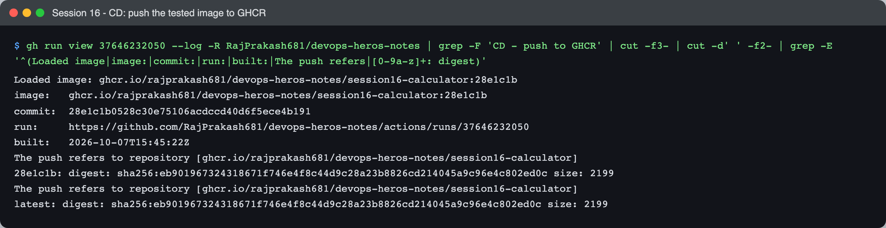

```text
Loaded image: ghcr.io/rajprakash681/devops-heros-notes/session16-calculator:28e1c1b
image:   ghcr.io/rajprakash681/devops-heros-notes/session16-calculator:28e1c1b
commit:  28e1c1b0528c30e75106acdccd40d6f5ece4b191
run:     https://github.com/RajPrakash681/devops-heros-notes/actions/runs/37646232050
built:   2026-10-07T15:45:22Z
The push refers to repository [ghcr.io/rajprakash681/devops-heros-notes/session16-calculator]
28e1c1b: digest: sha256:eb901967324318671f746e4f8c44d9c28a23b8826cd214045a9c96e4c802ed0c size: 2199
The push refers to repository [ghcr.io/rajprakash681/devops-heros-notes/session16-calculator]
latest: digest: sha256:eb901967324318671f746e4f8c44d9c28a23b8826cd214045a9c96e4c802ed0c size: 2199
```

`built: 15:45:22Z` is the timestamp written in the *build* job. `deliver` started later and
built nothing. The two tags, `28e1c1b` and `latest`, share one digest; a tag is just a
pointer. The second push uploaded no data at all: every layer reported
`Layer already exists`.

`deploy` then creates a Kubernetes cluster **on the runner** with kind, pulls the image from
GHCR, and applies [`k8s/deployment.yaml`](k8s/deployment.yaml) with `IMAGE_PLACEHOLDER`
swapped for the commit tag:

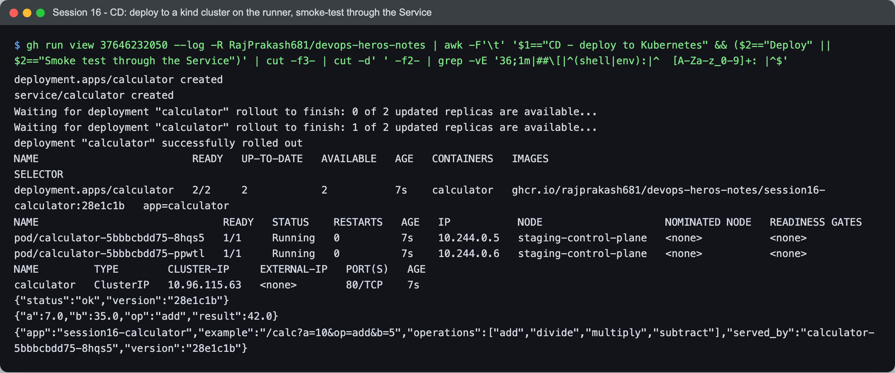

```text
deployment.apps/calculator created
service/calculator created
Waiting for deployment "calculator" rollout to finish: 0 of 2 updated replicas are available...
Waiting for deployment "calculator" rollout to finish: 1 of 2 updated replicas are available...
deployment "calculator" successfully rolled out
NAME                         READY   UP-TO-DATE   AVAILABLE   AGE   CONTAINERS   IMAGES                                                                  SELECTOR
deployment.apps/calculator   2/2     2            2           7s    calculator   ghcr.io/rajprakash681/devops-heros-notes/session16-calculator:28e1c1b   app=calculator
NAME                              READY   STATUS    RESTARTS   AGE   IP           NODE                    NOMINATED NODE   READINESS GATES
pod/calculator-5bbbcbdd75-8hqs5   1/1     Running   0          7s    10.244.0.5   staging-control-plane   <none>           <none>
pod/calculator-5bbbcbdd75-ppwtl   1/1     Running   0          7s    10.244.0.6   staging-control-plane   <none>           <none>
NAME         TYPE        CLUSTER-IP     EXTERNAL-IP   PORT(S)   AGE
calculator   ClusterIP   10.96.115.63   <none>        80/TCP    7s
{"status":"ok","version":"28e1c1b"}
{"a":7.0,"b":35.0,"op":"add","result":42.0}
{"app":"session16-calculator","example":"/calc?a=10&op=add&b=5","operations":["add","divide","multiply","subtract"],"served_by":"calculator-5bbbcbdd75-8hqs5","version":"28e1c1b"}
```

`rollout status` did not return as soon as the pods were created. It waited for the
`readinessProbe` on `/health` to pass on both replicas (`0 of 2`, then `1 of 2`). The smoke
test then goes through the **Service**: port 80 maps to `targetPort` 8000, and a pod
answers with its own name in `served_by`.

The image ID ties the run together end to end:

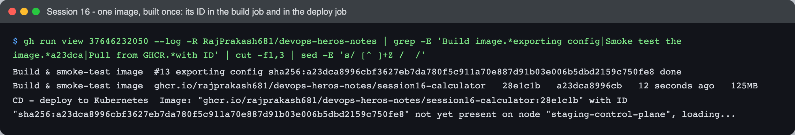

```text
Build & smoke-test image  #13 exporting config sha256:a23dca8996cbf3627eb7da780f5c911a70e887d91b03e006b5dbd2159c750fe8 done
Build & smoke-test image  ghcr.io/rajprakash681/devops-heros-notes/session16-calculator   28e1c1b   a23dca8996cb   12 seconds ago   125MB
CD - deploy to Kubernetes  Image: "ghcr.io/rajprakash681/devops-heros-notes/session16-calculator:28e1c1b" with ID "sha256:a23dca8996cbf3627eb7da780f5c911a70e887d91b03e006b5dbd2159c750fe8" not yet present on node "staging-control-plane", loading...
```

`a23dca8996cb…` was built in one job, smoke-tested there, saved, loaded and pushed by a
second job, and pulled into the cluster by a third. It is the same image throughout.

Why `docker pull` then `kind load docker-image`, instead of letting Kubernetes pull from
GHCR? The kind node has no registry credentials. The runner does: `docker/login-action`
logs in with `GITHUB_TOKEN` and `packages: read`. So the job pulls on the runner and
side-loads the image into the node. The tag is not `latest`, so the pod's default
`imagePullPolicy` is `IfNotPresent` and it uses the side-loaded copy without trying the
registry.

To be honest about scope: this cluster lives on the runner and dies with it. The `deploy`
job proves that the image, the manifests and the probes work together on a real Kubernetes
API. It is not a long-lived staging environment. Pointing it at one would mean swapping the
kind step for a kubeconfig stored as a secret.

---

## What I learned

- **CI produces an artifact and a verdict; CD only moves that artifact.** Once the image
  is saved and handed over instead of rebuilt, "what we tested" and "what we deployed" are
  provably the same thing, down to the image ID.
- **`needs:` is the pipeline.** Each job's YAML is just a list of commands. The ordering,
  the parallelism and the short-circuiting all come from the `needs:` graph and a couple of
  `if:` conditions.
- **Jobs are isolated machines.** That is why outputs and artifacts exist, and why the
  `deliver` job begins by downloading a file instead of finding the image already there.
- **Least privilege is per job.** The token can read code everywhere, write packages in
  one job, and read packages in one other. A test dependency that turned malicious would
  not be able to push an image.
- **Continuous delivery vs deployment is one setting.** An approval rule on the
  `staging` environment would change the behaviour without changing the pipeline.
- **`fail-fast: false` changes what a failure tells you.** With it, a red matrix shows
  *which* platforms broke, not just the first one to finish failing.
- **Hosted runner labels drift.** `ubuntu-latest` was Ubuntu 24.04 for this run, and the
  run itself carried a warning that it moves to 26 on 19 October.

## Problems I hit

- **The secrets demo ran without a secret, and the warning pointed the wrong way.** The
  step printed `DEMO_API_TOKEN is not set (secrets are not passed to forks)`. I read the
  fork part first, but this was a push to my own `main`. The actual cause is the line above
  it in the log, `API_TOKEN:` (empty), and the API's `repository secrets: 0`: the secret
  was never created. The step deliberately exits 0 in that case so forks don't fail. The
  cost is that the run stays green while the demo silently shows nothing. Still to do:
  `gh secret set DEMO_API_TOKEN` and re-run.
- **`health=starting` in the CI smoke test is not a pass.** The build job's
  `docker inspect` ran about a second after `docker run`. The Dockerfile's `HEALTHCHECK`
  first fires after its 10-second interval, so Docker had not checked anything yet. What
  actually proved the container worked was the `curl` loop above it. Locally, waiting for
  the check gave `health=healthy`, which is what that line should say before anyone relies
  on it.
- **Pipes without `pipefail`.** The runner-shell difference in section 7 showed up only
  when I read the `shell:` line in each job's log. It never caused a failure here, but it
  means a step can "pass" with a failed command on the left of a pipe.
