# Session 17 — Complete CI/CD & DevSecOps — Task

- **Name:** Raj Prakash
- **Enrollment No:** 24BCS10328

> **Status:** done
>
> Workflow: [`.github/workflows/session17-devsecops.yml`](../../.github/workflows/session17-devsecops.yml).
> It ran three times, and each run is a step in the story below:
>
> | Run | Commit | Result |
> |---|---|---|
> | [37646269101](https://github.com/RajPrakash681/devops-heros-notes/actions/runs/37646269101) | `be14345` course app as shipped | SAST failed, gate **closed** |
> | [37646833975](https://github.com/RajPrakash681/devops-heros-notes/actions/runs/37646833975) | `7763c7d` code fixed | image scan failed, gate **closed** |
> | [37648498775](https://github.com/RajPrakash681/devops-heros-notes/actions/runs/37648498775) | `e3d7599` pip removed from the image | all green: pushed to GHCR, deployed, smoke-tested |
>
> All three ran on GitHub-hosted `ubuntu-latest` runners. Kubernetes is a kind cluster created
> on the runner by the deploy job.

---

## What the task asked

Build a complete CI/CD pipeline with security built in, in this order:

**Code → Build → Unit Test → SAST → SCA → Secret Scan → Docker Build → Container Image Scan →
Security Gate → Push Image → Deploy to Kubernetes**

The starting point is the course's demo app in [`../demo/`](../demo/), a Flask "DevSecOps
Dashboard". I copied its app, tests, Dockerfile and requirements into this folder
**unchanged** and ran the pipeline against that first. The question I wanted answered was
not "can I make a green pipeline?" but "**does the pipeline catch real problems?**" A gate
that has never closed proves nothing.

---

## The pipeline

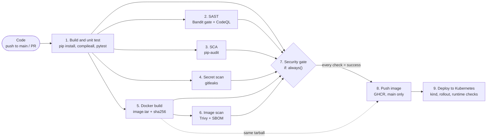

| Required stage | Job | Tool | What fails it | YAML lines |
|---|---|---|---|---|
| Code | workflow trigger | GitHub Actions (`push` to `main`, `pull_request`, filtered by `paths:`) | — | 15–25 |
| Build | `1. Build & unit test` | `pip install`, `python -m compileall` | a dependency or syntax error | 51–54 |
| Unit Test | `1. Build & unit test` | pytest + pytest-cov, JUnit report | any failing test | 55–61 |
| SAST | `2. SAST (Bandit + CodeQL)` | **Bandit 1.9.4** (gate) and **CodeQL** (reported to the Security tab) | a Bandit finding of medium+ severity at medium+ confidence | 63–109 |
| SCA | `3. SCA (pip-audit)` | **pip-audit 2.10.1** against `requirements.txt` | any known vulnerability (`--strict`) | 111–137 |
| Secret Scan | `4. Secret scan (gitleaks)` | **gitleaks 8.30.1**, pinned and checksum-verified | a secret in the working tree or in this project's git history | 139–179 |
| Docker Build | `5. Docker build` | buildx, then `docker save` to a tarball + `sha256sum` | a build error | 181–213 |
| Container Image Scan | `6. Image scan (Trivy)` | **Trivy 0.75.0**, pinned and checksum-verified, plus a CycloneDX SBOM | a **fixable** HIGH or CRITICAL CVE | 215–256 |
| Security Gate | `7. Security gate` | a shell step over `needs.<job>.result` | any job whose result is not `success` | 258–286 |
| Push Image | `8. Push image (GHCR)` | `docker push`, authenticated with `GITHUB_TOKEN` | runs only if the gate passed, on a push to `main` | 288–315 |
| Deploy to Kubernetes | `9. Deploy to Kubernetes` | kind + kubectl | rollout timeout, smoke test, runtime checks | 317–355 |

### Why the scanners run side by side, not in a line

The assignment lists the stages in order, and the pipeline keeps that order where it is a
real dependency: you cannot scan an image before you build it. But SAST, SCA, secret
scanning and the Docker build do not depend on each other. If they were chained, **the first
failure would hide every result after it**. You would fix the SAST finding, push, and only
then learn that the image also fails. Run 1 below shows the alternative: SAST failed, and
SCA, secret scanning, the build and the image scan still ran and reported.

### Why the gate is its own job with `if: always()`

```yaml
security-gate:                                  # lines 258-286
  needs: [build-test, sast, sca, secret-scan, docker-build, image-scan]
  if: always()
  ...
      row "SAST (Bandit/CodeQL)"     "${{ needs.sast.result }}"
      ...
      exit $fail
```

Without `if: always()`, a job whose dependency failed is **skipped**. The gate would vanish
from the run at exactly the moment it has something to say. With it, the gate always runs,
reads every scanner's result, prints one table (also written to the run's summary page), and
fails if any row is not `success`. That includes `skipped` and `cancelled`, so a scanner
that never ran counts as a failure, not a pass.

`push` needs the gate, and its `if:` has no `always()`. GitHub adds an implicit `success()`
to such conditions, so a closed gate means push and deploy are **skipped**.

---

## Run 1 — the course app as shipped

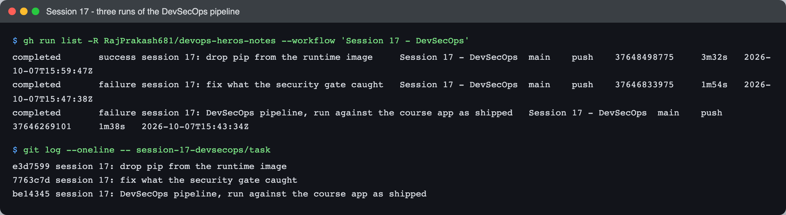

```text
$ gh run list -R RajPrakash681/devops-heros-notes --workflow 'Session 17 - DevSecOps'
completed	success	session 17: drop pip from the runtime image	Session 17 - DevSecOps	main	push	37648498775	3m32s	2026-10-07T15:59:47Z
completed	failure	session 17: fix what the security gate caught	Session 17 - DevSecOps	main	push	37646833975	1m54s	2026-10-07T15:47:38Z
completed	failure	session 17: DevSecOps pipeline, run against the course app as shipped	Session 17 - DevSecOps	main	push	37646269101	1m38s	2026-10-07T15:43:34Z

$ git log --oneline -- session-17-devsecops/task
e3d7599 session 17: drop pip from the runtime image
7763c7d session 17: fix what the security gate caught
be14345 session 17: DevSecOps pipeline, run against the course app as shipped
```

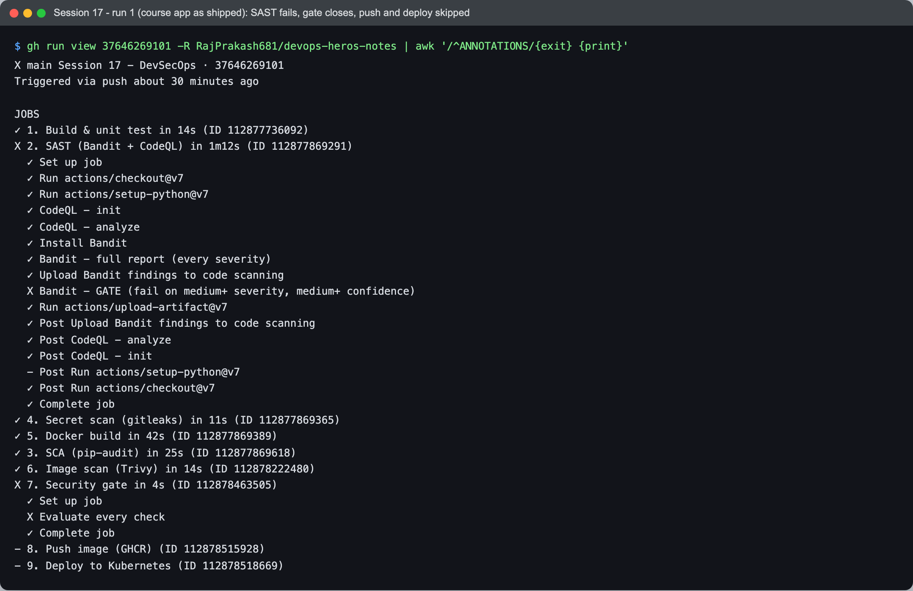

```text
X main Session 17 - DevSecOps · 37646269101
Triggered via push about 30 minutes ago

JOBS
✓ 1. Build & unit test in 14s (ID 112877736092)
X 2. SAST (Bandit + CodeQL) in 1m12s (ID 112877869291)
  ✓ Set up job
  ✓ Run actions/checkout@v7
  ✓ Run actions/setup-python@v7
  ✓ CodeQL - init
  ✓ CodeQL - analyze
  ✓ Install Bandit
  ✓ Bandit - full report (every severity)
  ✓ Upload Bandit findings to code scanning
  X Bandit - GATE (fail on medium+ severity, medium+ confidence)
  ✓ Run actions/upload-artifact@v7
  ...
✓ 4. Secret scan (gitleaks) in 11s (ID 112877869365)
✓ 5. Docker build in 42s (ID 112877869389)
✓ 3. SCA (pip-audit) in 25s (ID 112877869618)
✓ 6. Image scan (Trivy) in 14s (ID 112878222480)
X 7. Security gate in 4s (ID 112878463505)
  ✓ Set up job
  X Evaluate every check
  ✓ Complete job
- 8. Push image (GHCR) (ID 112878515928)
- 9. Deploy to Kubernetes (ID 112878518669)
```

The gate is red, and push and deploy show `-` (skipped). Nothing reached the registry.

### What Bandit found

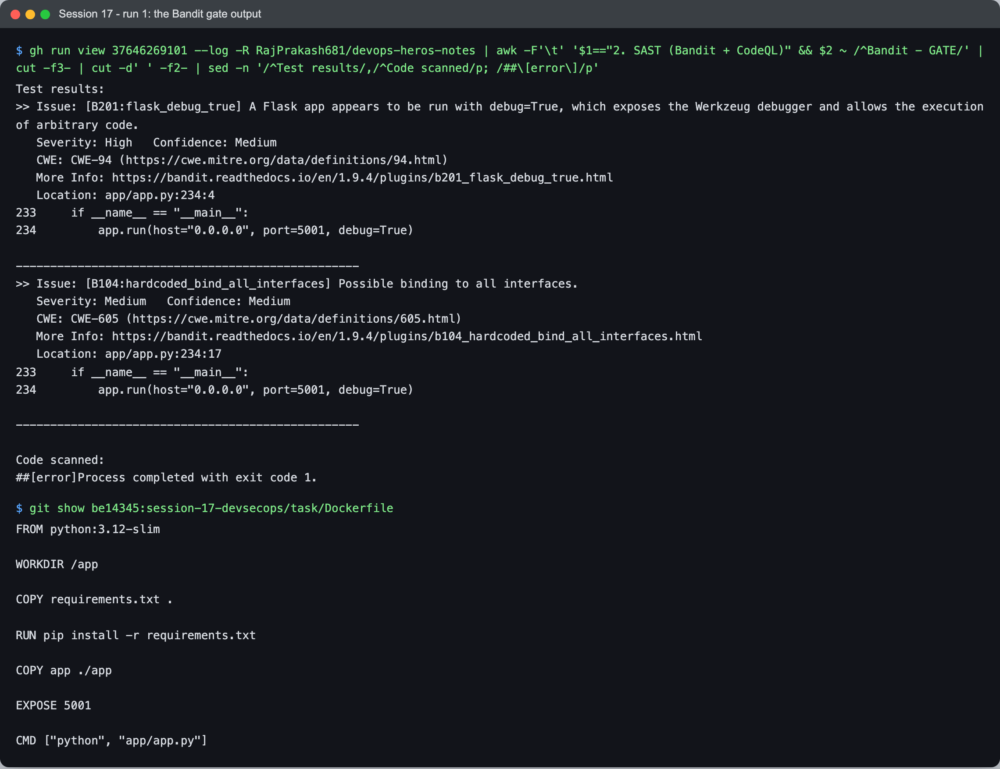

```text
Test results:
>> Issue: [B201:flask_debug_true] A Flask app appears to be run with debug=True, which exposes the Werkzeug debugger and allows the execution of arbitrary code.
   Severity: High   Confidence: Medium
   CWE: CWE-94 (https://cwe.mitre.org/data/definitions/94.html)
   More Info: https://bandit.readthedocs.io/en/1.9.4/plugins/b201_flask_debug_true.html
   Location: app/app.py:234:4
233	if __name__ == "__main__":
234	    app.run(host="0.0.0.0", port=5001, debug=True)

--------------------------------------------------
>> Issue: [B104:hardcoded_bind_all_interfaces] Possible binding to all interfaces.
   Severity: Medium   Confidence: Medium
   CWE: CWE-605 (https://cwe.mitre.org/data/definitions/605.html)
   More Info: https://bandit.readthedocs.io/en/1.9.4/plugins/b104_hardcoded_bind_all_interfaces.html
   Location: app/app.py:234:17
233	if __name__ == "__main__":
234	    app.run(host="0.0.0.0", port=5001, debug=True)

--------------------------------------------------

Code scanned:
##[error]Process completed with exit code 1.

$ git show be14345:session-17-devsecops/task/Dockerfile
FROM python:3.12-slim

WORKDIR /app

COPY requirements.txt .

RUN pip install -r requirements.txt

COPY app ./app

EXPOSE 5001

CMD ["python", "app/app.py"]
```

Line 234 on its own looks like a developer convenience. The Dockerfile is what makes it
serious. `CMD ["python", "app/app.py"]` runs exactly that `__main__` block, so the shipped
container ran Flask's **development server with the Werkzeug debugger on, listening on every
interface**. And because the Dockerfile has no `USER`, it ran as **root**. The Werkzeug
debugger is an interactive Python console in the browser: anyone who reaches it can run
code. Current Werkzeug puts a PIN in front of it, but a PIN is a thin wall in front of a
root shell.

B104 (the `0.0.0.0` bind) is often a false positive in containers, because a container
*must* listen on all interfaces to be reachable. Here it was the other half of the same
problem: it is what made the debugger reachable from outside.

Bandit also reported five **Low** findings (B311, `random` used for greetings and the
pipeline simulator). Those are not cryptographic uses. They stay visible in the full report
and in the Security tab, but the gate is set to medium-and-above, so they do not block.

CodeQL found the debug server too (alert `py/flask-debug`, severity high, in the
[code scanning section](#code-scanning-the-security-tab) below), yet the job tree shows
`✓ CodeQL - analyze`. **CodeQL's analyze step uploads findings; it does not fail the job.**
That is why Bandit is the gate and CodeQL is the second opinion in the Security tab, and it
matters for the course's demo workflow (below), which used CodeQL alone.

### The fix (commit `7763c7d`)

- `app.run()` takes debug mode and bind address from the environment, **defaulting to
  debug off and `127.0.0.1`**. The `__main__` block is now for local development only.
- The container serves the app with **gunicorn** (`gunicorn==26.2.0` added to
  `requirements.txt`) instead of `python app/app.py`, so the `__main__` block never runs in
  the image. The `0.0.0.0` bind still exists. It moved to the Dockerfile's `CMD`, the one
  place it belongs.
- The container runs as **`USER 10001`**, a *numeric* UID. The deployment sets
  `runAsNonRoot: true`, and Kubernetes can only verify that for a number. With a user
  *name*, the kubelet refuses to start the pod because it cannot prove the name is not root.
- The base moved from `python:3.12-slim` to `python:3.13-slim`. I replaced the deprecated
  `datetime.utcnow()` with timezone-aware `datetime.now(timezone.utc)` and dropped an
  unused `import math`.

---

## Run 2 — the code is clean, the image is not

SAST passed this time. The **image scan** failed instead, while the dependency scan passed:

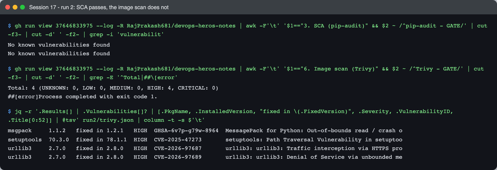

```text
$ gh run view 37646833975 --log ... | awk ... '$1=="3. SCA (pip-audit)" && $2 ~ /^pip-audit - GATE/' ...
No known vulnerabilities found
No known vulnerabilities found

$ gh run view 37646833975 --log ... | awk ... '$1=="6. Image scan (Trivy)" && $2 ~ /^Trivy - GATE/' ...
Total: 4 (UNKNOWN: 0, LOW: 0, MEDIUM: 0, HIGH: 4, CRITICAL: 0)
##[error]Process completed with exit code 1.

$ jq -r '.Results[] | .Vulnerabilities[]? | [.PkgName, .InstalledVersion, "fixed in \(.FixedVersion)", .Severity, .VulnerabilityID, .Title[0:52]] | @tsv' run2/trivy.json | column -t -s $'\t'
msgpack     1.1.2   fixed in 1.2.1   HIGH  GHSA-6v7p-g79w-8964  MessagePack for Python: Out-of-bounds read / crash o
setuptools  70.3.0  fixed in 78.1.1  HIGH  CVE-2025-47273       setuptools: Path Traversal Vulnerability in setuptoo
urllib3     2.7.0   fixed in 2.8.0   HIGH  CVE-2026-97687       urllib3: urllib3: Traffic interception via HTTPS pro
urllib3     2.7.0   fixed in 2.8.0   HIGH  CVE-2026-97689       urllib3: urllib3: Denial of Service via unbounded me
```

(`run2/trivy.json` is the JSON report the gate step wrote, downloaded from the run's
`report-image-scan` artifact.)

**None of these four packages is in `requirements.txt`.** The app needs Flask and gunicorn,
and pip-audit, which audits the dependency tree resolved from that file, was right that
those are clean. So where did urllib3, msgpack and setuptools come from?

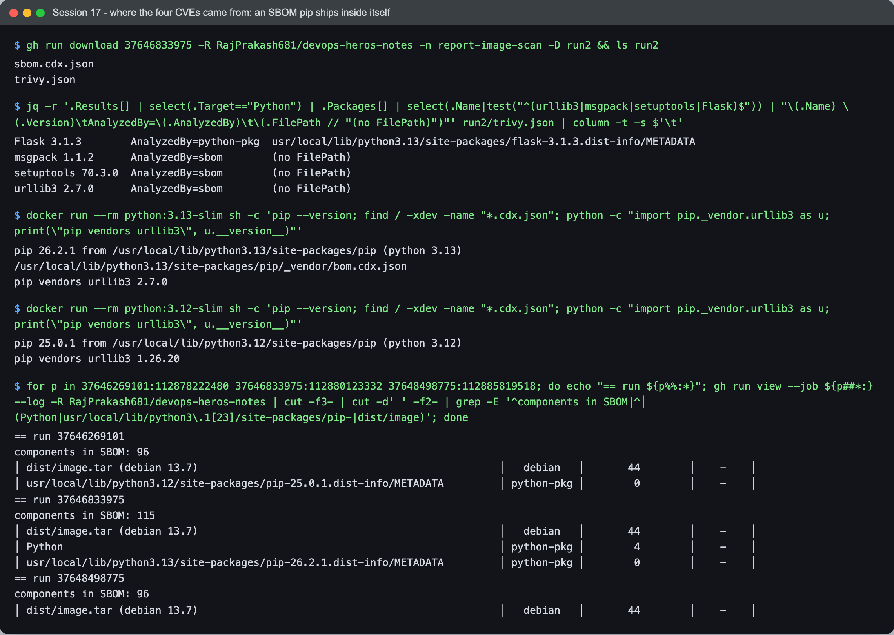

```text
$ jq -r '.Results[] | select(.Target=="Python") | .Packages[] | select(.Name|test("^(urllib3|msgpack|setuptools|Flask)$")) | ...' run2/trivy.json | column -t -s $'\t'
Flask 3.1.3        AnalyzedBy=python-pkg  usr/local/lib/python3.13/site-packages/flask-3.1.3.dist-info/METADATA
msgpack 1.1.2      AnalyzedBy=sbom        (no FilePath)
setuptools 70.3.0  AnalyzedBy=sbom        (no FilePath)
urllib3 2.7.0      AnalyzedBy=sbom        (no FilePath)

$ docker run --rm python:3.13-slim sh -c 'pip --version; find / -xdev -name "*.cdx.json"; python -c "import pip._vendor.urllib3 as u; print(\"pip vendors urllib3\", u.__version__)"'
pip 26.2.1 from /usr/local/lib/python3.13/site-packages/pip (python 3.13)
/usr/local/lib/python3.13/site-packages/pip/_vendor/bom.cdx.json
pip vendors urllib3 2.7.0

$ docker run --rm python:3.12-slim sh -c 'pip --version; find / -xdev -name "*.cdx.json"; python -c "import pip._vendor.urllib3 as u; print(\"pip vendors urllib3\", u.__version__)"'
pip 25.0.1 from /usr/local/lib/python3.12/site-packages/pip (python 3.12)
pip vendors urllib3 1.26.20

$ for p in 37646269101:112878222480 37646833975:112880123332 37648498775:112885819518; do echo "== run ${p%%:*}"; gh run view --job ${p##*:} --log ... | grep -E '^components in SBOM|^│ (Python|usr/local/lib/python3\.1[23]/site-packages/pip-|dist/image)'; done
== run 37646269101
components in SBOM: 96
│ dist/image.tar (debian 13.7)                                                 │   debian   │       44        │    -    │
│ usr/local/lib/python3.12/site-packages/pip-25.0.1.dist-info/METADATA         │ python-pkg │        0        │    -    │
== run 37646833975
components in SBOM: 115
│ dist/image.tar (debian 13.7)                                                 │   debian   │       44        │    -    │
│ Python                                                                       │ python-pkg │        4        │    -    │
│ usr/local/lib/python3.13/site-packages/pip-26.2.1.dist-info/METADATA         │ python-pkg │        0        │    -    │
== run 37648498775
components in SBOM: 96
│ dist/image.tar (debian 13.7)                                                 │   debian   │       44        │    -    │
```

That is the answer, in three layers:

1. **They live inside pip.** pip does not install urllib3, msgpack or setuptools'
   `pkg_resources` as normal packages. It ships **private copies** of them in
   `pip/_vendor/`. They are not installed packages, so `pip list` does not show them, and
   pip-audit's dependency resolution never sees them.
2. **Trivy found them through an SBOM that pip ships inside itself.** pip 26.2.1 (in
   `python:3.13-slim`) includes `pip/_vendor/bom.cdx.json`, a CycloneDX list of everything
   it vendors. Trivy read it (`AnalyzedBy=sbom`) and reported those packages under a target
   called just `Python`, with no file path. That pathless `Python` row, with its 4
   vulnerabilities, is what failed the gate.
3. **Run 1's clean image scan was blindness, not safety.** pip 25.0.1 in
   `python:3.12-slim` also vendors urllib3 (1.26.20). But it ships no SBOM, so Trivy had no
   way to see inside it: run 1's report has no `Python` row, and its SBOM lists 96
   components against run 2's 115. Moving to 3.13 did not put vendored code into the
   image; it was there in run 1 too. The move made that code *visible* to the scanner.

This is the clearest lesson of the assignment: **SCA and image scanning answer different
questions.** SCA asks "are the dependencies I *declared* safe?" Image scanning asks "is
everything I am about to *ship* safe?" The app never imports pip, but the image contained
it, and an attacker who gets a shell does not care what `requirements.txt` says.

### The fix (commit `e3d7599`)

The app does not need pip at runtime. Upgrading pip would only reset the clock until the
next vendored CVE. Waiving the four CVEs in `security/.trivyignore` would mean accepting a
risk in code that serves no purpose. So the image now removes pip after using it:

```dockerfile
RUN pip install --no-cache-dir -r requirements.txt \
 && pip uninstall -y pip
```

The SBOM went back to 96 components, and the `Python` row is gone (run 3, above).

---

## Run 3 — every stage green

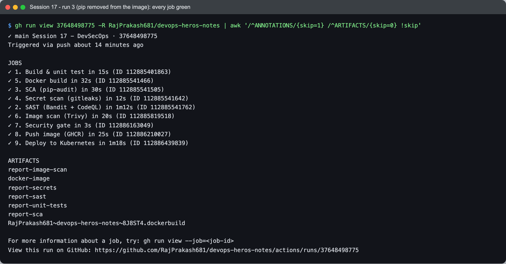

```text
✓ main Session 17 - DevSecOps · 37648498775
Triggered via push about 14 minutes ago

JOBS
✓ 1. Build & unit test in 15s (ID 112885401863)
✓ 5. Docker build in 32s (ID 112885541466)
✓ 3. SCA (pip-audit) in 30s (ID 112885541505)
✓ 4. Secret scan (gitleaks) in 12s (ID 112885541642)
✓ 2. SAST (Bandit + CodeQL) in 1m12s (ID 112885541762)
✓ 6. Image scan (Trivy) in 20s (ID 112885819518)
✓ 7. Security gate in 3s (ID 112886163049)
✓ 8. Push image (GHCR) in 25s (ID 112886210027)
✓ 9. Deploy to Kubernetes in 1m18s (ID 112886439839)

ARTIFACTS
report-image-scan
docker-image
report-secrets
report-sast
report-unit-tests
report-sca
RajPrakash681~devops-heros-notes~8J8ST4.dockerbuild
```

The `report-*` artifacts hold each scanner's machine-readable output: Bandit SARIF,
pip-audit JSON, gitleaks JSON, Trivy JSON plus the SBOM, and the JUnit XML. Every one is
uploaded with `if: always()`, so a failing scan still leaves its evidence behind.

### The security gate, across all three runs

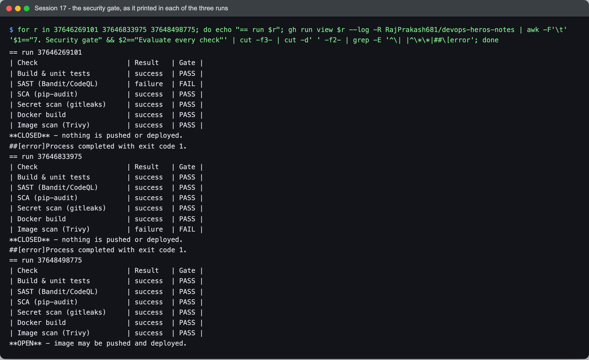

```text
== run 37646269101
| Check                      | Result   | Gate |
| Build & unit tests         | success  | PASS |
| SAST (Bandit/CodeQL)       | failure  | FAIL |
| SCA (pip-audit)            | success  | PASS |
| Secret scan (gitleaks)     | success  | PASS |
| Docker build               | success  | PASS |
| Image scan (Trivy)         | success  | PASS |
**CLOSED** - nothing is pushed or deployed.
##[error]Process completed with exit code 1.
== run 37646833975
| Check                      | Result   | Gate |
| Build & unit tests         | success  | PASS |
| SAST (Bandit/CodeQL)       | success  | PASS |
| SCA (pip-audit)            | success  | PASS |
| Secret scan (gitleaks)     | success  | PASS |
| Docker build               | success  | PASS |
| Image scan (Trivy)         | failure  | FAIL |
**CLOSED** - nothing is pushed or deployed.
##[error]Process completed with exit code 1.
== run 37648498775
| Check                      | Result   | Gate |
| Build & unit tests         | success  | PASS |
| SAST (Bandit/CodeQL)       | success  | PASS |
| SCA (pip-audit)            | success  | PASS |
| Secret scan (gitleaks)     | success  | PASS |
| Docker build               | success  | PASS |
| Image scan (Trivy)         | success  | PASS |
**OPEN** - image may be pushed and deployed.
```

Closed, closed, open. Each time the gate named exactly one failing check, and each fix
turned exactly that row green.

### Build once, scan that, push that

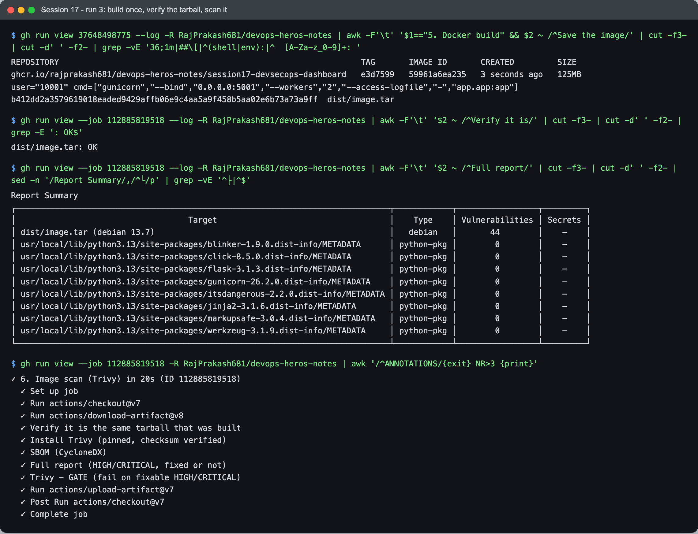

```text
REPOSITORY                                                               TAG       IMAGE ID       CREATED         SIZE
ghcr.io/rajprakash681/devops-heros-notes/session17-devsecops-dashboard   e3d7599   59961a6ea235   3 seconds ago   125MB
user="10001" cmd=["gunicorn","--bind","0.0.0.0:5001","--workers","2","--access-logfile","-","app.app:app"]
b412dd2a3579619018eaded9429affb06e9c4aa5a9f458b5aa02e6b73a73a9ff  dist/image.tar

$ gh run view --job 112885819518 --log ... | awk -F'\t' '$2 ~ /^Verify it is/' ...
dist/image.tar: OK

Report Summary
┌──────────────────────────────────────────────────────────────────────────────┬────────────┬─────────────────┬─────────┐
│                                    Target                                    │    Type    │ Vulnerabilities │ Secrets │
│ dist/image.tar (debian 13.7)                                                 │   debian   │       44        │    -    │
│ usr/local/lib/python3.13/site-packages/blinker-1.9.0.dist-info/METADATA      │ python-pkg │        0        │    -    │
│ usr/local/lib/python3.13/site-packages/click-8.5.0.dist-info/METADATA        │ python-pkg │        0        │    -    │
│ usr/local/lib/python3.13/site-packages/flask-3.1.3.dist-info/METADATA        │ python-pkg │        0        │    -    │
│ usr/local/lib/python3.13/site-packages/gunicorn-26.2.0.dist-info/METADATA    │ python-pkg │        0        │    -    │
│ usr/local/lib/python3.13/site-packages/itsdangerous-2.2.0.dist-info/METADATA │ python-pkg │        0        │    -    │
│ usr/local/lib/python3.13/site-packages/jinja2-3.1.6.dist-info/METADATA       │ python-pkg │        0        │    -    │
│ usr/local/lib/python3.13/site-packages/markupsafe-3.0.4.dist-info/METADATA   │ python-pkg │        0        │    -    │
│ usr/local/lib/python3.13/site-packages/werkzeug-3.1.9.dist-info/METADATA     │ python-pkg │        0        │    -    │
└──────────────────────────────────────────────────────────────────────────────┴────────────┴─────────────────┴─────────┘
```

The Docker build job builds the image **once**, writes it to `dist/image.tar` and records
its sha256 (`b412dd2a…`). The image-scan job downloads that artifact and runs
`sha256sum -c` before Trivy touches it, so the scan is of the bytes that were built. Trivy
scans the tarball directly (`--input dist/image.tar`), with no registry involved. The image
runs as `user="10001"` with gunicorn as its command, and `pip-26.2.1.dist-info` is no longer
among the targets.

### What the image gate still lets through

The gate fails only on **fixable** HIGH/CRITICAL findings (`--ignore-unfixed`). The full
report still shows 44 HIGH findings in the Debian base, in every run:

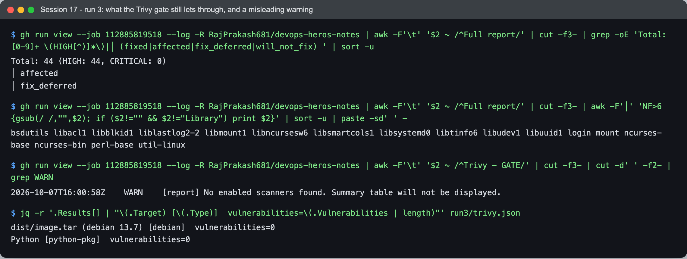

```text
Total: 44 (HIGH: 44, CRITICAL: 0)
│ affected 
│ fix_deferred 

bsdutils libacl1 libblkid1 liblastlog2-2 libmount1 libncursesw6 libsmartcols1 libsystemd0 libtinfo6 libudev1 libuuid1 login mount ncurses-base ncurses-bin perl-base util-linux

2026-10-07T16:00:58Z	WARN	[report] No enabled scanners found. Summary table will not be displayed.

$ jq -r '.Results[] | "\(.Target) [\(.Type)]  vulnerabilities=\(.Vulnerabilities | length)"' run3/trivy.json
dist/image.tar (debian 13.7) [debian]  vulnerabilities=0
Python [python-pkg]  vulnerabilities=0
```

Every one of the 44 has status `affected` or `fix_deferred`. Debian has not shipped a fix,
so no rebuild or upgrade on my side can remove them. These are OS libraries (util-linux,
ncurses, systemd's libraries, perl-base, login) that the app never calls. The policy is
deliberate: a gate that fails on things nobody can fix just gets switched off. The cost is
that these findings are **accepted, not resolved**, and the full report keeps them in view
on every run. `security/.trivyignore` is empty, so no *fixable* CVE is waived.

### Secret scanning, with proof that the scanner works

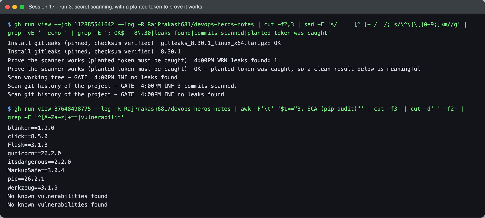

```text
Install gitleaks (pinned, checksum verified)  gitleaks_8.30.1_linux_x64.tar.gz: OK
Install gitleaks (pinned, checksum verified)  8.30.1
Prove the scanner works (planted token must be caught)  4:00PM WRN leaks found: 1
Prove the scanner works (planted token must be caught)  OK - planted token was caught, so a clean result below is meaningful
Scan working tree - GATE  4:00PM INF no leaks found
Scan git history of the project - GATE  4:00PM INF 3 commits scanned.
Scan git history of the project - GATE  4:00PM INF no leaks found
```

`no leaks found` is what a working scanner says about a clean repo. It is also what a
scanner pointed at the wrong directory, or running with its rules switched off, says about
anything. So before the real scan, the job **plants a token and requires gitleaks to catch
it** (lines 155–165). The token is a `ghp_` + 36 random characters, generated at run time
from `/dev/urandom`, written to a temp directory, and never committed. If gitleaks did *not*
flag it, the step fails with `gitleaks did NOT flag a planted token - a green scan would mean
nothing`. Only then do the two gated scans run: the working tree, and the **git history** of
this project (`fetch-depth: 0`, all three commits). A secret that was committed and later
deleted is still in history, still leaked.

The SCA job in the same run shows what pip-audit actually audits. It is the tree resolved
from `requirements.txt`; pip's vendored copies are not in it:

```text
blinker==1.9.0
click==8.5.0
Flask==3.1.3
gunicorn==26.2.0
itsdangerous==2.2.0
MarkupSafe==3.0.4
pip==26.2.1
Werkzeug==3.1.9
No known vulnerabilities found
No known vulnerabilities found
```

### Push and deploy

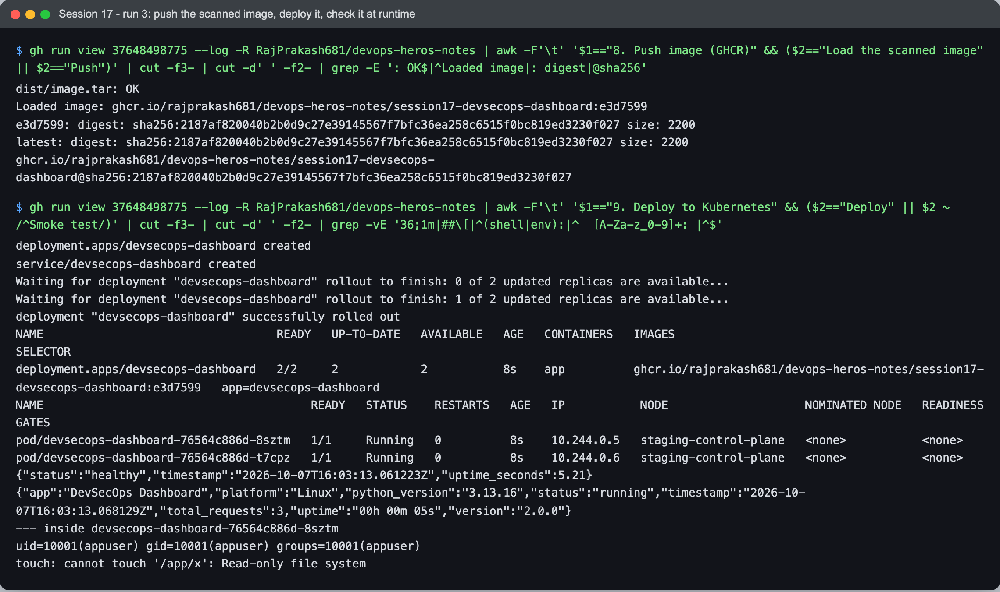

```text
dist/image.tar: OK
Loaded image: ghcr.io/rajprakash681/devops-heros-notes/session17-devsecops-dashboard:e3d7599
e3d7599: digest: sha256:2187af820040b2b0d9c27e39145567f7bfc36ea258c6515f0bc819ed3230f027 size: 2200
latest: digest: sha256:2187af820040b2b0d9c27e39145567f7bfc36ea258c6515f0bc819ed3230f027 size: 2200
ghcr.io/rajprakash681/devops-heros-notes/session17-devsecops-dashboard@sha256:2187af820040b2b0d9c27e39145567f7bfc36ea258c6515f0bc819ed3230f027

deployment.apps/devsecops-dashboard created
service/devsecops-dashboard created
Waiting for deployment "devsecops-dashboard" rollout to finish: 0 of 2 updated replicas are available...
Waiting for deployment "devsecops-dashboard" rollout to finish: 1 of 2 updated replicas are available...
deployment "devsecops-dashboard" successfully rolled out
NAME                                  READY   UP-TO-DATE   AVAILABLE   AGE   CONTAINERS   IMAGES                                                                           SELECTOR
deployment.apps/devsecops-dashboard   2/2     2            2           8s    app          ghcr.io/rajprakash681/devops-heros-notes/session17-devsecops-dashboard:e3d7599   app=devsecops-dashboard
NAME                                       READY   STATUS    RESTARTS   AGE   IP           NODE                    NOMINATED NODE   READINESS GATES
pod/devsecops-dashboard-76564c886d-8sztm   1/1     Running   0          8s    10.244.0.5   staging-control-plane   <none>           <none>
pod/devsecops-dashboard-76564c886d-t7cpz   1/1     Running   0          8s    10.244.0.6   staging-control-plane   <none>           <none>
{"status":"healthy","timestamp":"2026-10-07T16:03:13.061223Z","uptime_seconds":5.21}
{"app":"DevSecOps Dashboard","platform":"Linux","python_version":"3.13.16","status":"running","timestamp":"2026-10-07T16:03:13.068129Z","total_requests":3,"uptime":"00h 00m 05s","version":"2.0.0"}
--- inside devsecops-dashboard-76564c886d-8sztm
uid=10001(appuser) gid=10001(appuser) groups=10001(appuser)
touch: cannot touch '/app/x': Read-only file system
```

- The push job checks the sha256 **a second time** (`dist/image.tar: OK`) before
  `docker load`. The image in GHCR is the same tarball the gate approved, pushed as the
  commit tag `e3d7599` and as `latest`, which share one digest.
- The deploy job pulls that tag from GHCR, loads it into a kind cluster on the runner, and
  waits for the rollout. Both replicas became ready only once their readiness probe on
  `/health` passed.
- The last three lines are **runtime** security checks, not just "is it up". Inside a
  running pod, the process is **uid 10001**, not root, and writing to the app directory
  fails with **`Read-only file system`**. The manifest's `securityContext` was enforced, not
  merely written down: [`k8s/deployment.yaml`](k8s/deployment.yaml) has
  `runAsNonRoot: true`, `readOnlyRootFilesystem: true`, `allowPrivilegeEscalation: false`,
  `capabilities: drop: ["ALL"]` and the `RuntimeDefault` seccomp profile. Gunicorn needs one
  writable path for worker heartbeats, so `/tmp` is an `emptyDir`. Everything else is
  immutable.

Those manifest controls were already in place in run 1. Had the as-shipped root image ever
got past the gate, `runAsNonRoot: true` would have stopped it again at deploy time: the
kubelet refuses to start a container that would run as root. That was never exercised,
because the gate closed first. It is the last layer, not the only one.

---

## Code scanning: the Security tab

Both SAST tools upload SARIF, so their findings appear under the repository's **Security →
Code scanning** tab and are tracked across commits:

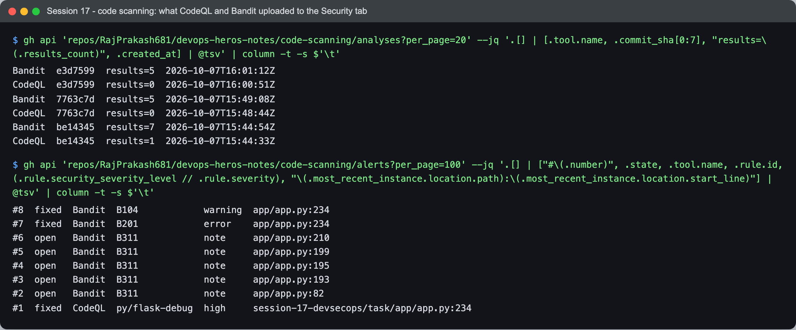

```text
$ gh api 'repos/RajPrakash681/devops-heros-notes/code-scanning/analyses?per_page=20' --jq ...
Bandit  e3d7599  results=5  2026-10-07T16:01:12Z
CodeQL  e3d7599  results=0  2026-10-07T16:00:51Z
Bandit  7763c7d  results=5  2026-10-07T15:49:08Z
CodeQL  7763c7d  results=0  2026-10-07T15:48:44Z
Bandit  be14345  results=7  2026-10-07T15:44:54Z
CodeQL  be14345  results=1  2026-10-07T15:44:33Z

$ gh api 'repos/RajPrakash681/devops-heros-notes/code-scanning/alerts?per_page=100' --jq ...
#8  fixed  Bandit  B104            warning  app/app.py:234
#7  fixed  Bandit  B201            error    app/app.py:234
#6  open   Bandit  B311            note     app/app.py:210
#5  open   Bandit  B311            note     app/app.py:199
#4  open   Bandit  B311            note     app/app.py:195
#3  open   Bandit  B311            note     app/app.py:193
#2  open   Bandit  B311            note     app/app.py:82
#1  fixed  CodeQL  py/flask-debug  high     session-17-devsecops/task/app/app.py:234
```

- On the as-shipped commit `be14345`, Bandit reported 7 findings (2 blocking, 5 low) and
  CodeQL reported 1. **Both tools independently flagged the debug server.**
- GitHub marked B201, B104 and CodeQL's `py/flask-debug` as **fixed** by `7763c7d`, so the
  fix is recorded against the commit that made it.
- The five B311 notes stay open on purpose. They are accepted as non-cryptographic uses of
  `random`, but they remain visible.

---

## The course's demo workflow, and where it falls short

The course provides its own pipeline,
[`../demo/.github/workflows/devsecops.yml`](../demo/.github/workflows/devsecops.yml). It has
the right stage names, but it could not have stopped either problem my runs caught:

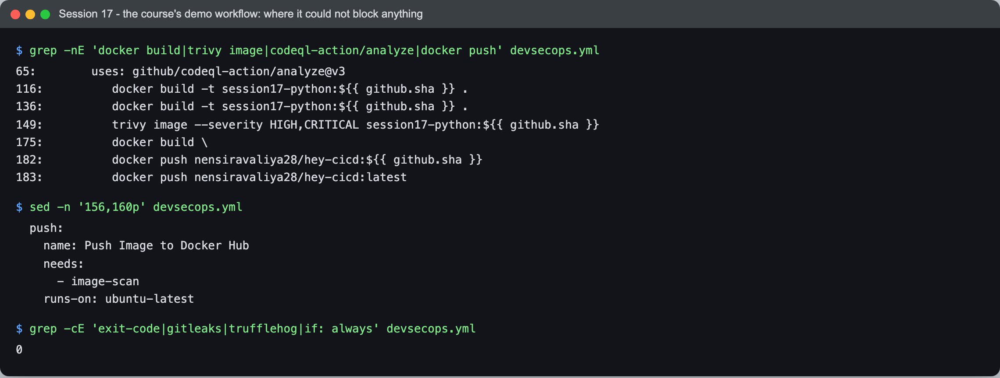

```text
$ grep -nE 'docker build|trivy image|codeql-action/analyze|docker push' devsecops.yml
65:        uses: github/codeql-action/analyze@v3
116:          docker build -t session17-python:${{ github.sha }} .
136:          docker build -t session17-python:${{ github.sha }} .
149:          trivy image --severity HIGH,CRITICAL session17-python:${{ github.sha }}
175:          docker build \
182:          docker push nensiravaliya28/hey-cicd:${{ github.sha }}
183:          docker push nensiravaliya28/hey-cicd:latest

$ sed -n '156,160p' devsecops.yml
  push:
    name: Push Image to Docker Hub
    needs:
      - image-scan
    runs-on: ubuntu-latest

$ grep -cE 'exit-code|gitleaks|trufflehog|if: always' devsecops.yml
0
```

| Gap in the demo | Why it matters | How this pipeline closes it |
|---|---|---|
| **Trivy has no `--exit-code`** (line 149). Trivy's default exit code is 0 whatever it finds. | The image scan prints a report and always passes. It can never block a push. My run 2 would have shipped four HIGH CVEs. | A separate informational report (`--exit-code 0`) plus a **gate** step: `--exit-code 1 --ignore-unfixed --ignorefile security/.trivyignore` (lines 243–251). |
| **The image is built three times** (lines 116, 136, 175: docker-build, image-scan, push). | The image that is pushed is not the image that was scanned. A rebuild can pick up a newer base image or newer transitive dependencies, so the scan says nothing certain about what ships. | **One build** → `docker save` → sha256 → artifact. The scan job verifies the sha256 before scanning; the push job verifies it again before pushing (`dist/image.tar: OK` in both). |
| **No secret scanning** (the count above is 0). | A committed token is a breach on its own, independent of the code's quality. | gitleaks over the working tree **and** the git history, gated, with a **negative test** that plants a fresh token and fails the job if it is not caught. |
| **SAST is CodeQL only** (line 65). | `codeql-action/analyze` uploads results but does not fail the job. My run 1 proves it: CodeQL found `py/flask-debug` and its step was still `✓`. | Bandit as the blocking SAST gate (`--severity-level medium --confidence-level medium`), with CodeQL kept for the Security tab. |
| **No single gate.** `push` needs only `image-scan`, and the push job has no `if:`. | No single place says what failed, and nothing keeps a pull request from reaching `docker push ... :latest`. | One `security-gate` job with `if: always()` that evaluates every `needs.<job>.result`, and `push` restricted to `push` events on `main` (line 291). |

The demo also pushes to a hard-coded Docker Hub account and needs a `DOCKERHUB_TOKEN`
secret. This pipeline pushes to GHCR under the repository's own name with the per-run
`GITHUB_TOKEN`, so there is no long-lived registry credential to leak.

---

## What I learned

- **A security gate has to be tested by closing it.** Running the unmodified course app
  first is what showed that every stage was actually wired to block. Two closed gates, each
  naming a different stage, mean more than one green run.
- **SCA and image scanning see different things.** pip-audit checked what I *declared*;
  Trivy checked what I *shipped*. In run 2 they disagreed, and both were correct.
- **A clean scan only means the scanner found nothing *it could see*.** Run 1's image
  scan passed because pip 25.0.1 gave Trivy nothing to read, not because its vendored
  urllib3 was safe. The same reasoning is why the gitleaks job proves itself with a planted
  token before reporting "no leaks".
- **The smallest image is the safest fix.** Removing something the app never uses (pip)
  beat upgrading it or waiving its CVEs, and it can't come back in a future advisory.
- **"Scanned" has to mean "these exact bytes".** Build once, hash it, check the hash at
  every hand-off. Otherwise the scan certifies a sibling of the image that ships.
- **`if: always()` is what makes a gate a gate.** Without it, the job that should report a
  failure is skipped by that same failure.
- **Reporting tools and gating tools are different jobs.** CodeQL is excellent at finding
  things and uploads them neatly, but it does not fail a build by itself. You have to know
  which of your tools can actually say no.
- **Deploy-time controls are a separate layer.** `runAsNonRoot`, a read-only root
  filesystem and dropped capabilities were checked *inside the running pod* (`uid=10001`,
  `Read-only file system`), not just written into YAML.

## Problems I hit

- **Run 2 failed on code my app doesn't use.** I fixed Bandit's findings and expected a
  green run. The image scan then failed on urllib3, msgpack and setuptools, none of which
  are in `requirements.txt`. My first instinct was to look at my dependencies. The answer
  was in the Trivy JSON instead: `AnalyzedBy=sbom` with no file path, which led to the SBOM
  inside pip's `_vendor` directory.
- **I nearly treated run 1's green image scan as evidence.** It passed on
  `python:3.12-slim`, so the CVEs looked as if they had arrived with the 3.13 upgrade. Only
  running both base images side by side showed that 3.12's pip vendors an urllib3 as well;
  it simply ships no SBOM for Trivy to read.
- **Trivy prints a warning that looks like it scanned nothing.** Every gate step logs
  `WARN [report] No enabled scanners found. Summary table will not be displayed.` In run 2,
  the same step then printed a table of four CVEs and exited 1. The warning comes from
  `trivy convert`, which re-renders the saved JSON and does not know which scanners
  produced it. The JSON itself has both targets scanned (`debian` and `Python`). The gate
  decision is the exit code of the scan, not that line.
- **Bandit's alerts point at a path that does not exist at the repository root.** The
  Bandit step runs inside `session-17-devsecops/task`, so its SARIF says `app/app.py`.
  CodeQL's says `session-17-devsecops/task/app/app.py`. The Bandit alerts are tracked
  correctly (they opened and closed with the right commits), but they are not linked to
  the real file in the Security tab the way CodeQL's are. Running Bandit from the repo root
  would fix this. I have left it as it is.
- **The tests cover 69% of the app.** I kept the course's eight tests unchanged. They do
  not exercise the pipeline-simulator endpoint or most error branches (`app/app.py` lines
  182–212 are uncovered in the run 3 report). The pipeline gates on tests *passing*, not on
  coverage, so this does not block anything. It is a known gap, not a hidden one.
