# Session 10 — Kubernetes Pods, ReplicaSets & Deployments — Task

- **Name:** Raj Prakash
- **Enrollment No:** 24BCS10328

> **Status:** done
>
> Cluster: **kind v0.30.0**, Kubernetes **v1.34.0**, three nodes (1 control plane + 2
> workers), set up in [session 9](../../session9-k8s/task/). macOS on Apple Silicon.

---

## What the task asked

**Task 1 — Deployment strategies.** Implement all four, using the course folders
[`../01-rolling-update/`](../01-rolling-update/), [`../02-blue-green/`](../02-blue-green/),
[`../03-canary/`](../03-canary/) and [`../04-recreate/`](../04-recreate/):

1. **Rolling update** — create the Deployment, configure the rolling update, perform an
   application update, verify old and new Pods.
2. **Blue-green** — create Blue, create Green, switch traffic between them, verify the active
   version.
3. **Canary** — deploy stable, deploy canary, route a small percentage of traffic to the
   canary, verify both versions.
4. **Recreate** — deploy, update, observe the old Pods being terminated before new Pods are
   created.

**Task 2 — Pod lifecycle.** For each of the 12 YAML files in
[`../pod-lifecycle/`](../pod-lifecycle/): apply it, check the Pod status, check the Pod
details, capture the output, add the screenshot here, and explain what I observed.

Deliverables: YAML files, commands, outputs, screenshots, explanation.

How I ran it:

- Everything ran in a namespace of my own, **`s10`** (`kubectl -n s10 ...` on every command),
  because the cluster is shared. I deleted the namespace at the end.
- The course YAMLs are used **unchanged** — none of them needed fixing on this cluster.
- To see *which version answered* I ran a client pod (`curlimages/curl:8.5.0`, named
  `client`) in `s10` and sent requests through the Service. The course manifests already make
  each version distinguishable: a `postStart` hook overwrites nginx's `index.html` with
  `VERSION: v1` / `VERSION: v2`, `BLUE ENVIRONMENT` / `GREEN ENVIRONMENT`, or
  `STABLE v1` / `CANARY v2`.
- To show the *order* in which pods come and go, I wrote
  [`watch-rollout.sh`](watch-rollout.sh). Every interval it prints the wall-clock time, the
  pods grouped by `version` label, READY and STATUS, and what one request through the Service
  returned:

```bash
./watch-rollout.sh <app-label> <service> <samples> [interval-seconds]
# 23:16:00  1x v1 0/1 Completed | 3x v1 1/1 Running | 1x v2 1/1 Running |  -> VERSION: v1
```

Timestamps from `date` are local time (IST, UTC+5:30); Kubernetes event timestamps are UTC,
so `23:14:48` in a sampler line is `17:44:48Z` in an event.

---

## Task 1 — Deployment strategies

### 1.1 Rolling update

[`../01-rolling-update/`](../01-rolling-update/): `deployment-v1.yaml` (4 replicas,
`nginx:1.24-alpine`, label `version: v1`), `deployment-v2.yaml` (same Deployment name,
`nginx:1.25-alpine`, `version: v2`) and a NodePort Service selecting `app: app-rolling`.

The strategy block is the important part:

```yaml
  strategy:
    type: RollingUpdate
    rollingUpdate:
      maxSurge: 1        # at most 4 + 1 = 5 pods during the update
      maxUnavailable: 0  # never fewer than 4 Ready pods
```

```bash
kubectl -n s10 apply -f 01-rolling-update/deployment-v1.yaml -f 01-rolling-update/service.yaml
kubectl -n s10 rollout status deploy/app-rolling
kubectl -n s10 apply -f 01-rolling-update/deployment-v2.yaml      # the application update
task/watch-rollout.sh app-rolling app-rolling-service 22 1.5
```

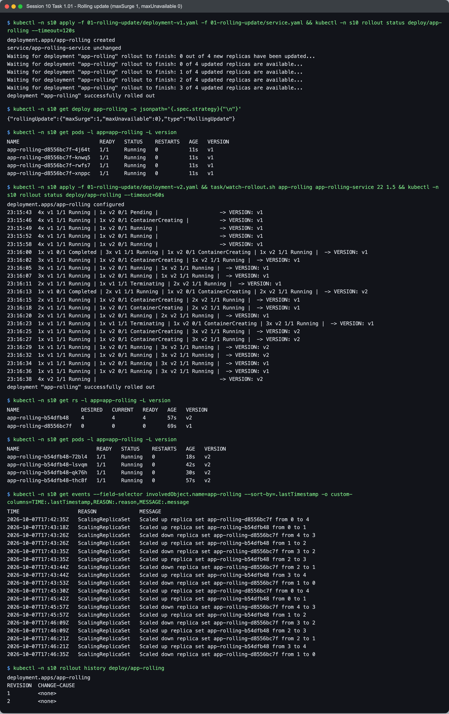

```text
$ kubectl -n s10 get deploy app-rolling -o jsonpath='{.spec.strategy}{"\n"}'
{"rollingUpdate":{"maxSurge":1,"maxUnavailable":0},"type":"RollingUpdate"}

$ kubectl -n s10 apply -f 01-rolling-update/deployment-v2.yaml && task/watch-rollout.sh app-rolling app-rolling-service 22 1.5 && kubectl -n s10 rollout status deploy/app-rolling --timeout=60s
deployment.apps/app-rolling configured
23:15:43  4x v1 1/1 Running | 1x v2 0/1 Pending |                    -> VERSION: v1
23:15:46  4x v1 1/1 Running | 1x v2 0/1 ContainerCreating |          -> VERSION: v1
23:15:49  4x v1 1/1 Running | 1x v2 0/1 Running |                    -> VERSION: v1
23:15:52  4x v1 1/1 Running | 1x v2 0/1 Running |                    -> VERSION: v1
23:15:58  4x v1 1/1 Running | 1x v2 0/1 Running |                    -> VERSION: v1
23:16:00  1x v1 0/1 Completed | 3x v1 1/1 Running | 1x v2 0/1 ContainerCreating | 1x v2 1/1 Running |  -> VERSION: v1
23:16:02  3x v1 1/1 Running | 1x v2 0/1 ContainerCreating | 1x v2 1/1 Running |  -> VERSION: v1
23:16:05  3x v1 1/1 Running | 1x v2 0/1 Running | 1x v2 1/1 Running |  -> VERSION: v1
23:16:07  3x v1 1/1 Running | 1x v2 0/1 Running | 1x v2 1/1 Running |  -> VERSION: v1
23:16:11  2x v1 1/1 Running | 1x v1 1/1 Terminating | 2x v2 1/1 Running |  -> VERSION: v1
23:16:13  1x v1 0/1 Completed | 2x v1 1/1 Running | 1x v2 0/1 ContainerCreating | 2x v2 1/1 Running |  -> VERSION: v2
23:16:15  2x v1 1/1 Running | 1x v2 0/1 ContainerCreating | 2x v2 1/1 Running |  -> VERSION: v1
23:16:18  2x v1 1/1 Running | 1x v2 0/1 ContainerCreating | 2x v2 1/1 Running |  -> VERSION: v1
23:16:20  2x v1 1/1 Running | 1x v2 0/1 Running | 2x v2 1/1 Running |  -> VERSION: v1
23:16:23  1x v1 1/1 Running | 1x v1 1/1 Terminating | 1x v2 0/1 ContainerCreating | 3x v2 1/1 Running |  -> VERSION: v1
23:16:25  1x v1 1/1 Running | 1x v2 0/1 ContainerCreating | 3x v2 1/1 Running |  -> VERSION: v2
23:16:27  1x v1 1/1 Running | 1x v2 0/1 ContainerCreating | 3x v2 1/1 Running |  -> VERSION: v2
23:16:29  1x v1 1/1 Running | 1x v2 0/1 Running | 3x v2 1/1 Running |  -> VERSION: v2
23:16:32  1x v1 1/1 Running | 1x v2 0/1 Running | 3x v2 1/1 Running |  -> VERSION: v2
23:16:34  1x v1 1/1 Running | 1x v2 0/1 Running | 3x v2 1/1 Running |  -> VERSION: v1
23:16:36  1x v1 1/1 Running | 1x v2 0/1 Running | 3x v2 1/1 Running |  -> VERSION: v1
23:16:38  4x v2 1/1 Running |                                        -> VERSION: v2
deployment "app-rolling" successfully rolled out
```

Reading it row by row:

- **The count of Ready pods never dropped below 4.** First a fifth pod (v2) was added
  (`maxSurge: 1`). It sat at `0/1 Running` for about 10 seconds — that is the readiness probe
  (`initialDelaySeconds: 3`, `periodSeconds: 5`) — and **only once it turned `1/1` was a v1
  pod removed** (`maxUnavailable: 0`). Then the next v2 pod was surged in. Four rounds.
- **Every request got an answer.** The right-hand column has no failure in 22 samples, and
  during the middle of the rollout it is a mix of `v1` and `v2` — both versions were serving
  at the same time behind one Service. That is the cost of a rolling update: for about a
  minute, users can hit either version, so v1 and v2 must be compatible with each other.
- A new v2 pod at `0/1 Running` received no traffic. "Running" is not "Ready", and only Ready
  pods are in the Service's endpoints (Task 2.7 shows the same thing in isolation).

The two ReplicaSets after the update:

```text
$ kubectl -n s10 get rs -l app=app-rolling -L version
NAME                    DESIRED   CURRENT   READY   AGE   VERSION
app-rolling-b54dfb48    4         4         4       57s   v2
app-rolling-d8556bc7f   0         0         0       69s   v1

$ kubectl -n s10 get pods -l app=app-rolling -L version
NAME                         READY   STATUS    RESTARTS   AGE   VERSION
app-rolling-b54dfb48-72bl4   1/1     Running   0          18s   v2
app-rolling-b54dfb48-lsvqm   1/1     Running   0          42s   v2
app-rolling-b54dfb48-qk76h   1/1     Running   0          30s   v2
app-rolling-b54dfb48-thc8f   1/1     Running   0          57s   v2
```

The **pod ages are staggered** (57s, 42s, 30s, 18s) — they were created one at a time. The old
ReplicaSet is kept at 0, which is what `kubectl rollout undo` would scale back up. The
Deployment's events show the alternation exactly, one up and one down per step:

```text
2026-10-07T17:45:30Z   ScalingReplicaSet   Scaled up replica set app-rolling-d8556bc7f from 0 to 4
2026-10-07T17:45:42Z   ScalingReplicaSet   Scaled up replica set app-rolling-b54dfb48 from 0 to 1
2026-10-07T17:45:57Z   ScalingReplicaSet   Scaled down replica set app-rolling-d8556bc7f from 4 to 3
2026-10-07T17:45:57Z   ScalingReplicaSet   Scaled up replica set app-rolling-b54dfb48 from 1 to 2
2026-10-07T17:46:09Z   ScalingReplicaSet   Scaled down replica set app-rolling-d8556bc7f from 3 to 2
2026-10-07T17:46:09Z   ScalingReplicaSet   Scaled up replica set app-rolling-b54dfb48 from 2 to 3
2026-10-07T17:46:21Z   ScalingReplicaSet   Scaled down replica set app-rolling-d8556bc7f from 2 to 1
2026-10-07T17:46:21Z   ScalingReplicaSet   Scaled up replica set app-rolling-b54dfb48 from 3 to 4
2026-10-07T17:46:35Z   ScalingReplicaSet   Scaled down replica set app-rolling-d8556bc7f from 1 to 0
```

The screenshot's events list is longer: its first nine lines (17:42–17:43) are from my
first attempt, whose sampler stopped before the rollout finished, so I deleted the
Deployment and ran it again. **Events outlive the object they describe** — they are keyed by
name, so the re-created `app-rolling` inherited the old ones. Also worth noticing: both runs
produced the **same ReplicaSet names** (`d8556bc7f`, `b54dfb48`), because the suffix is a hash
of the pod template, not a random ID.

The `Completed` v1 pods in the sampler are nginx exiting cleanly (exit code 0) on its stop
signal, a moment before the pod object is removed.

---

### 1.2 Blue-green

[`../02-blue-green/`](../02-blue-green/): two **separate** Deployments, `app-blue`
(`slot: blue`, v1) and `app-green` (`slot: green`, v2), and one Service `myapp-service`
whose selector picks a slot. `service-blue.yaml` and `service-green.yaml` are the same
Service with only the selector changed.

```bash
kubectl -n s10 apply -f 02-blue-green/deployment-blue.yaml -f 02-blue-green/service-blue.yaml
kubectl -n s10 apply -f 02-blue-green/deployment-green.yaml
kubectl -n s10 apply -f 02-blue-green/service-green.yaml        # the switch
```

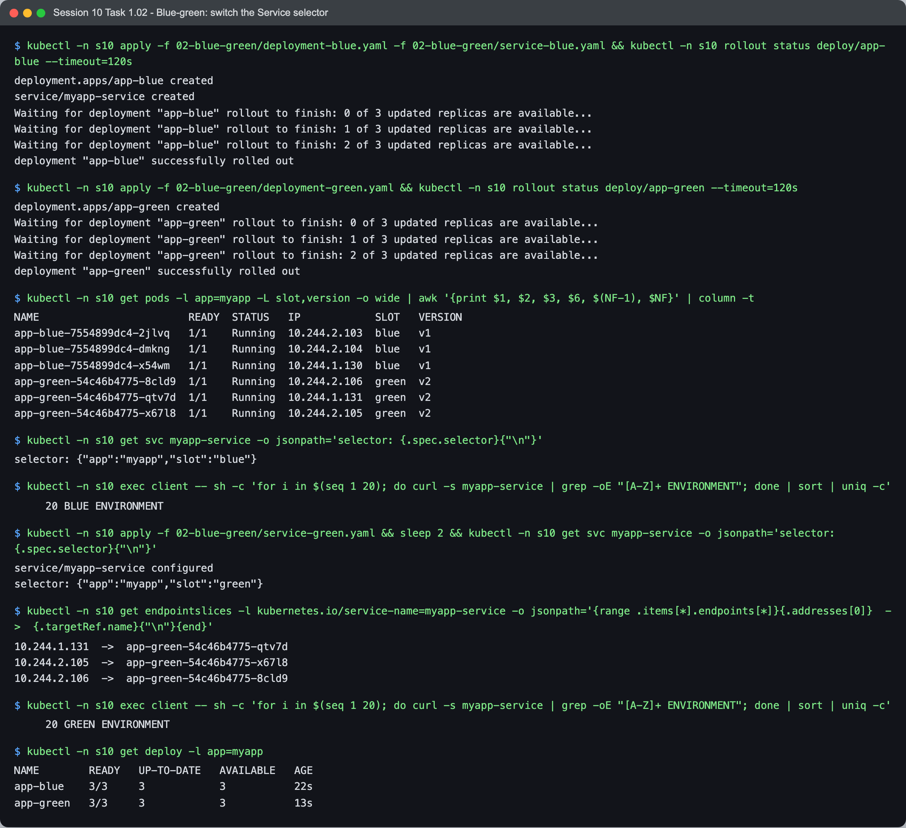

Both versions running at full size, side by side:

```text
NAME                        READY  STATUS   IP            SLOT   VERSION
app-blue-7554899dc4-2jlvq   1/1    Running  10.244.2.103  blue   v1
app-blue-7554899dc4-dmkng   1/1    Running  10.244.2.104  blue   v1
app-blue-7554899dc4-x54wm   1/1    Running  10.244.1.130  blue   v1
app-green-54c46b4775-8cld9  1/1    Running  10.244.2.106  green  v2
app-green-54c46b4775-qtv7d  1/1    Running  10.244.1.131  green  v2
app-green-54c46b4775-x67l8  1/1    Running  10.244.2.105  green  v2
```

Before the switch — green is up and ready, but gets nothing:

```text
$ kubectl -n s10 get svc myapp-service -o jsonpath='selector: {.spec.selector}{"\n"}'
selector: {"app":"myapp","slot":"blue"}

$ kubectl -n s10 exec client -- sh -c 'for i in $(seq 1 20); do curl -s myapp-service | grep -oE "[A-Z]+ ENVIRONMENT"; done | sort | uniq -c'
     20 BLUE ENVIRONMENT
```

The switch, and verifying the active version:

```text
$ kubectl -n s10 apply -f 02-blue-green/service-green.yaml && sleep 2 && kubectl -n s10 get svc myapp-service -o jsonpath='selector: {.spec.selector}{"\n"}'
service/myapp-service configured
selector: {"app":"myapp","slot":"green"}

$ kubectl -n s10 get endpointslices -l kubernetes.io/service-name=myapp-service -o jsonpath='...'
10.244.1.131  ->  app-green-54c46b4775-qtv7d
10.244.2.105  ->  app-green-54c46b4775-x67l8
10.244.2.106  ->  app-green-54c46b4775-8cld9

$ kubectl -n s10 exec client -- sh -c 'for i in $(seq 1 20); do curl -s myapp-service | grep -oE "[A-Z]+ ENVIRONMENT"; done | sort | uniq -c'
     20 GREEN ENVIRONMENT

$ kubectl -n s10 get deploy -l app=myapp
NAME        READY   UP-TO-DATE   AVAILABLE   AGE
app-blue    3/3     3            3           22s
app-green   3/3     3            3           13s
```

**20 of 20 blue, then 20 of 20 green — never a mix.** Compare with the rolling update, where
v1 and v2 answered alternately for a minute. The switch is a one-field change to the
Service's selector; two seconds later the EndpointSlice lists exactly the three green pod IPs
(compare them with the pod table above).

No pod was created or deleted by the switch, and **blue is still running at 3/3**. That is
the point of blue-green: rolling back is re-applying `service-blue.yaml`, which is as fast as
the switch itself, because the old version never went away. The price is paying for two
full copies of the application during the release.

---

### 1.3 Canary

[`../03-canary/`](../03-canary/): `app-stable` (9 replicas, v1) and `app-canary` (1 replica,
v2). Both pod templates carry `app: myapp-canary`; the Service selects **only** that shared
label, so it does not know or care which track a pod is on.

```bash
kubectl -n s10 apply -f 03-canary/deployment-stable.yaml -f 03-canary/service.yaml
kubectl -n s10 apply -f 03-canary/deployment-canary.yaml
```

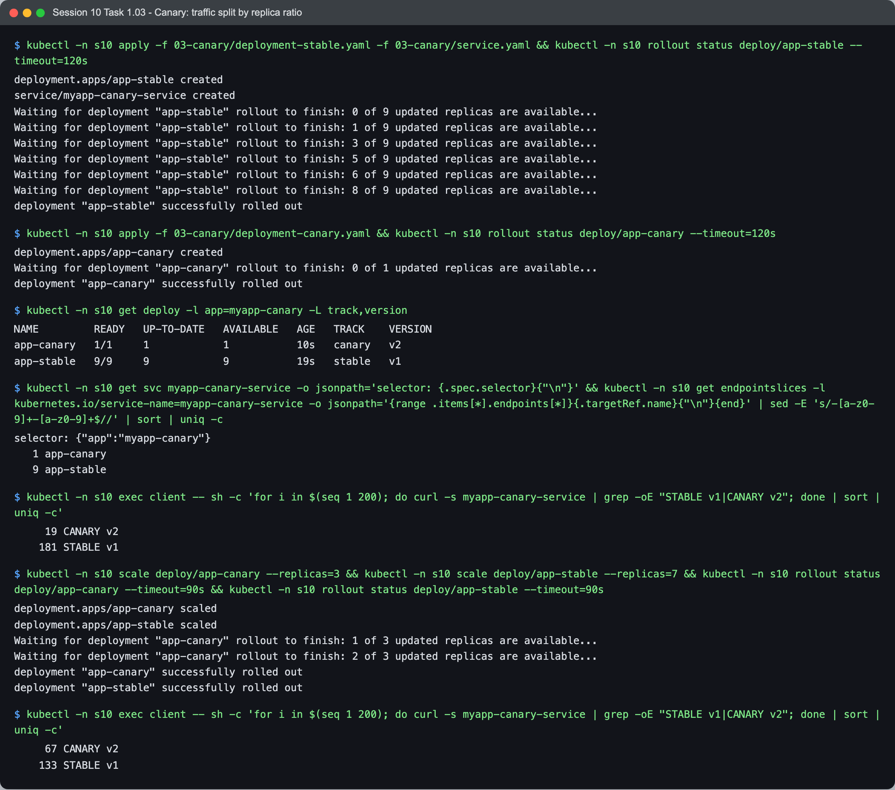

```text
$ kubectl -n s10 get deploy -l app=myapp-canary -L track,version
NAME         READY   UP-TO-DATE   AVAILABLE   AGE   TRACK    VERSION
app-canary   1/1     1            1           10s   canary   v2
app-stable   9/9     9            9           19s   stable   v1

$ kubectl -n s10 get svc myapp-canary-service -o jsonpath='selector: {.spec.selector}{"\n"}' && kubectl -n s10 get endpointslices ... | sort | uniq -c
selector: {"app":"myapp-canary"}
   1 app-canary
   9 app-stable

$ kubectl -n s10 exec client -- sh -c 'for i in $(seq 1 200); do curl -s myapp-canary-service | grep -oE "STABLE v1|CANARY v2"; done | sort | uniq -c'
     19 CANARY v2
    181 STABLE v1
```

**How the traffic is split:** there is no weight anywhere in these manifests. The Service has
10 endpoints, 1 of which is a canary pod, and kube-proxy picks an endpoint at random per
connection — so the canary gets roughly 1 in 10. I measured **19 of 200 = 9.5%**, against
an expected 10%.

To widen the canary I changed the ratio, keeping 10 pods total:

```text
$ kubectl -n s10 scale deploy/app-canary --replicas=3 && kubectl -n s10 scale deploy/app-stable --replicas=7 && ...
deployment.apps/app-canary scaled
deployment.apps/app-stable scaled
...
deployment "app-canary" successfully rolled out
deployment "app-stable" successfully rolled out

$ kubectl -n s10 exec client -- sh -c 'for i in $(seq 1 200); do curl -s myapp-canary-service | grep -oE "STABLE v1|CANARY v2"; done | sort | uniq -c'
     67 CANARY v2
    133 STABLE v1
```

3 of 10 pods, **67 of 200 = 33.5%** (expected 30%). Both versions answered in both rounds,
which is what "verify both versions" asks for.

This also shows the limits of a replica-ratio canary: the percentage is only as fine as the
pod count (5% would need 20 pods), the split is statistical rather than exact, and I cannot
say "send *these* users to the canary". Doing that needs a layer that understands requests —
ingress-nginx's canary annotations or a service mesh — rather than a Service, which only
balances connections.

---

### 1.4 Recreate

[`../04-recreate/`](../04-recreate/): `strategy: type: Recreate`, 3 replicas, v1 then v2. No
readiness probe in these manifests.

```bash
kubectl -n s10 apply -f 04-recreate/deployment-v1.yaml -f 04-recreate/service.yaml
kubectl -n s10 apply -f 04-recreate/deployment-v2.yaml
task/watch-rollout.sh app-recreate app-recreate-service 14 0.3
```

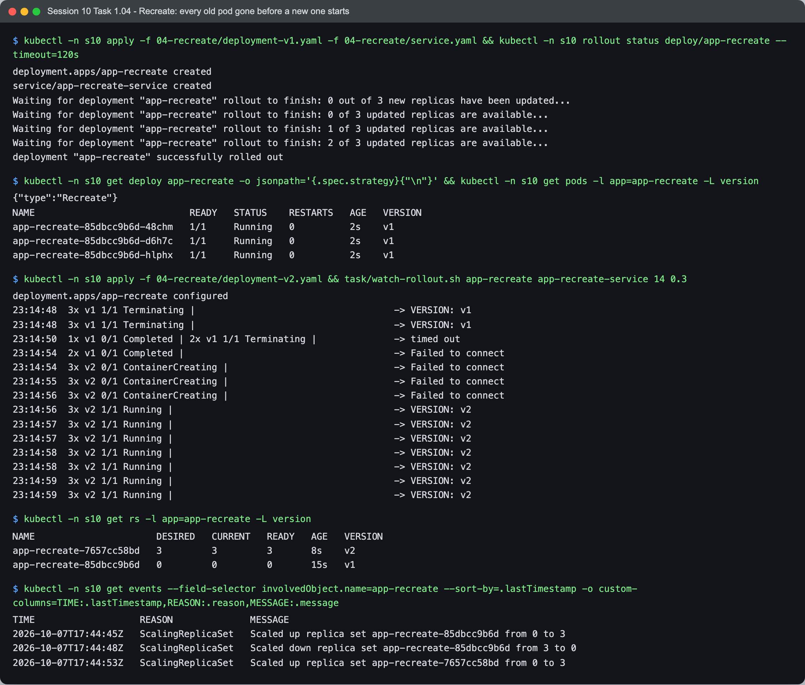

```text
$ kubectl -n s10 get deploy app-recreate -o jsonpath='{.spec.strategy}{"\n"}' && kubectl -n s10 get pods -l app=app-recreate -L version
{"type":"Recreate"}
NAME                            READY   STATUS    RESTARTS   AGE   VERSION
app-recreate-85dbcc9b6d-48chm   1/1     Running   0          2s    v1
app-recreate-85dbcc9b6d-d6h7c   1/1     Running   0          2s    v1
app-recreate-85dbcc9b6d-hlphx   1/1     Running   0          2s    v1

$ kubectl -n s10 apply -f 04-recreate/deployment-v2.yaml && task/watch-rollout.sh app-recreate app-recreate-service 14 0.3
deployment.apps/app-recreate configured
23:14:48  3x v1 1/1 Terminating |                                    -> VERSION: v1
23:14:48  3x v1 1/1 Terminating |                                    -> VERSION: v1
23:14:50  1x v1 0/1 Completed | 2x v1 1/1 Terminating |              -> timed out
23:14:54  2x v1 0/1 Completed |                                      -> Failed to connect
23:14:54  3x v2 0/1 ContainerCreating |                              -> Failed to connect
23:14:55  3x v2 0/1 ContainerCreating |                              -> Failed to connect
23:14:56  3x v2 0/1 ContainerCreating |                              -> Failed to connect
23:14:56  3x v2 1/1 Running |                                        -> VERSION: v2
23:14:57  3x v2 1/1 Running |                                        -> VERSION: v2
...
23:14:59  3x v2 1/1 Running |                                        -> VERSION: v2

$ kubectl -n s10 get events --field-selector involvedObject.name=app-recreate --sort-by=.lastTimestamp -o custom-columns=...
TIME                   REASON              MESSAGE
2026-10-07T17:44:45Z   ScalingReplicaSet   Scaled up replica set app-recreate-85dbcc9b6d from 0 to 3
2026-10-07T17:44:48Z   ScalingReplicaSet   Scaled down replica set app-recreate-85dbcc9b6d from 3 to 0
2026-10-07T17:44:53Z   ScalingReplicaSet   Scaled up replica set app-recreate-7657cc58bd from 0 to 3
```

This is the opposite of 1.1:

- **All three v1 pods went to `Terminating` at once** (23:14:48), not one at a time. The
  event says it plainly: `from 3 to 0` in a single step.
- **No v2 pod existed until the v1 pods had finished.** The sampler never shows v1 and v2 in
  the same line. The v2 ReplicaSet was scaled up at 17:44:53Z — five seconds after the
  scale-down — and at 23:14:54 the only pods left were two v1 pods in `Completed`
  (terminated, not running).
- **That gap was real downtime.** From 23:14:50 to 23:14:56 there was **no running pod
  behind the Service**, and every request failed: `timed out`, then `Failed to connect`
  (with no endpoints, the ClusterIP rejects the connection). The rolling update in 1.1 had
  zero failures over the same kind of change.
- In exchange, **v1 and v2 never served at the same time**. That is the reason to choose
  Recreate: when two versions cannot coexist — a schema migration the old code cannot read,
  or a `ReadWriteOnce` volume that only one pod can mount.

The outage was short here (about 6 seconds) only because nginx stops and starts quickly.
With a slow-starting application, the downtime is the whole shutdown time plus the whole
startup time.

### Strategies compared — from my own output

| Strategy | Both versions serving at once? | Failed requests seen | Extra capacity needed | Rollback |
|---|---|---|---|---|
| Rolling update | yes, for ~55 s | 0 of 22 | +1 pod (`maxSurge`) | `rollout undo` — scale the old RS back up |
| Blue-green | no — 20/20 blue, then 20/20 green | 0 | a full second copy | re-apply the blue Service |
| Canary | yes, deliberately — 9.5%, then 33.5% | 0 | the canary pods | scale canary to 0 |
| Recreate | no | 5 of 14 (about 6 s) | none | another full recreate |

---

## Task 2 — Pod lifecycle

For every file in [`../pod-lifecycle/`](../pod-lifecycle/) I ran `kubectl -n s10 apply -f`,
sampled `kubectl get pod` with timestamps (status), then `kubectl describe pod` (details).
Describe is long, so I filtered it to the parts that matter for the lifecycle — the pod
`Status:`, each container's `State` / `Last State` / `Ready` / `Restart Count`, the
`Conditions` where relevant, and `Events`:

```bash
kubectl -n s10 describe pod <pod> | sed -n '/^Status:/p;/^    State:/,/Restart Count/p;/^Events:/,$p'
```

One distinction runs through all twelve: **the pod phase is one of only five values**
(`Pending`, `Running`, `Succeeded`, `Failed`, `Unknown`). What `kubectl get` shows in STATUS —
`Completed`, `Error`, `CrashLoopBackOff`, `ImagePullBackOff`, `Init:0/1` — is usually a
*container* state reason, not the phase. I printed `.status.phase` next to it where they differ.

### 2.1 `01-running.yaml` — Running

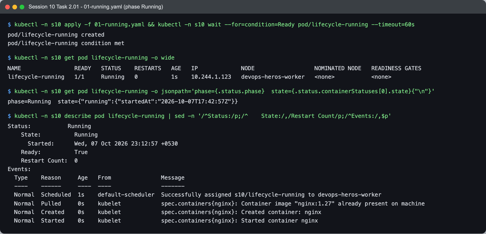

```text
$ kubectl -n s10 get pod lifecycle-running -o wide
NAME                READY   STATUS    RESTARTS   AGE   IP             NODE                  NOMINATED NODE   READINESS GATES
lifecycle-running   1/1     Running   0          1s    10.244.1.123   devops-heros-worker   <none>           <none>

$ kubectl -n s10 get pod lifecycle-running -o jsonpath='phase={.status.phase}  state={.status.containerStatuses[0].state}{"\n"}'
phase=Running  state={"running":{"startedAt":"2026-10-07T17:42:57Z"}}
```

The baseline. Events show the normal sequence — `Scheduled` (the scheduler picked
`devops-heros-worker`), `Pulled` ("already present on machine"), `Created`, `Started` — and
phase `Running`, container state `running`, `Ready: True`. It was ready within a second
because `nginx:1.27` was already cached on the node and there is no probe to wait for.

### 2.2 `02-pending.yaml` — Pending (cannot be scheduled)

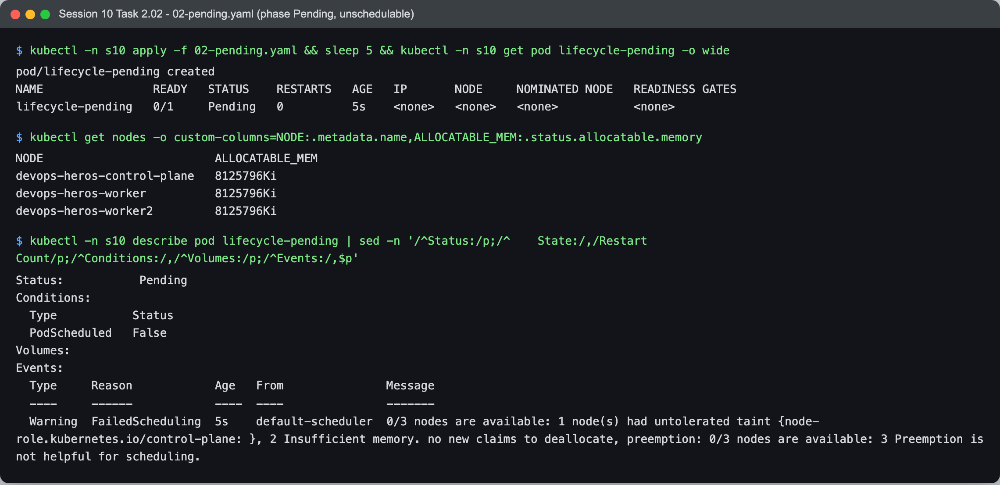

```text
NAME                READY   STATUS    RESTARTS   AGE   IP       NODE     NOMINATED NODE   READINESS GATES
lifecycle-pending   0/1     Pending   0          5s    <none>   <none>   <none>           <none>

$ kubectl get nodes -o custom-columns=NODE:.metadata.name,ALLOCATABLE_MEM:.status.allocatable.memory
NODE                         ALLOCATABLE_MEM
devops-heros-control-plane   8125796Ki
devops-heros-worker          8125796Ki
devops-heros-worker2         8125796Ki

Status:           Pending
Conditions:
  Type           Status
  PodScheduled   False
Events:
  Warning  FailedScheduling  5s    default-scheduler  0/3 nodes are available: 1 node(s) had untolerated taint {node-role.kubernetes.io/control-plane: }, 2 Insufficient memory. no new claims to deallocate, preemption: 0/3 nodes are available: 3 Preemption is not helpful for scheduling.
```

`NODE <none>` and `PodScheduled False`: the pod was never placed, so no container exists —
which is why describe shows **no `State:` block at all**. It requests `memory: 9Gi`; each
node has 8125796Ki ≈ 7.75Gi allocatable, so no node can ever fit it. The scheduler's message
accounts for all three nodes separately: the two workers are `Insufficient memory`, and the
control plane was ruled out earlier by its taint (the same taint as in the DaemonSet section
below). "Preemption is not helpful" means even evicting other pods would not free 9Gi on one
node. It will stay Pending forever; waiting does not fix it — lowering the request or adding a
bigger node does.

### 2.3 `03-succeeded.yaml` — Succeeded

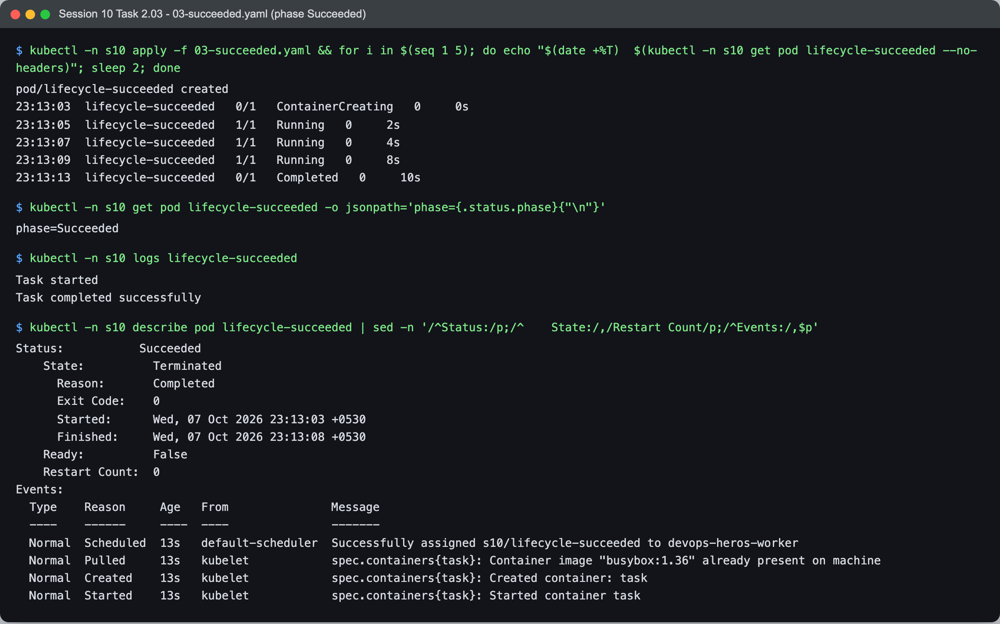

```text
23:13:03  lifecycle-succeeded   0/1   ContainerCreating   0     0s
23:13:05  lifecycle-succeeded   1/1   Running   0     2s
23:13:07  lifecycle-succeeded   1/1   Running   0     4s
23:13:09  lifecycle-succeeded   1/1   Running   0     8s
23:13:13  lifecycle-succeeded   0/1   Completed   0     10s

$ kubectl -n s10 get pod lifecycle-succeeded -o jsonpath='phase={.status.phase}{"\n"}'
phase=Succeeded

$ kubectl -n s10 logs lifecycle-succeeded
Task started
Task completed successfully

    State:          Terminated
      Reason:       Completed
      Exit Code:    0
      Started:      Wed, 07 Oct 2026 23:13:03 +0530
      Finished:     Wed, 07 Oct 2026 23:13:08 +0530
```

Ran for exactly the 5 seconds of its `sleep 5` (Started 23:13:03, Finished 23:13:08), exited
0, and with `restartPolicy: Never` nothing restarted it. STATUS says `Completed`; the phase is
`Succeeded`. The pod object stays after it finishes, which is why the logs are still
readable — this is the shape of a Job's pod.

### 2.4 `04-failed.yaml` — Failed

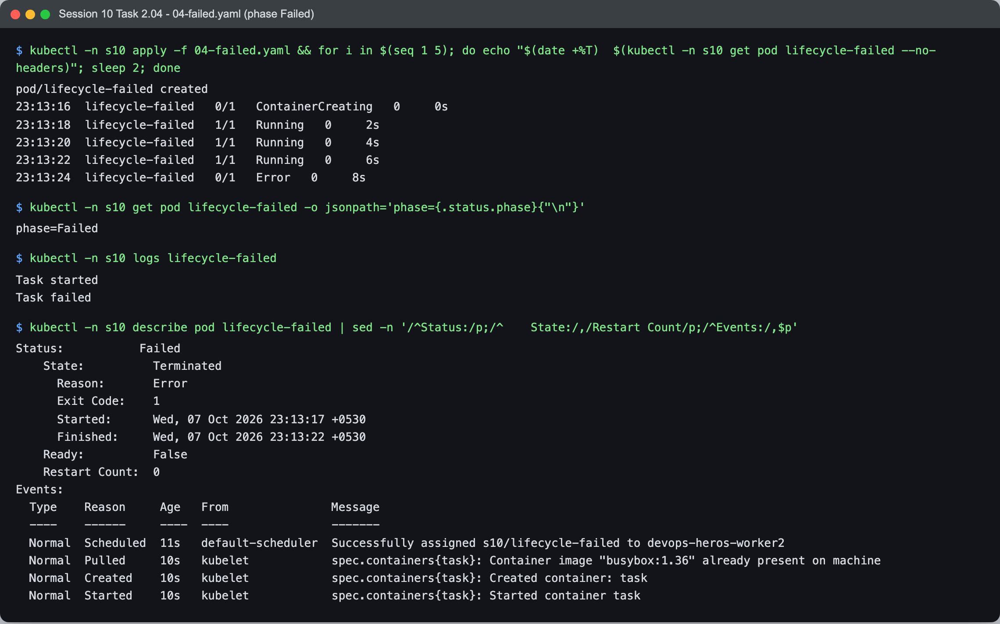

```text
23:13:16  lifecycle-failed   0/1   ContainerCreating   0     0s
23:13:18  lifecycle-failed   1/1   Running   0     2s
23:13:20  lifecycle-failed   1/1   Running   0     4s
23:13:22  lifecycle-failed   1/1   Running   0     6s
23:13:24  lifecycle-failed   0/1   Error   0     8s

$ kubectl -n s10 get pod lifecycle-failed -o jsonpath='phase={.status.phase}{"\n"}'
phase=Failed

    State:          Terminated
      Reason:       Error
      Exit Code:    1
    Restart Count:  0
```

Identical to 2.3 except `exit 1`. That single difference turns the phase into `Failed` and
STATUS into `Error`. `Restart Count: 0` because `restartPolicy: Never`. Kubernetes only
judges success by the exit code — the log line `Task failed` means nothing to it.

### 2.5 `05-crashloopbackoff.yaml` — CrashLoopBackOff

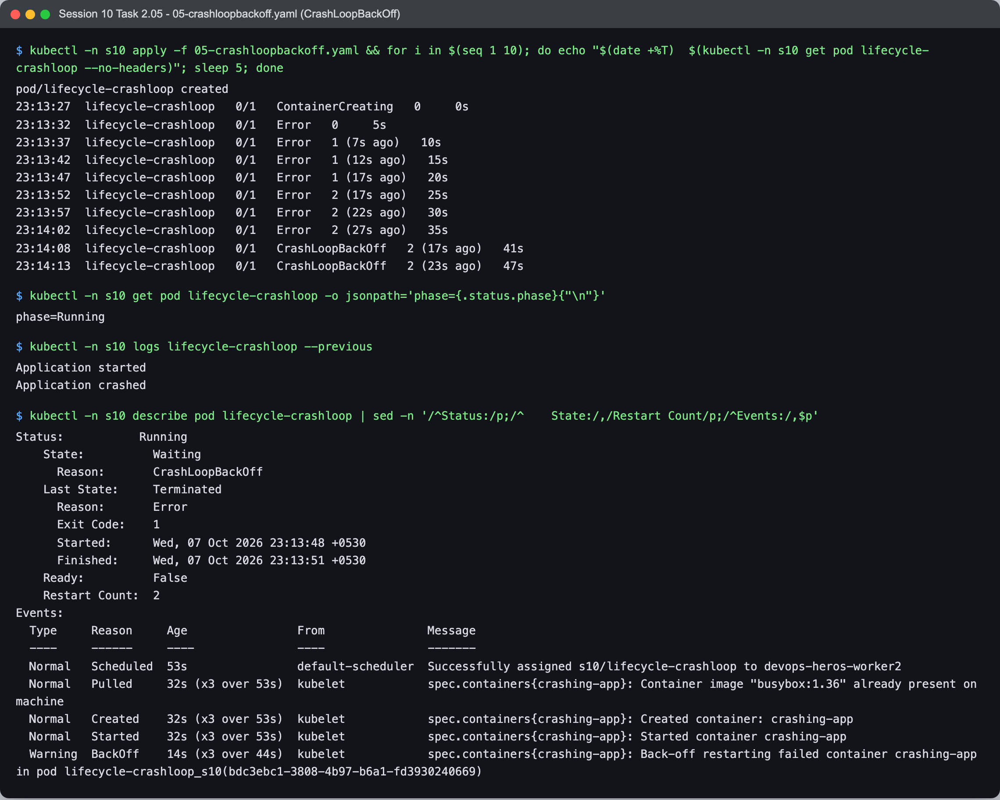

```text
23:13:27  lifecycle-crashloop   0/1   ContainerCreating   0     0s
23:13:32  lifecycle-crashloop   0/1   Error   0     5s
23:13:37  lifecycle-crashloop   0/1   Error   1 (7s ago)   10s
23:13:42  lifecycle-crashloop   0/1   Error   1 (12s ago)   15s
23:13:47  lifecycle-crashloop   0/1   Error   1 (17s ago)   20s
23:13:52  lifecycle-crashloop   0/1   Error   2 (17s ago)   25s
23:13:57  lifecycle-crashloop   0/1   Error   2 (22s ago)   30s
23:14:02  lifecycle-crashloop   0/1   Error   2 (27s ago)   35s
23:14:08  lifecycle-crashloop   0/1   CrashLoopBackOff   2 (17s ago)   41s
23:14:13  lifecycle-crashloop   0/1   CrashLoopBackOff   2 (23s ago)   47s

$ kubectl -n s10 get pod lifecycle-crashloop -o jsonpath='phase={.status.phase}{"\n"}'
phase=Running

$ kubectl -n s10 logs lifecycle-crashloop --previous
Application started
Application crashed

    State:          Waiting
      Reason:       CrashLoopBackOff
    Last State:     Terminated
      Reason:       Error
      Exit Code:    1
    Restart Count:  2
  Warning  BackOff    14s (x3 over 44s)  kubelet            spec.containers{crashing-app}: Back-off restarting failed container crashing-app in pod lifecycle-crashloop_s10(...)
```

The same `exit 1` as 2.4, but with the default `restartPolicy: Always`, so the kubelet keeps
restarting it — and waits **longer each time** (the back-off doubles from 10s up to a
5-minute cap). That waiting period is what `CrashLoopBackOff` means: it is not a crash
reason, it is the kubelet holding off.

Two things surprised me. First, **the phase is `Running`**, even though the container is
never up for more than 3 seconds — the phase never becomes `Failed` when the policy is to
restart. Second, plain `kubectl logs` would show the current, empty attempt; **`--previous`**
is what shows the crashed run's output. `Last State: Terminated, Exit Code: 1` is where the
real reason lives.

### 2.6 `06-imagepullbackoff.yaml` — ErrImagePull / ImagePullBackOff

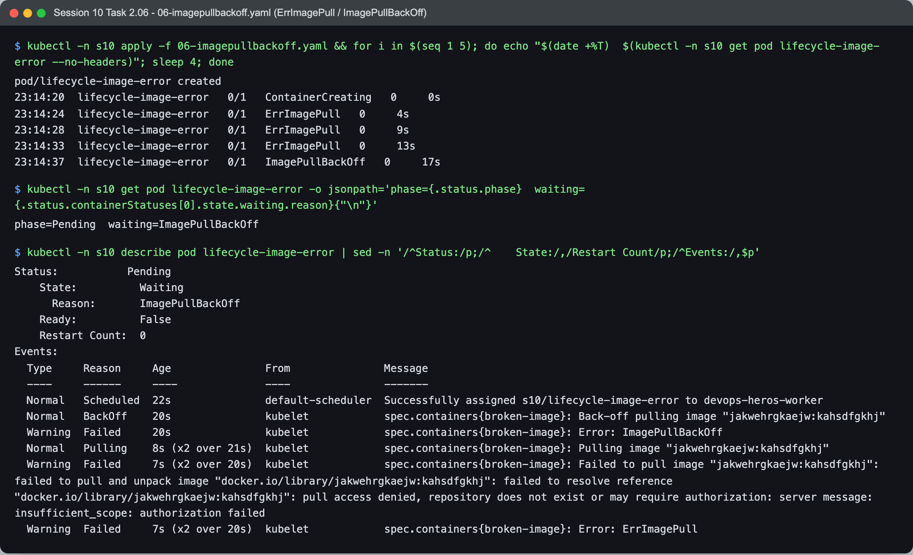

```text
23:14:20  lifecycle-image-error   0/1   ContainerCreating   0     0s
23:14:24  lifecycle-image-error   0/1   ErrImagePull   0     4s
23:14:28  lifecycle-image-error   0/1   ErrImagePull   0     9s
23:14:33  lifecycle-image-error   0/1   ErrImagePull   0     13s
23:14:37  lifecycle-image-error   0/1   ImagePullBackOff   0     17s

$ kubectl -n s10 get pod lifecycle-image-error -o jsonpath='phase={.status.phase}  waiting={.status.containerStatuses[0].state.waiting.reason}{"\n"}'
phase=Pending  waiting=ImagePullBackOff

  Warning  Failed     7s (x2 over 20s)  kubelet            spec.containers{broken-image}: Failed to pull image "jakwehrgkaejw:kahsdfgkhj": failed to pull and unpack image "docker.io/library/jakwehrgkaejw:kahsdfgkhj": failed to resolve reference "docker.io/library/jakwehrgkaejw:kahsdfgkhj": pull access denied, repository does not exist or may require authorization: server message: insufficient_scope: authorization failed
```

`ErrImagePull` is a single failed attempt; `ImagePullBackOff` is the kubelet waiting before
the next one — the same back-off idea as 2.5, applied to pulling. **The phase is `Pending`**,
not Failed: the pod *was* scheduled (`Scheduled` event, a node assigned) but no container has
ever been created. The event shows how a short name expands — `jakwehrgkaejw` became
`docker.io/library/jakwehrgkaejw` — and Docker Hub's answer is "does not exist *or* may require
authorization": the registry does not say which, so a typo and a missing pull secret look
the same from here. `RESTARTS 0`, because there was never a container to restart.

### 2.7 `07-readiness.yaml` — Running but not Ready

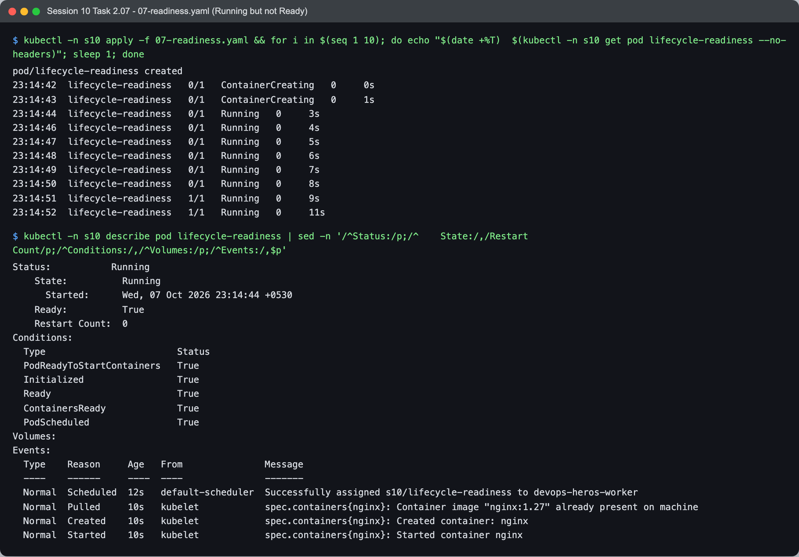

```text
23:14:42  lifecycle-readiness   0/1   ContainerCreating   0     0s
23:14:43  lifecycle-readiness   0/1   ContainerCreating   0     1s
23:14:44  lifecycle-readiness   0/1   Running   0     3s
23:14:46  lifecycle-readiness   0/1   Running   0     4s
23:14:47  lifecycle-readiness   0/1   Running   0     5s
23:14:48  lifecycle-readiness   0/1   Running   0     6s
23:14:49  lifecycle-readiness   0/1   Running   0     7s
23:14:50  lifecycle-readiness   0/1   Running   0     8s
23:14:51  lifecycle-readiness   1/1   Running   0     9s
23:14:52  lifecycle-readiness   1/1   Running   0     11s

Conditions:
  Type                        Status
  PodReadyToStartContainers   True
  Initialized                 True
  Ready                       True
  ContainersReady             True
  PodScheduled                True
```

**`Running` and `0/1` at the same time for about 7 seconds.** nginx started at 23:14:44 and
was serving immediately, but the readiness probe has `initialDelaySeconds: 5`, so the first
check — and therefore `Ready` — came only after that. Until then the pod would not be in any
Service's endpoints. This is exactly the `0/1 Running` stretch for every new v2 pod in the
rolling update (1.1), and it is what made `maxUnavailable: 0` safe there.

`Conditions` lists the gates a pod passes in order: scheduled, sandbox ready, init done,
containers ready, pod ready. In 2.2 the pod stopped at the first one.

### 2.8 `08-liveness.yaml` — liveness probe restarts the container

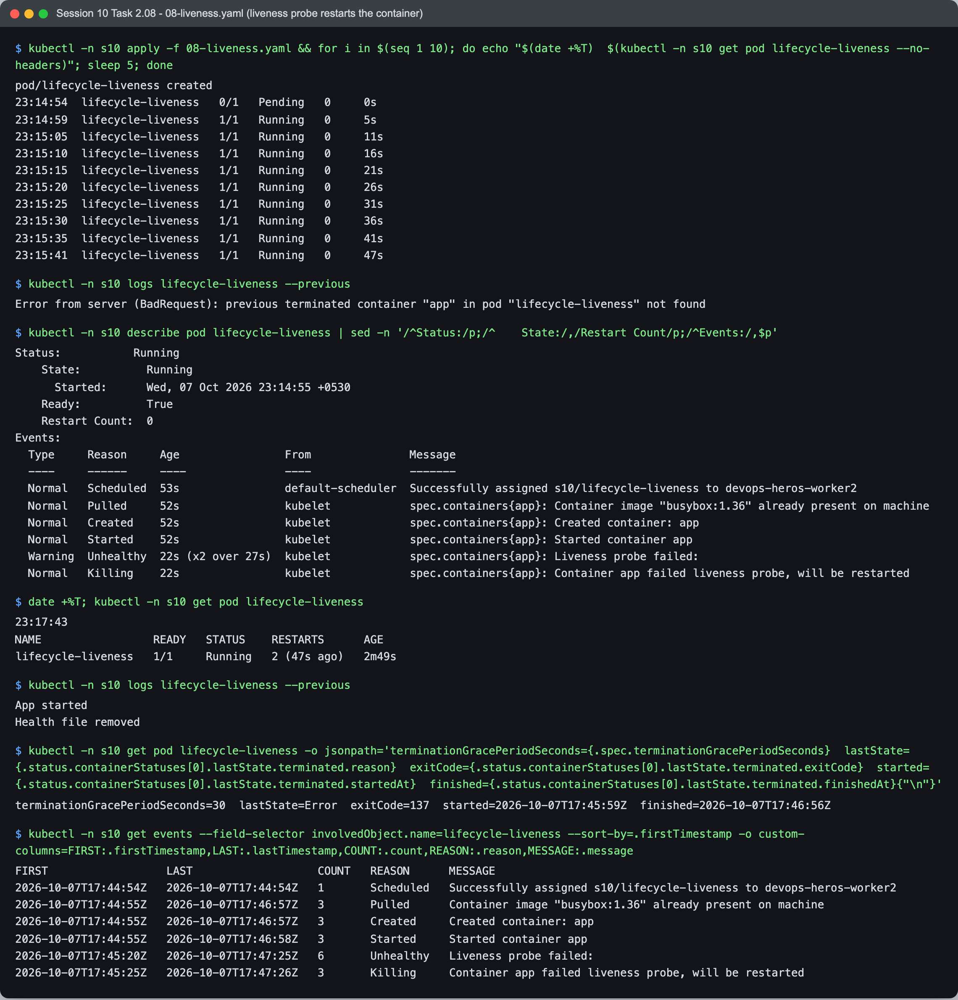

The app creates `/tmp/healthy`, deletes it after 20 seconds, and the liveness probe
(`test -f /tmp/healthy`, every 5s, `failureThreshold: 2`) should then restart it. My
first 50-second sample did **not** show a restart:

```text
23:14:54  lifecycle-liveness   0/1   Pending   0     0s
23:14:59  lifecycle-liveness   1/1   Running   0     5s
...
23:15:35  lifecycle-liveness   1/1   Running   0     41s
23:15:41  lifecycle-liveness   1/1   Running   0     47s

$ kubectl -n s10 logs lifecycle-liveness --previous
Error from server (BadRequest): previous terminated container "app" in pod "lifecycle-liveness" not found

  Warning  Unhealthy  22s (x2 over 27s)  kubelet            spec.containers{app}: Liveness probe failed:
  Normal   Killing    22s                kubelet            spec.containers{app}: Container app failed liveness probe, will be restarted
```

The probe *had* failed twice and the kubelet had decided to kill the container, yet RESTARTS
was 0 and there was no previous container. I checked the same pod again two minutes later:

```text
$ date +%T; kubectl -n s10 get pod lifecycle-liveness
23:17:43
NAME                 READY   STATUS    RESTARTS      AGE
lifecycle-liveness   1/1     Running   2 (47s ago)   2m49s

$ kubectl -n s10 logs lifecycle-liveness --previous
App started
Health file removed

$ kubectl -n s10 get pod lifecycle-liveness -o jsonpath='terminationGracePeriodSeconds=... lastState=... exitCode=... started=... finished=...'
terminationGracePeriodSeconds=30  lastState=Error  exitCode=137  started=2026-10-07T17:45:59Z  finished=2026-10-07T17:46:56Z

FIRST                  LAST                   COUNT   REASON      MESSAGE
2026-10-07T17:45:20Z   2026-10-07T17:47:25Z   6       Unhealthy   Liveness probe failed:
2026-10-07T17:45:25Z   2026-10-07T17:47:26Z   3       Killing     Container app failed liveness probe, will be restarted
```

So the restart works — it is just **slow**, and the reason is in the numbers:

- **Exit code 137 = 128 + 9: the container was killed by `SIGKILL`, not stopped by `SIGTERM`.**
  The container's PID 1 is `sh -c "..."` with no signal handler, and a PID 1 without a
  handler ignores SIGTERM. So the kubelet sent SIGTERM, nothing happened, and it waited the
  full `terminationGracePeriodSeconds=30` before sending SIGKILL.
- That accounts for the timeline: the previous run started at 17:45:59Z, the health file
  went at +20s, two failed probes, `Killing` at about 17:46:25, and the container actually
  died at **17:46:56Z** — 30 seconds later. Each cycle takes roughly 20s healthy + ~5–10s of
  failing probes + 30s of grace ≈ a minute, which is why RESTARTS reached only 2 in almost
  3 minutes.
- During those 30 seconds the pod still showed `1/1 Running`. A liveness probe has no effect
  on readiness — this pod has no readiness probe — so a container that is already "dead" by
  its own health check could still be receiving traffic until it is killed.

`logs --previous` then shows `Health file removed` as the last line of the killed run. Unlike
2.5, the app did not crash — it was healthy as far as the process was concerned, and
Kubernetes killed it from the outside. 2.12 is the same SIGTERM mechanism done properly.

### 2.9 `09-startup.yaml` — startup probe gives a slow app time

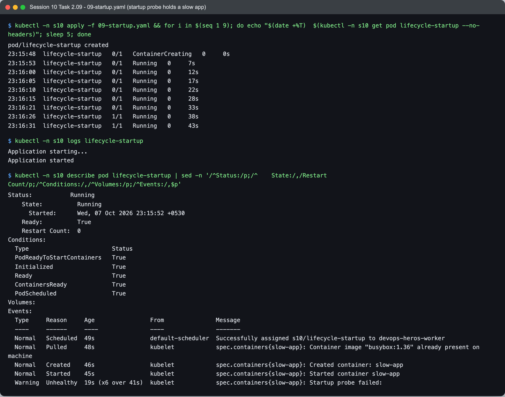

```text
23:15:48  lifecycle-startup   0/1   ContainerCreating   0     0s
23:15:53  lifecycle-startup   0/1   Running   0     7s
23:16:00  lifecycle-startup   0/1   Running   0     12s
23:16:05  lifecycle-startup   0/1   Running   0     17s
23:16:10  lifecycle-startup   0/1   Running   0     22s
23:16:15  lifecycle-startup   0/1   Running   0     28s
23:16:21  lifecycle-startup   0/1   Running   0     33s
23:16:26  lifecycle-startup   1/1   Running   0     38s
23:16:31  lifecycle-startup   1/1   Running   0     43s

$ kubectl -n s10 logs lifecycle-startup
Application starting...
Application started

    Restart Count:  0
  Warning  Unhealthy  19s (x6 over 41s)  kubelet            spec.containers{slow-app}: Startup probe failed:
```

The app takes 30 seconds to create `/tmp/started`. The startup probe **failed 6 times**
(`x6`) and the container was **not** restarted (`Restart Count: 0`), because its budget is
`failureThreshold: 10 × periodSeconds: 5 = 50s`, more than the 30s the app needs. Once it
passed, the pod became `1/1`. With `failureThreshold: 5` (25s) the kubelet would have killed
it just before it finished starting, and it would loop forever.

That is the job of a startup probe: while it has not yet passed, liveness and readiness
checks are not run at all, so a slow start is not mistaken for a hang. Contrast with 2.8,
where a failing probe *did* kill the container.

### 2.10 `10-init-container.yaml` — init container runs first

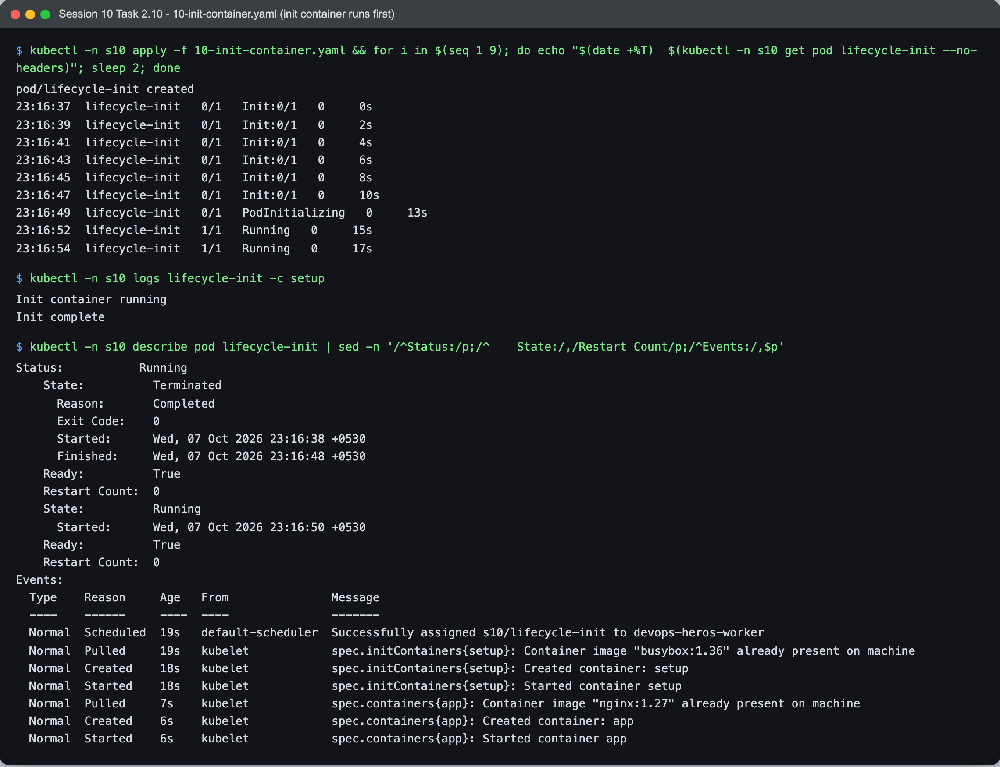

```text
23:16:37  lifecycle-init   0/1   Init:0/1   0     0s
...
23:16:47  lifecycle-init   0/1   Init:0/1   0     10s
23:16:49  lifecycle-init   0/1   PodInitializing   0     13s
23:16:52  lifecycle-init   1/1   Running   0     15s

$ kubectl -n s10 logs lifecycle-init -c setup
Init container running
Init complete

    State:          Terminated            <- init container "setup"
      Reason:       Completed
      Exit Code:    0
      Started:      Wed, 07 Oct 2026 23:16:38 +0530
      Finished:     Wed, 07 Oct 2026 23:16:48 +0530
    State:          Running               <- main container "app"
      Started:      Wed, 07 Oct 2026 23:16:50 +0530
```

(The `<-` labels are mine.) The ordering is visible three ways: STATUS `Init:0/1` (zero of
one init containers done) for 10 seconds, then `PodInitializing`, then `Running`; the init
container `Finished 23:16:48` and the app `Started 23:16:50`; and in Events, the
`spec.initContainers{setup}` lines all come before the `spec.containers{app}` lines, with the
nginx image not even "Pulled" until the init container had exited 0. Init containers are for "do this before the app may start" —
waiting for a database, running a migration, fetching config.

### 2.11 `11-multi-container.yaml` — two containers, one pod

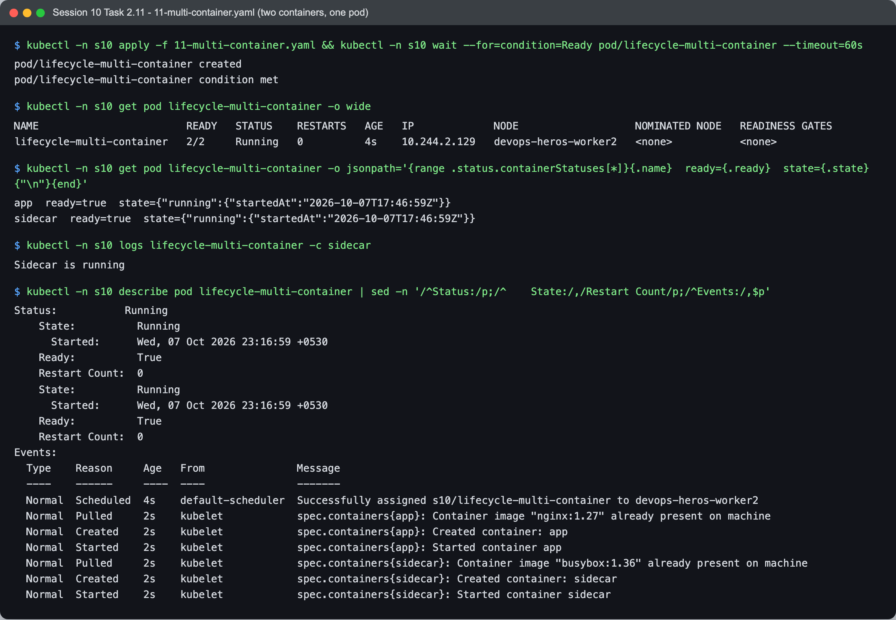

```text
NAME                        READY   STATUS    RESTARTS   AGE   IP             NODE                   NOMINATED NODE   READINESS GATES
lifecycle-multi-container   2/2     Running   0          4s    10.244.2.129   devops-heros-worker2   <none>           <none>

app  ready=true  state={"running":{"startedAt":"2026-10-07T17:46:59Z"}}
sidecar  ready=true  state={"running":{"startedAt":"2026-10-07T17:46:59Z"}}

$ kubectl -n s10 logs lifecycle-multi-container -c sidecar
Sidecar is running
```

`READY 2/2`: two containers, one pod, one IP. Unlike the init container in 2.10, these two
are **not ordered** — both started in the same second, and Events show `app` and `sidecar`
created side by side. The pod is `Ready` only when *every* container is ready, and `-c` is
required for logs because there is more than one container. (The Pod section in the core
objects work below proves the shared network namespace over `localhost`.)

### 2.12 `12-termination.yaml` — graceful shutdown

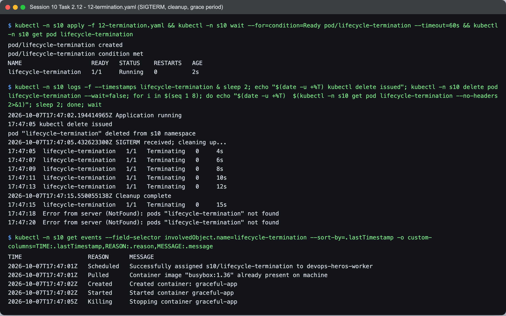

The container traps `TERM`, prints a message, sleeps 10 seconds of "cleanup" and exits 0.
`terminationGracePeriodSeconds: 20`. I followed the logs, deleted the pod, and sampled it:

```text
2026-10-07T17:47:02.194414965Z Application running
17:47:05 kubectl delete issued
pod "lifecycle-termination" deleted from s10 namespace
2026-10-07T17:47:05.432623300Z SIGTERM received; cleaning up...
17:47:05  lifecycle-termination   1/1   Terminating   0     4s
17:47:07  lifecycle-termination   1/1   Terminating   0     6s
17:47:09  lifecycle-termination   1/1   Terminating   0     8s
17:47:11  lifecycle-termination   1/1   Terminating   0     10s
17:47:13  lifecycle-termination   1/1   Terminating   0     12s
2026-10-07T17:47:15.550055138Z Cleanup complete
17:47:15  lifecycle-termination   1/1   Terminating   0     15s
17:47:18  Error from server (NotFound): pods "lifecycle-termination" not found

2026-10-07T17:47:05Z   Killing     Stopping container graceful-app
```

- `kubectl delete` returned at once, but the pod **stayed as `Terminating` for about 10
  seconds** — deletion is a request, and the pod lives until its containers have stopped.
- **SIGTERM arrived within the same second as the delete** (17:47:05.43), the cleanup ran
  for its 10 seconds, and `Cleanup complete` printed at 17:47:15.55. The process exited on
  its own, so the pod was gone by the next sample instead of waiting out the full 20s grace.
- If cleanup had taken longer than 20 seconds, the kubelet would have sent SIGKILL and the
  cleanup would have been cut off.

Put next to 2.8 this is the clearest lesson of the lab: **the same SIGTERM, two outcomes.**
With a `trap`, the container shut down cleanly in 10 seconds and exited 0. Without one
(2.8), the identical `sh` PID 1 ignored SIGTERM, and the kubelet had to wait 30 seconds and
SIGKILL it (exit 137). Every rollout in Task 1 terminates pods this way, so an app that
ignores SIGTERM makes every deployment slower and kills in-flight work.

### Lifecycle summary

| File | STATUS seen | Phase | Container state | Why |
|---|---|---|---|---|
| 01-running | `Running` 1/1 | Running | running | normal start |
| 02-pending | `Pending` | Pending | (none — never scheduled) | requests 9Gi, nodes have ~7.75Gi |
| 03-succeeded | `Completed` | Succeeded | terminated, exit 0 | finished, `restartPolicy: Never` |
| 04-failed | `Error` | Failed | terminated, exit 1 | `exit 1`, `restartPolicy: Never` |
| 05-crashloop | `Error` → `CrashLoopBackOff` | **Running** | waiting (back-off) | exit 1, `Always` → restart with back-off |
| 06-imagepull | `ErrImagePull` → `ImagePullBackOff` | **Pending** | waiting | image does not exist |
| 07-readiness | `Running` **0/1** → 1/1 | Running | running | readiness probe delay |
| 08-liveness | `Running` 1/1, RESTARTS 0 → 2 | Running | running, last: exit 137 | probe failed → SIGTERM ignored → SIGKILL after 30s |
| 09-startup | `Running` 0/1 → 1/1 | Running | running, 0 restarts | 6 failed startup probes, inside the 50s budget |
| 10-init | `Init:0/1` → `PodInitializing` → `Running` | Running (once started) | init terminated (0), app running | init must finish first |
| 11-multi | `Running` 2/2 | Running | both running | containers start in parallel |
| 12-termination | `Terminating` ~10s → gone | Running → deleted | — | SIGTERM trapped, cleanup, exit 0 |

---

## What I learned

- **The rollout strategy decides one thing: whether old and new pods overlap.** Rolling
  overlaps them (mixed `v1`/`v2` answers for ~55 s, no failures). Recreate refuses to (no
  overlap, and 5 failed requests in a ~6 s outage). Blue-green overlaps the *pods* but never
  the *traffic*. Canary overlaps both on purpose, in a ratio I control.
- **A Service does not know about versions — it only knows a label selector.** Blue-green is
  changing the selector; canary is choosing a selector loose enough to match both tracks and
  setting the split with replica counts. Same object, two completely different strategies.
- **A replica-ratio canary is statistical.** 1 of 10 pods gave 9.5%, 3 of 10 gave 33.5%. It
  is close, not exact, and its granularity is limited by how many pods you are willing to run.
- **Readiness is what makes a rolling update zero-downtime.** Each new pod spent ~10s at
  `0/1 Running`, and the Deployment waited for it before removing an old one. Without a
  readiness probe, "Running" would have been treated as ready.
- **STATUS is not the phase.** A crash-looping pod is in phase `Running`; a pod that can't
  pull its image is `Pending`. `.status.phase` and the container `State` / `Last State` are
  what to read.
- **`kubectl logs --previous`** is the only way to see why a restarted container died.
- **Exit code 137 means SIGKILL**, and a shell as PID 1 ignores SIGTERM unless it traps it.
  2.8 and 2.12 side by side showed the cost: 30 seconds and a hard kill versus a clean 10 s
  shutdown.
- **Events outlive their object.** Deleting and re-creating `app-rolling` left the first
  run's events attached to the new Deployment.

## Problems I hit

- **My first rolling-update sample ended mid-rollout.** I sampled for ~25 seconds and the
  rollout took ~55, because every step waits for a readiness probe with a 3s delay and 5s
  period. The final `get rs` still showed one v1 pod. I deleted the Deployment and ran it
  again with a longer window plus `kubectl rollout status` after the sampler, so the
  screenshot ends at `4x v2` and "successfully rolled out".
- **The liveness pod did not restart when I expected.** The `Killing` event appeared but
  RESTARTS stayed at 0 and `logs --previous` errored. I nearly concluded the probe was broken.
  Checking the same pod later showed restarts with exit code 137, and that led to the 30s
  grace period and the un-trapped SIGTERM. The YAML is not broken — but its restart is a
  minute slower than its comments suggest.
- **Recreate's empty moment was shorter than my sampler.** I never caught a line with zero pod
  objects — at 23:14:54 the old pods were still listed as `Completed` while the new ReplicaSet
  was already scaling up. What proves the gap is the column on the right: no pod was
  *running*, and the Service refused connections for about 6 seconds.

---

## Additional: core objects (done earlier)

Before I had the actual Session 10 task in front of me, I worked through the core-object
manifests in [`../k8s-core-objects/`](../k8s-core-objects/): apply each object, then
demonstrate the behaviour that makes it different from the others. That work was not what
the task asked for, but it is real and it is the foundation Task 1 and Task 2 build on
(Task 1 is all Deployments and Services), so I have kept it here unchanged. These
captures ran in the `default` namespace, before I moved my work into `s10`.

Two of the provided core-object manifests do not work as shipped. Both failures are
written up below with the fix.

### 1. Pod — the unit of scheduling

[`../k8s-core-objects/pod.yml`](../k8s-core-objects/pod.yml) defines **two** containers in
one pod: `nginx`, and a busybox that loops printing `log`.

```bash
kubectl apply -f ../k8s-core-objects/pod.yml
```


```text
$ kubectl get pod mypod -o wide
NAME    READY   STATUS    RESTARTS   AGE    IP           NODE
mypod   2/2     Running   0          2m4s   10.244.1.3   devops-heros-worker

$ kubectl get pod mypod -o jsonpath='{range .spec.containers[*]}{.name}  ->  {.image}{"\n"}{end}'
app     ->  nginx
logger  ->  busybox

$ kubectl logs mypod -c logger | head -3
log
log
log
```

**`READY 2/2`** — two containers, one pod, **one IP**. That is the whole idea of a pod: it
is not "a container", it is a group of containers that share a network namespace and can
share volumes.

The shared namespace is easy to prove rather than assert. From inside the *busybox*
container, over `localhost`:

```text
$ kubectl exec mypod -c logger -- wget -qS -O /dev/null http://localhost
  HTTP/1.1 200 OK
  Server: nginx/1.31.5
```

busybox has no web server. It reached **nginx**, in a different container, on `localhost`.
Two containers, two filesystems, one network stack. That is exactly how sidecars work — a
log shipper or a service-mesh proxy talks to the app over loopback with no network
configuration at all.

Note `kubectl logs` needed `-c logger`: with more than one container, you must say which.

---

### 2. ReplicaSet — keeps N pods alive

[`../k8s-core-objects/replicaset.yml`](../k8s-core-objects/replicaset.yml), `replicas: 3`.


```text
$ kubectl get rs myapp-rs
NAME       DESIRED   CURRENT   READY   AGE
myapp-rs   3         3         3       38s

$ kubectl get pods -l app=web -o wide --no-headers
myapp-rs-h5dgt   1/1   Running   0   38s   10.244.1.4   devops-heros-worker
myapp-rs-rc6rf   1/1   Running   0   38s   10.244.2.4   devops-heros-worker2
myapp-rs-z5fvc   1/1   Running   0   38s   10.244.2.3   devops-heros-worker2
```

Now delete one and see what happens:

```text
$ VICTIM=$(kubectl get pods -l app=web -o jsonpath='{.items[0].metadata.name}')
deleting myapp-rs-h5dgt
pod "myapp-rs-h5dgt" deleted from default namespace

$ kubectl get pods -l app=web -o wide --no-headers
myapp-rs-4bpwp   0/1   ContainerCreating   0   0s    <none>       devops-heros-worker
myapp-rs-rc6rf   1/1   Running             0   38s   10.244.2.4   devops-heros-worker2
myapp-rs-z5fvc   1/1   Running             0   38s   10.244.2.3   devops-heros-worker2

$ kubectl get rs myapp-rs
NAME       DESIRED   CURRENT   READY   AGE
myapp-rs   3         3         2       39s
```

**`myapp-rs-4bpwp`, age 0s.** The replacement was created in the time it took to run the
next command. `DESIRED 3 CURRENT 3 READY 2` is the reconciliation caught mid-flight.

The replacement is a **different pod with a different name and a different IP**. The
ReplicaSet does not restore what was deleted; it observes `count != 3` and creates whatever
is needed to fix that. Pods are cattle. Nothing about the deleted pod was preserved.

This is also why `kubectl delete pod` is useless for stopping a managed workload — you have
to delete the controller, or scale it to zero.

---

### 3. Deployment — manages ReplicaSets, so it can roll

[`../k8s-core-objects/deployment.yml`](../k8s-core-objects/deployment.yml).


```text
$ kubectl get deploy myapp
NAME    READY   UP-TO-DATE   AVAILABLE   AGE
myapp   3/3     3            3           16s

$ kubectl get rs -l app=myapp
NAME               DESIRED   CURRENT   READY   AGE
myapp-55d8f46968   3         3         3       16s

$ kubectl get rs -l app=myapp -o jsonpath='{range .items[*]}{.metadata.name}  ownerRef -> {.metadata.ownerReferences[0].kind}/{.metadata.ownerReferences[0].name}{"\n"}{end}'
myapp-55d8f46968  ownerRef -> Deployment/myapp
```

The key structural fact: **a Deployment does not manage pods.** It created a ReplicaSet,
which manages the pods. The chain is `Deployment → ReplicaSet → Pod`, and `ownerReferences`
proves it rather than my asserting it. The `55d8f46968` suffix is a hash of the pod
template — change the template and you get a different hash, therefore a different
ReplicaSet.

#### Rollout and rollback


```text
$ kubectl set image deploy/myapp myapp-container=nginx:1.27-alpine
deployment.apps/myapp image updated
Waiting for deployment "myapp" rollout to finish: 1 out of 3 new replicas have been updated...
Waiting for deployment "myapp" rollout to finish: 2 out of 3 new replicas have been updated...
Waiting for deployment "myapp" rollout to finish: 1 old replicas are pending termination...
deployment "myapp" successfully rolled out

$ kubectl get rs -l app=myapp
NAME               DESIRED   CURRENT   READY   AGE
myapp-55d8f46968   0         0         0       2m31s     ← the old one, kept at zero
myapp-756b955d54   3         3         3       2m15s     ← the new one
current image: nginx:1.27-alpine
```

A rolling update is **two ReplicaSets, one scaling up while the other scales down**. Kubernetes
never had fewer pods available than the deployment's `maxUnavailable` allows, which is why
the update caused no downtime.

Notice what did *not* happen: the old ReplicaSet was **not deleted**. It sits at 0 replicas
holding its old pod template. That is the entire mechanism behind rollback:

```text
$ kubectl rollout history deploy/myapp
REVISION  CHANGE-CAUSE
1         <none>
2         <none>

$ kubectl rollout undo deploy/myapp
deployment.apps/myapp rolled back
deployment "myapp" successfully rolled out

$ kubectl get rs -l app=myapp
NAME               DESIRED   CURRENT   READY   AGE
myapp-55d8f46968   3         3         3       2m41s     ← back to 3
myapp-756b955d54   0         0         0       2m25s     ← scaled to 0
current image: nginx
```

The two ReplicaSets **swapped numbers**. Rollback is not a redeploy and does not consult a
registry or a git history — it scales an object that was already sitting there. That is why
it is close to instant, and why `revisionHistoryLimit` (default 10) matters: it is the count
of old ReplicaSets kept, i.e. how far back you can actually roll.

`CHANGE-CAUSE <none>` is because I did not annotate the change. `kubectl annotate deploy/myapp
kubernetes.io/change-cause="..."` fills that column, and is worth doing on a real cluster.

---

### 4. Service — a stable address for changing pods

[`../k8s-core-objects/service.yml`](../k8s-core-objects/service.yml) — `type: NodePort`,
selector `app: myapp`.

Sections 2 and 3 established that pod IPs are disposable. A Service is the answer to that.

To show load balancing I first gave each pod a distinguishable page, since three nginx
default pages are indistinguishable:

```bash
for p in $(kubectl get pods -l app=myapp -o jsonpath='{.items[*].metadata.name}'); do
  kubectl exec $p -- sh -c "echo 'served by pod: $p' > /usr/share/nginx/html/index.html"
done
```


```text
$ kubectl get svc myapp-service
NAME            TYPE       CLUSTER-IP      EXTERNAL-IP   PORT(S)        AGE
myapp-service   NodePort   10.96.100.255   <none>        80:30080/TCP   51s

$ kubectl get endpointslices -l kubernetes.io/service-name=myapp-service -o jsonpath='...'
10.244.1.8    ->  myapp-55d8f46968-wjtgp
10.244.2.10   ->  myapp-55d8f46968-xklb7
10.244.2.9    ->  myapp-55d8f46968-6vqwm
```

The **EndpointSlice** is the part worth understanding. The Service's `selector: app=myapp` is
not evaluated at request time — a controller watches for pods matching that label and keeps
this list of IPs up to date. The Service is a stable name; the EndpointSlice is the moving
part behind it. When a pod dies, it drops out of this list and traffic stops going to it.

```text
$ kubectl exec mypod -c logger -- cat /etc/resolv.conf
search default.svc.cluster.local svc.cluster.local cluster.local
nameserver 10.96.0.10
options ndots:5

$ kubectl exec mypod -c logger -- nslookup myapp-service.default.svc.cluster.local
Name:	myapp-service.default.svc.cluster.local
Address: 10.96.100.255
```

Every pod's resolver points at CoreDNS (`10.96.0.10`) with a **search list** that makes the
short name `myapp-service` work inside the same namespace, `myapp-service.default` from
another namespace, and the full FQDN from anywhere. `ndots:5` is why: any name with fewer
than 5 dots gets the search suffixes tried first.

And the load balancing itself:

```text
$ kubectl exec mypod -c logger -- sh -c 'for i in 1 2 3 4 5 6; do wget -qO- http://myapp-service; done'
served by pod: myapp-55d8f46968-wjtgp
served by pod: myapp-55d8f46968-wjtgp
served by pod: myapp-55d8f46968-wjtgp
served by pod: myapp-55d8f46968-6vqwm
served by pod: myapp-55d8f46968-6vqwm
served by pod: myapp-55d8f46968-xklb7
```

Six requests to one address, answered by all three pods. Note it is **not round-robin** —
`kube-proxy` installs iptables rules with random probabilities, so the distribution is even
over many requests but the ordering is arbitrary. Expecting strict alternation here is a
common mistake.

#### NodePort — the same port on every node


```text
$ kubectl get svc myapp-service -o jsonpath='...'
clusterIP=10.96.100.255  port=80  nodePort=30080

$ for n in control-plane worker worker2; do docker exec devops-heros-$n curl -s localhost:30080; done
devops-heros-control-plane   -> served by pod: myapp-55d8f46968-wjtgp
devops-heros-worker          -> served by pod: myapp-55d8f46968-wjtgp
devops-heros-worker2         -> served by pod: myapp-55d8f46968-xklb7
```

**Port 30080 answers on all three nodes**, including the control plane, which runs none of
these pods. Any node receiving traffic on a NodePort forwards it to a pod wherever that pod
is. That is what makes a NodePort usable behind an external load balancer that does not know
or care where pods are scheduled.

| Service type | Reachable from | Use |
|---|---|---|
| `ClusterIP` (default) | inside the cluster only | internal services — most things |
| `NodePort` | `<any-node-ip>:30000-32767` | dev, or behind your own LB |
| `LoadBalancer` | a cloud LB's external IP | production ingress on a cloud provider |
| headless (`clusterIP: None`) | DNS returns pod IPs directly | StatefulSets — see below |

---

### 5. DaemonSet — one pod per node

[`../k8s-core-objects/deamonset.yml`](../k8s-core-objects/deamonset.yml). Three nodes, so I
expected three pods. **I got two.**


```text
nodes in cluster: 3

$ kubectl get ds
NAME                DESIRED   CURRENT   READY   AGE
node-exporter       2         2         2       5m21s     ← only 2
node-exporter-all   3         3         3       117s

$ kubectl get pods -l app=node-exporter -o wide --no-headers
node-exporter-k7qsv   1/1   Running   0   5m21s   10.244.1.9    devops-heros-worker
node-exporter-v4xp4   1/1   Running   0   5m21s   10.244.2.11   devops-heros-worker2
```

`DESIRED` is **2**, not 3 — so this is not a scheduling failure, the DaemonSet controller
itself decided two. The reason:

```text
$ kubectl get node devops-heros-control-plane -o jsonpath='{...taints...}'
control-plane taint: node-role.kubernetes.io/control-plane:NoSchedule
```

The control-plane node carries a **`NoSchedule` taint**, and the manifest has no toleration
for it. A DaemonSet runs one pod per node it is *allowed* onto — **"every node" means "every
node that tolerates it"**.

That matters in practice: node-exporter is a metrics agent, and a monitoring DaemonSet that
silently skips the control plane leaves you blind on the most important machine in the
cluster. The same applies to log shippers and CNI agents — which is exactly why `kube-proxy`
and `kindnet` in [session 9](../../session9-k8s/task/) *do* run on all three nodes.

[`daemonset-with-toleration.yml`](daemonset-with-toleration.yml) adds the toleration:

```yaml
      tolerations:
        - key: node-role.kubernetes.io/control-plane
          operator: Exists
          effect: NoSchedule
```

```text
$ kubectl get pods -l app=node-exporter-all -o wide --no-headers
node-exporter-all-4kjhr   1/1   Running   0   117s   10.244.0.5    devops-heros-control-plane
node-exporter-all-7k5pm   1/1   Running   0   117s   10.244.1.10   devops-heros-worker
node-exporter-all-84qlr   1/1   Running   0   117s   10.244.2.12   devops-heros-worker2
```

Three nodes, three pods. Note a DaemonSet has **no `replicas` field** — the count is derived
from the nodes, and it changes on its own when a node joins or leaves.

---

### 6. StatefulSet — stable identity and per-pod storage

#### Two bugs in the provided manifest

[`../k8s-core-objects/statefulset.yml`](../k8s-core-objects/statefulset.yml) does not run as
shipped. Applying it:


```text
$ kubectl get statefulset mysql; kubectl get pods -l app=mysql --no-headers
NAME    READY   AGE
mysql   0/3     46s
mysql-0   0/1   ErrImagePull   0   46s

$ kubectl get pod mysql-0 -o jsonpath='{...waiting.message}'
rpc error: code = NotFound desc = failed to pull and unpack image "docker.io/library/mysql:5.7":
no match for platform in manifest: not found
```

**Bug 1 — `mysql:5.7` has no arm64 build.**

```text
$ docker manifest inspect mysql:5.7 | grep architecture | sort -u
mysql:5.7 platforms: amd64, unknown

$ docker manifest inspect mysql:8.0 | grep architecture | sort -u
mysql:8.0 platforms: amd64, arm64, unknown
```

MySQL never published a 5.7 image for arm64. On an Intel machine this manifest works; on
Apple Silicon it cannot. `mysql:8.0` is multi-arch, so switching the tag fixes it. (Adding
`--platform=linux/amd64` would also work via emulation, and would be much slower.)

**Bug 2 — the headless Service it references does not exist.**

```text
$ kubectl get svc mysql
Error from server (NotFound): services "mysql" not found
```

The manifest declares `serviceName: "mysql"` and even comments `# Required headless service`,
but no such Service is in the repo. Without it, the per-pod DNS names that are the *entire
reason* to use a StatefulSet are never created.

Note that only **`mysql-0`** exists in the failure output — `mysql-1` and `mysql-2` were
never attempted. A StatefulSet creates pods strictly in order and waits for each to be Ready
before starting the next, so one broken image stalls the whole set at ordinal 0. That is a
demonstration of the ordering guarantee, by accident.

[`statefulset-fixed.yml`](statefulset-fixed.yml) is the corrected version: it adds the
headless Service, moves to `mysql:8.0`, and drops the storage request from 5Gi to 1Gi per
pod (three 5Gi claims is a lot to ask of a laptop, and nothing here needs it).

#### Stable identity and one volume per pod


```text
$ kubectl get pods -l app=mysql -o wide --no-headers
mysql-0   1/1   Running   0   37s    10.244.1.14   devops-heros-worker
mysql-1   1/1   Running   0   114s   10.244.2.20   devops-heros-worker2
mysql-2   1/1   Running   0   114s   10.244.2.21   devops-heros-worker2

$ kubectl get svc mysql
NAME    TYPE        CLUSTER-IP   EXTERNAL-IP   PORT(S)    AGE
mysql   ClusterIP   None         <none>        3306/TCP   11m

$ kubectl get pvc --no-headers
mysql-persistent-storage-mysql-0   Bound   pvc-6648366a...   1Gi   RWO   standard   11m
mysql-persistent-storage-mysql-1   Bound   pvc-c4a51e33...   1Gi   RWO   standard   6m43s
mysql-persistent-storage-mysql-2   Bound   pvc-fa98ed15...   1Gi   RWO   standard   3m4s
```

Three differences from a Deployment, all visible here:

1. **Names are ordinals, not hashes.** `mysql-0`, `mysql-1`, `mysql-2` — compare
   `myapp-55d8f46968-6q5t5` in section 3.
2. **`CLUSTER-IP: None`** — the headless Service has no virtual IP and does no load
   balancing. That is deliberate: you do not want a query for "the database" round-robining
   between a primary and its replicas.
3. **One PVC per pod**, created from `volumeClaimTemplates`. A Deployment's pods would all
   share one volume, or none.

```text
$ kubectl exec mysql-2 -- getent hosts mysql-0.mysql mysql-1.mysql mysql-2.mysql
10.244.1.14     mysql-0.mysql.default.svc.cluster.local
10.244.2.20     mysql-1.mysql.default.svc.cluster.local
10.244.2.21     mysql-2.mysql.default.svc.cluster.local
```

**Each pod has its own DNS name.** This is what the missing Service was for. Replication
needs a replica to say "connect to `mysql-0.mysql` and follow it" — a load-balanced address
cannot express that.

#### Ordering: forward up, reverse down


```text
$ kubectl scale statefulset mysql --replicas=1
  t+0s:  mysql-0(Running) mysql-1(Running) mysql-2(Terminating)
  t+4s:  mysql-0(Running)

$ kubectl scale statefulset mysql --replicas=3
  t+0s:  mysql-0(Running) mysql-1(ContainerCreating)
  t+5s:  mysql-0(Running) mysql-1(Running) mysql-2(Running)
```

Scaling down terminates the **highest** ordinal first; scaling up creates the **lowest**
missing one first. For a clustered database that is the difference between a graceful
shrink and losing the primary.

```text
$ kubectl get pvc --no-headers
mysql-persistent-storage-mysql-0   Bound   age=12m
mysql-persistent-storage-mysql-1   Bound   age=7m40s
mysql-persistent-storage-mysql-2   Bound   age=4m1s
```

The **PVC ages did not reset**. Scaling to 1 destroyed two pods but deliberately kept their
volumes, and scaling back up reattached them. Kubernetes will not delete your data because
you scaled down — deleting a StatefulSet's PVCs is a manual act.

#### The identity test


```text
$ kubectl exec mysql-0 -- mysql -uroot -ppassword -e 'SELECT * FROM heros.note;'
id	txt
1	written into mysql-0 by Raj Prakash

$ kubectl get pod mysql-0 -o jsonpath='...'
before: name=mysql-0  uid=0d3f9456-1a47-4d94-8157-e129b70a8794  ip=10.244.1.13

$ kubectl delete pod mysql-0
pod "mysql-0" deleted from default namespace

$ kubectl get pod mysql-0 -o jsonpath='...'
after : name=mysql-0  uid=1af05a8d-2701-47d6-864f-5f635f2eab06  ip=10.244.1.14

$ kubectl exec mysql-0 -- mysql -uroot -ppassword -e 'SELECT * FROM heros.note;'
id	txt
1	written into mysql-0 by Raj Prakash
```

Same **name**, different **UID**, different **IP**, same **data**.

Put next to section 2, this is the whole distinction. Deleting a ReplicaSet's pod produced a
stranger with a new name. Deleting a StatefulSet's pod produced a genuinely new object — new
UID, new IP — that **inherited the identity**: the ordinal name, the DNS record, and the
PersistentVolumeClaim with the row I had written into it.

That is why databases are StatefulSets. `mysql-0` is a role, and the pod is whoever is
currently filling it.

---

### Summary — which object for what

| Object | Guarantees | Names | Storage | Use for |
|---|---|---|---|---|
| **Pod** | none — nothing restarts it | fixed | ephemeral | never directly; a unit others manage |
| **ReplicaSet** | N pods exist | random suffix | ephemeral | never directly — use a Deployment |
| **Deployment** | N pods + rolling updates + rollback | random suffix | ephemeral | stateless apps. The default |
| **Service** | a stable address and DNS name | fixed | — | reaching any of the above |
| **DaemonSet** | one pod per tolerated node | random suffix | usually hostPath | node agents: logs, metrics, CNI |
| **StatefulSet** | ordered, stable identity + per-pod volume | ordinal | persistent, reattached | databases, queues, anything clustered |

### What I learned (core objects)

- **`ownerReferences` makes the object graph visible.** `Deployment → ReplicaSet → Pod` is
  not a mental model to memorise; it is a field you can print.
- **Rollback is a scale operation, not a redeploy.** Old ReplicaSets are kept at 0 replicas
  precisely so `rollout undo` can be instant. That also explains why
  `revisionHistoryLimit` is really "how far back can I roll".
- **A DaemonSet's `DESIRED` is computed, not declared** — and taints reduce it silently. A
  monitoring agent that quietly skips the control plane is a genuinely dangerous bug because
  nothing reports an error.
- **A Service's selector is not evaluated per request.** A controller maintains an
  EndpointSlice; the Service just points at it. Once that is clear, "why is traffic still
  going to a dead pod?" becomes a question with an obvious place to look.
- **Identity is the point of a StatefulSet**, not persistence on its own. A Deployment can
  mount a PVC too. What it cannot do is guarantee that the pod called `mysql-0` gets *that*
  volume back.
- **Service DNS and `ndots:5`** explain why short names work inside a namespace and why an
  external hostname in a pod does several failed lookups first.

### Problems I hit (core objects)

- **Both StatefulSet failures looked like one problem at first.** The pod was not running, so
  I assumed the missing Service was the cause. It was not — the image pull failed for an
  unrelated reason, and the missing Service would only have shown up later as broken DNS.
  Reading the actual `waiting.message` rather than guessing from `0/3` is what separated
  them. Two bugs, and the loud one was not the one I had noticed first.
- **`nslookup myapp-service` from busybox exits 1 even when it resolves.** BusyBox's nslookup
  walks the whole `search` list and reports NXDOMAIN for the suffixes that miss, so the
  useful answer scrolls past above a failure. Querying the full FQDN gives a clean result,
  and `cat /etc/resolv.conf` explains what it was doing.
- **I expected the DaemonSet to be 3 and treated 2 as a scheduling delay.** Waiting longer
  did nothing, because `DESIRED` was already 2 — the controller had decided, and there was
  nothing pending. Reading `DESIRED` rather than `READY` is what pointed at the taint.
- **A backgrounded capture overwrote a newer one.** I left a six-minute sampler running,
  re-ran the same capture in the foreground when it seemed stalled, and the stale background
  job finished afterwards and clobbered the good output file — so a screenshot got rendered
  from data that was already obsolete. Caught it by checking the job titles in the JSON
  against the spec. Two writers, one output path, no locking.
- **`kubectl wait --for=condition=Ready` returns before MySQL is usable.** The manifest
  defines no readiness probe, so `Ready` means "container started", and the first query after
  a restart failed with a socket error. A real deployment needs a readiness probe; for the
  capture I polled `SELECT 1` until it answered.
