# Session 10 — Kubernetes Core Objects — Task

- **Name:** Raj Prakash
- **Enrollment No:** _(your enrollment number)_

> **Status:** done
>
> Cluster: **kind v0.30.0**, Kubernetes **v1.34.0**, three nodes (1 control plane + 2
> workers), set up in [session 9](../../session9-k8s/task/). macOS on Apple Silicon.

---

## What the task asked

[`../Readme.md`](../Readme.md) links to a `core-objects.md` reference rather than stating a
task, but the session ships manifests in [`../k8s-core-objects/`](../k8s-core-objects/). So
I took the task to be: apply each core object, then **demonstrate the behaviour that makes
it different from the others** — not just show that it exists.

Two of the provided manifests do not work as shipped. Both failures are written up below
with the fix, because working out *why* they failed taught me more than the ones that
applied cleanly.

---

## 1. Pod — the unit of scheduling

[`../k8s-core-objects/pod.yml`](../k8s-core-objects/pod.yml) defines **two** containers in
one pod: `nginx`, and a busybox that loops printing `log`.

```bash
kubectl apply -f ../k8s-core-objects/pod.yml
```

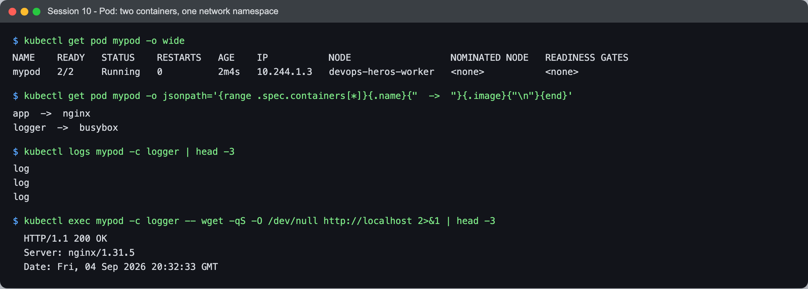

```text
$ kubectl get pod mypod -o wide
NAME    READY   STATUS    RESTARTS   AGE    IP           NODE
mypod   2/2     Running   0          2m4s   10.244.1.3   devops-heros-worker

$ kubectl get pod mypod -o jsonpath='{range .spec.containers[*]}{.name}  ->  {.image}{"\n"}{end}'
app     ->  nginx
logger  ->  busybox

$ kubectl logs mypod -c logger | head -3
log
log
log
```

**`READY 2/2`** — two containers, one pod, **one IP**. That is the whole idea of a pod: it
is not "a container", it is a group of containers that share a network namespace and can
share volumes.

The shared namespace is easy to prove rather than assert. From inside the *busybox*
container, over `localhost`:

```text
$ kubectl exec mypod -c logger -- wget -qS -O /dev/null http://localhost
  HTTP/1.1 200 OK
  Server: nginx/1.31.5
```

busybox has no web server. It reached **nginx**, in a different container, on `localhost`.
Two containers, two filesystems, one network stack. That is exactly how sidecars work — a
log shipper or a service-mesh proxy talks to the app over loopback with no network
configuration at all.

Note `kubectl logs` needed `-c logger`: with more than one container, you must say which.

---

## 2. ReplicaSet — keeps N pods alive

[`../k8s-core-objects/replicaset.yml`](../k8s-core-objects/replicaset.yml), `replicas: 3`.

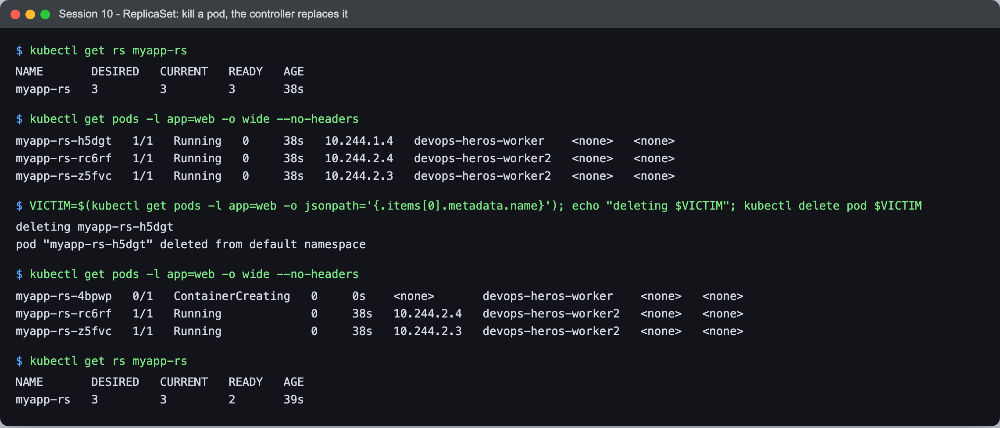

```text
$ kubectl get rs myapp-rs
NAME       DESIRED   CURRENT   READY   AGE
myapp-rs   3         3         3       38s

$ kubectl get pods -l app=web -o wide --no-headers
myapp-rs-h5dgt   1/1   Running   0   38s   10.244.1.4   devops-heros-worker
myapp-rs-rc6rf   1/1   Running   0   38s   10.244.2.4   devops-heros-worker2
myapp-rs-z5fvc   1/1   Running   0   38s   10.244.2.3   devops-heros-worker2
```

Now delete one and see what happens:

```text
$ VICTIM=$(kubectl get pods -l app=web -o jsonpath='{.items[0].metadata.name}')
deleting myapp-rs-h5dgt
pod "myapp-rs-h5dgt" deleted from default namespace

$ kubectl get pods -l app=web -o wide --no-headers
myapp-rs-4bpwp   0/1   ContainerCreating   0   0s    <none>       devops-heros-worker
myapp-rs-rc6rf   1/1   Running             0   38s   10.244.2.4   devops-heros-worker2
myapp-rs-z5fvc   1/1   Running             0   38s   10.244.2.3   devops-heros-worker2

$ kubectl get rs myapp-rs
NAME       DESIRED   CURRENT   READY   AGE
myapp-rs   3         3         2       39s
```

**`myapp-rs-4bpwp`, age 0s.** The replacement was created in the time it took to run the
next command. `DESIRED 3 CURRENT 3 READY 2` is the reconciliation caught mid-flight.

The replacement is a **different pod with a different name and a different IP**. The
ReplicaSet does not restore what was deleted; it observes `count != 3` and creates whatever
is needed to fix that. Pods are cattle. Nothing about the deleted pod was preserved.

This is also why `kubectl delete pod` is useless for stopping a managed workload — you have
to delete the controller, or scale it to zero.

---

## 3. Deployment — manages ReplicaSets, so it can roll

[`../k8s-core-objects/deployment.yml`](../k8s-core-objects/deployment.yml).

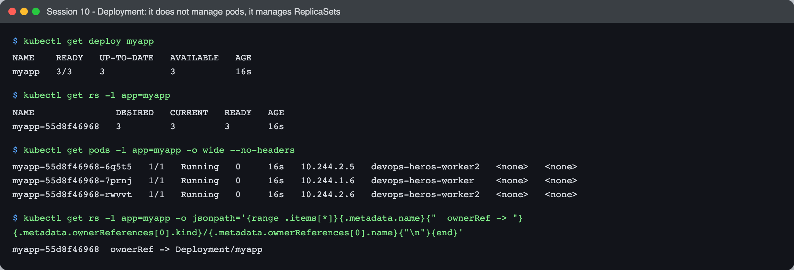

```text
$ kubectl get deploy myapp
NAME    READY   UP-TO-DATE   AVAILABLE   AGE
myapp   3/3     3            3           16s

$ kubectl get rs -l app=myapp
NAME               DESIRED   CURRENT   READY   AGE
myapp-55d8f46968   3         3         3       16s

$ kubectl get rs -l app=myapp -o jsonpath='{range .items[*]}{.metadata.name}  ownerRef -> {.metadata.ownerReferences[0].kind}/{.metadata.ownerReferences[0].name}{"\n"}{end}'
myapp-55d8f46968  ownerRef -> Deployment/myapp
```

The key structural fact: **a Deployment does not manage pods.** It created a ReplicaSet,
which manages the pods. The chain is `Deployment → ReplicaSet → Pod`, and `ownerReferences`
proves it rather than my asserting it. The `55d8f46968` suffix is a hash of the pod
template — change the template and you get a different hash, therefore a different
ReplicaSet.

### Rollout and rollback

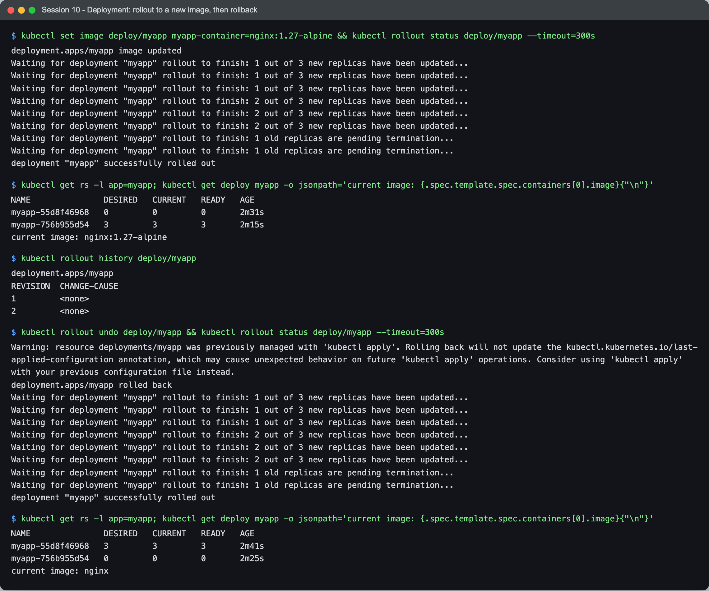

```text
$ kubectl set image deploy/myapp myapp-container=nginx:1.27-alpine
deployment.apps/myapp image updated
Waiting for deployment "myapp" rollout to finish: 1 out of 3 new replicas have been updated...
Waiting for deployment "myapp" rollout to finish: 2 out of 3 new replicas have been updated...
Waiting for deployment "myapp" rollout to finish: 1 old replicas are pending termination...
deployment "myapp" successfully rolled out

$ kubectl get rs -l app=myapp
NAME               DESIRED   CURRENT   READY   AGE
myapp-55d8f46968   0         0         0       2m31s     ← the old one, kept at zero
myapp-756b955d54   3         3         3       2m15s     ← the new one
current image: nginx:1.27-alpine
```

A rolling update is **two ReplicaSets, one scaling up while the other scales down**. Kubernetes
never had fewer pods available than the deployment's `maxUnavailable` allows, which is why
the update caused no downtime.

Notice what did *not* happen: the old ReplicaSet was **not deleted**. It sits at 0 replicas
holding its old pod template. That is the entire mechanism behind rollback:

```text
$ kubectl rollout history deploy/myapp
REVISION  CHANGE-CAUSE
1         <none>
2         <none>

$ kubectl rollout undo deploy/myapp
deployment.apps/myapp rolled back
deployment "myapp" successfully rolled out

$ kubectl get rs -l app=myapp
NAME               DESIRED   CURRENT   READY   AGE
myapp-55d8f46968   3         3         3       2m41s     ← back to 3
myapp-756b955d54   0         0         0       2m25s     ← scaled to 0
current image: nginx
```

The two ReplicaSets **swapped numbers**. Rollback is not a redeploy and does not consult a
registry or a git history — it scales an object that was already sitting there. That is why
it is close to instant, and why `revisionHistoryLimit` (default 10) matters: it is the count
of old ReplicaSets kept, i.e. how far back you can actually roll.

`CHANGE-CAUSE <none>` is because I did not annotate the change. `kubectl annotate deploy/myapp
kubernetes.io/change-cause="..."` fills that column, and is worth doing on a real cluster.

---

## 4. Service — a stable address for changing pods

[`../k8s-core-objects/service.yml`](../k8s-core-objects/service.yml) — `type: NodePort`,
selector `app: myapp`.

Sections 2 and 3 established that pod IPs are disposable. A Service is the answer to that.

To show load balancing I first gave each pod a distinguishable page, since three nginx
default pages are indistinguishable:

```bash
for p in $(kubectl get pods -l app=myapp -o jsonpath='{.items[*].metadata.name}'); do
  kubectl exec $p -- sh -c "echo 'served by pod: $p' > /usr/share/nginx/html/index.html"
done
```

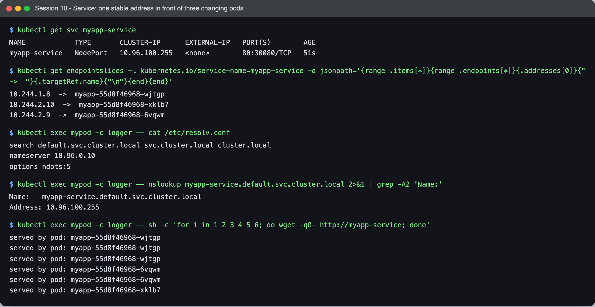

```text
$ kubectl get svc myapp-service
NAME            TYPE       CLUSTER-IP      EXTERNAL-IP   PORT(S)        AGE
myapp-service   NodePort   10.96.100.255   <none>        80:30080/TCP   51s

$ kubectl get endpointslices -l kubernetes.io/service-name=myapp-service -o jsonpath='...'
10.244.1.8    ->  myapp-55d8f46968-wjtgp
10.244.2.10   ->  myapp-55d8f46968-xklb7
10.244.2.9    ->  myapp-55d8f46968-6vqwm
```

The **EndpointSlice** is the part worth understanding. The Service's `selector: app=myapp` is
not evaluated at request time — a controller watches for pods matching that label and keeps
this list of IPs up to date. The Service is a stable name; the EndpointSlice is the moving
part behind it. When a pod dies, it drops out of this list and traffic stops going to it.

```text
$ kubectl exec mypod -c logger -- cat /etc/resolv.conf
search default.svc.cluster.local svc.cluster.local cluster.local
nameserver 10.96.0.10
options ndots:5

$ kubectl exec mypod -c logger -- nslookup myapp-service.default.svc.cluster.local
Name:	myapp-service.default.svc.cluster.local
Address: 10.96.100.255
```

Every pod's resolver points at CoreDNS (`10.96.0.10`) with a **search list** that makes the
short name `myapp-service` work inside the same namespace, `myapp-service.default` from
another namespace, and the full FQDN from anywhere. `ndots:5` is why: any name with fewer
than 5 dots gets the search suffixes tried first.

And the load balancing itself:

```text
$ kubectl exec mypod -c logger -- sh -c 'for i in 1 2 3 4 5 6; do wget -qO- http://myapp-service; done'
served by pod: myapp-55d8f46968-wjtgp
served by pod: myapp-55d8f46968-wjtgp
served by pod: myapp-55d8f46968-wjtgp
served by pod: myapp-55d8f46968-6vqwm
served by pod: myapp-55d8f46968-6vqwm
served by pod: myapp-55d8f46968-xklb7
```

Six requests to one address, answered by all three pods. Note it is **not round-robin** —
`kube-proxy` installs iptables rules with random probabilities, so the distribution is even
over many requests but the ordering is arbitrary. Expecting strict alternation here is a
common mistake.

### NodePort — the same port on every node

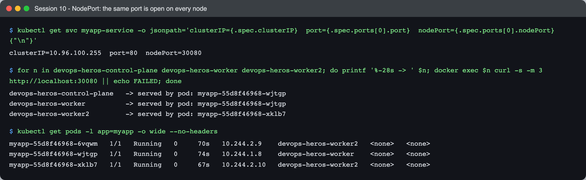

```text
$ kubectl get svc myapp-service -o jsonpath='...'
clusterIP=10.96.100.255  port=80  nodePort=30080

$ for n in control-plane worker worker2; do docker exec devops-heros-$n curl -s localhost:30080; done
devops-heros-control-plane   -> served by pod: myapp-55d8f46968-wjtgp
devops-heros-worker          -> served by pod: myapp-55d8f46968-wjtgp
devops-heros-worker2         -> served by pod: myapp-55d8f46968-xklb7
```

**Port 30080 answers on all three nodes**, including the control plane, which runs none of
these pods. Any node receiving traffic on a NodePort forwards it to a pod wherever that pod
is. That is what makes a NodePort usable behind an external load balancer that does not know
or care where pods are scheduled.

| Service type | Reachable from | Use |
|---|---|---|
| `ClusterIP` (default) | inside the cluster only | internal services — most things |
| `NodePort` | `<any-node-ip>:30000-32767` | dev, or behind your own LB |
| `LoadBalancer` | a cloud LB's external IP | production ingress on a cloud provider |
| headless (`clusterIP: None`) | DNS returns pod IPs directly | StatefulSets — see below |

---

## 5. DaemonSet — one pod per node

[`../k8s-core-objects/deamonset.yml`](../k8s-core-objects/deamonset.yml). Three nodes, so I
expected three pods. **I got two.**

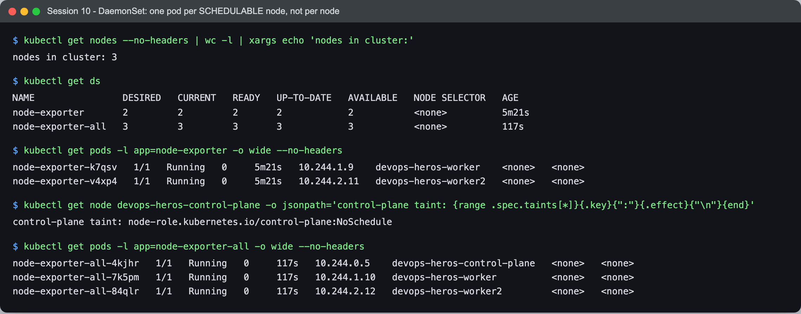

```text
nodes in cluster: 3

$ kubectl get ds
NAME                DESIRED   CURRENT   READY   AGE
node-exporter       2         2         2       5m21s     ← only 2
node-exporter-all   3         3         3       117s

$ kubectl get pods -l app=node-exporter -o wide --no-headers
node-exporter-k7qsv   1/1   Running   0   5m21s   10.244.1.9    devops-heros-worker
node-exporter-v4xp4   1/1   Running   0   5m21s   10.244.2.11   devops-heros-worker2
```

`DESIRED` is **2**, not 3 — so this is not a scheduling failure, the DaemonSet controller
itself decided two. The reason:

```text
$ kubectl get node devops-heros-control-plane -o jsonpath='{...taints...}'
control-plane taint: node-role.kubernetes.io/control-plane:NoSchedule
```

The control-plane node carries a **`NoSchedule` taint**, and the manifest has no toleration
for it. A DaemonSet runs one pod per node it is *allowed* onto — **"every node" means "every
node that tolerates it"**.

That matters in practice: node-exporter is a metrics agent, and a monitoring DaemonSet that
silently skips the control plane leaves you blind on the most important machine in the
cluster. The same applies to log shippers and CNI agents — which is exactly why `kube-proxy`
and `kindnet` in [session 9](../../session9-k8s/task/) *do* run on all three nodes.

[`daemonset-with-toleration.yml`](daemonset-with-toleration.yml) adds the toleration:

```yaml
      tolerations:
        - key: node-role.kubernetes.io/control-plane
          operator: Exists
          effect: NoSchedule
```

```text
$ kubectl get pods -l app=node-exporter-all -o wide --no-headers
node-exporter-all-4kjhr   1/1   Running   0   117s   10.244.0.5    devops-heros-control-plane
node-exporter-all-7k5pm   1/1   Running   0   117s   10.244.1.10   devops-heros-worker
node-exporter-all-84qlr   1/1   Running   0   117s   10.244.2.12   devops-heros-worker2
```

Three nodes, three pods. Note a DaemonSet has **no `replicas` field** — the count is derived
from the nodes, and it changes on its own when a node joins or leaves.

---

## 6. StatefulSet — stable identity and per-pod storage

### Two bugs in the provided manifest

[`../k8s-core-objects/statefulset.yml`](../k8s-core-objects/statefulset.yml) does not run as
shipped. Applying it:

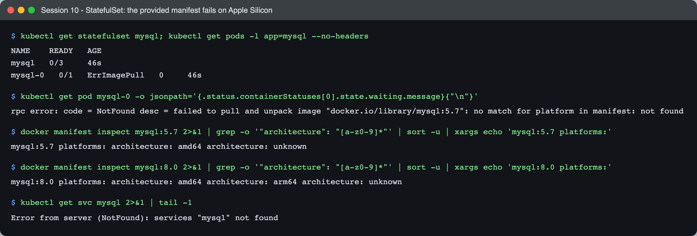

```text
$ kubectl get statefulset mysql; kubectl get pods -l app=mysql --no-headers
NAME    READY   AGE
mysql   0/3     46s
mysql-0   0/1   ErrImagePull   0   46s

$ kubectl get pod mysql-0 -o jsonpath='{...waiting.message}'
rpc error: code = NotFound desc = failed to pull and unpack image "docker.io/library/mysql:5.7":
no match for platform in manifest: not found
```

**Bug 1 — `mysql:5.7` has no arm64 build.**

```text
$ docker manifest inspect mysql:5.7 | grep architecture | sort -u
mysql:5.7 platforms: amd64, unknown

$ docker manifest inspect mysql:8.0 | grep architecture | sort -u
mysql:8.0 platforms: amd64, arm64, unknown
```

MySQL never published a 5.7 image for arm64. On an Intel machine this manifest works; on
Apple Silicon it cannot. `mysql:8.0` is multi-arch, so switching the tag fixes it. (Adding
`--platform=linux/amd64` would also work via emulation, and would be much slower.)

**Bug 2 — the headless Service it references does not exist.**

```text
$ kubectl get svc mysql
Error from server (NotFound): services "mysql" not found
```

The manifest declares `serviceName: "mysql"` and even comments `# Required headless service`,
but no such Service is in the repo. Without it, the per-pod DNS names that are the *entire
reason* to use a StatefulSet are never created.

Note that only **`mysql-0`** exists in the failure output — `mysql-1` and `mysql-2` were
never attempted. A StatefulSet creates pods strictly in order and waits for each to be Ready
before starting the next, so one broken image stalls the whole set at ordinal 0. That is a
demonstration of the ordering guarantee, by accident.

[`statefulset-fixed.yml`](statefulset-fixed.yml) is the corrected version: it adds the
headless Service, moves to `mysql:8.0`, and drops the storage request from 5Gi to 1Gi per
pod (three 5Gi claims is a lot to ask of a laptop, and nothing here needs it).

### Stable identity and one volume per pod

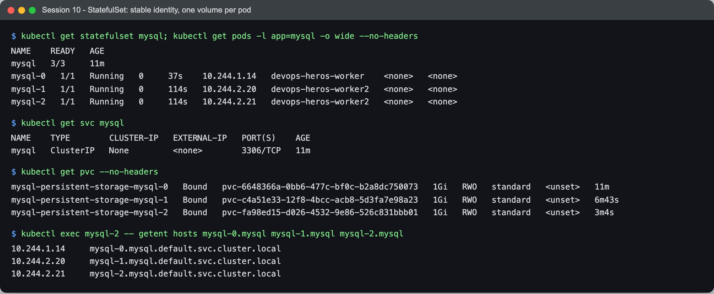

```text
$ kubectl get pods -l app=mysql -o wide --no-headers
mysql-0   1/1   Running   0   37s    10.244.1.14   devops-heros-worker
mysql-1   1/1   Running   0   114s   10.244.2.20   devops-heros-worker2
mysql-2   1/1   Running   0   114s   10.244.2.21   devops-heros-worker2

$ kubectl get svc mysql
NAME    TYPE        CLUSTER-IP   EXTERNAL-IP   PORT(S)    AGE
mysql   ClusterIP   None         <none>        3306/TCP   11m

$ kubectl get pvc --no-headers
mysql-persistent-storage-mysql-0   Bound   pvc-6648366a...   1Gi   RWO   standard   11m
mysql-persistent-storage-mysql-1   Bound   pvc-c4a51e33...   1Gi   RWO   standard   6m43s
mysql-persistent-storage-mysql-2   Bound   pvc-fa98ed15...   1Gi   RWO   standard   3m4s
```

Three differences from a Deployment, all visible here:

1. **Names are ordinals, not hashes.** `mysql-0`, `mysql-1`, `mysql-2` — compare
   `myapp-55d8f46968-6q5t5` in section 3.
2. **`CLUSTER-IP: None`** — the headless Service has no virtual IP and does no load
   balancing. That is deliberate: you do not want a query for "the database" round-robining
   between a primary and its replicas.
3. **One PVC per pod**, created from `volumeClaimTemplates`. A Deployment's pods would all
   share one volume, or none.

```text
$ kubectl exec mysql-2 -- getent hosts mysql-0.mysql mysql-1.mysql mysql-2.mysql
10.244.1.14     mysql-0.mysql.default.svc.cluster.local
10.244.2.20     mysql-1.mysql.default.svc.cluster.local
10.244.2.21     mysql-2.mysql.default.svc.cluster.local
```

**Each pod has its own DNS name.** This is what the missing Service was for. Replication
needs a replica to say "connect to `mysql-0.mysql` and follow it" — a load-balanced address
cannot express that.

### Ordering: forward up, reverse down

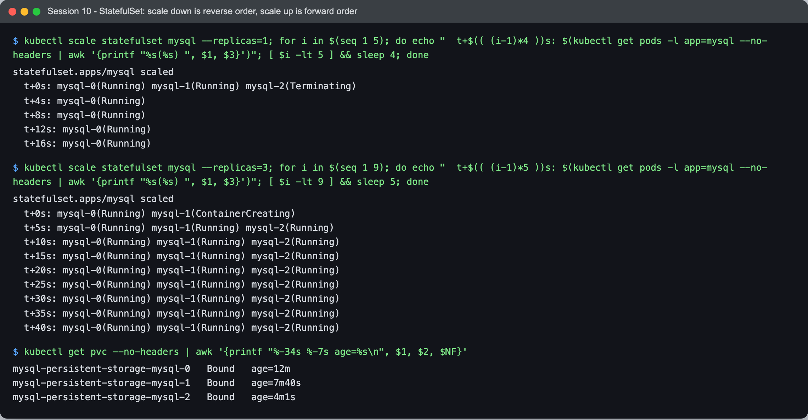

```text
$ kubectl scale statefulset mysql --replicas=1
  t+0s:  mysql-0(Running) mysql-1(Running) mysql-2(Terminating)
  t+4s:  mysql-0(Running)

$ kubectl scale statefulset mysql --replicas=3
  t+0s:  mysql-0(Running) mysql-1(ContainerCreating)
  t+5s:  mysql-0(Running) mysql-1(Running) mysql-2(Running)
```

Scaling down terminates the **highest** ordinal first; scaling up creates the **lowest**
missing one first. For a clustered database that is the difference between a graceful
shrink and losing the primary.

```text
$ kubectl get pvc --no-headers
mysql-persistent-storage-mysql-0   Bound   age=12m
mysql-persistent-storage-mysql-1   Bound   age=7m40s
mysql-persistent-storage-mysql-2   Bound   age=4m1s
```

The **PVC ages did not reset**. Scaling to 1 destroyed two pods but deliberately kept their
volumes, and scaling back up reattached them. Kubernetes will not delete your data because
you scaled down — deleting a StatefulSet's PVCs is a manual act.

### The identity test

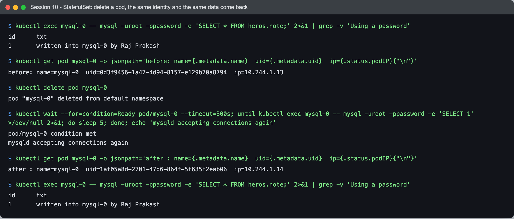

```text
$ kubectl exec mysql-0 -- mysql -uroot -ppassword -e 'SELECT * FROM heros.note;'
id	txt
1	written into mysql-0 by Raj Prakash

$ kubectl get pod mysql-0 -o jsonpath='...'
before: name=mysql-0  uid=0d3f9456-1a47-4d94-8157-e129b70a8794  ip=10.244.1.13

$ kubectl delete pod mysql-0
pod "mysql-0" deleted from default namespace

$ kubectl get pod mysql-0 -o jsonpath='...'
after : name=mysql-0  uid=1af05a8d-2701-47d6-864f-5f635f2eab06  ip=10.244.1.14

$ kubectl exec mysql-0 -- mysql -uroot -ppassword -e 'SELECT * FROM heros.note;'
id	txt
1	written into mysql-0 by Raj Prakash
```

Same **name**, different **UID**, different **IP**, same **data**.

Put next to section 2, this is the whole distinction. Deleting a ReplicaSet's pod produced a
stranger with a new name. Deleting a StatefulSet's pod produced a genuinely new object — new
UID, new IP — that **inherited the identity**: the ordinal name, the DNS record, and the
PersistentVolumeClaim with the row I had written into it.

That is why databases are StatefulSets. `mysql-0` is a role, and the pod is whoever is
currently filling it.

---

## Summary — which object for what

| Object | Guarantees | Names | Storage | Use for |
|---|---|---|---|---|
| **Pod** | none — nothing restarts it | fixed | ephemeral | never directly; a unit others manage |
| **ReplicaSet** | N pods exist | random suffix | ephemeral | never directly — use a Deployment |
| **Deployment** | N pods + rolling updates + rollback | random suffix | ephemeral | stateless apps. The default |
| **Service** | a stable address and DNS name | fixed | — | reaching any of the above |
| **DaemonSet** | one pod per tolerated node | random suffix | usually hostPath | node agents: logs, metrics, CNI |
| **StatefulSet** | ordered, stable identity + per-pod volume | ordinal | persistent, reattached | databases, queues, anything clustered |

## What I learned

- **`ownerReferences` makes the object graph visible.** `Deployment → ReplicaSet → Pod` is
  not a mental model to memorise; it is a field you can print.
- **Rollback is a scale operation, not a redeploy.** Old ReplicaSets are kept at 0 replicas
  precisely so `rollout undo` can be instant. That also explains why
  `revisionHistoryLimit` is really "how far back can I roll".
- **A DaemonSet's `DESIRED` is computed, not declared** — and taints reduce it silently. A
  monitoring agent that quietly skips the control plane is a genuinely dangerous bug because
  nothing reports an error.
- **A Service's selector is not evaluated per request.** A controller maintains an
  EndpointSlice; the Service just points at it. Once that is clear, "why is traffic still
  going to a dead pod?" becomes a question with an obvious place to look.
- **Identity is the point of a StatefulSet**, not persistence on its own. A Deployment can
  mount a PVC too. What it cannot do is guarantee that the pod called `mysql-0` gets *that*
  volume back.
- **Service DNS and `ndots:5`** explain why short names work inside a namespace and why an
  external hostname in a pod does several failed lookups first.

## Problems I hit

- **Both StatefulSet failures looked like one problem at first.** The pod was not running, so
  I assumed the missing Service was the cause. It was not — the image pull failed for an
  unrelated reason, and the missing Service would only have shown up later as broken DNS.
  Reading the actual `waiting.message` rather than guessing from `0/3` is what separated
  them. Two bugs, and the loud one was not the one I had noticed first.
- **`nslookup myapp-service` from busybox exits 1 even when it resolves.** BusyBox's nslookup
  walks the whole `search` list and reports NXDOMAIN for the suffixes that miss, so the
  useful answer scrolls past above a failure. Querying the full FQDN gives a clean result,
  and `cat /etc/resolv.conf` explains what it was doing.
- **I expected the DaemonSet to be 3 and treated 2 as a scheduling delay.** Waiting longer
  did nothing, because `DESIRED` was already 2 — the controller had decided, and there was
  nothing pending. Reading `DESIRED` rather than `READY` is what pointed at the taint.
- **A backgrounded capture overwrote a newer one.** I left a six-minute sampler running,
  re-ran the same capture in the foreground when it seemed stalled, and the stale background
  job finished afterwards and clobbered the good output file — so a screenshot got rendered
  from data that was already obsolete. Caught it by checking the job titles in the JSON
  against the spec. Two writers, one output path, no locking.
- **`kubectl wait --for=condition=Ready` returns before MySQL is usable.** The manifest
  defines no readiness probe, so `Ready` means "container started", and the first query after
  a restart failed with a socket error. A real deployment needs a readiness probe; for the
  capture I polled `SELECT 1` until it answered.
