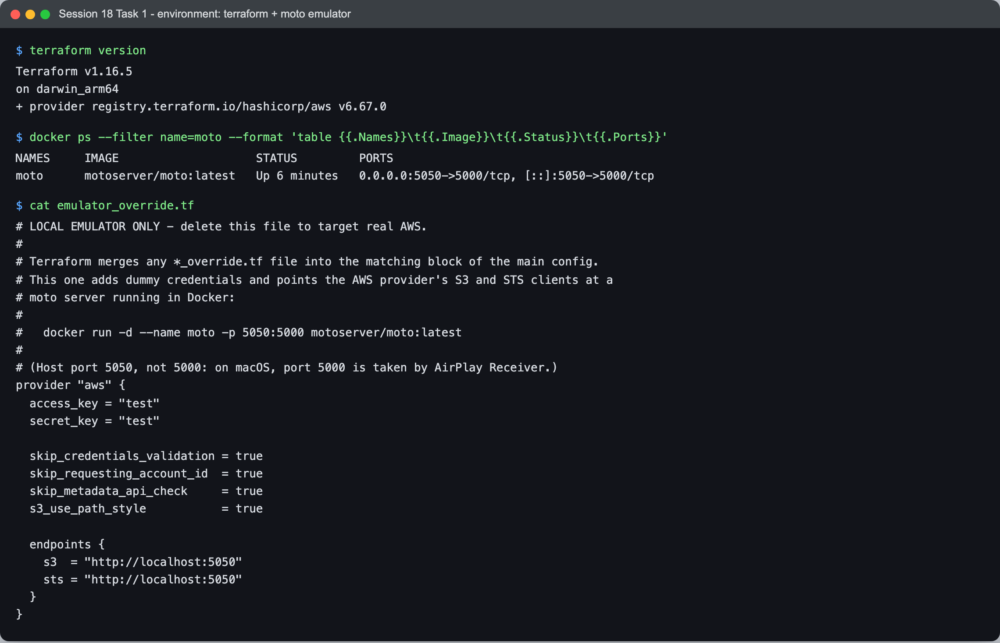
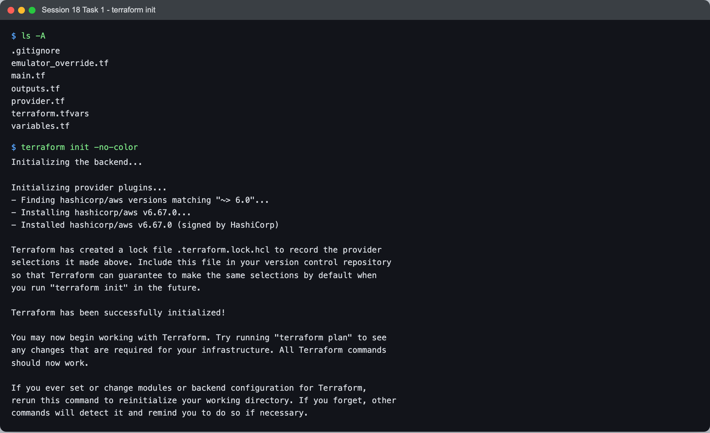
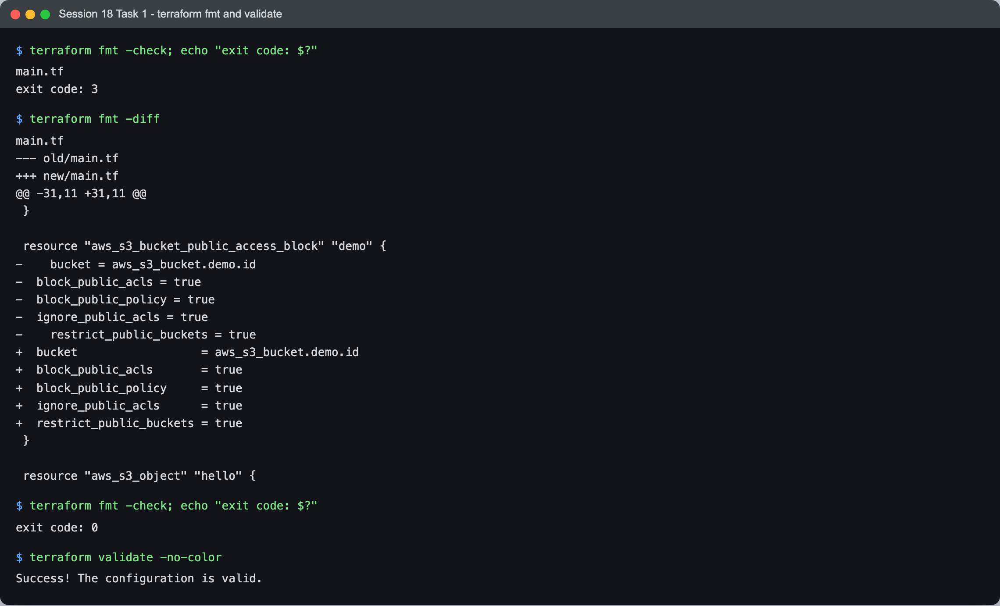
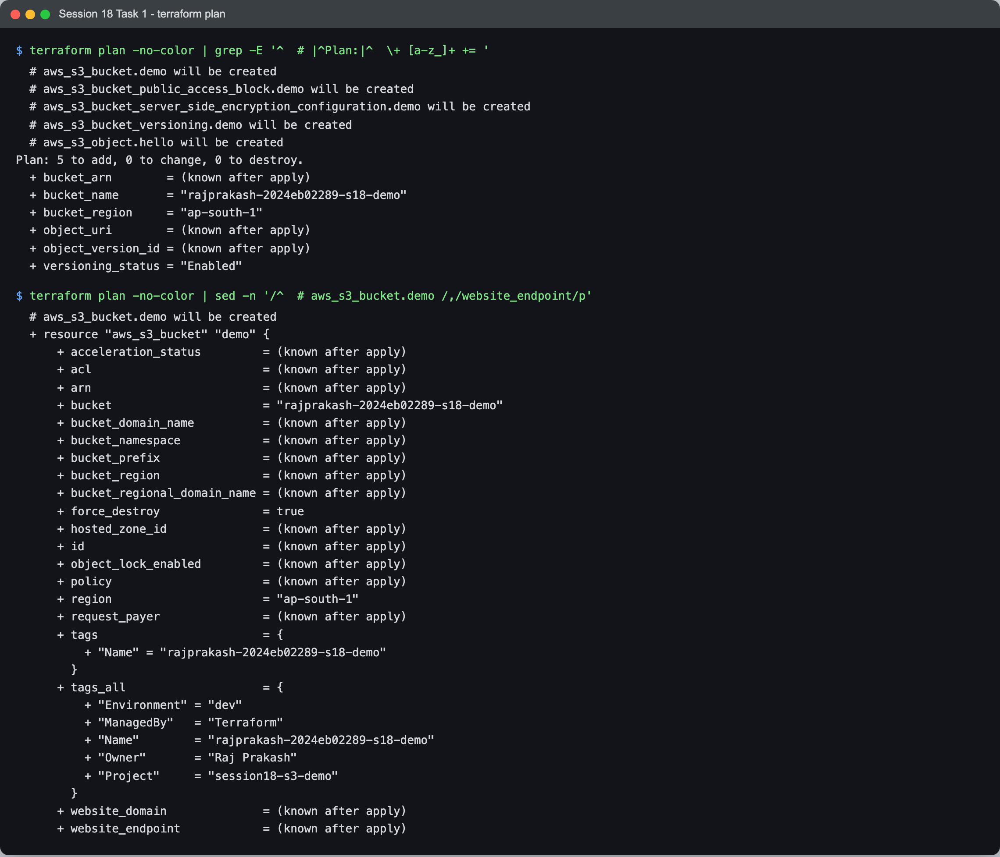
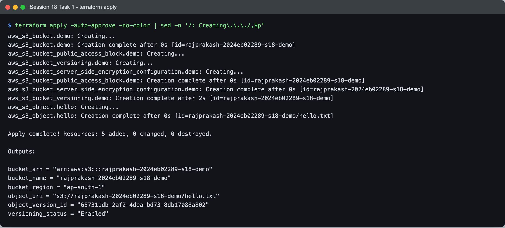
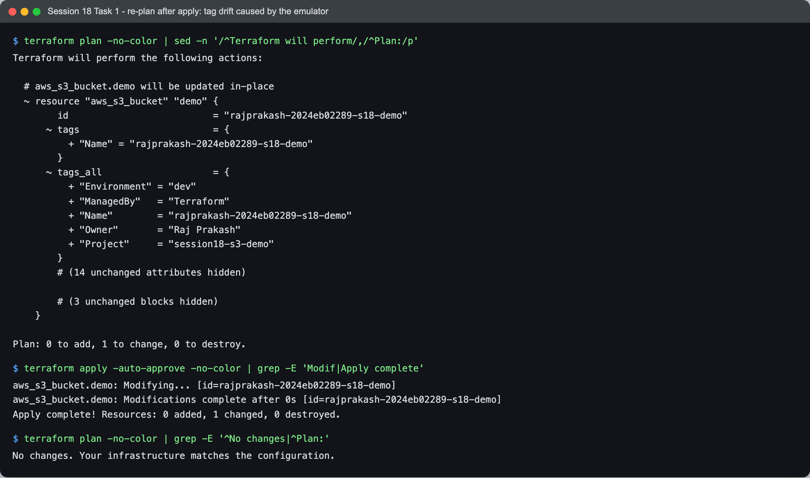
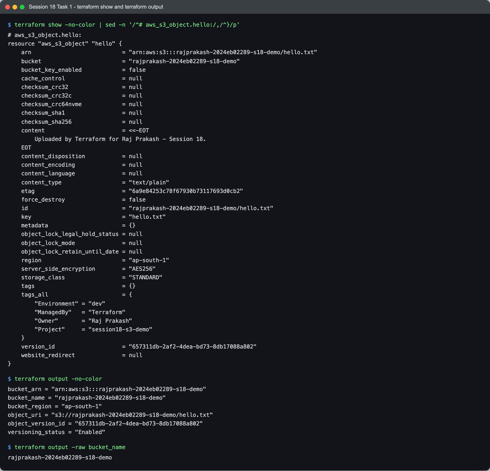
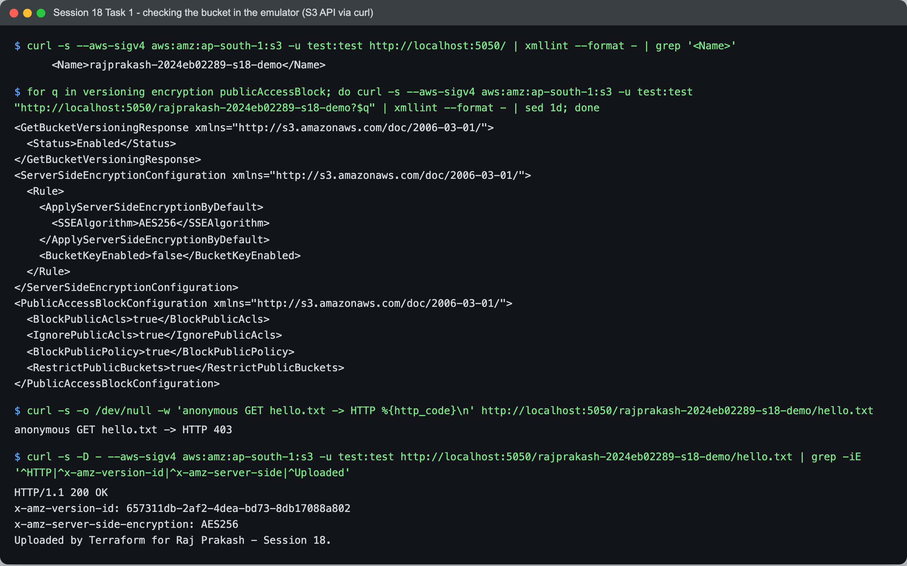
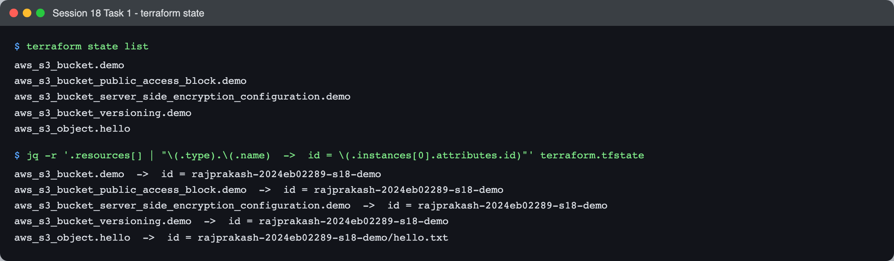
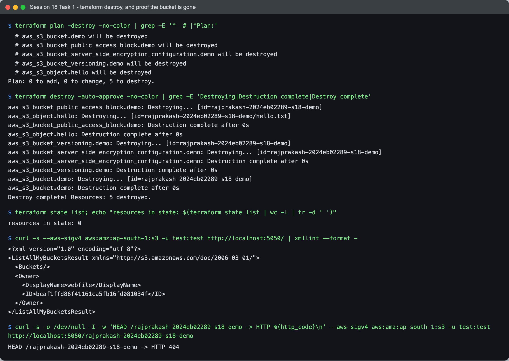

# Session 18 — Terraform & Infrastructure as Code — Task

- **Name:** Raj Prakash
- **Enrollment No:** 2024EB02289

> **Status:** done
>
> Terraform **v1.16.5**, provider **hashicorp/aws v6.67.0**, macOS on Apple Silicon.
> Every Terraform command below ran for real, but against **moto 5.2.3**, a local AWS API
> emulator running in Docker, **not against a real AWS account**. I have no AWS credentials on
> this machine. The Terraform code itself is ordinary real-AWS code. Delete one file,
> [`emulator_override.tf`](terraform-s3-demo/emulator_override.tf), configure real credentials,
> and the same commands create a real bucket.

---

## What the task asked

1. **Task 1: Terraform S3 demo.** Write a small Terraform project that creates an S3
   bucket, then take it through the whole lifecycle: `init`, `fmt`, `validate`, `plan`,
   `apply`, `show`, `output`, `state`, `destroy`. The project is in
   [`terraform-s3-demo/`](terraform-s3-demo/).
2. **Task 2: AWS services research.** Notes on IAM, EC2, S3, VPC and DynamoDB/RDS, in
   [`aws-services/`](aws-services/README.md). See [Task 2](#task-2--aws-services-research)
   below.

---

## Running against an emulator, not AWS

Without credentials, the provider stops at its first API call. I could have stopped at
`terraform validate`, but `validate` only checks the code against the provider schema. It
never talks to an API, so it proves nothing about `apply`, state or `destroy`. Those are the
parts of Terraform worth learning.

[moto](https://github.com/getmoto/moto) implements the AWS APIs (S3, EC2, STS, ...) as a local
HTTP server. The AWS provider has an `endpoints` setting, so I can point it at that server
without touching the main code. Terraform merges any file named `*_override.tf` into the
matching block of the main configuration. So [`provider.tf`](terraform-s3-demo/provider.tf) is
plain real-AWS code, with no keys and no endpoints, and
[`emulator_override.tf`](terraform-s3-demo/emulator_override.tf) adds this on top:

```hcl
provider "aws" {
  access_key = "test"
  secret_key = "test"

  skip_credentials_validation = true
  skip_requesting_account_id  = true
  skip_metadata_api_check     = true
  s3_use_path_style           = true

  endpoints {
    s3  = "http://localhost:5050"
    sts = "http://localhost:5050"
  }
}
```

**To run this on real AWS:** delete `emulator_override.tf`, make credentials available the
normal way (`aws configure`, environment variables, or an IAM role), and run the same
commands. Nothing else changes.

The emulator was started with:

```bash
docker run -d --name moto -p 5050:5000 motoserver/moto:latest
```

The host port is 5050, not 5000. Why is in [Problems I hit](#problems-i-hit).



```text
$ terraform version
Terraform v1.16.5
on darwin_arm64
+ provider registry.terraform.io/hashicorp/aws v6.67.0

$ docker ps --filter name=moto --format 'table {{.Names}}\t{{.Image}}\t{{.Status}}\t{{.Ports}}'
NAMES     IMAGE                    STATUS         PORTS
moto      motoserver/moto:latest   Up 6 minutes   0.0.0.0:5050->5000/tcp, [::]:5050->5000/tcp
```

**What the emulator does not prove.** moto takes the dummy `test`/`test` credentials and does
not check them against any real identity, so nothing about IAM permissions was exercised.
Bucket names only have to be unique inside the emulator, not across all of AWS. And two emulator bugs showed up, both written up
below. Everything Terraform itself does (planning, dependency ordering, state, drift
detection, destroy) is the real Terraform binary doing real work.

Before the recorded run I reset the emulator (`curl -X POST http://localhost:5050/moto-api/reset`)
so it started from an empty account. The reason is under Problems I hit.

All `terraform` commands that print colour are run with `-no-color`, because Terraform writes
ANSI escape codes even when its output is piped into a file.

---

## Task 1 — Terraform S3 demo

### The files

| File | What it holds |
|---|---|
| [`provider.tf`](terraform-s3-demo/provider.tf) | `terraform {}` block (Terraform `>= 1.6.0`, `hashicorp/aws ~> 6.0`) and the `aws` provider with **`default_tags`** |
| [`variables.tf`](terraform-s3-demo/variables.tf) | `aws_region`, `project_name`, `environment` (validated: dev/test/prod), `owner`, `bucket_name` (validated against S3 naming rules), `enable_versioning` |
| [`terraform.tfvars`](terraform-s3-demo/terraform.tfvars) | The values: region `ap-south-1`, bucket `rajprakash-2024eb02289-s18-demo` |
| [`main.tf`](terraform-s3-demo/main.tf) | The bucket plus four separate resources (see below) |
| [`outputs.tf`](terraform-s3-demo/outputs.tf) | Bucket name, ARN, region, versioning status, object URI and object version ID |
| [`emulator_override.tf`](terraform-s3-demo/emulator_override.tf) | Emulator only: dummy credentials and endpoints. Delete for real AWS |
| [`.gitignore`](terraform-s3-demo/.gitignore) | `.terraform/`, `*.tfstate`, `*.tfstate.*`, `*.tfplan` |
| `.terraform.lock.hcl` | Written by `init`, committed on purpose: it pins the exact provider version and hashes |

`terraform.tfvars` is committed even though the course says to gitignore it in real
projects. The task asks for it, and it contains no secrets.

### The modern way to configure a bucket

The course's reference demo puts everything inside one `aws_s3_bucket` block. Since AWS
provider v4, versioning, encryption and public-access settings are **no longer arguments
of `aws_s3_bucket`**. Each one is its own resource that points at the bucket:

```hcl
resource "aws_s3_bucket" "demo" {
  bucket        = var.bucket_name
  force_destroy = true
  tags          = { Name = var.bucket_name }
}

resource "aws_s3_bucket_versioning" "demo" {
  bucket = aws_s3_bucket.demo.id
  versioning_configuration {
    status = var.enable_versioning ? "Enabled" : "Suspended"
  }
}

resource "aws_s3_bucket_server_side_encryption_configuration" "demo" { ... sse_algorithm = "AES256" ... }
resource "aws_s3_bucket_public_access_block" "demo" { ... all four settings true ... }
resource "aws_s3_object" "hello" { ... key = "hello.txt" ... depends_on = [versioning, encryption] }
```

The point of the split is that each setting has its own lifecycle. Changing the encryption
rule is an update to one small resource, and the bucket resource is not touched. It also
gives Terraform a dependency graph to work with, which shows up in the apply order below.

Tags are set once, in the provider:

```hcl
provider "aws" {
  region = var.aws_region
  default_tags {
    tags = {
      Project     = var.project_name
      Environment = var.environment
      Owner       = var.owner
      ManagedBy   = "Terraform"
    }
  }
}
```

### 1. `terraform init`



```text
$ terraform init -no-color
Initializing the backend...

Initializing provider plugins...
- Finding hashicorp/aws versions matching "~> 6.0"...
- Installing hashicorp/aws v6.67.0...
- Installed hashicorp/aws v6.67.0 (signed by HashiCorp)

Terraform has created a lock file .terraform.lock.hcl to record the provider
selections it made above. Include this file in your version control repository
so that Terraform can guarantee to make the same selections by default when
you run "terraform init" in the future.

Terraform has been successfully initialized!
```

`~> 6.0` means "any 6.x". It resolved to **v6.67.0**, and the lock file now pins exactly
that version, with hashes. Anyone else running `init` on this folder gets v6.67.0, not
whatever 6.x is newest that day. That is why the lock file is committed.

I ran with `TF_PLUGIN_CACHE_DIR=$HOME/.terraform.d/plugin-cache` set. The AWS provider is a
large binary, and the cache means Session 19 links to this download instead of keeping a
second copy.

### 2. `terraform fmt` and `terraform validate`

I deliberately left the `aws_s3_bucket_public_access_block` block in `main.tf` misformatted,
with wrong indentation and unaligned `=` signs, so `fmt` would have something to fix.



```text
$ terraform fmt -check; echo "exit code: $?"
main.tf
exit code: 3

$ terraform fmt -diff
main.tf
--- old/main.tf
+++ new/main.tf
@@ -31,11 +31,11 @@
 }
 
 resource "aws_s3_bucket_public_access_block" "demo" {
-    bucket = aws_s3_bucket.demo.id
-  block_public_acls = true
-  block_public_policy = true
-  ignore_public_acls = true
-    restrict_public_buckets = true
+  bucket                  = aws_s3_bucket.demo.id
+  block_public_acls       = true
+  block_public_policy     = true
+  ignore_public_acls      = true
+  restrict_public_buckets = true
 }
 
 resource "aws_s3_object" "hello" {

$ terraform fmt -check; echo "exit code: $?"
exit code: 0

$ terraform validate -no-color
Success! The configuration is valid.
```

`fmt -check` changes nothing. It lists the files that would change and **exits 3**. That
non-zero exit code is what makes it useful in CI: a pipeline step that fails on unformatted
code. `fmt -diff` rewrites the file and shows what it changed. The second `-check` exits 0.

`validate` checks the code against the provider's schema (argument names, types, references)
without calling any API. It would have passed with no emulator running at all.

### 3. `terraform plan`

The full plan is long, so the screenshot shows two filtered views of the same plan. The first
is the list of actions plus the planned outputs. The second is the bucket resource in full.



```text
$ terraform plan -no-color | grep -E '^  # |^Plan:|^  \+ [a-z_]+ += '
  # aws_s3_bucket.demo will be created
  # aws_s3_bucket_public_access_block.demo will be created
  # aws_s3_bucket_server_side_encryption_configuration.demo will be created
  # aws_s3_bucket_versioning.demo will be created
  # aws_s3_object.hello will be created
Plan: 5 to add, 0 to change, 0 to destroy.
  + bucket_arn        = (known after apply)
  + bucket_name       = "rajprakash-2024eb02289-s18-demo"
  + bucket_region     = "ap-south-1"
  + object_uri        = (known after apply)
  + object_version_id = (known after apply)
  + versioning_status = "Enabled"
```

And the tag lines from the second view (`sed -n '/^  # aws_s3_bucket.demo /,/website_endpoint/p'`):

```text
      + tags                        = {
          + "Name" = "rajprakash-2024eb02289-s18-demo"
        }
      + tags_all                    = {
          + "Environment" = "dev"
          + "ManagedBy"   = "Terraform"
          + "Name"        = "rajprakash-2024eb02289-s18-demo"
          + "Owner"       = "Raj Prakash"
          + "Project"     = "session18-s3-demo"
        }
```

Two things in this plan are worth noticing:

- **Which values are known at plan time.** `bucket_name` comes straight from a variable, so it
  is known now. `bucket_arn` is `(known after apply)`, and so is the bucket's `id`. That is
  why the versioning, encryption and public access block resources all show
  `bucket = (known after apply)` in the full plan: they reference `aws_s3_bucket.demo.id`,
  which does not exist yet.
- **`tags` vs `tags_all`.** I wrote one tag on the bucket (`Name`). `tags_all` is that tag
  merged with the provider's `default_tags`, and `tags_all` is what actually gets sent to AWS.

### 4. `terraform apply`

The screenshot starts at the first `Creating...` line. The plan that `apply` prints first is the
same as above.



```text
$ terraform apply -auto-approve -no-color | sed -n '/: Creating\.\.\./,$p'
aws_s3_bucket.demo: Creating...
aws_s3_bucket.demo: Creation complete after 0s [id=rajprakash-2024eb02289-s18-demo]
aws_s3_bucket_public_access_block.demo: Creating...
aws_s3_bucket_versioning.demo: Creating...
aws_s3_bucket_server_side_encryption_configuration.demo: Creating...
aws_s3_bucket_public_access_block.demo: Creation complete after 0s [id=rajprakash-2024eb02289-s18-demo]
aws_s3_bucket_server_side_encryption_configuration.demo: Creation complete after 0s [id=rajprakash-2024eb02289-s18-demo]
aws_s3_bucket_versioning.demo: Creation complete after 2s [id=rajprakash-2024eb02289-s18-demo]
aws_s3_object.hello: Creating...
aws_s3_object.hello: Creation complete after 0s [id=rajprakash-2024eb02289-s18-demo/hello.txt]

Apply complete! Resources: 5 added, 0 changed, 0 destroyed.

Outputs:

bucket_arn = "arn:aws:s3:::rajprakash-2024eb02289-s18-demo"
bucket_name = "rajprakash-2024eb02289-s18-demo"
bucket_region = "ap-south-1"
object_uri = "s3://rajprakash-2024eb02289-s18-demo/hello.txt"
object_version_id = "657311db-2af2-4dea-bd73-8db17088a802"
versioning_status = "Enabled"
```

The order here is the dependency graph made visible:

1. The **bucket** goes first, because everything else references `aws_s3_bucket.demo.id`.
2. The **three settings** start together. They depend only on the bucket, not on each other,
   so Terraform runs them in parallel.
3. The **object** waits until versioning has finished, 2 seconds later. It only references
   the bucket, so without help Terraform would have uploaded it in step 2, in parallel with
   versioning being switched on. I added an explicit `depends_on` on the versioning and
   encryption resources so the object lands in a bucket that is already versioned and
   encrypted. The result is `object_version_id = "657311db-..."`, a real version ID. An object
   written before versioning is enabled gets the version ID `null` instead.

### 5. Re-plan after apply: drift, caused by the emulator

After an apply, a second `plan` should say "No changes". Here it did not:



```text
$ terraform plan -no-color | sed -n '/^Terraform will perform/,/^Plan:/p'
Terraform will perform the following actions:

  # aws_s3_bucket.demo will be updated in-place
  ~ resource "aws_s3_bucket" "demo" {
        id                          = "rajprakash-2024eb02289-s18-demo"
      ~ tags                        = {
          + "Name" = "rajprakash-2024eb02289-s18-demo"
        }
      ~ tags_all                    = {
          + "Environment" = "dev"
          + "ManagedBy"   = "Terraform"
          + "Name"        = "rajprakash-2024eb02289-s18-demo"
          + "Owner"       = "Raj Prakash"
          + "Project"     = "session18-s3-demo"
        }
        # (14 unchanged attributes hidden)

        # (3 unchanged blocks hidden)
    }

Plan: 0 to add, 1 to change, 0 to destroy.

$ terraform apply -auto-approve -no-color | grep -E 'Modif|Apply complete'
aws_s3_bucket.demo: Modifying... [id=rajprakash-2024eb02289-s18-demo]
aws_s3_bucket.demo: Modifications complete after 0s [id=rajprakash-2024eb02289-s18-demo]
Apply complete! Resources: 0 added, 1 changed, 0 destroyed.

$ terraform plan -no-color | grep -E '^No changes|^Plan:'
No changes. Your infrastructure matches the configuration.
```

The bucket came back from the emulator with **no tags at all**. Every refresh, Terraform
reads the real object and compares it to the code, and it noticed. This is a moto bug, not
a problem in the configuration. The cause is in [Problems I hit](#problems-i-hit). A second
`apply` sends the tags with a separate `PutBucketTagging` call, which moto does store, and
the third plan is clean.

I kept this in the walkthrough rather than quietly running `apply` twice. It is the clearest
demonstration I got of what `plan` does: it does not compare the code with the last thing
Terraform wrote. It compares the code with what the API says **right now**.

### 6. `terraform show` and `terraform output`

`terraform show` prints every resource in state. The screenshot shows the object, which
is the most interesting one.



```text
$ terraform show -no-color | sed -n '/^# aws_s3_object.hello:/,/^}/p'
# aws_s3_object.hello:
resource "aws_s3_object" "hello" {
    arn                           = "arn:aws:s3:::rajprakash-2024eb02289-s18-demo/hello.txt"
    bucket                        = "rajprakash-2024eb02289-s18-demo"
    ...
    content_type                  = "text/plain"
    etag                          = "6a9e84253c78f67930b73117693d0cb2"
    ...
    server_side_encryption        = "AES256"
    storage_class                 = "STANDARD"
    tags                          = {}
    tags_all                      = {
        "Environment" = "dev"
        "ManagedBy"   = "Terraform"
        "Owner"       = "Raj Prakash"
        "Project"     = "session18-s3-demo"
    }
    version_id                    = "657311db-2af2-4dea-bd73-8db17088a802"
    website_redirect              = null
}

$ terraform output -no-color
bucket_arn = "arn:aws:s3:::rajprakash-2024eb02289-s18-demo"
bucket_name = "rajprakash-2024eb02289-s18-demo"
bucket_region = "ap-south-1"
object_uri = "s3://rajprakash-2024eb02289-s18-demo/hello.txt"
object_version_id = "657311db-2af2-4dea-bd73-8db17088a802"
versioning_status = "Enabled"

$ terraform output -raw bucket_name
rajprakash-2024eb02289-s18-demo
```

(The `...` lines are mine. They stand for the `null` checksum and content fields, which are
in the screenshot.)

- `server_side_encryption = "AES256"`: I never set encryption on the object. It inherited
  the bucket's default encryption.
- `tags = {}` but `tags_all` has four entries. The object got the provider's `default_tags`
  without me writing a `tags` block on it.
- `terraform output -raw` prints the bare value with no quotes, which is the form to use in
  shell scripts (`B=$(terraform output -raw bucket_name)`).

### 7. Checking the bucket in the emulator

Terraform's own output only proves what Terraform *believes*. To check the emulator
independently, I queried its S3 API directly with `curl`. `curl --aws-sigv4` signs requests
the way the AWS CLI does, so no extra tools were needed.



```text
$ curl -s --aws-sigv4 aws:amz:ap-south-1:s3 -u test:test http://localhost:5050/ | xmllint --format - | grep '<Name>'
      <Name>rajprakash-2024eb02289-s18-demo</Name>

$ for q in versioning encryption publicAccessBlock; do curl -s --aws-sigv4 aws:amz:ap-south-1:s3 -u test:test "http://localhost:5050/rajprakash-2024eb02289-s18-demo?$q" | xmllint --format - | sed 1d; done
<GetBucketVersioningResponse xmlns="http://s3.amazonaws.com/doc/2006-03-01/">
  <Status>Enabled</Status>
</GetBucketVersioningResponse>
<ServerSideEncryptionConfiguration xmlns="http://s3.amazonaws.com/doc/2006-03-01/">
  <Rule>
    <ApplyServerSideEncryptionByDefault>
      <SSEAlgorithm>AES256</SSEAlgorithm>
    </ApplyServerSideEncryptionByDefault>
    <BucketKeyEnabled>false</BucketKeyEnabled>
  </Rule>
</ServerSideEncryptionConfiguration>
<PublicAccessBlockConfiguration xmlns="http://s3.amazonaws.com/doc/2006-03-01/">
  <BlockPublicAcls>true</BlockPublicAcls>
  <IgnorePublicAcls>true</IgnorePublicAcls>
  <BlockPublicPolicy>true</BlockPublicPolicy>
  <RestrictPublicBuckets>true</RestrictPublicBuckets>
</PublicAccessBlockConfiguration>

$ curl -s -o /dev/null -w 'anonymous GET hello.txt -> HTTP %{http_code}\n' http://localhost:5050/rajprakash-2024eb02289-s18-demo/hello.txt
anonymous GET hello.txt -> HTTP 403

$ curl -s -D - --aws-sigv4 aws:amz:ap-south-1:s3 -u test:test http://localhost:5050/rajprakash-2024eb02289-s18-demo/hello.txt | grep -iE '^HTTP|^x-amz-version-id|^x-amz-server-side|^Uploaded'
HTTP/1.1 200 OK
x-amz-version-id: 657311db-2af2-4dea-bd73-8db17088a802
x-amz-server-side-encryption: AES256
Uploaded by Terraform for Raj Prakash - Session 18.
```

Each resource in `main.tf` maps to one S3 API sub-resource (`?versioning`, `?encryption`,
`?publicAccessBlock`), and each one holds what the code asked for. The object is private.
An unsigned request gets **403**, and a signed one gets **200** with the body, the same
version ID that is in the Terraform output, and `AES256` encryption.

### 8. `terraform state`



```text
$ terraform state list
aws_s3_bucket.demo
aws_s3_bucket_public_access_block.demo
aws_s3_bucket_server_side_encryption_configuration.demo
aws_s3_bucket_versioning.demo
aws_s3_object.hello

$ jq -r '.resources[] | "\(.type).\(.name)  ->  id = \(.instances[0].attributes.id)"' terraform.tfstate
aws_s3_bucket.demo  ->  id = rajprakash-2024eb02289-s18-demo
aws_s3_bucket_public_access_block.demo  ->  id = rajprakash-2024eb02289-s18-demo
aws_s3_bucket_server_side_encryption_configuration.demo  ->  id = rajprakash-2024eb02289-s18-demo
aws_s3_bucket_versioning.demo  ->  id = rajprakash-2024eb02289-s18-demo
aws_s3_object.hello  ->  id = rajprakash-2024eb02289-s18-demo/hello.txt
```

State is a map from **Terraform addresses** (`aws_s3_bucket_versioning.demo`) to **real-world
IDs**. Four of the five resources have the *same* ID, the bucket name, because in the S3
API they are all "this bucket, viewed through a different sub-resource". The ID alone does
not tell them apart. The address does. That is why state is needed at all: nothing in
AWS records that `aws_s3_bucket_versioning.demo` exists. Only `terraform.tfstate` does.

(I read the state file with `jq` only to look at it. Changes should always go through
`terraform state ...` commands. The file is gitignored, because state can hold secrets.)

### 9. `terraform destroy`, and proof it is gone



```text
$ terraform plan -destroy -no-color | grep -E '^  # |^Plan:'
  # aws_s3_bucket.demo will be destroyed
  # aws_s3_bucket_public_access_block.demo will be destroyed
  # aws_s3_bucket_server_side_encryption_configuration.demo will be destroyed
  # aws_s3_bucket_versioning.demo will be destroyed
  # aws_s3_object.hello will be destroyed
Plan: 0 to add, 0 to change, 5 to destroy.

$ terraform destroy -auto-approve -no-color | grep -E 'Destroying|Destruction complete|Destroy complete'
aws_s3_bucket_public_access_block.demo: Destroying... [id=rajprakash-2024eb02289-s18-demo]
aws_s3_object.hello: Destroying... [id=rajprakash-2024eb02289-s18-demo/hello.txt]
aws_s3_bucket_public_access_block.demo: Destruction complete after 0s
aws_s3_object.hello: Destruction complete after 0s
aws_s3_bucket_versioning.demo: Destroying... [id=rajprakash-2024eb02289-s18-demo]
aws_s3_bucket_server_side_encryption_configuration.demo: Destroying... [id=rajprakash-2024eb02289-s18-demo]
aws_s3_bucket_server_side_encryption_configuration.demo: Destruction complete after 0s
aws_s3_bucket_versioning.demo: Destruction complete after 0s
aws_s3_bucket.demo: Destroying... [id=rajprakash-2024eb02289-s18-demo]
aws_s3_bucket.demo: Destruction complete after 0s
Destroy complete! Resources: 5 destroyed.

$ terraform state list; echo "resources in state: $(terraform state list | wc -l | tr -d ' ')"
resources in state: 0

$ curl -s --aws-sigv4 aws:amz:ap-south-1:s3 -u test:test http://localhost:5050/ | xmllint --format -
<?xml version="1.0" encoding="utf-8"?>
<ListAllMyBucketsResult xmlns="http://s3.amazonaws.com/doc/2006-03-01/">
  <Buckets/>
  <Owner>
    <DisplayName>webfile</DisplayName>
    <ID>bcaf1ffd86f41161ca5fb16fd081034f</ID>
  </Owner>
</ListAllMyBucketsResult>

$ curl -s -o /dev/null -I -w 'HEAD /rajprakash-2024eb02289-s18-demo -> HTTP %{http_code}\n' --aws-sigv4 aws:amz:ap-south-1:s3 -u test:test http://localhost:5050/rajprakash-2024eb02289-s18-demo
HEAD /rajprakash-2024eb02289-s18-demo -> HTTP 404
```

Destroy runs the creation order **backwards**. The object and the public access block go
first, then versioning and encryption, and the bucket goes last, because nothing can be
deleted while something else still depends on it. The bucket list is empty (`<Buckets/>`)
and a `HEAD` on the bucket returns 404.

The object was deleted from a *versioned* bucket, which on S3 only adds a delete marker,
and the old version stays. Deleting the bucket still worked because of `force_destroy = true`,
which makes the provider delete every object version first. Without it, S3 refuses to
delete a bucket that still holds object versions (`BucketNotEmpty`). I did not test that
path. Refusing is the right default for a bucket holding real data, and I only turned
`force_destroy` on because this is a demo.

---

## Task 2 — AWS services research

My research notes are in [`aws-services/`](aws-services/README.md), one folder per service.
Each covers the topics the assignment lists, the gotchas and the reasons behind them, a
Terraform snippet for provider `~> 6.0`, some `aws` CLI commands, and links to the AWS docs.
Those snippets are reference examples checked against the documentation. Unlike Task 1,
**they were not run**.

| # | Service | Category | What the notes cover |
|---|---|---|---|
| 01 | [IAM](aws-services/01-iam/README.md) | Governance | Users, groups, roles and policies; how a request is evaluated (explicit Deny > Allow > implicit deny) and why roles beat access keys |
| 02 | [EC2](aws-services/02-ec2/README.md) | Compute | AMIs, instance types, key pairs, security groups, EBS, public vs private IPs, and what stop / hibernate / terminate actually do |
| 03 | [S3](aws-services/03-s3/README.md) | Storage | Buckets and objects, storage classes, versioning, lifecycle rules, default encryption, bucket policies and Block Public Access |
| 04 | [VPC](aws-services/04-vpc/README.md) | Networking | CIDR planning, subnets and route tables, IGW vs NAT gateway, security groups vs NACLs |
| 05 | [DynamoDB & RDS](aws-services/05-dynamodb-rds/README.md) | Database | DynamoDB keys and hot partitions; RDS engines, backups, Multi-AZ vs read replicas; when to pick which |

Task 1 and the S3 notes overlap on purpose. The versioning, default encryption and Block
Public Access that the [S3 notes](aws-services/03-s3/README.md) describe are exactly the
three separate resources in `main.tf`.

---

## What I learned

- **`plan` compares code with reality, not with Terraform's memory.** The tag drift in step 5
  happened because the API stopped matching what Terraform had sent. A plan right after an
  apply is a cheap test, and "No changes" is the real definition of done.
- **References create the dependency graph, and `depends_on` fills its gaps.** Writing
  `bucket = aws_s3_bucket.demo.id` is what made Terraform create the bucket first and the
  three settings in parallel. Nothing in the object's code mentions versioning, so
  Terraform could not know the object should wait for it. That ordering requirement exists
  only in my head unless I write it down as `depends_on`.
- **State maps addresses to IDs, and the ID is not unique.** Four resources share the ID
  `rajprakash-2024eb02289-s18-demo`. The thing that tells them apart, the address, exists
  only in the state file. Losing the state means Terraform loses track of what it owns,
  even though every bucket setting is still there in AWS.
- **`default_tags` is better than repeating tags.** It showed up as `tags_all` on every
  resource, including the object, with one `tags` entry written by me.
- **`fmt -check` exits 3 when files are unformatted.** It is built for CI, not just for
  tidying.
- **The provider-v4 split of `aws_s3_bucket` makes small changes safe.** Encryption,
  versioning and public access are separate resources, so changing one of them never puts
  the bucket itself in the plan.
- **Destroy is apply in reverse**, and `force_destroy` is the switch that decides whether
  destroy can delete data. On a versioned bucket, "delete the object" does not delete it.

## Problems I hit

- **Port 5000 was already taken, by macOS.** The first `docker run` failed:

  ```text
  docker: Error response from daemon: ports are not available: exposing port TCP 0.0.0.0:5000 -> 127.0.0.1:0: listen tcp 0.0.0.0:5000: bind: address already in use
  ```

  `lsof` showed the listener was `ControlCe` (Control Center), and `curl localhost:5000`
  answered with `server: AirTunes/950.7.1`. That is the **AirPlay Receiver**, which has
  listened on port 5000 since macOS Monterey. I mapped the emulator to host port 5050 instead
  of turning AirPlay off.

- **The bucket's tags were silently dropped.** That is the drift in step 5. To find out why,
  I ran an apply with `TF_LOG_PROVIDER=DEBUG` and looked at the `CreateBucket` request.
  Provider v6.67.0 sends the tags *inside* the CreateBucket body:

  ```text
  <CreateBucketConfiguration xmlns="http://s3.amazonaws.com/doc/2006-03-01/"><LocationConstraint>ap-south-1</LocationConstraint><Tags><Tag><Key>Owner</Key><Value>Raj Prakash</Value></Tag>...<Tag><Key>ManagedBy</Key><Value>Terraform</Value></Tag></Tags></CreateBucketConfiguration>
  ```

  (I trimmed the middle three `<Tag>` elements. The full line lists all five tags.) moto
  answered `200` but stored no tags. Its next `GET ?tagging` returned `NoSuchTagSet`.
  So this is an emulator gap: the request was right, and the emulator ignored part of it.
  An update in place uses the older `PutBucketTagging` call, which moto supports, so a
  second apply fixes it.

- **A second test run did *not* show the drift, which confused me for a while.** After a
  destroy and a fresh apply, the "new" bucket already had tags. I suspected moto was keeping
  tags for a bucket name after the bucket was deleted, and tested that by hand on a freshly
  reset emulator:

  ```text
  create 200
  put-tagging 204
  delete 204
  buckets listed after delete: 0
  create again 200
  <?xml version="1.0" encoding="utf-8"?>
  <Tagging xmlns="http://s3.amazonaws.com/doc/2006-03-01/"><TagSet><Tag><Key>stale</Key><Value>yes</Value></Tag></TagSet></Tagging>
  ```

  The bucket was gone and listed nowhere, but a new bucket with the same name inherited the
  old one's tags. So a run's result depended on what earlier runs had left behind, which
  is exactly what IaC is meant to rule out. The fix for the recorded run was to reset the
  emulator first (`POST /moto-api/reset`), so the run starts from an empty account and can
  be reproduced.

- **My first check of the object returned 403.** I expected plain `curl` against an emulator
  with no real authentication to just work. It returned `HTTP/1.1 403 FORBIDDEN`, because
  an unsigned request is anonymous and the object is private, which is also how real S3
  behaves. `curl --aws-sigv4 aws:amz:ap-south-1:s3 -u test:test` signs the request like the
  AWS CLI would, and that got the 200.

- **Terraform's output was full of escape codes when captured.** Piped into a file, even with
  `TERM=dumb`, Terraform still wrote colour codes:

  ```text
  ^[[0m^[[1mTerraform initialized in an empty directory!^[[0m
  ```

  Terraform does not check whether it is writing to a terminal. `-no-color` is the fix, and it
  is the flag CI pipelines use for the same reason.
