# Session 19 — Cloud & Terraform in Action — Task

- **Name:** Raj Prakash
- **Enrollment No:** 2024EB02289

> **Status:** done
>
> Terraform **v1.16.5**, provider **hashicorp/aws v6.67.0**, macOS on Apple Silicon.
> As in [Session 18](../../session18-terraform-iac/task/README.md), every command ran for real,
> but against **moto 5.2.3**, a local AWS API emulator in Docker, **not a real AWS account**.
> I have no AWS credentials on this machine. The `.tf` files are ordinary real-AWS code.
> Delete [`emulator_override.tf`](emulator_override.tf), configure real credentials, and the
> same commands build this on AWS. Note that the EC2 instance would then cost money while it
> runs.

---

## What the task asked

Build one Terraform project end to end: a **VPC, a public subnet, an internet gateway, a
route table and its association, a security group, an EC2 instance and an S3 bucket**. Use
it to show providers, variables (with validation), resources, outputs, implicit and explicit
dependencies, state, `plan`/`apply`, the difference between an in-place update and a
replacement, `terraform graph`, and `destroy`.

[`../08-mini-project/`](../08-mini-project/) builds the network and stops there. Its
"Optional Extension - EC2" asks which subnet and security group an instance should use, and
what else it needs to be reachable. This project is that extension, plus a bucket.

---

## Architecture

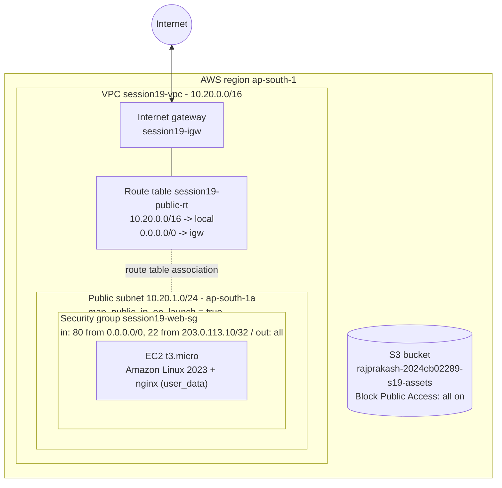

The subnet is "public" because of the route table, not because of anything on the subnet
itself. Its route table has `0.0.0.0/0 -> internet gateway`. The instance also needs a public
IP (`map_public_ip_on_launch`) and a security group that allows the traffic in. Remove any
one of the three and the instance cannot be reached from the internet. That answers the
mini-project's question 4.

SSH is not open to `0.0.0.0/0`. It is allowed only from `ssh_allowed_cidr`, which a
validation rule stops from being set to `0.0.0.0/0` (step 2). The value in
`terraform.tfvars`, `203.0.113.10/32`, is from the TEST-NET-3 documentation range, a
placeholder that matches no real machine. On real AWS it would be my own IP.

---

## Project files

| File | What it holds | Concept |
|---|---|---|
| [`versions.tf`](versions.tf) | `terraform {}` with `required_providers` (`hashicorp/aws ~> 6.0`), the `aws` provider and its `default_tags` | providers |
| [`variables.tf`](variables.tf) | 10 input variables. 6 have `validation` blocks | variables |
| [`terraform.tfvars`](terraform.tfvars) | Values for this run | variables |
| [`network.tf`](network.tf) | `data.aws_availability_zones`, VPC, subnet, IGW, route table, association, security group | resources, data sources, implicit dependencies |
| [`compute.tf`](compute.tf) | `data.aws_ami` (latest Amazon Linux 2023) and `aws_instance.web` with its `depends_on` | explicit dependency |
| [`storage.tf`](storage.tf) | S3 bucket and its public access block | resources |
| [`outputs.tf`](outputs.tf) | VPC / subnet / SG / instance IDs, AZ, AMI, public IP, URL, bucket name | outputs |
| [`emulator_override.tf`](emulator_override.tf) | **Emulator only:** dummy credentials and `ec2`/`s3`/`sts` endpoints for moto | |
| [`aws-emu.sh`](aws-emu.sh) | **Emulator only:** runs the real AWS CLI (Docker image `amazon/aws-cli`) against moto | |
| `.terraform.lock.hcl` | Provider version and hashes pinned by `init` | providers |
| [`.gitignore`](.gitignore) | `.terraform/`, `*.tfstate*`, `*.tfplan` | state hygiene |

Splitting the resources across `network.tf`, `compute.tf` and `storage.tf` is only for
reading. Terraform loads every `.tf` file in the folder as one configuration, and the file
names mean nothing to it.

### Running against the emulator

The full reasoning is in the [Session 18 write-up](../../session18-terraform-iac/task/README.md#running-against-an-emulator-not-aws).
In short, `emulator_override.tf` is merged into the provider block by Terraform's override-file
rule, and it is the only thing that points Terraform at `http://localhost:5050`. moto is
mapped to host port 5050 because macOS's AirPlay Receiver owns port 5000. I reset the
emulator (`POST /moto-api/reset`) before the recorded run so it started empty.

To check the resources independently of Terraform, I wanted the course's own `aws ec2
describe-...` commands. The AWS CLI is not installed on this machine, so
[`aws-emu.sh`](aws-emu.sh) runs it from the official image with dummy credentials. Inside
that container `localhost` would be the container itself, so the endpoint is
`host.docker.internal:5050`. On real AWS, replace `./aws-emu.sh` with `aws`.

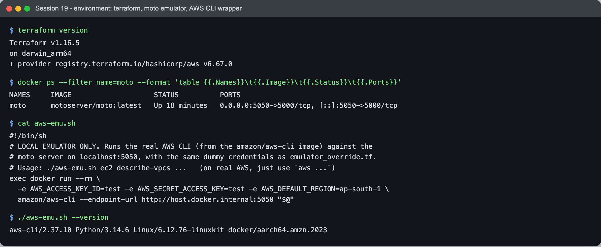

```text
$ terraform version
Terraform v1.16.5
on darwin_arm64
+ provider registry.terraform.io/hashicorp/aws v6.67.0

$ docker ps --filter name=moto --format 'table {{.Names}}\t{{.Image}}\t{{.Status}}\t{{.Ports}}'
NAMES     IMAGE                    STATUS          PORTS
moto      motoserver/moto:latest   Up 18 minutes   0.0.0.0:5050->5000/tcp, [::]:5050->5000/tcp

$ ./aws-emu.sh --version
aws-cli/2.37.10 Python/3.14.6 Linux/6.12.76-linuxkit docker/aarch64.amzn.2023
```

All `terraform` commands that print colour use `-no-color`, so the captured output has no
escape codes.

---

## 1. Provider: `terraform init`

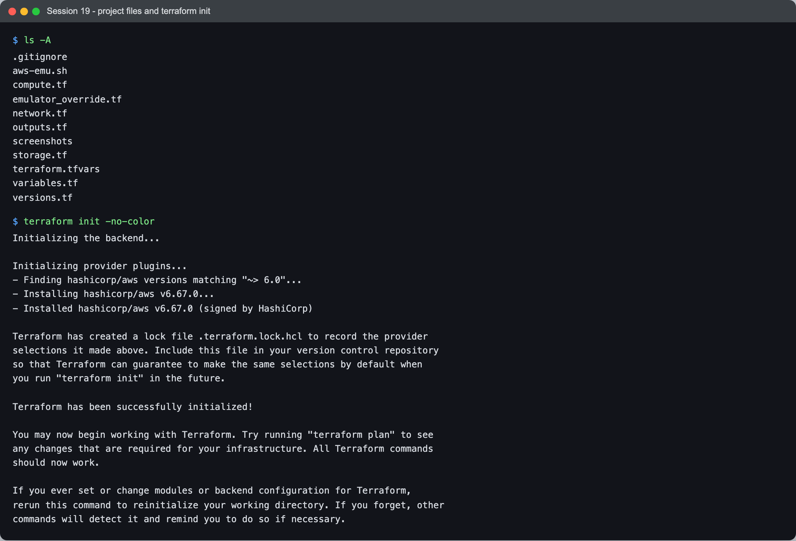

```text
$ terraform init -no-color
Initializing the backend...

Initializing provider plugins...
- Finding hashicorp/aws versions matching "~> 6.0"...
- Installing hashicorp/aws v6.67.0...
- Installed hashicorp/aws v6.67.0 (signed by HashiCorp)

Terraform has created a lock file .terraform.lock.hcl to record the provider
selections it made above. Include this file in your version control repository
so that Terraform can guarantee to make the same selections by default when
you run "terraform init" in the future.

Terraform has been successfully initialized!
```

The provider block sets the region and `default_tags`. Every taggable resource in the project
gets `Project`, `Environment`, `Owner`, `Session` and `ManagedBy` without a single tag being
repeated in the resource code.

## 2. Variables and validation rules

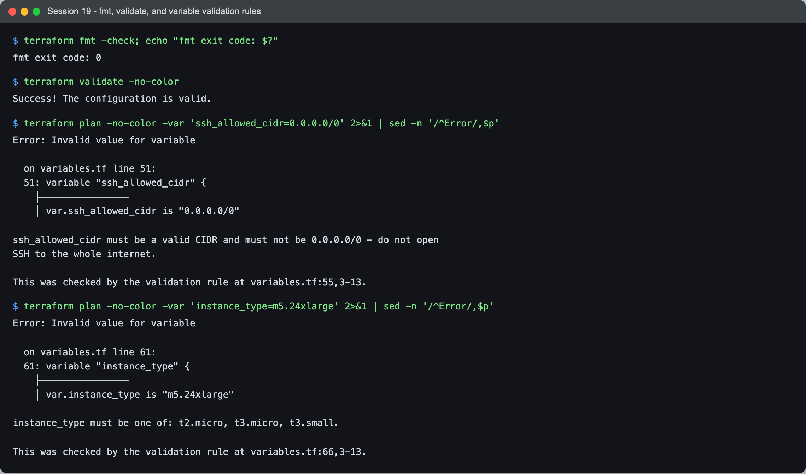

```text
$ terraform fmt -check; echo "fmt exit code: $?"
fmt exit code: 0

$ terraform validate -no-color
Success! The configuration is valid.

$ terraform plan -no-color -var 'ssh_allowed_cidr=0.0.0.0/0' 2>&1 | sed -n '/^Error/,$p'
Error: Invalid value for variable

  on variables.tf line 51:
  51: variable "ssh_allowed_cidr" {
    ├────────────────
    │ var.ssh_allowed_cidr is "0.0.0.0/0"

ssh_allowed_cidr must be a valid CIDR and must not be 0.0.0.0/0 - do not open
SSH to the whole internet.

This was checked by the validation rule at variables.tf:55,3-13.

$ terraform plan -no-color -var 'instance_type=m5.24xlarge' 2>&1 | sed -n '/^Error/,$p'
Error: Invalid value for variable

  on variables.tf line 61:
  61: variable "instance_type" {
    ├────────────────
    │ var.instance_type is "m5.24xlarge"

instance_type must be one of: t2.micro, t3.micro, t3.small.

This was checked by the validation rule at variables.tf:66,3-13.
```

The rules behind those two errors:

```hcl
variable "ssh_allowed_cidr" {
  type = string
  validation {
    condition     = can(cidrhost(var.ssh_allowed_cidr, 0)) && var.ssh_allowed_cidr != "0.0.0.0/0"
    error_message = "ssh_allowed_cidr must be a valid CIDR and must not be 0.0.0.0/0 - do not open SSH to the whole internet."
  }
}

variable "instance_type" {
  type    = string
  default = "t3.micro"
  validation {
    condition     = contains(["t2.micro", "t3.micro", "t3.small"], var.instance_type)
    error_message = "instance_type must be one of: t2.micro, t3.micro, t3.small."
  }
}
```

`can(cidrhost(x, 0))` is the usual trick for checking that a string is a CIDR block:
`cidrhost` fails on anything that is not one, and `can` turns that failure into `false`.

Notice that **`validate` passed** and the bad values were only caught by **`plan`**.
`validate` checks the code, not the values. It does not read `terraform.tfvars` or `-var`.
Validation rules run when Terraform has actual values, so a guardrail like "no SSH from
everywhere" is enforced at plan time, before anything is created.

## 3. `terraform plan`, saved to a file

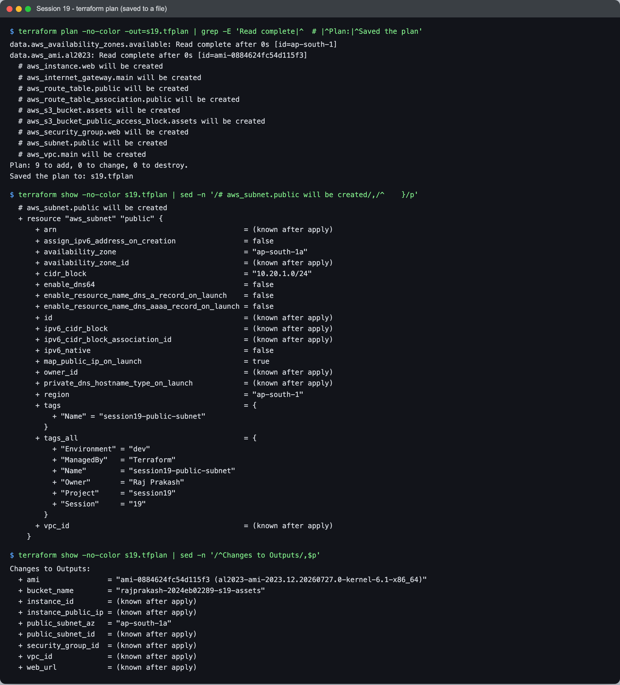

```text
$ terraform plan -no-color -out=s19.tfplan | grep -E 'Read complete|^  # |^Plan:|^Saved the plan'
data.aws_availability_zones.available: Read complete after 0s [id=ap-south-1]
data.aws_ami.al2023: Read complete after 0s [id=ami-0884624fc54d115f3]
  # aws_instance.web will be created
  # aws_internet_gateway.main will be created
  # aws_route_table.public will be created
  # aws_route_table_association.public will be created
  # aws_s3_bucket.assets will be created
  # aws_s3_bucket_public_access_block.assets will be created
  # aws_security_group.web will be created
  # aws_subnet.public will be created
  # aws_vpc.main will be created
Plan: 9 to add, 0 to change, 0 to destroy.
Saved the plan to: s19.tfplan
```

The two **data sources were read during the plan**, before anything was created. They
only read existing things (the AZ list and the AMI catalogue), so there is nothing to wait
for. The AMI is chosen by a filter, not hard-coded:

```hcl
data "aws_ami" "al2023" {
  most_recent = true
  owners      = ["amazon"]

  filter {
    name   = "name"
    values = ["al2023-ami-2023.*-x86_64"]
  }

  filter {
    name   = "architecture"
    values = ["x86_64"]
  }
}
```

On real AWS this finds the current Amazon Linux 2023 image in whichever region is
configured. Against moto it found one of moto's built-in images,
`ami-0884624fc54d115f3 (al2023-ami-2023.12.20260727.0-kernel-6.1-x86_64)`. That ID is fake and
exists only in the emulator, so I did not hard-code an emulator AMI ID anywhere.

The subnet's planned values show both kinds of value side by side:

```text
$ terraform show -no-color s19.tfplan | sed -n '/# aws_subnet.public will be created/,/^    }/p'
  # aws_subnet.public will be created
  + resource "aws_subnet" "public" {
      + arn                                            = (known after apply)
      + assign_ipv6_address_on_creation                = false
      + availability_zone                              = "ap-south-1a"
      + availability_zone_id                           = (known after apply)
      + cidr_block                                     = "10.20.1.0/24"
      ...
      + id                                             = (known after apply)
      ...
      + map_public_ip_on_launch                        = true
      ...
      + vpc_id                                         = (known after apply)
    }
```

(Lines marked `...` are trimmed here. They are in the screenshot.) `availability_zone` is
already `"ap-south-1a"`, because it came from the data source. `vpc_id` is `(known after
apply)`, because it is a reference to `aws_vpc.main.id`, and that VPC does not exist yet.
Every `(known after apply)` that comes from a reference is an **implicit dependency**:
Terraform cannot create the subnet until it has the VPC's ID.

`-out=s19.tfplan` saves the plan, and `terraform apply s19.tfplan` then applies exactly
that plan, with no second planning step and no prompt. This is the pattern the course
describes for CI/CD: review a plan, then apply the plan you reviewed.

## 4. `terraform apply`: the dependency order, live

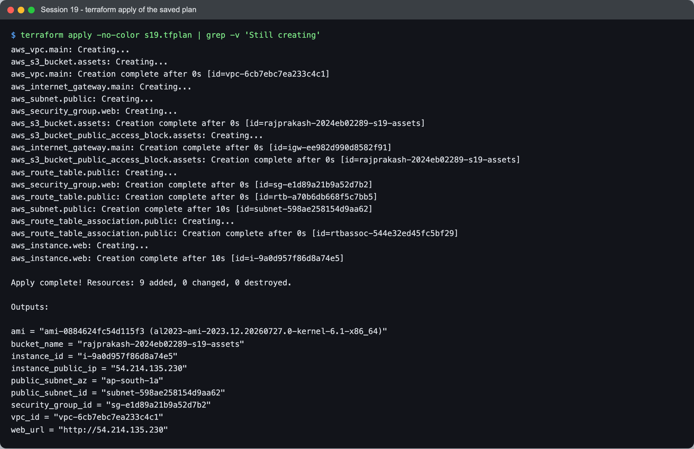

```text
$ terraform apply -no-color s19.tfplan | grep -v 'Still creating'
aws_vpc.main: Creating...
aws_s3_bucket.assets: Creating...
aws_vpc.main: Creation complete after 0s [id=vpc-6cb7ebc7ea233c4c1]
aws_internet_gateway.main: Creating...
aws_subnet.public: Creating...
aws_security_group.web: Creating...
aws_s3_bucket.assets: Creation complete after 0s [id=rajprakash-2024eb02289-s19-assets]
aws_s3_bucket_public_access_block.assets: Creating...
aws_internet_gateway.main: Creation complete after 0s [id=igw-ee982d990d8582f91]
aws_s3_bucket_public_access_block.assets: Creation complete after 0s [id=rajprakash-2024eb02289-s19-assets]
aws_route_table.public: Creating...
aws_security_group.web: Creation complete after 0s [id=sg-e1d89a21b9a52d7b2]
aws_route_table.public: Creation complete after 0s [id=rtb-a70b6db668f5c7bb5]
aws_subnet.public: Creation complete after 10s [id=subnet-598ae258154d9aa62]
aws_route_table_association.public: Creating...
aws_route_table_association.public: Creation complete after 0s [id=rtbassoc-544e32ed45fc5bf29]
aws_instance.web: Creating...
aws_instance.web: Creation complete after 10s [id=i-9a0d957f86d8a74e5]

Apply complete! Resources: 9 added, 0 changed, 0 destroyed.

Outputs:

ami = "ami-0884624fc54d115f3 (al2023-ami-2023.12.20260727.0-kernel-6.1-x86_64)"
bucket_name = "rajprakash-2024eb02289-s19-assets"
instance_id = "i-9a0d957f86d8a74e5"
instance_public_ip = "54.214.135.230"
public_subnet_az = "ap-south-1a"
public_subnet_id = "subnet-598ae258154d9aa62"
security_group_id = "sg-e1d89a21b9a52d7b2"
vpc_id = "vpc-6cb7ebc7ea233c4c1"
web_url = "http://54.214.135.230"
```

Reading it top to bottom:

1. **`aws_vpc.main` and `aws_s3_bucket.assets` start together.** The bucket shares nothing
   with the network, so the configuration is really two independent graphs, and Terraform
   works on both at once.
2. As soon as the VPC has an ID, **the IGW, subnet and security group start in parallel**.
   All three reference only `aws_vpc.main.id`.
3. **The route table starts only after the IGW**, because its route references
   `aws_internet_gateway.main.id`.
4. **The association waits for both the subnet and the route table.** The subnet was the
   slow one (10 s).
5. **The instance starts last**, after the association. That is the explicit `depends_on`
   (section 8). Without it, the instance would have started as soon as the subnet and
   security group existed.

Nowhere did I write an order. It all comes from references.

## 5. Re-plan: the same emulator gap as Session 18

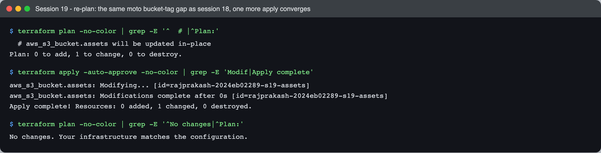

```text
$ terraform plan -no-color | grep -E '^  # |^Plan:'
  # aws_s3_bucket.assets will be updated in-place
Plan: 0 to add, 1 to change, 0 to destroy.

$ terraform apply -auto-approve -no-color | grep -E 'Modif|Apply complete'
aws_s3_bucket.assets: Modifying... [id=rajprakash-2024eb02289-s19-assets]
aws_s3_bucket.assets: Modifications complete after 0s [id=rajprakash-2024eb02289-s19-assets]
Apply complete! Resources: 0 added, 1 changed, 0 destroyed.

$ terraform plan -no-color | grep -E '^No changes|^Plan:'
No changes. Your infrastructure matches the configuration.
```

The bucket's tags again. Provider v6 sends them inside `CreateBucket`, and moto ignores them
there ([details in Session 18](../../session18-terraform-iac/task/README.md#problems-i-hit)).
The second apply sets them with `PutBucketTagging`. All seven EC2/VPC resources were clean on
the first try. From here on, a plan with no changes is the baseline for the experiments in
section 9.

## 6. Checking the resources with the AWS CLI

These are the course's `describe-*` verification commands, run through `aws-emu.sh`.

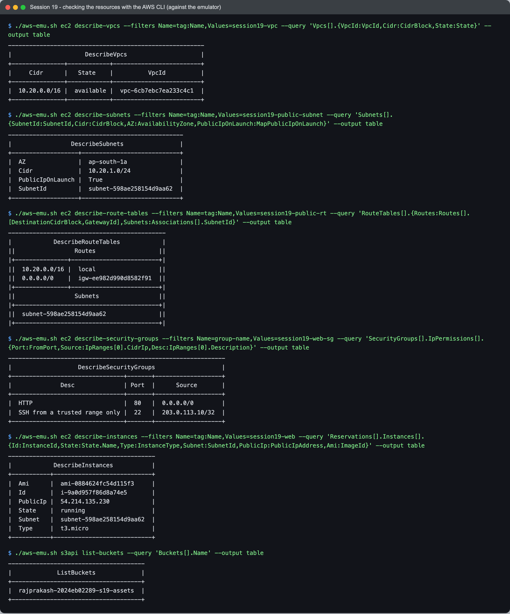

```text
$ ./aws-emu.sh ec2 describe-vpcs --filters Name=tag:Name,Values=session19-vpc --query 'Vpcs[].{VpcId:VpcId,Cidr:CidrBlock,State:State}' --output table
--------------------------------------------------------
|                     DescribeVpcs                     |
+---------------+------------+-------------------------+
|     Cidr      |   State    |          VpcId          |
+---------------+------------+-------------------------+
|  10.20.0.0/16 |  available |  vpc-6cb7ebc7ea233c4c1  |
+---------------+------------+-------------------------+

$ ./aws-emu.sh ec2 describe-route-tables --filters Name=tag:Name,Values=session19-public-rt --query 'RouteTables[].{Routes:Routes[].[DestinationCidrBlock,GatewayId],Subnets:Associations[].SubnetId}' --output table
---------------------------------------------
|            DescribeRouteTables            |
||                 Routes                  ||
|+---------------+-------------------------+|
||  10.20.0.0/16 |  local                  ||
||  0.0.0.0/0    |  igw-ee982d990d8582f91  ||
|+---------------+-------------------------+|
||                 Subnets                 ||
|+-----------------------------------------+|
||  subnet-598ae258154d9aa62               ||
|+-----------------------------------------+|

$ ./aws-emu.sh ec2 describe-security-groups --filters Name=group-name,Values=session19-web-sg --query 'SecurityGroups[].IpPermissions[].{Port:FromPort,Source:IpRanges[0].CidrIp,Desc:IpRanges[0].Description}' --output table
--------------------------------------------------------------
|                   DescribeSecurityGroups                   |
+--------------------------------+-------+-------------------+
|              Desc              | Port  |      Source       |
+--------------------------------+-------+-------------------+
|  HTTP                          |  80   |  0.0.0.0/0        |
|  SSH from a trusted range only |  22   |  203.0.113.10/32  |
+--------------------------------+-------+-------------------+

$ ./aws-emu.sh ec2 describe-instances --filters Name=tag:Name,Values=session19-web --query 'Reservations[].Instances[].{Id:InstanceId,State:State.Name,Type:InstanceType,Subnet:SubnetId,PublicIp:PublicIpAddress,Ami:ImageId}' --output table
------------------------------------------
|            DescribeInstances           |
+-----------+----------------------------+
|  Ami      |  ami-0884624fc54d115f3     |
|  Id       |  i-9a0d957f86d8a74e5       |
|  PublicIp |  54.214.135.230            |
|  State    |  running                   |
|  Subnet   |  subnet-598ae258154d9aa62  |
|  Type     |  t3.micro                  |
+-----------+----------------------------+
```

(The screenshot also has `describe-subnets`, showing `10.20.1.0/24`, `ap-south-1a`,
`PublicIpOnLaunch True`, and `s3api list-buckets`, showing the bucket.)

The IDs match the Terraform outputs. The route table has **two** routes. I wrote one, the
`0.0.0.0/0 -> igw`. The `10.20.0.0/16 -> local` route is added automatically to every route
table in a VPC, and it is what lets subnets in the same VPC talk to each other. The
instance landed in the right subnet, with the AMI from the data source and a public IP.

Note that nginx is not actually running anywhere. moto records the instance and its
`user_data` but does not boot a VM, so `web_url` only means something on real AWS.

## 7. Terraform state

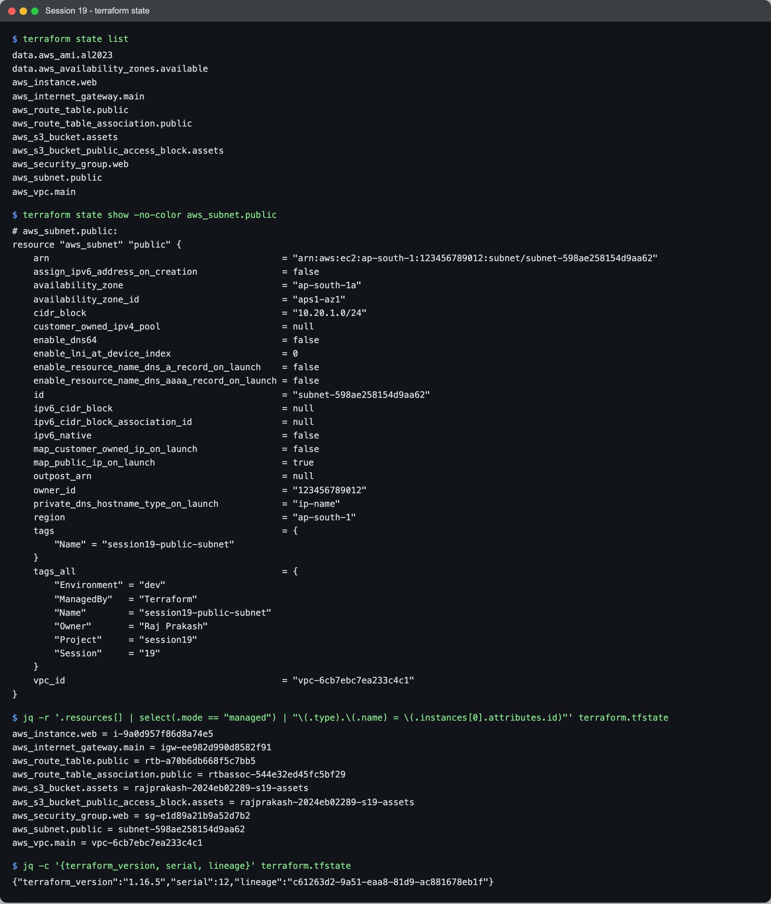

```text
$ terraform state list
data.aws_ami.al2023
data.aws_availability_zones.available
aws_instance.web
aws_internet_gateway.main
aws_route_table.public
aws_route_table_association.public
aws_s3_bucket.assets
aws_s3_bucket_public_access_block.assets
aws_security_group.web
aws_subnet.public
aws_vpc.main

$ terraform state show -no-color aws_subnet.public
# aws_subnet.public:
resource "aws_subnet" "public" {
    arn                                            = "arn:aws:ec2:ap-south-1:123456789012:subnet/subnet-598ae258154d9aa62"
    ...
    availability_zone                              = "ap-south-1a"
    availability_zone_id                           = "aps1-az1"
    cidr_block                                     = "10.20.1.0/24"
    ...
    id                                             = "subnet-598ae258154d9aa62"
    ...
    map_public_ip_on_launch                        = true
    ...
    owner_id                                       = "123456789012"
    ...
    vpc_id                                         = "vpc-6cb7ebc7ea233c4c1"
}

$ jq -r '.resources[] | select(.mode == "managed") | "\(.type).\(.name) = \(.instances[0].attributes.id)"' terraform.tfstate
aws_instance.web = i-9a0d957f86d8a74e5
aws_internet_gateway.main = igw-ee982d990d8582f91
aws_route_table.public = rtb-a70b6db668f5c7bb5
aws_route_table_association.public = rtbassoc-544e32ed45fc5bf29
aws_s3_bucket.assets = rajprakash-2024eb02289-s19-assets
aws_s3_bucket_public_access_block.assets = rajprakash-2024eb02289-s19-assets
aws_security_group.web = sg-e1d89a21b9a52d7b2
aws_subnet.public = subnet-598ae258154d9aa62
aws_vpc.main = vpc-6cb7ebc7ea233c4c1

$ jq -c '{terraform_version, serial, lineage}' terraform.tfstate
{"terraform_version":"1.16.5","serial":12,"lineage":"c61263d2-9a51-eaa8-81d9-ac881678eb1f"}
```

(`state show` is trimmed here with `...`. The screenshot has every attribute.)

- **The state file is where the IDs live.** `aws_vpc.main = vpc-6cb7ebc7ea233c4c1` is the same
  ID that `describe-vpcs` returned in section 6. The `.tf` files say what should exist, and
  only the state says *which* real VPC is "`aws_vpc.main`". Delete the state and Terraform
  would plan to create a second VPC, leaving the first one orphaned.
- **The subnet's `vpc_id` is stored as a concrete value.** The `(known after apply)` from the
  plan has been filled in with `vpc-6cb7ebc7ea233c4c1`.
- **Data sources are in the state too**, which is why `state list` shows them, but as
  read-only `data.` entries. Terraform never creates or destroys them.
- **`serial` and `lineage`.** `serial` goes up every time Terraform writes a new version of
  the state. Two applies took it to 12. `lineage` is fixed when a state is first
  created, and it stops Terraform from overwriting one state with a copy from a different
  history. Both matter once state moves to a shared remote backend.
- `owner_id = "123456789012"` is moto's built-in fake account number. A real account ID
  would show there on AWS.

## 8. Dependencies and `terraform graph`

### Implicit vs explicit

Almost every dependency in this project is **implicit**. A reference such as
`vpc_id = aws_vpc.main.id` both passes a value and tells Terraform about an ordering.
There is one **explicit** dependency, on the instance:

```hcl
resource "aws_instance" "web" {
  ami                    = data.aws_ami.al2023.id
  subnet_id              = aws_subnet.public.id
  vpc_security_group_ids = [aws_security_group.web.id]
  # user_data: a first-boot script that runs `dnf install -y nginx` (see compute.tf)
  ...
  depends_on = [aws_route_table_association.public]
}
```

**Why:** the instance's `user_data` runs once at first boot and downloads nginx from the
internet. The instance references the subnet and the security group, but nothing about it
references the route table. As far as Terraform can tell from the code, it is free to
launch the instance at the same moment the `0.0.0.0/0` route is being attached to the subnet.
If the instance wins that race, `dnf install` fails at first boot and nobody notices until
the website is missing. The dependency is real but does not show up in any argument. That
is exactly the case `depends_on` exists for. The apply in section 4 shows the effect: the
instance started only after `aws_route_table_association.public: Creation complete`.

### The graph

`dot` (Graphviz) is not installed on this machine, so here is the raw output, and below it
the same graph drawn in Mermaid.

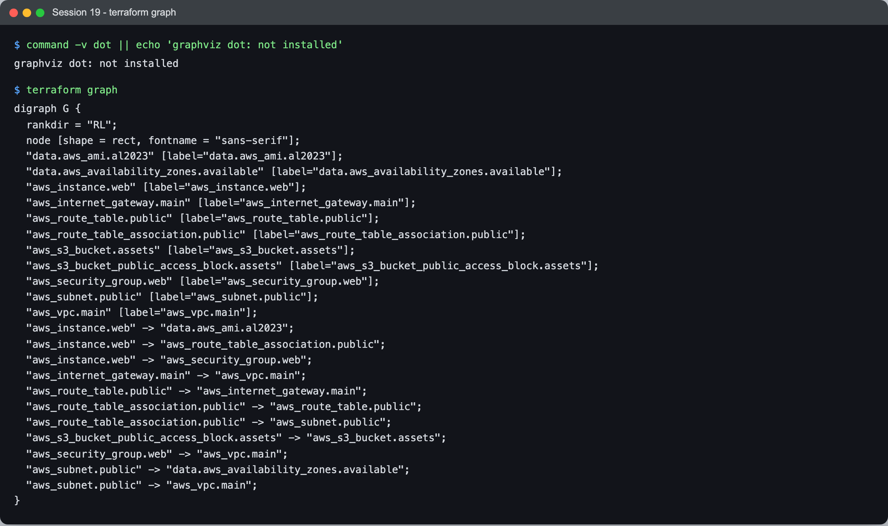

```text
$ command -v dot || echo 'graphviz dot: not installed'
graphviz dot: not installed

$ terraform graph
digraph G {
  rankdir = "RL";
  node [shape = rect, fontname = "sans-serif"];
  "data.aws_ami.al2023" [label="data.aws_ami.al2023"];
  "data.aws_availability_zones.available" [label="data.aws_availability_zones.available"];
  "aws_instance.web" [label="aws_instance.web"];
  "aws_internet_gateway.main" [label="aws_internet_gateway.main"];
  "aws_route_table.public" [label="aws_route_table.public"];
  "aws_route_table_association.public" [label="aws_route_table_association.public"];
  "aws_s3_bucket.assets" [label="aws_s3_bucket.assets"];
  "aws_s3_bucket_public_access_block.assets" [label="aws_s3_bucket_public_access_block.assets"];
  "aws_security_group.web" [label="aws_security_group.web"];
  "aws_subnet.public" [label="aws_subnet.public"];
  "aws_vpc.main" [label="aws_vpc.main"];
  "aws_instance.web" -> "data.aws_ami.al2023";
  "aws_instance.web" -> "aws_route_table_association.public";
  "aws_instance.web" -> "aws_security_group.web";
  "aws_internet_gateway.main" -> "aws_vpc.main";
  "aws_route_table.public" -> "aws_internet_gateway.main";
  "aws_route_table_association.public" -> "aws_route_table.public";
  "aws_route_table_association.public" -> "aws_subnet.public";
  "aws_s3_bucket_public_access_block.assets" -> "aws_s3_bucket.assets";
  "aws_security_group.web" -> "aws_vpc.main";
  "aws_subnet.public" -> "data.aws_availability_zones.available";
  "aws_subnet.public" -> "aws_vpc.main";
}
```

The same 11 nodes and 11 edges, drawn by hand in Mermaid. An arrow means "depends on",
the same direction Terraform uses. The dashed edge is the `depends_on`.

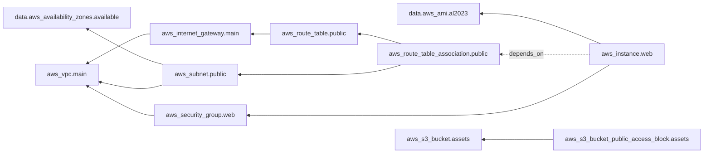

**Edges I expected but are not there:**

- `aws_route_table.public -> aws_vpc.main`, even though the route table has
  `vpc_id = aws_vpc.main.id`.
- `aws_instance.web -> aws_subnet.public`, even though the instance has
  `subnet_id = aws_subnet.public.id`.

By default, `terraform graph` prints a simplified graph that drops any edge already implied by
a longer path (a transitive reduction). The route table reaches the VPC through
the IGW, so the direct edge is redundant. The instance reaches the subnet through the
association, because of the `depends_on`. To confirm it really was the `depends_on`
hiding that edge, I deleted the `depends_on` line in a scratch copy of the project and ran
the graph again:

```text
--- without depends_on:
  "aws_instance.web" -> "data.aws_ami.al2023";
  "aws_instance.web" -> "aws_security_group.web";
  "aws_instance.web" -> "aws_subnet.public";
--- with depends_on:
  "aws_instance.web" -> "data.aws_ami.al2023";
  "aws_instance.web" -> "aws_route_table_association.public";
  "aws_instance.web" -> "aws_security_group.web";
```

Without `depends_on`, the instance hangs directly off the subnet. With it, the instance
hangs off the association, and the subnet edge disappears because it is implied. So the
missing edge is a sign that the explicit dependency worked.

## 9. A change, re-planned: update in place vs replacement

Both experiments pass new values with `-var` rather than editing `terraform.tfvars`, so the
committed files stay as they are and the screenshot shows exactly what changed.

### Change a tag: update in place

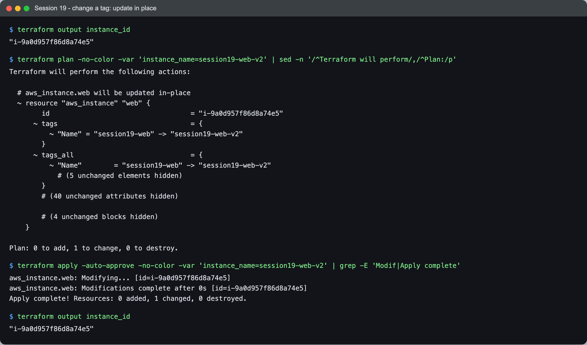

```text
$ terraform output instance_id
"i-9a0d957f86d8a74e5"

$ terraform plan -no-color -var 'instance_name=session19-web-v2' | sed -n '/^Terraform will perform/,/^Plan:/p'
Terraform will perform the following actions:

  # aws_instance.web will be updated in-place
  ~ resource "aws_instance" "web" {
        id                                   = "i-9a0d957f86d8a74e5"
      ~ tags                                 = {
          ~ "Name" = "session19-web" -> "session19-web-v2"
        }
      ~ tags_all                             = {
          ~ "Name"        = "session19-web" -> "session19-web-v2"
            # (5 unchanged elements hidden)
        }
        # (40 unchanged attributes hidden)

        # (4 unchanged blocks hidden)
    }

Plan: 0 to add, 1 to change, 0 to destroy.

$ terraform apply -auto-approve -no-color -var 'instance_name=session19-web-v2' | grep -E 'Modif|Apply complete'
aws_instance.web: Modifying... [id=i-9a0d957f86d8a74e5]
aws_instance.web: Modifications complete after 0s [id=i-9a0d957f86d8a74e5]
Apply complete! Resources: 0 added, 1 changed, 0 destroyed.

$ terraform output instance_id
"i-9a0d957f86d8a74e5"
```

`~` means update in place. `id` is printed **without** an arrow, which means it will not
change, and after the apply the instance ID is the same `i-9a0d957f86d8a74e5`. Tags can be
changed on a live resource through the API (`CreateTags`), so Terraform just does that.

### Change the subnet CIDR: forces replacement

`instance_name=session19-web-v2` is passed again so that the CIDR is the *only* new change.

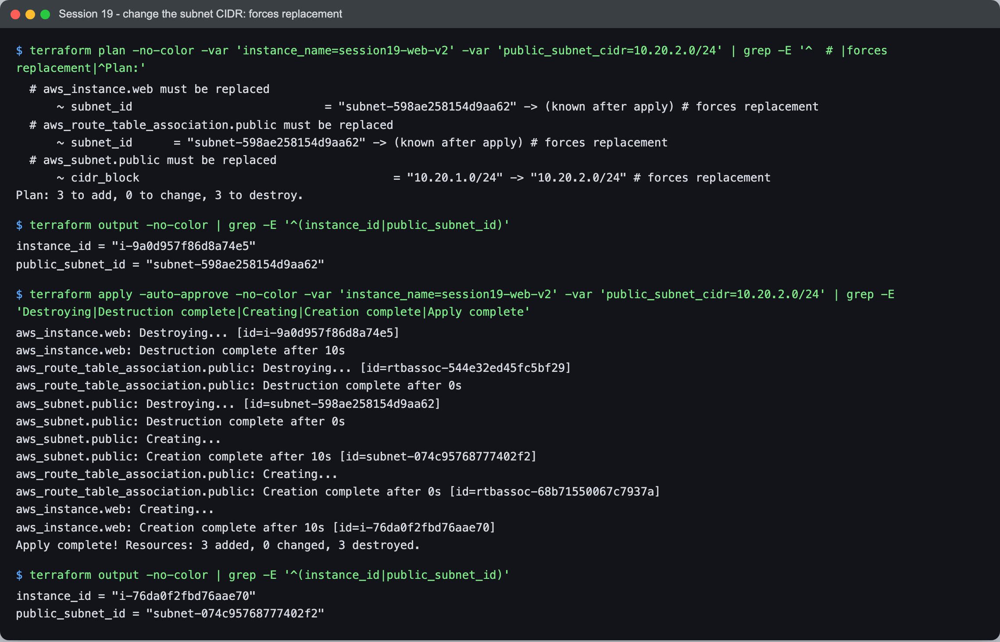

```text
$ terraform plan -no-color -var 'instance_name=session19-web-v2' -var 'public_subnet_cidr=10.20.2.0/24' | grep -E '^  # |forces replacement|^Plan:'
  # aws_instance.web must be replaced
      ~ subnet_id                            = "subnet-598ae258154d9aa62" -> (known after apply) # forces replacement
  # aws_route_table_association.public must be replaced
      ~ subnet_id      = "subnet-598ae258154d9aa62" -> (known after apply) # forces replacement
  # aws_subnet.public must be replaced
      ~ cidr_block                                     = "10.20.1.0/24" -> "10.20.2.0/24" # forces replacement
Plan: 3 to add, 0 to change, 3 to destroy.

$ terraform output -no-color | grep -E '^(instance_id|public_subnet_id)'
instance_id = "i-9a0d957f86d8a74e5"
public_subnet_id = "subnet-598ae258154d9aa62"

$ terraform apply -auto-approve -no-color -var 'instance_name=session19-web-v2' -var 'public_subnet_cidr=10.20.2.0/24' | grep -E 'Destroying|Destruction complete|Creating|Creation complete|Apply complete'
aws_instance.web: Destroying... [id=i-9a0d957f86d8a74e5]
aws_instance.web: Destruction complete after 10s
aws_route_table_association.public: Destroying... [id=rtbassoc-544e32ed45fc5bf29]
aws_route_table_association.public: Destruction complete after 0s
aws_subnet.public: Destroying... [id=subnet-598ae258154d9aa62]
aws_subnet.public: Destruction complete after 0s
aws_subnet.public: Creating...
aws_subnet.public: Creation complete after 10s [id=subnet-074c95768777402f2]
aws_route_table_association.public: Creating...
aws_route_table_association.public: Creation complete after 0s [id=rtbassoc-68b71550067c7937a]
aws_instance.web: Creating...
aws_instance.web: Creation complete after 10s [id=i-76da0f2fbd76aae70]
Apply complete! Resources: 3 added, 0 changed, 3 destroyed.

$ terraform output -no-color | grep -E '^(instance_id|public_subnet_id)'
instance_id = "i-76da0f2fbd76aae70"
public_subnet_id = "subnet-074c95768777402f2"
```

**One changed value replaced three resources.**

- `cidr_block = "10.20.1.0/24" -> "10.20.2.0/24" # forces replacement`. AWS has no API to change
  an existing subnet's CIDR. The provider marks `cidr_block` as a "force new" argument, so
  the only way to apply the change is to delete the subnet and create another.
- The new subnet gets a new ID. `subnet_id` on the association and on the instance is
  *also* force-new: an instance cannot move to a different subnet. So both show
  `subnet_id = ... -> (known after apply) # forces replacement` and are replaced too. The
  plan does not show the new subnet ID itself, only that there will be one.
- The default order is **destroy, then create**. The instance went first, then the
  association, then the subnet, and they were rebuilt in reverse. On real AWS that means the
  web server is down for the whole window. `lifecycle { create_before_destroy = true }`
  reverses the order. I did not use it here.
- The result: **new subnet ID, new instance ID** (`i-9a0d957f86d8a74e5` -> `i-76da0f2fbd76aae70`).
  A new instance also gets a new public IP. Anything that remembered the old IP or ID is
  now wrong.

A one-line edit in a `.tf` file can be harmless (the tag) or destructive (the CIDR), and
the diff of the code looks just as small either way. The only way to tell is to read the plan,
and the words to look for are **`must be replaced`** and **`# forces replacement`**.

## 10. `terraform destroy`

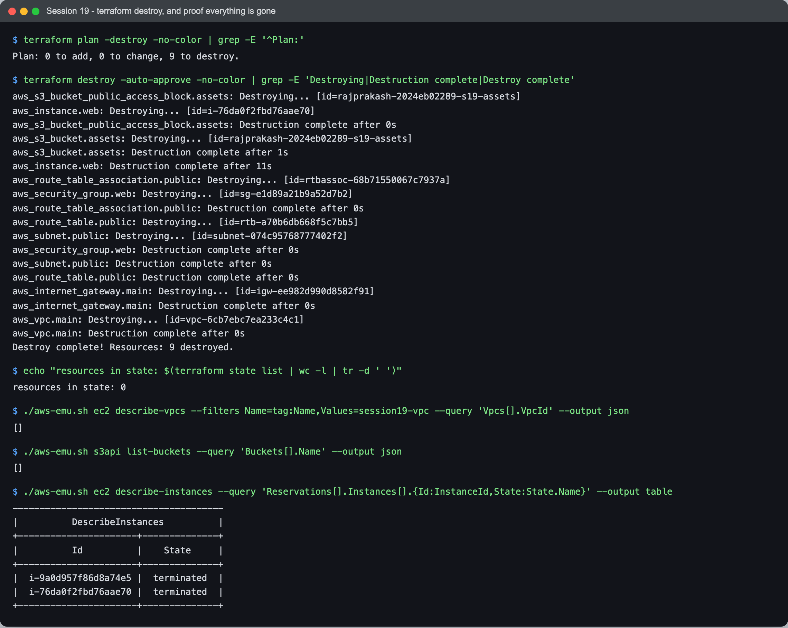

```text
$ terraform plan -destroy -no-color | grep -E '^Plan:'
Plan: 0 to add, 0 to change, 9 to destroy.

$ terraform destroy -auto-approve -no-color | grep -E 'Destroying|Destruction complete|Destroy complete'
aws_s3_bucket_public_access_block.assets: Destroying... [id=rajprakash-2024eb02289-s19-assets]
aws_instance.web: Destroying... [id=i-76da0f2fbd76aae70]
aws_s3_bucket_public_access_block.assets: Destruction complete after 0s
aws_s3_bucket.assets: Destroying... [id=rajprakash-2024eb02289-s19-assets]
aws_s3_bucket.assets: Destruction complete after 1s
aws_instance.web: Destruction complete after 11s
aws_route_table_association.public: Destroying... [id=rtbassoc-68b71550067c7937a]
aws_security_group.web: Destroying... [id=sg-e1d89a21b9a52d7b2]
aws_route_table_association.public: Destruction complete after 0s
aws_route_table.public: Destroying... [id=rtb-a70b6db668f5c7bb5]
aws_subnet.public: Destroying... [id=subnet-074c95768777402f2]
aws_security_group.web: Destruction complete after 0s
aws_subnet.public: Destruction complete after 0s
aws_route_table.public: Destruction complete after 0s
aws_internet_gateway.main: Destroying... [id=igw-ee982d990d8582f91]
aws_internet_gateway.main: Destruction complete after 0s
aws_vpc.main: Destroying... [id=vpc-6cb7ebc7ea233c4c1]
aws_vpc.main: Destruction complete after 0s
Destroy complete! Resources: 9 destroyed.

$ echo "resources in state: $(terraform state list | wc -l | tr -d ' ')"
resources in state: 0

$ ./aws-emu.sh ec2 describe-vpcs --filters Name=tag:Name,Values=session19-vpc --query 'Vpcs[].VpcId' --output json
[]

$ ./aws-emu.sh s3api list-buckets --query 'Buckets[].Name' --output json
[]

$ ./aws-emu.sh ec2 describe-instances --query 'Reservations[].Instances[].{Id:InstanceId,State:State.Name}' --output table
---------------------------------------
|          DescribeInstances          |
+----------------------+--------------+
|          Id          |    State     |
+----------------------+--------------+
|  i-9a0d957f86d8a74e5 |  terminated  |
|  i-76da0f2fbd76aae70 |  terminated  |
+----------------------+--------------+
```

Destroy walks the graph backwards. The **security group and the association only start
deleting after the instance is gone**, 11 seconds in, because the instance depends on them.
The bucket branch, which is independent, finished long before. The VPC goes last.

The two instances are still *listed* after destroy, both in state `terminated`: the original
and the one created by the replacement in section 9. AWS also keeps terminated instances
visible for a while, and they cost nothing. A terminated instance is not a leftover
resource. A listing like this one is not proof that something was left running. The state
column is what tells you.

---

## What I learned

- **References are the dependency graph.** I never wrote an order, yet the apply ran the VPC
  first, three resources in parallel, the route table after the IGW, the association after
  both, and the bucket in a separate track entirely. Destroy ran the same graph backwards.
- **`depends_on` is for dependencies that do not show up in an argument.** The instance has no
  argument that mentions the route table, but its `user_data` needs that route at first
  boot. Terraform cannot read a shell script, so the requirement has to be stated.
- **`terraform graph` is simplified.** It drops edges implied by longer paths, so a missing
  edge does not mean a missing dependency. Removing `depends_on` in a scratch copy and
  diffing the graph was the quickest way to see what it actually changed.
- **`validate` checks code; validation rules check values.** The `0.0.0.0/0` SSH rule passed
  `validate` and failed `plan`. Validation rules are a cheap guardrail for exactly the
  mistakes the course warns about: SSH open to the world, or a typo in an instance type
  that costs real money.
- **Update in place vs replace is decided by the provider schema, not by how big the edit
  looks.** A tag is mutable. A subnet's CIDR is not. Replacement then spreads to everything
  whose force-new arguments point at the replaced resource. `# forces replacement` is the
  line to look for in every plan.
- **State is the only link between `aws_vpc.main` and `vpc-6cb7ebc7ea233c4c1`.** It also
  stores every value that was `(known after apply)` at plan time.
- **Data sources make code portable.** The AMI ID and the AZ name are looked up, not pasted,
  so the same code works in any region. It also meant I never had to hard-code a fake
  emulator AMI ID.
- **A saved plan (`-out` + `apply plan.tfplan`) applies exactly what was reviewed.**

## Problems I hit

- **My first "change a tag" experiment was not a tag-only change, and it broke against the
  emulator.** The first version of `user_data` used the instance's name in the welcome page
  (`echo "Hello from ${var.instance_name} ..."`). So renaming the instance also changed the
  user data, and the plan showed more than a tag:

  ```text
    # aws_instance.web will be updated in-place
    ~ resource "aws_instance" "web" {
          id                                   = "i-e20a730564cf4add6"
        ~ public_dns                           = "ec2-54-214-202-222.ap-south-1.compute.amazonaws.com" -> (known after apply)
        ~ public_ip                            = "54.214.202.222" -> (known after apply)
        ~ tags                                 = {
            ~ "Name" = "session19-web" -> "session19-web-v2"
          }
        ...
        ~ user_data                            = <<-EOT
              #!/bin/bash
              dnf install -y nginx
            - echo "Hello from session19-web - built by Terraform" > /usr/share/nginx/html/index.html
            + echo "Hello from session19-web-v2 - built by Terraform" > /usr/share/nginx/html/index.html
              systemctl enable --now nginx
          EOT
  ```

  `public_ip -> (known after apply)` was the hint. User data can only be changed while an
  instance is stopped, so the provider stops it, changes it, and starts it again, and on AWS
  a stop/start gives the instance a new public IP. Applying it against the emulator with a
  debug log confirmed the stop, and then failed:

  ```text
  Error: updating EC2 Instance (i-d421465d6de23e479) user data: modifying EC2 Instance (i-d421465d6de23e479) UserData attribute: operation error EC2: ModifyInstanceAttribute, https response error StatusCode: 400, RequestID: FjygoKEMQQAdtpuiBZ709NMAMM7fZYiEkHOMTAuBkYfjaLd5QJ0j, api error InvalidUserData.Malformed: Invalid BASE64 encoding of user data.

  $ grep -oE 'rpc.method=EC2/[A-Za-z]+' s19-ud.log | sort | uniq -c | grep -E 'Stop|Start|ModifyInstanceAttribute|CreateTags'
     3 rpc.method=EC2/CreateTags
     4 rpc.method=EC2/ModifyInstanceAttribute
     3 rpc.method=EC2/StopInstances
  ```

  So there were two problems. On real AWS, a rename would have rebooted the web server and
  changed its IP. On moto, the user-data update is rejected outright (a second emulator gap).
  The fix for both was the same: keep values that change often out of `user_data`. It now
  uses `var.project_name`. A rename is a pure tag change, which is what section 9 shows, and
  user data runs only at first boot anyway, so changing it never re-ran the script.

- **The graph looked like it had lost a dependency.** `aws_instance.web -> aws_subnet.public`
  was missing even though `subnet_id = aws_subnet.public.id` is right there in the code. I
  first suspected I had broken the reference. It was the transitive reduction described in
  section 8, and the scratch-copy test with `depends_on` removed is what convinced me.

- **The bucket tag drift again** (section 5). I already knew the cause from Session 18, so
  this time the fix was a deliberate second apply and a clean third plan rather than an
  investigation. I kept it visible instead of hiding the second apply.

- **Port 5000 was taken by macOS AirPlay Receiver**, the same as in Session 18, so moto runs on
  host port 5050.
