# Session 2 — Linux — Tasks

- **Name:** Raj Prakash
- **Enrollment No:** 24BCS10328

> **Status:** done. All four tasks: (1) hard vs soft links, (2) `useradd` vs `adduser`,
> (3) `journalctl`, (4) the Linux command cheat sheets.
>
> My machine is a Mac (Apple Silicon), so there is no `useradd`, no `/etc/passwd` in the
> Linux sense and no `ls -li` inode semantics to demonstrate. I ran everything in an
> **Ubuntu 24.04.4 LTS** container on Docker Desktop instead — kernel
> `6.12.76-linuxkit aarch64`, hostname `linux-lab`:
>
> ```bash
> docker run -d --name linux-lab --hostname linux-lab ubuntu:24.04 sleep infinity
> docker exec -it linux-lab bash
> ```
>
> That is real Linux running a real kernel, so the inode and user-management behaviour
> below is genuine, not simulated.
>
> Task 3 needs systemd, and this container's PID 1 is `sleep infinity`, so for that task
> I built a second container, `journal-lab`, that boots real systemd (details in Task 3).
> I also read the journal of a node in my kind cluster, read-only.

---

## Task 1: Hard links vs soft links

### What the task asked

Explain hard links and symbolic links, create one of each, compare their inode numbers,
then delete the original file and see what happens to each link.

### Commands

```bash
mkdir -p /root/session2-task && cd /root/session2-task
echo 'This is the original file content.' > file1.txt
ln    file1.txt hardlink.txt      # hard link
ln -s file1.txt softlink.txt      # soft link (symbolic)
```

### Output

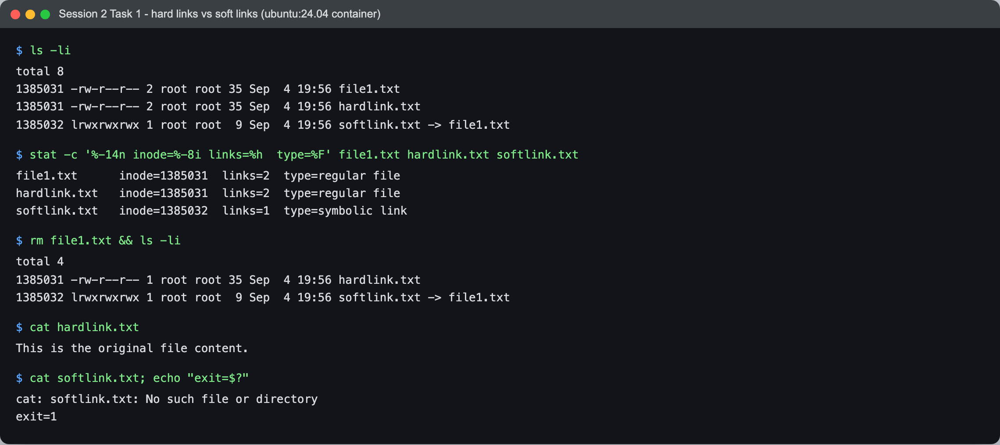

Before deleting anything:

```text
$ ls -li
total 8
1385031 -rw-r--r-- 2 root root 35 Sep  4 19:56 file1.txt
1385031 -rw-r--r-- 2 root root 35 Sep  4 19:56 hardlink.txt
1385032 lrwxrwxrwx 1 root root  9 Sep  4 19:56 softlink.txt -> file1.txt

$ stat -c '%-14n inode=%-8i links=%h  type=%F' file1.txt hardlink.txt softlink.txt
file1.txt      inode=1385031  links=2  type=regular file
hardlink.txt   inode=1385031  links=2  type=regular file
softlink.txt   inode=1385032  links=1  type=symbolic link
```

Three things to read off this:

- `file1.txt` and `hardlink.txt` both sit on **inode 1385031** and both report a link count
  of **2**. They are not an original and a copy — they are two directory entries pointing
  at one inode. Neither is "the real one".
- `softlink.txt` has **its own inode (1385032)** and a link count of 1. It is a separate
  file.
- The symlink's size is **9 bytes**, which is exactly `len("file1.txt")`. That is the whole
  content of a symlink: the target path as text. It stores a name, not a reference to data.

### Now delete the original

```text
$ rm file1.txt && ls -li
total 4
1385031 -rw-r--r-- 1 root root 35 Sep  4 19:56 hardlink.txt
1385032 lrwxrwxrwx 1 root root  9 Sep  4 19:56 softlink.txt -> file1.txt

$ cat hardlink.txt
This is the original file content.

$ cat softlink.txt; echo "exit=$?"
cat: softlink.txt: No such file or directory
exit=1
```

The hard link's count went **2 → 1** and the data is still readable. The symlink still
exists as a file — `ls` lists it fine — but it now points at a name nothing answers to. A
dangling symlink.

The interesting part is what this says about `rm`. It did not "delete the file". It removed
one directory entry and decremented the inode's link count. The data blocks are only freed
when that count hits zero, which is why `hardlink.txt` still works. `file1.txt` was never
the file; it was one of the file's two names.

### Comparison

| | Hard link | Soft link |
|---|---|---|
| Points at | the **inode** | a **path string** |
| Has its own inode? | no, shares one | yes |
| Survives deleting the original | **yes** | no — dangles |
| Can cross filesystems | no | yes |
| Can point at a directory | no (not normally) | yes |
| `ls -l` shows | `-rw-r--r--` | `lrwxrwxrwx ... -> target` |
| Size | size of the data | length of the target path |

### Interview answer

*What is the difference between a soft link and a hard link?*

A hard link is another directory entry for the same inode, so it is indistinguishable from
the original and keeps the data alive as long as it exists — the inode is freed only when
its link count reaches zero. A soft link is a small separate file whose content is a path,
resolved at access time, so it breaks if the target is moved or deleted — but it can cross
filesystems and can point at a directory, which a hard link cannot.

---

## Task 2: `useradd` vs `adduser`

### What the task asked

Compare the two ways of creating a user.

### Commands

```bash
useradd tu-useradd
adduser --disabled-password --gecos '' tu-adduser
```

`adduser` normally prompts for a password and full name. The two flags make it
non-interactive so the run is reproducible; they do not change what it sets up.

### Output

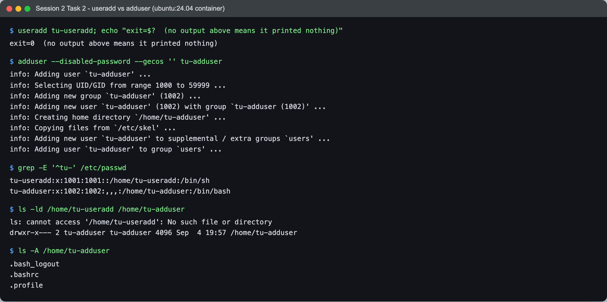

`useradd` printed **nothing whatsoever** and exited 0. `adduser` narrated every step:

```text
$ useradd tu-useradd; echo "exit=$?  (no output above means it printed nothing)"
exit=0  (no output above means it printed nothing)

$ adduser --disabled-password --gecos '' tu-adduser
info: Adding user `tu-adduser' ...
info: Selecting UID/GID from range 1000 to 59999 ...
info: Adding new group `tu-adduser' (1002) ...
info: Adding new user `tu-adduser' (1002) with group `tu-adduser (1002)' ...
info: Creating home directory `/home/tu-adduser' ...
info: Copying files from `/etc/skel' ...
info: Adding new user `tu-adduser' to supplemental / extra groups `users' ...
info: Adding user `tu-adduser' to group `users' ...
```

The difference shows up in what actually landed on the box:

```text
$ grep -E '^tu-' /etc/passwd
tu-useradd:x:1001:1001::/home/tu-useradd:/bin/sh
tu-adduser:x:1002:1002:,,,:/home/tu-adduser:/bin/bash

$ ls -ld /home/tu-useradd /home/tu-adduser
ls: cannot access '/home/tu-useradd': No such file or directory
drwxr-x--- 2 tu-adduser tu-adduser 4096 Sep  4 19:57 /home/tu-adduser

$ ls -A /home/tu-adduser
.bash_logout
.bashrc
.profile
```

This is the bit worth noticing: `useradd` wrote `/home/tu-useradd` into `/etc/passwd` **but
never created that directory**. The account exists and is broken — log in as it and you
land in a home that is not there. It also left the shell as `/bin/sh`. `adduser` created
the home, populated it from `/etc/skel` (hence the three dotfiles), and set `/bin/bash`.

| | `useradd` | `adduser` |
|---|---|---|
| What it is | low-level binary | Perl wrapper **around** `useradd` |
| Home directory | not created (unless `-m`) | created |
| `/etc/skel` copied in | no | yes |
| Default shell | `/bin/sh` | `/bin/bash` |
| Password | not set, not prompted | prompts (interactive) |
| Output | silent | explains each step |
| Available on | every Linux | Debian/Ubuntu family |

**Which to use:** `adduser` when you are sitting at a Debian/Ubuntu box creating a real
account. `useradd` in scripts and on distros that have no `adduser` — remembering to pass
`-m -s /bin/bash` yourself, or you get the half-made account above.

### Cleanup

```bash
userdel -r tu-useradd
userdel -r tu-adduser
```

---

## Task 3: journalctl

### What the task asked

Learn what `journalctl` is for, use it to view system and service logs, and practise
checking the logs of one specific service.

### What journalctl is

On a systemd machine every log line, whether it comes from the kernel, from systemd itself,
from a service's stdout/stderr or from `syslog()`, goes to one daemon: **systemd-journald**.
journald writes it into an indexed **binary** journal, and `journalctl` is the only
reader. You don't `cat` the journal, you query it. Because every entry carries structured
fields (`_SYSTEMD_UNIT`, `_PID`, `PRIORITY`, boot ID, timestamp …), filters like "this
service, errors only, last 10 minutes" are cheap lookups instead of `grep` over text files.

### Setup: a container that actually runs systemd

The `linux-lab` container from Tasks 1–2 runs `sleep infinity` as PID 1, so it has no
systemd and no journal. I tried the usual `jrei/systemd-ubuntu:24.04` image first, but it has
no arm64 build (`no matching manifest for linux/arm64/v8`). Writing my own was four lines:

```dockerfile
FROM ubuntu:24.04
ENV DEBIAN_FRONTEND=noninteractive
RUN apt-get update && apt-get install -y --no-install-recommends systemd systemd-sysv nginx && rm -rf /var/lib/apt/lists/*
STOPSIGNAL SIGRTMIN+3
CMD ["/sbin/init"]
```

```bash
docker build -t journal-lab:24.04 .
docker run -d --name journal-lab --hostname journal-lab --privileged --cgroupns=host \
  -v /sys/fs/cgroup:/sys/fs/cgroup:rw --tmpfs /run --tmpfs /run/lock journal-lab:24.04
```

Inside it I wrote two small units to practise on. `hello.service` prints a heartbeat every
5 seconds. `broken.service` fails on purpose because it reads a config file that doesn't
exist:

```ini
# /etc/systemd/system/broken.service
[Unit]
Description=Deliberately broken demo service

[Service]
Type=oneshot
ExecStart=/bin/bash -c 'echo "broken.service: reading /etc/app/config.yml"; cat /etc/app/config.yml'
```

`/usr/local/bin/hello.sh` is just `while true; do echo "hello from hello.service - heartbeat #$n"; sleep 5; done`.
I enabled it with `systemctl daemon-reload && systemctl enable --now hello.service`. nginx
came from the image and was already running.

### Basics: the whole journal

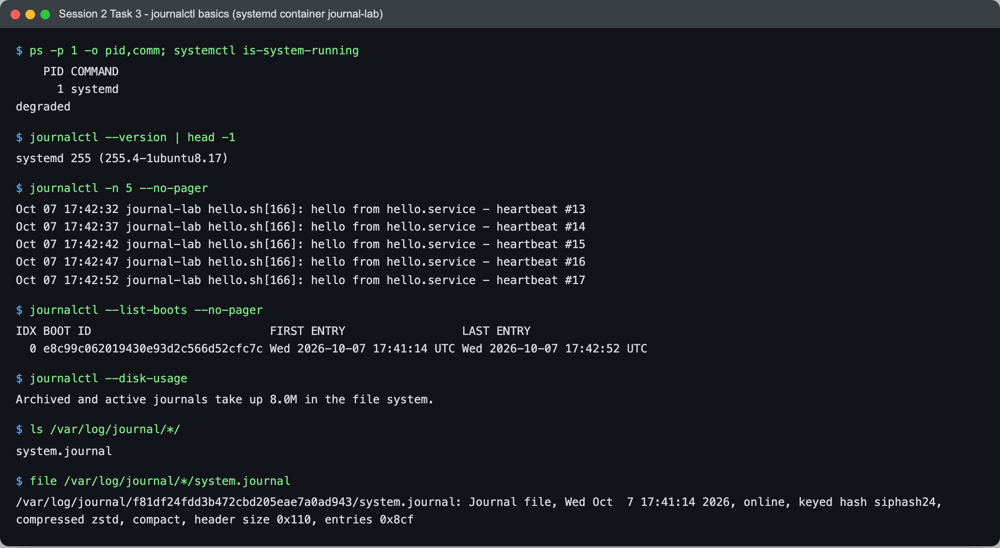

```text
$ ps -p 1 -o pid,comm; systemctl is-system-running
    PID COMMAND
      1 systemd
degraded

$ journalctl -n 5 --no-pager
Oct 07 17:42:32 journal-lab hello.sh[166]: hello from hello.service - heartbeat #13
Oct 07 17:42:37 journal-lab hello.sh[166]: hello from hello.service - heartbeat #14
Oct 07 17:42:42 journal-lab hello.sh[166]: hello from hello.service - heartbeat #15
Oct 07 17:42:47 journal-lab hello.sh[166]: hello from hello.service - heartbeat #16
Oct 07 17:42:52 journal-lab hello.sh[166]: hello from hello.service - heartbeat #17

$ journalctl --list-boots --no-pager
IDX BOOT ID                          FIRST ENTRY                 LAST ENTRY
  0 e8c99c062019430e93d2c566d52cfc7c Wed 2026-10-07 17:41:14 UTC Wed 2026-10-07 17:42:52 UTC

$ journalctl --disk-usage
Archived and active journals take up 8.0M in the file system.

$ ls /var/log/journal/*/
system.journal

$ file /var/log/journal/*/system.journal
/var/log/journal/f81df24fdd3b472cbd205eae7a0ad943/system.journal: Journal file, Wed Oct  7 17:41:14 2026, online, keyed hash siphash24, compressed zstd, compact, header size 0x110, entries 0x8cf
```

- PID 1 is `systemd`, so this really is a systemd box. It says `degraded` rather than
  `running` because I had already started `broken.service` once and it failed. One failed
  unit is enough to make the whole system report `degraded`.
- `-n 5` is "last 5 lines", like `tail -n`. Without `--no-pager` journalctl opens `less`.
- `--list-boots` shows one boot (index `0` = current). On a real server you'd see `-1`,
  `-2` … and `journalctl -b -1` gives you the logs of the boot *before* the crash, which is
  usually what you're looking for.
- `file` confirms the journal is a **binary, zstd-compressed** file, not text. That's why
  `journalctl` is the reader and not `cat`/`less`.

**Where the logs live (persistence):** journald writes to `/run/log/journal/` (tmpfs, lost
on reboot) unless `/var/log/journal/` exists, in which case it writes there and the logs
survive reboots. Ubuntu creates `/var/log/journal/`, so this box is persistent. You can see
the `<machine-id>/system.journal` path above. `Storage=` in `/etc/systemd/journald.conf`
controls this (`volatile`, `persistent`, `auto`), and `--disk-usage` /
`--vacuum-size=200M` are how you check and cap it.

**journald vs syslog:** syslog (rsyslog on Ubuntu) is the older text-file system that
writes `/var/log/syslog`. On a modern Ubuntu server the two run side by side. journald
collects everything first and forwards it to rsyslog if rsyslog is installed, which is why
`tail -f /var/log/syslog` from the cheat sheet still works on a normal Ubuntu VM. This
minimal container has no rsyslog, so the journal is the only log there is.

### Filtering: kernel, priority, time window, output format

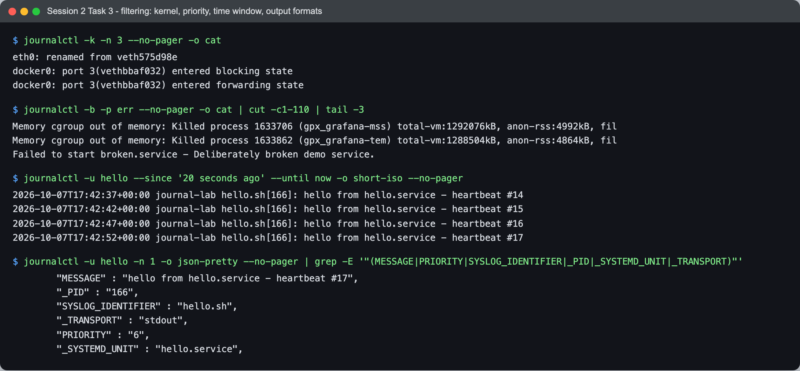

```text
$ journalctl -k -n 3 --no-pager -o cat
eth0: renamed from veth575d98e
docker0: port 3(vethbbaf032) entered blocking state
docker0: port 3(vethbbaf032) entered forwarding state

$ journalctl -b -p err --no-pager -o cat | cut -c1-110 | tail -3
Memory cgroup out of memory: Killed process 1633706 (gpx_grafana-mss) total-vm:1292076kB, anon-rss:4992kB, fil
Memory cgroup out of memory: Killed process 1633862 (gpx_grafana-tem) total-vm:1288504kB, anon-rss:4864kB, fil
Failed to start broken.service - Deliberately broken demo service.

$ journalctl -u hello --since '20 seconds ago' --until now -o short-iso --no-pager
2026-10-07T17:42:37+00:00 journal-lab hello.sh[166]: hello from hello.service - heartbeat #14
2026-10-07T17:42:42+00:00 journal-lab hello.sh[166]: hello from hello.service - heartbeat #15
2026-10-07T17:42:47+00:00 journal-lab hello.sh[166]: hello from hello.service - heartbeat #16
2026-10-07T17:42:52+00:00 journal-lab hello.sh[166]: hello from hello.service - heartbeat #17

$ journalctl -u hello -n 1 -o json-pretty --no-pager | grep -E '"(MESSAGE|PRIORITY|SYSLOG_IDENTIFIER|_PID|_SYSTEMD_UNIT|_TRANSPORT)"'
	"MESSAGE" : "hello from hello.service - heartbeat #17",
	"_PID" : "166",
	"SYSLOG_IDENTIFIER" : "hello.sh",
	"_TRANSPORT" : "stdout",
	"PRIORITY" : "6",
	"_SYSTEMD_UNIT" : "hello.service",
```

- `-k` is kernel messages only (same as `dmesg`). The lines are about `docker0` and `veth`
  interfaces. That's the **Docker Desktop VM's** kernel, not a kernel belonging to the
  container. A container has no kernel of its own, and with `--privileged` it reads the
  host's kernel log.
- `-b -p err` means "this boot, priority `err` and worse". Priorities are the syslog ones:
  `0 emerg … 3 err, 4 warning … 6 info, 7 debug`. It picked up OOM kills of some Grafana
  plugin processes elsewhere on the Docker VM (same shared kernel) plus my broken unit.
- `--since` / `--until` accept both relative (`'20 seconds ago'`, `yesterday`) and absolute
  (`'2026-10-07 17:40'`) times.
- `-o short-iso` gives ISO timestamps. `-o json-pretty` shows what an entry really is: a set
  of fields. `-u hello` simply matches `_SYSTEMD_UNIT=hello.service`. `PRIORITY` is `6`
  (info) and `_TRANSPORT` is `stdout`: my script never talked to syslog, it just printed,
  and systemd captured its stdout.

### Practising on one service: hello.service

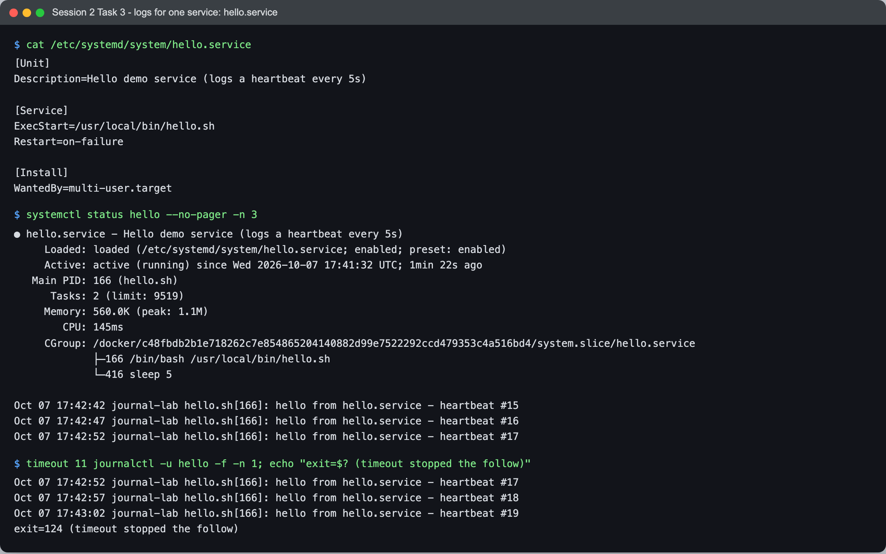

```text
$ systemctl status hello --no-pager -n 3
● hello.service - Hello demo service (logs a heartbeat every 5s)
     Loaded: loaded (/etc/systemd/system/hello.service; enabled; preset: enabled)
     Active: active (running) since Wed 2026-10-07 17:41:32 UTC; 1min 22s ago
   Main PID: 166 (hello.sh)
      Tasks: 2 (limit: 9519)
     Memory: 560.0K (peak: 1.1M)
        CPU: 145ms
     CGroup: /docker/c48fbdb2b1e718262c7e854865204140882d99e7522292ccd479353c4a516bd4/system.slice/hello.service
             ├─166 /bin/bash /usr/local/bin/hello.sh
             └─416 sleep 5

Oct 07 17:42:42 journal-lab hello.sh[166]: hello from hello.service - heartbeat #15
Oct 07 17:42:47 journal-lab hello.sh[166]: hello from hello.service - heartbeat #16
Oct 07 17:42:52 journal-lab hello.sh[166]: hello from hello.service - heartbeat #17

$ timeout 11 journalctl -u hello -f -n 1; echo "exit=$? (timeout stopped the follow)"
Oct 07 17:42:52 journal-lab hello.sh[166]: hello from hello.service - heartbeat #17
Oct 07 17:42:57 journal-lab hello.sh[166]: hello from hello.service - heartbeat #18
Oct 07 17:43:02 journal-lab hello.sh[166]: hello from hello.service - heartbeat #19
exit=124 (timeout stopped the follow)
```

The last 3 lines of `systemctl status` are already a `journalctl -u hello -n 3`, so status
is the quick look and journalctl is where you go to dig further. `-f` follows like
`tail -f`: it printed the last line and then new heartbeats as they arrived, 5 seconds
apart. I wrapped it in `timeout 11` so it would stop by itself (`124` is `timeout`'s
"I killed it" exit code). Interactively you'd press Ctrl+C.

Then a restart, and the restart as it appears in the log:

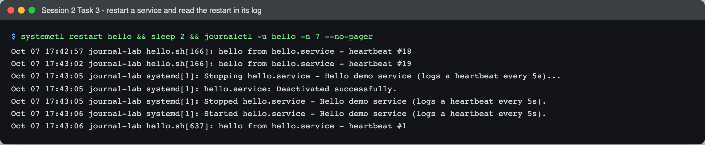

```text
$ systemctl restart hello && sleep 2 && journalctl -u hello -n 7 --no-pager
Oct 07 17:42:57 journal-lab hello.sh[166]: hello from hello.service - heartbeat #18
Oct 07 17:43:02 journal-lab hello.sh[166]: hello from hello.service - heartbeat #19
Oct 07 17:43:05 journal-lab systemd[1]: Stopping hello.service - Hello demo service (logs a heartbeat every 5s)...
Oct 07 17:43:05 journal-lab systemd[1]: hello.service: Deactivated successfully.
Oct 07 17:43:05 journal-lab systemd[1]: Stopped hello.service - Hello demo service (logs a heartbeat every 5s).
Oct 07 17:43:06 journal-lab systemd[1]: Started hello.service - Hello demo service (logs a heartbeat every 5s).
Oct 07 17:43:06 journal-lab hello.sh[637]: hello from hello.service - heartbeat #1
```

Two things show the restart: the PID changed (**166 → 637**) and the counter went back to
**#1**. Also, `-u hello` returns lines from *two different writers*, `hello.sh` and
`systemd[1]`. systemd's own messages *about* the unit are tagged with the unit too, so one
query gives you both the app's output and the lifecycle events around it.

### A failing service: finding the error

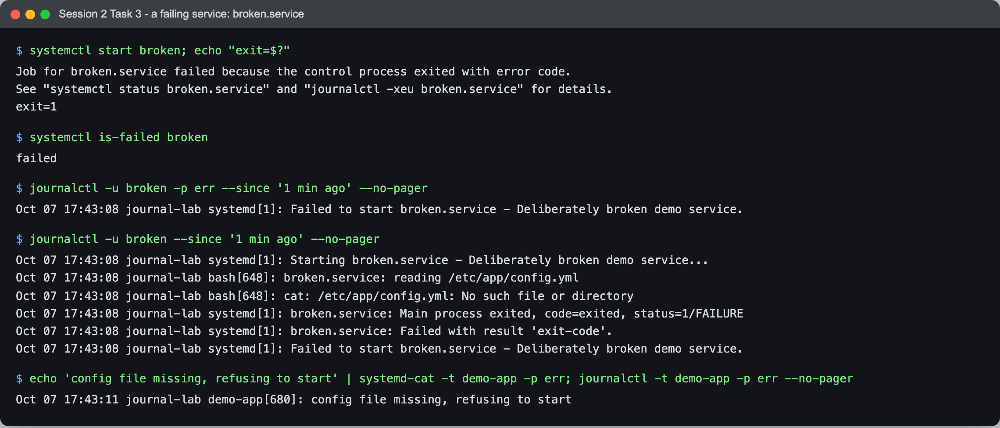

```text
$ systemctl start broken; echo "exit=$?"
Job for broken.service failed because the control process exited with error code.
See "systemctl status broken.service" and "journalctl -xeu broken.service" for details.
exit=1

$ systemctl is-failed broken
failed

$ journalctl -u broken -p err --since '1 min ago' --no-pager
Oct 07 17:43:08 journal-lab systemd[1]: Failed to start broken.service - Deliberately broken demo service.

$ journalctl -u broken --since '1 min ago' --no-pager
Oct 07 17:43:08 journal-lab systemd[1]: Starting broken.service - Deliberately broken demo service...
Oct 07 17:43:08 journal-lab bash[648]: broken.service: reading /etc/app/config.yml
Oct 07 17:43:08 journal-lab bash[648]: cat: /etc/app/config.yml: No such file or directory
Oct 07 17:43:08 journal-lab systemd[1]: broken.service: Main process exited, code=exited, status=1/FAILURE
Oct 07 17:43:08 journal-lab systemd[1]: broken.service: Failed with result 'exit-code'.
Oct 07 17:43:08 journal-lab systemd[1]: Failed to start broken.service - Deliberately broken demo service.

$ echo 'config file missing, refusing to start' | systemd-cat -t demo-app -p err; journalctl -t demo-app -p err --no-pager
Oct 07 17:43:11 journal-lab demo-app[680]: config file missing, refusing to start
```

This was the most useful thing I found in the whole task. `-p err` shows **that** the unit
failed, but the line that says **why**, `cat: /etc/app/config.yml: No such file or
directory`, is *not* in the `-p err` output, even though it's an error message on stderr.
journald stores a service's stdout **and** stderr at priority 6 (info) by default. It has no
idea that a line "is" an error. Dropping `-p err` shows the cause right away.

The last command shows the other side of it. When a program *does* tag its own priority
(here via `systemd-cat -p err`, a C program would use `syslog(LOG_ERR, …)` or print a
`<3>` prefix), `-p err` finds it. So `-p err` is a good first filter for *which* units broke,
and after that you read the unit's full log without the filter to find the cause.

### A real package service: nginx

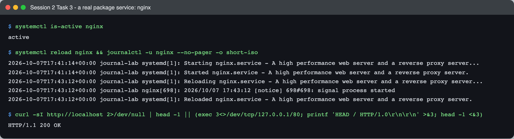

```text
$ systemctl reload nginx && journalctl -u nginx --no-pager -o short-iso
2026-10-07T17:41:14+00:00 journal-lab systemd[1]: Starting nginx.service - A high performance web server and a reverse proxy server...
2026-10-07T17:41:14+00:00 journal-lab systemd[1]: Started nginx.service - A high performance web server and a reverse proxy server.
2026-10-07T17:43:12+00:00 journal-lab systemd[1]: Reloading nginx.service - A high performance web server and a reverse proxy server...
2026-10-07T17:43:12+00:00 journal-lab nginx[698]: 2026/10/07 17:43:12 [notice] 698#698: signal process started
2026-10-07T17:43:12+00:00 journal-lab systemd[1]: Reloaded nginx.service - A high performance web server and a reverse proxy server.

$ curl -sI http://localhost 2>/dev/null | head -1 || (exec 3<>/dev/tcp/127.0.0.1/80; printf 'HEAD / HTTP/1.0\r\n\r\n' >&3; head -1 <&3)
HTTP/1.1 200 OK
```

The whole life of nginx on this box fits in five lines: started at boot (17:41:14), and
my `reload` at 17:43:12. A reload is not a restart. There are no Stopping/Stopped lines;
nginx re-reads its config with the same master process. Its access/error logs still go to
`/var/log/nginx/*.log`, so for nginx the journal only has the lifecycle and startup errors.

### Bonus (read-only): kubelet on a real Kubernetes node

The nodes of my kind cluster are containers that run systemd too, so I could read a real
kubelet log without touching anything:

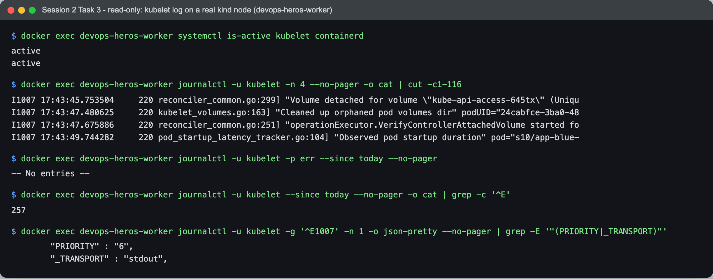

```text
$ docker exec devops-heros-worker systemctl is-active kubelet containerd
active
active

$ docker exec devops-heros-worker journalctl -u kubelet -n 4 --no-pager -o cat | cut -c1-116
I1007 17:43:45.753504     220 reconciler_common.go:299] "Volume detached for volume \"kube-api-access-645tx\" (Uniqu
I1007 17:43:47.480625     220 kubelet_volumes.go:163] "Cleaned up orphaned pod volumes dir" podUID="24cabfce-3ba0-48
I1007 17:43:47.675886     220 reconciler_common.go:251] "operationExecutor.VerifyControllerAttachedVolume started fo
I1007 17:43:49.744282     220 pod_startup_latency_tracker.go:104] "Observed pod startup duration" pod="s10/app-blue-

$ docker exec devops-heros-worker journalctl -u kubelet -p err --since today --no-pager
-- No entries --

$ docker exec devops-heros-worker journalctl -u kubelet --since today --no-pager -o cat | grep -c '^E'
257

$ docker exec devops-heros-worker journalctl -u kubelet -g '^E1007' -n 1 -o json-pretty --no-pager | grep -E '"(PRIORITY|_TRANSPORT)"'
	"PRIORITY" : "6",
	"_TRANSPORT" : "stdout",
```

Same lesson as `broken.service`, on a real system this time: kubelet logged **257
error lines** today (klog marks them with a leading `E`), and `-p err` finds **none** of
them, because journald recorded every one at `PRIORITY 6` off stdout. If you rely on `-p err`
for a Kubernetes node you'll miss kubelet errors. `journalctl -u kubelet | grep '^E'` (or
`-g '^E'`) is what actually works. `-g` is journalctl's built-in grep.

### Cheat list

| Command | What it does |
|---|---|
| `journalctl` | whole journal, oldest first, in a pager |
| `journalctl -n 50` / `-r` | last 50 lines / newest first |
| `journalctl -f` | follow live, like `tail -f` |
| `journalctl -u nginx` | one unit (repeat `-u` for several) |
| `journalctl -b` / `-b -1` / `--list-boots` | this boot / previous boot / list boots |
| `journalctl -k` | kernel ring buffer (`dmesg`) |
| `journalctl -p err` | priority err and worse (0–3) |
| `journalctl --since '1 hour ago' --until now` | time window |
| `journalctl -t demo-app` / `_PID=166` | by syslog identifier / by any field |
| `journalctl -g 'regex'` | grep inside the journal |
| `journalctl -xeu nginx` | jump to end, with explanation text: what systemctl itself suggests on failure |
| `journalctl -o short-iso / json-pretty / cat` | output formats |
| `journalctl --disk-usage` / `--vacuum-size=200M` | check / shrink journal size |

---

## Task 4: Linux command cheat sheet

### What the task asked

Review the cheat sheet, practise the important commands, and understand what each one is
for.

### The cheat sheets

There are three PDFs in `session2-linux/`:

- **`basic-linux.pdf`** (DevOps Yatri): files/dirs, viewing/search, processes and services,
  networking, permissions, packages, disk, cron/`nohup`, users, system info, shell shortcuts.
- **`ad-linux.pdf`** ("Advance Linux Commands"): monitoring (`vmstat`, `iostat`, `sar`),
  job control (`nice`, `renice`, `bg`/`fg`), `ss`, `lsof`, `strace`, `rsync`, `find`,
  `journalctl -xe`, `umask`, `visudo`.
- **`Linux Networking Cheat Sheet.pdf`**: the `ip` command (`addr`, `link`, `route`,
  `neigh`, `maddr`) and a net-tools → iproute2 translation table (`ifconfig` → `ip addr`,
  `netstat` → `ss`, `route` → `ip route`, `arp` → `ip neigh`).

I practised them in the same `linux-lab` container as Tasks 1–2. The minimal image doesn't
have most of these tools (`ps`, `ip`, `ping` are all missing out of the box), so first:

```bash
apt-get install -y procps iproute2 iputils-ping curl wget net-tools traceroute lsof file psmisc nginx-light less
```

User commands (`adduser`, `useradd`, `userdel`) are covered in [Task 2](#task-2-useradd-vs-adduser)
and links in [Task 1](#task-1-hard-links-vs-soft-links). I don't repeat them here.

### 1. Files and directories

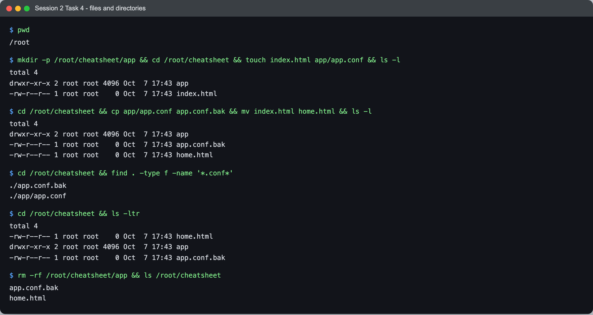

```text
$ mkdir -p /root/cheatsheet/app && cd /root/cheatsheet && touch index.html app/app.conf && ls -l
total 4
drwxr-xr-x 2 root root 4096 Oct  7 17:43 app
-rw-r--r-- 1 root root    0 Oct  7 17:43 index.html

$ cd /root/cheatsheet && cp app/app.conf app.conf.bak && mv index.html home.html && ls -l
total 4
drwxr-xr-x 2 root root 4096 Oct  7 17:43 app
-rw-r--r-- 1 root root    0 Oct  7 17:43 app.conf.bak
-rw-r--r-- 1 root root    0 Oct  7 17:43 home.html

$ cd /root/cheatsheet && find . -type f -name '*.conf*'
./app.conf.bak
./app/app.conf

$ rm -rf /root/cheatsheet/app && ls /root/cheatsheet
app.conf.bak
home.html
```

| Command | Purpose | Basic usage |
|---|---|---|
| `pwd` | print the current directory | `pwd` → `/root` |
| `ls` | list a directory; `-l` long format, `-a` hidden, `-t` by time, `-r` reverse | `ls -ltr` (newest last) |
| `cd` | change directory | `cd /var/log`, `cd -` (back), `cd ~` |
| `mkdir` | make a directory; `-p` creates parents and doesn't fail if it exists | `mkdir -p a/b/c` |
| `touch` | create an empty file, or update the timestamp of an existing one | `touch index.html` |
| `cp` | copy; `-r` for directories | `cp app.conf app.conf.bak` |
| `mv` | move **or rename**, same operation | `mv index.html home.html` |
| `rm` | remove; `-r` recursive, `-f` no prompts. There's no undo | `rm -rf dir/` |
| `find` | search the tree by name/type/size/time | `find / -type f -name 'file.txt'` |

`mv` doing both "move" and "rename" makes sense after Task 1: a rename on the same
filesystem only rewrites a directory entry, and the inode stays where it is.

### 2. Viewing and searching text

I made a small fake app log to search through:

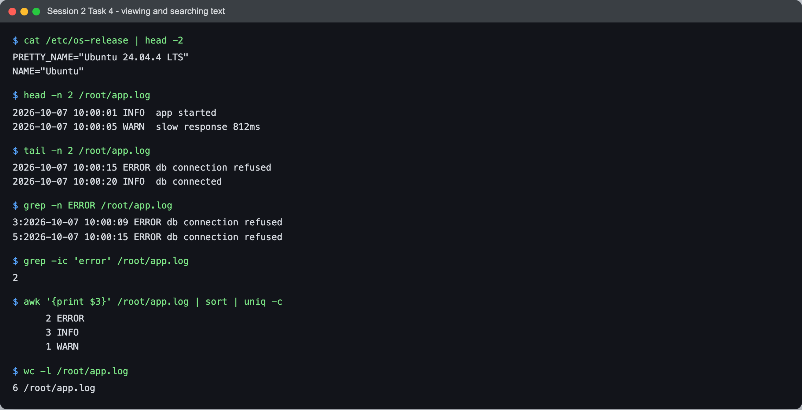

```text
$ head -n 2 /root/app.log
2026-10-07 10:00:01 INFO  app started
2026-10-07 10:00:05 WARN  slow response 812ms

$ tail -n 2 /root/app.log
2026-10-07 10:00:15 ERROR db connection refused
2026-10-07 10:00:20 INFO  db connected

$ grep -n ERROR /root/app.log
3:2026-10-07 10:00:09 ERROR db connection refused
5:2026-10-07 10:00:15 ERROR db connection refused

$ grep -ic 'error' /root/app.log
2

$ awk '{print $3}' /root/app.log | sort | uniq -c
      2 ERROR
      3 INFO
      1 WARN

$ wc -l /root/app.log
6 /root/app.log
```

| Command | Purpose | Basic usage |
|---|---|---|
| `cat` | print a whole file | `cat /etc/os-release` |
| `less` / `more` | page through a big file (`/` search, `q` quit) | `less /var/log/syslog` |
| `head` | first N lines | `head -n 10 file` |
| `tail` | last N lines; `-f` follows a growing file | `tail -n 100 file`, `tail -f app.log` |
| `grep` | lines matching a pattern; `-i` ignore case, `-n` line numbers, `-c` count, `-r` recursive | `grep -ir error /var/log/` |
| `wc` | count lines/words/bytes | `wc -l file` |
| `sort` / `uniq -c` | sort, then count duplicates. A common pipeline for "which value appears most" | `… \| sort \| uniq -c` |
| `awk` | pick out columns | `awk '{print $3}'` |

The `awk | sort | uniq -c` line is the one I'd actually use on a real incident. It turns
"a log full of noise" into "2 errors, 1 warning" in one go.

### 3. Permissions and ownership

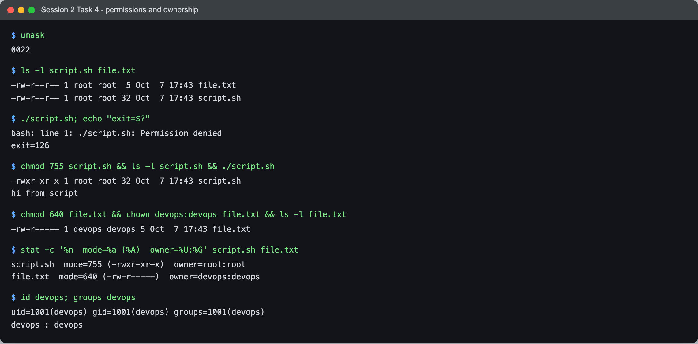

```text
$ umask
0022

$ ls -l script.sh file.txt
-rw-r--r-- 1 root root  5 Oct  7 17:43 file.txt
-rw-r--r-- 1 root root 32 Oct  7 17:43 script.sh

$ ./script.sh; echo "exit=$?"
bash: line 1: ./script.sh: Permission denied
exit=126

$ chmod 755 script.sh && ls -l script.sh && ./script.sh
-rwxr-xr-x 1 root root 32 Oct  7 17:43 script.sh
hi from script

$ chmod 640 file.txt && chown devops:devops file.txt && ls -l file.txt
-rw-r----- 1 devops devops 5 Oct  7 17:43 file.txt

$ stat -c '%n  mode=%a (%A)  owner=%U:%G' script.sh file.txt
script.sh  mode=755 (-rwxr-xr-x)  owner=root:root
file.txt  mode=640 (-rw-r-----)  owner=devops:devops

$ id devops; groups devops
uid=1001(devops) gid=1001(devops) groups=1001(devops)
devops : devops
```

| Command | Purpose | Basic usage |
|---|---|---|
| `chmod` | change mode bits. Octal digits are owner/group/other, `r=4 w=2 x=1` | `chmod 755 script.sh`, `chmod +x f` |
| `chown` | change owner and group | `chown user:group file` |
| `umask` | bits *removed* from new files' permissions | `umask` → `0022` |
| `stat` | exact mode/owner/inode of a file | `stat -c '%a %U' f` |
| `id` / `groups` | a user's UID, GID and groups | `id devops` |
| `sudo visudo` | edit sudoers with a syntax check, so a typo can't lock you out | `sudo visudo` |

`umask 0022` is why both new files came out `rw-r--r--` (666 minus 022 = 644). Even as
**root**, `./script.sh` was `Permission denied` (exit **126**, "found but not
executable") until it had an `x` bit. Root skips read/write checks, but it still needs at
least one execute bit to run a file.

### 4. Processes and jobs

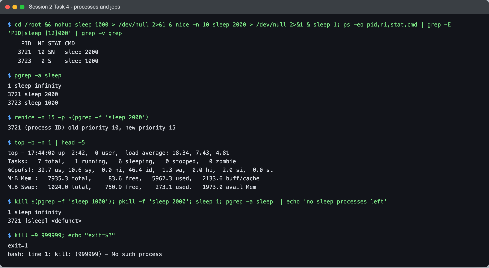

```text
$ cd /root && nohup sleep 1000 > /dev/null 2>&1 & nice -n 10 sleep 2000 > /dev/null 2>&1 & sleep 1; ps -eo pid,ni,stat,cmd | grep -E 'PID|sleep [12]000' | grep -v grep
    PID  NI STAT CMD
   3721  10 SN   sleep 2000
   3723   0 S    sleep 1000

$ pgrep -a sleep
1 sleep infinity
3721 sleep 2000
3723 sleep 1000

$ renice -n 15 -p $(pgrep -f 'sleep 2000')
3721 (process ID) old priority 10, new priority 15

$ top -b -n 1 | head -5
top - 17:44:00 up  2:42,  0 user,  load average: 18.34, 7.43, 4.81
Tasks:   7 total,   1 running,   6 sleeping,   0 stopped,   0 zombie
%Cpu(s): 39.7 us, 10.6 sy,  0.0 ni, 46.4 id,  1.3 wa,  0.0 hi,  2.0 si,  0.0 st
MiB Mem :   7935.3 total,     83.6 free,   5962.3 used,   2133.6 buff/cache
MiB Swap:   1024.0 total,    750.9 free,    273.1 used.   1973.0 avail Mem

$ kill $(pgrep -f 'sleep 1000'); pkill -f 'sleep 2000'; sleep 1; pgrep -a sleep || echo 'no sleep processes left'
1 sleep infinity
3721 [sleep] <defunct>

$ kill -9 999999; echo "exit=$?"
exit=1
bash: line 1: kill: (999999) - No such process
```

| Command | Purpose | Basic usage |
|---|---|---|
| `ps` | snapshot of processes | `ps aux`, `ps -eo pid,ni,stat,cmd` |
| `top` / `htop` | live view of CPU/memory per process (`-b -n 1` = one batch snapshot) | `top` |
| `pgrep` / `pkill` | find / signal processes **by name** instead of PID | `pgrep -a nginx`, `pkill -f 'sleep 2000'` |
| `kill` | send a signal to a PID. Default `TERM` (polite), `-9` is `KILL` (can't be caught) | `kill 1234`, `kill -9 1234` |
| `nice` / `renice` | start / change a process's priority (`-20` highest … `19` lowest) | `nice -n 10 cmd`, `renice -n 15 -p PID` |
| `nohup … &` | run in the background and ignore hang-up, so it survives logout | `nohup python3 app.py &` |
| `jobs` / `bg` / `fg` | manage jobs started from *this* shell | Ctrl+Z, then `bg` |
| `systemctl status/restart` | services. See Task 3 | `systemctl restart nginx` |

What I read from this:

- The `NI` column shows `nice -n 10` worked (`10`, state `SN` = sleeping, low priority),
  and `renice` moved it from 10 to 15.
- In the basic cheat sheet's `kill` example the dash doesn't render (it shows as a block,
  and copy-paste gives `kill 9 1234`). That matters: `kill 9 1234` sends the default TERM to
  **PID 9** *and* PID 1234. It has to be `kill -9 1234`.
- After killing both, `sleep 2000` was left as **`[sleep] <defunct>`, a zombie**. It had
  exited, but nobody collected its exit status. Normally its parent or PID 1 does that, but
  PID 1 in this container is `sleep infinity`, which never calls `wait()`. That's the
  reason real images use `tini` / `docker run --init`, or a real init like the systemd
  container in Task 3.
- The `load average: 18.34` is the whole Docker Desktop VM, not this container. Same idea
  as the shared kernel log in Task 3.

### 5. System information, disk and memory

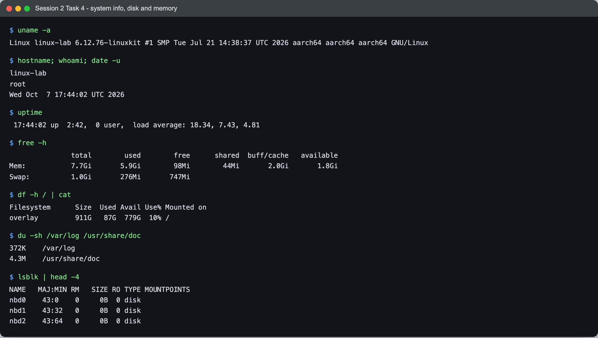

```text
$ uname -a
Linux linux-lab 6.12.76-linuxkit #1 SMP Tue Jul 21 14:38:37 UTC 2026 aarch64 aarch64 aarch64 GNU/Linux

$ hostname; whoami; date -u
linux-lab
root
Wed Oct  7 17:44:02 UTC 2026

$ uptime
 17:44:02 up  2:42,  0 user,  load average: 18.34, 7.43, 4.81

$ free -h
               total        used        free      shared  buff/cache   available
Mem:           7.7Gi       5.9Gi        98Mi        44Mi       2.0Gi       1.8Gi
Swap:          1.0Gi       276Mi       747Mi

$ df -h / | cat
Filesystem      Size  Used Avail Use% Mounted on
overlay         911G   87G  779G  10% /

$ du -sh /var/log /usr/share/doc
372K	/var/log
4.3M	/usr/share/doc
```

| Command | Purpose | Basic usage |
|---|---|---|
| `uname -a` | kernel name, version, architecture | `uname -a`, `uname -r` |
| `hostname` / `whoami` / `date` | machine name / current user / current time | `date -u` |
| `uptime` | time since boot + 1/5/15-min load average | `uptime` |
| `free -h` | RAM and swap in human units | `free -h` |
| `df -h` | free space **per filesystem** | `df -h` |
| `du -sh` | space used **by a directory** | `du -sh /var/log`, `du -sh * \| sort -h` |
| `lsblk` | block devices (disks, partitions) | `lsblk` |
| `history`, `!!`, `!n` | past commands / rerun last / rerun number n | `history \| grep ssh` |

`df` vs `du`: "is the disk full?" vs "what is filling it?". In `free`, the number to look
at is **available** (1.8Gi), not **free** (98Mi). Linux uses spare RAM as cache and gives it
back when needed, so a low "free" by itself is normal. `/` is `overlay` because a container's
root filesystem is overlayfs layers (Session 6–7 material).

### 6. Archives and packages

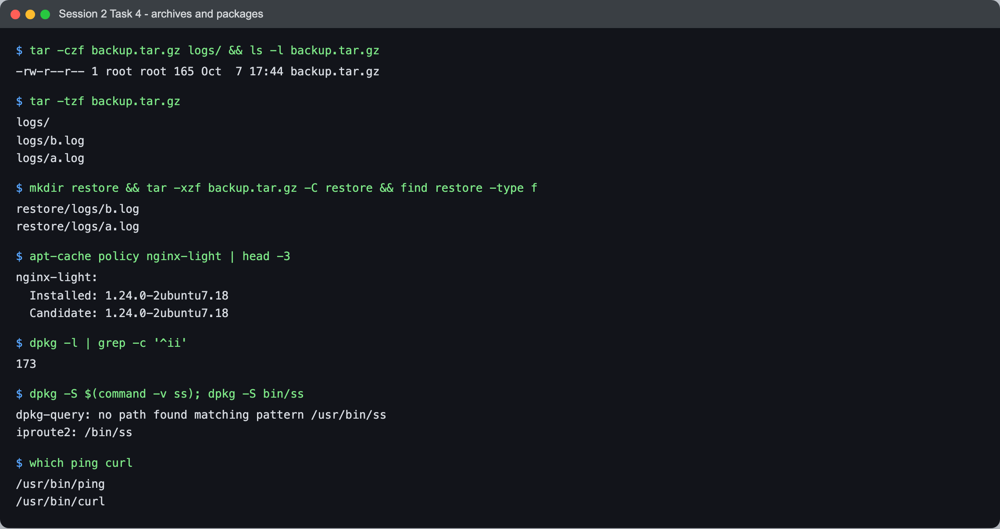

```text
$ tar -czf backup.tar.gz logs/ && ls -l backup.tar.gz
-rw-r--r-- 1 root root 161 Oct  7 17:44 backup.tar.gz

$ tar -tzf backup.tar.gz
logs/
logs/b.log
logs/a.log

$ mkdir restore && tar -xzf backup.tar.gz -C restore && find restore -type f
restore/logs/b.log
restore/logs/a.log

$ apt-cache policy nginx-light | head -3
nginx-light:
  Installed: 1.24.0-2ubuntu7.18
  Candidate: 1.24.0-2ubuntu7.18

$ dpkg -l | grep -c '^ii'
173

$ dpkg -S $(command -v ss); dpkg -S bin/ss
dpkg-query: no path found matching pattern /usr/bin/ss
iproute2: /bin/ss
```

| Command | Purpose | Basic usage |
|---|---|---|
| `tar` | bundle files; `c` create, `x` extract, `t` list, `z` gzip, `f` file, `-C` target dir | `tar -czf out.tar.gz dir/`, `tar -xzf out.tar.gz -C dest` |
| `apt update && apt install` | refresh the package index, then install (Debian/Ubuntu) | `apt install nginx -y` |
| `yum` / `dnf install` | the same on RHEL/CentOS | `yum install nginx -y` |
| `apt-cache policy` | installed vs available version | `apt-cache policy nginx-light` |
| `dpkg -l` / `dpkg -S` | list installed packages / which package owns a file | `dpkg -S bin/ss` |
| `which` | where a command is on `$PATH` | `which curl` |
| `rsync -avz` | sync directories, copying only differences | `rsync -avz src/ dest/` |

`tar -t` before `-x` is a good habit: it lets you check what's inside, and whether it
unpacks into a folder or dumps files into your current directory, before you extract. The
`dpkg -S` miss is explained under Problems I hit.

### 7. Networking

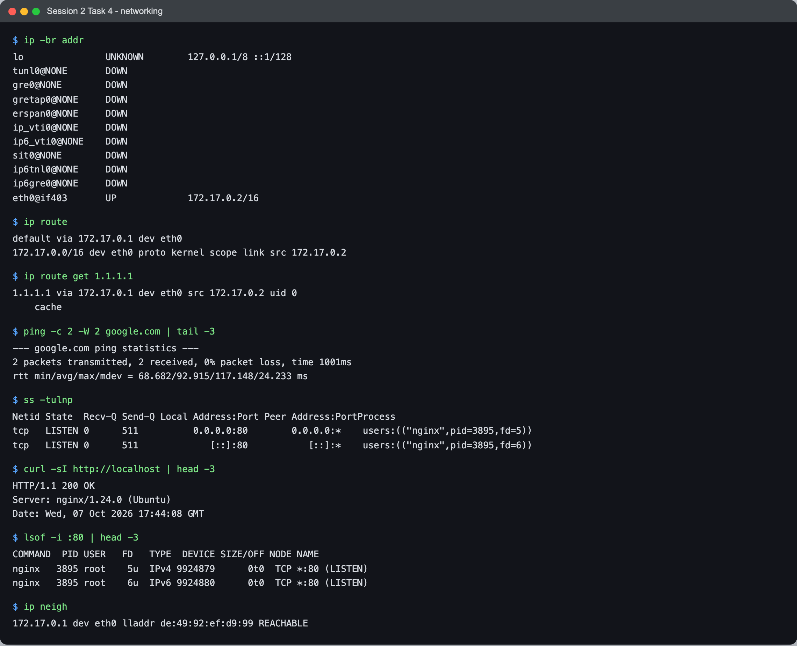

```text
$ ip route
default via 172.17.0.1 dev eth0
172.17.0.0/16 dev eth0 proto kernel scope link src 172.17.0.2

$ ip route get 1.1.1.1
1.1.1.1 via 172.17.0.1 dev eth0 src 172.17.0.2 uid 0
    cache

$ ping -c 2 -W 2 google.com | tail -3
--- google.com ping statistics ---
2 packets transmitted, 2 received, 0% packet loss, time 1001ms
rtt min/avg/max/mdev = 68.682/92.915/117.148/24.233 ms

$ ss -tulnp
Netid State  Recv-Q Send-Q Local Address:Port Peer Address:PortProcess
tcp   LISTEN 0      511          0.0.0.0:80        0.0.0.0:*    users:(("nginx",pid=3895,fd=5))
tcp   LISTEN 0      511             [::]:80           [::]:*    users:(("nginx",pid=3895,fd=6))

$ curl -sI http://localhost | head -3
HTTP/1.1 200 OK
Server: nginx/1.24.0 (Ubuntu)
Date: Wed, 07 Oct 2026 17:44:08 GMT

$ lsof -i :80 | head -3
COMMAND  PID USER   FD   TYPE  DEVICE SIZE/OFF NODE NAME
nginx   3895 root    5u  IPv4 9924879      0t0  TCP *:80 (LISTEN)
nginx   3895 root    6u  IPv6 9924880      0t0  TCP *:80 (LISTEN)

$ ip neigh
172.17.0.1 dev eth0 lladdr de:49:92:ef:d9:99 REACHABLE
```

(`ip -br addr` in the screenshot also lists ~9 tunnel devices, `tunl0`, `gre0`, `sit0` …,
all `DOWN`. They're placeholder devices from kernel modules loaded in the Docker VM. The
interface that matters is `eth0@if403 UP 172.17.0.2/16`.)

| Command | Purpose | Basic usage |
|---|---|---|
| `ip a` (`ip addr`) | interfaces and IP addresses (replaces `ifconfig`) | `ip -br addr` |
| `ip route` | routing table; `ip route get X` = which route X would use | `ip route get 1.1.1.1` |
| `ip neigh` | ARP / neighbour cache (replaces `arp -a`) | `ip neigh` |
| `ip link set` | bring an interface up/down, set MTU | `ip link set eth0 up` |
| `ping` | is the host reachable, and how long does a round trip take | `ping -c 2 host` |
| `traceroute` | which hops packets take | `traceroute host` |
| `ss -tulnp` | listening TCP/UDP sockets + owning process (replaces `netstat -tulnp`) | `ss -tulnp` |
| `lsof -i :80` | which process has port 80 open | `lsof -i :80` |
| `curl` / `wget` | make an HTTP request / download a file; `curl -I` = headers only | `curl -I https://…` |

Reading these together tells a small story. `ip route` says everything leaves via
`172.17.0.1`, which is Docker's `docker0` bridge. `ip neigh` shows that gateway's MAC as
`REACHABLE` because `ping` just went through it. `ss` and `lsof` both point at nginx PID
3895 on port 80, and `curl -I` confirms it answers. That's the order I'd follow when
debugging "the service is up but I can't reach it": is it listening (`ss`), does it
answer locally (`curl localhost`), is there a route (`ip route`).

### Things on the cheat sheets I'd correct

- The `kill` example in the basic sheet shows a broken glyph where the `-` should be, so it
  copies as `kill 9 1234`. It must be `kill -9 1234`. See section 4.
- In the advanced sheet's monitoring table, the descriptions are shifted by one row:
  `vmstat 1` is labelled "Enhanced version of top" (that's `htop`), and `uptime` is labelled
  "CPU & disk I/O stats". It's a layout bug in the PDF, but someone learning from it would
  get the wrong idea of what `vmstat` does. `vmstat 1` prints memory/CPU/IO every second.
- `netstat` and `ifconfig` appear in the basic sheet. They still work (via `net-tools`), but
  the networking sheet's own translation table explains why `ss` and `ip` replace them, and
  `net-tools` isn't installed by default on new Ubuntu images.

---

## What I learned

- `ls -li` is the fastest way to tell a hard link from a copy: same inode, link count above 1.
- A symlink's *size* being the length of its target path is a neat tell that it stores text,
  not a pointer to data.
- `rm` decrements a link count rather than destroying data. That reframes what "deleting a
  file" means — you are removing a name, and the data goes when the last name does.
- `useradd` silently producing a broken account is a good example of a low-level tool doing
  exactly what it was told and not one thing more. `adduser` is the policy layer on top.
- `journalctl -p err` filters on the journal's `PRIORITY` field, not on what the message
  says. A service's stdout and stderr both come in at priority 6 (info), so the actual cause
  of my broken unit (`No such file or directory`) and all 257 of kubelet's `E` lines were
  invisible to `-p err`. Use `-p err` to find *which* unit failed, then read that unit's full
  log for *why*.
- `journalctl -u <unit>` shows the app's own output **and** systemd's lifecycle messages for
  that unit together, so a restart shows up as Stopping → Stopped → Started plus a new PID.
- A container shares the host kernel. `journalctl -k`, `top`'s load average and the
  OOM-kill lines in my container's journal were all about the Docker Desktop VM.
- A container whose PID 1 is `sleep infinity` doesn't reap orphans. The killed `sleep`
  stayed as `<defunct>`, which is the concrete reason `tini` / `--init` exist.
- `free`'s "available" column is the one to read, not "free". Linux uses spare RAM for cache.

## Problems I hit

- **`adduser: command not found`.** The `ubuntu:24.04` image is minimal and ships `useradd`
  (from `passwd`) but not `adduser`. `apt-get install -y adduser` fixed it. Slightly funny
  that the task's whole point — the two commands differ — showed up first as one of them
  not existing.
- **The host machine could not run this task at all.** macOS manages users through `dscl`,
  not `useradd`/`adduser`, and `stat -c` is GNU syntax that the BSD `stat` on macOS rejects.
  Translating every command into a BSD equivalent would have demonstrated macOS rather than
  Linux, so I moved the whole task into a container instead. The useful takeaway is which of
  these commands are *Linux* specifically and which are *Unix* generally — `ln`, `ls -l` and
  `rm` are portable; `stat -c`, `useradd` and `/etc/skel` are not.
- **No arm64 build of the systemd image.** `docker run jrei/systemd-ubuntu:24.04` failed with
  `no matching manifest for linux/arm64/v8`. I wrote the four-line Dockerfile in Task 3
  instead (`ubuntu:24.04` + `systemd systemd-sysv`, `CMD ["/sbin/init"]`, run with
  `--privileged --cgroupns=host` and the cgroup mount). It booted straight to a working
  systemd.
- **The minimal Ubuntu image has almost none of the cheat-sheet tools.** `ps`, `top`, `ip`,
  `ss`, `ping`, `curl`, `lsof` and `file` were all missing until I installed `procps`,
  `iproute2`, `iputils-ping`, `curl`, `lsof` and `file`. Useful to know before trying to debug
  a production container with them: they often aren't there.
- **`dpkg -S $(command -v ss)` said "no path found".** `command -v` returns `/usr/bin/ss`, but
  the package database records it as `/bin/ss`. Ubuntu's merged `/usr` makes `/bin` a symlink
  to `/usr/bin`, so both paths work at runtime but only one is in dpkg's file list. Searching
  for `bin/ss` matched and returned `iproute2: /bin/ss`.
- **`journalctl -f` never exits**, which would hang a scripted capture. `timeout 11` around
  it stopped it cleanly (exit `124`).
