# Session 20 — Monitoring, Observability & GitOps — Task

- **Name:** Raj Prakash
- **Enrollment No:** 2024EB02289

> **Status:** done
>
> macOS on Apple Silicon, Docker Desktop (8 GB VM, 15 CPUs). Monitoring ran as a Docker
> Compose stack; GitOps ran on the 3-node **kind** cluster `devops-heros` (Kubernetes
> v1.34.0) with **Argo CD v3.5.4**. Terminal clocks print IST (UTC+5:30); log and API
> timestamps are UTC, so `22:15` in a terminal line is `16:45Z` in a log line.

| Task | What I built | Where |
|---|---|---|
| [1. Monitoring](#task-1--monitoring) | Prometheus + Alertmanager + Grafana + node-exporter + cAdvisor, 6 alert rules, two alerts actually fired and resolved | [`monitoring/`](monitoring/) |
| [2. Observability](#task-2--observability) | an app that emits all three signals, and one request followed through log → trace → metric | [`monitoring/app/`](monitoring/app/) |
| [3. GitOps](#task-3--gitops-with-argo-cd) | Argo CD syncing this repo; a pushed commit applied, and manual drift reverted | [`gitops/`](gitops/) |

---

## Starting point: the course files as shipped

I ran [`../04-grafana/`](../04-grafana/) unchanged first:

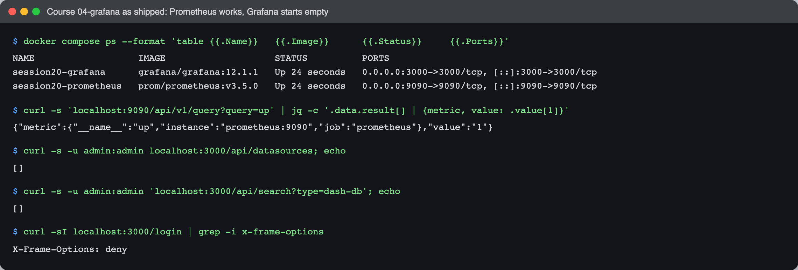

```text
$ curl -s 'localhost:9090/api/v1/query?query=up' | jq -c '.data.result[] | {metric, value: .value[1]}'
{"metric":{"__name__":"up","instance":"prometheus:9090","job":"prometheus"},"value":"1"}

$ curl -s -u admin:admin localhost:3000/api/datasources; echo
[]

$ curl -s -u admin:admin 'localhost:3000/api/search?type=dash-db'; echo
[]

$ curl -sI localhost:3000/login | grep -i x-frame-options
X-Frame-Options: deny
```

It works, but it only monitors **Prometheus itself**, and Grafana starts with **no
datasource and no dashboard**. The README has you click both into existence. There is no
volume, so `docker compose down` throws that work away and the next `up` is empty again.
So for my stack I provisioned the datasource and dashboard from files. Nothing in it is
created by clicking.

---

## Task 1 — Monitoring

### The stack

[`monitoring/docker-compose.yml`](monitoring/docker-compose.yml) keeps the course's
Prometheus `v3.5.0` and Grafana `12.1.1` and adds:

| Service | Job |
|---|---|
| `node-exporter` | host CPU / memory / disk for the machine the containers run on |
| `cadvisor` | per-container CPU and memory |
| `orders-api` | my demo app ([`app/app.py`](monitoring/app/app.py)): `/metrics`, `/health`, JSON logs, OpenTelemetry traces |
| `loadgen` | busybox calling `/order` every 0.3 s so there is traffic to look at |
| `alertmanager` + `alert-sink` | where fired alerts go. `alert-sink` is a second copy of the app that logs every webhook it gets, standing in for Slack or PagerDuty |
| `jaeger` | trace storage and UI (Task 2) |

Every service has a `mem_limit`, because this shares an 8 GB Docker VM with two kind clusters.

- [`prometheus/prometheus.yml`](monitoring/prometheus/prometheus.yml): 5 scrape jobs, rule file, Alertmanager
- [`prometheus/alerts.yml`](monitoring/prometheus/alerts.yml): 6 rules
- [`alertmanager/alertmanager.yml`](monitoring/alertmanager/alertmanager.yml): route everything to the webhook
- [`grafana/provisioning/`](monitoring/grafana/provisioning/) + [`grafana/dashboards/session20-overview.json`](monitoring/grafana/dashboards/session20-overview.json): datasource and dashboard as code

```bash
cd monitoring && docker compose up -d --build
```

### Targets and application health

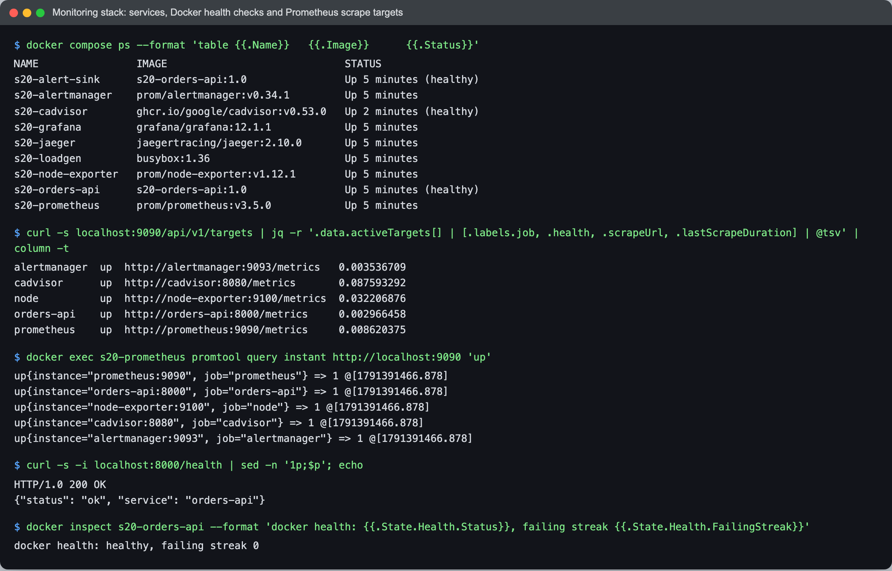

```text
$ curl -s localhost:9090/api/v1/targets | jq -r '.data.activeTargets[] | [.labels.job, .health, .scrapeUrl, .lastScrapeDuration] | @tsv' | column -t
alertmanager  up  http://alertmanager:9093/metrics   0.003536709
cadvisor      up  http://cadvisor:8080/metrics       0.087593292
node          up  http://node-exporter:9100/metrics  0.032206876
orders-api    up  http://orders-api:8000/metrics     0.002966458
prometheus    up  http://prometheus:9090/metrics     0.008620375

$ docker exec s20-prometheus promtool query instant http://localhost:9090 'up'
up{instance="prometheus:9090", job="prometheus"} => 1 @[1791391466.878]
up{instance="orders-api:8000", job="orders-api"} => 1 @[1791391466.878]
up{instance="node-exporter:9100", job="node"} => 1 @[1791391466.878]
up{instance="cadvisor:8080", job="cadvisor"} => 1 @[1791391466.878]
up{instance="alertmanager:9093", job="alertmanager"} => 1 @[1791391466.878]

$ curl -s -i localhost:8000/health | sed -n '1p;$p'; echo
HTTP/1.0 200 OK
{"status": "ok", "service": "orders-api"}

$ docker inspect s20-orders-api --format 'docker health: {{.State.Health.Status}}, failing streak {{.State.Health.FailingStreak}}'
docker health: healthy, failing streak 0
```

Application health shows up in two places, and they answer different questions:

- **`up`** is Prometheus's opinion: *could I scrape you?* Every target gets it for free.
- **`/health`** is the app's opinion: *can I do my job?* Docker's `HEALTHCHECK` calls it
  every 5 s. In Kubernetes the same endpoint would back a readiness probe.

A process can be `up` (it answers `/metrics`) while `/health` says 503, for example when
its database is gone. That is why the app also exports `app_healthy` and there is a
separate `AppUnhealthy` rule.

### CPU and memory utilisation in PromQL

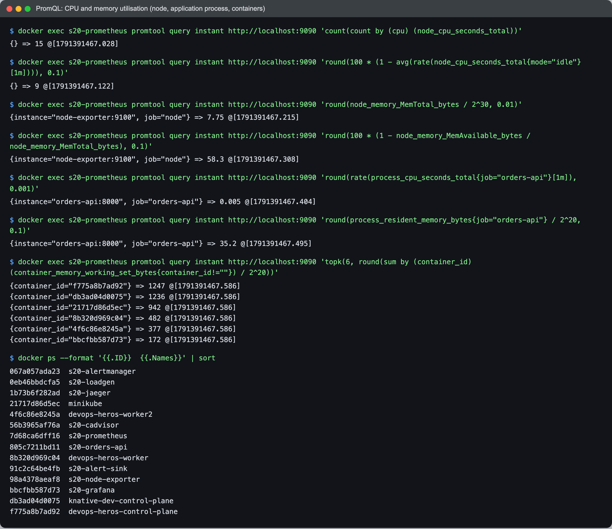

```text
$ ... 'count(count by (cpu) (node_cpu_seconds_total))'
{} => 15

$ ... 'round(100 * (1 - avg(rate(node_cpu_seconds_total{mode="idle"}[1m]))), 0.1)'
{} => 9

$ ... 'round(node_memory_MemTotal_bytes / 2^30, 0.01)'
{instance="node-exporter:9100", job="node"} => 7.75

$ ... 'round(100 * (1 - node_memory_MemAvailable_bytes / node_memory_MemTotal_bytes), 0.1)'
{instance="node-exporter:9100", job="node"} => 58.3

$ ... 'round(rate(process_cpu_seconds_total{job="orders-api"}[1m]), 0.001)'
{instance="orders-api:8000", job="orders-api"} => 0.005

$ ... 'round(process_resident_memory_bytes{job="orders-api"} / 2^20, 0.1)'
{instance="orders-api:8000", job="orders-api"} => 35.2

$ ... 'topk(6, round(sum by (container_id) (container_memory_working_set_bytes{container_id!=""}) / 2^20))'
{container_id="f775a8b7ad92"} => 1247      <- devops-heros-control-plane
{container_id="db3ad04d0075"} => 1236      <- knative-dev-control-plane
{container_id="21717d86d5ec"} => 942       <- minikube
{container_id="8b320d969c04"} => 482       <- devops-heros-worker
{container_id="4f6c86e8245a"} => 377       <- devops-heros-worker2
{container_id="bbcfbb587d73"} => 172       <- s20-grafana
```

(`...` is `docker exec s20-prometheus promtool query instant http://localhost:9090`. The
`<-` names come from `docker ps` in the same capture.)

How the formulas work:

- **CPU %**: `node_cpu_seconds_total` is a counter of seconds each CPU spent in each mode.
  `rate(...{mode="idle"}[1m])` is the fraction of each second spent idle. Average it
  across CPUs and subtract from 1 to get the busy fraction.
- **Memory %** uses `MemAvailable`, not `MemFree`. Linux fills free RAM with page cache,
  so "free" looks alarmingly low on a healthy machine. "Available" counts the cache that
  can be reclaimed.
- **"Node" here means the Docker Desktop VM** (7.75 GiB, 15 CPUs), not the Mac. 58% memory
  is the two kind clusters and minikube, which also top the container list. My whole
  monitoring stack is smaller than one kind node.

### Application metrics: traffic, errors, latency

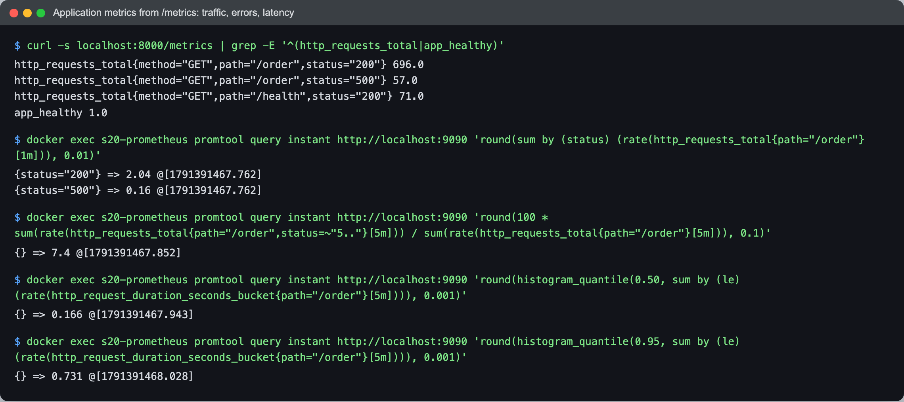

```text
$ curl -s localhost:8000/metrics | grep -E '^(http_requests_total|app_healthy)'
http_requests_total{method="GET",path="/order",status="200"} 696.0
http_requests_total{method="GET",path="/order",status="500"} 57.0
http_requests_total{method="GET",path="/health",status="200"} 71.0
app_healthy 1.0

$ ... 'round(sum by (status) (rate(http_requests_total{path="/order"}[1m])), 0.01)'
{status="200"} => 2.04
{status="500"} => 0.16

$ ... error ratio over 5m, in %
{} => 7.4

$ ... 'round(histogram_quantile(0.50, sum by (le) (rate(http_request_duration_seconds_bucket{path="/order"}[5m]))), 0.001)'
{} => 0.166

$ ... 'round(histogram_quantile(0.95, sum by (le) (rate(http_request_duration_seconds_bucket{path="/order"}[5m]))), 0.001)'
{} => 0.731
```

**p50 is 166 ms but p95 is 731 ms.** The app sends about 10% of requests to a slow
database path. An average would blur that into roughly 200 ms and look fine, while one
user in ten waits more than half a second. That gap is why latency is tracked as
percentiles from a histogram. The raw counter (`696`) only ever goes up, so it means
nothing until `rate()` turns it into requests per second.

### Logs

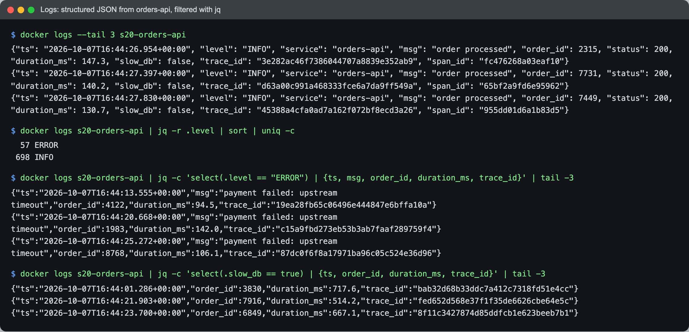

```text
$ docker logs --tail 3 s20-orders-api
{"ts": "2026-10-07T16:44:26.954+00:00", "level": "INFO", "service": "orders-api", "msg": "order processed", "order_id": 2315, "status": 200, "duration_ms": 147.3, "slow_db": false, "trace_id": "3e282ac46f7386044707a8839e352ab9", "span_id": "fc476268a03eaf10"}
...

$ docker logs s20-orders-api | jq -r .level | sort | uniq -c
  57 ERROR
 698 INFO

$ docker logs s20-orders-api | jq -c 'select(.level == "ERROR") | {ts, msg, order_id, duration_ms, trace_id}' | tail -3
{"ts":"2026-10-07T16:44:13.555+00:00","msg":"payment failed: upstream timeout","order_id":4122,"duration_ms":94.5,"trace_id":"19ea28fb65c06496e444847e6bffa10a"}
{"ts":"2026-10-07T16:44:20.668+00:00","msg":"payment failed: upstream timeout","order_id":1983,"duration_ms":142.0,"trace_id":"c15a9fbd273eb53b3ab7faaf289759f4"}
{"ts":"2026-10-07T16:44:25.272+00:00","msg":"payment failed: upstream timeout","order_id":8768,"duration_ms":106.1,"trace_id":"87dc0f6f8a17971ba96c05c524e36d96"}
```

Because every line is a JSON object, `jq` can count, filter and project fields.
`57 ERROR` here matches `status="500"} 57.0` in the metrics above: two independent signals
agreeing. With plain-text logs the same question needs a fragile `grep` on message wording.
The `trace_id` field is what connects a log line to a trace (Task 2).

### Alerts: InstanceDown fires, notifies and resolves

The rules use short `for:` windows so they fire within a minute. In production they would
be minutes long, so that one slow scrape does not page anyone.

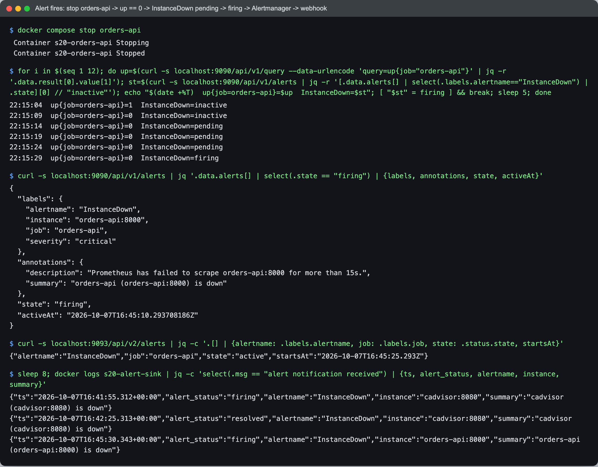

```text
$ docker compose stop orders-api
 Container s20-orders-api Stopping
 Container s20-orders-api Stopped

$ for i in $(seq 1 12); do ... up{job="orders-api"} and the InstanceDown state every 5s ...; done
22:15:04  up{job=orders-api}=1  InstanceDown=inactive
22:15:09  up{job=orders-api}=0  InstanceDown=inactive
22:15:14  up{job=orders-api}=0  InstanceDown=pending
22:15:19  up{job=orders-api}=0  InstanceDown=pending
22:15:24  up{job=orders-api}=0  InstanceDown=pending
22:15:29  up{job=orders-api}=0  InstanceDown=firing

$ curl -s localhost:9090/api/v1/alerts | jq '.data.alerts[] | select(.state == "firing") | {labels, annotations, state, activeAt}'
{
  "labels": { "alertname": "InstanceDown", "instance": "orders-api:8000", "job": "orders-api", "severity": "critical" },
  "annotations": {
    "description": "Prometheus has failed to scrape orders-api:8000 for more than 15s.",
    "summary": "orders-api (orders-api:8000) is down"
  },
  "state": "firing",
  "activeAt": "2026-10-07T16:45:10.293708186Z"
}

$ curl -s localhost:9093/api/v2/alerts | jq -c '.[] | {alertname: .labels.alertname, job: .labels.job, state: .status.state, startsAt}'
{"alertname":"InstanceDown","job":"orders-api","state":"active","startsAt":"2026-10-07T16:45:25.293Z"}

$ sleep 8; docker logs s20-alert-sink | jq -c 'select(.msg == "alert notification received") | {ts, alert_status, alertname, instance, summary}'
{"ts":"2026-10-07T16:41:55.312+00:00","alert_status":"firing","alertname":"InstanceDown","instance":"cadvisor:8080","summary":"cadvisor (cadvisor:8080) is down"}
{"ts":"2026-10-07T16:42:25.313+00:00","alert_status":"resolved","alertname":"InstanceDown","instance":"cadvisor:8080","summary":"cadvisor (cadvisor:8080) is down"}
{"ts":"2026-10-07T16:45:30.343+00:00","alert_status":"firing","alertname":"InstanceDown","instance":"orders-api:8000","summary":"orders-api (orders-api:8000) is down"}
```

The full lifecycle is visible:

1. `up` drops to 0 on the first failed scrape.
2. The alert goes **pending**. The condition is true, but `for: 15s` has not elapsed.
3. It goes **firing** about 15 s later.
4. Prometheus hands it to Alertmanager, which waits `group_wait: 5s` and then calls the webhook.

**Prometheus decides *when*; Alertmanager decides *who hears about it*.**

The first two lines in the sink's log were a surprise: they are not from this test. While
building the stack I restarted cAdvisor with a misspelt flag (see Problems), it crashed,
and the stack paged me about my own mistake 30 seconds later.

The receiver is deliberately **not** `orders-api` itself. An "orders-api is down" alert
could never be delivered to orders-api.

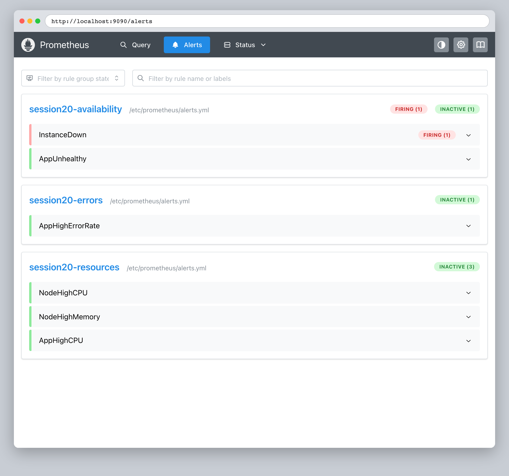

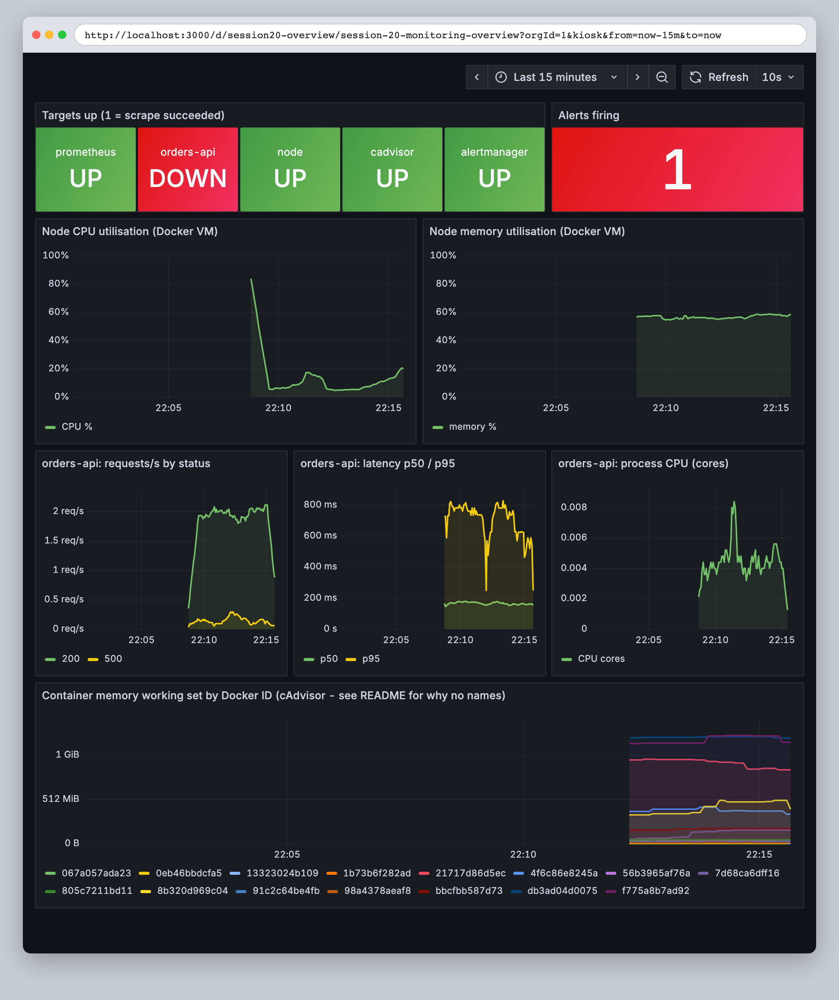

That is the provisioned dashboard (no clicking): `orders-api` DOWN, 1 alert firing, and the
requests/s line dropping as the target disappears.

Resolving:

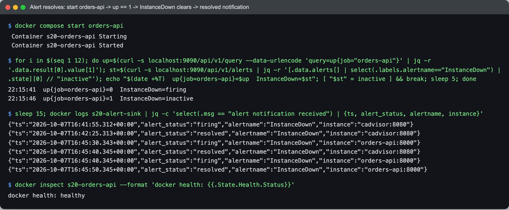

```text
$ docker compose start orders-api
$ for i in ...; done
22:15:41  up{job=orders-api}=0  InstanceDown=firing
22:15:46  up{job=orders-api}=1  InstanceDown=inactive

$ sleep 15; docker logs s20-alert-sink | jq -c 'select(.msg == "alert notification received") | {ts, alert_status, alertname, instance}'
...
{"ts":"2026-10-07T16:45:30.343+00:00","alert_status":"firing","alertname":"InstanceDown","instance":"orders-api:8000"}
{"ts":"2026-10-07T16:45:40.345+00:00","alert_status":"resolved","alertname":"InstanceDown","instance":"cadvisor:8080"}
{"ts":"2026-10-07T16:45:40.345+00:00","alert_status":"firing","alertname":"InstanceDown","instance":"orders-api:8000"}
{"ts":"2026-10-07T16:45:50.345+00:00","alert_status":"resolved","alertname":"InstanceDown","instance":"orders-api:8000"}
```

`send_resolved: true` produces the "all clear". The 16:45:40 notification repeats the old
cadvisor alert because Alertmanager **groups by `alertname`**. A notification carries the
whole group, so the cadvisor and orders-api alerts travel together. Grouping is what stops
a 50-node outage from becoming 50 separate pages.

### Alerts: CPU, and why a node-level CPU alert would have missed it

`GET /burn?seconds=100` pins one core in a background thread:

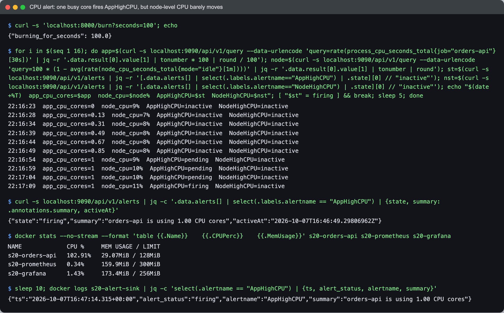

```text
22:16:23  app_cpu_cores=0  node_cpu=9%  AppHighCPU=inactive  NodeHighCPU=inactive
22:16:28  app_cpu_cores=0.13  node_cpu=7%  AppHighCPU=inactive  NodeHighCPU=inactive
22:16:34  app_cpu_cores=0.31  node_cpu=8%  AppHighCPU=inactive  NodeHighCPU=inactive
22:16:39  app_cpu_cores=0.49  node_cpu=8%  AppHighCPU=inactive  NodeHighCPU=inactive
22:16:44  app_cpu_cores=0.67  node_cpu=8%  AppHighCPU=inactive  NodeHighCPU=inactive
22:16:49  app_cpu_cores=0.85  node_cpu=8%  AppHighCPU=inactive  NodeHighCPU=inactive
22:16:54  app_cpu_cores=1  node_cpu=9%  AppHighCPU=pending  NodeHighCPU=inactive
22:16:59  app_cpu_cores=1  node_cpu=10%  AppHighCPU=pending  NodeHighCPU=inactive
22:17:04  app_cpu_cores=1  node_cpu=10%  AppHighCPU=pending  NodeHighCPU=inactive
22:17:09  app_cpu_cores=1  node_cpu=11%  AppHighCPU=firing  NodeHighCPU=inactive

$ docker stats --no-stream --format 'table {{.Name}}\t{{.CPUPerc}}\t{{.MemUsage}}' s20-orders-api s20-prometheus s20-grafana
NAME             CPU %     MEM USAGE / LIMIT
s20-orders-api   102.91%   29.07MiB / 128MiB
...

$ sleep 10; docker logs s20-alert-sink | jq -c 'select(.alertname == "AppHighCPU") | {ts, alert_status, alertname, summary}'
{"ts":"2026-10-07T16:47:14.315+00:00","alert_status":"firing","alertname":"AppHighCPU","summary":"orders-api is using 1.00 CPU cores"}
```

Two things are visible here:

- **The ramp is the `[30s]` window.** The app was at 100% from the first second, but
  `rate()` averages over 30 s, so the value climbs 0.13 → 0.31 → … → 1. Window length
  trades noise for reaction time.
- **The node never noticed.** One core pinned is 1/15 of this VM, about 7%. Node CPU went
  from 9% to 11%. A single-threaded service can be completely saturated while the host
  dashboard looks calm, so per-process or per-container CPU is the alert that catches it.

---

## Task 2 — Observability

### Monitoring vs observability

Monitoring answers questions I knew to ask in advance: *is it up, is CPU over 80%, is the
error rate over 20%?* Each one is a rule written before the problem. Observability is
being able to answer a question I did **not** think of in advance, such as *why are 10% of
orders slow?*, from the data the system already emits, without shipping new code to find
out. You need it because a distributed system fails in combinations nobody wrote a rule
for. Alerts tell you that something is wrong; the signals below tell you where and why.

### The three pillars, with real examples from one app

| Pillar | What it is | Good at | Bad at | Example from my run |
|---|---|---|---|---|
| **Metrics** | numbers sampled over time, with labels | trends, alerting, cheap long retention | the details of one specific request | `http_requests_total{status="500"} 57.0`, p95 `0.731` |
| **Logs** | timestamped records of discrete events | the exact details of what happened | aggregating across millions of lines (slow, costly) | `{"level":"ERROR","msg":"payment failed: upstream timeout",...}` |
| **Traces** | one request's path through the system as a tree of timed spans | *where* the time went | volume: usually sampled | `GET /order 677 ms → db.query 580 ms` |

The app ([`monitoring/app/app.py`](monitoring/app/app.py)) emits all three: `prometheus_client`
for metrics, JSON on stdout for logs, and the **OpenTelemetry SDK** exporting spans over
OTLP/HTTP to **Jaeger**. It stamps each log line with the current trace's `trace_id`.

### One slow request, followed through all three

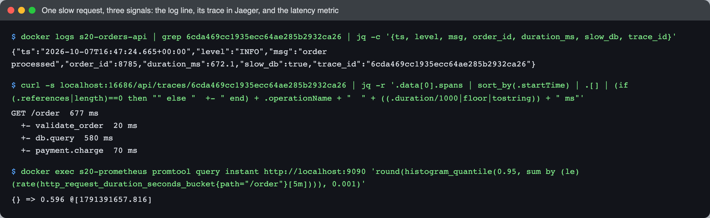

```text
$ docker logs s20-orders-api | grep 6cda469cc1935ecc64ae285b2932ca26 | jq -c '{ts, level, msg, order_id, duration_ms, slow_db, trace_id}'
{"ts":"2026-10-07T16:47:24.665+00:00","level":"INFO","msg":"order processed","order_id":8785,"duration_ms":672.1,"slow_db":true,"trace_id":"6cda469cc1935ecc64ae285b2932ca26"}

$ curl -s localhost:16686/api/traces/6cda469cc1935ecc64ae285b2932ca26 | jq -r '.data[0].spans | sort_by(.startTime) | .[] | ...'
GET /order  677 ms
  +- validate_order  20 ms
  +- db.query  580 ms
  +- payment.charge  70 ms

$ docker exec s20-prometheus promtool query instant http://localhost:9090 'round(histogram_quantile(0.95, sum by (le) (rate(http_request_duration_seconds_bucket{path="/order"}[5m]))), 0.001)'
{} => 0.596
```

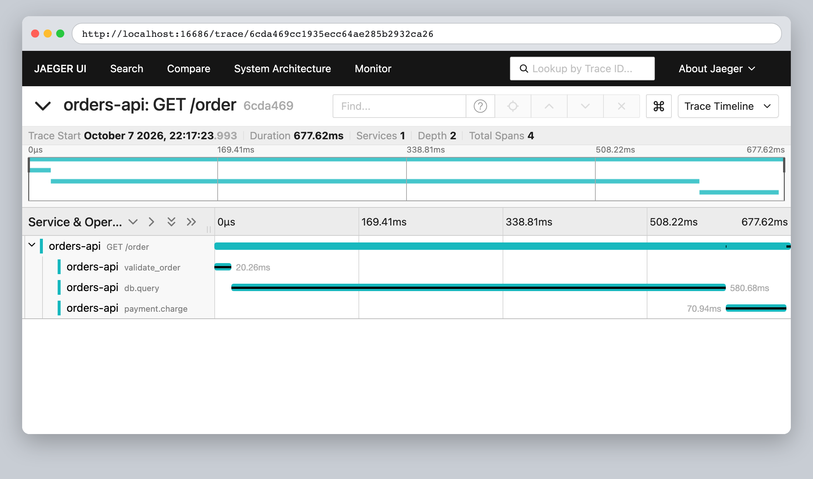

Read in the order an investigation would go:

1. The **metric** says p95 is about 0.6 s. Something is slow, but not what or where.
2. The **log** gives one concrete slow order (8785, 672 ms) and its `trace_id`.
3. The **trace** shows 580 of the 677 ms went to `db.query`. The problem is the database,
   not validation or payments.

This is the course's 01 example (`Database = 1.2s`) actually happening, not a diagram. The
`trace_id` in the log line is what makes the hop from step 2 to step 3 a lookup instead of
a guess.

### Common tools

| Signal | Collect | Store / query | Look at |
|---|---|---|---|
| Metrics | exporters (node-exporter, cAdvisor, kube-state-metrics), app client libraries | **Prometheus**, Thanos / Mimir / VictoriaMetrics for scale | **Grafana** |
| Logs | Fluent Bit, Promtail / Alloy, Vector | **Loki**, Elasticsearch / OpenSearch | Grafana, Kibana |
| Traces | **OpenTelemetry** SDKs + Collector | **Jaeger**, Tempo, Zipkin | Jaeger UI, Grafana |
| Alerts | Prometheus rules | **Alertmanager** | Slack / PagerDuty / email |

OpenTelemetry is the vendor-neutral standard for *producing* the signals. Swapping Jaeger
for Tempo would change one environment variable here, not the app.

### Kubernetes observability

The same three signals exist in Kubernetes, just from more places:

- **Metrics:** the kubelet's built-in cAdvisor (per-pod CPU and memory),
  **metrics-server** (feeds `kubectl top` and the HPA, latest values only, no history),
  **kube-state-metrics** (object state such as "deployment wants 3, has 2"), and
  node-exporter as a DaemonSet. Prometheus discovers pods through the Kubernetes API
  instead of the static target list I used. `kubectl top` is metrics-server at work:

  ```text
  $ kubectl top nodes; kubectl -n argocd top pods
  NAME                         CPU(cores)   CPU(%)   MEMORY(bytes)   MEMORY(%)
  devops-heros-control-plane   95m          0%       1328Mi          16%
  devops-heros-worker          65m          0%       653Mi           8%
  devops-heros-worker2         62m          0%       708Mi           8%
  NAME                                  CPU(cores)   MEMORY(bytes)
  argocd-application-controller-0       34m          144Mi
  argocd-redis-869ffc4dd6-sg9k4         3m           5Mi
  argocd-repo-server-855594f74d-bwppm   23m          129Mi
  argocd-server-6d9dd9f68-vw7mh         1m           42Mi
  ```

  (from the [self-heal capture](screenshots/argocd-selfheal.png) in Task 3)
- **Logs:** containers write to stdout, the kubelet keeps them per pod (`kubectl logs`), and
  a DaemonSet shipper (Fluent Bit or Promtail) sends them to Loki or Elasticsearch, because
  `kubectl logs` loses everything when the pod is deleted.
- **Traces:** OpenTelemetry Collector as a DaemonSet or sidecar. A service mesh can add
  spans for network hops without app changes.
- **Events and probes:** `kubectl get events`, and liveness/readiness probes, which are
  Kubernetes acting on the same `/health` idea as the Docker health check above.

---

## Task 3 — GitOps with Argo CD

### The idea

**GitOps** means the cluster's desired state is **declared in Git**, and an agent in the
cluster **continuously reconciles** the live state toward it. Changes happen by commit,
not by `kubectl`.

- **Git as source of truth:** every change has an author, a diff, a review and a revert.
- **Declarative:** the manifests say *what* should exist (3 replicas of nginx:1.25), not
  the steps to get there.
- **Continuous reconciliation:** Argo CD keeps comparing Git to the cluster. If either
  side moves, it acts.

```text
edit YAML -> git commit -> git push -> Argo CD sees new revision -> diff vs cluster -> apply
                                              ^                                         |
                                              +------- drift? re-apply Git's version ---+
```

### Setup

- Argo CD **v3.5.4**, pinned, applied server-side:
  `kubectl apply -n argocd --server-side --force-conflicts -f https://raw.githubusercontent.com/argoproj/argo-cd/v3.5.4/manifests/install.yaml`.
  The course uses the moving `stable` URL, which gives a different version every month.
  I scaled `dex-server`, `notifications-controller` and `applicationset-controller` to 0
  because none is used here, and memory was tight.
- [`gitops/app/`](gitops/app/): Deployment (nginx:1.25-alpine, 2 replicas, readiness probe,
  resource limits) and Service. These are the **only** files Argo CD syncs.
- [`gitops/argocd-application.yaml`](gitops/argocd-application.yaml): applied once by hand.
  It points at this repo, path `session20-monitoring-observability-gitops/task/gitops/app`,
  with `automated: {prune: true, selfHeal: true}` and `CreateNamespace=true`.

It deliberately sits **outside** `app/`. In the course's
[`07-argocd/app/`](../07-argocd/app/) the Application manifest is inside the very
directory it tells Argo CD to sync. The file's own comment says not to do that, and the 08
README says the same. If you point Argo CD at that folder, the Application becomes part of
its own desired state. I did not reproduce that (I can only push to my own task folder);
I kept them apart.

### (a) Initial sync from Git

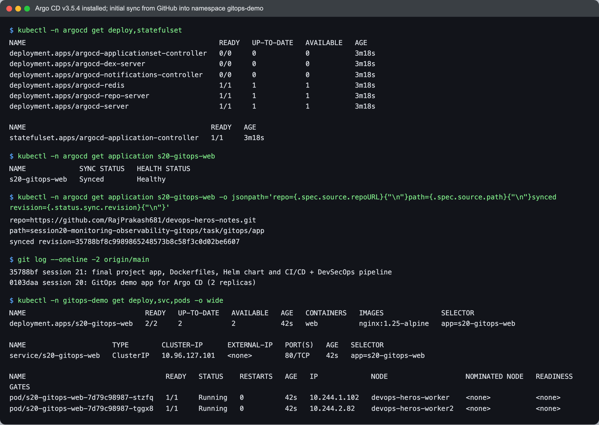

```text
$ kubectl -n argocd get application s20-gitops-web
NAME             SYNC STATUS   HEALTH STATUS
s20-gitops-web   Synced        Healthy

$ kubectl -n argocd get application s20-gitops-web -o jsonpath='repo=...path=...synced revision=...'
repo=https://github.com/RajPrakash681/devops-heros-notes.git
path=session20-monitoring-observability-gitops/task/gitops/app
synced revision=35788bf8c9989865248573b8c58f3c0d02be6607

$ git log --oneline -2 origin/main
35788bf session 21: final project app, Dockerfiles, Helm chart and CI/CD + DevSecOps pipeline
0103daa session 20: GitOps demo app for Argo CD (2 replicas)

$ kubectl -n gitops-demo get deploy,svc,pods -o wide
deployment.apps/s20-gitops-web   2/2     2            2           42s   web          nginx:1.25-alpine   app=s20-gitops-web
service/s20-gitops-web   ClusterIP   10.96.127.101   <none>        80/TCP    42s   app=s20-gitops-web
pod/s20-gitops-web-7d79c98987-stzfq   1/1     Running   0          42s   10.244.1.102   devops-heros-worker
pod/s20-gitops-web-7d79c98987-tggx8   1/1     Running   0          42s   10.244.2.82    devops-heros-worker2
```

I pushed my manifests as `0103daa`, but Argo CD reports `35788bf`, a session 21 commit
pushed to the same branch a minute later. **Argo CD tracks the branch, not a commit**: it
resolves `targetRevision: main` to whatever the tip is and renders my path at that
revision. A commit that touches nothing under my path still becomes the "synced revision".
To pin exactly, `targetRevision` can be a tag or a SHA.

### (b) A git commit, pushed, applied by Argo CD

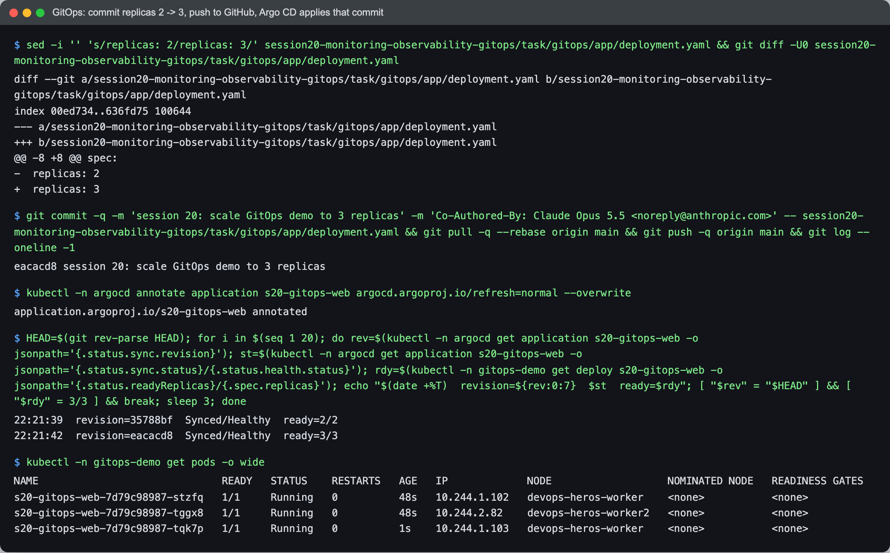

```text
$ sed -i '' 's/replicas: 2/replicas: 3/' .../gitops/app/deployment.yaml && git diff -U0 .../deployment.yaml
@@ -8 +8 @@ spec:
-  replicas: 2
+  replicas: 3

$ git commit -q -m 'session 20: scale GitOps demo to 3 replicas' ... && git pull -q --rebase origin main && git push -q origin main && git log --oneline -1
eacacd8 session 20: scale GitOps demo to 3 replicas

$ kubectl -n argocd annotate application s20-gitops-web argocd.argoproj.io/refresh=normal --overwrite
application.argoproj.io/s20-gitops-web annotated

$ HEAD=$(git rev-parse HEAD); for i in ...; done
22:21:39  revision=35788bf  Synced/Healthy  ready=2/2
22:21:42  revision=eacacd8  Synced/Healthy  ready=3/3

$ kubectl -n gitops-demo get pods -o wide
s20-gitops-web-7d79c98987-stzfq   1/1     Running   0          48s   10.244.1.102   devops-heros-worker
s20-gitops-web-7d79c98987-tggx8   1/1     Running   0          48s   10.244.2.82    devops-heros-worker2
s20-gitops-web-7d79c98987-tqk7p   1/1     Running   0          1s    10.244.1.103   devops-heros-worker
```

**Synced revision = `eacacd8`, my pushed commit**, and the third pod is 1 s old. I never ran
`kubectl scale`. The cluster changed because Git changed.

The `refresh` annotation tells Argo CD to re-check Git now instead of waiting for its
default 3-minute poll. In a real setup a GitHub webhook does the same thing on every push.

### (c) Drift: change the cluster by hand, Argo CD puts it back

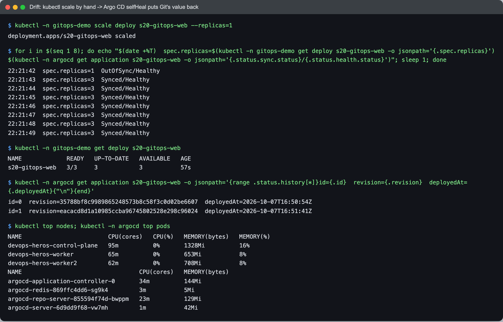

```text
$ kubectl -n gitops-demo scale deploy s20-gitops-web --replicas=1
deployment.apps/s20-gitops-web scaled

$ for i in $(seq 1 8); do ... spec.replicas and sync status every 1s ...; done
22:21:42  spec.replicas=1  OutOfSync/Healthy
22:21:43  spec.replicas=3  Synced/Healthy
22:21:44  spec.replicas=3  Synced/Healthy
...

$ kubectl -n gitops-demo get deploy s20-gitops-web
NAME             READY   UP-TO-DATE   AVAILABLE   AGE
s20-gitops-web   3/3     3            3           57s
```

The manual change lasted about **one second**. Argo CD watches the live objects, so it saw
`OutOfSync` immediately. With `selfHeal: true` it re-applied Git's `replicas: 3`. This is
the practical meaning of "Git is the source of truth": an emergency `kubectl` fix on a
GitOps cluster is silently undone. A real hotfix has to go through Git, or you pause
auto-sync first.

### (d) History

```text
$ kubectl -n argocd get application s20-gitops-web -o jsonpath='{range .status.history[*]}...{end}'
id=0  revision=35788bf8c9989865248573b8c58f3c0d02be6607  deployedAt=2026-10-07T16:50:54Z
id=1  revision=eacacd8d1a10985ccba96745802528e298c96024  deployedAt=2026-10-07T16:51:41Z
```

Two deployments, one per Git revision. The self-heal did **not** add a third entry. It
re-applied the *same* revision, so as far as history is concerned nothing was deployed.
Argo CD history is a history of revisions, and Git holds the real audit trail: `git log`
shows who changed replicas, when and why.

---

## What I learned

- **`for:` is what separates an alert from noise.** Watching `inactive → pending → firing`
  showed the condition was true for 15 s before anyone was told. Without it, every blip
  pages someone.
- **Host metrics hide single-core saturation.** 1.00 cores busy was +2% node CPU on a
  15-CPU VM. Alert where the bottleneck is (process or container), not only on the host.
- **Averages lie about latency.** p50 166 ms and p95 731 ms describe the same traffic.
- **The `trace_id` in a log line is the useful link between pillars.** Metrics told me
  something was slow, the log gave me a specific request, and the trace pointed at
  `db.query`.
- **Argo CD follows a branch, not my commit.** Someone else's unrelated push became my
  app's synced revision. Pin a tag or SHA if that matters.
- **SelfHeal makes `kubectl` edits temporary**, about 1 s here, which is the point of
  GitOps and also a trap during an incident.
- **Provisioned Grafana survives `docker compose down`; clicked Grafana does not.** Same
  lesson as GitOps, applied to dashboards.

## Problems I hit

- **cAdvisor saw no containers, for two different reasons, one after the other.**
  1. The usual recipe mounts the directory `/var/run`. On Docker Desktop for Mac that
     mounted the **Mac's** `/var/run` (it sits under the shared `/private` tree). Listing
     it from a container showed `com.apple.*` files and no `docker.sock`, so cAdvisor
     logged `Cannot connect to the Docker daemon`. Only the exact path
     `/var/run/docker.sock` is redirected to the engine's socket.
  2. With the socket mounted, the Docker factory registered but every container failed
     with `failed to identify the read-write layer ID ... open /rootfs/var/lib/docker/image/overlayfs/layerdb/mounts/...`.
     `docker info` shows `driver-type io.containerd.snapshotter.v1`: this engine uses the
     containerd image store, which has no `layerdb`. v0.52.1 and v0.53.0 both failed.

  Fix: I deliberately did not mount the socket. cAdvisor then falls back to its raw
  cgroup handler and still measures every `/docker/<id>` cgroup, just without names, and a
  Prometheus `metric_relabel_configs` turns the cgroup path into the same 12-character
  `container_id` that `docker ps` prints. The data is all there; only the metadata is
  missing. That is why the dashboard panel shows IDs.
- **My own typo fired the first real alert.** cAdvisor's flag is
  `--raw_cgroup_prefix_whitelist`, not `_allowlist`. The container exited with
  `flag provided but not defined`, and 30 s later `InstanceDown{instance="cadvisor:8080"}`
  was delivered to the sink. Annoying, but it proved the alert path worked before I tested
  it on purpose.
- **Grafana would not render inside the screenshot frame** at first: it sends
  `X-Frame-Options: deny` by default (shown in the baseline capture). I set
  `GF_SECURITY_ALLOW_EMBEDDING=true` and anonymous **Viewer** access in the compose file.
  That is fine for a local lab and not something to copy to a shared Grafana.
- **The synced revision was not the commit I pushed** (Task 3a). I first suspected a stale
  cache. `git log origin/main` and `git merge-base --is-ancestor 0103daa 35788bf` showed a
  newer commit on the branch containing mine, so Argo CD was correct.
- **Memory budget.** The containers already running (this kind cluster, a second kind
  cluster and minikube) were using about 4.4 GB of the 8 GB VM before I started. Every
  compose service got a `mem_limit`, the monitoring stack was torn down before Argo CD
  went in, and three unused Argo CD components were scaled to 0.

## Cleanup

```bash
cd monitoring && docker compose down
kubectl -n argocd delete application s20-gitops-web
kubectl delete namespace gitops-demo
kubectl delete -n argocd -f https://raw.githubusercontent.com/argoproj/argo-cd/v3.5.4/manifests/install.yaml
kubectl delete namespace argocd
```
