# Session 21 — Final DevOps Project — Task

- **Name:** Raj Prakash
- **Enrollment No:** 24BCS10328

> **Status:** done, with the gaps listed honestly in [What is not done](#what-is-not-done).
>
> Environment: macOS on Apple Silicon, Docker Desktop, a 3-node **kind** cluster (Kubernetes
> v1.34) with metrics-server and ingress-nginx, Helm v3.22, Terraform v1.16.5.
> CI/CD ran on GitHub-hosted `ubuntu-latest` runners:
> [run 37654989563](https://github.com/RajPrakash681/devops-heros-notes/actions/runs/37654989563),
> commit `35788bf`, every stage green on the first run.
> Everything Kubernetes in this write-up ran on my local kind cluster unless it says "runner".

## Contents

1. [Project overview](#1-project-overview)
2. [Architecture](#2-architecture)
3. [Technologies used](#3-technologies-used)
4. [The course project as shipped](#4-the-course-project-as-shipped)
5. [Application setup](#5-application-setup)
6. [Docker setup](#6-docker-setup)
7. [Kubernetes deployment (Helm)](#7-kubernetes-deployment-with-helm)
8. [Terraform infrastructure](#8-terraform-infrastructure)
9. [CI/CD pipeline](#9-cicd-pipeline)
10. [DevSecOps implementation](#10-devsecops-implementation)
11. [Monitoring](#11-monitoring)
12. [GitOps](#12-gitops)
13. [Troubleshooting challenge](#13-troubleshooting-challenge)
14. [Screenshots](#14-screenshots)
15. [What is not done](#what-is-not-done)
16. [Lessons learned](#lessons-learned)
17. [Problems I hit](#problems-i-hit)

---

## 1. Project overview

TaskBoard is a small task tracker: a React dashboard, a FastAPI REST API and PostgreSQL. The
application comes from the course's reference project in [`../`](../) (committed unchanged in
`2c049ab` so the diff to my version is visible). The DevOps work around it is the point:
tests, two container images, a Helm chart with every object the task asks for, a pipeline that
builds, tests, scans, pushes and deploys, and a troubleshooting exercise on the running app.

What I changed in the application itself:

- `GET /api/info` returns version, environment (from the ConfigMap), the git SHA baked into
  the image and the pod name. The CI smoke test uses it to prove the deployed build is the
  commit being tested.
- Database settings come from `DB_HOST`/`DB_NAME` (ConfigMap) and `DB_USER`/`DB_PASSWORD`
  (Secret) instead of one hard-coded URL; the URL is built with SQLAlchemy's `URL.create`,
  which escapes special characters in the password.
- `/ready` returns **503** when the database is unreachable instead of raising a 500.
- The app no longer creates tables at startup. Alembic owns the schema and runs as a
  separate step (init container in Kubernetes, `migrate` service in Compose).
- Probe and Prometheus requests are filtered out of the access log so real API calls are
  visible in `kubectl logs`.
- 19 tests instead of 3 (the course's 3rd test failed, see section 4).

## 2. Architecture

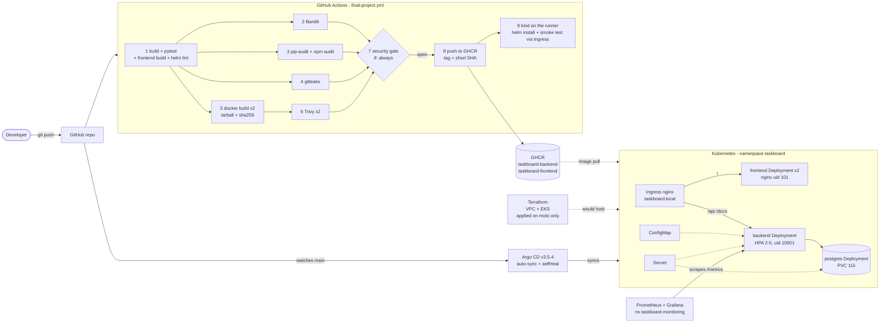
```mermaid
flowchart LR
    dev([Developer]) -->|git push| gh[GitHub repo]
    gh --> ci

    subgraph ci["GitHub Actions - final-project.yml"]
        t[1 build + pytest<br/>+ frontend build + helm lint] --> sast[2 Bandit]
        t --> sca[3 pip-audit + npm audit]
        t --> sec[4 gitleaks]
        t --> db[5 docker build x2<br/>tarball + sha256]
        db --> tv[6 Trivy x2]
        sast & sca & sec & tv --> gate{7 security gate<br/>if: always}
        gate -->|open| push[8 push to GHCR<br/>tag = short SHA]
        push --> dep[9 kind on the runner<br/>helm install + smoke test via Ingress]
    end

    push --> ghcr[(GHCR<br/>taskboard-backend<br/>taskboard-frontend)]

    subgraph k8s["Kubernetes - namespace taskboard"]
        ing[Ingress nginx<br/>taskboard.local] -->|/| fe[frontend Deployment x2<br/>nginx uid 101]
        ing -->|/api /docs| be[backend Deployment<br/>HPA 2-5, uid 10001]
        be --> pg[(postgres Deployment<br/>PVC 1Gi)]
        cm[ConfigMap] -.-> be
        s[Secret] -.-> be & pg
    end

    ghcr -.->|image pull| k8s
    tf[Terraform<br/>VPC + EKS<br/>applied on moto only] -.->|would host| k8s
    gh -->|watches main| argo[Argo CD v3.5.4<br/>auto-sync + selfHeal]
    argo -->|syncs| k8s
    prom[Prometheus + Grafana<br/>ns taskboard-monitoring] -->|scrapes /metrics| be
```

The Terraform line is dashed: it was planned and applied against the moto emulator, not a
real AWS account (section 8). Argo CD and Prometheus ran on the kind cluster (sections 11-12).

## 3. Technologies used

| Layer | Tool |
|---|---|
| Application | FastAPI 0.142, SQLAlchemy 2.1, Alembic 1.20, PostgreSQL 16, React 19 + Vite 8 |
| Tests | pytest 9.1 + pytest-cov, FastAPI TestClient on a throwaway SQLite file |
| Containers | Docker, `python:3.12-slim` (pip removed), `nginxinc/nginx-unprivileged:1.29-alpine`, Compose |
| CI/CD | GitHub Actions, GHCR, kind on the runner, Helm |
| DevSecOps | Bandit 1.9.4, pip-audit 2.10.1, npm audit, gitleaks 8.30.1, Trivy 0.75.0 (both pinned + checksum verified) |
| Kubernetes | kind v1.34, ingress-nginx, metrics-server, Helm v3.22 |
| IaC | Terraform 1.16.5, terraform-aws-modules vpc 5.8.1 / eks 20.37.1, hashicorp/aws 5.100.0, moto 5.2.3 (emulator) |
| Monitoring | Prometheus v3.5.0, Grafana 12.1.1 (plain manifests), prometheus-fastapi-instrumentator, metrics-server |
| GitOps | Argo CD v3.5.4 |

## Project layout

```text
final-devops-project/
├── application/backend/      FastAPI app, Alembic migration, tests (19), requirements*.txt
├── application/frontend/     React app, nginx config template, package-lock.json
├── docker/                   backend.Dockerfile, frontend.Dockerfile, docker-compose.yml
├── kubernetes/               namespace.yaml
├── helm/taskboard/           the chart: ConfigMap, Secret, Deployments, Services, Ingress, HPA, PVC
├── terraform/                VPC + EKS (course code, made valid), emulator_override.tf (moto), tfvars example
├── .github/workflows/        copy of the pipeline (the one GitHub runs is at the repo root)
├── security/                 bandit.yaml, .gitleaks.toml, .trivyignore
├── monitoring/               Prometheus + Grafana manifests, dashboard JSON (section 11)
├── gitops/                   Argo CD Application + values-gitops.yaml (section 12)
├── scripts/                  load-test.sh (course)
└── screenshots/
```

---

## 4. The course project as shipped

Before changing anything I ran the course's own code, because the task says to keep it honest
when course files are broken. Three things were broken.

**The tests fail.** `pytest` on the course backend: `1 failed, 2 passed`, with
`sqlite3.OperationalError: no such table: tasks`. The test file creates
`client = TestClient(app)` at module level, without `with`, so FastAPI's startup event (the
`create_all` call) never runs. The course pipeline would have stopped at its first job.

**The Helm chart cannot be installed, and once forced, does not serve.**

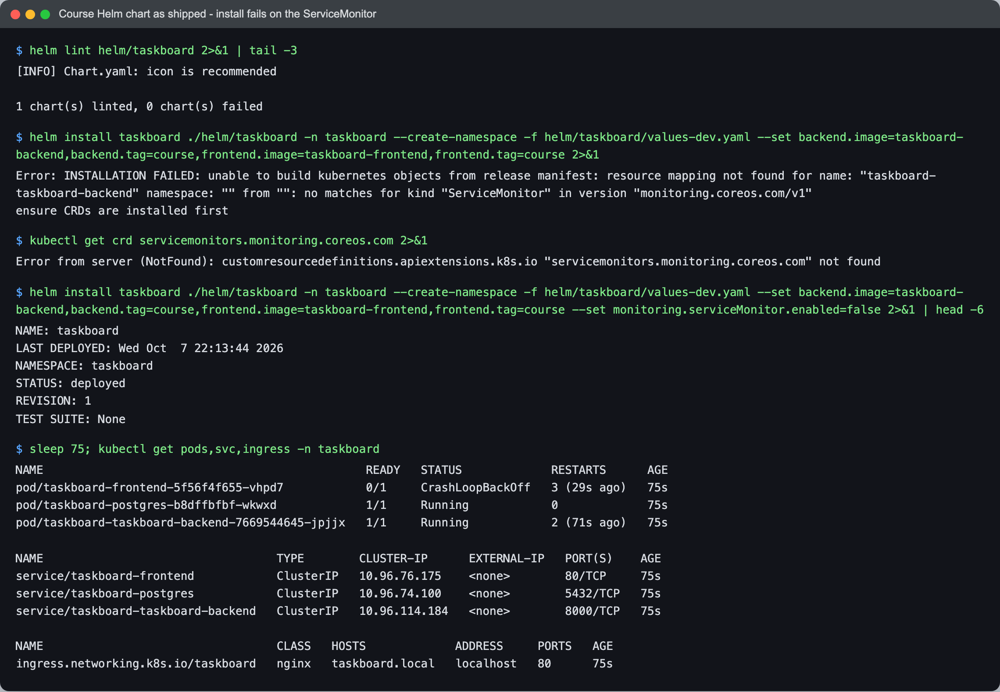

```text
$ helm install taskboard ./helm/taskboard -n taskboard --create-namespace -f helm/taskboard/values-dev.yaml --set ...
Error: INSTALLATION FAILED: unable to build kubernetes objects from release manifest: resource mapping not found for name: "taskboard-taskboard-backend" namespace: "" from "": no matches for kind "ServiceMonitor" in version "monitoring.coreos.com/v1"
ensure CRDs are installed first
```

The ServiceMonitor is enabled by default and needs the Prometheus Operator's CRDs. With
`--set monitoring.serviceMonitor.enabled=false` it installs, and after 75 s:

```text
NAME                                               READY   STATUS             RESTARTS      AGE
pod/taskboard-frontend-5f56f4f655-vhpd7            0/1     CrashLoopBackOff   3 (29s ago)   75s
pod/taskboard-postgres-b8dffbfbf-wkwxd             1/1     Running            0             75s
pod/taskboard-taskboard-backend-7669544645-jpjjx   1/1     Running            2 (71s ago)   75s
```

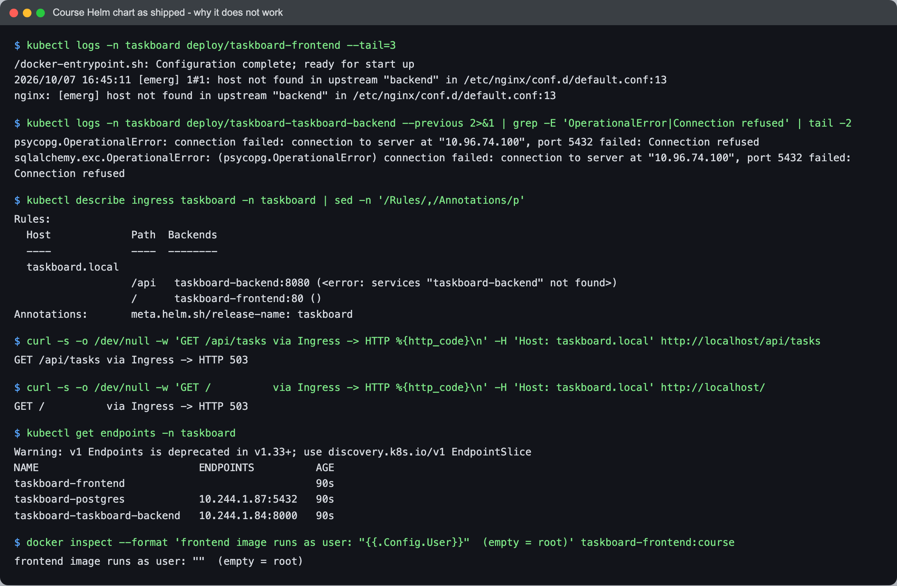

```text
$ kubectl logs -n taskboard deploy/taskboard-frontend --tail=3
nginx: [emerg] host not found in upstream "backend" in /etc/nginx/conf.d/default.conf:13

$ kubectl describe ingress taskboard -n taskboard | sed -n '/Rules/,/Annotations/p'
  taskboard.local
                   /api   taskboard-backend:8080 (<error: services "taskboard-backend" not found>)
                   /      taskboard-frontend:80 ()

$ curl ... -H 'Host: taskboard.local' http://localhost/api/tasks
GET /api/tasks via Ingress -> HTTP 503
```

| Course bug | Root cause | My fix |
|---|---|---|
| Frontend CrashLoopBackOff | `nginx.conf` hard-codes `proxy_pass http://backend:8000`; nginx resolves upstreams at start and there is no Service called `backend` in Kubernetes | nginx config is a template, `BACKEND_URL` comes from the ConfigMap |
| Ingress `/api` → 503 | Ingress points at `taskboard-backend:8080`; the Service is named `<release>-taskboard-backend` and listens on 8000 | fixed Service names, Ingress refers to the port by name (`http`) |
| Backend restarts twice on install | `alembic upgrade head` runs before Postgres is ready, the container exits | migration is an init container; it retries until Postgres answers |
| ServiceMonitor breaks install | CRD not present on a plain cluster | removed from the chart; pods carry `prometheus.io/*` annotations instead |
| Frontend image runs as root | `nginx:1.27-alpine` default (`docker inspect` user `""`) | unprivileged nginx, uid 101, port 8080 |
| Postgres Deployment uses RollingUpdate | on upgrade, two Postgres pods could mount one data directory | `strategy: Recreate`, `PGDATA` in a subdirectory |
| Password in a plain env var | `DATABASE_URL` with the password inlined in the Deployment | Secret `taskboard-db`, `envFrom` |

**The Terraform is not valid HCL.** Section 8.

**SCA.** `pip-audit` on the course `requirements.txt`: `Found 16 known vulnerabilities in 2
packages` — 14 entries for `starlette 0.41.3` (fixes up to 1.3.1) and 2 for `pytest 8.3.4`.
I moved to FastAPI 0.142.2 with **starlette pinned to 1.7.0**, and moved pytest/httpx into
`requirements-dev.txt` so they are not in the image. After that: `No known vulnerabilities
found`. The frontend's `package.json` used `"latest"` for every dependency and had no lock
file, so two builds a day apart could ship different code; I pinned the versions that
resolved (`react 19.3.0`, `vite 8.3.3`, `@vitejs/plugin-react 6.1.2`) and committed
`package-lock.json` so CI and the Dockerfile can use `npm ci`.

## 5. Application setup

```bash
cd application/backend
python3.12 -m venv .venv && . .venv/bin/activate
pip install -r requirements-dev.txt
python -m pytest -v          # 19 passed (locally and in CI job 1)
```

Tests run against a throwaway SQLite file created in `tests/conftest.py` before the app is
imported, never against PostgreSQL. Every test starts from empty tables. They cover all CRUD
endpoints, 404s, validation (422), stats, `/ready` returning 503 when the DB session raises,
`/metrics`, the DB URL escaping and the access-log filter.

## 6. Docker setup

- [`docker/backend.Dockerfile`](docker/backend.Dockerfile): `python:3.12-slim`, runtime deps
  only, then `pip uninstall -y pip` (session 17's lesson: Trivy finds HIGH CVEs in pip's
  vendored libraries), uid 10001, `GIT_SHA` build arg baked into an env var and an OCI label.
- [`docker/frontend.Dockerfile`](docker/frontend.Dockerfile): multi-stage, `npm ci` + `vite
  build` in `node:22-alpine`, served by `nginx-unprivileged` as uid 101 with `apk upgrade`.
- [`docker/docker-compose.yml`](docker/docker-compose.yml): postgres (healthcheck) →
  `migrate` (runs once, `service_completed_successfully`) → backend → frontend on
  `localhost:3000`.

The build context is `application/<component>`, the Dockerfile lives in `docker/`:

```bash
docker build -f docker/backend.Dockerfile --build-arg GIT_SHA=$(git rev-parse --short=7 HEAD) -t taskboard-backend:dev application/backend
docker build -f docker/frontend.Dockerfile -t taskboard-frontend:dev application/frontend
```

I built both locally (tag `35788bf`) for the kind cluster. I did **not** run `docker compose up`
in this session (time), so the Compose file is untested here.

## 7. Kubernetes deployment with Helm

Images built locally, loaded into the kind nodes with `kload`, installed with
[`values-dev.yaml`](helm/taskboard/values-dev.yaml) (`imagePullPolicy: Never`). The chart
refuses an empty image tag (`required "backend.tag is required (use the git SHA)"`), so there
is no `latest` anywhere.

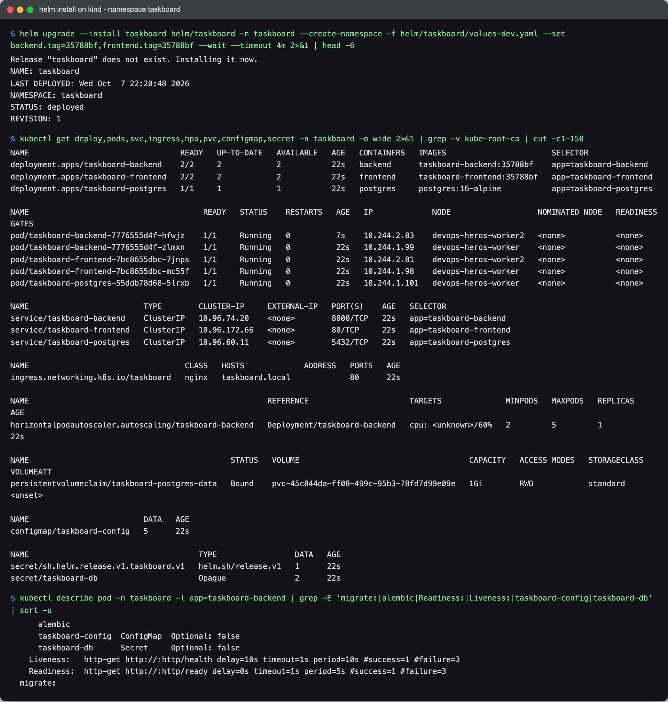

```text
$ helm upgrade --install taskboard helm/taskboard -n taskboard --create-namespace -f helm/taskboard/values-dev.yaml --set backend.tag=35788bf,frontend.tag=35788bf --wait --timeout 4m
Release "taskboard" does not exist. Installing it now.
STATUS: deployed
REVISION: 1

deployment.apps/taskboard-backend    2/2     2            2           22s   backend      taskboard-backend:35788bf
deployment.apps/taskboard-frontend   2/2     2            2           22s   frontend     taskboard-frontend:35788bf
deployment.apps/taskboard-postgres   1/1     1            1           22s   postgres     postgres:16-alpine
service/taskboard-backend    ClusterIP   10.96.74.20    <none>        8000/TCP   22s   app=taskboard-backend
service/taskboard-frontend   ClusterIP   10.96.172.66   <none>        80/TCP     22s   app=taskboard-frontend
service/taskboard-postgres   ClusterIP   10.96.60.11    <none>        5432/TCP   22s   app=taskboard-postgres
ingress.networking.k8s.io/taskboard   nginx   taskboard.local             80      22s
horizontalpodautoscaler.autoscaling/taskboard-backend   Deployment/taskboard-backend   cpu: <unknown>/60%   2   5   1   22s
persistentvolumeclaim/taskboard-postgres-data   Bound    pvc-45c844da-...   1Gi        RWO            standard
configmap/taskboard-config   5      22s
secret/taskboard-db                      Opaque               2      22s
```

Every object the task lists is there: **Deployment** (3), **Service** (3), **ConfigMap**,
**Secret**, **Ingress**, **HPA**, **PVC** for Postgres, and probes:

```text
      taskboard-config  ConfigMap  Optional: false
      taskboard-db      Secret     Optional: false
    Liveness:   http-get http://:http/health delay=10s timeout=1s period=10s #success=1 #failure=3
    Readiness:  http-get http://:http/ready delay=0s timeout=1s period=5s #success=1 #failure=3
```

Liveness (`/health`) does not touch the database on purpose: if Postgres goes down, the backend
should be taken out of the Service (readiness), not restarted in a loop (liveness).
`checksum/config` and `checksum/secret` annotations roll the pods when either changes; issue 3
in section 13 shows why that matters.

The HPA shows `REPLICAS 1` and `<unknown>` at 22 s. That is the HPA before metrics-server has
data; five minutes later it read `cpu: 2%/60%` with 2 replicas (section 11).

### Using the app through the Ingress

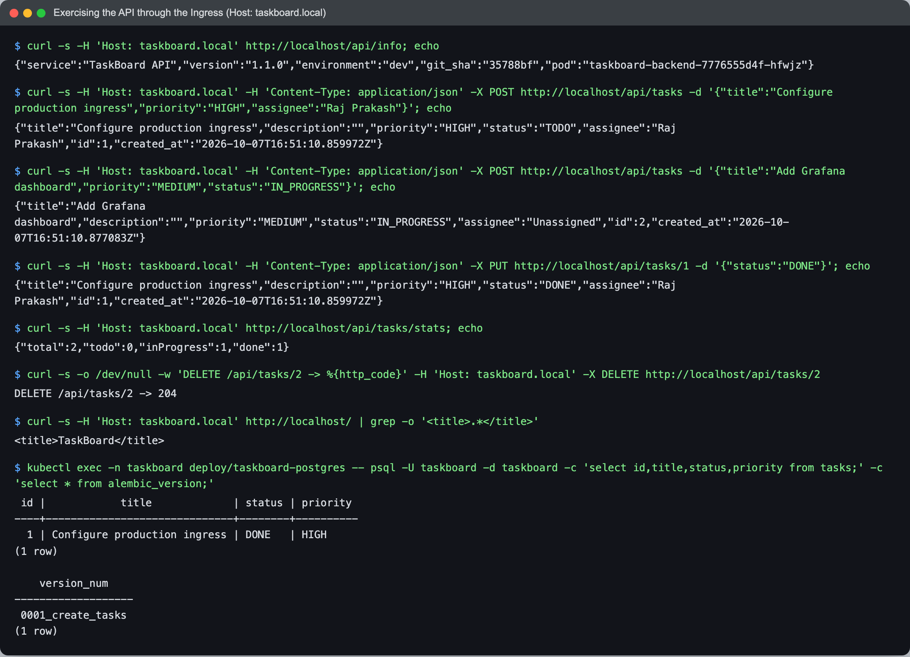

```text
$ curl -s -H 'Host: taskboard.local' http://localhost/api/info
{"service":"TaskBoard API","version":"1.1.0","environment":"dev","git_sha":"35788bf","pod":"taskboard-backend-7776555d4f-hfwjz"}

$ curl ... -X POST http://localhost/api/tasks -d '{"title":"Configure production ingress","priority":"HIGH","assignee":"Raj Prakash"}'
{"title":"Configure production ingress","description":"","priority":"HIGH","status":"TODO","assignee":"Raj Prakash","id":1,"created_at":"2026-10-07T16:51:10.859972Z"}

$ curl ... -X PUT http://localhost/api/tasks/1 -d '{"status":"DONE"}'
{"title":"Configure production ingress",...,"status":"DONE",...}

$ curl -s -H 'Host: taskboard.local' http://localhost/api/tasks/stats
{"total":2,"todo":0,"inProgress":1,"done":1}

DELETE /api/tasks/2 -> 204

$ kubectl exec -n taskboard deploy/taskboard-postgres -- psql -U taskboard -d taskboard -c 'select id,title,status,priority from tasks;' -c 'select * from alembic_version;'
 id |            title             | status | priority
----+------------------------------+--------+----------
  1 | Configure production ingress | DONE   | HIGH

    version_num
-------------------
 0001_create_tasks
```

All four verbs work through the Ingress, the row is in PostgreSQL, and `alembic_version`
proves the schema came from the migration (the init container), not from the app.

### Helm upgrade, history and rollback

These happened during the troubleshooting exercise (section 13), so they are shown there:
`helm upgrade` with a bad tag (revision 2), `helm history`, `helm rollback taskboard 1`, and
later `helm upgrade --reuse-values` putting drifted objects back. By the end the release was at
revision 9.

## 8. Terraform infrastructure

[`terraform/`](terraform/) provisions what the app would run on in AWS: a VPC with two public
and two private subnets and a NAT gateway (module `vpc` 5.8.1), and an EKS 1.31 cluster with a
managed node group of 2–4 `t3.medium` (module `eks` 20.37.1), in `ap-south-1`.

The course's version is not valid HCL. Every file is written as one-line blocks with several
arguments:

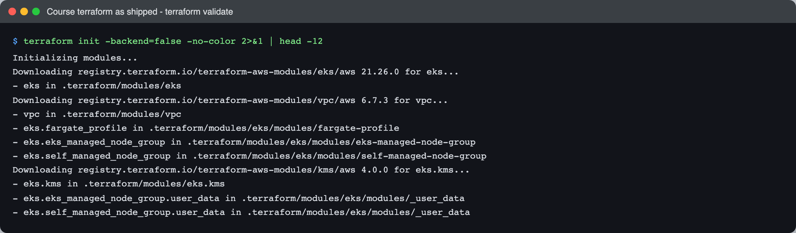

```text
$ terraform validate -no-color
Error: Invalid single-argument block definition

  on main.tf line 1, in module "vpc":
   1: module "vpc" { source = "terraform-aws-modules/vpc/aws" version = "5.8.1" name = "taskboard-vpc" ...

A single-line block definition must end with a closing brace immediately
after its single argument definition.
```

The screenshot shows something worse that I did not expect: `terraform init` on that broken
file **did not fail**. It downloaded `eks/aws 21.26.0` and `vpc/aws 6.7.3`, the latest
versions, not the `20.37.1` and `5.8.1` the file pins. The parse error dropped the `version`
argument, so init silently ignored the pin; only `validate` reports the problem.

I rewrote the four files as normal multi-line HCL with the same values, and changed the
provider constraint from `~> 5.0` to `~> 5.95` because eks 20.37.1 needs at least 5.95:

```text
$ terraform init -backend=false
Downloading registry.terraform.io/terraform-aws-modules/vpc/aws 5.8.1 for vpc...
Downloading registry.terraform.io/terraform-aws-modules/eks/aws 20.37.1 for eks...
- Installed hashicorp/aws v5.100.0 (signed by HashiCorp)
$ terraform validate
Success! The configuration is valid.
```

`terraform.tfvars.example` is committed; a real `terraform.tfvars`, `.terraform/` and state
are git-ignored.

### plan, apply, state and destroy against moto

I have no AWS account, so I ran the full lifecycle against **moto** (5.2.3.dev,
`motoserver/moto:latest` in Docker), the same way as in
[session 19](../../session19-cloud-terraform/task/README.md). **Nothing below touched real
AWS.** [`terraform/emulator_override.tf`](terraform/emulator_override.tf) is the only
emulator-specific file: Terraform merges `*_override.tf` into the provider block, adding
dummy credentials, the `skip_*` flags and endpoints for `ec2`, `sts`, `iam`, `eks`, `kms`,
`logs`, `ssm` and `autoscaling` at `http://localhost:5050` (5050 because macOS AirPlay owns
port 5000). Deleting that file points the same code at real AWS.

moto has to be started with `-e MOTO_IAM_LOAD_MANAGED_POLICIES=true`. In my dry run without
it, every policy attachment in the EKS module failed with `NoSuchEntity: Policy
arn:aws:iam::aws:policy/AmazonEKSClusterPolicy does not exist or is not attachable`, because
moto does not know the AWS managed policies unless it is told to load them. I reset moto
before the recorded run so it started empty. The plan file went to a scratch directory
outside the repo (`s21.tfplan` below).

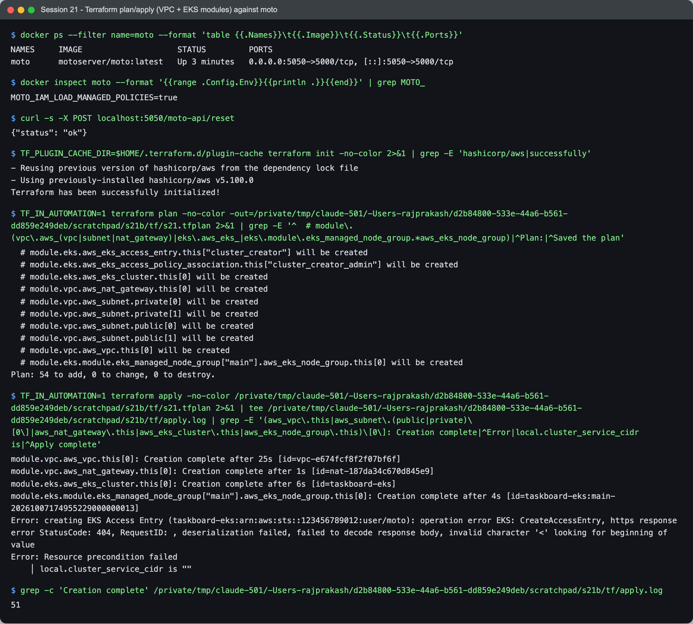

```text
$ docker inspect moto --format '{{range .Config.Env}}{{println .}}{{end}}' | grep MOTO_
MOTO_IAM_LOAD_MANAGED_POLICIES=true

$ curl -s -X POST localhost:5050/moto-api/reset
{"status": "ok"}
$ TF_PLUGIN_CACHE_DIR=$HOME/.terraform.d/plugin-cache terraform init -no-color 2>&1 | grep -E 'hashicorp/aws|successfully'
- Reusing previous version of hashicorp/aws from the dependency lock file
- Using previously-installed hashicorp/aws v5.100.0
Terraform has been successfully initialized!

$ TF_IN_AUTOMATION=1 terraform plan -no-color -out=.../s21.tfplan 2>&1 | grep -E '^  # module\.(vpc\.aws_(vpc|subnet|nat_gateway)|eks\.aws_eks_|eks\.module\.eks_manag...
  # module.eks.aws_eks_access_entry.this["cluster_creator"] will be created
  # module.eks.aws_eks_access_policy_association.this["cluster_creator_admin"] will be created
  # module.eks.aws_eks_cluster.this[0] will be created
  # module.vpc.aws_nat_gateway.this[0] will be created
  # module.vpc.aws_subnet.private[0] will be created
  # module.vpc.aws_subnet.private[1] will be created
  # module.vpc.aws_subnet.public[0] will be created
  # module.vpc.aws_subnet.public[1] will be created
  # module.vpc.aws_vpc.this[0] will be created
  # module.eks.module.eks_managed_node_group["main"].aws_eks_node_group.this[0] will be created
Plan: 54 to add, 0 to change, 0 to destroy.

$ TF_IN_AUTOMATION=1 terraform apply -no-color .../s21.tfplan 2>&1 | tee .../apply.log | grep ...
module.vpc.aws_vpc.this[0]: Creation complete after 25s [id=vpc-e674fcf8f2f07bf6f]
module.vpc.aws_nat_gateway.this[0]: Creation complete after 1s [id=nat-187da34c670d845e9]
module.eks.aws_eks_cluster.this[0]: Creation complete after 6s [id=taskboard-eks]
module.eks.module.eks_managed_node_group["main"].aws_eks_node_group.this[0]: Creation complete after 4s [id=taskboard-eks:main-20261007174955229000000013]
Error: creating EKS Access Entry (taskboard-eks:arn:aws:sts::123456789012:user/moto): operation error EKS: CreateAccessEntry, https response error StatusCode: 404, RequestID: , deserialization failed, failed to decode response body, invalid character '<' looking for beginning of value
Error: Resource precondition failed
    │ local.cluster_service_cidr is ""

$ grep -c 'Creation complete' .../apply.log
51
```

The whole configuration was planned (54 resources) and applied without `-target`. **51 of
54 were created**, including the VPC, the 4 subnets, the NAT gateway, the IAM roles, the KMS
key, the EKS cluster and its managed node group. **The apply did not finish cleanly** (no
`Apply complete!` line). Three resources were not created, all because of gaps in the
emulator, not in the code:

| Not created | Why |
|---|---|
| `module.eks.aws_eks_access_entry.this["cluster_creator"]` | moto does not implement the EKS access-entry API; `CreateAccessEntry` got a 404 HTML page back (the `invalid character '<'`) |
| `module.eks.aws_eks_access_policy_association.this["cluster_creator_admin"]` | depends on the access entry, never attempted |
| `...eks_managed_node_group["main"].module.user_data.null_resource.validate_cluster_service_cidr` | the module's precondition failed: moto's `DescribeCluster` returns no service IPv4 CIDR, so `cluster_service_cidr` is `""` |

On real AWS the first two are ordinary API calls and the CIDR is always returned, so I expect
all 54 to apply there, but I have not run it.

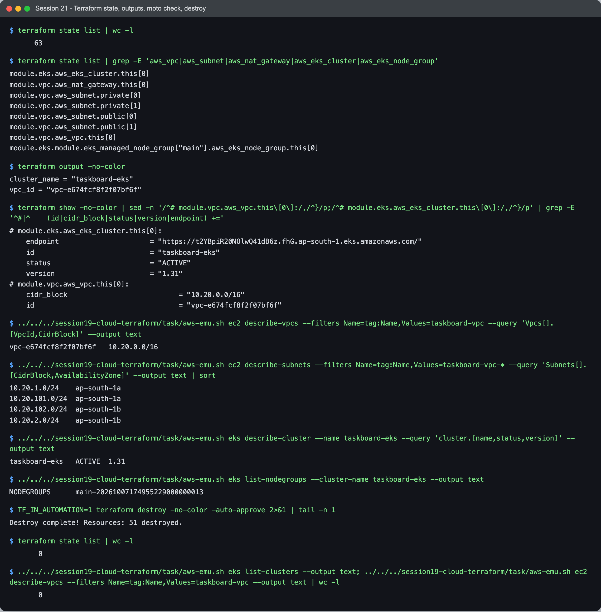

```text
$ terraform state list | wc -l
      63

$ terraform state list | grep -E 'aws_vpc|aws_subnet|aws_nat_gateway|aws_eks_cluster|aws_eks_node_group'
module.eks.aws_eks_cluster.this[0]
module.vpc.aws_nat_gateway.this[0]
module.vpc.aws_subnet.private[0]
module.vpc.aws_subnet.private[1]
module.vpc.aws_subnet.public[0]
module.vpc.aws_subnet.public[1]
module.vpc.aws_vpc.this[0]
module.eks.module.eks_managed_node_group["main"].aws_eks_node_group.this[0]

$ terraform output -no-color
cluster_name = "taskboard-eks"
vpc_id = "vpc-e674fcf8f2f07bf6f"

$ terraform show -no-color | sed -n '...' | grep -E '^#|^    (id|cidr_block|status|version|endpoint) +='
# module.eks.aws_eks_cluster.this[0]:
    endpoint                      = "https://t2YBpiR20NOlwQ41dB6z.fhG.ap-south-1.eks.amazonaws.com/"
    id                            = "taskboard-eks"
    status                        = "ACTIVE"
    version                       = "1.31"
# module.vpc.aws_vpc.this[0]:
    cidr_block                           = "10.20.0.0/16"
    id                                   = "vpc-e674fcf8f2f07bf6f"

$ ../../../session19-cloud-terraform/task/aws-emu.sh ec2 describe-vpcs --filters Name=tag:Name,Values=taskboard-vpc --query 'Vpcs[].[VpcId,CidrBlock]' --output text
vpc-e674fcf8f2f07bf6f	10.20.0.0/16

$ ../../../session19-cloud-terraform/task/aws-emu.sh ec2 describe-subnets --filters Name=tag:Name,Values=taskboard-vpc-* --query 'Subnets[].[CidrBlock,AvailabilityZone]' --output text | sort
10.20.1.0/24	ap-south-1a
10.20.101.0/24	ap-south-1a
10.20.102.0/24	ap-south-1b
10.20.2.0/24	ap-south-1b

$ ../../../session19-cloud-terraform/task/aws-emu.sh eks describe-cluster --name taskboard-eks --query 'cluster.[name,status,version]' --output text
taskboard-eks	ACTIVE	1.31

$ ../../../session19-cloud-terraform/task/aws-emu.sh eks list-nodegroups --cluster-name taskboard-eks --output text
NODEGROUPS	main-20261007174955229000000013

$ TF_IN_AUTOMATION=1 terraform destroy -no-color -auto-approve 2>&1 | tail -n 1
Destroy complete! Resources: 51 destroyed.

$ terraform state list | wc -l
       0
```

- **State:** 63 entries = the 51 created resources plus data sources.
- **Outputs:** `cluster_endpoint` is missing, although the cluster in state has an endpoint
  (`terraform show`). My unconfirmed reading is that in EKS module v20 that output waits on
  the access entries, which failed.
- **Independent check:** the AWS CLI (session 19's `aws-emu.sh`, the `amazon/aws-cli` image
  pointed at moto) sees the same VPC ID, the four subnets in two AZs, the cluster `ACTIVE`
  on 1.31 and the node group. That is moto's view, not Terraform's.
- **Destroy** removed all 51; afterwards the state is empty and moto lists no cluster and no
  `taskboard-vpc`. The moto container, `.terraform/` and the state files were then deleted.

## 9. CI/CD pipeline

GitHub only runs workflows from the repository root, so the pipeline that runs is
[`/.github/workflows/final-project.yml`](../../.github/workflows/final-project.yml).
[`.github/workflows/final-project.yml`](.github/workflows/final-project.yml) in this folder is a
copy for the deliverable layout, and job 1 runs `cmp` on the two so the copy cannot drift.
It triggers on pushes to `main` that touch this folder (not screenshots or `.md`) or the
workflow, on pull requests, and manually.

| Job | What it does |
|---|---|
| 1 Build & test | `cmp` the workflow copy; `pytest` with coverage; `npm ci && npm run build`; `helm lint` + `helm template` |
| 2 SAST | Bandit full report, then gate on medium+ severity / medium+ confidence |
| 3 SCA | `pip-audit --strict` on runtime requirements; `npm audit --audit-level=high` |
| 4 Secret scan | gitleaks (pinned, sha256 checked), planted-token self-test, working tree + git history of this folder |
| 5 Docker build | matrix backend/frontend, build **once**, `docker save` → tarball + sha256 → artifact |
| 6 Trivy | matrix, verify sha256, full HIGH/CRITICAL report, gate on **fixable** HIGH/CRITICAL |
| 7 Security gate | `if: always()`, reads every `needs.*.result`, writes the table to the step summary |
| 8 Push | `main` pushes only; loads the scanned tarball (sha256 again) and pushes to GHCR, tag = short SHA |
| 9 Deploy | kind cluster **on the runner**, ingress-nginx, `imagePullSecret` from `GITHUB_TOKEN`, `helm upgrade --install --wait` pulling from GHCR, smoke test through the Ingress |

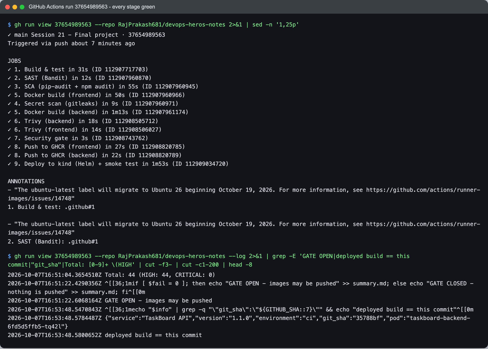

```text
✓ main Session 21 - Final project · 37654989563
Triggered via push about 7 minutes ago

JOBS
✓ 1. Build & test in 31s (ID 112907717703)
✓ 2. SAST (Bandit) in 12s (ID 112907960870)
✓ 3. SCA (pip-audit + npm audit) in 55s (ID 112907960945)
✓ 5. Docker build (frontend) in 50s (ID 112907960966)
✓ 4. Secret scan (gitleaks) in 9s (ID 112907960971)
✓ 5. Docker build (backend) in 1m13s (ID 112907961174)
✓ 6. Trivy (backend) in 18s (ID 112908505712)
✓ 6. Trivy (frontend) in 14s (ID 112908506027)
✓ 7. Security gate in 3s (ID 112908743762)
✓ 8. Push to GHCR (frontend) in 27s (ID 112908820785)
✓ 8. Push to GHCR (backend) in 22s (ID 112908820789)
✓ 9. Deploy to kind (Helm) + smoke test in 1m53s (ID 112909034720)
```

The smoke test in job 9 asked the deployed backend which build it is:

```text
{"service":"TaskBoard API","version":"1.1.0","environment":"ci","git_sha":"35788bf","pod":"taskboard-backend-6fd5d5ffb5-tq42l"}
deployed build == this commit
```

That line closes the loop: the image that was tested, scanned and pushed is the one that
answered through the Ingress, and `environment":"ci"` shows the ConfigMap value from
`--set config.appEnv=ci` reached the pod. The images are at
`ghcr.io/rajprakash681/devops-heros-notes/taskboard-backend:35788bf` and `...-frontend:35788bf`.

It went green on the first run, which also means I have no failed run of this pipeline to show
a gate closing. Session 17 has that evidence for the same gate design; here the course
project's failures were caught locally first (section 4).

## 10. DevSecOps implementation

| Control | Tool | Gate | Result in run 37654989563 |
|---|---|---|---|
| SAST | Bandit 1.9.4 | medium+ severity and confidence | pass |
| SCA (Python) | pip-audit 2.10.1 `--strict` | any known vuln | pass (was 16 findings on the course pins) |
| SCA (JS) | npm audit | high+ | pass |
| Secret scanning | gitleaks 8.30.1, pinned + checksum | any finding; must catch a planted token first | pass |
| Image scanning | Trivy 0.75.0, pinned + checksum | fixable HIGH/CRITICAL | pass |
| Single decision | security-gate job, `if: always()` | all of the above | `GATE OPEN - images may be pushed` |
| Runtime | `runAsNonRoot`, uid 10001/101, `readOnlyRootFilesystem` (backend), drop ALL caps, seccomp RuntimeDefault | — | pods run under these |

Scanners are downloaded as release binaries and checked against the release's checksum file,
not run through third-party actions, so a re-pointed action tag cannot change what runs.

**What Trivy found.** The informational step reported `Total: 44 (HIGH: 44, CRITICAL: 0)` for
the **backend** image (the frontend reported no total line), and the gate still passed. The gate uses `--ignore-unfixed`: the 44 are HIGH
findings in base-image OS packages that have **no fixed version** yet, so there is nothing to
upgrade to; the gate fails only on a HIGH/CRITICAL that a version bump would fix, and there
were none. `.trivyignore` is empty: nothing is waived. I did not have time to break the 44
down by package in this write-up; the full table is in the run's job 6 log.

## 11. Monitoring

Two rounds. The first (screenshot 09) used only what the cluster already had: `/metrics`,
`kubectl top`, the HPA and `kubectl logs`. In the second I installed **Prometheus v3.5.0 and
Grafana 12.1.1** in namespace `taskboard-monitoring` and ran a real load test.

### First round: metrics-server, `/metrics` and logs

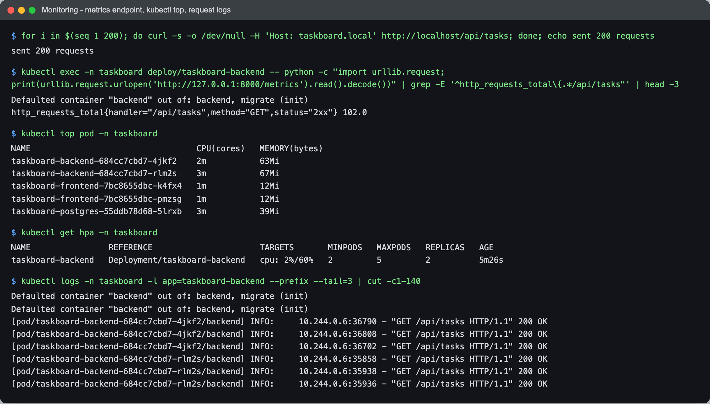

```text
$ for i in $(seq 1 200); do curl -s -o /dev/null -H 'Host: taskboard.local' http://localhost/api/tasks; done; echo sent 200 requests
sent 200 requests

$ kubectl exec -n taskboard deploy/taskboard-backend -- python -c "...urlopen('http://127.0.0.1:8000/metrics')..." | grep -E '^http_requests_total\{.*/api/tasks"'
http_requests_total{handler="/api/tasks",method="GET",status="2xx"} 102.0

$ kubectl top pod -n taskboard
NAME                                  CPU(cores)   MEMORY(bytes)
taskboard-backend-684cc7cbd7-4jkf2    2m           63Mi
taskboard-backend-684cc7cbd7-rlm2s    3m           67Mi
taskboard-frontend-7bc8655dbc-k4fx4   1m           12Mi
taskboard-frontend-7bc8655dbc-pmzsg   1m           12Mi
taskboard-postgres-55ddb78d68-5lrxb   3m           39Mi

$ kubectl get hpa -n taskboard
taskboard-backend   Deployment/taskboard-backend   cpu: 2%/60%   2         5         2          5m26s

$ kubectl logs -n taskboard -l app=taskboard-backend --prefix --tail=3
[pod/taskboard-backend-684cc7cbd7-4jkf2/backend] INFO:     10.244.0.6:36790 - "GET /api/tasks HTTP/1.1" 200 OK
[pod/taskboard-backend-684cc7cbd7-rlm2s/backend] INFO:     10.244.0.6:35858 - "GET /api/tasks HTTP/1.1" 200 OK
```

This pod counted **102** of the 200 requests; the other ~98 went to the second replica (the
Service load-balancing). 200 sequential requests were nowhere near the HPA's 60% CPU target.

### Second round: Prometheus + Grafana

I did not use kube-prometheus-stack: the Docker VM is 8 GB and is shared with two other
clusters. Plain manifests are enough and show every moving part:

| File | What it is |
|---|---|
| [`monitoring/namespace.yaml`](monitoring/namespace.yaml) | namespace `taskboard-monitoring` |
| [`monitoring/prometheus.yaml`](monitoring/prometheus.yaml) | ServiceAccount + ClusterRole (pods/nodes discovery), scrape config, Deployment, Service |
| [`monitoring/grafana.yaml`](monitoring/grafana.yaml) | Grafana with the datasource and dashboard provider provisioned from a ConfigMap; anonymous Viewer + embedding (lab only, as in session 20) |
| [`monitoring/dashboards/taskboard.json`](monitoring/dashboards/taskboard.json) | the dashboard, loaded with `kubectl create configmap grafana-dashboards --from-file=...` |

Prometheus has two scrape jobs. `taskboard-pods` uses Kubernetes pod discovery in namespace
`taskboard` and keeps only pods with `prometheus.io/scrape: "true"`; port and path come from
the annotations the chart puts on the backend pods, so a new replica is scraped as soon as it
exists. `kubelet-cadvisor` scrapes each node's kubelet (`/metrics/cadvisor`) for container CPU
and memory, filtered to namespace `taskboard`. Prometheus and Grafana were reached with
`kubectl port-forward` (9091 and 3031 on my Mac).

```bash
kubectl apply -f monitoring/namespace.yaml -f monitoring/prometheus.yaml
kubectl create configmap grafana-dashboards -n taskboard-monitoring --from-file=monitoring/dashboards/taskboard.json
kubectl apply -f monitoring/grafana.yaml
```

The load: 3 minutes of a loop through the Ingress, each round 5x `GET /api/tasks`,
`GET /api/tasks/stats`, a `POST /api/tasks` and a `GET /api/tasks/999999` (a deliberate 404,
so the error-rate query has something to count), all 8 in parallel.

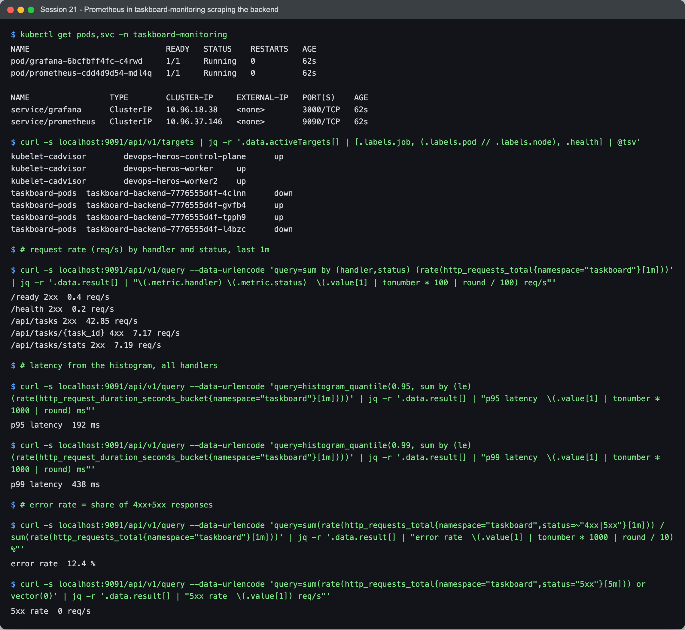

```text
$ curl -s localhost:9091/api/v1/targets | jq -r '.data.activeTargets[] | [.labels.job, (.labels.pod // .labels.node), .health] | @tsv'
kubelet-cadvisor	devops-heros-control-plane	up
kubelet-cadvisor	devops-heros-worker	up
kubelet-cadvisor	devops-heros-worker2	up
taskboard-pods	taskboard-backend-7776555d4f-4clnn	down
taskboard-pods	taskboard-backend-7776555d4f-gvfb4	up
taskboard-pods	taskboard-backend-7776555d4f-tpph9	up
taskboard-pods	taskboard-backend-7776555d4f-l4bzc	down

# request rate (req/s) by handler and status, last 1m
$ curl -s localhost:9091/api/v1/query --data-urlencode 'query=sum by (handler,status) (rate(http_requests_total{namespace="taskboard"}[1m]))' | jq ...
/ready 2xx  0.4 req/s
/health 2xx  0.2 req/s
/api/tasks 2xx  42.85 req/s
/api/tasks/{task_id} 4xx  7.17 req/s
/api/tasks/stats 2xx  7.19 req/s

# latency from the histogram, all handlers
$ ... 'query=histogram_quantile(0.95, sum by (le) (rate(http_request_duration_seconds_bucket{namespace="taskboard"}[1m])))' ...
p95 latency  192 ms
$ ... 'query=histogram_quantile(0.99, sum by (le) (rate(http_request_duration_seconds_bucket{namespace="taskboard"}[1m])))' ...
p99 latency  438 ms

# error rate = share of 4xx+5xx responses
$ ... 'query=sum(rate(http_requests_total{namespace="taskboard",status=~"4xx|5xx"}[1m])) / sum(rate(http_requests_total{namespace="taskboard"}[1m]))' ...
error rate  12.4 %
$ ... 'query=sum(rate(http_requests_total{namespace="taskboard",status="5xx"}[5m])) or vector(0)' ...
5xx rate  0 req/s
```

- **Request rate:** about 58 req/s in total, most of it `/api/tasks` (GET and POST share the
  handler label). `/health` and `/ready` are the kubelet's probes, which the access log
  filters out but `/metrics` still counts.
- **Error rate 12.4 %** is exactly the planted 404s: 1 request in 8 per round. The 5xx rate is
  0, so the server never failed; "error rate" without splitting 4xx from 5xx would have been
  misleading here.
- **Two targets `down`:** those are the two new backend pods the HPA had just created (next
  screenshot). They were still in their init container (migrations), so nothing listened on
  8000 yet. Discovery found them before they were ready, which is the expected order.

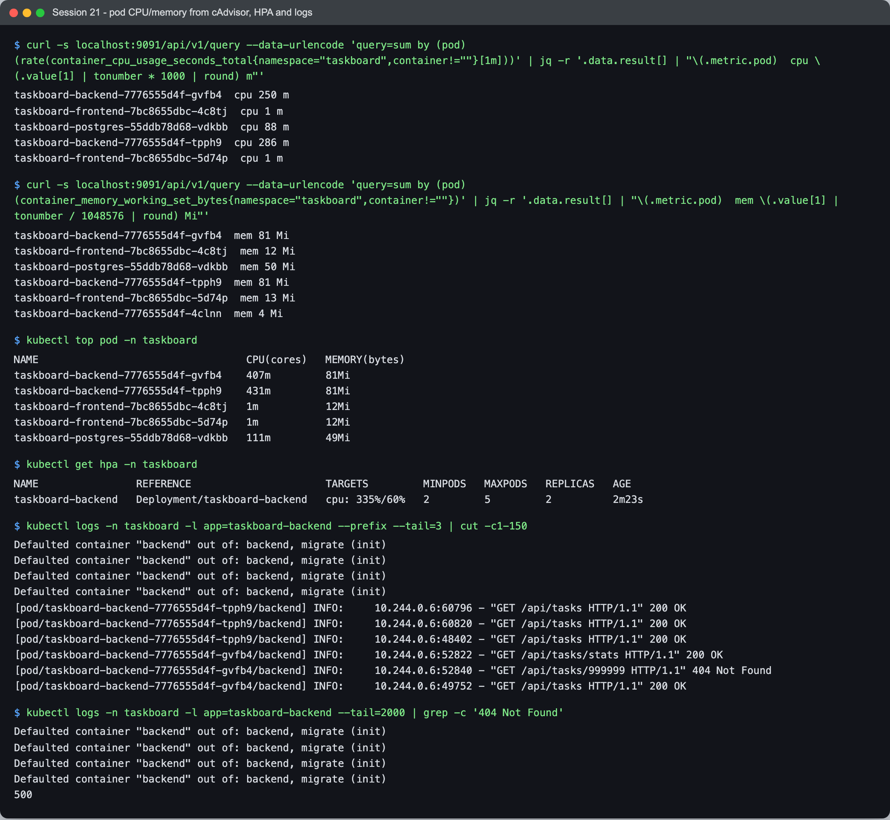

```text
$ ... 'query=sum by (pod) (rate(container_cpu_usage_seconds_total{namespace="taskboard",container!=""}[1m]))' ...
taskboard-backend-7776555d4f-gvfb4  cpu 250 m
taskboard-frontend-7bc8655dbc-4c8tj  cpu 1 m
taskboard-postgres-55ddb78d68-vdkbb  cpu 88 m
taskboard-backend-7776555d4f-tpph9  cpu 286 m
taskboard-frontend-7bc8655dbc-5d74p  cpu 1 m

$ ... 'query=sum by (pod) (container_memory_working_set_bytes{namespace="taskboard",container!=""})' ...
taskboard-backend-7776555d4f-gvfb4  mem 81 Mi
taskboard-frontend-7bc8655dbc-4c8tj  mem 12 Mi
taskboard-postgres-55ddb78d68-vdkbb  mem 50 Mi
taskboard-backend-7776555d4f-tpph9  mem 81 Mi
taskboard-frontend-7bc8655dbc-5d74p  mem 13 Mi
taskboard-backend-7776555d4f-4clnn  mem 4 Mi

$ kubectl top pod -n taskboard
NAME                                  CPU(cores)   MEMORY(bytes)
taskboard-backend-7776555d4f-gvfb4    407m         81Mi
taskboard-backend-7776555d4f-tpph9    431m         81Mi
taskboard-frontend-7bc8655dbc-4c8tj   1m           12Mi
taskboard-frontend-7bc8655dbc-5d74p   1m           12Mi
taskboard-postgres-55ddb78d68-vdkbb   111m         49Mi

$ kubectl get hpa -n taskboard
NAME                REFERENCE                      TARGETS         MINPODS   MAXPODS   REPLICAS   AGE
taskboard-backend   Deployment/taskboard-backend   cpu: 335%/60%   2         5         2          2m23s

$ kubectl logs -n taskboard -l app=taskboard-backend --prefix --tail=3 | cut -c1-150
[pod/taskboard-backend-7776555d4f-tpph9/backend] INFO:     10.244.0.6:60796 - "GET /api/tasks HTTP/1.1" 200 OK
[pod/taskboard-backend-7776555d4f-gvfb4/backend] INFO:     10.244.0.6:52822 - "GET /api/tasks/stats HTTP/1.1" 200 OK
[pod/taskboard-backend-7776555d4f-gvfb4/backend] INFO:     10.244.0.6:52840 - "GET /api/tasks/999999 HTTP/1.1" 404 Not Found

$ kubectl logs -n taskboard -l app=taskboard-backend --tail=2000 | grep -c '404 Not Found'
500
```

(The logs output also has four `Defaulted container "backend" out of: backend, migrate (init)`
lines, one per pod, which I left out above; they are in the screenshot.)

- **CPU/memory:** cAdvisor through Prometheus and metrics-server through `kubectl top` agree
  on the order of magnitude (they sample different windows: 250-286m vs 407-431m). Each
  backend pod used about 0.25-0.43 cores against a **request of 100m**, so the HPA's
  utilisation is several hundred percent.
- **Logs:** the access log shows the 404s from the load test next to the 200s, with the
  ingress-nginx controller (`10.244.0.6`) as the client.

### The HPA scaled under this load

The first round never got the HPA above 2 replicas. This one did:

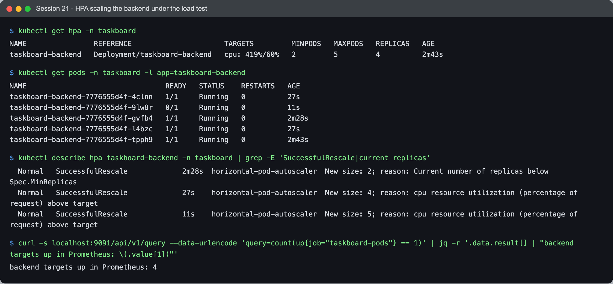

```text
$ kubectl get hpa -n taskboard
NAME                REFERENCE                      TARGETS         MINPODS   MAXPODS   REPLICAS   AGE
taskboard-backend   Deployment/taskboard-backend   cpu: 419%/60%   2         5         4          2m43s

$ kubectl get pods -n taskboard -l app=taskboard-backend
NAME                                 READY   STATUS    RESTARTS   AGE
taskboard-backend-7776555d4f-4clnn   1/1     Running   0          27s
taskboard-backend-7776555d4f-9lw8r   0/1     Running   0          11s
taskboard-backend-7776555d4f-gvfb4   1/1     Running   0          2m28s
taskboard-backend-7776555d4f-l4bzc   1/1     Running   0          27s
taskboard-backend-7776555d4f-tpph9   1/1     Running   0          2m43s

$ kubectl describe hpa taskboard-backend -n taskboard | grep -E 'SuccessfulRescale|current replicas'
  Normal   SuccessfulRescale             2m28s  horizontal-pod-autoscaler  New size: 2; reason: Current number of replicas below Spec.MinReplicas
  Normal   SuccessfulRescale             27s    horizontal-pod-autoscaler  New size: 4; reason: cpu resource utilization (percentage of request) above target
  Normal   SuccessfulRescale             11s    horizontal-pod-autoscaler  New size: 5; reason: cpu resource utilization (percentage of request) above target

backend targets up in Prometheus: 4
```

2 → 4 → 5 (the maximum) in 16 seconds. The fifth pod (`9lw8r`) was still starting, so
Prometheus had 4 backend targets up at that moment and 5 a little later (dashboard below).

### Grafana dashboard

Provisioned from [`monitoring/dashboards/taskboard.json`](monitoring/dashboards/taskboard.json),
no clicking: request rate, p95 latency, error rate and backend targets up as stat panels; rate
by handler/status, p50/p95/p99 latency, and pod CPU and memory as time series.

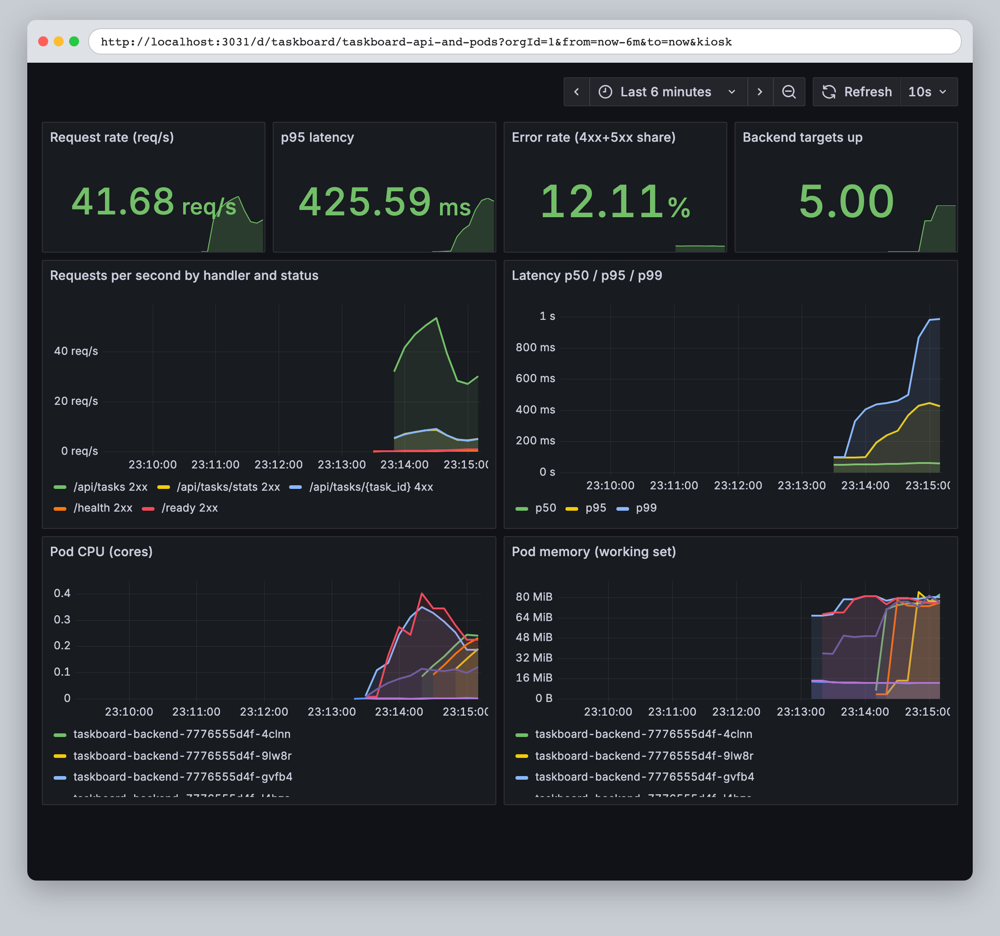

Taken at the end of the 3-minute run (`node tools/shoot-web.mjs`, which refuses to shoot
anything that is not HTTP 200). It shows **5 backend targets up**, the error rate flat at
about 12 %, and something I did not plan: **latency keeps rising during the run** (p95 about
426 ms at the end, p99 near 1 s) while the request rate falls. The load test POSTs a task in
every round and `GET /api/tasks` returns every row with no pagination, so each list request
got more expensive as the table grew. That is an application finding, not a cluster one:
the list endpoint needs pagination before real traffic.

## 12. GitOps

[`gitops/argocd-application.yaml`](gitops/argocd-application.yaml) is an Argo CD `Application`
that renders this repo's Helm chart from `main` with
[`gitops/values-gitops.yaml`](gitops/values-gitops.yaml) (GHCR images pinned to `35788bf`,
`config.appEnv: gitops`), with `automated: {prune: true, selfHeal: true}`.

I installed **Argo CD v3.5.4** (same pin as session 20) and scaled the parts I do not use to
zero to save memory:

```bash
kubectl create namespace argocd
kubectl apply --server-side -n argocd -f https://raw.githubusercontent.com/argoproj/argo-cd/v3.5.4/manifests/install.yaml
kubectl -n argocd scale deploy argocd-dex-server argocd-notifications-controller argocd-applicationset-controller --replicas=0
```

There is no `argocd` CLI on my Mac, so everything below is `kubectl` on the `Application`
object, whose `status` is what the CLI and the UI display.

### Initial sync

The Helm release from section 11 was removed first, so that Argo CD, not Helm, owns the
objects in `taskboard`.

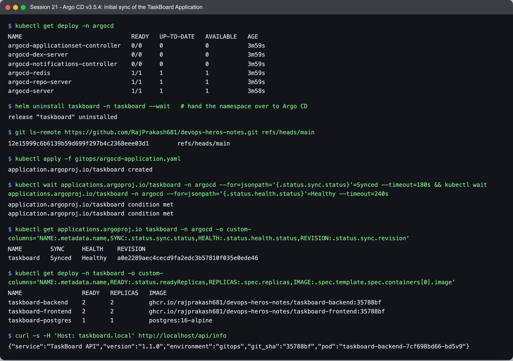

```text
$ helm uninstall taskboard -n taskboard --wait   # hand the namespace over to Argo CD
release "taskboard" uninstalled

$ git ls-remote https://github.com/RajPrakash681/devops-heros-notes.git refs/heads/main
12e15999c6b6139b59d699f297b4c2368eee03d1	refs/heads/main

$ kubectl apply -f gitops/argocd-application.yaml
application.argoproj.io/taskboard created

$ kubectl wait applications.argoproj.io/taskboard -n argocd --for=jsonpath='{.status.sync.status}'=Synced --timeout=180s && kubectl wait ... --for=jsonpath='{.status.health.status}'=Healthy --timeout=240s
application.argoproj.io/taskboard condition met
application.argoproj.io/taskboard condition met

$ kubectl get applications.argoproj.io taskboard -n argocd -o custom-columns='NAME:.metadata.name,SYNC:.status.sync.status,HEALTH:.status.health.status,REVISION:.status.sync.revision'
NAME        SYNC     HEALTH    REVISION
taskboard   Synced   Healthy   a0e2289aec4cecd9fa2edc3b57810f035e0ede46

$ kubectl get deploy -n taskboard -o custom-columns='NAME:.metadata.name,READY:.status.readyReplicas,REPLICAS:.spec.replicas,IMAGE:.spec.template.spec.containers[0].image'
NAME                 READY   REPLICAS   IMAGE
taskboard-backend    2       2          ghcr.io/rajprakash681/devops-heros-notes/taskboard-backend:35788bf
taskboard-frontend   2       2          ghcr.io/rajprakash681/devops-heros-notes/taskboard-frontend:35788bf
taskboard-postgres   1       1          postgres:16-alpine

$ curl -s -H 'Host: taskboard.local' http://localhost/api/info
{"service":"TaskBoard API","version":"1.1.0","environment":"gitops","git_sha":"35788bf","pod":"taskboard-backend-7cf698bd66-bd5v9"}
```

- The images came from **GHCR** this time (the packages are public), not from the copies
  loaded into kind, and `"environment":"gitops"` is the value from `values-gitops.yaml`.
- The revision is not a mistake to hide: Argo CD **synced `12e1599`**, the `main` SHA that
  `ls-remote` printed (the app history below has it as entry 0). Between that sync and my
  `get`, another commit (`a0e2289`, a session 2 write-up) landed on `main`. Argo CD
  re-compared the app at the new HEAD, found the rendered manifests identical, and stayed
  `Synced`; `status.sync.revision` is the revision it last *compared* against.
- The two concerns from my first draft of this section did not materialise: Argo CD accepted
  the `../../gitops/values-gitops.yaml` value file outside the chart directory (it is still
  inside the repo), and the chart's Secret was rendered from Git as expected. That second
  point is still a real problem outside a lab: the dev password is in Git. A real setup would
  use `postgres.existingSecret` with Sealed Secrets or External Secrets.

### A commit changes the cluster

The change: frontend replicas 2 → 3 in `values-gitops.yaml`, committed and pushed to `main`.

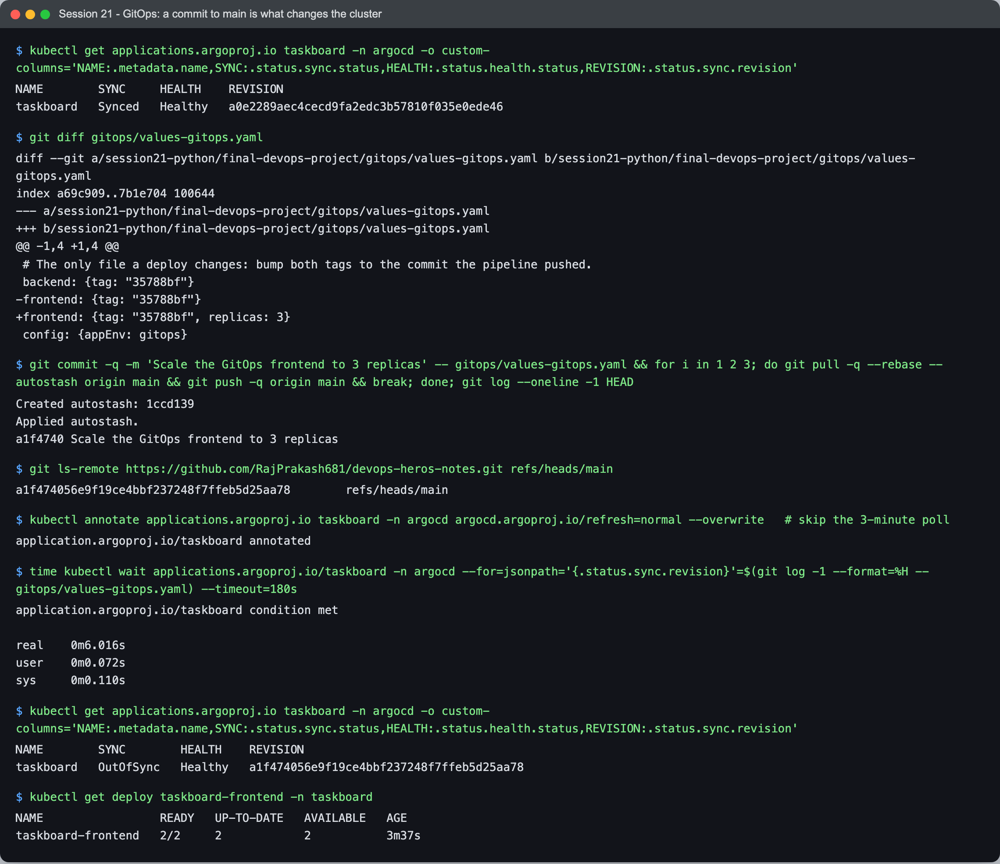

```text
$ git diff gitops/values-gitops.yaml
-frontend: {tag: "35788bf"}
+frontend: {tag: "35788bf", replicas: 3}

$ git commit -q -m 'Scale the GitOps frontend to 3 replicas' -- gitops/values-gitops.yaml && for i in 1 2 3; do git pull -q --rebase --autostash origin main && git push -q origin main && break; done; git log --oneline -1 HEAD
Created autostash: 1ccd139
Applied autostash.
a1f4740 Scale the GitOps frontend to 3 replicas

$ git ls-remote https://github.com/RajPrakash681/devops-heros-notes.git refs/heads/main
a1f474056e9f19ce4bbf237248f7ffeb5d25aa78	refs/heads/main

$ kubectl annotate applications.argoproj.io taskboard -n argocd argocd.argoproj.io/refresh=normal --overwrite   # skip the 3-minute poll
application.argoproj.io/taskboard annotated

$ time kubectl wait applications.argoproj.io/taskboard -n argocd --for=jsonpath='{.status.sync.revision}'=$(git log -1 --format=%H -- gitops/values-gitops.yaml) --timeout=180s
application.argoproj.io/taskboard condition met
real	0m6.016s

$ kubectl get applications.argoproj.io taskboard -n argocd -o custom-columns=...
NAME        SYNC        HEALTH    REVISION
taskboard   OutOfSync   Healthy   a1f474056e9f19ce4bbf237248f7ffeb5d25aa78
```

Six seconds after the refresh Argo CD had compared the app against `a1f4740` and found it
`OutOfSync` (Git says 3 replicas, the cluster has 2). The refresh annotation only skips the
default 3-minute polling interval; the sync itself was automatic.

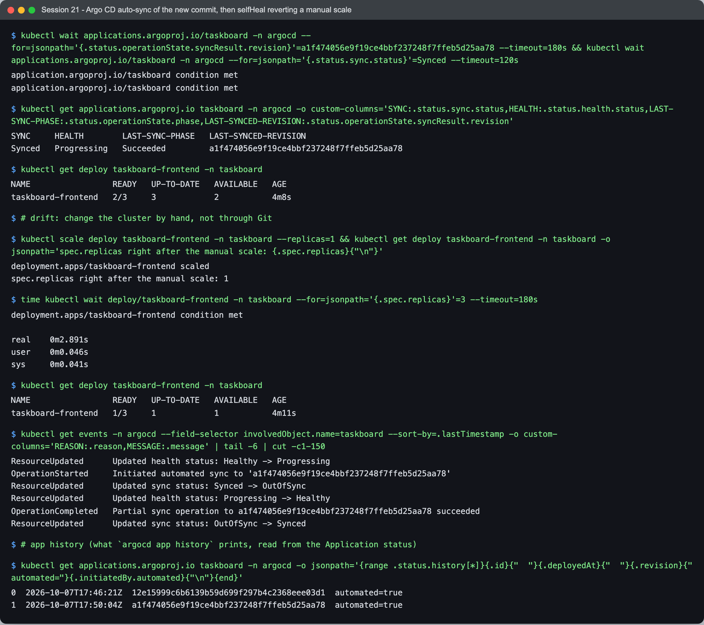

```text
$ kubectl wait applications.argoproj.io/taskboard -n argocd --for=jsonpath='{.status.operationState.syncResult.revision}'=a1f474056e9f19ce4bbf237248f7ffeb5d25aa78 --timeout=180s && kubectl wait ... --for=jsonpath='{.status.sync.status}'=Synced --timeout=120s
application.argoproj.io/taskboard condition met
application.argoproj.io/taskboard condition met

$ kubectl get applications.argoproj.io taskboard -n argocd -o custom-columns='SYNC:...,HEALTH:...,LAST-SYNC-PHASE:.status.operationState.phase,LAST-SYNCED-REVISION:.status.operationState.syncResult.revision'
SYNC     HEALTH        LAST-SYNC-PHASE   LAST-SYNCED-REVISION
Synced   Progressing   Succeeded         a1f474056e9f19ce4bbf237248f7ffeb5d25aa78

$ kubectl get deploy taskboard-frontend -n taskboard
NAME                 READY   UP-TO-DATE   AVAILABLE   AGE
taskboard-frontend   2/3     3            2           4m8s
```

The sync operation's revision is **`a1f4740`, the commit I pushed**, and the frontend
Deployment now wants 3 replicas (the third pod was starting: `Progressing`).

### Drift is reverted (selfHeal)

```text
# drift: change the cluster by hand, not through Git
$ kubectl scale deploy taskboard-frontend -n taskboard --replicas=1 && kubectl get deploy ... -o jsonpath='spec.replicas right after the manual scale: {.spec.replicas}'
deployment.apps/taskboard-frontend scaled
spec.replicas right after the manual scale: 1

$ time kubectl wait deploy/taskboard-frontend -n taskboard --for=jsonpath='{.spec.replicas}'=3 --timeout=180s
deployment.apps/taskboard-frontend condition met
real	0m2.891s

$ kubectl get deploy taskboard-frontend -n taskboard
NAME                 READY   UP-TO-DATE   AVAILABLE   AGE
taskboard-frontend   1/3     3            1           4m11s

$ kubectl get events -n argocd --field-selector involvedObject.name=taskboard --sort-by=.lastTimestamp -o custom-columns='REASON:.reason,MESSAGE:.message' | tail -6
ResourceUpdated      Updated health status: Healthy -> Progressing
OperationStarted     Initiated automated sync to 'a1f474056e9f19ce4bbf237248f7ffeb5d25aa78'
ResourceUpdated      Updated sync status: Synced -> OutOfSync
ResourceUpdated      Updated health status: Progressing -> Healthy
OperationCompleted   Partial sync operation to a1f474056e9f19ce4bbf237248f7ffeb5d25aa78 succeeded
ResourceUpdated      Updated sync status: OutOfSync -> Synced

# app history (what `argocd app history` prints, read from the Application status)
$ kubectl get applications.argoproj.io taskboard -n argocd -o jsonpath='{range .status.history[*]}{.id}{"  "}{.deployedAt}{"  "}{.revision}{"  automated="}{.initiatedBy.automated}{"\n"}{end}'
0  2026-10-07T17:46:21Z  12e15999c6b6139b59d699f297b4c2368eee03d1  automated=true
1  2026-10-07T17:50:04Z  a1f474056e9f19ce4bbf237248f7ffeb5d25aa78  automated=true
```

- `kubectl scale --replicas=1` took effect (`spec.replicas` 1), and **within 2.9 s** Argo CD
  had put it back to 3. Two of the three frontend pods had been killed by my scale-down, so
  for a while `READY` was `1/3` while the replacements started; about 30 s later
  `kubectl get deploy` showed `3/3` (checked by hand, not in the screenshot). selfHeal restores the *desired state*; it cannot undo the pods that were already
  terminated.
- The events show the self-heal as its own automated sync to the same revision: `OutOfSync`,
  then a **Partial** sync (only the drifted Deployment was re-applied), then `Synced`.
- `app history` has two entries, both `automated=true`: the initial sync of `12e1599` and the
  sync of my commit `a1f4740`. The self-heal is not a new entry: it did not deploy a new
  revision, it re-applied the current one.
- Pushing `values-gitops.yaml` also triggered the CI pipeline (run `37662097918`, the
  workflow watches this folder); that run is independent of Argo CD, which only reads Git.

Argo CD was uninstalled and the `argocd` namespace deleted after these captures.

## 13. Troubleshooting challenge

Three faults injected into the running release, one at a time. Each one: symptom →
investigation → root cause → fix → verification.

### Issue 1 — wrong image tag → image pull failure

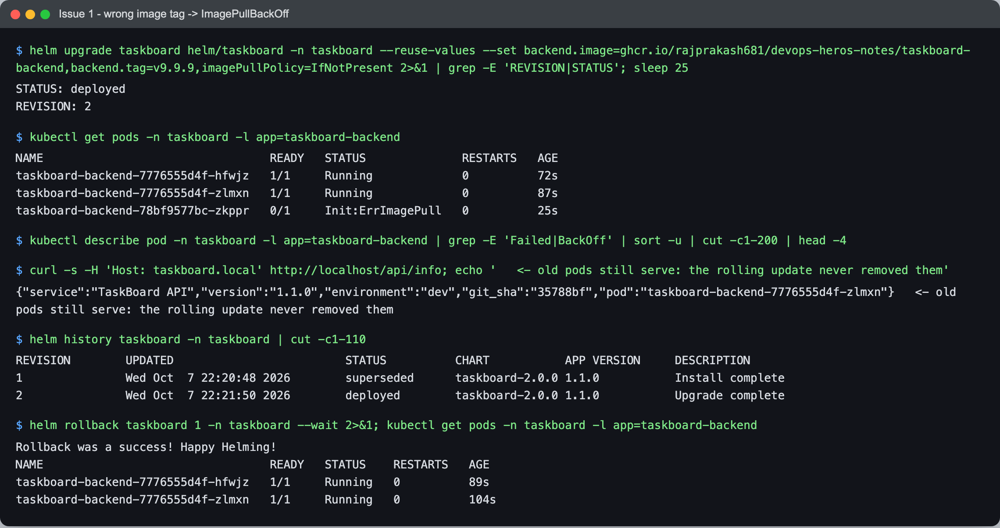

```text
$ helm upgrade taskboard helm/taskboard -n taskboard --reuse-values --set backend.image=ghcr.io/rajprakash681/devops-heros-notes/taskboard-backend,backend.tag=v9.9.9,imagePullPolicy=IfNotPresent
STATUS: deployed
REVISION: 2

$ kubectl get pods -n taskboard -l app=taskboard-backend
NAME                                 READY   STATUS              RESTARTS   AGE
taskboard-backend-7776555d4f-hfwjz   1/1     Running             0          72s
taskboard-backend-7776555d4f-zlmxn   1/1     Running             0          87s
taskboard-backend-78bf9577bc-zkppr   0/1     Init:ErrImagePull   0          25s

$ curl -s -H 'Host: taskboard.local' http://localhost/api/info
{"service":"TaskBoard API","version":"1.1.0","environment":"dev","git_sha":"35788bf","pod":"taskboard-backend-7776555d4f-zlmxn"}

$ helm history taskboard -n taskboard
1       	Wed Oct  7 22:20:48 2026	superseded	taskboard-2.0.0	1.1.0      	Install complete
2       	Wed Oct  7 22:21:50 2026	deployed  	taskboard-2.0.0	1.1.0      	Upgrade complete

$ helm rollback taskboard 1 -n taskboard --wait
Rollback was a success! Happy Helming!
taskboard-backend-7776555d4f-hfwjz   1/1     Running   0          89s
taskboard-backend-7776555d4f-zlmxn   1/1     Running   0          104s
```

- **Symptom:** a new pod stuck in `Init:ErrImagePull` (it becomes `ImagePullBackOff` as the
  retries back off). It is the *init* container that fails, because `migrate` is the first
  container to need the image.
- **Investigation:** `kubectl get pods` shows the new ReplicaSet's pod failing and the old
  ones still `Running`; `/api/info` confirms users are still served by the old build. My
  `describe | grep Failed` in the capture printed nothing (the events were not there yet at
  25 s), so the evidence is the pod status.
- **Root cause:** tag `v9.9.9` does not exist in GHCR (the pipeline only pushes SHA tags).
- **Fix / verify:** `helm rollback taskboard 1`; the broken pod is gone, two pods on
  `35788bf` are Running.
- **Lesson:** `helm history` says revision 2 is `deployed` / `Upgrade complete`: Helm
  without `--wait` reports success as soon as the objects are accepted. The rolling update
  (`maxUnavailable` 25%) is what kept the app up, not Helm.

### Issue 2 — Service selector typo → no endpoints → 503

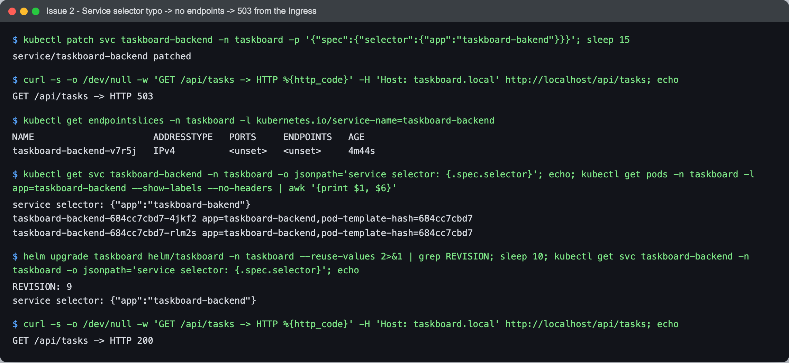

```text
$ kubectl patch svc taskboard-backend -n taskboard -p '{"spec":{"selector":{"app":"taskboard-bakend"}}}'
service/taskboard-backend patched

$ curl ... http://localhost/api/tasks
GET /api/tasks -> HTTP 503

$ kubectl get endpointslices -n taskboard -l kubernetes.io/service-name=taskboard-backend
NAME                      ADDRESSTYPE   PORTS     ENDPOINTS   AGE
taskboard-backend-v7r5j   IPv4          <unset>   <unset>     4m44s

$ kubectl get svc taskboard-backend -n taskboard -o jsonpath='service selector: {.spec.selector}'; kubectl get pods ... --show-labels
service selector: {"app":"taskboard-bakend"}
taskboard-backend-684cc7cbd7-4jkf2 app=taskboard-backend,pod-template-hash=684cc7cbd7
taskboard-backend-684cc7cbd7-rlm2s app=taskboard-backend,pod-template-hash=684cc7cbd7

$ helm upgrade taskboard helm/taskboard -n taskboard --reuse-values
REVISION: 9
service selector: {"app":"taskboard-backend"}

GET /api/tasks -> HTTP 200
```

- **Symptom:** `/api/*` returns 503 while every pod is `1/1 Running`, the same as the course's
  `broken-service.yaml`.
- **Investigation:** the EndpointSlice is empty; comparing the Service selector with the pod
  labels shows `bakend` vs `backend`.
- **Root cause:** a Service selects pods by label; one wrong character = zero endpoints, and
  ingress-nginx answers 503 when a backend has no endpoints.
- **Fix / verify:** `helm upgrade --reuse-values`. Helm 3's three-way merge noticed the live
  selector differed from the chart and patched it back; `/api/tasks` is 200 again.

### Issue 3 — wrong database password in the Secret

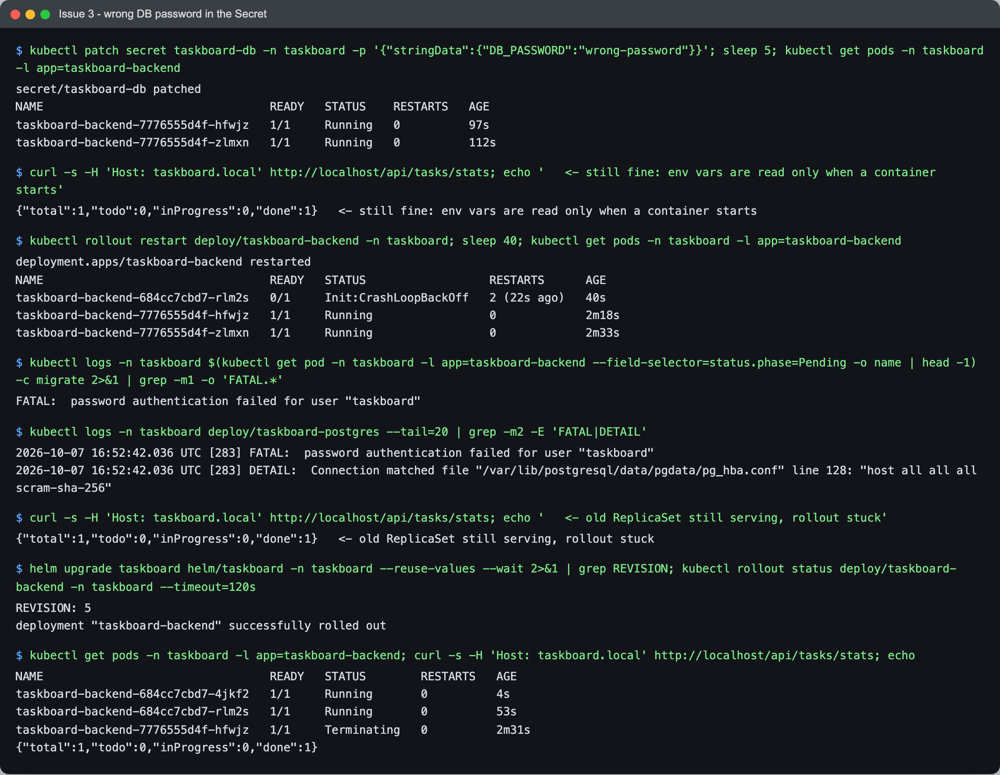

```text
$ kubectl patch secret taskboard-db -n taskboard -p '{"stringData":{"DB_PASSWORD":"wrong-password"}}'
secret/taskboard-db patched
taskboard-backend-7776555d4f-hfwjz   1/1     Running   0          97s
taskboard-backend-7776555d4f-zlmxn   1/1     Running   0          112s

$ curl -s -H 'Host: taskboard.local' http://localhost/api/tasks/stats
{"total":1,"todo":0,"inProgress":0,"done":1}   <- still fine: env vars are read only when a container starts

$ kubectl rollout restart deploy/taskboard-backend -n taskboard; sleep 40; kubectl get pods ...
taskboard-backend-684cc7cbd7-rlm2s   0/1     Init:CrashLoopBackOff   2 (22s ago)   40s
taskboard-backend-7776555d4f-hfwjz   1/1     Running                 0             2m18s
taskboard-backend-7776555d4f-zlmxn   1/1     Running                 0             2m33s

$ kubectl logs -n taskboard <pending pod> -c migrate | grep -o 'FATAL.*'
FATAL:  password authentication failed for user "taskboard"

$ kubectl logs -n taskboard deploy/taskboard-postgres --tail=20 | grep -m2 -E 'FATAL|DETAIL'
2026-10-07 16:52:42.036 UTC [283] FATAL:  password authentication failed for user "taskboard"
2026-10-07 16:52:42.036 UTC [283] DETAIL:  Connection matched file "/var/lib/postgresql/data/pgdata/pg_hba.conf" line 128: "host all all all scram-sha-256"

$ helm upgrade taskboard helm/taskboard -n taskboard --reuse-values --wait; kubectl rollout status ...
REVISION: 5
deployment "taskboard-backend" successfully rolled out
taskboard-backend-684cc7cbd7-4jkf2   1/1     Running       0          4s
taskboard-backend-684cc7cbd7-rlm2s   1/1     Running       0          53s
{"total":1,"todo":0,"inProgress":0,"done":1}
```

- **Symptom:** none at first. That is the interesting part: the Secret changed and nothing
  happened, because env vars from a Secret are copied into a container only when it starts.
  The fault was a time bomb for the next restart. Running `rollout restart` (what a node
  drain, an OOM kill or an HPA scale-up would also do) set it off: the new pod is
  `Init:CrashLoopBackOff`.
- **Investigation:** `kubectl logs <pod> -c migrate` (you must name the init container) shows
  the authentication failure; Postgres's own log confirms it from the other side and names
  the `pg_hba.conf` rule (`scram-sha-256`).
- **Root cause:** `DB_PASSWORD` in Secret `taskboard-db` no longer matches the password
  Postgres was initialised with.
- **Fix / verify:** `helm upgrade --reuse-values` restored the Secret from the chart; the
  stuck pod's next init retry succeeded and the rollout completed. Throughout, the old
  ReplicaSet kept serving, because the new pods never became ready.
- **Lesson:** this is why the chart puts `checksum/secret` on the pod template: a Secret
  change made *through Helm* rolls the pods immediately, so a bad value fails during the
  deploy, not hours later. A `kubectl patch` bypasses that, which is exactly what I did here.

## 14. Screenshots

| File | Shows |
|---|---|
| [01-course-chart-install.png](screenshots/01-course-chart-install.png) | course chart: ServiceMonitor CRD error, then CrashLoopBackOff |
| [02-course-chart-failures.png](screenshots/02-course-chart-failures.png) | nginx upstream error, Ingress pointing at a missing Service, 503s, root image |
| [03-helm-install.png](screenshots/03-helm-install.png) | my chart installed, all objects, probes, ConfigMap/Secret wiring |
| [04-api-through-ingress.png](screenshots/04-api-through-ingress.png) | CRUD through the Ingress, rows in PostgreSQL, alembic version |
| [05-issue1-image-tag.png](screenshots/05-issue1-image-tag.png) | troubleshooting issue 1 |
| [06-issue2-service-selector.png](screenshots/06-issue2-service-selector.png) | troubleshooting issue 2 |
| [07-issue3-db-secret.png](screenshots/07-issue3-db-secret.png) | troubleshooting issue 3 |
| [08-pipeline-green.png](screenshots/08-pipeline-green.png) | `gh run view` of the green run, gate and smoke-test log lines |
| [09-monitoring.png](screenshots/09-monitoring.png) | `/metrics`, `kubectl top`, HPA, request logs |
| [10-course-terraform.png](screenshots/10-course-terraform.png) | `terraform init` on the course code ignoring the module version pins |
| [11-terraform-plan-apply.png](screenshots/11-terraform-plan-apply.png) | moto running + reset, `init`, full `plan` (54), `apply` (51 created, 2 emulator errors) |
| [12-terraform-state-destroy.png](screenshots/12-terraform-state-destroy.png) | `state list`, `output`, `show`, AWS CLI check against moto, `destroy` (51) |
| [13-prometheus-promql.png](screenshots/13-prometheus-promql.png) | Prometheus targets; PromQL request rate, p95/p99 latency, error rate under load |
| [14-pod-resources-logs.png](screenshots/14-pod-resources-logs.png) | pod CPU/memory from cAdvisor, `kubectl top`, HPA, access logs with the 404s |
| [15-grafana-dashboard.png](screenshots/15-grafana-dashboard.png) | Grafana dashboard provisioned from a file (browser screenshot, HTTP 200) |
| [16-hpa-scale-up.png](screenshots/16-hpa-scale-up.png) | HPA scaling the backend 2 → 4 → 5 under the load test |
| [17-argocd-initial-sync.png](screenshots/17-argocd-initial-sync.png) | Argo CD installed, Application applied, initial sync, GHCR images |
| [18-argocd-sync-new-commit.png](screenshots/18-argocd-sync-new-commit.png) | commit + push of `values-gitops.yaml`, Argo CD comparing against the new SHA |
| [19-argocd-selfheal-history.png](screenshots/19-argocd-selfheal-history.png) | sync result = pushed SHA, manual scale reverted by selfHeal, app history |

All except 15 are terminal captures made with [`tools/capture.py`](../../tools/README.md) and
`shoot-term.mjs` from real command output; 15 is `shoot-web.mjs` against Grafana through
`kubectl port-forward`. There is no browser screenshot of the TaskBoard UI (time);
`curl ... http://localhost/` returning `<title>TaskBoard</title>` through the Ingress is the
only evidence of the frontend.

## What is not done

I had a hard time limit for this session and cut scope. Everything below is missing, not
hidden:

- **Terraform on real AWS:** plan/apply/destroy ran against the moto emulator only (no AWS
  account). There, 51 of 54 resources applied; the EKS access entry, its policy association
  and one module precondition failed because moto lacks those APIs (section 8). No real EKS
  cluster was ever created, and no remote state backend is configured.
- **Alerting:** Prometheus has no alert rules and there is no Alertmanager. The dashboard
  shows the problems; nothing would page anyone.
- **Argo CD in CI:** the pipeline does not bump `values-gitops.yaml` itself; I made that
  commit by hand. Argo CD ran locally on kind, not on a shared cluster.
- **Docker Compose:** written, not run.
- **No browser screenshot** of the app or a GHCR package page.
- **Troubleshooting attempts that did not work** (see Problems I hit) are not counted among
  the three issues.

## Lessons learned

- **Run the course code before trusting it.** Tests, chart and Terraform all failed as
  shipped, each in a different way, and two of the failures (the ServiceMonitor, the
  nginx upstream) only appear on a real cluster, not in `helm lint`, which passed.
- **`helm lint` passing means very little.** It passed on a chart whose Ingress pointed at a
  Service that did not exist.
- **Secrets and ConfigMaps are read at container start.** Issue 3 was invisible until a
  restart. Checksum annotations turn a delayed failure into an immediate one.
- **Rolling updates are the real safety net.** In issues 1 and 3 users kept getting answers
  from the old ReplicaSet while the new pods failed, and Helm without `--wait` called the
  broken revision `deployed`.
- **`terraform init` is not validation.** It ignored a module version pin it could not parse
  and downloaded the latest major versions.
- **An emulator tests your code and its own coverage.** moto ran 51 of 54 EKS-module
  resources; the 3 failures were missing moto APIs, and one needed a moto setting
  (`MOTO_IAM_LOAD_MANAGED_POLICIES`) before anything IAM-related worked.
- **A load test finds application problems too.** Latency rose all through the run because
  `GET /api/tasks` returns the whole table; Prometheus made that visible in minutes.
- **Argo CD's "revision" depends on which field you read.** `status.sync.revision` is what
  it last compared against; `operationState.syncResult.revision` and the history are what it
  actually deployed. On a busy `main` the two differ.
- **Ask the running app what it is.** `/api/info` with a baked-in git SHA turned "did the
  deploy work?" into a string comparison in the smoke test.

## Problems I hit

- **My first attempt at a Service `targetPort` fault did not produce a 502.** I patched the
  backend Service's `targetPort` to 8080 (the pods listen on 8000). The EndpointSlice did show
  port `8080`, but `curl` through the Ingress still returned `HTTP 200`, both after 3 s and
  after 20 s, and the ingress-nginx log had no `connect() failed` line. I did not have time to
  find out why, so it is not one of the three issues above. My unconfirmed guess is that
  ingress-nginx resolves the Ingress's named port (`http`) against the pod's `containerPort`
  name rather than the Service's numeric `targetPort`.
- **An OOMKilled scenario failed to inject.** `helm upgrade ... --set
  backend.resources.limits.memory=24Mi` printed no revision and nothing changed. The likely
  reason is that the request (128Mi) was then larger than the limit, which the API server
  rejects; my capture filtered the error line out with `grep REVISION`, so I cannot show it.
  Dropped for time.
- **Trivy's informational report shows 44 HIGH, the gate passes.** That looks contradictory
  until you read the flags: the gate has `--ignore-unfixed`. I have not broken down which
  packages they are.
