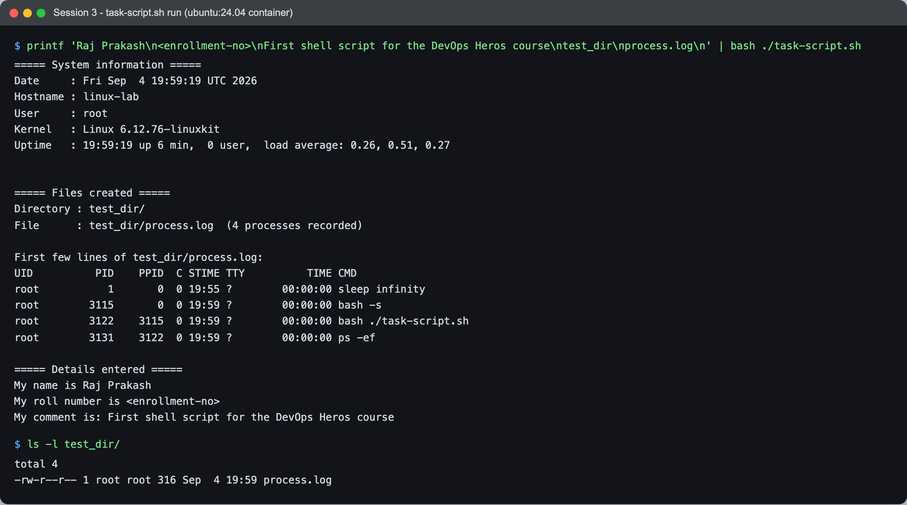

# Session 3 — Shell Scripting — Task

- **Name:** Raj Prakash
- **Enrollment No:** 24BCS10328

> **Status:** done
>
> Run in the same **Ubuntu 24.04.4 LTS** container used in
> [session 2](../../session2-linux/task/) (`linux-lab`, kernel `6.12.76-linuxkit`), so
> `ps -ef` and `uptime` produce Linux output rather than the BSD variants my Mac ships.

---

## What the task asked

From [`../task.md`](../task.md), write a script that:

- prints the current date
- prints the hostname and username
- writes process information into a file called `process.log`
- prints a name, roll number and comment
- uses **variables**, **takes input**, and **creates a file and a directory**

## The script

[`task-script.sh`](task-script.sh) — the parts that matter:

```bash
# variables, filled by command substitution
current_date=$(date)
host_name=$(hostname)
user_name=$(whoami)
kernel=$(uname -sr)

# take input
read -rp "Enter your name: " name
read -rp "Enter your roll number: " roll_no
read -rp "Enter a comment: " comment
read -rp "Enter a directory name to create: " dir_name
read -rp "Enter a file name for the process log: " file_name

# create the directory, then the file inside it
mkdir -p "$dir_name"
ps -ef > "$dir_name/$file_name"

proc_count=$(( $(wc -l < "$dir_name/$file_name") - 1 ))   # -1 drops the ps header row
```

`set -u` is on at the top, so a typo'd variable name aborts the script instead of quietly
expanding to an empty string.

## How I ran it

The script is interactive. To make the run reproducible I piped the five answers in rather
than typing them:

```bash
printf 'Raj Prakash\n<enrollment-no>\nFirst shell script for the DevOps Heros course\ntest_dir\nprocess.log\n' \
  | bash ./task-script.sh
```

It works normally too — `bash ./task-script.sh` and answer the five prompts.

## Output



```text
$ printf 'Raj Prakash\n<enrollment-no>\nFirst shell script for the DevOps Heros course\ntest_dir\nprocess.log\n' | bash ./task-script.sh
===== System information =====
Date     : Fri Sep  4 19:59:19 UTC 2026
Hostname : linux-lab
User     : root
Kernel   : Linux 6.12.76-linuxkit
Uptime   : 19:59:19 up 6 min,  0 user,  load average: 0.26, 0.51, 0.27


===== Files created =====
Directory : test_dir/
File      : test_dir/process.log  (4 processes recorded)

First few lines of test_dir/process.log:
UID          PID    PPID  C STIME TTY          TIME CMD
root           1       0  0 19:55 ?        00:00:00 sleep infinity
root        3115       0  0 19:59 ?        00:00:00 bash -s
root        3122    3115  0 19:59 ?        00:00:00 bash ./task-script.sh
root        3131    3122  0 19:59 ?        00:00:00 ps -ef

===== Details entered =====
My name is Raj Prakash
My roll number is <enrollment-no>
My comment is: First shell script for the DevOps Heros course

$ ls -l test_dir/
total 4
-rw-r--r-- 1 root root 316 Sep  4 19:59 process.log
```

The generated file is committed as [`test_dir/process.log`](test_dir/process.log) — it is
the output of that exact run, so the PIDs in it match the ones in the screenshot.

## Reading the process list

Only **four** processes, and that is the interesting part. On a normal Linux box `ps -ef`
returns well over a hundred lines. In a container you see only the processes in that
container's PID namespace:

- **PID 1 is `sleep infinity`** — the command I started the container with. In a container
  PID 1 is whatever you ran, not `systemd` or `init`.
- `bash -s` is the shell `docker exec` opened, `bash ./task-script.sh` is the script, and
  `ps -ef` is the process reporting on itself.

`uptime` also says **`0 user`** — nobody is logged in, because `docker exec` does not create
a login session or a utmp entry. That is why the task's suggested `who`/`w` would come back
empty here, and why I used `whoami` (which reads the effective UID) rather than `who am i`
(which reads utmp).

## What I learned

- `$(...)` runs a command and hands back its stdout with trailing newlines stripped, which
  is what makes `current_date=$(date)` work cleanly.
- Quoting matters: `mkdir -p "$dir_name"` survives a directory name with a space in it,
  `mkdir -p $dir_name` would create two directories instead.
- `wc -l < file` is better than `wc -l file` when you want just the number — the redirect
  form gives no filename to strip off.
- Containers make the PID namespace visible in a way a normal VM never does. `ps -ef`
  returning four lines is a much sharper demonstration of what a namespace *is* than any
  explanation of it.

## Problems I hit

- **The prompts do not appear in the screenshot.** When stdin is a pipe rather than a
  terminal, bash's `read -p` suppresses the prompt entirely — so piping the answers in
  gives clean output but silently loses the five `Enter your ...:` lines. I tried forcing a
  pty with `script -qec`, which brought the prompts back but also echoed all five answers at
  the top and ran the prompts together on one line. The piped version reads better, so I
  kept it and documented why the prompts are missing rather than pretending.
- **`<enrollment-no>` is a placeholder.** Re-run the command above with the real number
  before submitting, so the screenshot and the write-up agree.
