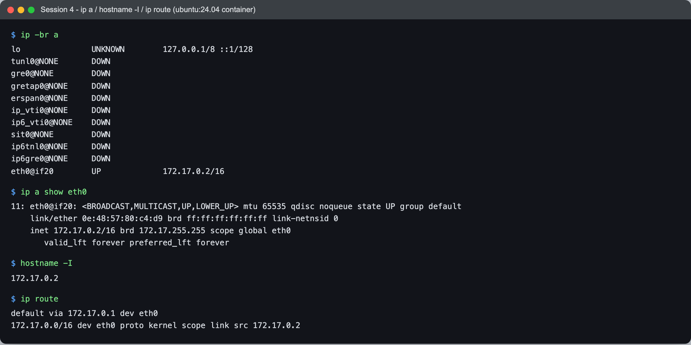
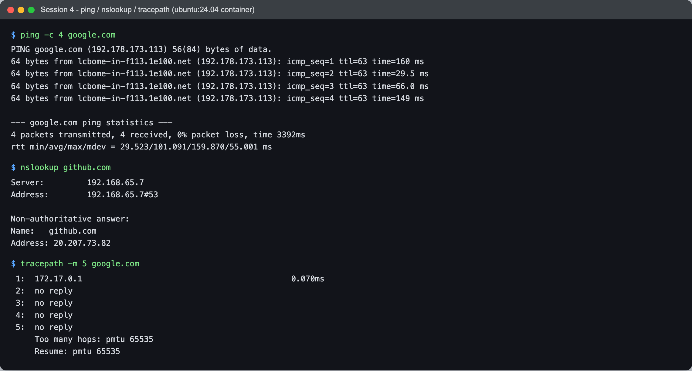
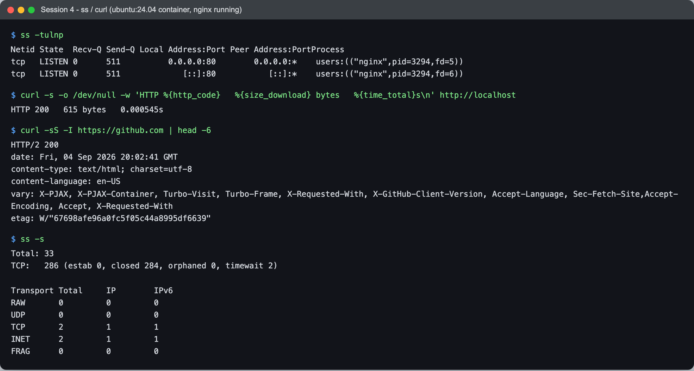
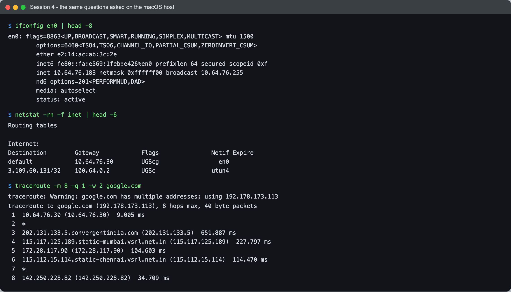

# Session 4 — Networking — Task: Commands & Analysis

- **Name:** Raj Prakash
- **Enrollment No:** _(your enrollment number)_

> **Status:** done
>
> Run two places on purpose. The Linux commands (`ip`, `ss`, `tracepath`) do not exist on
> macOS, so those ran in the **Ubuntu 24.04.4 LTS** container from
> [session 2](../../session2-linux/task/). Then I asked the *same questions* of the macOS
> host with its BSD equivalents (`ifconfig`, `netstat`, `traceroute`) — the two answers
> disagree in ways that turn out to be the most interesting part of this task.
>
> `nslookup` and `tracepath` are not in the base image; I added them with
> `apt-get install dnsutils iputils-tracepath`.

---

## What the task asked

Run the standard networking commands, capture the output, and explain what each one is
actually telling you.

---

## 1. `ip a` — every interface and its addresses



```text
$ ip -br a
lo               UNKNOWN        127.0.0.1/8 ::1/128
tunl0@NONE       DOWN
gre0@NONE        DOWN
gretap0@NONE     DOWN
erspan0@NONE     DOWN
ip_vti0@NONE     DOWN
ip6_vti0@NONE    DOWN
sit0@NONE        DOWN
ip6tnl0@NONE     DOWN
ip6gre0@NONE     DOWN
eth0@if20        UP             172.17.0.2/16
```

`-br` is the brief form — one line per interface instead of four. Only two interfaces are
`UP`: loopback, and `eth0`. Everything between them is a **tunnel encapsulation device**
(`gre`, `sit`, `ipip`, `vti`) that the LinuxKit kernel compiles in and exposes even when
nothing uses it. They are DOWN and have no address; harmless noise, but worth recognising
so you do not go hunting for what created them.

```text
$ ip a show eth0
11: eth0@if20: <BROADCAST,MULTICAST,UP,LOWER_UP> mtu 65535 qdisc noqueue state UP group default
    link/ether 0e:48:57:80:c4:d9 brd ff:ff:ff:ff:ff:ff link-netnsid 0
    inet 172.17.0.2/16 brd 172.17.255.255 scope global eth0
       valid_lft forever preferred_lft forever
```

Reading it field by field:

- **`eth0@if20`** — the `@if20` is the giveaway that this is one end of a **veth pair**.
  Interface index 20 on the *other* side of the pair lives in the host's namespace, plugged
  into the `docker0` bridge. `link-netnsid 0` confirms the peer is in a different network
  namespace.
- **`mtu 65535`** — not a typo, and not normal. A real Ethernet NIC is 1500 (see the macOS
  host below, which is exactly that). Docker Desktop runs containers inside a VM with a
  userspace network stack, so there is no physical frame size to respect on this hop.
- **`0e:48:57:80:c4:d9`** — the MAC. The `0e` first octet has the locally-administered bit
  set: Docker generated this address, it was not burned into any hardware.
- **`172.17.0.2/16`** — the address, with a **/16** mask.

### Subnet arithmetic on that address, using the session notes

`172.17.0.2/16` sits in **172.16.0.0 – 172.31.255.255**, which is the RFC 1918 private
Class B range — so this address is not routable on the internet, which is why NAT has to
exist at all.

| | |
|---|---|
| Address | `172.17.0.2` |
| Prefix | `/16` → mask `255.255.0.0` |
| Network bits | 16 |
| Host bits | 32 − 16 = **16** |
| Total addresses | 2¹⁶ = 65,536 |
| Usable hosts | 2¹⁶ − 2 = **65,534** |
| Network address | `172.17.0.0` |
| Broadcast | `172.17.255.255` ← matches the `brd` field above |

The `brd 172.17.255.255` printed by `ip` is the same number the arithmetic gives, which is
a nice check that the theory and the tool agree.

## 2. `hostname -I` — just the addresses

```text
$ hostname -I
172.17.0.2
```

The same address with nothing to parse — which is the point, it is meant for scripts. Note
it is `-I` (capital i); lowercase `-i` resolves the hostname through `/etc/hosts` and can
return `127.0.1.1` on a box with no DNS entry for itself.

## 3. `ip route` — where packets go

```text
$ ip route
default via 172.17.0.1 dev eth0
172.17.0.0/16 dev eth0 proto kernel scope link src 172.17.0.2
```

Two rules, and they are read most-specific-first:

- Anything inside `172.17.0.0/16` is **on-link** — reachable directly over `eth0`, no
  router needed. `proto kernel` means the kernel added this route itself when the address
  was assigned, nobody configured it.
- Everything else goes to the **default gateway `172.17.0.1`**, which is the `docker0`
  bridge on the host side. That single line is the container's entire connection to the
  outside world.

---

## 4. `ping -c 4 google.com` — is it reachable, and how far



```text
$ ping -c 4 google.com
PING google.com (192.178.173.113) 56(84) bytes of data.
64 bytes from lcbome-in-f113.1e100.net (192.178.173.113): icmp_seq=1 ttl=63 time=160 ms
64 bytes from lcbome-in-f113.1e100.net (192.178.173.113): icmp_seq=2 ttl=63 time=29.5 ms
64 bytes from lcbome-in-f113.1e100.net (192.178.173.113): icmp_seq=3 ttl=63 time=66.0 ms
64 bytes from lcbome-in-f113.1e100.net (192.178.173.113): icmp_seq=4 ttl=63 time=149 ms

--- google.com ping statistics ---
4 packets transmitted, 4 received, 0% packet loss, time 3392ms
rtt min/avg/max/mdev = 29.523/101.091/159.870/55.001 ms
```

- **`0% packet loss`** — the connection works end to end. This is the one number to read
  first.
- **`ttl=63`** on every reply. TTL is decremented once per router. Google sends replies
  with an initial TTL of 64, so a value of 63 means the reply crossed exactly **one** device
  that decremented it. That is not the real internet path — it is Docker Desktop's NAT
  rewriting the packet. The genuine hop count shows up in the macOS traceroute further down.
- **`min/avg/max/mdev = 29.5/101/160/55 ms`** — the spread is the story. `mdev` (mean
  deviation) of 55 ms against a 101 ms average is very jittery for four packets. On Wi-Fi
  that is normal; on a wired link it would suggest congestion.
- `1e100.net` is Google's own PTR domain — 1 followed by 100 zeros, a googol.

## 5. `nslookup github.com` — name to address

```text
$ nslookup github.com
Server:		192.168.65.7
Address:	192.168.65.7#53

Non-authoritative answer:
Name:	github.com
Address: 20.207.73.82
```

- **`Server: 192.168.65.7#53`** — the resolver being asked, on the standard DNS port 53.
  That address is Docker Desktop's built-in DNS proxy inside its VM, not my router. Every
  container's `/etc/resolv.conf` points at it and it forwards upstream.
- **`Non-authoritative answer`** — this resolver is not the owner of the `github.com` zone;
  it is handing back a cached copy. An authoritative answer would come only from GitHub's
  own nameservers.
- **`20.207.73.82`** is in Microsoft's Azure India South range. GitHub is anycast/geo-routed,
  so this answer is specific to where I am — someone running the same command in another
  country gets a different address for the same name. DNS is not a global constant.

## 6. `tracepath -m 5 google.com` — the path (and where it fails)

```text
$ tracepath -m 5 google.com
 1:  172.17.0.1                                            0.070ms
 2:  no reply
 3:  no reply
 4:  no reply
 5:  no reply
     Too many hops: pmtu 65535
```

Hop 1 is the docker bridge, at **0.07 ms** — that is a memory copy inside one machine, not
a network hop. After that: nothing.

This is **not** a broken network — `ping` and `curl` in the same container both work fine.
It is Docker Desktop's userspace network stack not generating **ICMP Time Exceeded**
messages. `tracepath`/`traceroute` work by sending packets with TTL 1, 2, 3… and reading
the "you exceeded TTL" error each router sends back; if nothing along the path returns that
error, every hop reads as `no reply`. The `pmtu 65535` at the end is the same fake MTU from
`ip a` showing up again.

The proof that it is the container and not the connection is running the same trace on the
host — see below, where the real path appears.

---

## 7. `ss -tulnp` — what is listening



I installed and started nginx in the container first, otherwise nothing is listening and
`ss` prints only a header — which is itself a fair result for a container that runs one
`sleep` process, but not a useful screenshot.

```text
$ ss -tulnp
Netid State  Recv-Q Send-Q Local Address:Port Peer Address:PortProcess
tcp   LISTEN 0      511          0.0.0.0:80        0.0.0.0:*    users:(("nginx",pid=3294,fd=5))
tcp   LISTEN 0      511             [::]:80           [::]:*    users:(("nginx",pid=3294,fd=6))
```

The flags: `-t` TCP, `-u` UDP, `-l` listening only, `-n` numeric (do not resolve `80` to
`http`), `-p` show the owning process.

- Two rows for **one** service — `0.0.0.0:80` is the IPv4 socket and `[::]:80` the IPv6 one.
  nginx opened both, hence two different file descriptors (`fd=5`, `fd=6`) on the same PID.
- `0.0.0.0` means **all interfaces**. Had it said `127.0.0.1:80`, the service would be
  unreachable from outside the container no matter what ports you published — a very common
  cause of "my container starts but I get connection refused".
- **`Send-Q 511`** on a listening socket is not queued data; for `LISTEN` it is the accept
  **backlog** — how many completed connections may wait before the kernel starts refusing.
- `Recv-Q 0` means nothing is sitting unaccepted right now.

## 8. `curl` — actually speak HTTP

```text
$ curl -s -o /dev/null -w 'HTTP %{http_code}   %{size_download} bytes   %{time_total}s\n' http://localhost
HTTP 200   615 bytes   0.000545s

$ curl -sS -I https://github.com | head -6
HTTP/2 200
date: Fri, 04 Sep 2026 20:02:41 GMT
content-type: text/html; charset=utf-8
content-language: en-US
vary: X-PJAX, X-PJAX-Container, ...
etag: W/"67698afe96a0fc5f05c44a8995df6639"
```

- The local request took **0.5 ms** and returned nginx's 615-byte default page — the
  loopback path never touches a network.
- `-I` sends a **HEAD** request: headers only, no body. Useful for checking a service is
  alive without downloading it.
- **`HTTP/2`** — the protocol was negotiated during the TLS handshake via ALPN. The local
  request was plain HTTP/1.1 because there is no TLS on it to negotiate with.

```text
$ ss -s
Total: 33
TCP:   286 (estab 0, closed 284, orphaned 0, timewait 2)
```

`ss -s` is the summary. **`timewait 2`** is the tail of the two curl connections above:
after closing, the initiating side holds the socket in `TIME_WAIT` (2×MSL) so late
duplicate packets cannot be mistaken for part of a new connection on the same port pair.

---

## 9. The same questions, asked of the macOS host



```text
$ ifconfig en0 | head -8
en0: flags=8863<UP,BROADCAST,SMART,RUNNING,SIMPLEX,MULTICAST> mtu 1500
	ether e2:14:ac:ab:3c:2e
	inet6 fe80::fa:e569:1feb:e426%en0 prefixlen 64 secured scopeid 0xf
	inet 10.64.76.183 netmask 0xffffff00 broadcast 10.64.76.255
	status: active

$ netstat -rn -f inet | head -6
Destination        Gateway            Flags               Netif Expire
default            10.64.76.30        UGScg                 en0
```

macOS has no `ip`, so `ifconfig` and `netstat -rn` are the equivalents. Same information,
different shape — note `netmask 0xffffff00`, which is BSD writing `255.255.255.0` in hex,
i.e. a **/24**.

| | Container `eth0` | macOS `en0` |
|---|---|---|
| Address | `172.17.0.2/16` | `10.64.76.183/24` |
| Private range | Class B (172.16–172.31) | Class A (10.0.0.0/8) |
| Usable hosts | 65,534 | 254 |
| MTU | **65535** | **1500** ← a real NIC |
| Gateway | `172.17.0.1` (docker0) | `10.64.76.30` (Wi-Fi router) |
| MAC | Docker-generated | macOS private Wi-Fi address |

And the trace that failed inside the container:

```text
$ traceroute -m 8 -q 1 -w 2 google.com
traceroute to google.com (192.178.173.113), 8 hops max, 40 byte packets
 1  10.64.76.30 (10.64.76.30)  9.005 ms
 2  *
 3  202.131.133.5.convergentindia.com (202.131.133.5)  651.887 ms
 4  115.117.125.189.static-mumbai.vsnl.net.in (115.117.125.189)  227.797 ms
 5  172.28.117.90 (172.28.117.90)  104.603 ms
 6  115.112.15.114.static-chennai.vsnl.net.in (115.112.15.114)  114.470 ms
 7  *
 8  142.250.228.82 (142.250.228.82)  34.709 ms
```

**The real path, finally.** Local router → ISP → Tata Communications' Mumbai POP → an
internal `172.28.x` transit hop → Chennai POP → Google's edge. You can read the geography
straight out of the reverse-DNS names.

Two things worth noticing:

- **`*` at hops 2 and 7.** Not a dead router — routers are allowed to rate-limit or simply
  not send ICMP Time Exceeded. A `*` in the middle with hops responding after it is normal
  and means nothing is wrong. A `*` at *every* hop, as in the container, is a different
  diagnosis entirely.
- **Latency does not increase monotonically** — 651 ms at hop 3, then 227, then 104. Each
  number is one round trip to *that* router, measured separately, and intermediate routers
  handle ICMP at low priority. Only the final hop's timing is a real measure of the path.

---

## Summary

| Command | Question it answers |
|---|---|
| `ip a` / `ifconfig` | What interfaces exist and what addresses do they hold? |
| `hostname -I` | Just my IP, for a script |
| `ip route` / `netstat -rn` | Where does a packet for X go? |
| `ping` | Is it reachable, how far (TTL), how fast, any loss? |
| `nslookup` | What address does this name resolve to, and who said so? |
| `tracepath` / `traceroute` | What is the path, and where does it break? |
| `ss -tulnp` | What is listening on this machine, on which interface, owned by what? |
| `curl -I` | Does the service actually speak HTTP, and what does it say? |

## What I learned

- **TTL is a hop counter you get for free.** `ttl=63` from a Google reply immediately said
  "one decrementing device", which flagged the NAT before I had run a single trace.
- **`0.0.0.0` vs `127.0.0.1` in `ss` output is the single most useful field** when a service
  is up but unreachable. It tells you whether the problem is the service or the network.
- **A trace that returns `no reply` everywhere is not a connectivity failure.** Diagnosing
  that needs a second signal — ping and curl both worked, so the path was fine and the
  *diagnostic* was what was blocked.
- **DNS answers are local.** `github.com` resolving into Azure India South is a routing
  optimisation, and it means "the IP of github.com" is not a well-formed question.

## Problems I hit

- **Half these commands do not exist on macOS.** `ip`, `ss` and `tracepath` are
  iproute2/Linux; macOS ships the older BSD `ifconfig`/`netstat`/`traceroute`. Running the
  Linux set in a container and the BSD set on the host ended up being more informative than
  either alone, because the disagreements (MTU 65535 vs 1500, TTL 63 vs 8 real hops) are all
  explained by the container's NAT.
- **`ss` printed only a header at first** — nothing in the container was listening. I
  installed nginx so there would be a real socket to look at, rather than screenshotting an
  empty table.
- **`tracepath` looked like a broken network for a while.** Ping working in the same shell
  is what ruled that out. Worth remembering that a tool failing and the thing it measures
  failing are different events.
