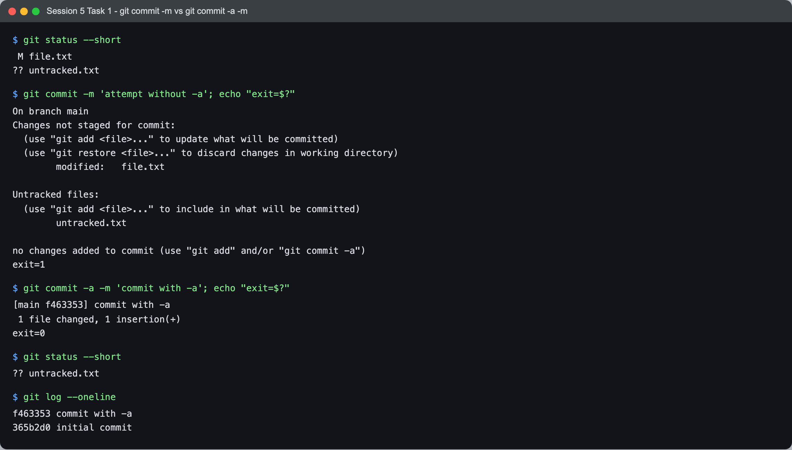
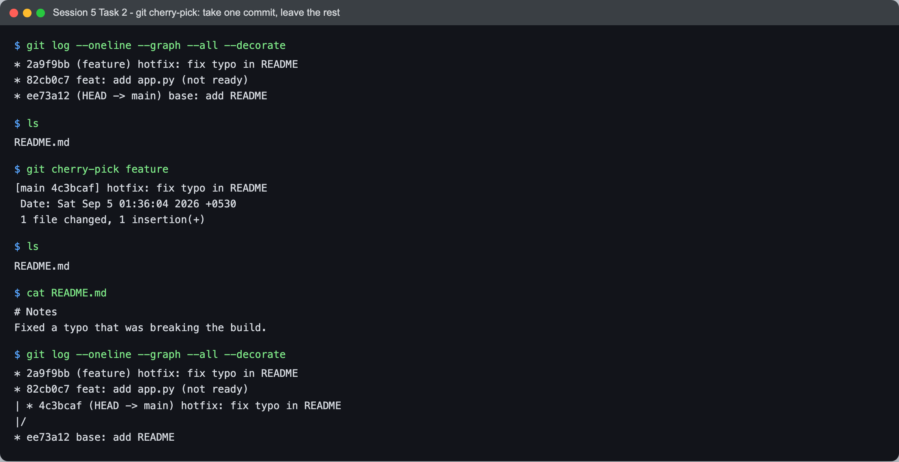
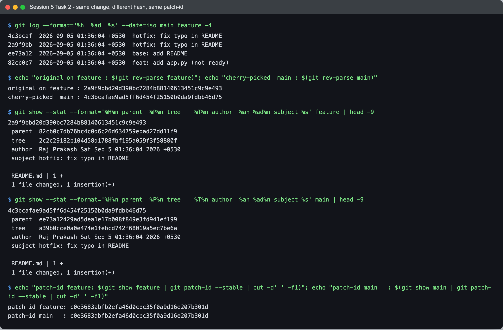

# Session 5 — Git & GitHub — Tasks

- **Name:** Raj Prakash
- **Enrollment No:** 24BCS10328

> **Status:** done
>
> Both tasks were done in throwaway sandbox repos outside this repository, so nothing here
> touches `devops-heros-notes`' own history. Git 2.x on macOS.

---

## Task 1: `git commit -m` vs `git commit -a -m`

### Objective

Show what the `-a` flag actually changes — and, more usefully, what it does **not**.

### The theory

`git commit -m` commits **only what is already staged**. `git commit -a -m` additionally
stages modifications and deletions of files git is **already tracking**, then commits.

The part everyone gets wrong: `-a` does **not** add untracked files. It is "stage the
changes to files I already track", not "commit everything".

### Setup

```bash
git init -b main
echo 'line 1' > file.txt
git add file.txt
git commit -m 'initial commit'

echo 'line 2' >> file.txt          # modify a TRACKED file
echo 'brand new' > untracked.txt   # create an UNTRACKED file
```

Two changes, deliberately of different kinds.

### Execution and output



```text
$ git status --short
 M file.txt
?? untracked.txt
```

`M` in the second column = tracked, modified, not staged. `??` = git has never seen this
file. Now the plain commit:

```text
$ git commit -m 'attempt without -a'; echo "exit=$?"
On branch main
Changes not staged for commit:
	modified:   file.txt

Untracked files:
	untracked.txt

no changes added to commit (use "git add" and/or "git commit -a")
exit=1
```

**It refused — exit code 1.** The staging area was empty, so there was nothing to commit.
Note that git even names the two ways out in its own error message. No commit was created.

```text
$ git commit -a -m 'commit with -a'; echo "exit=$?"
[main f463353] commit with -a
 1 file changed, 1 insertion(+)
exit=0
```

**`1 file changed`** — that is the whole result in one line. Two files were dirty; one got
committed.

```text
$ git status --short
?? untracked.txt

$ git log --oneline
f463353 commit with -a
365b2d0 initial commit
```

`untracked.txt` is **still sitting there untracked** after a commit that many people read as
"commit everything". It would have been silently left out of the push too.

### What this means in practice

| | staged changes | modified tracked files | untracked files | deleted tracked files |
|---|---|---|---|---|
| `git commit -m` | ✅ | ❌ | ❌ | ❌ |
| `git commit -a -m` | ✅ | ✅ | ❌ | ✅ |
| `git add -A && git commit -m` | ✅ | ✅ | ✅ | ✅ |

`-a` is a convenience for the common "I edited three files I already track" case. The
moment a change involves a **new** file — which is most of the time when you are actually
building something — it will quietly skip it. `git status` before every commit is the habit
that catches this.

---

## Task 2: `git cherry-pick`

### Objective

Take **one** commit from another branch without taking everything before it, and understand
why the copy gets a new hash.

### Setup

A branch with two commits, only one of which I want:

```bash
git commit -m 'base: add README'            # on main

git checkout -b feature
git commit -m 'feat: add app.py (not ready)'   # work in progress - do NOT want this
git commit -am 'hotfix: fix typo in README'    # the urgent fix - DO want this

git checkout main
```

This is the realistic version of the problem: an urgent fix is sitting on top of unfinished
work, and merging the branch would drag the unfinished work along with it.

### Execution and output



```text
$ git log --oneline --graph --all --decorate
* 2a9f9bb (feature) hotfix: fix typo in README
* 82cb0c7 feat: add app.py (not ready)
* ee73a12 (HEAD -> main) base: add README

$ ls
README.md
```

`main` has only `README.md` — `app.py` exists only on `feature`. Now take just the tip:

```text
$ git cherry-pick feature
[main 4c3bcaf] hotfix: fix typo in README
 Date: Sat Sep 5 01:36:04 2026 +0530
 1 file changed, 1 insertion(+)

$ ls
README.md

$ cat README.md
# Notes
Fixed a typo that was breaking the build.
```

**`ls` still shows only `README.md`.** That is the whole point of the task: the fix arrived,
`app.py` did not. A `git merge feature` would have brought both.

```text
$ git log --oneline --graph --all --decorate
* 2a9f9bb (feature) hotfix: fix typo in README
* 82cb0c7 feat: add app.py (not ready)
| * 4c3bcaf (HEAD -> main) hotfix: fix typo in README
|/
* ee73a12 base: add README
```

The graph now shows the same commit message on **two divergent branches with two different
hashes** — `2a9f9bb` and `4c3bcaf`. That duplication is real, and it is what makes
cherry-pick something to use deliberately rather than habitually.

### Why the new hash



Everything a person would call "the commit" is identical between the two:

```text
$ git show --stat --format='...' feature
2a9f9bbd20d390bc7284b88140613451c9c9e493
 parent  82cb0c7db76bc4c0d6c26d634759ebad27dd11f9
 tree    2c2c29182b104d58d1788fbf195a059f3f58880f
 author  Raj Prakash Sat Sep 5 01:36:04 2026 +0530
 subject hotfix: fix typo in README
 README.md | 1 +

$ git show --stat --format='...' main
4c3bcafae9ad5ff6d454f25150b0da9fdbb46d75
 parent  ee73a12429ad5dea1e17b008f849e3fd941ef199
 tree    a39b0cce0a0e474e1febcd742f68019a5ec7be6a
 author  Raj Prakash Sat Sep 5 01:36:04 2026 +0530
 subject hotfix: fix typo in README
 README.md | 1 +
```

Same author, **same author date to the second**, same message, same one-line diff — and two
completely different SHAs. The two fields that differ explain it:

- **`parent`** — `82cb0c7` vs `ee73a12`. The copy was applied on top of a different commit.
- **`tree`** — `2c2c291` vs `a39b0cc`. The tree is a snapshot of the *entire* project. On
  `feature` that snapshot contains `app.py`; on `main` it does not. Different contents,
  different tree object.

A commit hash is a SHA of the commit object, and the commit object contains the tree hash,
the parent hash, both identities and both timestamps. Change any one of those and the hash
changes. Git does not store diffs — it stores snapshots — so "the same change" applied to a
different starting point is genuinely a different object.

### The change itself really is identical — proved

```text
$ git show feature | git patch-id --stable
c0e3683abfb2efa46d0cbc35f0a9d16e207b301d

$ git show main | git patch-id --stable
c0e3683abfb2efa46d0cbc35f0a9d16e207b301d
```

`git patch-id` hashes **only the diff**, ignoring parent, tree, timestamps and message. The
two IDs match exactly. So the pair are different *commits* carrying an identical *change* —
which is precisely the distinction the new hash is recording.

This is not a curiosity: it is how `git rebase` and `git log --cherry-mark` know a commit
has already been applied upstream, and why cherry-picked work usually does not conflict when
the branch is merged later.

### When to use it

- **Good:** a hotfix that must ship now, sitting on top of unfinished work; recovering one
  commit from an abandoned branch; back-porting a fix to a release branch.
- **Avoid:** as a substitute for merging a whole branch. You get duplicate commits, and any
  later merge has to reconcile two histories that contain the same change twice.
- Cherry-picking a range is `git cherry-pick A..B`, and `-x` appends a
  `(cherry picked from commit ...)` line — worth using on release branches so the copy points
  back at its original.

---

## What I learned

- **`-a` is about *tracked* files, not *all* files.** The distinction is invisible until a
  new file goes missing from a push, which is exactly when it costs you time.
- **git refusing to commit and exiting 1 is a feature.** It would be far worse to create an
  empty commit silently.
- **A commit is a snapshot, not a diff.** Once that lands, the new hash after a cherry-pick
  stops being surprising — the tree genuinely differs because the rest of the project differs.
- **`git patch-id` is the tool for "is this the same change?"**, and `git rev-parse` for "is
  this the same commit?". They answer different questions and this task is the clearest case
  where the answers diverge.

## Problems I hit

- **My first explanation for the new hash was wrong.** I assumed the timestamp changed, and
  was ready to write that down. Printing `%ad` for both commits showed the author dates
  matching **to the second** — cherry-pick preserves the author date and only resets the
  *committer* date, which `git log` does not show by default. That sent me to `%P` and `%T`,
  where the actual reason was.
- **`git cherry-pick feature` picks only the branch *tip*, not the branch.** That reads as
  ambiguous until you see the result — one commit, not two. For a range you need
  `git cherry-pick A..B`, and the endpoints are exclusive at the start, which is its own
  small trap.
