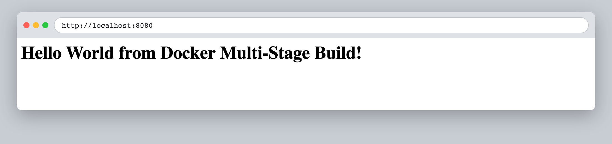
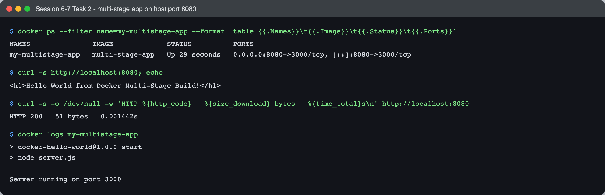
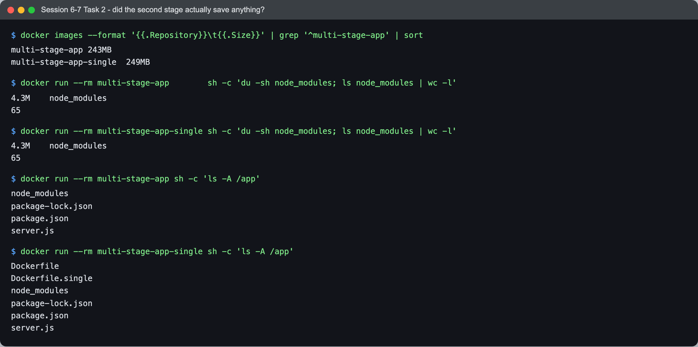
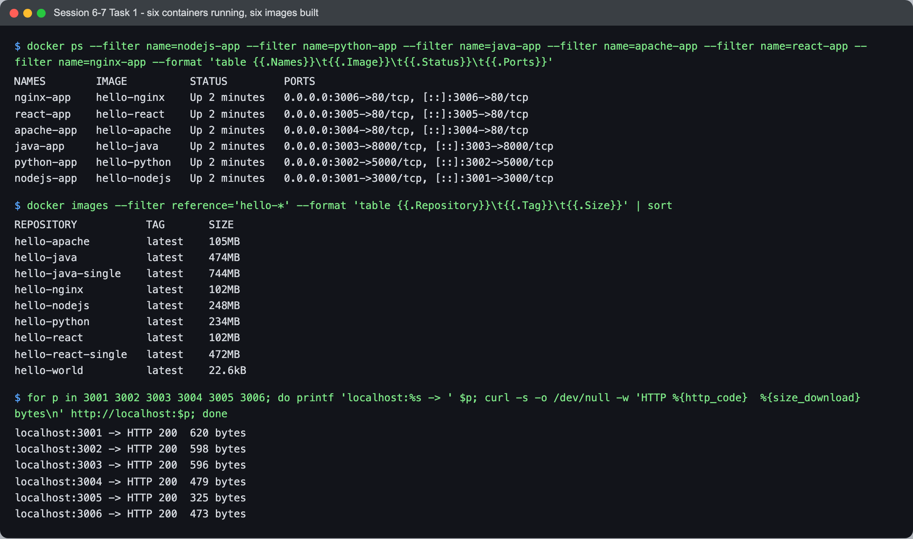
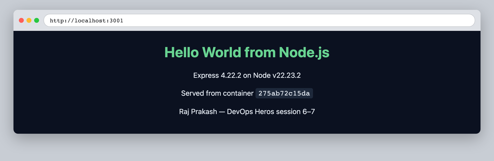
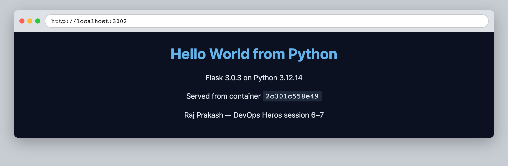
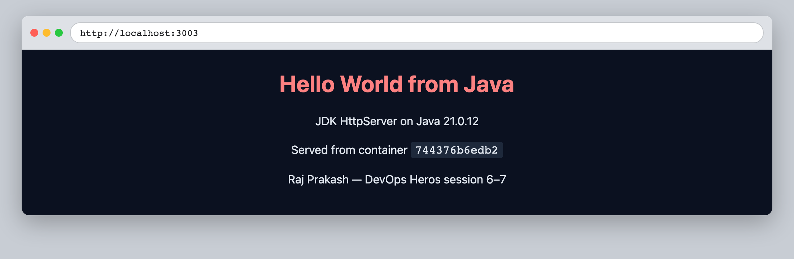

# Session 6–7 — Docker — Task 2: Multi-Stage Docker Build

- **Name:** Raj Prakash
- **Enrollment No:** 24BCS10328

> **Status:** done
>
> Docker Engine 29.6.2 (Docker Desktop) on macOS, Apple Silicon — `linux/arm64` images.

---

## What the task asked

Session 7 (Dockerfiles & Images) has three tasks:

1. **Run the multi-stage Dockerfile** — build the Express app in
   [`../multi-stage-dockerfile/`](../multi-stage-dockerfile/) with its multi-stage
   Dockerfile, run it with host port **8080** mapped to container port **3000**, and verify
   *Hello World from Docker multi-stage build* in the browser and the container in `docker ps`.
2. **Documentation** — this file: name, enrollment number, and output/screenshots of the app
   running and of `docker ps` showing port 8080.
3. **Deploy at least 3 different types of applications with Docker** (Node.js, Python, Java)
   — see [Task 3](#task-3-three-different-application-types) below.

## Steps

1. Moved into the app directory:

   ```bash
   cd session6-7-docker/multi-stage-dockerfile
   ```

2. Built the image from the two-stage Dockerfile (`builder` → `production`):

   ```bash
   docker build -t multi-stage-app .
   ```

3. Ran it with the required port mapping:

   ```bash
   docker run -d --name my-multistage-app -p 8080:3000 multi-stage-app
   ```

The Dockerfile's two stages:

```dockerfile
FROM node:24-alpine AS builder          # stage 1 - install everything
WORKDIR /app
COPY package*.json ./
RUN npm install
COPY . .

FROM node:24-alpine AS production       # stage 2 - a fresh, empty image
WORKDIR /app
COPY --from=builder /app/package*.json ./
RUN npm install --omit=dev              # production deps only
COPY --from=builder /app/server.js ./   # exactly one source file
EXPOSE 3000
CMD ["npm", "start"]
```

The important line is `COPY --from=builder`. Stage 2 starts from a clean `node:24-alpine`
and pulls across only what it is explicitly told to — two files. Everything else stage 1
produced is discarded when the build ends.

---

## Outputs & verification

### 1. Web output — `localhost:8080`



### 2. `docker ps` and terminal checks



```text
$ docker ps --filter name=my-multistage-app --format 'table {{.Names}}\t{{.Image}}\t{{.Status}}\t{{.Ports}}'
NAMES               IMAGE             STATUS          PORTS
my-multistage-app   multi-stage-app   Up 29 seconds   0.0.0.0:8080->3000/tcp, [::]:8080->3000/tcp

$ curl -s http://localhost:8080; echo
<h1>Hello World from Docker Multi-Stage Build!</h1>

$ curl -s -o /dev/null -w 'HTTP %{http_code}   %{size_download} bytes   %{time_total}s\n' http://localhost:8080
HTTP 200   51 bytes   0.001442s

$ docker logs my-multistage-app

> docker-hello-world@1.0.0 start
> node server.js

Server running on port 3000
```

`0.0.0.0:8080->3000/tcp` is the required mapping, confirmed from Docker's own side rather
than only from the browser. The container log shows the app reporting port **3000** — inside
the container it has no idea it is reachable on 8080. The translation happens entirely in
the host's network stack, and that asymmetry is the clearest illustration of what publishing
a port actually is.

---

## Did the multi-stage build actually save anything? — measured

I built a single-stage equivalent ([`Dockerfile.single`](../multi-stage-dockerfile/Dockerfile.single))
to have something to compare against. The result was **not** what I expected, and it is the
most useful thing in this task.



```text
$ docker images --format '{{.Repository}}\t{{.Size}}' | grep '^multi-stage-app' | sort
multi-stage-app	        243MB
multi-stage-app-single	249MB
```

**6 MB. About 2%.** Compare that with the React app in
[Task 1](../task/), where multi-stage cut 472 MB down to 102 MB — a 78% saving.

The reason is visible one command down:

```text
$ docker run --rm multi-stage-app        sh -c 'du -sh node_modules; ls node_modules | wc -l'
4.3M	node_modules
65

$ docker run --rm multi-stage-app-single sh -c 'du -sh node_modules; ls node_modules | wc -l'
4.3M	node_modules
65
```

**Identical.** The second stage runs `npm install --omit=dev` specifically to drop dev
dependencies — but this app's `package.json` has **no `devDependencies` at all**, only
`express`. So `--omit=dev` had nothing to omit, and the two images are near-identical by
construction.

That is the real lesson: **a multi-stage build saves exactly as much as there is build
tooling to throw away.** Here there is none, so the pattern costs a longer Dockerfile and a
second `npm install` and returns almost nothing. In the React app, `node_modules` and the
entire Node runtime were dead weight at runtime, and the saving was enormous. The pattern is
not automatically a win — it is a win *when the build needs things the runtime does not*.

### It did do one thing, though

```text
$ docker run --rm multi-stage-app sh -c 'ls -A /app'
node_modules
package-lock.json
package.json
server.js

$ docker run --rm multi-stage-app-single sh -c 'ls -A /app'
Dockerfile
Dockerfile.single      ← leaked into the image
node_modules
package-lock.json
package.json
server.js
```

The single-stage image contains **the Dockerfiles themselves**, because `COPY . .` copies
the entire build context and there is no `.dockerignore`. The multi-stage image does not,
because stage 2 named its two files explicitly.

That is a small leak here. In a real project the same `COPY . .` would pull in `.git/`,
`.env`, test fixtures, CI config and editor files — and `.git/` alone routinely carries
credentials in its history. So the multi-stage version is meaningfully *cleaner* even where
it is barely *smaller*, and the fix for the single-stage version is a `.dockerignore`, not
another stage.

---

## Task 3: Three different application types

I deployed this as part of the session 6 work, which asked for six runtimes in one go — so
Task 3 is covered by real builds and runs in [`../task/`](../task/README.md), not repeated
here. The three the task names, plus the other three:

| Folder | Runtime | Base image(s) | Container port | Host port | Image size |
|---|---|---|---|---|---|
| [`nodejs-app/`](../task/nodejs-app/) | **Node.js** + Express | `node:22-alpine` | 3000 | 3001 | 248 MB |
| [`python-app/`](../task/python-app/) | **Python** + Flask | `python:3.12-slim` | 5000 | 3002 | 234 MB |
| [`java-app/`](../task/java-app/) | **Java** (JDK `HttpServer`) | `eclipse-temurin:21-jdk` → `21-jre` | 8000 | 3003 | 474 MB |
| [`Apache-app/`](../task/Apache-app/) | Apache httpd | `httpd:2.4-alpine` | 80 | 3004 | 105 MB |
| [`React-app/`](../task/React-app/) | React (Vite) | `node:22-alpine` → `nginx:alpine` | 80 | 3005 | 102 MB |
| [`nginx-app/`](../task/nginx-app/) | Nginx | `nginx:alpine` | 80 | 3006 | 102 MB |

All six were running at once and answered over HTTP — from the
[session 6 verification](../task/README.md#verification):



```text
$ docker ps --format 'table {{.Names}}\t{{.Image}}\t{{.Status}}\t{{.Ports}}'
NAMES        IMAGE          STATUS         PORTS
nginx-app    hello-nginx    Up 2 minutes   0.0.0.0:3006->80/tcp, [::]:3006->80/tcp
react-app    hello-react    Up 2 minutes   0.0.0.0:3005->80/tcp, [::]:3005->80/tcp
apache-app   hello-apache   Up 2 minutes   0.0.0.0:3004->80/tcp, [::]:3004->80/tcp
java-app     hello-java     Up 2 minutes   0.0.0.0:3003->8000/tcp, [::]:3003->8000/tcp
python-app   hello-python   Up 2 minutes   0.0.0.0:3002->5000/tcp, [::]:3002->5000/tcp
nodejs-app   hello-nodejs   Up 2 minutes   0.0.0.0:3001->3000/tcp, [::]:3001->3000/tcp

$ for p in 3001 3002 3003 3004 3005 3006; do curl -s -o /dev/null -w 'HTTP %{http_code}  %{size_download} bytes\n' http://localhost:$p; done
localhost:3001 -> HTTP 200  620 bytes
localhost:3002 -> HTTP 200  598 bytes
localhost:3003 -> HTTP 200  596 bytes
localhost:3004 -> HTTP 200  479 bytes
localhost:3005 -> HTTP 200  325 bytes
localhost:3006 -> HTTP 200  473 bytes
```

The Node.js, Python and Java pages, each served from its own container:

| Node.js — `localhost:3001` | Python — `localhost:3002` | Java — `localhost:3003` |
|---|---|---|
|  |  |  |

The three runtimes package very differently, which is the useful comparison for this session:
Node and Python ship an interpreter plus dependencies in one stage, while Java uses a
multi-stage build — compile with the full JDK, then copy only the compiled classes onto a
JRE image, which is why its Dockerfile has two `FROM` lines.

---

## What I learned

- **The port a container logs is not the port you connect to.** `Server running on port
  3000` while the browser is on 8080 makes the host↔container boundary concrete.
- **`COPY --from=<stage>` is an allowlist.** Nothing crosses a stage boundary unless it is
  named. That is what makes the pattern work, and also why the final image here had no
  Dockerfiles in it.
- **Multi-stage is not free and not always worth it.** Measuring gave 2% here and 78% in
  Task 1. I would not have believed the 2% number without running it, and I would have
  written the opposite in this file.
- **`COPY . .` without a `.dockerignore` is a real problem**, independent of image size.
- **`docker history` shows where the megabytes are.** The `npm install --omit=dev` layer is
  9.45 MB; the other 233 MB is the `node:24-alpine` base. For small apps the base image
  dominates completely, which caps how much any Dockerfile change can achieve.

## Problems I hit

- **I assumed the multi-stage build would win big and nearly wrote that down before
  measuring.** It saved 6 MB. Checking `du -sh node_modules` in both images was what
  explained it — no `devDependencies`, so `--omit=dev` was a no-op. The interesting result
  came from the check I almost skipped.
- **Finding the Dockerfiles inside the single-stage image was an accident.** I ran
  `ls -A /app` in both images only to compare `node_modules`, and the extra entries in the
  single-stage listing were what pointed at the missing `.dockerignore`. The size comparison
  I set out to make turned out to be the less interesting of the two results.
- **Inspecting an image needs `sh -c`, not a bare command.** This image's `CMD` is
  `npm start`; `docker run --rm multi-stage-app ls -A /app` replaces the whole command rather
  than running inside the app, so `sh -c 'ls -A /app'` is the form that reliably gives you a
  shell in the image you want to look at.
