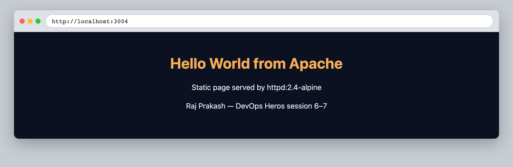
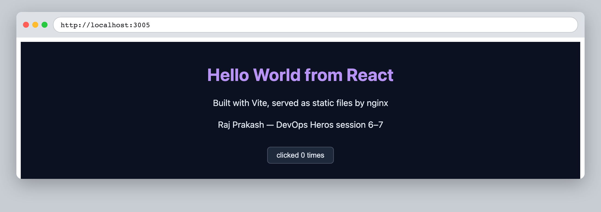
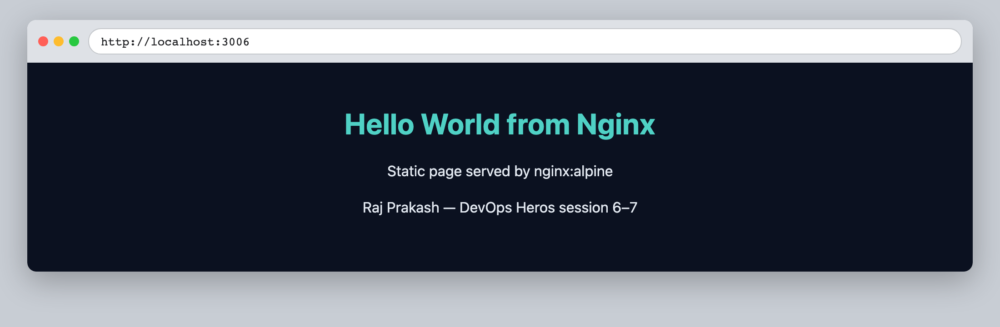
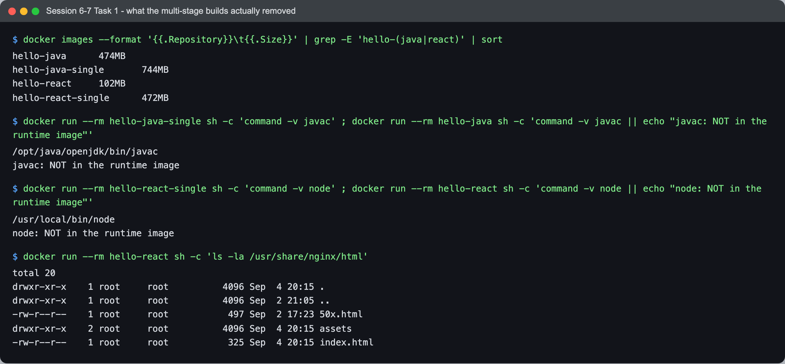

# Session 6–7 — Docker — Task 1: Hello World Applications

- **Name:** Raj Prakash
- **Enrollment No:** _(your enrollment number)_

> **Status:** done
>
> Docker Engine 29.6.2 (Docker Desktop) on macOS, Apple Silicon — so every image below is
> `linux/arm64`. Sizes on an `amd64` machine will differ a little.

---

## What the task asked

Containerise a set of simple "Hello World" web applications, one per runtime, and verify
each one actually serves over HTTP from its container.

## Applications built

| Folder | Runtime | Base image(s) | Container port | Host port | Image size |
|---|---|---|---|---|---|
| [`nodejs-app/`](nodejs-app/) | Node.js + Express | `node:22-alpine` | 3000 | 3001 | 248 MB |
| [`python-app/`](python-app/) | Python + Flask | `python:3.12-slim` | 5000 | 3002 | 234 MB |
| [`java-app/`](java-app/) | JDK `HttpServer` | `eclipse-temurin:21-jdk` → `21-jre` | 8000 | 3003 | 474 MB |
| [`Apache-app/`](Apache-app/) | Apache httpd | `httpd:2.4-alpine` | 80 | 3004 | 105 MB |
| [`React-app/`](React-app/) | React (Vite) | `node:22-alpine` → `nginx:alpine` | 80 | 3005 | 102 MB |
| [`nginx-app/`](nginx-app/) | Nginx | `nginx:alpine` | 80 | 3006 | 102 MB |

Two of them use a **multi-stage build** deliberately — `java-app` (compile with the JDK,
ship only the JRE) and `React-app` (build the bundle with Node, ship only static files on
Nginx). The measured effect of that is at the bottom of this file.

## How to build and run

```bash
cd <app-folder>
docker build -t <image-name> .
docker run -d --name <container-name> -p <host-port>:<container-port> <image-name>
```

All six, from this directory:

```bash
docker build -t hello-nodejs nodejs-app && docker run -d --name nodejs-app -p 3001:3000 hello-nodejs
docker build -t hello-python python-app && docker run -d --name python-app -p 3002:5000 hello-python
docker build -t hello-java   java-app   && docker run -d --name java-app   -p 3003:8000 hello-java
docker build -t hello-apache Apache-app && docker run -d --name apache-app -p 3004:80   hello-apache
docker build -t hello-react  React-app  && docker run -d --name react-app  -p 3005:80   hello-react
docker build -t hello-nginx  nginx-app  && docker run -d --name nginx-app  -p 3006:80   hello-nginx
```

The host ports are deliberately all different — you cannot bind two containers to the same
host port, and three of these apps listen on port 80 inside their own container. That is the
whole point of `-p host:container`: the left number has to be unique on the host, the right
number is whatever the app inside chose.

---

## Verification

All six answered. Each screenshot is the live page from the running container, with the URL
bar showing the port it was fetched from.

### Node.js — `localhost:3001`


### Python / Flask — `localhost:3002`


### Java — `localhost:3003`


### Apache — `localhost:3004`


### React — `localhost:3005`


The click counter is there on purpose: it only increments if React actually mounted and is
handling events, which is proof the bundle really was built rather than a static page that
merely says "React".

### Nginx — `localhost:3006`


### Terminal proof


```text
$ docker ps --format 'table {{.Names}}\t{{.Image}}\t{{.Status}}\t{{.Ports}}'
NAMES        IMAGE          STATUS         PORTS
nginx-app    hello-nginx    Up 2 minutes   0.0.0.0:3006->80/tcp, [::]:3006->80/tcp
react-app    hello-react    Up 2 minutes   0.0.0.0:3005->80/tcp, [::]:3005->80/tcp
apache-app   hello-apache   Up 2 minutes   0.0.0.0:3004->80/tcp, [::]:3004->80/tcp
java-app     hello-java     Up 2 minutes   0.0.0.0:3003->8000/tcp, [::]:3003->8000/tcp
python-app   hello-python   Up 2 minutes   0.0.0.0:3002->5000/tcp, [::]:3002->5000/tcp
nodejs-app   hello-nodejs   Up 2 minutes   0.0.0.0:3001->3000/tcp, [::]:3001->3000/tcp

$ for p in 3001 3002 3003 3004 3005 3006; do curl -s -o /dev/null -w 'HTTP %{http_code}  %{size_download} bytes\n' http://localhost:$p; done
localhost:3001 -> HTTP 200  620 bytes
localhost:3002 -> HTTP 200  598 bytes
localhost:3003 -> HTTP 200  596 bytes
localhost:3004 -> HTTP 200  479 bytes
localhost:3005 -> HTTP 200  325 bytes
localhost:3006 -> HTTP 200  473 bytes
```

Six `HTTP 200`s with non-zero body sizes. `docker ps` showing `Up` only means the process
has not exited — a container can be `Up` and serving nothing at all, so the curl loop is the
check that matters.

Note `0.0.0.0:3006->80/tcp` and `[::]:3006->80/tcp` — Docker published each port on both
IPv4 and IPv6.

---

## Proving the multi-stage builds actually dropped the build tooling

Claiming a multi-stage build "makes the image smaller" is easy. I built single-stage
versions of the same two apps ([`java-app/Dockerfile.single`](java-app/Dockerfile.single),
[`React-app/Dockerfile.single`](React-app/Dockerfile.single)) so there is a number to
compare against.



```text
$ docker images --format '{{.Repository}}\t{{.Size}}' | grep -E 'hello-(java|react)' | sort
hello-java	        474MB
hello-java-single	744MB
hello-react	        102MB
hello-react-single	472MB
```

| App | Single-stage | Multi-stage | Saved |
|---|---|---|---|
| Java | 744 MB | **474 MB** | 270 MB (**36%**) |
| React | 472 MB | **102 MB** | 370 MB (**78%**) |

And the tooling is genuinely gone, not just unreferenced:

```text
$ docker run --rm hello-java-single sh -c 'command -v javac'
/opt/java/openjdk/bin/javac
$ docker run --rm hello-java        sh -c 'command -v javac || echo "javac: NOT in the runtime image"'
javac: NOT in the runtime image

$ docker run --rm hello-react-single sh -c 'command -v node'
/usr/local/bin/node
$ docker run --rm hello-react        sh -c 'command -v node || echo "node: NOT in the runtime image"'
node: NOT in the runtime image

$ docker run --rm hello-react sh -c 'ls -la /usr/share/nginx/html'
-rw-r--r--    1 root root  497 50x.html
drwxr-xr-x    2 root root 4096 assets
-rw-r--r--    1 root root  325 index.html
```

The React runtime image contains an `index.html` and an `assets/` folder. That is all. No
`node`, no `npm`, no `node_modules` — nothing that built it survived into it.

The React saving is much larger than the Java one because `node_modules` plus the Node
runtime is nearly the entire single-stage image, while the JRE the Java app still needs is
most of the JDK's size. **A multi-stage build removes the build tooling, not the runtime.**

This is a security argument as much as a size one: a compiler and a package manager in a
production image are tools an attacker who gets a shell can use.

---

## What I learned

- **`-p 3001:3000` is host:container, and only the left side has to be unique.** Three of
  these apps listen on port 80 internally and coexist fine, which makes the mapping's
  direction concrete in a way reading the docs did not.
- **Copy the manifest before the source.** `COPY package.json` → `RUN npm install` →
  `COPY index.js` means editing the app re-runs only the last layer. Copying everything
  first would re-install dependencies on every source edit.
- **`Up` is not "working".** `docker ps` reports the process, not the service. A curl is one
  extra command and it is the difference between assuming and knowing.
- **Multi-stage builds are the default for anything compiled or bundled.** The 78% figure on
  React is not a micro-optimisation — it is the difference between a 472 MB and a 102 MB
  pull on every deploy.
- **Alpine bases are dramatically smaller** (`nginx:alpine` 102 MB vs the Debian-based
  `python:3.12-slim` at 234 MB) but they use musl instead of glibc, which breaks some
  pre-built Python wheels and native Node modules. Worth knowing before reaching for it.

## Problems I hit

- **A build loop failed on every image with `invalid reference format`.** I had written the
  six builds as a loop over strings like `"hello-nodejs nodejs-app"` with `set -- $a` to
  split each pair. That is a bash idiom — **zsh does not word-split unquoted variables**, so
  the tag and the build path arrived as a single argument and Docker rejected the tag
  `hello-nodejs nodejs-app`. Writing the six builds out in full was quicker than fixing the
  loop, but the failure mode is worth remembering: the same script behaves differently under
  bash and zsh with no warning.
- **`COPY` order matters more than it looks.** Each Dockerfile copies the manifest, installs,
  and only then copies the source. Getting that backwards still builds correctly — it just
  reinstalls every dependency on each source edit, which is a slow build rather than a
  broken one, so nothing tells you it is wrong.
- **Everything here is `linux/arm64`.** On Apple Silicon that is native and fast, but an
  image built here will not run on an x86 server without `docker buildx --platform`. Worth
  remembering before pushing anything from this machine to a registry.
