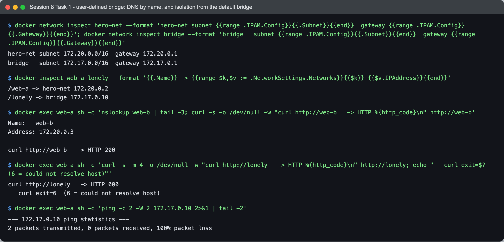
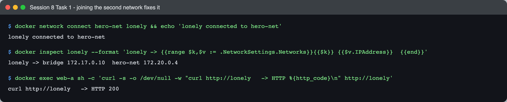
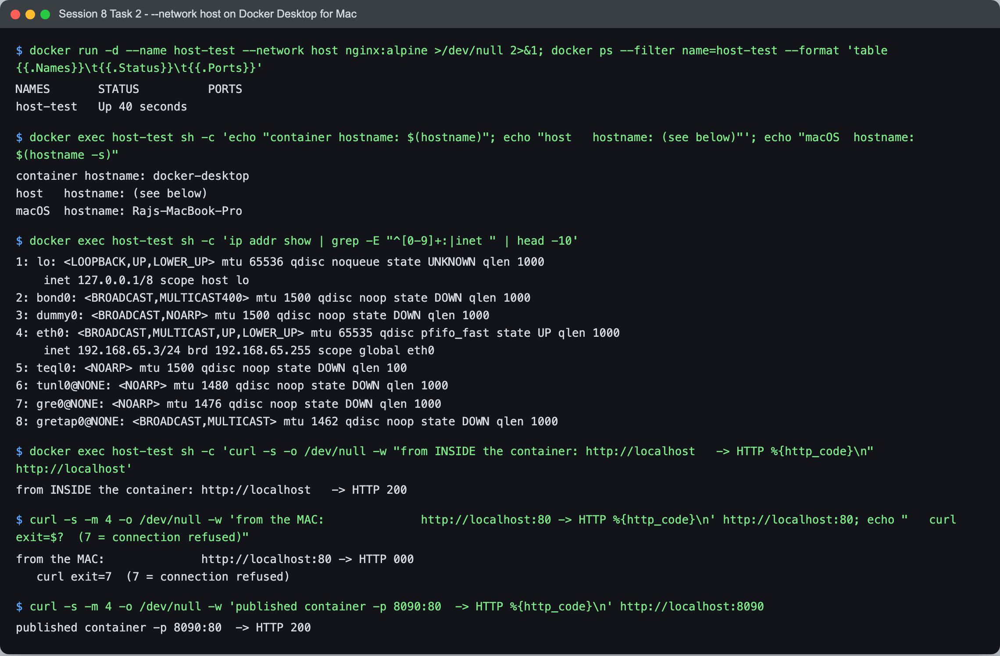
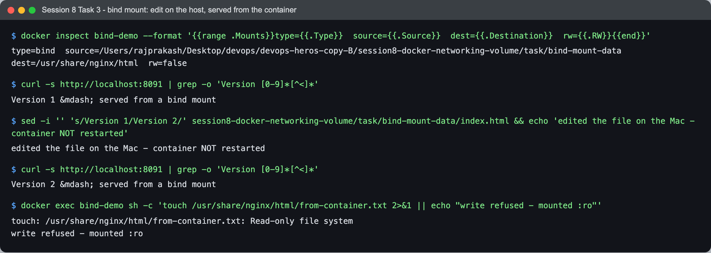
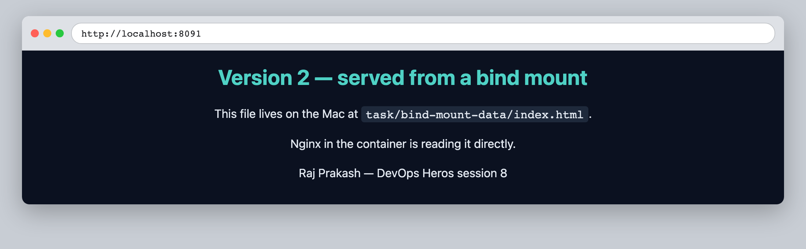
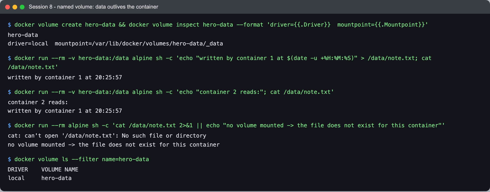

# Session 8 — Docker Networking & Volumes — Tasks

- **Name:** Raj Prakash
- **Enrollment No:** 24BCS10328

> **Status:** done
>
> Docker Engine 29.6.2 (Docker Desktop) on macOS, Apple Silicon. Task 2 behaves differently
> here than it would on native Linux, and that difference is written up rather than hidden —
> it is the most useful thing in this session.

---

## Task 1: Container networking and isolation

### What the task asked

Create a user-defined network, put containers on it, and show what containers on different
networks can and cannot do to each other.

### Setup

```bash
docker network create hero-net

docker run -d --name web-a --network hero-net nginx:alpine
docker run -d --name web-b --network hero-net nginx:alpine
docker run -d --name lonely                   nginx:alpine   # default bridge
```

Three identical containers. Two on a user-defined network, one left on the default `bridge`.

### Connectivity results



```text
$ docker network inspect hero-net --format '...'
hero-net subnet 172.20.0.0/16  gateway 172.20.0.1
bridge   subnet 172.17.0.0/16  gateway 172.17.0.1

$ docker inspect web-a lonely --format '{{.Name}} -> ...'
/web-a  -> hero-net 172.20.0.2
/lonely -> bridge   172.17.0.10
```

Two separate subnets. Now, from inside `web-a`:

```text
$ docker exec web-a sh -c 'nslookup web-b | tail -3; curl ... http://web-b'
Name:	web-b
Address: 172.20.0.3

curl http://web-b   -> HTTP 200
```

**`web-b` resolves by name.** Docker runs an embedded DNS server at `127.0.0.11` inside
every container on a user-defined network, and it resolves container names to their current
IP. Nothing was configured to make that work — it comes with `docker network create`.

```text
$ docker exec web-a sh -c 'curl -m 4 ... http://lonely; echo "curl exit=$?"'
curl http://lonely   -> HTTP 000
   curl exit=6  (6 = could not resolve host)

$ docker exec web-a sh -c 'ping -c 2 -W 2 172.17.0.10'
--- 172.17.0.10 ping statistics ---
2 packets transmitted, 0 packets received, 100% packet loss
```

Two separate failures, and the distinction matters:

- **By name: exit code 6, "could not resolve host".** The DNS server on `hero-net` has no
  record for `lonely` — it only knows containers attached to its own network. The request
  never became a packet.
- **By IP: 100% packet loss.** Even bypassing DNS entirely and aiming straight at
  `172.17.0.10`, nothing arrives. The two bridges are separate L2 segments and Docker's
  default `iptables` rules do not forward between them.

So the isolation is real at both layers, not just a naming convenience. **A user-defined
network is a security boundary**, which is why "just put the database on its own network" is
meaningful advice rather than tidiness.

### Fixing it — a container can be on several networks



```text
$ docker network connect hero-net lonely
lonely connected to hero-net

$ docker inspect lonely --format '...'
lonely -> bridge 172.17.0.10   hero-net 172.20.0.4

$ docker exec web-a sh -c 'curl ... http://lonely'
curl http://lonely   -> HTTP 200
```

`lonely` now holds **two IP addresses, one per network**, and is reachable by name. No
restart was needed — `docker network connect` attaches a new interface to a running
container.

This is how you build a tiered setup: a frontend on both a public network and an internal
one, a database on the internal one only. The database is then unreachable from anywhere
except the containers explicitly placed beside it.

### Default bridge vs user-defined bridge

| | default `bridge` | user-defined (`hero-net`) |
|---|---|---|
| DNS by container name | **no** | **yes** |
| Isolation from other networks | shared by all unnetworked containers | isolated |
| Attach/detach while running | no | yes (`network connect/disconnect`) |
| Recommended | legacy | **yes** |

---

## Task 2: Host network

### What the task asked

Run a container with `--network host` and see what changes.

### Commands

```bash
docker run -d --name host-test --network host nginx:alpine
docker run -d --name published-test -p 8090:80 nginx:alpine   # for comparison
```

### Result — and a platform difference worth documenting



```text
$ docker ps --filter name=host-test --format 'table {{.Names}}\t{{.Status}}\t{{.Ports}}'
NAMES       STATUS          PORTS
host-test   Up 40 seconds
```

The **`PORTS` column is empty**. That part is correct and expected everywhere: with
`--network host` there is no port mapping, because there is no separate network namespace to
map out of. The container's ports *are* the host's ports.

Then it stops matching the documentation:

```text
$ docker exec host-test sh -c 'echo "container hostname: $(hostname)"'
container hostname: docker-desktop
$ hostname -s
macOS  hostname: Rajs-MacBook-Pro

$ docker exec host-test sh -c 'ip addr show | grep -E "^[0-9]+:|inet "'
1: lo: <LOOPBACK,UP,LOWER_UP> mtu 65536
    inet 127.0.0.1/8 scope host lo
4: eth0: <BROADCAST,MULTICAST,UP,LOWER_UP> mtu 65535 qdisc pfifo_fast state UP
    inet 192.168.65.3/24 brd 192.168.65.255 scope global eth0
```

The container thinks it is on a host called **`docker-desktop`** with address
**`192.168.65.3`**. My Mac is called `Rajs-MacBook-Pro` and sits on `10.64.76.183`
(see [session 4](../../session4-networking/task/)). Those are not the same machine.

And the consequence:

```text
$ docker exec host-test sh -c 'curl ... http://localhost'
from INSIDE the container: http://localhost   -> HTTP 200

$ curl -m 4 ... http://localhost:80
from the MAC:              http://localhost:80 -> HTTP 000
   curl exit=7  (7 = connection refused)

$ curl -m 4 ... http://localhost:8090
published container -p 8090:80  -> HTTP 200
```

**nginx is running and serving perfectly — and my Mac cannot reach it.** Meanwhile the
ordinary container with `-p 8090:80` answers immediately.

The explanation: Docker Desktop on macOS runs the Linux engine inside a **LinuxKit VM**.
`--network host` means "share the network namespace of the host the daemon runs on", and
that host is the **VM**, not macOS. So the container genuinely got host networking — of a
machine that is not mine. The macOS `localhost` has no route into it, because the port was
never published across the VM boundary.

On native Linux there is no VM, `--network host` gives you the actual machine's namespace,
and `curl localhost:80` would work.

**The lesson:** `--network host` is a Linux-only optimisation. It removes the NAT hop (worth
having for something latency-sensitive or a service that needs to see real client IPs), but
it also removes the isolation *and* portability. A compose file relying on it works on a
Linux CI runner and silently fails for every developer on a Mac. `-p` is the portable
choice.

---

## Task 3: Bind mount

### What the task asked

Mount a directory from the host into a container and show the container reading it.

### Commands

```bash
docker run -d --name bind-demo -p 8091:80 \
  -v "$PWD/session8-docker-networking-volume/task/bind-mount-data:/usr/share/nginx/html:ro" \
  nginx:alpine
```

The mounted directory is [`bind-mount-data/`](bind-mount-data/), committed alongside this
write-up. `:ro` makes it read-only inside the container.

### Verification



```text
$ docker inspect bind-demo --format '{{range .Mounts}}...{{end}}'
type=bind  source=/Users/rajprakash/.../task/bind-mount-data  dest=/usr/share/nginx/html  rw=false

$ curl -s http://localhost:8091 | grep -o 'Version [0-9]*[^<]*'
Version 1 — served from a bind mount

$ sed -i '' 's/Version 1/Version 2/' .../bind-mount-data/index.html
edited the file on the Mac - container NOT restarted

$ curl -s http://localhost:8091 | grep -o 'Version [0-9]*[^<]*'
Version 2 — served from a bind mount
```

**The page changed with no rebuild and no restart.** The container is not holding a copy; it
is reading the same inode the editor wrote to. That is what makes bind mounts the standard
way to get live reload in development — the image never has to be rebuilt to see a source
edit.



And `:ro` is enforced by the kernel, not by convention:

```text
$ docker exec bind-demo sh -c 'touch /usr/share/nginx/html/from-container.txt'
touch: /usr/share/nginx/html/from-container.txt: Read-only file system
write refused - mounted :ro
```

Worth doing whenever the container has no business writing: a compromised container cannot
modify source files it can only read.

### Named volumes — the other kind of storage



```text
$ docker volume create hero-data && docker volume inspect hero-data --format '...'
driver=local  mountpoint=/var/lib/docker/volumes/hero-data/_data

$ docker run --rm -v hero-data:/data alpine sh -c 'echo "written by container 1 at $(date -u +%H:%M:%S)" > /data/note.txt; cat /data/note.txt'
written by container 1 at 20:25:57

$ docker run --rm -v hero-data:/data alpine sh -c 'echo "container 2 reads:"; cat /data/note.txt'
container 2 reads:
written by container 1 at 20:25:57

$ docker run --rm alpine sh -c 'cat /data/note.txt || echo "no volume mounted -> ..."'
cat: can't open '/data/note.txt': No such file or directory
no volume mounted -> the file does not exist for this container
```

Container 1 wrote the file **and was deleted** (`--rm`). Container 2, a completely different
container, read it back. A third container with no volume saw nothing. The data belongs to
the volume, not to any container.

Note the mountpoint: `/var/lib/docker/volumes/hero-data/_data`. On macOS that path is
**inside the VM** — it does not exist on my Mac, and `ls` on the Mac will not find it. That
is the practical difference between the two:

| | Bind mount | Named volume |
|---|---|---|
| Where the data lives | a path you choose on the host | Docker's own area, managed for you |
| Visible in Finder / `ls` on the Mac | **yes** | no (inside the VM) |
| Host path must exist first | yes | no, created on demand |
| Performance on macOS | slower (crosses the VM boundary) | faster (native to the VM) |
| Best for | source code in development | databases, uploads, anything stateful |

---

## Task 4: Overlay network — research

### What an overlay network is

A network driver that lets containers **on different Docker hosts** talk to each other as if
they were on one LAN. The bridge networks in Task 1 stop at the edge of a single machine; an
overlay spans a cluster.

### How it works

1. **Encapsulation (VXLAN).** A container's Ethernet frame is wrapped inside a UDP packet
   (port 4789) and sent to the node hosting the destination container, which unwraps it. The
   containers see a flat L2 network; the physical network only ever sees ordinary UDP between
   hosts.
2. **A distributed control plane.** Swarm nodes gossip about which container sits on which
   node and with which MAC/IP, so encapsulation knows where to send each frame.
3. **A network-scoped IPAM.** Addresses are allocated cluster-wide, so no two containers on
   the overlay collide — unlike bridge networks, where every host independently hands out
   `172.17.0.x`.
4. **Optional encryption.** `--opt encrypted` puts IPsec around the VXLAN tunnels, which
   matters when the underlying network is not trusted.

The "overlay/underlay" naming is literal: the container network is a virtual layer *laid
over* the physical one, which does not know it exists.

### Main use cases

- **Multi-host service discovery.** In Swarm, a service name resolves to a virtual IP that
  load-balances across every replica, wherever they run.
- **Scaling past one machine** without rewriting anything — the same `curl http://api` works
  whether `api` is on this node or another.
- **Segmentation across a cluster**, the multi-host version of Task 1: put the database
  overlay behind the application overlay and nothing else in the cluster can reach it.
- Kubernetes solves the same problem with CNI plugins (Flannel's VXLAN backend, Calico,
  Cilium) rather than Docker's overlay driver — same idea, different implementation.

### How it relates to Task 1

Task 1's isolation and DNS are exactly what an overlay provides, minus the single-machine
limit:

| | bridge (Task 1) | overlay |
|---|---|---|
| Scope | one host | a cluster |
| DNS by container name | yes | yes, cluster-wide |
| Isolation between networks | yes | yes |
| Needs a cluster | no | yes (Swarm / a KV store) |
| Traffic on the wire | veth pairs and `iptables` | VXLAN-encapsulated UDP:4789 |

I did not run an overlay demo — it needs at least two Docker hosts in a Swarm and I have one
machine, so anything I could produce locally would be a single-node Swarm that does not
actually demonstrate the multi-host behaviour that is the entire point.

---

## What I learned overall

- **"Cannot resolve" and "no route" are different failures**, and the exit code tells you
  which. Exit 6 sent me to DNS; 100% packet loss to routing. Reading the failure precisely
  is faster than guessing.
- **Container names are DNS records** on a user-defined network, and they follow the
  container when its IP changes. Hardcoding a container IP is never necessary.
- **A container can hold several networks at once**, which is what makes tiered isolation
  practical rather than a diagram.
- **`--network host` on macOS is a trap** — the container works, the daemon reports success,
  and the service is unreachable. Nothing prints an error. The only way to catch it is to
  actually curl the thing.
- **Bind mount vs named volume is a real decision**, not two syntaxes for one feature. One
  is a window onto the host filesystem; the other is storage Docker owns and that outlives
  every container that touches it.

## Problems I hit

- **My first isolation test used the wrong IP.** I pinged `172.17.0.4` when `lonely` was
  actually at `172.17.0.10`, so the 100% packet loss proved nothing — an unused address does
  not reply either. `docker inspect --format '{{.NetworkSettings.Networks}}'` gave the real
  address and made the retest meaningful. A negative result is only evidence if you aimed at
  the right target.
- **`--network host` looked like a broken container for a while.** `docker ps` said `Up`,
  the logs were clean, and `curl localhost` from the Mac was refused. Running curl *inside*
  the container is what separated "nginx is broken" from "nginx is fine and I cannot reach
  it", and `hostname` returning `docker-desktop` was the clue that explained the whole thing.
- **`ip -br a` is not in `nginx:alpine`.** BusyBox provides a cut-down `ip` without `-br`,
  and it prints its usage text instead of an error, which looks like a broken command rather
  than an unsupported flag. `ip addr show | grep` worked.
