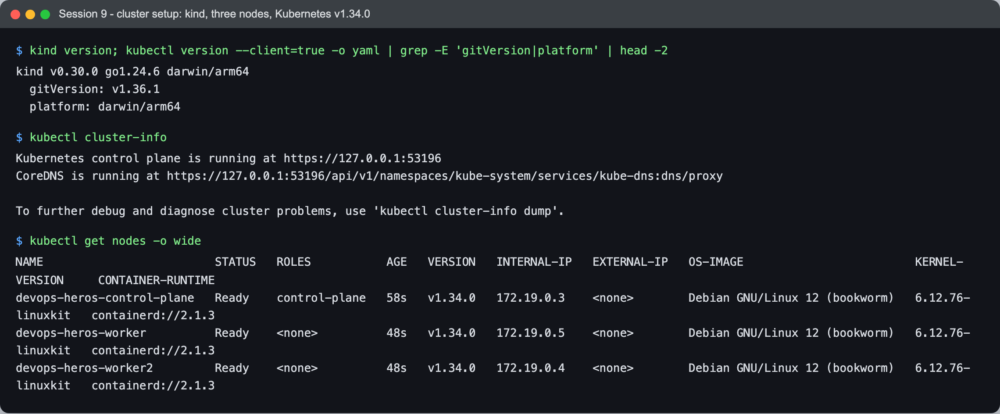
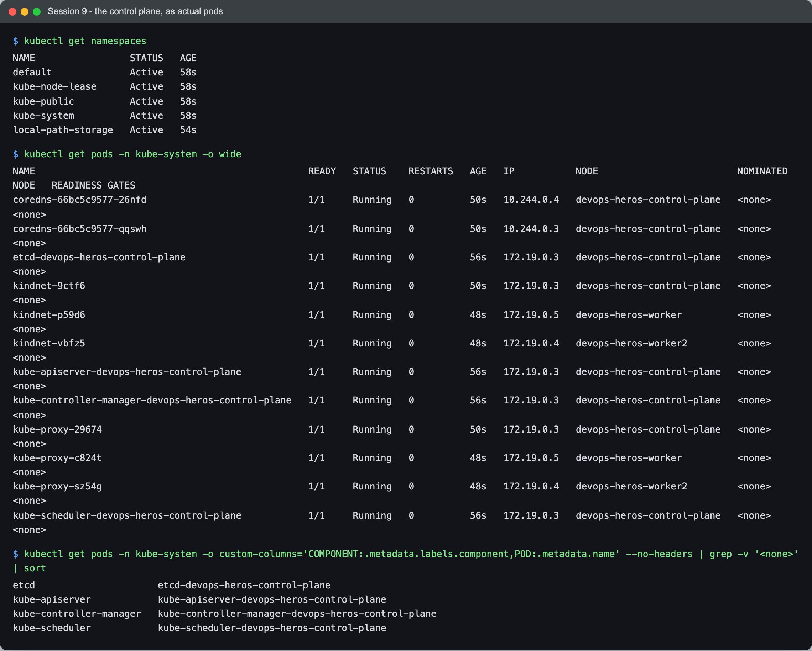
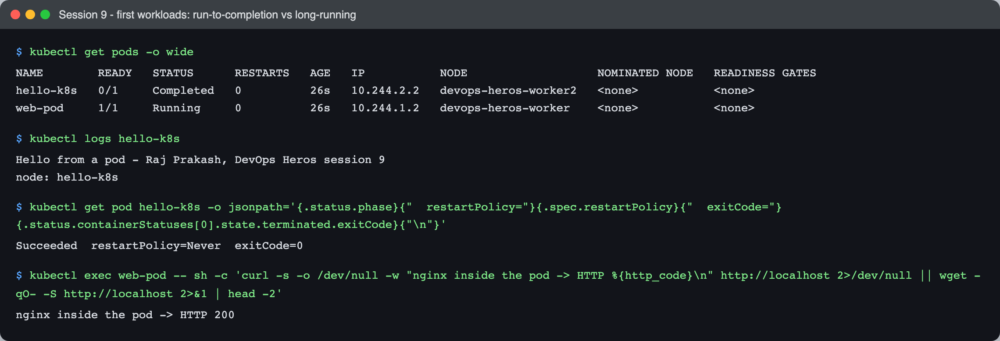

# Session 9 — Kubernetes — Task

- **Name:** Raj Prakash
- **Enrollment No:** _(your enrollment number)_

> **Status:** done
>
> Cluster: **kind v0.30.0**, Kubernetes **v1.34.0**, three nodes, running on Docker Desktop
> on macOS (Apple Silicon).

---

## What the task asked

[`../Readme.md`](../Readme.md) gives resource links rather than a written task, so I took the
scope from them — the Kubernetes Basics tutorial and the cluster **architecture** docs. So
the task here is: get a real cluster running, find the control-plane components inside it,
and run a first workload.

The core objects themselves are covered separately in
[session 10](../../session10-k8s-core-objects/task/).

## Cluster setup

The session notes suggest minikube. I used **kind** instead, which
[SETUP.md](../../SETUP.md) lists as the other option — it runs each Kubernetes node as a
Docker container rather than a VM, so it starts in about 30 seconds and, more importantly,
**multi-node clusters are one line of config**. That matters for session 10: a DaemonSet on
a single-node cluster creates exactly one pod and demonstrates nothing.

[`kind-cluster.yaml`](kind-cluster.yaml):

```yaml
kind: Cluster
apiVersion: kind.x-k8s.io/v1alpha4
name: devops-heros
nodes:
  - role: control-plane
  - role: worker
  - role: worker
```

```bash
kind create cluster --config kind-cluster.yaml
kubectl config use-context kind-devops-heros
```



```text
$ kind version
kind v0.30.0 go1.24.6 darwin/arm64

$ kubectl cluster-info
Kubernetes control plane is running at https://127.0.0.1:53196
CoreDNS is running at https://127.0.0.1:53196/api/v1/namespaces/kube-system/services/kube-dns:dns/proxy

$ kubectl get nodes -o wide
NAME                         STATUS   ROLES           AGE   VERSION   INTERNAL-IP   OS-IMAGE                         CONTAINER-RUNTIME
devops-heros-control-plane   Ready    control-plane   58s   v1.34.0   172.19.0.3    Debian GNU/Linux 12 (bookworm)   containerd://2.1.3
devops-heros-worker          Ready    <none>          48s   v1.34.0   172.19.0.5    Debian GNU/Linux 12 (bookworm)   containerd://2.1.3
devops-heros-worker2         Ready    <none>          48s   v1.34.0   172.19.0.4    Debian GNU/Linux 12 (bookworm)   containerd://2.1.3
```

Things worth reading off this:

- The API server is on **`127.0.0.1:53196`** — a random high port on my Mac, forwarded into
  the control-plane container. That is kind's doing; on a real cluster this would be 6443 on
  a routable address.
- The nodes' internal IPs are `172.19.0.x` — an ordinary **Docker bridge network**. These
  "nodes" are containers on my laptop, which is exactly how kind works: a container running
  containerd, running more containers.
- **`CONTAINER-RUNTIME: containerd`**, not Docker. Kubernetes removed the Docker shim in
  v1.24; it talks to containerd through CRI directly. Docker is still how the *nodes* exist,
  but it is not what runs the pods inside them.
- `ROLES <none>` for the workers is normal — a worker is simply a node with no control-plane
  role label, not a node with a "worker" label.

## Cluster architecture

### Namespaces

```text
$ kubectl get namespaces
NAME                 STATUS   AGE
default              Active   58s
kube-node-lease      Active   58s
kube-public          Active   58s
kube-system          Active   58s
local-path-storage   Active   54s
```

- **`default`** — where your things go if you do not say otherwise.
- **`kube-system`** — Kubernetes' own components. Everything below lives here.
- **`kube-node-lease`** — one small Lease object per node, updated a few times a minute. This
  is the node heartbeat: replacing full status updates with tiny lease renewals is what lets
  the control plane track thousands of nodes cheaply.
- **`kube-public`** — world-readable, including unauthenticated clients. Holds cluster info
  needed during bootstrap.
- **`local-path-storage`** — added by kind, the provisioner backing its default StorageClass.

### The control plane, as actual pods

This is the part worth doing rather than reading about — the architecture diagram from the
docs is not an abstraction, the components are running pods you can list:



```text
$ kubectl get pods -n kube-system -o wide
NAME                                                 READY   STATUS    RESTARTS   AGE   IP           NODE
coredns-66bc5c9577-26nfd                             1/1     Running   0          50s   10.244.0.4   devops-heros-control-plane
coredns-66bc5c9577-qqswh                             1/1     Running   0          50s   10.244.0.3   devops-heros-control-plane
etcd-devops-heros-control-plane                      1/1     Running   0          56s   172.19.0.3   devops-heros-control-plane
kindnet-9ctf6                                        1/1     Running   0          50s   172.19.0.3   devops-heros-control-plane
kindnet-p59d6                                        1/1     Running   0          48s   172.19.0.5   devops-heros-worker
kindnet-vbfz5                                        1/1     Running   0          48s   172.19.0.4   devops-heros-worker2
kube-apiserver-devops-heros-control-plane            1/1     Running   0          56s   172.19.0.3   devops-heros-control-plane
kube-controller-manager-devops-heros-control-plane   1/1     Running   0          56s   172.19.0.3   devops-heros-control-plane
kube-proxy-29674                                     1/1     Running   0          50s   172.19.0.3   devops-heros-control-plane
kube-proxy-c824t                                     1/1     Running   0          48s   172.19.0.5   devops-heros-worker
kube-proxy-sz54g                                     1/1     Running   0          48s   172.19.0.4   devops-heros-worker2
kube-scheduler-devops-heros-control-plane            1/1     Running   0          56s   172.19.0.3   devops-heros-control-plane
```

| Component | What it does | Where it runs |
|---|---|---|
| **etcd** | The only stateful thing here. Every object in the cluster is a key in etcd; everything else is stateless and can be restarted freely. | control plane only |
| **kube-apiserver** | The single door to etcd. Nothing else talks to etcd directly — `kubectl`, the scheduler, the kubelets all go through the API server, which is why RBAC and admission control work at all. | control plane only |
| **kube-scheduler** | Watches for pods with no `nodeName` and picks one, on resources, taints, affinity. It only *writes the decision*; it does not start anything. | control plane only |
| **kube-controller-manager** | The reconciliation loops — Deployment, ReplicaSet, Node, endpoints. "Actual state ≠ desired state → act." | control plane only |
| **coredns** | Cluster DNS. Turns `my-svc.my-ns.svc.cluster.local` into a Service IP. | scheduled like any pod |
| **kube-proxy** | Programs iptables/IPVS on each node so Service IPs route to pod IPs. | **every node** |
| **kindnet** | kind's CNI plugin — pod networking. Would be Calico/Flannel/Cilium elsewhere. | **every node** |

Two patterns are visible in that list without being told about them:

- The four components suffixed **`-devops-heros-control-plane`** are static pods: the
  kubelet reads their manifests from `/etc/kubernetes/manifests` on disk and starts them
  directly. That is the bootstrap answer to "how does the API server start if starting things
  requires the API server?".
- **`kube-proxy` and `kindnet` have one pod per node** with random name suffixes — that is a
  DaemonSet, covered in [session 10](../../session10-k8s-core-objects/task/). Anything that
  must exist on every node ships this way.

One component is **not** in this list: the **kubelet**. It runs as a systemd service on each
node, not as a pod, because it is the thing that runs pods. You can see it with
`docker exec devops-heros-worker systemctl status kubelet`.

## First workloads



### A run-to-completion pod

```bash
kubectl run hello-k8s --image=busybox:1.36 --restart=Never -- \
  sh -c 'echo "Hello from a pod - Raj Prakash, DevOps Heros session 9"; echo "node: $(hostname)"'
```

```text
$ kubectl get pods -o wide
NAME        READY   STATUS      RESTARTS   AGE   IP           NODE
hello-k8s   0/1     Completed   0          26s   10.244.2.2   devops-heros-worker2
web-pod     1/1     Running     0          26s   10.244.1.2   devops-heros-worker

$ kubectl logs hello-k8s
Hello from a pod - Raj Prakash, DevOps Heros session 9
node: hello-k8s

$ kubectl get pod hello-k8s -o jsonpath='{.status.phase} restartPolicy={.spec.restartPolicy} exitCode={...}'
Succeeded  restartPolicy=Never  exitCode=0
```

- **`READY 0/1` with `STATUS Completed` is success, not failure.** `0/1` counts *running*
  containers; the phase is `Succeeded` and the exit code is 0. Reading the READY column alone
  would give exactly the wrong answer.
- **`--restart=Never` is what makes this possible.** The default is `Always`, which would
  restart the container the moment it exited and leave the pod in `CrashLoopBackOff` — a
  perfectly healthy command looking like a crashing app.
- **`hostname` returned `hello-k8s`, not the node name.** A pod's hostname is the pod name
  by default. I expected the node and had to check `-o wide` to find the pod had actually
  been scheduled on `devops-heros-worker2`.
- The two pods landed on **different workers**. Nothing asked for that — the scheduler spread
  them, and neither pod was ever told a node.

### A long-running pod

```bash
kubectl run web-pod --image=nginx:alpine
```

```text
$ kubectl exec web-pod -- sh -c 'curl -s -o /dev/null -w "nginx inside the pod -> HTTP %{http_code}\n" http://localhost'
nginx inside the pod -> HTTP 200
```

`Running 1/1` and it really answers HTTP. Its IP is `10.244.1.2`, from the **pod CIDR**
(`10.244.0.0/16`) — a different address space from the nodes' `172.19.0.x`. Every pod gets a
real routable-inside-the-cluster IP, which is the flat network model that makes Services
possible.

That IP is also disposable: delete the pod and the replacement gets a different one. Which
is exactly the problem Services solve, in session 10.

## What I learned

- **The control plane is not special infrastructure — it is pods.** Being able to
  `kubectl get pods -n kube-system` and see etcd, the scheduler and the API server as
  ordinary containers made the architecture concrete in a way the diagram had not.
- **Static pods answer the bootstrap paradox.** The kubelet reads manifests off local disk,
  so the API server can start without an API server to start it.
- **`READY 0/1` is not an error state.** For a completed pod it is the correct output, and
  the phase field is what to read.
- **`--restart=Never` matters for anything that finishes.** The default `Always` turns a
  successful one-shot command into a crash loop.
- **Nodes, pods and services live in three different IP ranges** (`172.19.0.x`,
  `10.244.x.x`, and the service CIDR). Keeping them straight is most of what makes cluster
  networking confusing at first.

## Problems I hit

- **`kubectl get nodes` showed `NotReady` immediately after `kind create cluster` returned.**
  Nothing was wrong — the CNI (kindnet) had not finished starting, and a node without pod
  networking is correctly `NotReady`. CoreDNS was `Pending` for the same reason, because it
  cannot be scheduled onto a node that has no network. `kubectl wait --for=condition=Ready
  nodes --all` is the right way to handle it instead of guessing at a sleep.
- **My client and server versions do not match** — `kubectl` v1.36.1 against a v1.34.0
  server. That is within the ±1 minor version skew Kubernetes supports, so it works, but it
  is worth noticing before it becomes a confusing failure on an older cluster.
- **I assumed `hostname` in a pod would give the node.** It gives the pod name. `-o wide` is
  what actually answers "which node is this on".
