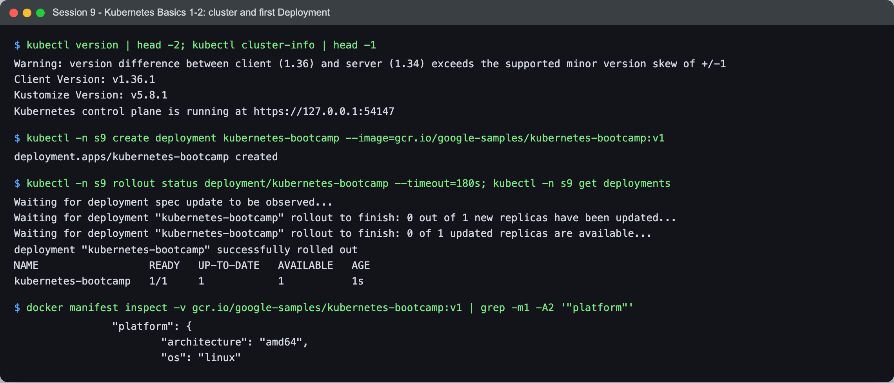
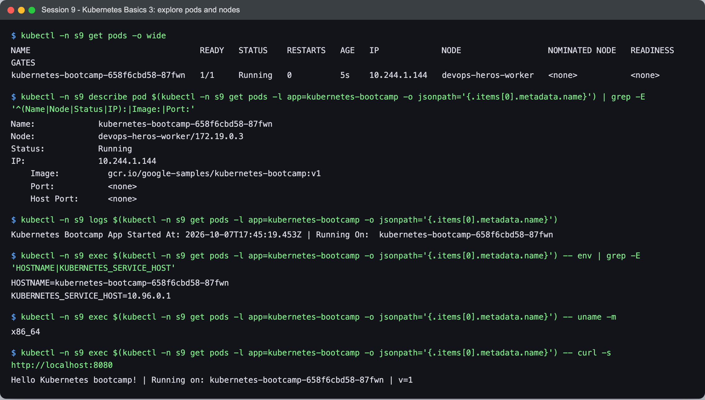
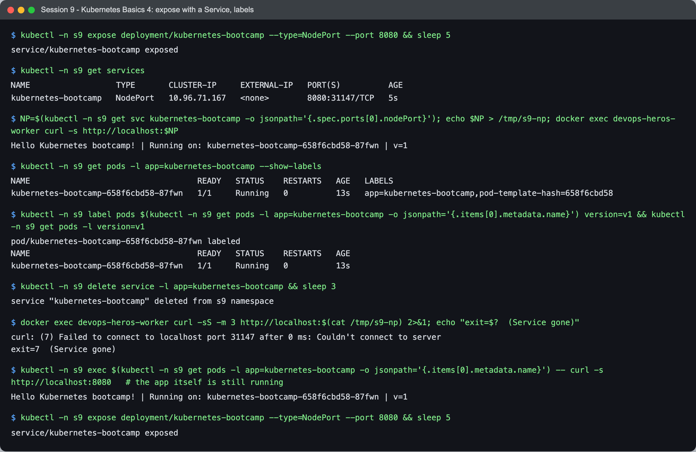
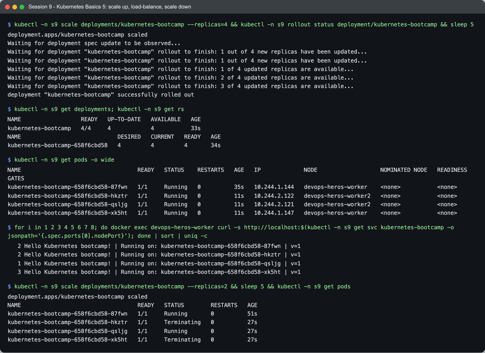
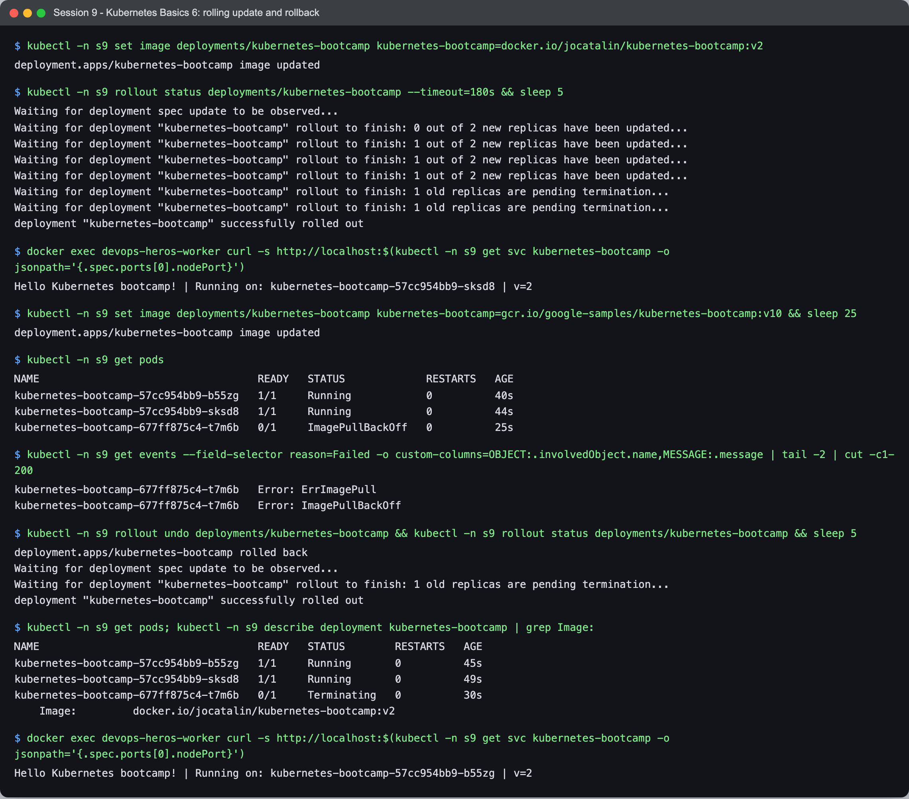

# Session 9 — Kubernetes — Task

- **Name:** Raj Prakash
- **Enrollment No:** 24BCS10328

> **Status:** done
>
> Cluster: **kind v0.30.0**, Kubernetes **v1.34.0**, three nodes, running on Docker Desktop
> on macOS (Apple Silicon).

---

## What the task asked

The homework doc lists five steps, with commands, output screenshots and short architecture
notes as deliverables:

| # | Task | Where |
|---|---|---|
| 1 | Install and configure Minikube | [Cluster setup](#cluster-setup) — I used kind instead, and say why |
| 2 | Verify Kubernetes cluster status | [Cluster setup](#cluster-setup) |
| 3 | Explore Kubernetes architecture | [Cluster architecture](#cluster-architecture) |
| 4 | Learn the basic Kubernetes objects and commands | [First workloads](#first-workloads), [Kubernetes Basics](#kubernetes-basics-tutorial--hands-on) |
| 5 | Perform the Kubernetes Basics tutorial hands-on | [Kubernetes Basics tutorial](#kubernetes-basics-tutorial--hands-on) — all six modules |

The core objects themselves are covered separately in
[session 10](../../session10-k8s-core-objects/task/).

## Cluster setup

The session notes suggest minikube. I used **kind** instead, which
[SETUP.md](../../SETUP.md) lists as the other option — it runs each Kubernetes node as a
Docker container rather than a VM, so it starts in about 30 seconds and, more importantly,
**multi-node clusters are one line of config**. That matters for session 10: a DaemonSet on
a single-node cluster creates exactly one pod and demonstrates nothing.

[`kind-cluster.yaml`](kind-cluster.yaml):

```yaml
kind: Cluster
apiVersion: kind.x-k8s.io/v1alpha4
name: devops-heros
nodes:
  - role: control-plane
  - role: worker
  - role: worker
```

```bash
kind create cluster --config kind-cluster.yaml
kubectl config use-context kind-devops-heros
```


```text
$ kind version
kind v0.30.0 go1.24.6 darwin/arm64

$ kubectl cluster-info
Kubernetes control plane is running at https://127.0.0.1:53196
CoreDNS is running at https://127.0.0.1:53196/api/v1/namespaces/kube-system/services/kube-dns:dns/proxy

$ kubectl get nodes -o wide
NAME                         STATUS   ROLES           AGE   VERSION   INTERNAL-IP   OS-IMAGE                         CONTAINER-RUNTIME
devops-heros-control-plane   Ready    control-plane   58s   v1.34.0   172.19.0.3    Debian GNU/Linux 12 (bookworm)   containerd://2.1.3
devops-heros-worker          Ready    <none>          48s   v1.34.0   172.19.0.5    Debian GNU/Linux 12 (bookworm)   containerd://2.1.3
devops-heros-worker2         Ready    <none>          48s   v1.34.0   172.19.0.4    Debian GNU/Linux 12 (bookworm)   containerd://2.1.3
```

Things worth reading off this:

- The API server is on **`127.0.0.1:53196`** — a random high port on my Mac, forwarded into
  the control-plane container. That is kind's doing; on a real cluster this would be 6443 on
  a routable address.
- The nodes' internal IPs are `172.19.0.x` — an ordinary **Docker bridge network**. These
  "nodes" are containers on my laptop, which is exactly how kind works: a container running
  containerd, running more containers.
- **`CONTAINER-RUNTIME: containerd`**, not Docker. Kubernetes removed the Docker shim in
  v1.24; it talks to containerd through CRI directly. Docker is still how the *nodes* exist,
  but it is not what runs the pods inside them.
- `ROLES <none>` for the workers is normal — a worker is simply a node with no control-plane
  role label, not a node with a "worker" label.

## Cluster architecture

### Namespaces

```text
$ kubectl get namespaces
NAME                 STATUS   AGE
default              Active   58s
kube-node-lease      Active   58s
kube-public          Active   58s
kube-system          Active   58s
local-path-storage   Active   54s
```

- **`default`** — where your things go if you do not say otherwise.
- **`kube-system`** — Kubernetes' own components. Everything below lives here.
- **`kube-node-lease`** — one small Lease object per node, updated a few times a minute. This
  is the node heartbeat: replacing full status updates with tiny lease renewals is what lets
  the control plane track thousands of nodes cheaply.
- **`kube-public`** — world-readable, including unauthenticated clients. Holds cluster info
  needed during bootstrap.
- **`local-path-storage`** — added by kind, the provisioner backing its default StorageClass.

### The control plane, as actual pods

This is the part worth doing rather than reading about — the architecture diagram from the
docs is not an abstraction, the components are running pods you can list:


```text
$ kubectl get pods -n kube-system -o wide
NAME                                                 READY   STATUS    RESTARTS   AGE   IP           NODE
coredns-66bc5c9577-26nfd                             1/1     Running   0          50s   10.244.0.4   devops-heros-control-plane
coredns-66bc5c9577-qqswh                             1/1     Running   0          50s   10.244.0.3   devops-heros-control-plane
etcd-devops-heros-control-plane                      1/1     Running   0          56s   172.19.0.3   devops-heros-control-plane
kindnet-9ctf6                                        1/1     Running   0          50s   172.19.0.3   devops-heros-control-plane
kindnet-p59d6                                        1/1     Running   0          48s   172.19.0.5   devops-heros-worker
kindnet-vbfz5                                        1/1     Running   0          48s   172.19.0.4   devops-heros-worker2
kube-apiserver-devops-heros-control-plane            1/1     Running   0          56s   172.19.0.3   devops-heros-control-plane
kube-controller-manager-devops-heros-control-plane   1/1     Running   0          56s   172.19.0.3   devops-heros-control-plane
kube-proxy-29674                                     1/1     Running   0          50s   172.19.0.3   devops-heros-control-plane
kube-proxy-c824t                                     1/1     Running   0          48s   172.19.0.5   devops-heros-worker
kube-proxy-sz54g                                     1/1     Running   0          48s   172.19.0.4   devops-heros-worker2
kube-scheduler-devops-heros-control-plane            1/1     Running   0          56s   172.19.0.3   devops-heros-control-plane
```

| Component | What it does | Where it runs |
|---|---|---|
| **etcd** | The only stateful thing here. Every object in the cluster is a key in etcd; everything else is stateless and can be restarted freely. | control plane only |
| **kube-apiserver** | The single door to etcd. Nothing else talks to etcd directly — `kubectl`, the scheduler, the kubelets all go through the API server, which is why RBAC and admission control work at all. | control plane only |
| **kube-scheduler** | Watches for pods with no `nodeName` and picks one, on resources, taints, affinity. It only *writes the decision*; it does not start anything. | control plane only |
| **kube-controller-manager** | The reconciliation loops — Deployment, ReplicaSet, Node, endpoints. "Actual state ≠ desired state → act." | control plane only |
| **coredns** | Cluster DNS. Turns `my-svc.my-ns.svc.cluster.local` into a Service IP. | scheduled like any pod |
| **kube-proxy** | Programs iptables/IPVS on each node so Service IPs route to pod IPs. | **every node** |
| **kindnet** | kind's CNI plugin — pod networking. Would be Calico/Flannel/Cilium elsewhere. | **every node** |

Two patterns are visible in that list without being told about them:

- The four components suffixed **`-devops-heros-control-plane`** are static pods: the
  kubelet reads their manifests from `/etc/kubernetes/manifests` on disk and starts them
  directly. That is the bootstrap answer to "how does the API server start if starting things
  requires the API server?".
- **`kube-proxy` and `kindnet` have one pod per node** with random name suffixes — that is a
  DaemonSet, covered in [session 10](../../session10-k8s-core-objects/task/). Anything that
  must exist on every node ships this way.

One component is **not** in this list: the **kubelet**. It runs as a systemd service on each
node, not as a pod, because it is the thing that runs pods. You can see it with
`docker exec devops-heros-worker systemctl status kubelet`.

## First workloads


### A run-to-completion pod

```bash
kubectl run hello-k8s --image=busybox:1.36 --restart=Never -- \
  sh -c 'echo "Hello from a pod - Raj Prakash, DevOps Heros session 9"; echo "node: $(hostname)"'
```

```text
$ kubectl get pods -o wide
NAME        READY   STATUS      RESTARTS   AGE   IP           NODE
hello-k8s   0/1     Completed   0          26s   10.244.2.2   devops-heros-worker2
web-pod     1/1     Running     0          26s   10.244.1.2   devops-heros-worker

$ kubectl logs hello-k8s
Hello from a pod - Raj Prakash, DevOps Heros session 9
node: hello-k8s

$ kubectl get pod hello-k8s -o jsonpath='{.status.phase} restartPolicy={.spec.restartPolicy} exitCode={...}'
Succeeded  restartPolicy=Never  exitCode=0
```

- **`READY 0/1` with `STATUS Completed` is success, not failure.** `0/1` counts *running*
  containers; the phase is `Succeeded` and the exit code is 0. Reading the READY column alone
  would give exactly the wrong answer.
- **`--restart=Never` is what makes this possible.** The default is `Always`, which would
  restart the container the moment it exited and leave the pod in `CrashLoopBackOff` — a
  perfectly healthy command looking like a crashing app.
- **`hostname` returned `hello-k8s`, not the node name.** A pod's hostname is the pod name
  by default. I expected the node and had to check `-o wide` to find the pod had actually
  been scheduled on `devops-heros-worker2`.
- The two pods landed on **different workers**. Nothing asked for that — the scheduler spread
  them, and neither pod was ever told a node.

### A long-running pod

```bash
kubectl run web-pod --image=nginx:alpine
```

```text
$ kubectl exec web-pod -- sh -c 'curl -s -o /dev/null -w "nginx inside the pod -> HTTP %{http_code}\n" http://localhost'
nginx inside the pod -> HTTP 200
```

`Running 1/1` and it really answers HTTP. Its IP is `10.244.1.2`, from the **pod CIDR**
(`10.244.0.0/16`) — a different address space from the nodes' `172.19.0.x`. Every pod gets a
real routable-inside-the-cluster IP, which is the flat network model that makes Services
possible.

That IP is also disposable: delete the pod and the replacement gets a different one. Which
is exactly the problem Services solve, in session 10.

## Kubernetes Basics tutorial — hands-on

The official [Kubernetes Basics](https://kubernetes.io/docs/tutorials/kubernetes-basics/)
tutorial has six modules. I ran each one with the tutorial's own commands and images, on the
same kind cluster, in a namespace `s9` (so `kubectl -n s9`).

### Modules 1–2: create a cluster, deploy an app



```text
$ kubectl version | head -2; kubectl cluster-info | head -1
Warning: version difference between client (1.36) and server (1.34) exceeds the supported minor version skew of +/-1
Client Version: v1.36.1
Kubernetes control plane is running at https://127.0.0.1:54147

$ kubectl -n s9 create deployment kubernetes-bootcamp --image=gcr.io/google-samples/kubernetes-bootcamp:v1
deployment.apps/kubernetes-bootcamp created

$ kubectl -n s9 rollout status deployment/kubernetes-bootcamp --timeout=180s; kubectl -n s9 get deployments
deployment "kubernetes-bootcamp" successfully rolled out
NAME                  READY   UP-TO-DATE   AVAILABLE   AGE
kubernetes-bootcamp   1/1     1            1           1s

$ docker manifest inspect -v gcr.io/google-samples/kubernetes-bootcamp:v1 | grep -m1 -A2 '"platform"'
		"platform": {
			"architecture": "amd64",
```

`create deployment` asked the cluster for one replica of the tutorial app; the scheduler picked
a node and the kubelet there pulled and started it. The last command explains something I
expected to be a problem: the tutorial image exists **only for amd64**, and my nodes are arm64.

### Module 3: explore the app — pods, nodes, logs, exec



```text
$ kubectl -n s9 get pods -o wide
kubernetes-bootcamp-658f6cbd58-87fwn   1/1     Running   0          5s    10.244.1.144   devops-heros-worker

$ kubectl -n s9 describe pod kubernetes-bootcamp-658f6cbd58-87fwn | grep -E '^(Name|Node|Status|IP):|Image:|Port:'
Name:             kubernetes-bootcamp-658f6cbd58-87fwn
Node:             devops-heros-worker/172.19.0.3
Status:           Running
IP:               10.244.1.144
    Image:          gcr.io/google-samples/kubernetes-bootcamp:v1

$ kubectl -n s9 logs kubernetes-bootcamp-658f6cbd58-87fwn
Kubernetes Bootcamp App Started At: 2026-10-07T17:45:19.453Z | Running On:  kubernetes-bootcamp-658f6cbd58-87fwn

$ kubectl -n s9 exec kubernetes-bootcamp-658f6cbd58-87fwn -- env | grep -E 'HOSTNAME|KUBERNETES_SERVICE_HOST'
HOSTNAME=kubernetes-bootcamp-658f6cbd58-87fwn
KUBERNETES_SERVICE_HOST=10.96.0.1

$ kubectl -n s9 exec kubernetes-bootcamp-658f6cbd58-87fwn -- uname -m
x86_64

$ kubectl -n s9 exec kubernetes-bootcamp-658f6cbd58-87fwn -- curl -s http://localhost:8080
Hello Kubernetes bootcamp! | Running on: kubernetes-bootcamp-658f6cbd58-87fwn | v=1
```

The four tools the tutorial teaches: `get` (what and where), `describe` (details — which node,
which IP), `logs` (the container's stdout) and `exec` (run a command inside it). `uname -m`
inside the pod says **`x86_64`** on an arm64 node: Docker Desktop registers QEMU/Rosetta
emulation with the Linux kernel, so the amd64 image runs, slower, instead of failing with
`exec format error`. On a plain arm64 Linux server without that, this tutorial image would not
start. The env vars show Kubernetes injecting the API server's Service address into every pod.

### Module 4: expose the app with a Service, use labels



```text
$ kubectl -n s9 expose deployment/kubernetes-bootcamp --type=NodePort --port 8080
service/kubernetes-bootcamp exposed
$ kubectl -n s9 get services
NAME                  TYPE       CLUSTER-IP     EXTERNAL-IP   PORT(S)          AGE
kubernetes-bootcamp   NodePort   10.96.71.167   <none>        8080:31147/TCP   5s

$ docker exec devops-heros-worker curl -s http://localhost:31147
Hello Kubernetes bootcamp! | Running on: kubernetes-bootcamp-658f6cbd58-87fwn | v=1

$ kubectl -n s9 get pods -l app=kubernetes-bootcamp --show-labels
kubernetes-bootcamp-658f6cbd58-87fwn   1/1     Running   0          13s   app=kubernetes-bootcamp,pod-template-hash=658f6cbd58
$ kubectl -n s9 label pods kubernetes-bootcamp-658f6cbd58-87fwn version=v1 && kubectl -n s9 get pods -l version=v1
pod/kubernetes-bootcamp-658f6cbd58-87fwn labeled
kubernetes-bootcamp-658f6cbd58-87fwn   1/1     Running   0          13s

$ kubectl -n s9 delete service -l app=kubernetes-bootcamp
service "kubernetes-bootcamp" deleted from s9 namespace
$ docker exec devops-heros-worker curl -sS -m 3 http://localhost:31147
curl: (7) Failed to connect to localhost port 31147 after 0 ms: Couldn't connect to server
$ kubectl -n s9 exec kubernetes-bootcamp-658f6cbd58-87fwn -- curl -s http://localhost:8080   # the app itself is still running
Hello Kubernetes bootcamp! | Running on: kubernetes-bootcamp-658f6cbd58-87fwn | v=1
```

`expose` created a NodePort Service (`8080:31147`) whose selector is the Deployment's label
`app=kubernetes-bootcamp`. Labels are how Kubernetes objects find each other — I added my own
`version=v1` and selected on it. Deleting the Service (selected by label too) closed the node
port immediately, while the pod kept serving on its own `localhost:8080`: the Service is only
the access path, not the app.

### Module 5: scale the app



```text
$ kubectl -n s9 scale deployments/kubernetes-bootcamp --replicas=4
deployment.apps/kubernetes-bootcamp scaled
$ kubectl -n s9 get deployments; kubectl -n s9 get rs
kubernetes-bootcamp   4/4     4            4           33s
kubernetes-bootcamp-658f6cbd58   4         4         4       34s

$ kubectl -n s9 get pods -o wide
kubernetes-bootcamp-658f6cbd58-87fwn   1/1   Running   0   35s   10.244.1.144   devops-heros-worker
kubernetes-bootcamp-658f6cbd58-hkztr   1/1   Running   0   11s   10.244.2.122   devops-heros-worker2
kubernetes-bootcamp-658f6cbd58-qsljg   1/1   Running   0   11s   10.244.2.121   devops-heros-worker2
kubernetes-bootcamp-658f6cbd58-xk5ht   1/1   Running   0   11s   10.244.1.147   devops-heros-worker

$ for i in 1 2 3 4 5 6 7 8; do docker exec devops-heros-worker curl -s http://localhost:<nodePort>; done | sort | uniq -c
   2 Hello Kubernetes bootcamp! | Running on: kubernetes-bootcamp-658f6cbd58-87fwn | v=1
   2 Hello Kubernetes bootcamp! | Running on: kubernetes-bootcamp-658f6cbd58-hkztr | v=1
   1 Hello Kubernetes bootcamp! | Running on: kubernetes-bootcamp-658f6cbd58-qsljg | v=1
   3 Hello Kubernetes bootcamp! | Running on: kubernetes-bootcamp-658f6cbd58-xk5ht | v=1

$ kubectl -n s9 scale deployments/kubernetes-bootcamp --replicas=2 && sleep 5 && kubectl -n s9 get pods
kubernetes-bootcamp-658f6cbd58-87fwn   1/1     Running       0          51s
kubernetes-bootcamp-658f6cbd58-hkztr   1/1     Terminating   0          27s
kubernetes-bootcamp-658f6cbd58-qsljg   1/1     Running       0          27s
kubernetes-bootcamp-658f6cbd58-xk5ht   1/1     Terminating   0          27s
```

Scaling changed one number on the ReplicaSet (`DESIRED 4`), and the new pods spread over both
workers. Eight requests through the one Service landed on **all four pods** — the Service load
balances across whatever pods currently match its selector, with no configuration change.
Scaling down terminated two pods; the Service simply stopped sending them traffic.

### Module 6: rolling update — and a rollback



```text
$ kubectl -n s9 set image deployments/kubernetes-bootcamp kubernetes-bootcamp=docker.io/jocatalin/kubernetes-bootcamp:v2
deployment.apps/kubernetes-bootcamp image updated
$ kubectl -n s9 rollout status deployments/kubernetes-bootcamp --timeout=180s
Waiting for deployment "kubernetes-bootcamp" rollout to finish: 1 out of 2 new replicas have been updated...
Waiting for deployment "kubernetes-bootcamp" rollout to finish: 1 old replicas are pending termination...
deployment "kubernetes-bootcamp" successfully rolled out
$ docker exec devops-heros-worker curl -s http://localhost:<nodePort>
Hello Kubernetes bootcamp! | Running on: kubernetes-bootcamp-57cc954bb9-sksd8 | v=2

$ kubectl -n s9 set image deployments/kubernetes-bootcamp kubernetes-bootcamp=gcr.io/google-samples/kubernetes-bootcamp:v10 && sleep 25
$ kubectl -n s9 get pods
kubernetes-bootcamp-57cc954bb9-b55zg   1/1     Running            0          40s
kubernetes-bootcamp-57cc954bb9-sksd8   1/1     Running            0          44s
kubernetes-bootcamp-677ff875c4-t7m6b   0/1     ImagePullBackOff   0          25s
$ kubectl -n s9 get events --field-selector reason=Failed -o custom-columns=OBJECT:.involvedObject.name,MESSAGE:.message | tail -2
kubernetes-bootcamp-677ff875c4-t7m6b   Error: ErrImagePull
kubernetes-bootcamp-677ff875c4-t7m6b   Error: ImagePullBackOff

$ kubectl -n s9 rollout undo deployments/kubernetes-bootcamp
deployment.apps/kubernetes-bootcamp rolled back
deployment "kubernetes-bootcamp" successfully rolled out
$ kubectl -n s9 describe deployment kubernetes-bootcamp | grep Image:
    Image:         docker.io/jocatalin/kubernetes-bootcamp:v2
$ docker exec devops-heros-worker curl -s http://localhost:<nodePort>
Hello Kubernetes bootcamp! | Running on: kubernetes-bootcamp-57cc954bb9-b55zg | v=2
```

- **v1 → v2** was a rolling update: a new ReplicaSet (`57cc954bb9`) scaled up while the old one
  scaled down, and the app answered `v=2` afterwards with no downtime.
- **v2 → v10** (a tag that does not exist, as in the tutorial) got stuck: one new pod in
  ImagePullBackOff, while **both v2 pods kept running** — the rollout never removes old pods
  until new ones are Ready, so the bad release did not take the app down.
- **`rollout undo`** went back to the previous revision (v2) and removed the broken pod. The app
  kept answering `v=2` throughout.

(The tutorial's v2 image is `docker.io/jocatalin/kubernetes-bootcamp:v2` — there is no
`gcr.io/google-samples/kubernetes-bootcamp:v2`; I checked with `docker manifest inspect`.)

## What I learned

- **The control plane is not special infrastructure — it is pods.** Being able to
  `kubectl get pods -n kube-system` and see etcd, the scheduler and the API server as
  ordinary containers made the architecture concrete in a way the diagram had not.
- **Static pods answer the bootstrap paradox.** The kubelet reads manifests off local disk,
  so the API server can start without an API server to start it.
- **`READY 0/1` is not an error state.** For a completed pod it is the correct output, and
  the phase field is what to read.
- **`--restart=Never` matters for anything that finishes.** The default `Always` turns a
  successful one-shot command into a crash loop.
- **The Basics tutorial is the whole Kubernetes loop in six commands**: `create deployment`
  → `get/describe/logs/exec` → `expose` → `scale` → `set image` → `rollout undo`. Each one changes
  a desired state and a controller does the work.
- **Nodes, pods and services live in three different IP ranges** (`172.19.0.x`,
  `10.244.x.x`, and the service CIDR). Keeping them straight is most of what makes cluster
  networking confusing at first.

## Problems I hit

- **`kubectl get nodes` showed `NotReady` immediately after `kind create cluster` returned.**
  Nothing was wrong — the CNI (kindnet) had not finished starting, and a node without pod
  networking is correctly `NotReady`. CoreDNS was `Pending` for the same reason, because it
  cannot be scheduled onto a node that has no network. `kubectl wait --for=condition=Ready
  nodes --all` is the right way to handle it instead of guessing at a sleep.
- **My client and server versions do not match** — `kubectl` v1.36.1 against a v1.34.0
  server. I first thought that was within the supported skew; it is not. kubectl supports
  **±1 minor version**, and 1.36 vs 1.34 is two — newer kubectl now says so on every
  `kubectl version`: `Warning: version difference between client (1.36) and server (1.34)
  exceeds the supported minor version skew of +/-1`. Everything in these sessions worked, but
  the fix is a kubectl matching the cluster (or a kind node image of v1.35+).
- **I assumed `hostname` in a pod would give the node.** It gives the pod name. `-o wide` is
  what actually answers "which node is this on".
